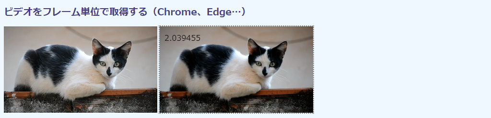

# 第1章 HTML5の画像・ビデオ操作

オリジナルのC/C++やPython版のOpenCVには、ユーザインタフェース機能が用意されています。機能はさほど豊富ではありませんが、画像表示やマウス操作などの簡単なユーザ操作なら、OpenCVだけで記述ができます。

これに対し、JavaScript版のOpenCV.jsにはユーザインタフェース機能がありません。HTML5にすでに用意されているからです。画像の取り込みや表示には、いつもの``、`<video>`、`<canvas>`といったHTML要素（タグ）を用います。カメラからの読み込みも同様で、ブラウザ（ユーザエージェント）を管理する`Navigator`オブジェクトから操作します。キーボードやマウスなどのユーザ操作は、`<input>`などの要素や`onmousedown`などの`Event`オブジェクトで管理します。

本章では、これらのHTML5ユーザインタフェースを、本書の主題であるOpenCVスクリプティングに必要な範囲で説明します。HTML5のメディア機能に問題のない読者は、第2章に進んでください。

CSSも利用できますが、OpenCVとは直接的には関係しません。本書のサンプルコードでは、日本語文字を画像上に提示するために透明なキャンバスを画像の上にオーバーレイする（[1.7節](#17-文字列要素の重畳 "INTERNAL")）、CSS画像フィルタを例題に用いる（[1.8節](#18-ユーザ操作を制御する "INTERNAL")、空白なキャンバスが見えるように枠線を加えるときに使うだけです。用いているCSSファイル（`style.css`）は[付録](TBA "INTERNAL")に掲載してあります。


### 1.1 画像を表示する

#### 画像処理の流れ

WebページでのOpenCVの画像処理の流れを次図から示します。

<!-- 544 x 277 -->


①画像は``で読み込みます。ファイルやURLを選択させるのなら、`<input>`から取得し、スクリプトで``のDOMオブジェクト（`HTMLImageElement`）に貼り付けます（[1.8節](#18-ユーザ操作を制御する "INTERNAL")で説明します）。ビデオならばここは`<video>`になります（[1.2節](#12-ビデオを表示する "INTERNAL")）。画像処理はビデオであっても静止画（フレーム）を対象とするのが基本なので、処理の流れはさほど変わりません（ビデオをフレームに分解するメカニズムは[1.6節](#16-ビデオをフレーム単位で処理する "INTERNAL")）。カメラも同様です（[1.5節](#16-カメラを操作する "INTERNAL")）。

②得られた画像は`<script>`内のOpenCVスクリプトで処理します。画像処理は[第2章](./02-opencv.js "INTERNAL")以降で説明します。

③処理が完了したら、結果の画像を`<canvas>`に貼り付けます。

本節では①の読み込みと③のキャンバスへの貼り付けの方法を、それぞれのHTML要素とそれに対応するDOMオブジェクトを見ながら説明していきます。

#### 画像をキャンバスに貼り付ける

まずは、入力画像を無処理のままキャンバスに貼り付けるという基本動作のスクリプトを取り上げます。スクリプトに入るに先立ち、次に動作画面を示します。


左が読み込んだ画像を表示する``で、右がそのコピーを貼り付けた`<canvas>`です。キャンバスにはその領域が目視できるように点線の枠を付けてありますが、これはCSSによる見栄えの調整なだけで、本質とは無関係です（枠線のスタイルは`outline: 2px gray dotted;`で、本書のCSSはいずれも`style.css`というファイルに収容してあります）。

コードは次の通りです。ファイル名は`html-image1.html`です。

<!-- 動作確認（✔️❌）： Local/Normal Firefox✔️ Chrome✔️ Edge✔️, Local/CORS Firefox Chrome Edge, HTTP Firefox Chrome Edge -->
```html
[File] html-image1.html
  1  <!DOCTYPE html>
  2  <html lang="ja-JP">
  3  <head>
  4    <meta charset="UTF-8">
  5    <link rel=stylesheet type="text/css" href="style.css">
  6  </head>
  7  <body>
  8
  9  <h1>画像を読み込み、キャンバスに表示</h1>
 10
 11  <div>
 12    
 13    <canvas id="canvasTag" class="placeholder"></canvas>
 14  </div>
 15
 16  <script>
 17    let imgElem = document.getElementById('imageTag');
 18    let canvasElem = document.getElementById('canvasTag');
 19    let ctx = canvasElem.getContext('2d');
 20
 21    function showImage() {
 22      ['width', 'height', 'naturalWidth', 'naturalHeight'].forEach(function(d) {
 23        console.log(`img.${d}: ${imgElem[d]}, canvas.${d}: ${canvasElem[d]}`);
 24      });
 25      canvasElem.width = imgElem.width;
 26      canvasElem.height = imgElem.height;
 27      ctx.drawImage(imgElem, 0, 0, imgElem.width, imgElem.height);
 28    }
 29
 30    imgElem.addEventListener('load', showImage);
 31  </script>
 32
 33  </body>
 34  </html>
```

#### img要素

HTMLページに画像ファイルを取り込むには、`src`属性で画像へのパスを指定した``要素を使います（12行目）。

```html
12    
```

画像へのパスを指定する`src`以外の属性は仕様上オプションで、画像処理に専念しているのなら、ほとんど設定の必要はありません。ここでは`width`に320ピクセルを指定していますが、動作確認時に邪魔にならない程度に縮小表示したいからだけです。`height`は未指定ですが、高さは元画像のアスペクト比に準じて自動的に調整されます。この場合、元画像のサイズは1280×885なので、画像高さは1/4の221ピクセルに縮小されます。

必須なのは、スクリプト内部から``要素を特定する`id`属性です。ここでは`id="imageTag"`です。

画像が完全に読み込まれるまでは、処理は始められません。そこで、画像処理を担当するメソッドの`showImage()`（21～28行目）を、読み込み完了通知の`load`イベントの発生を契機に起動させます。これには、``要素をDOM内で識別する`HTMLImageElement`オブジェクトに`addEventListener()`でイベント登録をします。

```javascript
 17    let imgElem = document.getElementById('imageTag');
 ︙
 30    imgElem.addEventListener('load', showImage);
``` 

#### canvas要素

``で取り込んだ画像のコピーを貼り付ける領域（キャンバス）は、`<canvas>`要素から用意します（13行目）。

```html
13    <canvas id="canvasTag" class="placeholder"></canvas>
```

プログラミング上必須なのは`id`属性だけで、ここは`id="canvasTag"`をセットしています。

`width`や`height`属性を指定していないので、ページ上ではデフォルトの300×150のスペースが確保されます。次の画面は画像がコピーされる前の初期状態です。キャンバスサイズがデフォルトのままなのが枠線からわかります。


``同様、スクリプトでの操作用にDOMオブジェクトを用意します（18行目）。`HTMLCanvasElement`オブジェクトです。

```javascript
 18    let canvasElem = document.getElementById('canvasTag');
```

#### 描画コンテキスト

キャンバスに対する操作は、キャンバスの描画コンテキストを介して行います。「コンテキスト」（文脈）とはまた不明瞭な用語ですが、仮想的なキャンバスと考えてください。この仮想的なキャンバスに対して画像貼り付けやグラフィック描画を行うと、`<canvas>`というビューファインダーからそれらが見えるようになるという塩梅です。

描画コンテキストは、`HTMLCanvasElement`の`getContect()`メソッドから取得します（19行目）。

```javascript
 19      let ctx = canvas.getContext('2d');
```

引数には5つほど選択肢がありますが、2次元での描画には2dを指定します（他は3D関連です）。戻り値の`ctx`は、`CanvasRenderingContext2D`というオブジェクトです。

#### 画像のコピー

21～28行目で定義した`showImage()`メソッドは、``要素（`imgElem`）から描画コンテキスト（`ctx`）に画像をコピーします。コピーするメソッドは`CanvasRenderingContext2D`の`drawImage()`メソッドです（27行目）。

```javascript
 27      ctx.drawImage(imgElem, 0, 0, imgElem.width, imgElem.height);
```

第1引数には、コピー元の画像オブジェクト（`HTMLImageElement`の`imgElem`）を指定します。

第2引数と第3引数には、その画像を貼り付けるキャンバス内での(x, y)座標を指定します。ここでは(0, 0)を指定しているので、キャンバスと画像の左上の位置は一致します。

第4引数と第5引数には、貼り付けるサイズを指定します。ここでは、ページ上での``と同じサイズ（`width`属性で指定した320×221）を用いたいので、`imgElem.width`と`imgElem.height`を指定しています。

#### いろいろなサイズ

画像やキャンバスにはサイズを示す複数のプロパティがあります。22～24行目は、参考までにこれをコンソールに印字しています。

```javascript
 22      ['width', 'height', 'naturalWidth', 'naturalHeight'].forEach(function(d) {
 23        console.log(`img.${d}: ${imgElem[d]}, canvas.${d}: ${canvasElem[d]}`);
 24      });
```

単独の`width`、`height`はHTML要素の属性で指定されたサイズを示します。`natural`が先付けされたものはオリジナルのサイズで、``のみです。出力結果を次に示します。

```
img.width: 320, canvas.width: 300
img.height: 221, canvas.height: 150
img.naturalWidth: 1280, canvas.naturalWidth: undefined
img.naturalHeight: 885, canvas.naturalHeight: undefined
```

`width`と`height`は属性値なので、設定のされていなかったキャンバスではデフォルトの300×150のままになっていることがわかります。また、`natural`がキャンバスには定義されていないこともわかります。

キャンバスがデフォルトサイズのままだと、画像もそのサイズで貼り付けられます。もともとは320×221な画像が左上を揃えたうえで300×150で切り取られるので、元画像の下71ピクセルと右20ピクセルが、次の画面のようにクリッピングされます。


そこで、``と`<canvas>`が同じサイズになるように調整します（25～26行目）。

```JavaScript
 25      canvasElem.width = imgElem.width;
 26      canvasElem.height = imgElem.height;
```

もちろん、13行目で次のように`width="320" height="221"`と記述してもかまいません。

```html
 13    <canvas id="canvasTag" width="320" height="221" class="placeholder"></canvas>
```

横縦両方指定しているところに注意してください。``と異なり、未指定側は自動調節されるないので、値はデフォルトのままです。`width="320"`単体での指定はつまり320×150となるので、下部分が次の画面のようにクリッピングされます。前の300×150の画面とは微妙にしか違いませんが、横幅が長いぶん、右端の稜線や湖手前の樹が20ピクセルぶん多く含まれます。


`<canvas>`の属性値をじか書きするのは見た目にはわかりやすいかもしれませんが、画像を変えるたびに、高さを横幅にあわせて手計算しなければなりません。スクリプトで処理したほうが面倒がなくてよいでしょう。

#### 画像の部分コピー

27行目で用いた描画コンテクストの`CanvasRenderingContext2D.drawImage()`メソッドは、引数を調節するだけで、元画像の部分領域を縮小拡大しながらコピーすることもできます。

例を次に示します。

<!-- 枠なし版あり -->


左が元画像です。おおもとの画像サイズは1280×885ですが、``と属性からサイズ指定しているので、320×221と1/4に縮小表示されます。中央は「おおもとの」画像から、左頂点の座標(65, 549)から、横縦が415×315の矩形領域を切り取ったものです。元画像で白枠でくくった部分です。右はこれを縦横ともに、原寸の半分にしています。

ここでは「おおもと」とは``の`width`あるいは`height`でリサイズされる前の画像です。プロパティでいえば`narutalWidth`×`naruralHeight`です。そして、`drawImage()`の第1引数に指定された画像は、このおおもとの画像を指します。

もう一度、`html-image1.html`の27行目を確認します。

```javascript
 27      ctx.drawImage(imgElem, 0, 0, imgElem.width, imgElem.height);
```

`imgElem`のサイズはロードしたファイルのオリジナルのものです。第3、4引数で指定している`HTMLImageElement`の`width`、`height`プロパティは、``の属性から指定した通りの値です。つまり、これは1280×885から320×221への縮小の指示なのです。

`drawImage()`メソッドには引数の異なるバリエーションがいくつかあります。引数を多数指定するフルバージョンは次のようになっています。

```
drawImage(
  image,                       // 入力画像
  sx, sy, sWidth, sHeight,     // 入力上での左上の頂点の座標とそのサイズ
  dx, dy, dWidth, dHeight      // キャンバスでの左上の頂点の座標とそのサイズ
)
```

27行目の記法は3行目の入力側（source）の情報をデフォルトとしたときのものです。つまり、左上の頂点(`sx`, `sy`)は(0, 0)で、サイズの`sWidth`×`sHeihgt`は`image.naruralWidth`×`image.naturalHeight`です。

では、先に示した例を出力するコードを次に示します（ファイル名は`html-image2.html`）。

```html
[File] html-image2.html
  1  <!DOCTYPE html>
  2  <html lang="ja-JP">
  3  <head>
  4    <meta charset="UTF-8">
  5    <link rel=stylesheet type="text/css" href="style.css">
  6  </head>
  7  <body>
  8
  9  <h1>部分画像を読み込み、キャンバスに原寸と1/2で表示</h1>
 10
 11  <div>
 12    
 13    <canvas id="canvasTag1" class="placeholder"></canvas>
 14    <canvas id="canvasTag2" class="placeholder"></canvas>
 15  </div>
 16
 17  <script>
 18    let imgElem = document.getElementById('imageTag');
 19    let canvasElem1 = document.getElementById('canvasTag1');
 20    let ctx1 = canvasElem1.getContext('2d');
 21    let canvasElem2 = document.getElementById('canvasTag2');
 22    let ctx2 = canvasElem2.getContext('2d');
 23
 24    let [x_img, y_img, w_img, h_img] = [65, 549, 415, 315];
 25
 26    function showImage() {
 27      canvasElem1.width = w_img;
 28      canvasElem1.height = h_img;
 29      ctx1.drawImage(imgElem,
 30        x_img, y_img, w_img, h_img,
 31        0, 0, w_img, h_img
 32      );
 33
 34      canvasElem2.width = Math.floor(w_img * 0.5);
 35      canvasElem2.height = Math.floor(h_img * 0.5);
 36      ctx2.drawImage(imgElem,
 37        x_img, y_img, w_img, h_img,
 38        0, 0, canvasElem2.width, canvasElem2.height
 39      );
 40    }
 41
 42    imgElem.addEventListener('load', showImage);
 43  </script>
 44
 45  </body>
 46  </html>
```

キャンバス2つとそれぞれのコンテキストを用意し、それぞれ描いています。画面左の切り出し領域の白枠は24行目で定義してありますが、これはもともとの画像`imgElem`（1280×885）のなかの座標系です。

```javascript
 24    let [x_img, y_img, w_img, h_img] = [65, 549, 415, 315];
```

中央のキャンバス1（`canvasElem1`と`ctx1`）へのリサイズなしの描画は27～31行目です。

```javascript
 27      canvasElem1.width = w_img;
 28      canvasElem1.height = h_img;
 29      ctx1.drawImage(imgElem,
 30        x_img, y_img, w_img, h_img,
 31        0, 0, w_img, h_img
 32      );
```

キャンバスサイズは24行目の横縦サイズをそのまま用いてるので（27、28行目）、これは原寸大です。30行目の画像（入力）側の座標は、もともとの画像の座標系なので24行目そのままです。31行目はこれを原寸大のままキャンバス1に張り付けています（32行目）。

右側のキャンバス2（`canvasElem2`と`ctx2`）は、24行目の領域の半分のサイズです（34、35行目）。37行目の画像の切り抜きはキャンバス1（30行目）と同じです、半分のサイズに縮小してコピーいます（38行目）。

```javascript
 33
 34      canvasElem2.width = Math.floor(w_img * 0.5);
 35      canvasElem2.height = Math.floor(h_img * 0.5);
 36      ctx2.drawImage(imgElem,
 37        x_img, y_img, w_img, h_img,
 38        0, 0, canvasElem2.width, canvasElem2.height
 39      );
```


### 1.2 ビデオを表示する

#### video要素

ビデオを表示するには`<video>`要素を用います。本節ではこの`<video>`のベーシックな用法と、ボタンクリックでフレームをキャプチャする方法を示します。

まずはベーシックな用法です。動作状況を次の画面に示します。


コードは次の通りです（ファイル名は`html-video1.html`）。

```html
[File] html-video1.html
  1  <!DOCTYPE html>
  2  <html lang="ja-JP">
  3  <head>
  4    <meta charset="UTF-8">
  5    <link rel=stylesheet type="text/css" href="style.css">
  6  </head>
  7  <body>
  8
  9  <h1>ビデオ表示</h1>
 10
 11  <div>
 12    <video id="videoTag" width="480" controls src="samples/cat.mp4"
 13      type="video/mp4">
 14    </video>
 15  </div>
 16
 17  <script>
 18    let startTime = Date.now();
 19    let videoElem = document.getElementById('videoTag');
 20
 21    function showMetadata(evt) {
 22      console.log(`Video properties:
 23        Size offset:    ${videoElem.offsetWidth} x ${videoElem.offsetHeight}
 24        Size (element): ${videoElem.width} x ${videoElem.height}
 25        Size video:     ${videoElem.videoWidth} x ${videoElem.videoHeight}
 26        Duration:       ${videoElem.duration}s
 27        CurrentTime:    ${videoElem.currentTime}s
 28        Volume:         ${videoElem.volume} [0, 1]
 29        Play rate:      ${videoElem.playbackRate}
 30        Loop:           ${videoElem.loop}`
 31      );
 32    }
 33
 34    let events = [
 35      'ended', 'error', 'loadeddata', 'loadedmetadata', 'loadstart', 'pause', 'play',
 36      'playing', 'seeked', 'seeking', 'suspend', 'volumechange'
 37    ];
 38    events.forEach(function(evt) {
 39      videoElem.addEventListener(evt, function() {
 40        let delta = (Date.now() - startTime).toLocaleString();
 41        console.log(`${delta}. event: ${evt}`);
 42      });
 43    });
 44
 45    videoElem.addEventListener('loadedmetadata', showMetadata);
 46  </script>
 47
 48  </body>
 49  </html>
```

ビデオを流すだけなら`<video>`だけでよいのですが、ビデオのプロパティやイベントを説明するための参考情報のために長くなっています。

#### video要素の属性

12～13行目の`<video>`で設定する属性で必須なものは、この要素を識別するIDと`src`だけで、その他はオプションです。

```html
 12    <video id="videoTag" width="480" controls src="samples/cat.mp4"
 13      type="video/mp4">  
```

`src`のメディアタイプを示す`type`属性はあったほうがよいでしょう。ブラウザは、ビデオファイルがサポートされているかを、読み込み前にこの属性から確認するからです。なければ、とりあえず読み込んでから検証するので、サポート外だったりしたときには無用なネットワークアクセスが発生します。これは、`<video>`の子要素である`<source>`から複数のタイプのビデオを用意し、ブラウザに最適なものを選択させるときに効果を発揮します。もっとも、本書では長くなるので（紙面の1行に収まらないのが嫌で）、ここ以外では省いています。

ビデオ操作のための属性のなかでもよく用いるものを次の表に示します。

属性 | デフォルト値 | 意味 
---|---|---
`autoplay` | `false`（しない） | この属性が記述されていると、ビデオが自動再生される。
`controls` | `false`（なし） | この属性が記述されていると、再生ボタンなどの操作パネルが表示される。
`loop` | `false`（1回だけ） | この属性が記述されていると、末尾まで再生するとまた先頭に戻る。
`poster` | なし | URLを指定すると、ビデオの先頭フレームがダウンロードされるまで、その画像が表示される。

`controls`を加えると、再生、一時停止、先送りなどの操作をするパネルが表示されます。インタフェースは当然、ブラウザによって異なります。操作パネルが初期状態で表示されなくても、たいていは左マウスクリックで引き出されるので、操作に困ることはありません。

起動時に自動再生をする`autoplay`とサウンドをミュートにする`muted`はたいていペアで指定します。ページアクセスと同時に大音量でビデオが始めると、職場や学校で恥ずかしい思いをします。

#### HTMLVideoElementのイベント

`HTMLVideoElement`には一般的なものに加えて、たくさんのイベントが用意されています。どのタイミングでこれらが発生するかを確認できるよう、コードの34～43行目で代表的なものを12点登録しています。発生時点がわかりやすいよう、イベント名とともにスクリプト起動時（18行目）からの時間差（40行目）もコンソールに表示します。

```javascript
 34    let events = [
 35      'ended', 'error', 'loadeddata', 'loadedmetadata', 'loadstart', 'pause', 'play',
 36      'seeked', 'seeking', 'suspend', 'volumechange'
 37    ];
 38    events.forEach(function(evt) {
 39      videoElem.addEventListener(evt, function() {
 40        let delta = (Date.now() - startTime).toLocaleString();
 41        console.log(`${delta}. event: ${evt}`);
 42      });
 43    });
```

これらイベントの意味を次の表に示します。

イベント | 発火タイミング
---|---
`ended` | ビデオが最後まで行ったとき。ループ時には発火しない。
`error` | ネットワーク障害など、読み込み失敗時。
`loadeddata` | 最初のフレームが読み込まれたとき。以降のフレームでは出てこない。
`loadedmetadata` | フレームサイズなどビデオのメタデータが読み込まれたとき。`loadeddata`よりも先。
`pause` | （操作パネルなどから）一時停止されたとき。
`play` | 再生開始時。`suspend`のあとに出る。
`seeked` | （操作パネルなどから）先送りや後戻りの操作が完了したとき。
`seeking` | （操作パネルなどから）先送りや後戻りの操作が開始したとき。`seeked`よりも先。
`suspend` | データ読み込みが中断されたとき。たいていは`pause`の前。
`volumechange` | 音量が変更されたとき。

大半はオーディオと共通しているので、これらイベントは`HTMLVideElement`の親クラスの`HTMLMediaElement`に属しています。

コンソール出力を次に示します。把握しやすいように21～31行目の出力は省いています。左の数値は起動時からのミリ秒を示します。右のコメントは筆者の操作を説明しています。

```
2. event: loadedmetadata      // ページアクセス
5. event: loadeddata
2,210. event: play            // 操作パネルから▷（再生）をクリック
2,513. event: suspend         // 操作パネルから⏸︎（一時停止）をクリック
4,291. event: pause
5,991. event: seeking         // 操作パネルから●（再生位置）をドラッグして再生位置を変更
6,023. event: seeked
6,139. event: seeking
26,158. event: seeking
︙                            // seeking/seeked が繰り返される
6,292. event: seeking
6,294. event: seeked
8,363. event: play            // 操作パネルから▷（再生）をクリック
9,804. event: pause           // 操作パネルから⏸︎（一時停止）をクリック
```

ビデオのサイズや時間長などの情報を得るのは`loadedmetadata`よりあとでなければなりません。コピーなどフレーム操作は`loadeddata`後です。両者はほぼ同時ですが、それでも（ここでは）3ミリ秒の間隔が空いているところに注意してください。

再生位置変更の`seeking`と`seeked`は操作中は連続して出てくるところもポイントです。

#### HTMLVideoElementのプロパティ

コードの21～32行目に定義した`showMetadata()`メソッドは、ビデオのメタデータをコンソールに表示します。このメソッドは、45行目から`loadedmetadata`イベントを契機に起動するよう登録してあります。

```javascript
 21    function showMetadata(evt) {
 22      console.log(`Video properties:
 23        Size offset:    ${videoElem.offsetWidth} x ${videoElem.offsetHeight}
 24        Size (element): ${videoElem.width} x ${videoElem.height}
 25        Size video:     ${videoElem.videoWidth} x ${videoElem.videoHeight}
 26        Duration:       ${videoElem.duration}s
 27        CurrentTime:    ${videoElem.currentTime}s
 28        Volume:         ${videoElem.volume} [0, 1]
 29        Play rate:      ${videoElem.playbackRate}
 30        Loop:           ${videoElem.loop}`
 31      );
 32    }
 ︙
 45    videoElem.addEventListener('loadedmetadata', showMetadata);
```

出力を、直前のイベントも含めて次に示します。後付けのコメントにプロパティ名を示しました。

```
2. event: loadedmetadata           // loadmetada以降に取得可
Video properties:
      Size offset:    480 x 270    // offsetWidth、offsetHeight
      Size (element): 480 x 0      // width、height
      Size video:     640 x 360    // videoWidth、videoHeight
      Duration:       9.217542s    // duration
      CurrentTime:    0s           // currentTime
      Volume:         1 [0, 1]     // volume
      Play rate:      1            // playbackRate
      Loop:           false        // loop
```

ここで注意が必要なのは、`videoElem.height`が0なところです。`<video>`要素の横幅は`width`属性で設定してあっても、`height`は指定しないないからです。``ではアスペクト比から無指定の辺の長さを自動で設定してくれましたが、`<video>`ではそうではないところが注意点です。

そのため、キャンバスサイズの調整にはこれらプロパティは使えません。そこで、代替として`offsetWidth`と`offsetHeight`を使うことになります。これらプロパティには実際に画面上にレンダリングされたときのサイズで、あれば境界線、パディング、スクロールバーのぶんも含まれるので、正確にはフレームサイズと異なることもあります。その場合、次の`videoWidth`と`videoHeight`から算出するアスペクト比から未指定の側を計算します。

`HTMLImageElement`同様、オリジナルのサイズもプロパティから知ることができます。ただ、`videoWidth`と`videoHeight`だったりするので、紛らわしいのが玉に瑕です。

時間長を示す`duration`と現在時刻の`currentTime`の単位は秒で、浮動小数点数です。メタデータにはビデオの総フレーム数やフレームレート（秒間に再生するフレームの枚数）がたいていは備わっていますが、HTML5では取得できません（オリジナルのOpenCVではできますが、OpenCV.jsはサポートしていません）。

`volume`は音量で0.0から1.0の浮動小数点数です。0.0が無音、1.0が最大を示します。デフォルトは1.0です。このプロパティには対応するHTML属性がないので、`<video>`の中からあらかじめ音量を指定したいときは次のようにイベントリスナーから設定します。

```html
<video id="videoTag" src="samples/cat.mp4" onloadedmetadata="this.volume=0.4;">
```

`playbackRate`は再生速度で1.0が通常スピードです。2.0なら倍速、負の値にすれば逆方向に進みます。これも対応するHTML属性はありません。

`loop`は同名のHTML属性と同じで、オートリ―ピートをかけるか否かを真偽値で指定します。デフォルトは`false`です。

#### ビデオキャプチャ

続いて、再生中のビデオフレームをキャプチャしてキャンバスに表示します。おまけに、キャプチャ画面にはフレーム番号と時間を埋め込みます。

実行例の画面は次の通りです。


コードは次の通りです（ファイル名は`html-video2.html`）。

```html
[File] html-video2.html
  1  <!DOCTYPE html>
  2  <html lang="ja-JP">
  3  <head>
  4    <meta charset="UTF-8">
  5    <link rel=stylesheet type="text/css" href="style.css">
  6  </head>
  7  <body>
  8
  9  <h1>ビデオキャプチャ</h1>
 10
 11  <div>
 12    <video id="videoTag" width="480" autoplay muted src="samples/cat.mp4"></video>
 13    <canvas id="canvasTag" class="placeholder"></canvas>
 14  </div>
 15  <div>
 16    <input type="button" value="Snap!" class="click" onclick="showImage();"/>
 17  </div>
 18
 19  <script>
 20    let videoElem = document.getElementById('videoTag');
 21    let canvasElem = document.getElementById('canvasTag');
 22    let ctx = canvasElem.getContext('2d');
 23
 24    function showImage() {
 25      canvasElem.width = videoElem.offsetWidth;
 26      canvasElem.height = videoElem.offsetHeight;
 27      ctx.drawImage(videoElem, 0, 0, videoElem.offsetWidth, videoElem.offsetHeight);
 28
 29      let quality = videoElem.getVideoPlaybackQuality();
 30      let frameNumber = quality.totalVideoFrames;
 31      let currentTime = videoElem.currentTime;
 32      ctx.font = '16px sans-serif';
 33      ctx.fillText(`Snapped at ${frameNumber} ${currentTime}`, 10, 30);
 34    }
 35
 36    videoElem.addEventListener('loadeddata', showImage);
 37  </script>
 38
 39  </body>
 40  </html>
```

基本構成はこれまでと変わりません。

加わったのは、キャプチャを指示するボタン（16行目）、貼り付け先のキャンバスとそのコンテキスト（13、21～22行目）、そしてキャンバスサイズを現在の`<video>`と同じにするためのプロパティ設定（25～26行目）です。12行目のHTML要素では指定してないので`height`プロパティが0なので、`offsetWidth`と`offsetHeight`を使います。0のままでもエラーにはなりませんが、キャプチャ画像は高さ0では見えません（ただし枠線は見えます）。

フレーム番号と現在時刻は、描画コンテキストのメソッド`fillText()`から描き込みます（32～33行目）。第1引数が描く文字列、第2、第3引数がそのキャンバス上で位置座標です。デフォルトでは文字列左下がこの位置に重ねられます。したがって、第3引数はフォントの高さぶんのスペースを加味した位置を指定します。フォントは描画コンテクストの`font`属性から指定します。

描画コンテクスト（`CanvasRenderingContext2D`オブジェクト）にはフォント設定プロパティ以外にも、直線や幾何学図形を描く多様なメソッドが用意されています。同様な機能はOpenCVにも備わっているので、本書では、必要ならそちらを使います。

なお、OpenCVの文字列描画機能はフォントの都合で英文字だけに対応しています。日本語文字列を描くのなら、HTML5の機能を使わなければなりません。

#### 品質メトリックス

フレーム番号は品質メトリックスを管理する`VideoPlaybackQuality`オブジェクトから取得します。

このオブジェクトは`HTMLVideoElement.getVideoPlaybackQuality()`から得られます（29行目）。そして、フレーム番号はその`totalVideoFrames`プロパティから取得できます（30行目）。

```javascript
 29      let quality = videoElem.getVideoPlaybackQuality();
 30      let frameNumber = quality.totalVideoFrames;
 ︙
 33      ctx.fillText(`Snapped at ${frameNumber} ${currentTime}`, 10, 30);
```

プロパティ名が示すように、これは「これまでに得られたフレームの数」を収容しています。したがって、フレーム落ちがあればそのぶんは含まれていませんし、リピート再生をしていれば全フレーム数の何倍ものフレーム数が報告されますし、スライダで途中を飛ばせばそのぶんはなかったことになります。ユーザ操作なしで最初から最後まで再生したとしても、それが本当の総フレーム数である保証はありません。

しかし、厳密なフレーム単位の処理を必要とはしないHTML5では、これが精一杯であり、参考程度にしかなりません。

加えて、このプロパティをサポートしてないブラウザもあります。

31行目で得ている現在時間のほうが正確なので、フレーム位置を特定したいときはそちらを用います。

```javascript
 31      let currentTime = videoElem.currentTime;
 33      ctx.fillText(`Snapped at ${frameNumber} ${currentTime}`, 10, 30);
```


### 1.3 ビデオキャプションを加える

#### track要素

ビデオには`<track`>要素から字幕を加えることができます。HTMLの仕様はビデオ（あるいはオーディオ）の特定の時間範囲内に付随するデータ全般をテキストトラックと総称しますが、ここでは字幕と呼びます。

本節では`<track>`の基本的な用法を示し、次いで字幕ファイル（WebVTTファイル）の作成方法を説明します。そのうえで、スクリプトから`<track>`オブジェクトの字幕テキストを抽出する方法を示します。

まず、基本用法のコードの実行画面を次に示します。


> 注意：字幕ファイルをローカル（`file:///...`）から読み込むと、クロスサイトリソース共有（CORS）制約に抵触し、エラーが上がります。CORSについては[第2章](TBA "INTERNAL")で説明します。

字幕は（とくに設定がなければ）自動で配置されます。上の画面では操作パネルが表示されているのでその上に描画されますが、パネルがなければ画面下端に置かれます。

コードを次に示します（ファイル名は`html-caption1.html`）。JavaScriptなし、ピュアにHTMLだけです。

```html
[File] html-caption1.html
  1  <!DOCTYPE html>
  2  <html lang="ja-JP">
  3  <head>
  4    <meta charset="UTF-8">
  5    <link rel=stylesheet type="text/css" href="style.css">
  6    <script async src="libs/opencv.js" type="text/javascript"></script>
  7  </head>
  8  <body>
  9
 10  <h1>字幕付きビデオ</h1>
 11
 12  <div>
 13    <video id="videoTag" width="480" controls autoplay muted>
 14      <source src="samples/cat.mp4" type="video/mp4"/>
 15      <track id="trackTag" kind="captions" srclang="ja" src="samples/cat.vtt"/>
 16    </video>
 17  </div>
 18
 19  </body>
 20  </html>
```

HTMLの仕様では、データはVTTフォーマットで書かれた別ファイルで、`<video></video>`要素の間に挟まれた`<track>`要素から指定されます（15行目）。

```html
 12    <video id="videoTag" width="480" controls autoplay muted>
 13      <source src="samples/cat.mp4" type="video/mp4"/>
 14      <track id="trackTag" kind="captions" srclang="ja" default src="samples/cat.vtt"/>
 15    </video>
```

`<track>`要素には、VTTファイルを`src`属性から指定します。スクリプトから特定できるよう、`id`属性も必須です。

英日独仏など各国語の字幕に対応できるよう、`<track>`は複数挟むことができます。`default`属性は、その中でもどれをデフォルトに用いるかを指定するものです。上記のコードでは1つしかないので不必要な気もしますが、`default`指定がなければ、操作パネルから能動的に選択しなければ字幕は表示されません。

`kind`は字幕の種類を示します。たとえば、テキストデータが字幕（subtitiles）なのか、クローズドキャプション（captions）なのかを示します。指定可能なキーワードは現在5種類が定義されているので、詳しいことはMDNの`<track>`の説明を参照してください。たいていはcaptionsを指定すれば問題はありません。

`srctag`はテキストデータの言語を示します。これを「言語タグ」と言います。`kind`にsubtitlesキーワードを指定したときには、必須の属性です。使用できる言語タグはインターネット標準のRFC 5646で定義されており、次のIANA（インターネットの標準化機構）のURLから全リストをチェックできます。

```https://www.iana.org/assignments/language-subtag-registry/language-subtag-registry```

付け足しですが、`<video></video>`の間（子要素）には`<source>`も指定できます（13行目）。普段使いでは`<video src="...">`から指定するビデオソースのURLを、複数指定できるようになります。複数指定するのは、ブラウザがそのリストの中からサポートしている、あるいは優先度の高いメディアタイプを選択できるようにするためです。本書ではここ以外では使っていません。

#### WebVTTファイル

字幕データはWebVTT（Web Video Text Track）と呼ばれるフォーマットで別ファイルに記述します。仕様は、W3Cのワーキンググループが開発中の「WebVTT: The Web Video Text Tracks Format」で規定されています。URLを次に示します。

```https://www.w3.org/TR/webvtt1/```

ファイルはメモ帳などで作成できるテキスト形式で、文字エンコーディングにはUTF-8を用います。

ここで使用したファイル（`samples/cat.vtt`）を次に示します（行番号はファイルには含まれません）。

```
[File] cat.vtt
  1  WEBVTT - 白黒ぶち猫
  2
  3
  4  00:00.000 --> 00:03.500
  5  あ、まんまくれるのかにゃ。
  6
  7  00:04.000 --> 00:08.999
  8  なんだ、くれないんだ。
  9  じゃ、いいや。
```

ファイル先頭には文字列でWEBVTTと示します。同じ行に、スペースを挟んで好みの文字を書き込んでもよいので、たいていは中身を短く説明する文を入れます。

先頭行から2つ以上空行を入れます。WebVTTの改行LFだけ、CRだけ、CRLFのいずれでもよいことになっていますが、CRLFがよいでしょう。

字幕を出すタイミングとその文章の個々のかたまりを、仕様ではキュー（cue）と呼びます。キューの間には空行を1つ以上入れます。

キューの先頭は表示タイミングで、時:分:秒.ミリ秒で記述します（仕様ではcue timing）。上記の例のように、時は0なら省いてもかまいません。表示タイミングは開始と終了からなり、その間にはスペースと「-->」（ハイフン2つと大なり記号）とスペースを挟みます。

表示タイミングに続けて、表示する文を書きます（cue payload）。複数行でもかまいません。

表示タイミングは必ずしも連続している必要はありません。上記の例では、最初のキューは3.5秒のタイミングで消え、次は4.0秒で登場します。3.5～4.0の間は字幕が表示されないだけです。

#### 字幕の操作

字幕データはJavaScriptから操作できます。動作状況を次の画面から示します。


コンソールには、字幕が表示された時刻とその文字列が表示されます。3.5秒時点から0.5秒間は字幕がないので、その旨示しています。

コードを次に示します（ファイル名は`html-caption2.html`）。

```html
[File] html-caption2.html
  1  <!DOCTYPE html>
  2  <html lang="ja-JP">
  3  <head>
  4    <meta charset="UTF-8">
  5    <link rel=stylesheet type="text/css" href="style.css">
  6    <script async src="libs/opencv.js" type="text/javascript"></script>
  7  <body>
  8
  9  <h1>字幕付きビデオ（字幕操作）</h1>
 10
 11  <div>
 12    <video id="videoTag" width="480" controls>
 13      <source src="samples/cat.mp4" type="video/mp4"/>
 14      <track id="trackTag" kind="captions" srclang="ja" default src="samples/cat.vtt"/>
 15    </video>
 16  </div>
 17
 18  <script>
 19    let videoElem = document.getElementById('videoTag');
 20    let trackElem = document.getElementById('trackTag');
 21
 22    function showCue(evt) {
 23      let cueList = evt.target.track.activeCues;
 24      if (cueList.length > 0)
 25        console.log(`${videoElem.currentTime} ${cueList[0].text}`);
 26      else
 27        console.log(`${videoElem.currentTime} Cue changed but no cue`);
 28    }
 29
 30    trackElem.addEventListener('cuechange', showCue);
 31  </script>
 32
 33  </body>
 34  </html>
```

#### HTMLTrackElementオブジェクトと字幕情報

字幕情報は、`<track>`オブジェクトの`HTMLTrackElement`（20行目）から操作します。

```javascript
20    let trackElem = document.getElementById('trackTag');
```

このオブジェクトにはHTML要素の一般的なイベントに加え、`cuechange`というイベントが用意されています。その名の通り、字幕表示に変更があったときに上がってくるものなので、字幕が消えたときにも発生します。実行例で無字幕状態になった3.5秒時点がこれに該当します。

本コードでは、処理メソッド`showCue()`（22～28行目）を登録しています（30行目）。

```javascript
 22    function showCue(evt) {
 23      let cueList = evt.target.track.activeCues;
 24      if (cueList.length > 0)
 25        console.log(`${videoElem.currentTime} ${cueList[0].text}`);
 26      else
 27        console.log(`${videoElem.currentTime} Cue changed but no cue`);
 28    }
 29
 30    trackElem.addEventListener('cuechange', showCue);
```

字幕情報は`HTMLTrackElement`の`track`プロパティに収容されています。31行目の変数を使えば`trackElem.track`ですが、ここは処理メソッドが上がってきたイベントオブジェクト（22行目の`evt`）からアクセスするので`evt.target.track`と書いています（23行目）。

`HTMLTrackElement.track`は`TextTrack`というオブジェクトです。この中には`activeCues`という、現在使用中のキューを収容したプロパティが用意されています。複数形であることからわかるように、これは配列のような列挙型オブジェクトです（`TextTrackList`）。23行目では、これをいったん変数`cueList`に格納しています。

その時点で字幕が表示されていれば、そこに複数のキューが収容されています。その数は`length`から知ることができます（24行目）。字幕が表示されていなければ、この値は0です。

ここではキューは1つしかないので、`TextTrackList`の0番目の要素にアクセスします（25行目の`cueList[0]`）。これは`TextTrackCue`というオブジェクトで、その中には（いろいろありますが）`text`という字幕文字列を収容したプロパティがあります。25行目で表示しているのはこれです。

`HTMLTrackElement`から字幕文字列（`string`）に至るには、いくつものオブジェクトを経由しなければなりません。次図に模式的にオブジェクトの連携を示します。

<!-- 847x275 -->


### 1.4 いろいろなビデオ操作

#### ビデオアプリケーション

[1.2節](#12-ビデオを表示する "INTERNAL")で説明した方法でビデオのフレームや情報を取得、あるいはセットすることができれば、ビデオを操作するいろいろなアプリケーションを作成できます。

ここでは次の2つのアプリケーションを紹介します。

- ビデオシャッフリング ... フレームをランダムに行き来します。音楽トラックをランダムに選択するシャッフリングと考え方は同じで、フレーム単位でそれが行われます。
- ビデオサムネール ... 一定間隔でフレームを抽出し、それらを並べた画像を生成することで、ビデオ全体を一覧できるようにします。

#### ビデオシャッフリング

ビデオプロパティのひとつに、現在時刻を示す`currentTime`があります。このプロパティは読み書きのどちらもサポートしているので、値を書き込めば、その位置にビデオがジャンプします。この時間操作を繰り返し行うのが、ビデオを行ったり来たりするシャッフリングで。

ここでは、ビデオ画面上で<kbd>ALT</kbd>キーを押下しながらマウスクリックしたら、ランダムな位置に飛ぶスクリプトを書きます。

コードは次の通りです（ファイル名は`html-shuffle.html`）。

```html
[File] html-shuffle.html
  1  <!DOCTYPE html>
  2  <html lang="ja-JP">
  3  <head>
  4    <meta charset="UTF-8">
  5    <link rel=stylesheet type="text/css" href="style.css">
  6  </head>
  7  <body>
  8
  9  <h1>ビデオ ランダムシャッフリング</h1>
 10
 11  <p>ビデオ上で <kbd>ALT</kbd> キーを押しながらマウスクリックすれば、ランダムにシークします</p>
 12
 13  <div>
 14    <video id="videoTag" width="480" src="samples/cat.mp4"></video>
 15  </div>
 16
 17  <script>
 18    let videoElem = document.getElementById('videoTag');
 19
 20    function ready() {
 21      videoElem.controls = false;
 22      videoElem.loop = true;
 23      videoElem.muted = true;
 24      videoElem.play();
 25    }
 26
 27    function seeked() {
 28      console.log(`Seeked to ${videoElem.currentTime}`);
 29    }
 30
 31    function clicked(evt) {
 32      if (evt.altKey === true) {
 33        let nextPos = videoElem.duration * Math.random();
 34        videoElem.currentTime = nextPos;
 35      }
 36    }
 37
 38    videoElem.addEventListener('loadeddata', ready);
 39    videoElem.addEventListener('click', clicked);
 40    videoElem.addEventListener('seeked', seeked);
 41  </script>
 42
 43  </body>
 44  </html>
```

特定のイベントに結び付けられたメソッドが3つ用意してあります。

`ready()`メソッド（20～25行目）はビデオが準備できたとき、つまり`loadeddata`イベントが発生したとき（38行目）にビデオの各種設定をします。

```javascript
 20    function ready() {
 21      videoElem.controls = false;
 22      videoElem.loop = true;
 23      videoElem.muted = true;
 24      videoElem.play();
 25    }
 ︙
 38    videoElem.addEventListener('loadeddata', ready);
```

21～23行目はいずれも、対応する`HTML`属性からも設定ができますが、ここではスクリプトから設定しています。24行目の`play()`メソッドは再生を開始する命令で、`autoplay`属性に相当します。

`clicked()`メソッド（31～36行目）はビデオ部分がマウスクリックされたとき、つまり、他の要素でもよく用いられる`click`イベントが発生したとき（39行目）に`currentTime`プロパティをランダムに変更します。

```javascript
 31    function clicked(evt) {
 32      if (evt.altKey === true) {
 33        let nextPos = videoElem.duration * Math.random();
 34        videoElem.currentTime = nextPos;
 35      }
 36    }
 39    videoElem.addEventListener('click', clicked);
```

<kbd>ALT</kbd>キーが押下されているときのみシャッフルするので、上がってきたイベント`evt`（31行目）の`altKey`プロパティをチェックします（32行目）。フラグが立っていれば、`HTMLVideoElement.currentTime`を先頭から末尾（`duration`）までのランダムな位置に変更します（33～34行目）。

`seeked()`メソッド（27～29行目）はビデオでシーク（移動）が発生したとき（`seeked`イベント）に、コンソールに新しい位置を表示するためのものです。

紙面ではフレームがジャンプするところを再現できないので、実行画面は割愛し、`seeked()`が出力するコンソールメッセージを次に示します。

```
Seeked to 2.916887             // 開始後、ALT-click
Seeked to 0.00032              // 末尾からオートリピートで先頭に戻った
Seeked to 5.787036             // 再びALT-Click
```

#### ビデオサムネール

サムネールは、縮小した見本画像を並べた画像です。親指の爪（thumbのnail）サイズだから、サムネールです。ネガフィルム（銀塩）写真の時代にはべた焼き、あるいはコンタクトシートと呼ばれました。

サムネールの利点は高い一覧性です。欠点は、小さくし過ぎると画像を認識できなくなることです。では大きくすればよいかというと、それに伴って台紙も大きくなるので、数が多いとディスプレイに収まらなくなり、逆に一覧性が低下します。

ここでは、ビデオから一定間隔で抜き出したフレームを、プレーンなキャンバスに縮小して格子状に張り付けることで作成します。次に、サンプルの画面を示します。


コードを次に示します（ファイル名は`html-thumbnail.html`）。

```html
[File] html-thumbnail.html
  1  <!DOCTYPE html>
  2  <html lang="ja-JP">
  3  <head>
  4    <meta charset="UTF-8">
  5    <link rel=stylesheet type="text/css" href="style.css">
  6  </head>
  7  <body>
  8
  9  <h1>ビデオ サムネール</h1>
 10
 11  <div>
 12    <video id="videoTag" width="480" src="samples/cat.mp4"></video>
 13    <canvas id="canvasTag" class="placeholder"></canvas>
 14  </div>
 15
 16  <script>
 17    let sheetSize = {width: 4, height: 3};
 18    let imgWidth = 128;
 19    let imgHeight = undefined;
 20    let count = 0;
 21    let timeSeries = undefined;
 22
 23    let videoElem = document.getElementById('videoTag');
 24    let canvasElem = document.getElementById('canvasTag');
 25    let ctx = canvasElem.getContext('2d');
 26
 27    function prepare() {
 28      let aspect = videoElem.videoHeight / videoElem.videoWidth;
 29      imgHeight = Math.floor(imgWidth * aspect);
 30      canvasElem.width = imgWidth * sheetSize.width;
 31      canvasElem.height = imgHeight * sheetSize.height;
 32
 33      let number = sheetSize.width * sheetSize.height;
 34      let duration = videoElem.duration / number;
 35      timeSeries = [...Array(number).keys()].map(i => i * duration);
 36
 37      videoElem.muted = true;
 38      videoElem.play();
 39    }
 40
 41    function pasteFrame() {
 42      let pos_x = (count % sheetSize.width) * imgWidth;
 43      let pos_y = Math.floor(count / sheetSize.width) * imgHeight;
 44      ctx.drawImage(videoElem, pos_x, pos_y, imgWidth, imgHeight);
 45    }
 46
 47    function timeUpdated() {
 48      if (videoElem.currentTime > timeSeries[count]) {
 49        console.log(`${count} at ${videoElem.currentTime}`);
 50        pasteFrame();
 51        count ++;
 52      }
 53    }
 54
 55    videoElem.addEventListener('loadeddata', prepare);
 56    videoElem.addEventListener('timeupdate', timeUpdated);
 57  </script>
 58
 59  </body>
 60  </html>
```

やっていることは比較的簡単で、サムネールの枚数ぶんのスペースを持ったキャンバスを用意し、縮小したフレームを位置をずらしながら貼り付けていくというものです。キャンバスのレイアウトを次に示します。

<!-- 888x387 -->


サイズなどレイアウトの具体的な数値決めているのが、スクリプト冒頭の変数定義（17～19行目）と起動時に実行される`prepare()`メソッドの一部（28～31行目）です。

```javascript
 17    let sheetSize = {width: 4, height: 3};
 18    let imgWidth = 128;
 19    let imgHeight = undefined;
 ︙
 27    function prepare() {
 28      let aspect = videoElem.videoHeight / videoElem.videoWidth;
 29      imgHeight = Math.floor(imgWidth * aspect);
 30      canvasElem.width = imgWidth * sheetSize.width;
 31      canvasElem.height = imgHeight * sheetSize.height;
```

<!-- canvas.width に float を代入すると、自動的に int に変換される。でも、この場合は sheetSize を掛けると丸め誤差は出るので、先に int にしたほうがよい。-->

最初にサムネールを貼り付ける格子の形状を4×3と決め打ちします（17行目）。その横幅も128ピクセルと決めます（18行目）。横幅はフレームのオリジナルサイズのアスペクト比から算出します（19、28～29行目）。もとのサイズは640×360なので、格子のサイズは128×72になります。格子サイズと格子数を掛ければ、キャンバスのサイズが得られます（30～31行目）。

続いて、フレームを取り出すタイミングを決めます（20～21、33～35行目）。

```javascript
 20    let count = 0;
 21    let timeSeries = undefined;
 ︙
 33      let number = sheetSize.width * sheetSize.height;
 34      let duration = videoElem.duration / number;
 35      timeSeries = [...Array(number).keys()].map(i => i * duration);
```

ここで用いているビデオは約9.2秒長なので、これを格子数の12で割ることで取り込み間隔を計算します（33～34行目）。これは、約0.77秒間隔です。次いで、0からスタートしてこの間隔の秒位置の配列を作成します（35行目）。怪しい操作ですが、`Array`コンストラクタで12要素の配列を作成し（`Array(number)`）、そのインデックス番号からなる配列を生成し（`.keys()`。これで0、1、…11になる）、すべての要素に間隔の0.77を掛けている（`map()`）だけです。

`prepare()`では最後に、ビデオオーディオをミュートにし（37行目）、再生を開始させています（38行目）。このメソッドは、最初のフレームが読み込まれたタイミングで発火する`loadeddata`イベントを契機に実行させます（55行目）。

```javascript
 37      videoElem.muted = true;
 38      videoElem.play();
 39    }             // prepare()の末尾
 ︙
 55    videoElem.addEventListener('loadeddata', prepare);
```

一定間隔でフレームの取り出しを行うには、`timeupdate`イベントが便利です。このイベントは`HTMLVideoElement.currentTime`が更新されると発生することになっていますが、発火はフレーム切り替えよりもずっと遅いタイミングです。MDNは0.25秒くらいに1回と述べています。したがって、先ほど計算した0.77秒のサムネール取り込みタイミングだと、3回くらいしか発火しません。このイベントを登録しているのが56行目です。

```javascript
 56    videoElem.addEventListener('timeupdate', timeUpdated);
```

`timeupdate`イベント発火で呼び出される`timeUpdated()`メソッドは47～53行目で定義しています。

```javascript
 47    function timeUpdated() {
 48      if (videoElem.currentTime > timeSeries[count]) {
 49        console.log(`${count} at ${videoElem.currentTime}`);
 50        pasteFrame();
 51        count ++;
 52      }
 53    }
```

現在時刻が35行目で用意した`timeSeries`の時刻よりも大きければ、取り込みです（48行目）。取り込んだら、取り込み枚数をカウントしている`count`（20行目で0にセット）を1つ繰り上げます。これで、`timeSeries`中の次の要素を指し示すことができます。

50行目で呼び出している`pasteFrame()`メソッド（41～45行目）がキャンバスにフレームを貼り付けます。

```javascript
 41    function pasteFrame() {
 42      let pos_x = (count % sheetSize.width) * imgWidth;
 43      let pos_y = Math.floor(count / sheetSize.width) * imgHeight;
 44      ctx.drawImage(videoElem, pos_x, pos_y, imgWidth, imgHeight);
 45    }
```

要領はレイアウト図で示した通りです。取り込み枚数の`count`を横の格子数（`sheetSize.width`）で割った余りが、横の格子位置を示します。これに格子のと横サイズを掛ければ、キャンバス上の横ピクセル位置が得られます（42行目）。同様に、縦位置も計算します（43行目）。あとは、この位置に`drawImage()`で張り付けるだけです。第4、第5引数に格子サイズの128×72を指定しているので、もとのフレームは縮小されます。


### 1.5 カメラを操作する

#### カメラの利用

HTMLでのカメラ映像表示も、ビデオファイルと同じで`<video>`を使います。ただ、カメラデバイスを取得し、そこから得られるビデオストリームをソースとして割り当てるという追加作業が必要です。この操作には、ブラウザそのものを示す`navigator`オブジェクトに用意された`mediaDevices.getUserMedia()`メソッドを用います。

本節では、カメラのベーシックな用法を説明します。また、単に再生するだけでなく、不要になったカメラの解法方法も示します。適切に解放しなければ、コンピュータ上の他のアプリケーションがカメラを利用できなくなるからです。

`<video>`にはカメラがオフになっているときに見せる「ポスター」画像を設定することができます。本節ではまた、「音声のみ」で画像のでないことを示すポスター画像をHTML5の機能だけから生成します。

#### カメラのオンオフ

まずは基本動作コードの動作状況を。次の画面から示します。起動したてのときはカメラを取得していないので、`<video>`がデフォルトサイズ（300×150）で表示されます。


`<input type="button">`で生成した左下の［起動］ボタンをクリックすると、カメラ映像が表示されます。机上の電球が表示され、ボタンが［停止］に変わります。


［停止］をクリックすると、カメラが解放されます。

コードは次の通りです（ファイル名は`html-camera1.html`）。

```html
[File] html-camera1.html
  1  <!DOCTYPE html>
  2  <html lang="ja-JP">
  3  <head>
  4    <meta charset="UTF-8">
  5    <link rel=stylesheet type="text/css" href="style.css">
  6  </head>
  7  <body>
  8
  9  <h1>カメラのオンオフ</h1>
 10
 11  <div>
 12    <video id="videoTag" controls muted></video>
 13  </div>
 14  <div>
 15    <input type="button" id="buttonTag" value="起動" class="click";/>
 16  </div>
 17
 18  <script>
 19    let cameraSettings = {
 20      audio: false,
 21      video: {
 22        width: 480,
 23        height: 360,
 24        facingMode: 'environment'
 25      }
 26    };
 27    let cameraState = 0;                             // 0=停止中 1=起動中
 28    let opString = ['起動', '停止'];
 29
 30    let videoElem = document.getElementById('videoTag');
 31    let buttonElem = document.getElementById('buttonTag');
 32
 33    function cameraStart() {
 34      navigator.mediaDevices.getUserMedia(cameraSettings)
 35      .then(function(mediaStream) {
 36        videoElem.srcObject = mediaStream;
 37        videoElem.play();
 38      });
 39    }
 40
 41    function cameraStop() {
 42      videoElem.pause();
 43      let tracks = videoElem.srcObject.getVideoTracks();
 44      tracks.map(function(track) {
 45        track.stop();
 46      });
 47      videoElem.srcObj = undefined;
 48    }
 49
 50    function startStop() {
 51      [cameraStart, cameraStop][cameraState]();
 52      cameraState = 1 - cameraState;
 53      buttonElem.value = opString[cameraState];
 54    }
 55
 56    buttonElem.addEventListener('click', startStop);
 57    videoElem.addEventListener('loadeddata', function(){
 58        console.log(`Camera sizes:
 59          width, height:       ${videoElem.width}x${videoElem.height}
 60          offsetWidth, Height: ${videoElem.offsetWidth}x${videoElem.offsetHeight}
 61          videoWidth, Height:  ${videoElem.videoWidth}x${videoElem.videoHeight}`);
 62    });
 63  </script>
 64
 65  </body>
 66  </html>
```

#### カメラ設定

カメラ取得の処理は`cameraStart()`メソッド（33～39行目）とカメラ設定を収容したオブジェクト（19～26行目）からなっています。先に、設定の説明をします。

```javascript
 19    let cameraSettings = {
 20      audio: false,
 21      video: {
 22        width: 480,
 23        height: 360,
 24        facingMode: 'environment'
 25      }
 26    };
```

オブジェクトには`audio`と`video`のキーがあり、真偽値からそれらを使用するかを指示します。ここではオーディオはオフ（20行目）です。

ビデオはオンですが、`true`の代わりに詳細設定オブジェクトを指示することもできます（21～25行目）。この内側オブジェクトのキーはいろいろありますが、よく使うのはカメラサイズを指定する`width`と`height`です。単位はピクセルです。

`facingMode`（24行目）は、カメラがフロントとリアのどちらにもある携帯電話などでどちら向きを用いるかを指示するものです。ここで用いているenvironmentはリア側（ディスプレイの反対側）です。フロント側（セルフィ側）にするならuserです。PC内蔵カメラのようにひとつしかなければ、どちらを指定してもそれが選択されます。

#### カメラ取得

カメラの取得は、ブラウザ（ユーザエージェント）そのものを指し示す`navigator`グローバルオブジェクトに収容されている`mediaDevices`プロパティから行います（34行目）。

```javascript
 30    let videoElem = document.getElementById('videoTag');
 ︙
 33    function cameraStart() {
 34      navigator.mediaDevices.getUserMedia(cameraSettings)
 35      .then(function(mediaStream) {
 36        videoElem.srcObject = mediaStream;
 37        videoElem.play();
 38      });
 39    }
```

このプロパティは`MediaDevices`というオブジェクトで、多様なメディアデバイスに対応するように設計されています。カメラを取得するなら、その`getUserMedia()`メソッドを呼び出します（34行目）。引数には、上記で用意したカメラ設定オブジェクトを指定します。

このメソッドは`Promise`を返します。この`Promise`は解決されると（35行目の`then`）、`MediaStream`というカメラのビデオストリームを示すオブジェクトを返します（35行目の無名関数`function()`の引数の`mediaStream`）。`Promise`なので、処理は非同期的です。

`MediaStream`オブジェクトが得られたら、`HTMLVideoElement`（30行目）の`srcObject`プロパティにこれを代入します（36行目）。`src`ではありません。`src`は`<video src=>`から指定されるURL文字列で、`srcObject`はメディアソースを表現するオブジェクトです。

これで、カメラ映像が`<video>`に結び付けられました。あとは、`HTMLVideoElement.play()`メソッドで再生を開始するだけです（37行目）。`<video>`に`autoplay`属性がセットされていれば不要で、自動で再生を開始します。

#### カメラが使えない

カメラは、別のアプリケーションがを使用中ならば利用できません。その場合、`getUserMedia()`は`Promise`の解決に失敗し、次のようにエラーメッセージを表示します。

```
Uncaught (in promise) DOMException: Could not start video source
```

カメラ確保が拒否されると`Promise.then()`の第2引数のメソッドが呼び出されますが（`.then(resolved, rejected)`）、ここでは指定していないのでエラーが上がります。エラーは`.catch()`で例外処理もしていないので（`.then().catch()`）、シンプルに異常終了します。シリアスな用途では、拒否とエラーの処理を加えるとよいでしょう。

`Promise`の用法は「プロミスの使用」と題された次のMDNのページに詳しいので、参考にしてください。

```https://developer.mozilla.org/ja/docs/Web/JavaScript/Guide/Using_promises```

カメラを使用しているブラウザには使用中であることをアイコンで明示するので、そこから他の使用状況はわかります。次にChromeの使用中画面を示します。

<!-- 枠なし版あり -->


こちらはFirefoxのものです。

<!-- 枠なし版あり -->


カメラ脇のLEDが点灯しているかから確認することができることもあります。

#### カメラの使用許可

ブラウザ（`navigator`）はカメラ使用の要求があれば、（あらかじめ許可しているのでなければ）次の画面のようにユーザに許諾を求めます。


許可はOSレベルではアプリケーション単位、アプリケーション（ブラウザ）では宛先（ドメイン＋ポート）単位でコントロールされています。スクリプトがエラー終了するときはそれぞれを確認してください。

Windowsでは［設定］>［プライバシー］>［カメラ］でコントロールします。

Chromeでは右上の［︙］から［設定］>［プライバシーとセキュリティ］>［サイトの設定］>［カメラ］です。Firefoxならこれも右上の［≡］から［設定］>［プライバシーとセキュリティ］>［サイトの設定］>許可設定の下の［カメラ］の［設定...］です。ブラウザやそのバージョンによって異なるので、見当たらなかったら検索してください。

#### ビデオ（カメラ）の属性

`MediaStream`が解決された時点では、まだカメラ映像は流れてきません。映像が表示され始めたことは、普通のビデオ同様、`HTMLVideoElement`の`loadeddata`イベントから知ることができます。ここでは、このイベントを契機にビデオサイズを表示させています（57～62行目）。

```javascript
 57    videoElem.addEventListener('loadeddata', function(){
 58        console.log(`Camera sizes:
 59          width, height:       ${videoElem.width}x${videoElem.height}
 60          offsetWidth, Height: ${videoElem.offsetWidth}x${videoElem.offsetHeight}
 61          videoWidth, Height:  ${videoElem.videoWidth}x${videoElem.videoHeight}`);
 62    });
```

出力例を示します。

```
Camera sizes:
        width, height:       0x0
        offsetWidth, Height: 480x360
        videoWidth, Height:  480x360
```

`HTMLVideoElement`プロパティの`width`と`height`がどちらも0であるところに注意してください。

#### カメラの解放

利用が終わったらカメラは解放します。この操作をやっているのが、`cameraStop()`メソッド（41～48行目）です。

```javascript
 41    function cameraStop() {
 42      videoElem.pause();
 43      let tracks = videoElem.srcObject.getVideoTracks();
 44      tracks.map(function(track) {
 45        track.stop();
 46      });
 47      videoElem.srcObject = undefined;
 48    }
```

解放操作はいくつかのステップからなっています。

まず、`HTMLVideoElement`の側から、`pause()`メソッドで映像再生を停止します（42行目）。

続いて、映像を構成するトラックを`MediaStream`オブジェクト側から停止します。これが43～46行目です。まず、`MediaStream`の`getVideoTracks()`からトラックオブジェクトの`MediaStreamTrack`配列を取得します（43行目）。映像メディアは複数のトラックを持つこともあるため、戻り値が配列なところが注意点です。次いで、個々の`MediaStreamTrack`を、そのメソッドである`stop()`からトラックを停止します。

トラックは通常ひとつだけなので、43～46行目は`videoElem.srcObject.getVideoTracks()[0].stop()`と1行で書いてもたいていは問題ありません。

最後に`videoElem.srcObject`に`undefined`を代入することで無効化します。

停止処理を適切に行わないと、使い終わったと思っていても、他のアプリケーションからはカメラが使えないので注意が必要です。ブラウザがカメラを握って離さなければ、タブを閉じることで強制終了します。

#### 起動・停止のトグル

あとは、ボタンをクリックしたら`cameraStart()`を呼び出し、再度クリックしたら`cameraStop()`を呼び出すトグル操作の実装です（27～31、50～行、。

```javascript
 27    let cameraState = 0;                             // 0=停止中 1=起動中
 28    let opString = ['起動', '停止'];
 31    let buttonElem = document.getElementById('buttonTag');
 ︙
 50    function startStop() {
 51      [cameraStart, cameraStop][cameraState]();
 52      cameraState = 1 - cameraState;
 53      buttonElem.value = opString[cameraState];
 54    }
 55
 56    buttonElem.addEventListener('click', startStop); 
```

27行目の`cameraState`がカメラのオンオフ状態を管理します。0は停止中（初期状態）、1は再生中を意味します。オンオフなら真偽値を使った方がわかりがよいのですが、数値のほうが配列要素にアクセスしやすいです。この状態値はボタン文字列配列（28、53行目）、呼び出しメソッド配列（51行目）を指定するときに使います。状態遷移も、1から現在値を引くだけです（52行目）。

#### SOUND ONLYポスター

`<video>`にはビデオあるいはカメラ映像が再生をスタートするまでの間、つなぎの画像を表示する機能があります。これをポスターフレームといい、次の要領で`poster`属性にポスター画像のURLを指定することで表示します。

```html
<video id="videoTag" controls muted poster="samples/sound-only.png"></video>
```

ここでは、このポスター画像を`<canvas>`のグラフィックス機能から作成します。作成するのは、どことなく某秘密組織がかった定番のこれです。


コードは、関数化して`libs/seele.js`というファイルに収容しました。次の通りです。

```javascript
[File] libs/seele.js
  7  function soundOnly(w=480, h=360, fontSize=64) {
  8    let canvasElem = document.createElement('canvas');
  9    canvasElem.width = w;
 10    canvasElem.height = h;
 11    let ctx = canvasElem.getContext('2d');
 12
 13    let text = 'SOUND ONLY';
 14    let color = 'rgb(252, 0, 0)';
 15
 16    ctx.fillStyle = 'black';
 17    ctx.fillRect(0, 0, w, h);
 18
 19    ctx.font = `bold ${fontSize}px "Helvetica"`;
 20    ctx.letterSpacing = `-${fontSize/16}px`;
 21    ctx.textBaseline = 'middle';
 22    ctx.textAlign = 'center';
 23    ctx.lineWidth = 3.0;
 24    ctx.strokeStyle = color;
 25    ctx.shadowColor = color;
 26    ctx.shadowBlur = 11;
 27    ctx.strokeText('SOUND ONLY', w/2, h/2);
 28
 29    return canvasElem.toDataURL();
 30  }
```

`createElement()`で作成したDOMオブジェクトは（10行目）、`appendChild()`で親要素の下に配置するのが通例ですが、ここではそれをしていません。グラフィックス描画データ生成のためだけで、要素としてドキュメントページに張り付ける必要がないからです。

描画でのポイントは文字色に少しだけ暗めな赤にするところ（14行目）、フォントはヘルベチカの太字にするところ（19行目）、文字の間隔を詰め気味にするところ（20行目）、そして、全体がぼーっと光っているように見せるためぼかしを入れているところです（26行目）。スクリプトのテクニックとしては、文字列を画像中央に配置できるよう、文字列のベースラインと横位置をどちらも真ん中にしているところです（21～22行目）。

本物は2語が2段に分けられているとか、フォントは実はマティスだとか、背景のぼかし赤がもっと広いとか、及ばぬところは多々あります。本物は次のURLから得られる公式の「エヴァンゲリオン壁紙」から取得できます。

```https://www.evangelion.co.jp/news/web_screen/```

メソッドは、`HTMLCanvasElement.toDataURL()`メソッドを用いてデータURLを返します（29行目）。これは画像のバイナリデータをBase64でエンコーディングした文字列で、データそのものをHTMLファイルに埋め込むことで、URLの代替として用いることができるものです。ネットワークアクセスなどの都合で画像やデータを同梱したいとき、主として小ぶりなデータで用いられます。URLの代替なので、一般のURL文字列から`src`で指定できます。

メインのコードの根幹は`html-camera1.html`と同じです。異なるのは、この`soundOnly()`の呼び出し結果を`HTMLVideoElement.poster`に代入するところくらいです。次に差分部分だけを示します。完動版のコードは`html-camera2.html`に収録してあります。

```html
[File] html-camera2.html
  6    <script async id="scriptTag" src="libs/seele.js" type="text/javascript"></script>
 ︙
 57    window.addEventListener('load', function() {
 58      videoElem.poster = soundOnly(
 59        cameraSettings.video.width,cameraSettings.video.height);
 60    });
```

ここでは、`window`がロード完了したタイミングで、`soundOnly()`を呼び出しています。


### 1.6 ビデオをフレーム単位で処理する

#### ブラウザごとに異なる方法

[1.1節](#11-画像を表示する "INTERNAL")の図で示したように、画像処理の基本は静止画、ビデオではフレーム単位です。したがって、スクリプトはフレームが表示されたタイミングを把握しなければなりません。

残念ながら、本書執筆時点で、このフレーム処理の方法はブラウザによって異なります。HTML5の仕様作成グループが、まだフレーム処理機能を完成させていないからです。具体的には、Firefoxとそれ以外で異なるメカニズムが採用されています。また、そうしたメカニズムすら使えないブラウザもあり、精度がよくないのを覚悟で、別手段を講じなければなりません。

本節では次の3つの方法を示します。

- `HTMLVideoElement.requestVideoFrameCallback()` ... フレームが用意できると指定のコールバック関数を呼び出すメソッド。Firefox以外のブラウザならたいていは利用できるようです。筆者はChromeとEdgeで動作確認をしました（どちらも本書執筆時点では最新版）。このメソッドはまだ標準化されていないので、用法は将来変わる可能性があります。
- `HTMLVideoElement.seekToNextFrame()` ... ビデオ本来の再生を無視して、スクリプトが能動的にフレーム送りを指示します。Firefoxで採用されており、動作も確認していますが、MDNは非推奨扱いにしています。
- `setInterval()` ... 一般的なビデオが30フレーム/秒（1コマの提示時間にして33ミリ秒）であることを踏まえ、33.3ミリ秒単位でフレームを取得する方法。必ずしもフレーム送りとインターバルタイマーのタイミングが一致するとはかぎりませんが、標準仕様だけで実装できるというメリットがあります。

#### requestVideoFrameCallbackメソッド

ここでは、Firefoxを除くChromeやEdgeなどのブラウザで利用できる`HTMLVideoElement.requestVideoFrameCallback()`メソッドを説明します。まだドラフト段階の仕様書は次のURLから閲覧できます。

```https://wicg.github.io/video-rvfc/```


このメソッドにイベントコールバック関数を登録すると、`HTMLVideoElement`オブジェクトがフレームを表示するたびにそれを呼び出します。

注意が必要なのは、コールバック関数は1回しか呼び出されないところです。したがって、フレームごとの処理では、処理が終わったタイミングで再登録をしなければなりません。

サンプルコードでは、ビデオの現在時刻を貼り付けたフレームをキャンバスに表示します。実行例を次の画面に示します。



コードを次に示します（ファイル名は`html-frame-chrome.html`）。

```html
[File] html-frame-chrome.html
  1  <!DOCTYPE html>
  2  <html lang="ja-JP">
  3  <head>
  4    <meta charset="UTF-8">
  5    <link rel=stylesheet type="text/css" href="style.css">
  6  <body>
  7
  8  <h1>フレーム単位処理（Chrome、Edge…）</h1>
  9
 10  <div>
 11    <video id="videoTag" width="480" controls src="samples/cat.mp4"></video>
 12    <canvas id="canvasTag" class="placeholder"></canvas>
 13  </div>
 14
 15  <script>
 16    if ('requestVideoFrameCallback' in HTMLVideoElement.prototype) {
 17      console.log('Good. requestVideoFrameCallback is supported.');
 18    }
 19    else {
 20      throw new Error('requestVideoFrameCallback not supported.');
 21    }
 22
 23    let videoElem = document.getElementById('videoTag');
 24    let canvasElem = document.getElementById('canvasTag');
 25    let ctx = canvasElem.getContext('2d');
 26
 27    function perFrame(now, metadata) {
 28      canvasElem.width = videoElem.offsetWidth;
 29      canvasElem.height = videoElem.offsetHeight;
 30      ctx.drawImage(videoElem, 0, 0, videoElem.offsetWidth, videoElem.offsetHeight);
 31      ctx.font = '16px sans-serif';
 32      ctx.fillText(videoElem.currentTime, 10, 30);
 33      videoElem.requestVideoFrameCallback(perFrame);
 34    }
 35
 36    videoElem.requestVideoFrameCallback(perFrame);
 37  </script>
 38
 39  </body>
 40  </html>
```

最初に、`requestVideoFrameCallback()`メソッドが利用可能かを確認します（16～21行目）。

```javascript
 16    if ('requestVideoFrameCallback' in HTMLVideoElement.prototype) {
 17      console.log('Good. requestVideoFrameCallback is supported.');
 18    }
 19    else {
 20      throw new Error('requestVideoFrameCallback not supported.');
 21    }
```

利用可能かはそのメソッドが`HTMLVideoElement.prototype`プロパティに収容されているかからわかります（16行目）。あれば、処理を続行します。なければ、`Error`を上げてスクリプトを強制終了します（20行目）。

このメソッドを持たないFirefoxで実行したときの画面を次に示します。


フレーム単位での処理は27～34行目の`perFrame()`メソッドで定義してあります。中身は[1.2節](#12-ビデオを表示する "INTERNAL")の`html-video1.html`とほとんど変わりません。違いは、33行目と36行目にある`requestVideoFrameCallback()`です。

```javascript
 33      videoElem.requestVideoFrameCallback(perFrame);
 ︙
 36    videoElem.requestVideoFrameCallback(perFrame);
```

36行目のものが最初に実行されます。フレームが利用可能になり`perFrame()`が呼び出されると、内部で再度同じメソッドが登録され、以降、すべてのフレームで処理が実行されます。

`requestVideoFrameCallback()`はフレームを取りそこなうこともあります（これは普通の`<video>`でも同様）。したがって、続けて得られる2枚のフレームがもとのビデオで連続しているとはかぎりません。そのためフレーム間差分を取るなど、ビデオ解析では思わぬ結果になることも予想されます。

#### seekToNextFrameメソッド
<!-- Firefox のフレーム処理機構の seekToNextFrame は使い方はよくわからないが、これがよい。 https://itecnote.com/tecnote/javascript-extract-video-frames-reliably/ -->

Firefoxで同機能のものは`HTMLVideoElement.seekToNextFrame()`メソッドです。ただし、用法は`requestVideoFrameCallback()`とかなり異なります。

`seekToNextFrame()`はイベント通知メカニズムではなく、`Promise`を返す非同期処理です。具体的には、メソッドはフレームを1つ進めます。`HTMLVideoElement`の`play()`と`pause()`を連続して瞬時に実行しているような塩梅です。そして、その操作が終わると（メソッドの返す`Promise`オブジェクトが`resolved`状態になる）、フレームの処理が可能になります。

このメソッドの副作用は`<video controls>`の操作パネルが使えなくなるところです。操作パネルで一時停止しても、メソッドが勝手に次のフレームに動かしてしまうからです。

ページの見栄えは`requestVideoFrameCallback()`と変わらないので、画面例は割愛します。

コードは次の通りです（ファイル名は`html-frame-firefox.html`）。

```html
[File] html-frame-firefox.html
  1  <!DOCTYPE html>
  2  <html lang="ja-JP">
  3  <head>
  4    <meta charset="UTF-8">
  5    <link rel=stylesheet type="text/css" href="style.css">
  6  </head>
  7  <body>
  8
  9  <h1>フレーム単位処理（Firefox）</h1>
 10
 11  <div>
 12    <video id="videoTag" width="480" controls src="samples/cat.mp4"></video>
 13    <canvas id="canvasTag" class="placeholder"></canvas>
 14  </div>
 15
 16  <script>
 17    if ('seekToNextFrame' in HTMLVideoElement.prototype) {
 18      console.log('Good. seekToNextFrame is supported.');
 19    }
 20    else {
 21      throw new Error('seekToNextFrame not supported.');
 22    }
 23
 24    let videoElem = document.getElementById('videoTag');
 25    let canvasElem = document.getElementById('canvasTag');
 26    let ctx = canvasElem.getContext("2d");
 27
 28    function perFrame() {
 29      canvasElem.width = videoElem.offsetWidth;
 30      canvasElem.height = videoElem.offsetHeight;
 31
 32      setInterval(function() {
 33        videoElem.seekToNextFrame()
 34        .then(function() {
 35          ctx.drawImage(videoElem, 0, 0, videoElem.offsetWidth, videoElem.offsetHeight);
 36          ctx.font = '16px sans-serif';
 37          ctx.fillText(videoElem.currentTime, 10, 30);
 38        });
 39      }, 33.33);  // 33 ms = (1000 ms / 30 fps);
 40    }
 41
 42    videoElem.addEventListener('loadeddata', perFrame);
 43  </script>
 44
 45  </body>
 46  </html>
```

メソッドがサポートされていないときは例外を上げるのは、先ほどの`html-frame-chrome.html`と同じです（17～22行目）。

スクリプトのコアな部分は32～39行目です。

まず、全体（無名関数）が`setInterval(..., 33.33)`で囲まれています（32、39行目）。これは、ビデオ本来の再生スピードを無視して次から次へとフレームを飛び移っていく`seekToNextFrame()`のタイミングを制御するための措置です。メソッドをそのままで使うと、本来よりも早い速度で再生されてしまいます。次のフレームへと移るタイミングが33.33ミリ秒なのは、一般的なビデオのフレームレートが30 fps（frame per second）だからです。

ただし、すべてのビデオで30 fpsであるという保証はどこにもありません。ビデオ本来のフレームレートがこれよりも早ければ、コードが提示する映像はスローモーションになります。残念ながら、HTML5にはメディアのメタデータに含まれているフレームレート情報を取得する機能は（現時点では）ありません。OpenCVにはありますが、その機能はOpenCV.jsからは利用できません。

フレーム単位の処理を記述しているのは、`setInterval()`のコールバック関数部分（33～38行目）です。

```javascript
 33        videoElem.seekToNextFrame()
 34        .then(function() {
 35          ctx.drawImage(videoElem, 0, 0, videoElem.offsetWidth, videoElem.offsetHeight);
 36          ctx.font = '16px sans-serif';
 37          ctx.fillText(videoElem.currentTime, 10, 30);
 38        });
```

33行目で`seekToNextFrame()`を呼び出すと、その場で`Promise`が返ってきます。フレーム送りという作業が完了したところで、いつものように`.then()`で受けます。引数のメソッド（これも無名）では、フレームをキャンバスに描き、その上に時間を描画します。

#### タイマー使用

標準未満の方法あるいはFirefox（Gecko）独自の仕様は使いたくないというのなら、標準仕様のインターバルタイマーを利用する手もあります。

ビデオの標準的なフレームレートは30 fpsなので、先の`html-frame-firefox.html`と同じように処理を`setInterval()`でくくれば、一定間隔でフレームを取得できます。ただし、33.33ミリ秒ごとであって、必ずしもフレーム単位と一致するとはかぎりません。

コードを示します（ファイル名は`html-frame-timer.html`）。

```html
[File] html-frame-timer.html
  1  <!DOCTYPE html>
  2  <html lang="ja-JP">
  3  <head>
  4    <meta charset="UTF-8">
  5    <link rel=stylesheet type="text/css" href="style.css">
  6  </head>
  7  <body>
  8
  9  <h1>フレーム単位処理（タイマー使用）</h1>
 10
 11  <div>
 12    <video id="videoTag" width="480" controls src="samples/cat.mp4"></video>
 13    <canvas id="canvasTag" class="placeholder"></canvas>
 14  </div>
 15
 16  <script>
 17    let videoElem = document.getElementById('videoTag');
 18    let canvasElem = document.getElementById('canvasTag');
 19    let ctx = canvasElem.getContext("2d");
 20    let intervalId = undefined;
 21
 22    function videoStarted() {
 23      intervalId = setInterval(perFrame, 33.33);
 24    }
 25    function videoStopped() {
 26      console.log('stopped');
 27      clearInterval(intervalId);
 28    }
 29
 30    function perFrame() {
 31      canvasElem.width = videoElem.offsetWidth;
 32      canvasElem.height = videoElem.offsetHeight;
 33      ctx.drawImage(videoElem, 0, 0, videoElem.offsetWidth, videoElem.offsetHeight);
 34      ctx.font = '16px sans-serif';
 35      ctx.fillText(videoElem.currentTime, 10, 30);
 36      console.log('running');
 37    }
 38
 39    videoElem.addEventListener('play', videoStarted);
 40    ['suspend', 'pause', 'ended'].forEach(function(evt) {
 41      videoElem.addEventListener(evt, videoStopped);
 42    })
 43  </script>
 44
 45  </body>
 46  </html>
```

処理部分のメソッド`perFrame()`（30～36行目）は他の方法と同じです。

インターバルタイマーをスタートするタイミングはビデオが再生されたとき、つまり`play`イベントが発生したときです（22～24、39行目）。

```javascript
 22    function videoStarted() {
 23      intervalId = setInterval(perFrame, 33.33);
 24    }
 ︙
 39    videoElem.addEventListener('play', videoStarted);
```

インターバルタイマーはビデオが停止したときにクリアします（25～28行目）。停止関連のイベントは`suspended`、`pause`、`ended`です。停止したことがわかるように、26行目でコンソールに報告させます。

```javascript
 25    function videoStopped() {
 26      console.log('stopped');
 27      clearInterval(intervalId);
 28    }
 ︙
 40    ['suspend', 'pause', 'ended'].forEach(function(evt) {
 41      videoElem.addEventListener(evt, videoStopped);
``` 

ビデオイベントの適切な処理は必須です。単純にインターバルタイマだけだと、ユーザ操作からビデオが停止されても`perFrame()`が呼び出され、`<canvas>`の画が更新されます。

次に実行画面例を示します。


コンソール出力には、stoppedとrunningが交互に現れています。後者はは`perFrame()`の出力で（36行目）、左の丸数字から発生したフレーム処理の回数を知ることができます。2行目では43回なので、約1.5秒相当です。

操作パネルのスライダーによる先送りあるいは逆戻しには対応していません。`seeked`および`seeking`イベントを処理していないからで、シーク中、キャンバスの画像は変化しません。

#### どれを使う？

本書ではサポートしているブラウザが多いこと、スタンダードトラックのほぼ最終段階にあり、将来的には標準仕様に組み込まれそうということで、`HTMLVideoElement.equestVideoFrameCallback()`を用います。Firefoxユーザは、本書のコードを`seekToNextFrame()`を用いた、あるいはインターバルタイマを用いた方法に移植してください。

ここでは示しませんでしたが、[1.4節](#14-いろいろなビデオ操作 "INTERNAL")で用いた`timeupdate`イベントを利用する手もあります。ただし、発火が0.25秒おき程度と時間精度が低いため、フレームという0.033秒単位の現象を的確に捉えるには不向きです。ただし、実装はよりシンプルです。

どんな方法でも、フレームを1枚1枚正確に処理をすることはできません。HTML/JavaScriptはそうした時間に細かい操作をするようには設計されていないからです。もっとも、そこまで精密な操作を必要とすることはWebページではまずないでしょうし、「画像処理」そのものが目的なら最初からC/C++あるいはPython版を用いるでしょう。


### 1.7 日本語文字を描画する

#### OpenCVの制約

OpenCVにも画像（画像オブジェクトの`cv.Mat`）に文字列を描き込む`cv.Text()`というメソッドが用意されています。しかし、フォントの都合で日本語は使えません。

したがって、日本語の描画にはHTML5を使うことになります。`<canvas>`のコンテクストには[1.5節](#15-カメラを操作する "INTERNAL")のポスター画像で見た`strokeText()`や`fillText()`といった、どんな言語でも受け付けてくれる文字列描画メソッドが備わっています。しかし、描画には、OpenCVの画像フォーマットをいったん`<canvas>`に貼り付けなければなりません。

本節では、CSSを用いて画像上に日本語文字を表示します。

具体的には、``の上に同じサイズで背景が透明なHTML要素（ここでは`<span>`）を重畳させ、そこに文字列を書き込みます。この方法だと画像そのものに変更は加えないので、文字列を消したり変更したりするとき、元画像をその都度コピーしなくてもよいというメリットもあります。

まず最初に、ピュアにHTMLとCSSだけを使った方法を示します。続いて、他のスクリプトから利用できるよう、HTML/CSS版の機能をJavaScriptに移植します。

#### HTML/CSSによる文字要素の重畳

次の画面は、``の上に文字列を収容した`<span>`を重ねています。


コードは次の通りです（ファイル名は`html-overlay1.html`）。

```html
[File] html-overlay1.html
  1  <!DOCTYPE html>
  2  <html lang="ja-JP">
  3  <head>
  4    <meta charset="UTF-8">
  5    <link rel=stylesheet type="text/css" href="style.css">
  6  </head>
  7  <body>
  8
  9  <h1>画像上に文字入りの要素をオーバレイする</h1>
 10
 11  <div style="position: relative;">
 12    
 13    <span style="color: white; position: absolute; top: 0px; left: 0px;">
 14      San Gimignano</span>
 15  </div>
 16
 17  </body>
 18  </html>
```

必要なCSSは要素の`style`から指定しています。

ポイントは``（12行目）と`<span>`（13～14行目）が`<div>`（11、15行目）で囲われていて、その`<div>`には`position: relative`が指定されているところです。これで、内側の要素を`top`や`left`などのプロパティから好みの位置に配置できます。同様に`<span>`で`position: absolute`を指定することで、`<div>`内の任意の場所に絶対位置指定で配置できるようになります。

#### JavaScriptによる文字要素の重畳

続いて、上記のHTML/CSS版と同じ処理をJavaScriptに移植します。また、この操作は関数化します。これで、他所から用意に呼び出すことができます。

まず、関数（クラス）を次に示します。`libs/overlay.js`というファイルに収容してあります。

```javascript
[File] libs/overlay.js
  3  class Overlay {
 ︙    
 14    constructor(divOuterTag, text='Hello World', x=0, y=0,
 15      fontSize=48, color='white', bgcolor='transparent') {
 16        this.divOuterElem = document.getElementById(divOuterTag);
 17        this.spanElem = document.createElement('span');
 18
 19        this.divOuterElem.style.position = 'relative';
 20
 21        this.spanElem.style.position = 'absolute';
 22        this.spanElem.style.top = `${y}px`;
 23        this.spanElem.style.left = `${x}px`;
 24        this.spanElem.style.fontFamily = '"メイリオ", "Meiryo"';
 25        this.spanElem.style.fontSize = `${fontSize}px`;
 26        this.spanElem.style.color = color;
 27        this.spanElem.style.backgroundColor = bgcolor;
 28        this.spanElem.innerHTML = text;
 29
 30        this.divOuterElem.appendChild(this.spanElem);
 31      }
 32
 33      show() {
 34        this.spanElem.style.display = 'inline';
 35      }
 36
 37      hide() {
 38        this.spanElem.style.display = 'none';
 39      }
 40
 41      changeText(text, fontSize=64, x=-1, y=-1) {
 42        this.spanElem.innerHTML = text;
 43        this.spanElem.style.fontSize = `${fontSize}px`;
 44        if (x >= 0)
 45          this.spanElem.style.left = `${x}px`;
 46        if (y >= 0)
 47          this.spanElem.style.top = `${y}px`;
 48      }
 49    }
```

基本アイデアは[1.5節](#15-カメラを操作する "INTERNAL")の`libs/seele.js`と同じで、`createElement()`で`<span>`を作成し（17行目）、これを親要素に`appendChild()`で載せます（30行目）。画面が複数のレイヤで構成されているときは、`z-index`からレイヤ上の位置をセットする必要があります（ここでは割愛）。

クラスとして作成したのでコンストラクタ（14～16行目）、それと文字を表示する`show()`（33～35行目）、文字を非表示にする`hide()`（37～39行目）、描画文字列とその位置とフォントサイズを変更する`changeText()`（41～49行目）の3つのインスタンスメソッドで構成されています。

いずれもCSS（`style`プロパティ）に対応するプロパティを操作しているだけなので、とくに説明は要しないでしょう。コンストラクタからインスタンス化すると`appendChild()`がHTML要素を加えるので、その時点で文字列が可視となります。

テスト用のコードを次に示します（ファイル名は`html-overlay2.html`）。

```html
[File] html-overlay2.html
  1  <!DOCTYPE html>
  2  <html lang="ja-JP">
  3  <head>
  4    <meta charset="UTF-8">
  5    <link rel=stylesheet type="text/css" href="style.css">
  6    <script src="libs/overlay.js" type="text/javascript"></script>
  7  </head>
  8  <body>
  9
 10  <h1>画像上に文字入りの要素をオーバレイする（スクリプト版）</h1>
 11
 12  <div id="divTag">
 13    
 14  </div>
 15
 16  <script>
 17    let counter = 0;
 18    let intervalId = undefined;
 19
 20    function test() {
 21      let o = new Overlay('divTag', 'San Gimignano');
 22      function showMe() { o.show(); }
 23      function hideMe() { o.hide(); }
 24      function changeMe() { o.changeText('The Tower of Fine Towers', 12, 100, 40); }
 25      function clearMe() { clearInterval(intervalId); console.log('done'); }
 26      funcList = [hideMe, showMe, changeMe, clearMe];
 27
 28      intervalId = setInterval(function() {
 29        let f = funcList[counter];
 30        console.log(`${counter} ${f.name}`);
 31        f();
 32        counter ++;
 33      }, 1000);
 34    }
 35
 36    window.addEventListener('load', test);
 37  </script>
 38
 39  </body>
 40  </html>
```

文字列表示だけなら数行ですが、ここではすべてのメソッドを間隔を空けてテストするために`setInterval()`を使っており（30～35行目）、そのぶん長くなっています。

使用するには、`<script>`で`overlay.js`を読み込み（6行目）、呼び出しもとで`new Overlay()`からインスタンス化します（21行目）。

```html
  6    <script src="libs/overlay.js" type="text/javascript"></script>
  ︙
 12  <div id="divTag">
 ︙
 21      let o = new Overlay('divTag', 'San Gimignano');
```

コンストラクタでは、第1引数でターゲットとなるHTML要素のID名を指定します。ここでは``をくくっている12行目の`<div>`です。必須引数はこれだけですが、第2引数の描画文字列もテストでなければ指定します（毎回Hello Worldだけが表示されても意味ないです）。

インスタンスが生成されば、メソッドを1秒おき（33行目）に順に実行します。ここでは`setInterval()`での呼び出しが簡単になるように、どれもメソッドでくるんでいます（22～25行目）。26行目はメソッドのテストが終了したら、インターバルタイマをクリアするためのものです。テスト順は26行目の配列で定義しています。

```javascript
 17    let counter = 0;
 18    let intervalId = undefined;
 ︙
 26      funcList = [hideMe, showMe, changeMe, clearMe];
 27
 28      intervalId = setInterval(function() {
 29        let f = funcList[counter];
 30        console.log(`${counter} ${f.name}`);
 31        f();
 32        counter ++;
 33      }, 1000);
```

タイマー内では、26行目の配列から17行目のカウンタを用いてその時点のテストメソッドを用意し、31行目で実行します（fがメソッドを参照する変数、括弧がその実行を意味します）。

結果を、3番目の文字列変更テスト（24行目）が実行された時点の画面から示します。アニメーションなので静止画ではすべての状況は示せないので、自分の環境でも試してください。


### 1.8 ユーザ操作を制御する

#### HTML5のユーザインタフェース

<!-- あと 1.5 節も -->
OpenCV.jsには、オリジナルには備わっている`cv.createTrackbar()`などのユーザインタフェース関数が存在しません。ファイルの選択、プルダウンメニューからのパラメータ指定、マウス操作などの処理は、`<input>`等のHTML5要素やイベントで対処します。ここまででも、ビデオキャプチャを指示するボタンには`<input type="button">`を（[1.2節](#12-ビデオを表示する) `html-video2.html`）、ビデオシャッフリングのタイミングをコントロールするマウスボタン押下には`click`イベントを用いてきました（[1.4節](#14-いろいろなビデオ操作 "INTERNAL") `html-shuffle.html`）。

本節では、画像処理でしばしば必要になる次のユーザインタフェースの用法を示します。

- `<input type="file">` ... ローカル画像ファイルを選択します。
- `<input type="range">` ... 画像をトラックバーからリサイズします。最小値は0、最大値は画像のオリジナルの横幅です。
- `<select><option>` ... 複数用意された画像処理方法をプルダウンメニューから選択します。
- `mousedown`、`mousemove`、`mouseup` ... マウス操作で画像内の矩形領域を指定します。

3つめの画像処理ではCSSの`filter`プロパティを用います。

#### ファイル選択

`<input type="file">`からのファイル選択コードの実行例を、次の画面に示します。


`<input>`要素がデフォルトで表示する［ファイルを選択］からローカルファイルを指定すれば、枠線のエリアにその画像が表示されます。

コードを次に示します（ファイル名は`html-ui-file.html`）。

```html
[File] html-ui-file.html
  1  <!DOCTYPE html>
  2  <html lang="ja-JP">
  3  <head>
  4    <meta charset="UTF-8"></head>
  5    <link rel=stylesheet type="text/css" href="style.css">
  6  <body>
  7
  8  <h1>ユーザ操作ーファイル選択 &lt;input type="file"&gt;</h1>
  9
 10  <div>
 11    
 12  </div>
 13  <div>
 14    <input type="file" id="fileTag"/>
 15  </div>
 16
 17  <script>
 18    let imgElem = document.getElementById('imageTag');
 19    let fileElem = document.getElementById('fileTag');
 20
 21    function loadImage() {
 22      let fileObject = fileElem.files[0];
 23      imgElem.src = URL.createObjectURL(fileObject);
 24    }
 25
 26    function changeSize() {
 27      let aspect = imgElem.naturalHeight / imgElem.naturalWidth;
 28      imgElem.height = Math.floor(imgElem.width * aspect);
 29      console.log(`${imgElem.width}x${imgElem.height}`);
 30    }
 31
 32    fileElem.addEventListener('change', loadImage);
 33    imgElem.addEventListener('load', changeSize);
 34  </script>
 35
 36  </body>
 37  </html>
```

ポイントは2つのイベントリスナーの登録です（32～33行目）。まずは、`<input type="file">`に結び付ける`loadImage()`メソッド（21～24行目）を説明します。

```javascript
 19    let fileElem = document.getElementById('fileTag');
 20
 21    function loadImage() {
 22      let fileObject = fileElem.files[0];
 23      imgElem.src = URL.createObjectURL(fileObject);
 24    }
 ︙
 32    fileElem.addEventListener('change', loadImage);
```

ファイルが選択されると`change`イベントが発生します（32行目）。そうすると、`<input>`オブジェクト（`HTMLInputElement`）の`files`プロパティに、ファイルオブジェクトのリストが収容されます。リストなのは、<kbd>Ctrl</kbd>キーなどを押下しながら複数のファイルを選択できるよう画面設計できるからです（`mulitple`属性）。このファイルのリストは`FileList`オブジェクトで表現されています。配列同様に利用できるので、最初のファイルを取得するのなら`[0]`でアクセスできます（22行目）。

`FileList`の個々の要素は`File`オブジェクトです。これは23行目のように`URL.createObjectURL()`メソッドを介して、URLとして利用できるものに変換します。中身は気にしないでください（`string`で表現される`Blob`）。このようにすれば、``の`src`プロパティに直接代入し、その画像を表示できます。

`imgElem.src = fileElem.value`のように`<input>`の値を直接すると、次のようなエラーが発生します。

```
Not allowed to load local resource: file:///C:/fakepath/bodega-bay.jpg
```

`<input>`からローカル画像ファイル名を得てから``の`src`プロパティに代入するまで、いくつものオブジェクトを経由しなければならず、オブジェクトとプロパティの関係性がわかりにくくなっています。次のように模式図にまとめたので、参考にしてください。

<!-- 853x275 -->


``に結び付けたのは、画像読み込み完了の`load`イベントで発動する`changeSize()`メソッド（26～30行目）です。

```javascript
 18    let imgElem = document.getElementById('imageTag');
 ︙
 26    function changeSize() {
 27      let aspect = imgElem.naturalHeight / imgElem.naturalWidth;
 28      imgElem.height = Math.floor(imgElem.width * aspect);
 29      console.log(`${imgElem.width}x${imgElem.height}`);
 30    }
 ︙
 33    imgElem.addEventListener('load', changeSize);
```

元画像のアスペクト比（27行目）と11行目で決め打ちにした`width`から高さを調節しているだけです。

HTML部分では、特記するべきテクニックは用いていません。11行目で画像の`width`と`height`を360×240にあらかじめ設定しているのは、CSS（`class="placeholder`）から空欄の枠線を示したいのと、大きな画像がブラウザを占有しないようにするための措置で、必須な設定ではありません。

#### トラックバー

左右につまみをスライドすることで一定範囲の値を選択するトラックバーは、`<input type="range">`で用意できます。ここでは、これを使ってキャンバスにコピーした画像のサイズを変更します。トラックバーコードの実行例を、次の画面に示します。


スライダーを動かせばそれにつれてキャンバス上の画像が縮小拡大します。トラックバー横には、`<span>`で横幅のピクセルサイズの最小値、現在値、最大値を示しています。現在値はスライダーの動きとともに変化します（この時点では280を示しています）。最小値の10は決め打ちですが、最大値は元画像の`naturalWidth`から取ってきています。高さは元画像のアスペクト比から計算しています。

コードは次の通りです（ファイル名は`html-ui-range.html`）。

```html
[File] html-ui-range.html
  1  <!DOCTYPE html>
  2  <html lang="ja-JP">
  3  <head>
  4    <meta charset="UTF-8"></head>
  5    <link rel=stylesheet type="text/css" href="style.css">
  6  <body>
  7
  8  <h1>ユーザ操作ー数値範囲選択 &lt;input type="range"&gt;</h1>
  9
 10  <div>
 11    
 12    <canvas id="canvasTag" class="placeholder"></canvas>
 13  </div>
 14  <div>
 15    <input type="range" id="rangeTag"/>
 16    <span id="spanTag" class="currentValue">横幅調節</span>
 17  </div>
 18
 19  <script>
 20    let imgElem = document.getElementById('imageTag');
 21    let canvasElem = document.getElementById('canvasTag');
 22    let ctx = canvasElem.getContext('2d');
 23    let rangeElem = document.getElementById('rangeTag');
 24    let spanElem = document.getElementById('spanTag');
 25
 26    function imageLoaded() {
 27      canvasElem.width = imgElem.width;
 28      canvasElem.height = imgElem.height;
 29      ctx.drawImage(imgElem, 0, 0, imgElem.width, imgElem.height);
 30      rangeElem.min = 10;
 31      rangeElem.max = imgElem.naturalWidth;
 32      rangeElem.value = imgElem.width;
 33      spanElem.innerHTML = `${rangeElem.min}≦${rangeElem.value}≦${rangeElem.max}`;
 34      rangeElem.addEventListener('input', sizeChanged);
 35    }
 36
 37    function sizeChanged(evt) {
 38      let aspect = imgElem.naturalHeight / imgElem.naturalWidth;
 39      canvasElem.width = Number(rangeElem.value);
 40      canvasElem.height = Math.floor(aspect * canvasElem.width);
 41      ctx.drawImage(imgElem, 0, 0, canvasElem.width, canvasElem.height);
 42      spanElem.innerHTML = `${rangeElem.min}≦${rangeElem.value}≦${rangeElem.max}`;
 43    }
 44
 45    imgElem.addEventListener('load', imageLoaded);
 46  </script>
 47
 48  </body>
 49  </html>
```

画像が読み込まれたら、`imageLoaded()`メソッド（26～35行目）で初期状態を設定します。キャンバスには``と同じサイズで画像を貼り付けます（27～29行目）。横幅を示す`<span>`のプロパティには最小、最大、現在値をセットします（30～33行目）。最後に、`<input>`から`change`イベントを受け取れるようにメソッドを登録します（34行目）。

トラックバーイベント処理のメソッドは`sizeChanged()`（37～43行目）です。重要なのは39行目です。

```javascript
 39      canvasElem.width = Number(rangeElem.value);
```

<!-- canvas.height 代入時に自動的に int に変換されるので、Math.floor() は実は不要である。-->

`<input>`オブジェクト（`HTMLInputElement`）の`value`プロパティのデータ型は文字列（`string`）です。そこで`Number()`から数値（`number`）に変換します。`parseInt()`でもよいですが、トラックバーからは小数点数（の文字列表記）も生成できるので、整数・浮動小数点数のどちらにでも対応する`Number()`メソッドのほうが便利でしょう。

#### プルダウンメニュー

フィールドをクリックすると垂れ幕のように降りてくる一覧から値を選択するユーザインタフェースを、プルダウンメニューといいます。このインタフェースには微妙に形式の異なるバリエーションがあり、それぞれにいろいろな名称が与えられているようですが、本書ではプルダウンメニューと呼びます（WHATWGの仕様では形式には名付けられていないようです）。

プルダウンメニューは`<select></select>`要素で構成します。個々の選択肢はその間の`<option>`から用意します。

ここでは、いくつかの画像フィルターを選択肢として用意し、変換結果をキャンバスに示します。平滑化フィルタを選択したときの画面を次に示します。


画像フィルタには、CSSの`filter`プロパティで用意されている関数を用います。次に名称、ここで用いる値、機能を表にまとめて示します。値の指定方法は、サイズならピクセル数（px）やフォントサイズベースの値（em）など、いろいろな単位が使えるようになっていますが、表の説明はよく使うものだけに絞っています。

関数名 | 使用する値 | 機能
---|---|---
`none` | -- | フィルタを適用しません（元画像のまま）。
`blur()` | 5px | 画像を平滑化します（ぼかす）。引数には、ガウシアンフィルタの大きさをピクセル値などから指定します（[4.x節](TBA "INTERNAL")）。大きいほどぼけが強くなります。
`brightness()` | 150% | 画像を暗くしたり、明るくしたりする。100%未満だと暗くなり、100%では今のまま、100%より大きければ明るくなります。
`contrast()` | 150% | コントラスト（濃淡の差異の大きさ）調整。100%未満だとコントラストが低下し、100%では今のまま、100%より大きければコントラストが強くなります。
`grayscale()` | 90% | モノクロ化する。100%は完全なモノクロで、0%だと変化なしです。0～100%の間だと微妙にカラーが残ります。
`invert()` | 100% | 銀塩写真のネガのように画像をネガに変換します。100%だと完全に反転してネガ状態になり、0～100%の間だと微妙な塩梅で反転します。
`saturate()` | 150% | 彩度調整。0%だと無彩色（モノクロ）になり、100%だと変化なしです。それより上げれば彩度が増して極彩色になります。
`sepia()` | 90% | セピア調にする。0%は変化なし、100%なら完全なセピア化です。

画像処理の原理は[第4章](04-imgproc.md "INTERNAL")で説明します。次に示すMDNのページには、`filter`で利用できる関数がリストされています。また、それぞれの関数の詳細説明ページへのリンクがあり、値と結果をサンプルから参照できるようになっています。

```https://developer.mozilla.org/ja/docs/Web/CSS/filter```

本コードでのそれぞれの実行結果を示します。

<table>
  <tr>
    <td></td>
    <td></td>
    <td></td>
    <td></td>
  </tr>
  <tr>
    <td></td>
    <td></td>
    <td></td>
    <td></td>
  </tr>
</table>

画像左上のキャプションは、[1.7節](#17-日本語文字を描画する "INTERNAL")で作成した`Overlay`クラスで重畳しています（後述のコードの35、42、49行目）。

コードを次に示します（ファイル名は`html-ui-options.html`）。

```html
[File] html-ui-options.html
  1  <!DOCTYPE html>
  2  <html lang="ja-JP">
  3  <head>
  4    <meta charset="UTF-8"></head>
  5    <link rel=stylesheet type="text/css" href="style.css">
  6    <script src="libs/overlay.js" id="scriptTag" type="text/javascript"></script>
  7  <body>
  8
  9  <h1>ユーザ操作ープルダウンメニュー &lt;select&gt;</h1>
 10
 11  <div>
 12    
 13    <div id="divTag" class="inline">
 14      <canvas id="canvasTag" class="placeholder"></canvas>
 15    </div>
 16  </div>
 17  <div>
 18    <select id="selectTag">
 19      <option value="none">オリジナル</option>
 20      <option value="blur(5px)">平滑化（ぼけ）</option>
 21      <option value="brightness(150%)">明るさ増強</option>
 22      <option value="contrast(150%)">コントラスト増強</option>
 23      <option value="grayscale(90%)">モノクロ化（90%）</option>
 24      <option value="invert(100%)">ネガポジ変換</option>
 25      <option value="saturate(150%)">彩度増強</option>
 26      <option value="sepia(90%)">セピア調</option>
 27    </select>
 28  </div>
 29
 30  <script>
 31    let imgElem = document.getElementById('imageTag');
 32    let canvasElem = document.getElementById('canvasTag');
 33    let ctx = canvasElem.getContext('2d');
 34    let selectElem =  document.getElementById('selectTag');
 35    let overlay = undefined;
 36
 37    function imageLoaded(evt) {
 38      canvasElem.width = imgElem.width;
 39      canvasElem.height = imgElem.height;
 40      ctx.drawImage(imgElem, 0, 0, imgElem.width, imgElem.height);
 41      selectElem.addEventListener('change', filterSelected);
 42      overlay = new Overlay('divTag', 'オリジナル', 0, 0, 24, 'black', 'white');
 43    }
 44
 45    function filterSelected(evt) {
 46      let t = evt.target;
 47      canvasElem.style.filter = t.value;
 48      overlay.changeText(t.options[t.selectedIndex].innerHTML);
 49    }
 50
 51    window.addEventListener('load', imageLoaded);
 52  </script>
 53
 54  </body>
 55  </html>
```

ポイントは、`filter`プロパティ値をそのまま`<option>`の`value`属性に書込み、これをそのまま`HTMLCanvasElement`の`style.filter`プロパティに代入しているところです。画像処理に関しては、これ以外にすべきことはありません。

コードの構造は他のユーザインタフェースのものと変わりません。ページの用意できたら（51行目）キャンバスにオリジナルの画像をオリジナルのサイズのまま貼り付けます（38～40行目）。このとき、文字列重畳の`Overlay`クラスも呼び出します（42行目）。

プルダウンメニューから選択がされたら`change`イベントが発生するので、そのタイミングでCSSフィルタをかけます（イベントリスナー登録は41行目）。このとき、`Overlay`の`changeText()`メソッドで表示文字も変更します。

#### マウス操作による矩形領域選択

画像の部分領域だけを処理することがよくあります。たとえば、顔の部分だけぼかしたいなどです。プログラム的に領域選択ができればベストですが、機械的にできなければユーザが目視から領域選択をします。

この操作はたいていマウスから行います。マウスボタンを押下したら、そこが矩形の頂点のひとつです。押下しながらそのままドラッグし、マウスボタンを離したところが対角の頂点です。マウスドラッグ中はどこが選択されているかがわかるよう、枠線をアニメーションで示すのが一般的です。

これら操作とイベントは、次のようにまとめられます。

イベント | 状態 | 操作
---|---|---
`mousedown` | 選択開始 | 頂点座標(x, y)を得る。過去の選択があれば、その結果を廃棄する。
`mousemove` | 選択中 | 一時的な対角座標(x', y')を得て、枠線を描く。
`mouseup` | 選択終了 | 対角座標を決定し、矩形情報(x, y, width, height)を報告する。その後、ふたたび選択開始状態に戻る。

コードに入る前に、動作状況を次の画面から示します。


選択中の矩形は、画面中白い破線で示されています。

コンソールには選択結果が数値で示されています。Selectedとある4つの数値の最初の2つ（141、67）が左上の頂点で、これは表示されている画像（オリジナルよりも縮小されている）内での座標です。残り2つ（155、118）が横縦サイズで、これも表示された画像内での大きさです。

Source atの値は、Selectedの値を縮小表示されるまえのもともとの画像の座標系で表現したものです。オリジナルの画像は表示されたものより大きいので、頂点座標もそれにつれて大きくなっています。サイズも同様です。

破線の矩形は、画像上に重畳する同じサイズで背景が透明なキャンバスに描きます。CSSを使ったレイヤー仕立てのこの方法は、[1.7節](#17-日本語文字を描画する "INTERNAL")と同じです。

ここでは、この操作をクラスとして実装します。このクラスは、選択が終了すると矩形情報を収容したカスタムイベントの`regionselect`を上げます。

クラスのコードを次に示します。`libs/regionselect.js`というファイルに収容してあります。

```javascript
[File] regionselect.js
  4  class RegionSelect {
 ︙
 10    constructor(divTag, imageTag) {
 11      this.divElem = document.getElementById('divTag');
 12      this.imgElem = document.getElementById('imageTag');
 13
 14      let imgWidth = this.imgElem.offsetWidth;
 15      let imgHeight = this.imgElem.offsetHeight;
 16
 17      this.divElem.style.position = 'relative';
 18
 19      this.canvasElem = document.createElement('canvas');
 20      this.ctx = this.canvasElem.getContext('2d');
 21      this.divElem.appendChild(this.canvasElem);
 22
 23      this.canvasElem.width = imgWidth;
 24      this.canvasElem.height = imgHeight;
 25      this.canvasElem.style.position = 'absolute';
 26      this.canvasElem.style.top = '0px';
 27      this.canvasElem.style.left = '0px';
 28      this.canvasElem.style.backgroundColor = 'transparent';
 29      this.canvasElem.style.zIndex = 2;
 30
 31      this.x = 0;
 32      this.y = 0;
 33      this.width = 0;
 34      this.height = 0;
 35      this.mouseState = undefined;
 36
 37      this.canvasElem.addEventListener('mousedown', () => this.mouseDown(event));
 38      this.canvasElem.addEventListener('mousemove', () => this.mouseMove(event));
 39      this.canvasElem.addEventListener('mouseup', () => this.mouseUp(event));
 40    }
 41
 42    drawRectangle() {
 43      this.ctx.reset();
 44      this.ctx.setLineDash([5]);
 45      this.ctx.strokeStyle = 'white';
 46      this.ctx.strokeRect(this.x, this.y, this.width, this.height);
 47    }
 48
 49    mouseDown(evt) {
 50      if (this.mouseState === undefined) {
 51         this.x = evt.offsetX;
 52         this.y = evt.offsetY;
 53         this.width = this.height = 0;
 54         this.mouseState = 'down';
 55         this.ctx.reset();
 56       }
 57    }
 58
 59    mouseMove(evt) {
 60     if (this.mouseState === 'down') {
 61        this.width = evt.offsetX - this.x;
 62        this.height = evt.offsetY - this.y;
 63        this.drawRectangle();
 64     }
 65    }
 66
 67    mouseUp(evt) {
 68     if (this.mouseState === 'down') {
 69        this.mouseState = undefined;
 70        let rect = [this.x, this.y, this.width, this.height];
 71        let regionSelect = new CustomEvent('regionselect', {detail: rect});
 72        this.imgElem.dispatchEvent(regionSelect);
 73     }
 74    }
 75
 76  } // end of class
```

クラスに用意したメソッドを次の表に示します。

メソッド | 対応イベント | 行番号 | 処理
---|---|---|---
`constructor()` | なし | 10～47 | 初期設定。画像に重畳する透明レイヤーなキャンバスを作成し、ターゲットとなる``とそれを取り囲む`<div>`とともにCSSの設定をする。また、マウス操作のイベントを登録する。
`drawRectangle()` | なし | 42～47 | キャンバスに矩形を描く。
`mouseDown()` | `mousedown` | 42～47 | 矩形選択開始。(x, y)の位置を定め、キャンバスをリセットする。
`mouseMove()` | `mousemove` | 59～65 | 矩形選択中。操作中、(x, y)は固定のまま、一時的な対角位置(x', y')から(width, height)をその都度セットしていく。マウス操作にあわせて`drawRectangle()`で矩形を描く。
`mouseUp()` | `mouseup` | 67～72 | 矩形選択終了。(x, y, width, height)のデータをカスタムイベント`regionselect`からリスナーに届ける。

コンストラクタの引数には`<div>`とその内側に配置した``の`id`属性値（文字列）を指定します（10行目）。

```javascript
 10    constructor(divTag, imageTag) {
```

キャンバスの生成は`document.createElement()`から（19行目）、その配置は`Element.appendchild()`から行っています（21行目）。キャンバスの配置先（親要素）が`<div>`のオブジェクト（11行目）なところに注意してください。

```javascript
 19      this.canvasElem = document.createElement('canvas');
 ︙
 21      this.divElem.appendChild(this.canvasElem);
```

キャンバスが用意できたら、それぞれのHTML要素のCSS設定です（17、23～29行目）。外側の要素に`position: relative;`（17行目）を、内側の要素に`position: absolute`（25行目）を指定する重畳方法は、[1.7節](#17-日本語文字を描画する "INTERNAL")で見た通りです。

コンストラクタではマウス操作イベントの登録もします（37～39行目）。

```javascript
 37      this.canvasElem.addEventListener('mousedown', () => this.mouseDown(event));
 38      this.canvasElem.addEventListener('mousemove', () => this.mouseMove(event));
 39      this.canvasElem.addEventListener('mouseup', () => this.mouseUp(event));
```

イベントリスナーメソッドをあえてアロー関数で書いているのにはわけがあります。これを`this.mouseDown`のように書くと、そのメソッドの`this`がコンストラクタの`this`をオーバーライトしてしまからです。たとえば、50行目の`this`は`mousedown`イベントの発生したDOMオブジェクト（`<canvas>`）を指し示します。DOMにはスクリプトで用意した`this.mouseState`は存在しないので、`undefined`が得られるというバグとなります。

重要なところは操作状態の変更です（35、54、69行目）。

```javascript
 35      this.mouseState = undefined;          // コンストラクタ（初期状態）
 54        this.mouseState = 'down';           // mouseDown（選択開始）
 69        this.mouseState = undefined;        // mouseUp（選択終了）
```

インスタンス化時には、状態は`undefined`です（35行目）。これが、`mousedown`されると`down`状態に遷移します。`mousemove`中もこの状態を保ちます。`mouseup`が発生すること再び`undefined`となり、初期状態に戻ります。この状態遷移を次の図に示します。

<!-- 884x260 -->


あとは、状態に応じて矩形の描画をします。`mousedown`が発生したらキャンバスはクリアします。これはコンテクストの`reset()`メソッドから行えます（55行目）。`mousemove`時は描画です（63行目）。`drawRectangle()`メソッドでは描画に先立ち、コンテクストをリセットしています（43行目）。前の線を消さないと、次の画面のように分身の術（あるいは加速装置）状態に枠線が複数表示されてしまいます。


描画のコードで問題は、枠線が常に白なところです（45行目）。

```javascript
 45      this.ctx.strokeStyle = 'white';
```

暗い背景ならよいのですが、明るいと枠線が目立ちません。枠線の色を背景画像の補色にするなどの手が考えられますが、ここでは手を抜いています。

`mouseup`が検出されたら、カスタムイベントの`regionselect`を発行します（71～72行目）。

```javascript
 70        let rect = [this.x, this.y, this.width, this.height];
 71        let regionSelect = new CustomEvent('regionselect', {detail: rect});
 72        this.imgElem.dispatchEvent(regionSelect);
```

カスタムイベントは`CustomEvent()`コンストラクタから生成します。第1引数はイベント名で、既存のものと重複しなければなんでもかまいません。第2引数は送信するデータで、プロパティ`detail`を経由します。リスナー側はこれで`event.detail`からデータにアクセスできます。ここでは、(x, y, width, height)を収容した配列を返しています（70行目）。第2引数はオプションで、デフォルトは`null`です。

カスタムイベントが用意できたら、`dispatchEvent()`で送信します（72行目）。このメソッドを作用させるオブジェクトは、送り先のDOMオブジェクトです。ここでは画像オブジェクト（12行目で定義）です。引数には先に用意したカスタムイベントを指定します。

これでクラスの説明は終わりです。続いて呼び出しもとを見てみます。コードは次の通りです（ファイル名は`html-ui-regionselect.html`）。

```html
[File] html-ui-regionselect.html
  1  <!DOCTYPE html>
  2  <html lang="ja-JP">
  3  <head>
  4    <meta charset="UTF-8"></head>
  5    <link rel=stylesheet type="text/css" href="style.css">
  6    <script src="libs/regionselect.js" type="text/javascript"></script>
  7  <body>
  8
  9  <h1>ユーザ操作ー画像範囲選択</h1>
 10
 11  <div id="divTag">
 12    
 13    <canvas id="canvasTag" class="placeholder"></canvas>
 14  </div>
 15
 16  <script>
 17    let imgElem = document.getElementById('imageTag');
 18    let canvasElem = document.getElementById('canvasTag');
 19    let ctx = canvasElem.getContext('2d');
 20
 21    function imageLoaded() {
 22      let rs = new RegionSelect('divTag', 'imageTag');
 23    }
 24
 25    function copyRegion(evt) {
 26      let scale = imgElem.naturalWidth / imgElem.width;
 27      let [x, y, width, height] = evt.detail;
 28      let [x_img, y_img, w_img, h_img] = evt.detail.map(elem => Math.floor(elem*scale));
 29      canvasElem.width = width;
 30      canvasElem.height = height;
 31      ctx.drawImage(imgElem, x_img, y_img, w_img, h_img, 0, 0, width, height);
 32      console.log(`Selected: ${evt.detail}, Source at (${x_img}, ${y_img}) ${w_img}x${h_img}`);
 33    }
 34
 35    window.addEventListener('load', imageLoaded);
 36    imgElem.addEventListener('regionselect', copyRegion);
 37  </script>
 38
 39  </body>
 40  </html>
```

``と`<canvas>`の2つのHTML要素が、`id`属性を持つ`<div>`にくくられているところに注意してください。これがないと、領域選択クラスの`RegionSelect`が矩形描画のキャンバスを重畳することがきません。なお、13行目の`<canvas>`は選択した矩形領域を切り取って貼り付けるためのもので、選択中の矩形を示すものではない点も注意事項です。

```html
 11  <div id="divTag">
 12    
 13    <canvas id="canvasTag"></canvas>
 14  </div>
```

画像が読み込まれたら（20行目）、`RegtionSelect`をインスタンス化します。

```javascript
 21    function imageLoaded() {
 22      let rs = new RegionSelect('divTag', 'imageTag');
 23    }
 ︙
 35    window.addEventListener('load', imageLoaded);
```

作成されたインスタンスはこのスクリプトから独立して並走し、`mouseup`があればイベントを上げます。このイベントを受けるようにしているのが36行目です。

```javascript
 36    imgElem.addEventListener('regionselect', copyRegion);
```

第2引数で指定している`copyRegion()`メソッドが選択した矩形領域をキャンバスのコンテクスト（13、18~9行目）に描画します。

```javascript
 25    function copyRegion(evt) {
 26      let scale = imgElem.naturalWidth / imgElem.width;
 27      let [x, y, width, height] = evt.detail;
 28      let [x_img, y_img, w_img, h_img] = evt.detail.map(elem => Math.floor(elem*scale));
 29      canvasElem.width = width;
 30      canvasElem.height = height;
 31      ctx.drawImage(imgElem, x_img, y_img, w_img, h_img, 0, 0, width, height);
 32      console.log(`Selected: ${evt.detail}, Source at (${x_img}, ${y_img}) ${w_img}x${h_img}`);
 33    }
```

31行目のコンテクストへの画像貼り付けでは、[1.1節](#11-画像を表示する "INTERNAL")末尾の部分領域を拡大縮小してコピーする8引数の用法を用いています。2つの座標系が入り混じっているので、サイズの決定がなかなか込み入ってます。次の図に座標系の関係を模式的に示します。

<!-- 1051x438 -->


- 表示されている画像と矩形選択のキャンバスの座標系は一致しています（図左側）。選択された矩形は(x, y, width, height)で、これは、イベントの`detail`に収容されたものです（27行目）。
- `drawImage()`の第1引数の画像の座標系は、もともとの画像のものです（図右上）。表示時の画像はこのもともとの画像を拡大縮小したものなので、上記との矩形領域座標は同じリサイズ率で拡大縮小しなければなりません。このリサイズ率が26行目の`scale`で、これを乗じた座標系が28行目です。この座標系は`drawImage()`（31行目）の第2～5引数から指定します。
- キャンバスには、選択した矩形と同じ位置とサイズの領域を、同じサイズでキャンバスいっぱいにコピーします（29～30行目）。サイズが同じでないと、選択した白線の矩形から切り出したようには見えません。そのため、`drawImage()`の第6～8引数の座標系では、左上の頂点が(0, 0)で、選択矩形の横縦の(width, height) を指定します。コピーもとの画像はこれより大きいので、縮小表示になります。
