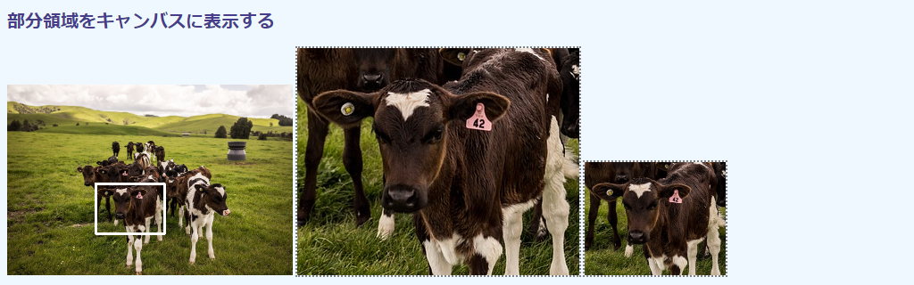
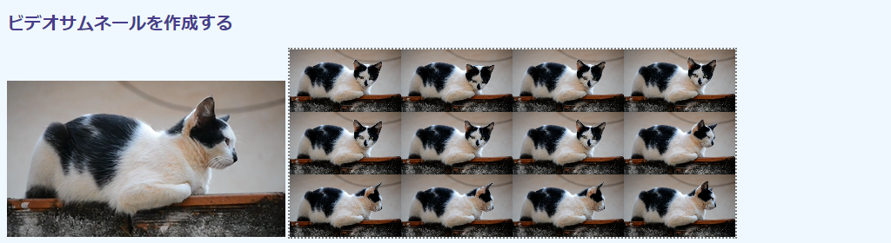
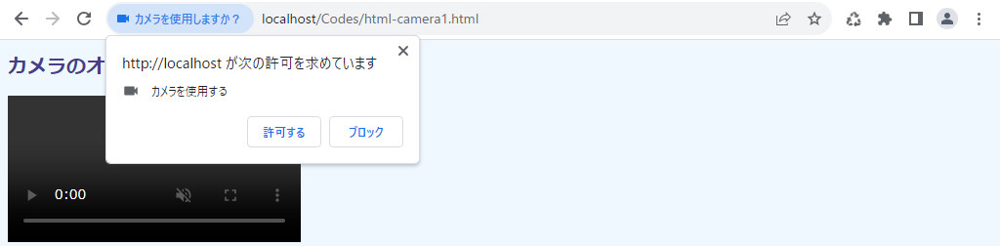
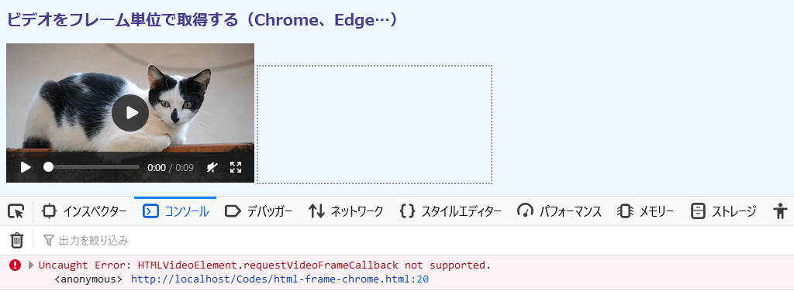

## 第1章 HTML5の画像・ビデオ・カメラの入出力

C/C++やPythonのバージョンと異なり、OpenCV.jpには画像の読み込みや表示といった入出力機能がありません。HTML5がすでに提供しているからです。カメラも同様です。

本章では、HTML5における画像・ビデオ・カメラのハンドリング方法を説明します。具体的には``、`<video>`、`<canvas>`の要素と関連するイベントです。HTML5の機能だけを用いるので、OpenCV.jsは用いません。

CSSは少しだけ用いますが、主として見栄えの調整のためなので、画像処理の本質には直接影響しません。使用するCSSファイル（`style.css`）は[付録](TBA "INTERNAL")に掲載してあります。


### 1.1 画像処理の流れ

WebページでのOpenCVの画像処理の流れを次図から示します。

<!-- 544 x 277 ODG ファイルに原画あり -->


OpenCV.jsが提供するのは中央の画像処理のメカニズムだけです。左右の画像やビデオの入出力にはHTML5の機能を用います。

①入力。画像は``で読み込みます。ビデオあるいはカメラなら`<video>`です。画像処理では、ビデオであっても静止画（フレーム）を対象とします。入力のステップにはビデオをフレーム単位に分解する処理も含まれます。

②処理。得られた画像は`<script>`内のOpenCVスクリプトで処理します。本章ではなにもしないので、入力はそのまま次のステップに引き渡します。画像処理は[第3章](./03-opencv.js "INTERNAL")以降で説明します。

③処理が完了したら、結果の画像を`<canvas>`に貼り付けます。

本章では①と③を、HTML要素とそれに対応するDOMオブジェクトを確認しながら説明していきます。


### 1.2 画像をキャンバスに表示する

#### 目的

本節では、読み込んだ画像を無処理のままキャンバスに貼り付けます。

技術的には、``に読み込んだ画像をページに表示したそのままに`<canvas>`に貼り付けるHTML5の方法を説明します。加えて、複数ある画像サイズのプロパティの違いを説明します。

実行例を次の画面に示します。


左が読み込んだ画像を表示する``で、右がそのコピーを貼り付けた`<canvas>`です。キャンバスにはその領域が目視できるように点線の枠を付けてありますが、これはCSSによる見栄えの調整なだけで、本質とは無関係です（枠線のスタイルは`outline: 2px gray dotted;`です）。

画像ファイルはコードの中にじか書きしてあります。変更には、コードそのものを編集します（12行目）。ローカルファイルから選択するユーザインタフェースは[2.1節](./02-ui.md#21-ローカルファイルを選択する "INTERNAL")で説明します。

#### コード

コード`html-image.html`を次に示します。

<!-- 動作確認（✔️❌）： Local/Normal Firefox✔️ Chrome✔️ Edge✔️, Local/CORS Firefox Chrome Edge, HTTP Firefox Chrome Edge -->
```html
[File] html-image.html
  1  <!DOCTYPE html>
  2  <html lang="ja-JP">
  3  <head>
  4    <meta charset="UTF-8">
  5    <link rel=stylesheet type="text/css" href="style.css">
  6  </head>
  7  <body>
  8
  9  <h1>画像をキャンバスに表示する</h1>
 10
 11  <div>
 12    
 13    <canvas id="canvasTag" class="placeholder"></canvas>
 14  </div>
 15
 16  <script>
 17    let imgElem = document.getElementById('imageTag');
 18    let canvasElem = document.getElementById('canvasTag');
 19    let ctx = canvasElem.getContext('2d');
 20
 21    function showImage() {
 22      ['width', 'height',
 23       'clientWidth', 'clientHeight',
 24       'offsetWidth', 'offsetHeight',
 25       'naturalWidth', , 'naturalHeight'].forEach(function(d) {
 26        console.log(`img.${d}: ${imgElem[d]}, canvas.${d}: ${canvasElem[d]}`);
 27      });
 28      canvasElem.width = imgElem.width;
 29      canvasElem.height = imgElem.height;
 30      ctx.drawImage(imgElem, 0, 0, imgElem.width, imgElem.height);
 31    }
 32
 33    imgElem.addEventListener('load', showImage);
 34  </script>
 35
 36  </body>
 37  </html>
```

#### img要素

HTMLページに画像ファイルを取り込むには``要素を使います（12行目）。ファイルのURLは`src`属性から指定します。

```html
12    
︙
17    let imgElem = document.getElementById('imageTag');
```

`src`以外の属性は仕様上オプションです。ここでは`width`属性に320ピクセルを指定していますが、動作確認時に邪魔にならない程度に縮小表示したいからです。`height`は未指定ですが、高さは元画像のアスペクト比に準じて自動的に調整されます。ここでの用例では、元画像のサイズが1280×885なので、高さは1/4の221ピクセルに縮小されます。

スクリプティングで必須なのは、``要素を特定する`id`属性です。対応するDOMオブジェクトは、この`id`属性を介して`document.getElementById()`関数から取得できます（17行目）。

#### HTMLImageElementのイベント

画像が読み込まれれば`load`イベントが発生します。読み込まれるまでは画像に関連した処理はできないので、イベントの発生を契機に処理を開始するようにします。この段取りをしているのが、33行目の`addEventListener()`です。

```javascript
 17    let imgElem = document.getElementById('imageTag');
 ︙
 33    imgElem.addEventListener('load', showImage);
```

`load`イベントが`HTMLImageElement`（変数は17行目で定義した`imgElem`）で発生したら、`showImage()`関数を実行するよう登録しています。

#### canvas要素

``で取り込んだ画像のコピーを貼り付ける領域（キャンバス）は、`<canvas>`要素から用意します（13行目）。``要素同様、`id`属性にセットした識別子から対応するDOM（`HTMLCanvasElement`オブジェクト）も用意します（18行目）。

```html
13    <canvas id="canvasTag" class="placeholder"></canvas>
︙
18    let canvasElem = document.getElementById('canvasTag');
```

`width`や`height`の属性を指定していないので、ページ上ではデフォルトの300×150のスペースが確保されます。次の画面は画像がコピーされる前の初期状態です。キャンバスサイズがデフォルトのままなのが枠線からわかります。


#### 描画コンテクスト
<!-- Wikipedia は「コンテキスト」のほうが多いと言っているが、あたしは自然には「コンテクスト」と打つので、そちらを採用。無理に「キ」にすると、揺れが多すぎる。-->

キャンバスに対する操作は、キャンバスの描画コンテクストを介して行います。「コンテクスト」（文脈）ではやや意味不明瞭ですが、仮想的なキャンバスと考えてください。この仮想的なキャンバスに対して画像貼り付けやグラフィック描画を行うと、`<canvas>`というビューファインダーからそれらが見えるようになるという塩梅です。

描画コンテクストは、`HTMLCanvasElement`の`getContext()`関数から取得します（19行目）。

```javascript
 19      let ctx = canvas.getContext('2d');
```

引数には5つほど選択肢がありますが、2次元での描画では2dで決め打ちです。戻り値は`CanvasRenderingContext2D`というオブジェクトです。

#### 画像のコピー

画像の読み込み完了とともに起動する`showImage()`（21～31行目）は、`HTMLImageElement`（``）の画像を描画コンテクストにコピーします。コピーするのは`CanvasRenderingContext2D`の`drawImage()`関数です（30行目）。

```javascript
 30      ctx.drawImage(imgElem, 0, 0, imgElem.width, imgElem.height);
```

第1引数には、コピー元の画像オブジェクトを指定します。

第2引数と第3引数には、その画像を貼り付けるキャンバス内での(x, y)座標を指定します。ここでは(0, 0)を指定しているので、キャンバスと画像の左上の位置は一致します。

第4引数と第5引数には、貼り付けるサイズを指定します。ここでは、ページ上での``と同じサイズ（`width`属性で指定した320×221）を用いたいので、`imgElem.width`と`imgElem.height`を指定しています。

#### いろいろなサイズ

画像やキャンバスにはサイズを示す複数のプロパティがあります。22～27行目は、参考までにこれをコンソールに印字しています。

```javascript
 22      ['width', 'height',
 23       'clientWidth', 'clientHeight',
 24       'offsetWidth', 'offsetHeight',
 25       'naturalWidth', , 'naturalHeight'].forEach(function(d) {
 26        console.log(`img.${d}: ${imgElem[d]}, canvas.${d}: ${canvasElem[d]}`);
 27      });
```

プロパティには、通常の`width`と`height`とともに、client、offset、naturalが先付けされたものがあります（scrollもあるが割愛）。これらの意味を次の表に示します。横幅と高さで意味は同じなので、表には`width`のもののみ記しています。

プロパティ | 意味
---|---
`width` | HTML要素の属性で指定された、ページ上に表示される画像のサイズ。
`clientWidth` | `width`にパディング（`padding`）を含んだサイズ。
`offsetWidth` | `clientWidth`にさらに枠線（`border`）を含んだサイズ。
`naturalWidth` | 読み込んだ画像のもともとのサイズ。

本節のコードでは``にパディングも枠線も含んでいないので、上の3点の違いがわかりません。そこで、次の2行を19行目の下に加え、パディングを周囲に20pxずつ加え、幅10pxの枠線で囲みます。

```javascript
 20    imgElem.style.padding = '20px';
 21    imgElem.style.border = '10px dashed purple';
```

出力結果を次に示します。

```
img.width: 320, canvas.width: 300
img.height: 221, canvas.height: 150
img.clientWidth: 360, canvas.clientWidth: 300
img.clientHeight: 261, canvas.clientHeight: 150
img.offsetWidth: 380, canvas.offsetWidth: 300
img.offsetHeight: 281, canvas.offsetHeight: 150
img.naturalWidth: 1280, canvas.naturalWidth: undefined
img.naturalHeight: 885, canvas.naturalHeight: undefined
```

client付きはパディングが上下左右に加わるので、40ピクセル増えます。offset付きはさらに枠線が加わるので、そこから20ピクセル増えます。natural付きは上述のように読み込んだもともとの画像のサイズで、ここから、``のものは縮小表示されていることがわかります。なお、`<canvas>`には`natural`付きは定義されていないので、`undefined`になります。

`<canvas>`にはサイズ属性を設定してなかったので、値はデフォルトの300×150です。このまま``を`<canvas>`にコピーするとは320×221だった画像が左上を揃えたうえで300×150で切り取られるので、下部の71ピクセルと右の20ピクセルが、次の画面のようにクリッピングされます。


``と同じものを`<canvas>`に貼り付けるには、キャンバスのサイズを揃えます（25～26行目）。

```JavaScript
 25      canvasElem.width = imgElem.width;
 26      canvasElem.height = imgElem.height;
```

13行目で次のように`width="320" height="221"`と記述してもかまいません。

```html
 13    <canvas id="canvasTag" width="320" height="221" class="placeholder"></canvas>
```

横縦両方指定しているところに注意してください。``と異なり、未指定側は自動調節されないので、値はデフォルトのままです。`width="320"`単体での指定はつまり320×150となるので、下部分が次の画面のようにクリッピングされます。前の300×150の画面とは微妙にしか違いませんが、横幅が同じなので、右端の稜線や湖手前の樹が20ピクセルぶん多く含まれます。


`<canvas>`の属性値をじか書きするのはわかりやすいかもしれませんが、画像を変えるたびに、アスペクト比をあわせて高さを計算しなければなりません。スクリプトで処理したほうが面倒がなくてよいでしょう。

ビデオフレームは、画像と異なり`height`が自動計算されません。したがって、高さには`clientHeight`あるいは`offsetHeight`を使うか、フレームのアスペクト比から計算しなければなりません（[1.4節](#14-ビデオを表示する "INTERNAL")参照）。本書ではビデオにはパディングや枠線を加えていないので、しばしば`offsetHeight`利用します。


### 1.3 部分領域をキャンバスに表示する

#### 目的

本節では``から部分領域を切り取り、`<canvas>`にリサイズして貼り付けます。

技術的には、描画コンテクストの`drawImage()`関数が対象とするのは読み込んだ画像のオリジナルのサイズであり、`<canvas>`にはそれが拡大縮小、あるいは部分的にくりっっピングされて貼り付けられることを示します。

実行例を次の画面に示します。

<!-- 枠なし版あり -->


左が``です。``と属性からサイズ指定しているので、読み込んだ画像が1/4に縮小されています。中央の`<canvas>`は、元画像で白枠でくくった部分を縮小前のサイズで示しています。右の`<canvas>`では縮小前の1/2（``の倍）で同じ枠内の部分画像を表示しています。

#### コード

コード`html-partial.html`を次に示します。

```html
[File] html-partial.html
  1  <!DOCTYPE html>
  2  <html lang="ja-JP">
  3  <head>
  4    <meta charset="UTF-8">
  5    <link rel=stylesheet type="text/css" href="style.css">
  6  </head>
  7  <body>
  8
  9  <h1>部分領域をキャンバスに表示する</h1>
 10
 11  <div>
 12    
 13    <canvas id="canvasTag1" class="placeholder"></canvas>
 14    <canvas id="canvasTag2" class="placeholder"></canvas>
 15  </div>
 16
 17  <script>
 18    let imgElem = document.getElementById('imageTag');
 19    let canvasElem1 = document.getElementById('canvasTag1');
 20    let ctx1 = canvasElem1.getContext('2d');
 21    let canvasElem2 = document.getElementById('canvasTag2');
 22    let ctx2 = canvasElem2.getContext('2d');
 23
 24    let [x_img, y_img, w_img, h_img] = [65, 549, 415, 315];
 25
 26    function showImage() {
 27      canvasElem1.width = w_img;
 28      canvasElem1.height = h_img;
 29      ctx1.drawImage(imgElem,
 30        x_img, y_img, w_img, h_img,
 31        0, 0, w_img, h_img
 32      );
 33
 34      canvasElem2.width = Math.floor(w_img * 0.5);
 35      canvasElem2.height = Math.floor(h_img * 0.5);
 36      ctx2.drawImage(imgElem,
 37        x_img, y_img, w_img, h_img,
 38        0, 0, canvasElem2.width, canvasElem2.height
 39      );
 40    }
 41
 42    imgElem.addEventListener('load', showImage);
 43  </script>
 44
 45  </body>
 46  </html>
```

コードの大半は前節のものと変わりません。違いはキャンバスを2枚用意しているところ（13～14、19～22行目）、`drawImage()`の引数が5個から9個になっているところです（29～32、36～39行目）。

#### 部分領域の切り出し

前節では、`CanvasRenderingContext2D.drawImage()`関数に引数を5つ指定しました。最初のものはコピー元の`HTMLImageElement`オブジェクトで、続く4つは貼り付け先のキャンバス上の位置とサイズでした。

```javascript
 // html-image.html より         コピー先のキャンバスの位置とサイズ
 27      ctx.drawImage(imgElem, 0, 0, imgElem.width, imgElem.height);
```

関数にコピー元から部分領域を切り出すによう指示するには、オブジェクトとコピー先の情報の間に、切り出す領域を指示する4つの引数を加えます。次にこの9つ引数版の書式を示します。

```
drawImage(
  image,                       // コピー元
  sx, sy, sWidth, sHeight,     // コピー元（source）での左上の頂点の座標とそのサイズ
  dx, dy, dWidth, dHeight      // コピー先（destination）での左上の頂点の座標とそのサイズ
)
```

コピー元の情報がなければ、デフォルトでコピー元画像全体が用いられます。コピー元の座標系は読み込まれた「おおもと」のものなので、`0, 0, image.naturalWidth, image.naturalHeight`が指示されているのと等価です。ここでは、`0, 0, 1280, 885`です。``に表示された`0, 0, 320, 221`ではないところに注意してください。

切り出すときにも「おおもと」の画像の座標系を用います。ここでは、24行目に用意した4要素の配列（x座標、y座標、横幅、高さ）です。

```javascript
 24    let [x_img, y_img, w_img, h_img] = [65, 549, 415, 315];
```

中央のキャンバス（13、19～20行目）のサイズは、上記のサイズの画像をぴったり収容できるように変更します（27～28行目）。サイズが合わなければ、前節で見たようにクリッピングされたり空き領域が残ったりします。

```javascript
 27      canvasElem1.width = w_img;
 28      canvasElem1.height = h_img;
```

貼り付けの`drawImage()`では、コピー元から24行目の位置とサイズで部分領域を切り出し、コピー先にぴったり貼り付けます（29～32行目）。

```javascript
 29      ctx1.drawImage(imgElem,
 30        x_img, y_img, w_img, h_img,   // 「おおもと」の画像からの切り出し位置とサイズ
 31        0, 0, w_img, h_img            // キャンバスへの貼り付け位置とサイズ
 32      );
```

これで、``のおおもとの画像のサイズのまま、キャンバスにその一部をコピーできました。

#### リサイズして貼り付け

右側のキャンバス2（`canvasElem2`と`ctx2`）では、「もともと」の寸法の半分にした部分領域を貼り付けるため、キャンバスサイズもそれに合わせて設定します（34～35行目）。

```javascript
 34      canvasElem2.width = Math.floor(w_img * 0.5);
 35      canvasElem2.height = Math.floor(h_img * 0.5);
```

あとは`drawImage()`で張り付けるだけです（36～39行目）。

```javascript
 36      ctx2.drawImage(imgElem,
 37        x_img, y_img, w_img, h_img,
 38        0, 0, canvasElem2.width, canvasElem2.height
 39      );
```

37行目のコピー元の切り出し情報は中央のキャンバスと変わりません。変わったのは38行目で、キャンバスサイズが半分になっています。これはつまり、その寸法にリサイズせよ、という指示にもなっています。前節の5個引数の`drawImage()`でも同じことをしていますが、あれは「このサイズとなるようおおもとの画像をリサイズせよ」という指定だったのです。


### 1.4 ビデオを表示する

#### 目的

本節では、ビデオを表示します。

技術的には`<video>`要素の主要な属性、そしてそれと対になるとDOMオブジェクトの`HTMLVideoElement`のプロパティとイベントを説明します。また、フレームサイズの取得とビデオローディングのタイミングでの注意点を示します。

実行例を次の画面に示します。  


画面には再生・停止や再生位置を示すトラックバーなどのユーザインタフェースが用意されていますが、これは`<video>`要素が自動で用意したものです。ブラウザによって見栄えが異なりますが、機能的には同等のものがどれにも備わっています。

#### コード

コード`html-video.html`を次に示します。

```html
[File] html-video.html
  1  <!DOCTYPE html>
  2  <html lang="ja-JP">
  3  <head>
  4    <meta charset="UTF-8">
  5    <link rel=stylesheet type="text/css" href="style.css">
  6  </head>
  7  <body>
  8
  9  <h1>ビデオを表示する</h1>
 10
 11  <div>
 12    <video id="videoTag" width="480" controls src="samples/cat.mp4"
 13      type="video/mp4">
 14    </video>
 15  </div>
 16
 17  <script>
 18    let startTime = Date.now();
 19    let videoElem = document.getElementById('videoTag');
 20
 21    function showMetadata(evt) {
 22      console.log(`Video properties:
 23        Size offset:    ${videoElem.offsetWidth} x ${videoElem.offsetHeight}
 24        Size (element): ${videoElem.width} x ${videoElem.height}
 25        Size video:     ${videoElem.videoWidth} x ${videoElem.videoHeight}
 26        Duration:       ${videoElem.duration}s
 27        CurrentTime:    ${videoElem.currentTime}s
 28        Volume:         ${videoElem.volume} [0, 1]
 29        Play rate:      ${videoElem.playbackRate}
 30        Loop:           ${videoElem.loop}`
 31      );
 32    }
 33
 34    let events = [
 35      'ended', 'error', 'loadeddata', 'loadedmetadata', 'loadstart', 'pause', 'play',
 36      'seeked', 'seeking', 'suspend', 'volumechange'
 37    ];
 38    events.forEach(function(evt) {
 39      videoElem.addEventListener(evt, function() {
 40        let delta = (Date.now() - startTime).toLocaleString();
 41        console.log(`${delta}. event: ${evt}`);
 42      });
 43    });
 44
 45    videoElem.addEventListener('loadedmetadata', showMetadata);
 46  </script>
 47
 48  </body>
 49  </html>
```

ビデオを再生するだけなら、12～14行目の`<video>`だけで事足ります。コードが長くなったのは、スクリプトからプロパティやイベントのシーケンスを示したいからです。

#### video要素

`<video>`の属性で必須なものは`src`だけです。あと、この要素を識別する`id`はスクリプトをするうえで必要です。

```html
 12    <video id="videoTag" width="480" controls src="samples/cat.mp4"
 13      type="video/mp4">
 14    </video> 
```

`src`のメディアタイプを示す`type`属性は、複数のビデオファイルから選択できるようにしているときは、あったほうがよいでしょう。ブラウザが、表示可能なものをこの情報から判断してピックアップできるからです。ビデオファイルを複数指定するときは`<video>`の子要素である`<source>`を指定します。次にサンプルを示します。

```html
<video id="videoTag">
  <source src="samples/cat.mov" type="video/mov">
  <source src="samples/cat.mp4" type="video/mp4">
</video>
```

`type`がなければ、最初に記述されたMOVファイルがダウンロードされます。しかし、このフォーマットはSafari以外ではたいていサポートされていません。なので、これは廃棄され、次がダウンロードされます。

ビデオ操作のための属性のなかでもよく用いるものを次の表に示します。

属性 | デフォルト値 | 意味 
---|---|---
`autoplay` | `false` | この属性が記述されていると、ビデオが自動再生される。
`controls` | `false` | この属性が記述されていると、再生ボタンなどの操作パネルが表示される。
`loop` | `false` | この属性が記述されていると、末尾まで再生するとまた先頭に戻る。デフォルトでは1回だけ再生。
`muted` | `false` | この属性が記述されていると、オーディオがオフ（ミュート）される。
`poster` | なし | URLを指定すると、ビデオの先頭フレームがダウンロードされるまで、その画像が表示される（[2.3節](./02-ui.md#23-カメラにオンオフボタンを加える "INTERNAL")で取り上げます）。

スクリプトで再生を完全にコントロールするのでなければ、たいていは`controls`を加えます。もっとも、初期状態で表示されなくても、たいていは左マウスクリックで引き出せるので、操作に困ることはありません。

起動時に自動再生をする`autoplay`とサウンドをミュートにする`muted`はたいていペアで指定します。ページアクセスと同時に大音量でビデオが始めると、職場や学校で恥ずかしい思いをするからです。

#### HTMLVideoElementのプロパティ

コードの21～32行目に定義した`showMetadata()`関数は、ビデオのメタデータをコンソールに表示します。この関数は、45行目から後述する`loadedmetadata`イベントを契機に起動するよう登録してあります。

```javascript
 21    function showMetadata(evt) {
 22      console.log(`Video properties:
 23        Size offset:    ${videoElem.offsetWidth} x ${videoElem.offsetHeight}
 24        Size (element): ${videoElem.width} x ${videoElem.height}
 25        Size video:     ${videoElem.videoWidth} x ${videoElem.videoHeight}
 26        Duration:       ${videoElem.duration}s
 27        CurrentTime:    ${videoElem.currentTime}s
 28        Volume:         ${videoElem.volume} [0, 1]
 29        Play rate:      ${videoElem.playbackRate}
 30        Loop:           ${videoElem.loop}`
 31      );
 32    }
 ︙
 45    videoElem.addEventListener('loadedmetadata', showMetadata);
```

出力を、直前のイベントも含めて次に示します。後付けのコメントにプロパティ名を示しました。

```
2. event: loadedmetadata           // loadmetada以降に取得可
Video properties:
      Size offset:    480 x 270    // offsetWidth、offsetHeight
      Size (element): 480 x 0      // width、height
      Size video:     640 x 360    // videoWidth、videoHeight
      Duration:       9.217542s    // duration
      CurrentTime:    0s           // currentTime
      Volume:         1 [0, 1]     // volume
      Play rate:      1            // playbackRate
      Loop:           false        // loop
```

`videoElem.height`が0なところに注目してください。`<video>`要素の横幅が`width`属性で設定してあっても、`height`は指定していないないからです。``ではアスペクト比から未指定の辺の長さを自動で設定してくれましたが、`<video>`ではそうではないところが注意点です。

そのため、キャンバスサイズの調整にはこれらプロパティは使えません。そこで、代替として`offsetWidth`と`offsetHeight`を使うことになります（[2.2節](./02-ui.md#22-ビデオをキャプチャする "INTERNAL")参照）。これらプロパティは実際に画面上にレンダリングされたときのサイズなので、あれば境界線、パディング、スクロールバーのぶんも含まれ、正確にはフレームサイズと異なることもあります。

ビデオオリジナルのサイズは`videoWidth`と`videoHeight`プロパティに主要されています。キャンバスサイズを`width`あるいは`height`をもとに計算するときは、これらから得られるアスペクト比を用います。

ビデオの時間長を示す`duration`と現在時刻の`currentTime`の単位は秒で、浮動小数点数です。メタデータにはビデオの総フレーム数やフレームレート（秒間に再生するフレームの枚数）がたいていは備わっていますが、HTML5では取得できません（オリジナルのOpenCVではできますが、OpenCV.jsはサポートしていません）。

`volume`は音量で0.0から1.0の浮動小数点数です。0.0が無音、1.0が最大を示します。デフォルトは1.0です。このプロパティには対応するHTML属性がないので、`<video>`要素で音量を指定するときは、次のようにイベントリスナーを介してオブジェクトプロパティから設定します。

```html
<video id="videoTag" src="samples/cat.mp4" onloadedmetadata="this.volume=0.4;">
```

`playbackRate`は再生速度で1.0が通常スピードです。2.0なら倍速、負の値にすれば逆方向に進みます。これも対応するHTML属性はありません。

`loop`は同名のHTML属性と同じで、オートリ―ピートをかけるか否かを真偽値で指定します。デフォルトは`false`です。

#### HTMLVideoElementのイベント

`HTMLVideoElement`には一般的なものに加えて、たくさんのイベントが用意されています。どのタイミングでこれらが発生するかを確認できるよう、コードの34～43行目で代表的なものを12点登録しています。発生時点がわかりやすいよう、イベント名とともにスクリプト起動時（18行目）からの時間差（40行目）もコンソールに表示します。

```javascript
 18    let startTime = Date.now();
 ︙
 34    let events = [
 35      'ended', 'error', 'loadeddata', 'loadedmetadata', 'loadstart', 'pause', 'play',
 36      'seeked', 'seeking', 'suspend', 'volumechange'
 37    ];
 38    events.forEach(function(evt) {
 39      videoElem.addEventListener(evt, function() {
 40        let delta = (Date.now() - startTime).toLocaleString();
 41        console.log(`${delta}. event: ${evt}`);
 42      });
 43    });
```

これらイベントの発火タイミングと意味を次の表に示します。

イベント | 発火タイミング
---|---
`ended` | ビデオが最後まで行ったとき。ただし、ループ時には発火しない。
`error` | ネットワーク障害など、読み込みに失敗したとき。
`loadeddata` | 最初のフレームが読み込まれたとき。以降のフレームでは出てこない。
`loadedmetadata` | フレームサイズなどビデオのメタデータが読み込まれたとき。`loadeddata`よりも先。
`pause` | （操作パネルなどから）一時停止されたとき。
`play` | 再生開始時。
`seeked` | （操作パネルなどから）先送りや後戻りの操作が完了したとき。
`seeking` | （操作パネルなどから）先送りや後戻りの操作が開始したとき。`seeked`よりも先。
`suspend` | データ読み込みが中断されたとき。たいていは`pause`の前。
`volumechange` | 音量が変更されたとき。

45行目で用いた`loadeddata`と`loadedmetadata`は微妙にタイミングが異なります。`loadedmetadata`はビデオのサイズや時間長など、ビデオのメタデータが読み込まれたときに上がってきます。以降、サイズなどのプロパティ値にアクセスすることができます。しかし、まだフレームは読み込まれていないので、フレームをコピーするなどの画像操作はできません。最初のフレームが読み込まれたタイミングで発火するのが`loadeddata`です。

出力例を次に示します。左の数値がスクリプト開始時（8行目）からのミリ秒を示します。右のコメントは筆者の操作です。

```
2. event: loadedmetadata      // ページアクセス
5. event: loadeddata
2,210. event: play            // 操作パネルから▷（再生）をクリック
2,513. event: suspend         // 操作パネルから⏸︎（一時停止）をクリック
4,291. event: pause
5,991. event: seeking         // 操作パネルから●（再生位置）をドラッグして再生位置を変更
6,023. event: seeked
︙                            // seeking/seeked が繰り返される
6,292. event: seeking
6,294. event: seeked
8,363. event: play            // 操作パネルから▷（再生）をクリック
9,804. event: pause           // 操作パネルから⏸︎（一時停止）をクリック
```

`loadedmetadata`と`loadeddata`はほぼ同時ですが、それでも3ミリ秒の間隔が空いているところに注意してください。

一時停止の`suspend`と`pause`がつながって出てくるのは、データ転送の中断ののちに再生が停止するからです。再生位置変更の`seeking`と`seeked`は、操作しているあいだは連続して出てくるところもポイントです。


### 1.5 ビデオをランダムにシャッフルする

#### 目的

本節では、ビデオシャッフリングを実装します。

そういう用語は存在しませんが、アナログレコードをこすって効果を出すスクラッチのビデオ版です。ここでは、一定間隔でビデオの再生ポイントをランダムに移動することで、ビデオ中を行ったり来たりさせます。ほっておくとずっと再生していますが、操作パネルから再生停止すれば終了します。停止後は、普通に視聴できます。

技術的には、現在時刻を示すビデオプロパティの`currentTime`を`setInterval()`で定期的に操作しているだけです。

実行例を次の画面に示します。


と、いっても、画面キャプチャでは動くところはわかりません。どこにジャンプしたかはコンソールから確認してください。

#### コード

コード（`html-shuffle.html`）を次に示します。

```html
[File] html-shuffle.html
  1  <!DOCTYPE html>
  2  <html lang="ja-JP">
  3  <head>
  4    <meta charset="UTF-8">
  5    <link rel=stylesheet type="text/css" href="style.css">
  6  </head>
  7  <body>
  8
  9  <h1>ビデオをランダムにシャッフルする</h1>
 10
 11  <div>
 12    <video id="videoTag" width="480" src="samples/cat.mp4"></video>
 13  </div>
 14
 15  <script>
 16    let interval = undefined;
 17    let videoElem = document.getElementById('videoTag');
 18
 19    function ready() {
 20      videoElem.controls = true;
 21      videoElem.loop = true;
 22      videoElem.muted = true;
 23      videoElem.play();
 24      interval = setInterval(function() {
 25        let nextPos = videoElem.duration * Math.random();
 26        videoElem.currentTime = nextPos;
 27        console.log(`Skipped to ${nextPos}`);
 28      }, 2500);
 29    }
 30
 31    function stopInterval() {
 32      clearInterval(interval);
 33      console.log('Shuffle stopped');
 34    }
 35
 36    videoElem.addEventListener('loadeddata', ready);
 37    videoElem.addEventListener('pause', stopInterval);
 38  </script>
 39
 40  </body>
 41  </html>
```

#### HTMLVideoElementのプロパティ設定

`<video>`の属性は12行目ではなく、プロパティから設定しています（20～23行目）。この設定は、画像が読み込まれてからでなければ意味がないので、`loadeddata`以降に実行しています（36行目）。

```javascript
 19    function ready() {
 20      videoElem.controls = true;
 21      videoElem.loop = true;
 22      videoElem.muted = true;
 23      videoElem.play();
 ︙
 36    videoElem.addEventListener('loadeddata', ready);
```

別のやり方があることを示すためにやっているだけで、属性から設定してもかまいません。

ただし、`autoplay`には注意が必要です。この属性／プロパティは自動的に再生を開始するか否かを示すだけであって、実際に再生をするわけではありません。そのため、あとからスクリプトで`true`をセットしても再生はスタートとしません。スクリプト側から再生開始をさせるには、`HTMLVideoElement.play()`関数を用います（23行目）。

`HTMLVideoElement`にはこの他にも、一時停止などビデオ操作の関数がいろいろ用意されています。詳細は、次にURLを示すMDNの`HTMLMediaElement`のAPIドキュメントを参照してください（`HTMLVideoElement`のほとんどのプロパティや関数は、この親クラスから継承しています）。

```https://developer.mozilla.org/ja/docs/Web/API/HTMLMediaElement```

#### ランダム再生と停止

シャッフリングは、`setInterval()`関数で2.5秒（2500ミリ秒）おきに発生するように設定しています（24行目）。

```javascript
 16    let interval = undefined;
 ︙ 
 24      interval = setInterval(function() {
 25        let nextPos = videoElem.duration * Math.random();
 26        videoElem.currentTime = nextPos;
 27        console.log(`Skipped to ${nextPos}`);
 28      }, 2500);
``` 

飛び先は先頭から末尾（`duration`プロパティ）までの間のランダムな位置です。この値を`currentTime`プロパティに代入すればそのままジャンプします。

ほっておくとシャッフリングは永遠に繰り返されます。そこで、操作パネルからて一時停止をすれば、シャッフリングを停止するようにします。これには、`HTMLVideoElement`に上がってくる`pause`イベントを契機に（37行目）、`clearInterval()`関数でタイマをクリアします（32行目）。

```javascript
 31    function stopInterval() {
 32      clearInterval(interval);
 33      console.log('Shuffle stopped');
 34    }
 ︙
 37    videoElem.addEventListener('pause', stopInterval);
```

`pause`イベントはブラウザのタブを移ることでも発生します。


### 1.6 ビデオサムネールを作成する

#### 目的

本節では、一定間隔で抜き出したフレームを格子状に並べたビデオサムネールを作成します。

サムネールは、縮小した見本画像を並べた画像です。親指の爪（thumbのnail）サイズだから、サムネールです。ネガフィルム（銀塩）写真の時代にはべた焼き、あるいはコンタクトシートと呼ばれました。

技術的には[1.3節](#13-部分領域をキャンバスに表示する "INTERNAL")の部分画像の取得の応用ですが、一定間隔でフレームを取り出すのに`timeupdate`というイベントを用います。ビデオは最初から最後まで流し、指定のタイミングで取り出して貼り付けるので、長いビデオだと時間がかかります。フレームが徐々にキャンバスを埋めていくのがアニメーション風で楽しいので、あえてそのような実装にしています。指定の時間ポイントにジャンプすることで時間短縮を図るなら、`timeupdate`は使わず、[1.5節](#15-ビデオをランダムにシャッフルする "INTERNAL")の`currentTime`プロパティを用います。

実行例を次の画面に示します。 



サムネールの利点は高い一覧性です。欠点は、小さくし過ぎると画像を認識できなくなることです。では大きくすればよいかというと、それに伴って台紙も大きくなるので、数が多いとディスプレイに収まらなくなり、逆に一覧性が低下します。

#### コード

コード（`html-thumbnail.html`）を次に示します。

```html
[File] html-thumbnail.html
  1  <!DOCTYPE html>
  2  <html lang="ja-JP">
  3  <head>
  4    <meta charset="UTF-8">
  5    <link rel=stylesheet type="text/css" href="style.css">
  6  </head>
  7  <body>
  8
  9  <h1>ビデオサムネールを作成する</h1>
 10
 11  <div>
 12    <video id="videoTag" width="480" src="samples/cat.mp4"></video>
 13    <canvas id="canvasTag" class="placeholder"></canvas>
 14  </div>
 15
 16  <script>
 17    let sheetSize = {width: 4, height: 3};
 18    let imgWidth = 128;
 19    let imgHeight = undefined;
 20    let count = 0;
 21    let timeSeries = undefined;
 22
 23    let videoElem = document.getElementById('videoTag');
 24    let canvasElem = document.getElementById('canvasTag');
 25    let ctx = canvasElem.getContext('2d');
 26
 27    function prepare() {
 28      let aspect = videoElem.videoHeight / videoElem.videoWidth;
 29      imgHeight = Math.floor(imgWidth * aspect);
 30      canvasElem.width = imgWidth * sheetSize.width;
 31      canvasElem.height = imgHeight * sheetSize.height;
 32
 33      let number = sheetSize.width * sheetSize.height;
 34      let interval = videoElem.duration / number;
 35      timeSeries = [...Array(number).keys()].map(i => i * interval);
 36
 37      videoElem.muted = true;
 38      videoElem.play();
 39    }
 40
 41    function pasteFrame() {
 42      let pos_x = (count % sheetSize.width) * imgWidth;
 43      let pos_y = Math.floor(count / sheetSize.width) * imgHeight;
 44      ctx.drawImage(videoElem, pos_x, pos_y, imgWidth, imgHeight);
 45    }
 46
 47    function timeUpdated() {
 48      if (videoElem.currentTime > timeSeries[count]) {
 49        console.log(`${count} at ${videoElem.currentTime}`);
 50        pasteFrame();
 51        count ++;
 52      }
 53    }
 54
 55    videoElem.addEventListener('loadeddata', prepare);
 56    videoElem.addEventListener('timeupdate', timeUpdated);
 57  </script>
 58
 59  </body>
 60  </html>
```

#### サムネール台紙の設計

27～39行目の`prepare()`関数は初期設定のためのものです。ここで、サムネールを貼り付ける台紙（キャンバス）のサイズや縮小画像の貼り付け位置を設計します。また、どのタイミングでフレームをゲットするのかも決めます。

関数は、ビデオの最初のフレームが用意できたとき（`loadeddata`イベント）に呼び出します(55行目）。

```javascript
 27    function prepare() {
 ︙
 39    }
 ︙
 55    videoElem.addEventListener('loadeddata', prepare);
```

関数では、まずサムネールの枚数とサイズを決めます（17～18行目）。キャンバスに格子状に配置するので、枚数は縦横の格子の数で記述します。ここでは4×3の合計12枚です。

```javascript
 17    let sheetSize = {width: 4, height: 3};
 18    let imgWidth = 128;
```

レイアウト図に起こすと、次のようになります。

<!-- 888x387 ODG ファイルに原画あり -->


格子の左上の0～11の数値がサムネールの番号です。

中央の括弧は格子の横縦の位置を示しています。これらはサムネール番号から計算されます）（図右の計算式）。横はサムネール番号を横の格子数（4）で割った時の余りから得られます。縦は、同じく番号を横の格子数で割って小数点以下を切り捨てた値です。

格子の横幅は18行目で指定していますが、高さは未指定です。これは、ビデオサイズから得られるアスペクト比から計算します（28～29行目）。実行例で用いているビデオフレームのサイズは640×360なので、サムネールは128×72になります。

<!-- canvas.width に float を代入すると、自動的に int に変換される。でも、この場合は sheetSize を掛けると丸め誤差は出るので、先に int にしたほうがよい。-->
```javascript
 28      let aspect = videoElem.videoHeight / videoElem.videoWidth;
 29      imgHeight = Math.floor(imgWidth * aspect);
```

キャンバスそのものサイズもこれで決定できます（30～31行目）。

```javascript
 30      canvasElem.width = imgWidth * sheetSize.width;
 31      canvasElem.height = imgHeight * sheetSize.height;
```

#### フレーム間隔の決定

フレームを取り出す間隔は、ビデオの時間長（`duration`プロパティ）を格子数で割って決定します（33～34行目）。サンプルビデオの時間長は9.2秒なので、12で割って0.77秒間おきです。

```javascript
 33      let number = sheetSize.width * sheetSize.height;
 34      let interval = videoElem.duration / number;
```

次いで、0からスタートしてこの間隔を開けた等差数列の配列を作成します（35行目）。

```javascript
 35      timeSeries = [...Array(number).keys()].map(i => i * interval);
```

1行にまとめているので、ぱっと見にはわかりにくいかもしれません。まず、`Array()`関数で12個の要素の配列を作成します（`Array(number)`）。今度はそのインデックス番号からなる配列を生成します（`.keys()`）。これで[0, 1, ..., 11]が得られます。あとは、`map()`を使ってそれぞれに0.77を掛けます（`map(i => i * interval)`）。

`prepare()`関数は最後に、ビデオオーディオをミュートにし（37行目）、再生を開始させています（38行目）。

```javascript
 37      videoElem.muted = true;
 38      videoElem.play();
```

#### 一定間隔でフレームを抜き出す

一定間隔でのフレームの取り出しには`timeupdate`イベントが便利です。これを登録しているのが56行目です。

```javascript
 56    videoElem.addEventListener('timeupdate', timeUpdated);
```

このイベントは`HTMLVideoElement.currentTime`が更新されると発生します。一般的なビデオのフレームレートは30 fpsなので33ミリ秒おきに発火するように思えますが、実際にはもっと少ないです。MDNは15～250ミリ秒くらいに1回と述べています。

ここでは0.77秒に1回サムネール取り込みますが、その間に発火するのは3回程度です。このくらいならそれほど無駄ではありません。

`timeupdate`イベント発火で呼び出される`timeUpdated()`関数は47～53行目で定義しています。

```javascript
 20    let count = 0;
 ︙
 47    function timeUpdated() {
 48      if (videoElem.currentTime > timeSeries[count]) {
 49        console.log(`${count} at ${videoElem.currentTime}`);
 50        pasteFrame();
 51        count ++;
 52      }
 53    }
```

現在時刻が`timeSeries`の`count`番目の要素よりも大きければ、取り込みです（48行目）。取り込んだら、格子番号を記録している`count`（20行目で0にセット）を1つ繰り上げます（51行目）。

#### 貼り付け

50行目で呼び出している`pasteFrame()`関数（41～45行目）がキャンバスにフレームを貼り付けます。

```javascript
 41    function pasteFrame() {
 42      let pos_x = (count % sheetSize.width) * imgWidth;
 43      let pos_y = Math.floor(count / sheetSize.width) * imgHeight;
 44      ctx.drawImage(videoElem, pos_x, pos_y, imgWidth, imgHeight);
 45    }
```

格子番号の`count`から格子位置、そこからキャンバス上の位置を決定する方法は、先ほど図から示しました。`drawImage()`を使った縮小コピーの方法は[1.3節](#13-部分領域をキャンバスに表示する "INTERNAL")で説明した通りです。


### 1.7 ビデオに字幕を加える

#### 目的

本節では、字幕をビデオに表示します。

技術的には字幕のタイミングと表示文字列を収容したWebVTTというファイルを用意し、`<video>`要素の間に挟むだけです。HTML5の機能のひとつなので、自力でキャンバスに文字を描くなどする必要はありません。ここでは、このWebVTTのフォーマットを説明するとともに、対応するDOMオブジェクトの`HTMLTrackElement`から字幕情報を抽出する方法、そして字幕（キュー）に変更のあったときに発せられる`cuechange`イベントの使い方を示します。

実行例を次の画面に示します。 


字幕は（とくに設定がなければ）自動で配置されます。上の画面では操作パネルが表示されているのでその上に置かれますが、パネルがなければ画面下端に配置されます。

> 注意：字幕ファイルをローカル（`file:///...`）から読み込むと、クロスサイトリソース共有（CORS）制約に抵触し、エラーが上がります。CORSについては[3.3節](./03-opencv.md#33-CrossOrgignの問題 "INTERNAL")で説明します。

#### コード

コード`html-caption.html`を次に示します。

```html
[File] html-caption.html
  1  <!DOCTYPE html>
  2  <html lang="ja-JP">
  3  <head>
  4    <meta charset="UTF-8">
  5    <link rel=stylesheet type="text/css" href="style.css">
  6    <script async src="libs/opencv.js" type="text/javascript"></script>
  7  <body>
  8
  9  <h1>ビデオに字幕を加える</h1>
 10
 11  <div>
 12    <video id="videoTag" width="480" controls>
 13      <source src="samples/cat.mp4" type="video/mp4"/>
 14      <track id="trackTag" kind="captions" srclang="ja" default src="samples/cat.vtt"/>
 15    </video>
 16  </div>
 17
 18  <script>
 19    let videoElem = document.getElementById('videoTag');
 20    let trackElem = document.getElementById('trackTag');
 21
 22    function showCue(evt) {
 23      let cueList = evt.target.track.activeCues;
 24      if (cueList.length > 0)
 25        console.log(`${videoElem.currentTime} ${cueList[0].text}`);
 26      else
 27        console.log(`${videoElem.currentTime} Cue changed but no cue`);
 28    }
 29
 30    trackElem.addEventListener('cuechange', showCue);
 31  </script>
 32
 33  </body>
 34  </html>
```

字幕を加えるだけなら、字幕ファイルと12～15行目のHTML要素だけで片が付きます。スクリプト部分（18～31行目）は字幕テキストにスクリプトからアクセスする方法を示すために加えたものです。

#### track要素

ビデオに字幕を加えるには、`<video></video>`の間に<track`>要素を挟みます（15～16行目）。HTMLの仕様はビデオ（あるいはオーディオ）の特定の時間範囲内に付随するデータ全般をテキストトラックと総称しますが、ここでは字幕と呼びます。

```html
 13    <video id="videoTag" width="480" controls autoplay muted>
 14      <source src="samples/cat.mp4" type="video/mp4"/>
 15      <track id="trackTag" kind="captions" srclang="ja" default
 16        src="samples/cat.vtt"/>
 17    </video>
```

英日独仏など各国語の字幕に対応できるよう、`<track>`は複数挟むことができます。`default`属性は、その中でもどれをデフォルトに用いるかを指定するものです。上記のコードでは1つしかないので不必要な気もしますが、`default`指定がなければ、操作パネルから能動的に選択しなければ字幕は表示されません。

`kind`は字幕の種類を示します。たとえば、テキストデータが字幕（subtitiles）なのか、クローズドキャプション（captions）なのかを示します。captionsを指定すれば、たいていは問題ありません。

`srclang`はテキストデータの言語を示します。これを「言語タグ」といいます。`kind`にsubtitlesキーワードを指定したときには、必須の属性です。使用できる言語タグはインターネット標準のRFC 5646で定義されており、次のIANA（インターネットの標準化機構）のURLから全リストをチェックできます。

```https://www.iana.org/assignments/language-subtag-registry/language-subtag-registry```

付け足しですが、ここでは[1.4節](#14-ビデオを表示する "INTERNAL")で軽く触れた`<source>`からソースビデオを指定してます。実用上意味があるわけではなく、参考までです。

#### WebVTTファイル

字幕データはWebVTT（Web Video Text Track）と呼ばれるフォーマットで別ファイルに記述します。仕様は、W3Cのワーキンググループが開発中の「WebVTT: The Web Video Text Tracks Format」で規定されています。URLを次に示します。

```https://www.w3.org/TR/webvtt1/```

ファイルはメモ帳などで作成できるテキスト形式で、文字エンコーディングにはUTF-8を用います。

ここで使用したファイル（`samples/cat.vtt`）を次に示します（行番号はファイルには含みません）。

```
[File] samples/cat.vtt
  1  WEBVTT - 白黒ぶち猫
  2
  3
  4  00:00.000 --> 00:03.500
  5  あ、まんまくれるのかにゃ。
  6
  7  00:04.000 --> 00:08.999
  8  なんだ、くれないんだ。
  9  じゃ、いいや。
```

ファイル先頭には、文字列でWEBVTTと示します。同じ行に、スペースを挟んで好みの文字を書き込んでもよいので、たいていは中身を短く説明する文を入れます。

先頭行から2つ以上空行を入れます。WebVTTの改行はLF（`0A`）だけ、CR（`0D`）だけ、CRLF（`0D0A`）のいずれでもよいことになっていますが、CRLFがよいでしょう。

字幕を出すタイミングとその文章のかたまりを、仕様ではキュー（cue）と呼びます。キューの間には空行を1つ以上入れます。上記ではキューは2つあります。

キューの先頭は表示タイミングで、時:分:秒.ミリ秒で記述します（仕様ではcue timingと呼びます）。上記の例のように、時は0なら省いてもかまいません。表示タイミングは開始と終了からなり、その間にはスペースと「-->」（ハイフン2つと大なり記号）とスペースを挟みます。

表示タイミングに続けて、表示する文を書きます（cue payload）。複数行でもかまいません。

表示タイミングは必ずしも連続している必要はありません。上記の例では、最初のキューは3.5秒のタイミングで消え、次は4.0秒で登場します。3.5～4.0の間は字幕が表示されないだけです。

#### HTMLTrackElementオブジェクト

字幕情報は、`<track>`オブジェクトの`HTMLTrackElement`（20行目）からアクセスできます。

```javascript
20    let trackElem = document.getElementById('trackTag');
```

ただ、字幕テキストなど実際的な情報を取得するには、オブジェクトをかなり遡ります。これらオブジェクトの連携を次の図に模式的に示します。

<!-- 847x275 ODG ファイルに原画あり -->


字幕情報は、`HTMLTrackElement`の`track`プロパティに収容されています。20行目の変数を使えば`trackElem.track`です。ここでは、イベントリスナーの`showCue()`関数で字幕情報処理をしており、その引数にはイベントオブジェクトが引き渡されるので（22行目の`evt`）、`evt.target.track`と書いています（23行目）。

```javascript
 22    function showCue(evt) {
 23      let cueList = evt.target.track.activeCues;
```

`HTMLTrackElement.track`は`TextTrack`というオブジェクトです。この中には`activeCues`という、現在使用中のキューを収容したプロパティが用意されています。複数形であることからわかるように、これは配列のような列挙型オブジェクトです（`TextTrackList`）。23行目では、これをいったん変数`cueList`に格納しています。

その時点で字幕が表示されていれば、そこに複数のキューが収容されています。その数は`length`から知ることができます（24行目）。字幕が表示されていなければ、この値は0です。

```javascript
 24      if (cueList.length > 0)
 25        console.log(`${videoElem.currentTime} ${cueList[0].text}`);
 26      else
 27        console.log(`${videoElem.currentTime} Cue changed but no cue`);
```

どのタイミングでも、ここの用例のWebVTTファイルにはキューは1つしかないので、`TextTrackList`の0番目の要素にアクセスします（25行目の`cueList[0]`）。これは`TextTrackCue`というオブジェクトで、その中には（いろいろありますが）`text`という字幕文字列を収容したプロパティがあります。25行目で表示しているのはこれです。

#### cuechangeイベント

`HTMLTrackElement`オブジェクトには`cuechange`というイベントが用意されています。その名の通り、字幕に変更があったときに上がってくるものです。変更なので、字幕が表示されたときだけでなく、消えたときにも発生します。

本コードでは、上記で節召し下処理関数`showCue()`（22～28行目）を登録しています（30行目）。

```javascript
30    trackElem.addEventListener('cuechange', showCue);
```

25、27行目のコンソール出力を次に示します。左に示す時間は`HTMLVideoElement.currentTime`プロパティのものなので、必ずしもWebVTTファイルで指定した時間と一致するわけではありません。

```
0.004612 あ、まんまくれるのかにゃ。
3.514987 Cue changed but no cue
4.004043 なんだ、くれないんだ。
じゃ、いいや。
9.014032 Cue changed but no cue
```

ファイルでは、第1と第2のキューの間にギャップがあります。第1キューが消えたことも`cuechange`が検知していることは、3.5秒タイミングのメッセージからわかります。


### 1.8 カメラ映像を流す

#### 目的

本節では、カメラからの映像を`<video>`に流します。

技術的にはブラウザに組み込まれた外部デバイスの取得、それにより得られたビデオストリームのハンドリング、そしてデバイスの解放の方法を示します。デバイスの取得は非同期的な処理なので、`Promise`が用いられます。

実行例を次の画面に示します。ノートPC搭載のフロントカメラからの机上の映像です（下端の黒いところはPCの手前部分です）。


カメラは自動的にスタートします。停止するには操作パネルの停止ボタンを押します。停止（`pause`イベント）は一時停止ではなくカメラの解放と解釈するようにスクリプトは書かれているので、再度ボタンを押しても再生は再開しません。再度カメラをスタートしたいときは、ページをリロードします。

やや不親切な設計ですが、カメラを占有することで他のアプリケーションが利用できなくなるのを防ぐためです。なお、ブラウザのタブを閉じることでもカメラを解放できます。タブ移動だけでは解放されないので注意が必要です。ボタンからオンオフをコントロールする方法は[2.3節](./02-ui.md#23-カメラにオンオフボタンを加える "INTERNAL")で扱います。

#### コード

コード`html-camera.html`を次に示します。

```html
[File] html-camera.html
  1  <!DOCTYPE html>
  2  <html lang="ja-JP">
  3  <head>
  4    <meta charset="UTF-8">
  5    <link rel=stylesheet type="text/css" href="style.css">
  6  </head>
  7  <body>
  8
  9  <h1>カメラの映像を流す</h1>
 10
 11  <div>
 12    <video id="videoTag" controls muted></video>
 13  </div>
 14
 15  <script>
 16    let videoElem = document.getElementById('videoTag');
 17
 18    let cameraSettings = {
 19      audio: false,
 20      video: {
 21        width: 480,
 22        height: 360,
 23        facingMode: 'environment'
 24      }
 25    };
 26
 27    function cameraStart() {
 28      navigator.mediaDevices.getUserMedia(cameraSettings)
 29      .then(function(mediaStream) {
 30        videoElem.srcObject = mediaStream;
 31        videoElem.play();
 32      });
 33    }
 34
 35    function cameraStop() {
 36      videoElem.pause();
 37      let tracks = videoElem.srcObject.getVideoTracks();
 38      tracks.forEach(function(track) {
 39        track.stop();
 40      });
 41      videoElem.srcObject = undefined;
 42    }
 43
 44    function cameraReady() {
 45      console.log(`Camera sizes:
 46        width, height:       ${videoElem.width}x${videoElem.height}
 47        offsetWidth, Height: ${videoElem.offsetWidth}x${videoElem.offsetHeight}
 48        videoWidth, Height:  ${videoElem.videoWidth}x${videoElem.videoHeight}`);
 49    }
 50
 51    cameraStart();
 52    videoElem.addEventListener('loadeddata', cameraReady);
 53    videoElem.addEventListener('pause', cameraStop);
 54  </script>
 55
 56  </body>
 57  </html>
```

#### MediaStreamオブジェクト

カメラ映像は、カメラデバイスを取得し、そこから得られるビデオストリームを`<video>`に割り当てることで表示されます。

カメラなどのハードウェア機器からのメディアストリームには、`MediaStream`オブジェクトからアクセスします。このオブジェクトの取得と再生開始を行っているのが、27～33行目で定義した`cameraStart()`関数です。この関数はスクリプト末尾の51行目で実行しています。

```javascript
 16    let videoElem = document.getElementById('videoTag');
 ︙
 27    function cameraStart() {
 28      navigator.mediaDevices.getUserMedia(cameraSettings)
 29      .then(function(mediaStream) {
 30        videoElem.srcObject = mediaStream;
 31        videoElem.play();
 32      });
 33    }
 ︙
 52    cameraStart(); 
```

`MediaStream`オブジェクトは、ブラウザそのものを表現する`navigator`のプロパティである`mediaDevices`の、`getUserMedia()`関数から取得します（28行目）。ただ、この関数は`Promise`を返す非同期的なものです。この`Promise`が解決されると（29行目の`then`）、`MediaStream`オブジェクトが得られます（29行目の無名関数`function()`の引数の`mediaStream`）。`Promise`の用法に不慣れなら、次の「プロミスの使用」と題されたMDNのJavaScriptガイドを参照してください。

```https://developer.mozilla.org/ja/docs/Web/JavaScript/Guide/Using_promises```

あとは、得られたストリームを`<video>`の`srcObject`プロパティに結び付けるだけです（30行目）。以降、普通のビデオファイル同様に操作ができます。ここでは、`HTMLVideoElement.play()`関数で再生を開始しています（31行目）。

> 古いブラウザには`srcObject`をサポートしていないものもあります。その場合は、`src`プロパティに`URL.createObjectURL(mediaStream)`の戻り値を代入せよ、とMDNにはありますが、今度は、新しいバージョンで動作しなくなります。

#### カメラ設定

`navigator.mediaDevices.getUserMedia()`関数の引数には、カメラ設定を指示するオブジェクト（辞書）を引き渡します（仕様では`MediaTrackConstraints`と呼ばれています）。本コードでは、18～25行目でこれを定義しています。

```javascript
 18    let cameraSettings = {
 19      audio: false,
 20      video: {
 21        width: 480,
 22        height: 360,
 23        facingMode: 'environment'
 24      }
 25    };
```

オブジェクトには`audio`と`video`のキーがあり、真偽値からそれらを使用するかを指示します。ここではオーディオはオフ（19行目）です。

ビデオはオンですが、`true`の代わりに詳細設定オブジェクトを指定できます（20～24行目）。この内側オブジェクトのキーはいろいろありますが、よく使うのはカメラサイズを指定する`width`と`height`です。単位はピクセルです。

`facingMode`（23行目）はカメラが複数あるデバイスで、どれを使うかを指示するものです。たとえば、携帯電話でフロントとリアのどちらのカメラを使うかを指定します。ここで用いているenvironmentはリア側（ディスプレイの反対側）です。フロント側（セルフィ側）にするならuserです。PC内蔵カメラのようにひとつしかなければ、どちらを指定してもそれが選択されます。

#### カメラが使えない

カメラは、別のアプリケーションが使用中ならば利用できません。その場合、`getUserMedia()`は`Promise`の解決に失敗し、次のようにエラーメッセージを表示します。

```
Uncaught (in promise) DOMException: Could not start video source
```

使用中のカメラをオフにし、再度試してください。

カメラを使用しているブラウザは使用中であることをアイコンで明示するので、そこから使用状況はわかります。次にChromeの使用中画面を示します。

<!-- 枠なし版あり -->


こちらはFirefoxのものです。

<!-- 枠なし版あり -->


カメラ脇のLEDが点灯しているかから確認することができることもあります。

#### カメラの使用許可

ブラウザ（`navigator`）は、（あらかじめ許可しているのでなければ）次の画面のようにカメラの使用許諾を求めます。



許可はOSレベルではアプリケーション単位、アプリケーション（ブラウザ）では宛先（ドメイン＋ポート）単位でコントロールされています。スクリプトがエラー終了するときはそれぞれを確認してください。

Windowsでは［設定］>［プライバシー］>［カメラ］でコントロールします。

Chromeでは右上の［︙］から［設定］>［プライバシーとセキュリティ］>［サイトの設定］>［カメラ］です。Firefoxならこれも右上の［≡］から［設定］>［プライバシーとセキュリティ］の「許可設定」の下の「カメラ」の［設定...］です。ブラウザやそのバージョンによって異なるので、見当たらなかったら検索してください。

#### ビデオ（カメラ）の属性

カメラ映像が用意できると、普通のビデオ同様、`HTMLVideoElement`の`loadeddata`イベントが上がってきます（52行目で登録）。ここでは、このイベントを契機にビデオサイズを表示させています（44～49行目）。

```javascript
 44    function cameraReady() {
 45      console.log(`Camera sizes:
 46        width, height:       ${videoElem.width}x${videoElem.height}
 47        offsetWidth, Height: ${videoElem.offsetWidth}x${videoElem.offsetHeight}
 48        videoWidth, Height:  ${videoElem.videoWidth}x${videoElem.videoHeight}`);
 49    }
 ︙
 52    videoElem.addEventListener('loadeddata', cameraReady); 
```

出力例を示します。

```
Camera sizes:
        width, height:       0x0
        offsetWidth, Height: 480x360
        videoWidth, Height:  480x360
```

`HTMLVideoElement`プロパティの`width`と`height`がどちらも0であるところに注意してください。`videoWidth`と`videoHeight`はカメラ設定で指定した通りになっているので、フレームをキャンバスにコピーするなど寸法が必要なときはこちらを使います。

#### カメラの解放

利用が終わったらカメラは解放します。ここでは、操作パネルの停止ボタン（`pause`イベント）を契機に解放するようにしています（53行目で登録）。解放操作は`cameraStop()`関数（35～42行目）に記述してあります。

```javascript
 35    function cameraStop() {
 36      videoElem.pause();
 37      let tracks = videoElem.srcObject.getVideoTracks();
 38      tracks.forEach(function(track) {
 39        track.stop();
 40      });
 41      videoElem.srcObject = undefined;
 42    }
 ︙
 53    videoElem.addEventListener('pause', cameraStop);
```

解放操作はいくつかのステップからなっています。

まず、`HTMLVideoElement`の側、`pause()`関数で映像再生を停止します（36行目）。操作ボタンで止まっているはずですが、念のためです。

続いて、映像を構成するトラックを`MediaStream`オブジェクト側から停止します。これが37～40行目です。まず、`MediaStream`の`getVideoTracks()`からトラックオブジェクトの`MediaStreamTrack`配列を取得します（37行目）。映像メディアは複数のトラックを持つこともあるため、戻り値が配列なところが注意点です。次いで、個々の`MediaStreamTrack`を、その関数である`stop()`からトラックを停止します（39行目）。

トラックは通常ひとつだけなので、37～40行目は`videoElem.srcObject.getVideoTracks()[0].stop()`と1行で書いてもたいていは問題ありません。

最後に`videoElem.srcObject`に`undefined`を代入することで無効化します。

停止処理が適切でないと、他のアプリケーションからカメラが使えないので確実に行ってください。


### 1.9 ビデオをフレーム単位で取得する

#### 目的

本節ではビデオをフレーム単位で操作する方法を示します。

フレーム操作は、基本的に画像単位で処理をする画像処理の技術に必須です。技術的にはフレーム操作のAPIの説明ですが、HTML5のフレーム処理の標準仕様がまだ固まっていないため、ブラウザごとに異なるメカニズムを用います。本節では次の3つの方法を示します。

①`HTMLVideoElement.requestVideoFrameCallback()` ... フレームが用意できると、指定のコールバック関数を呼び出す関数です。Firefox以外のブラウザならたいていは利用できるようです。筆者はChromeとEdgeで動作確認をしました（どちらも本書執筆時点では最新版）。この関数はまだ標準化されていないので、用法は将来変わる可能性があります。

②`HTMLVideoElement.seekToNextFrame()` ... ビデオ本来の再生を無視して、スクリプトが能動的にフレーム送りを指示する関数です。`play()`と`pause()`を連続的に繰り返すようなイメージです。Firefoxで採用されていますが、MDNは非推奨扱いにしています。

③`setInterval()` ... 一般的なビデオが毎秒30フレーム（1コマの提示時間にして33ミリ秒）であることを踏まえ、33.3ミリ秒単位でフレームを取得する方法。必ずしもフレーム送りとインターバルタイマーのタイミングが一致するとはかぎりませんが、標準仕様だけで実装できるというメリットがあります。

コードは左にビデオ（`<video>`）、右にフレームを貼り付けたキャンバス（`<canvas>`）を示します。キャンバスには`HTMLVideoElement.currentTime`の示す時間を描き込みます。

実行例を次の画面に示します。


画面の様子はどの方法でも同じです。 

#### コード①

Chrome、EdgeなどFirefox以外のブラウザでは`HTMLVideoElement.requestVideoFrameCallback()`関数使います。コード`html-frame-chrome.html`を次に示します。

```html
[File] html-frame-chrome.html
  1  <!DOCTYPE html>
  2  <html lang="ja-JP">
  3  <head>
  4    <meta charset="UTF-8">
  5    <link rel=stylesheet type="text/css" href="style.css">
  6  <body>
  7
  8  <h1>ビデオをフレーム単位で取得する（Chrome、Edge…）</h1>
  9
 10  <div>
 11    <video id="videoTag" width="480" controls src="samples/cat.mp4"></video>
 12    <canvas id="canvasTag" class="placeholder"></canvas>
 13  </div>
 14
 15  <script>
 16    if ('requestVideoFrameCallback' in HTMLVideoElement.prototype) {
 17      console.log('Good. requestVideoFrameCallback is supported.');
 18    }
 19    else {
 20      throw new Error('requestVideoFrameCallback not supported.');
 21    }
 22
 23    let videoElem = document.getElementById('videoTag');
 24    let canvasElem = document.getElementById('canvasTag');
 25    let ctx = canvasElem.getContext('2d');
 26
 27    function perFrame(now, metadata) {
 28      canvasElem.width = videoElem.offsetWidth;
 29      canvasElem.height = videoElem.offsetHeight;
 30      ctx.drawImage(videoElem, 0, 0, videoElem.offsetWidth, videoElem.offsetHeight);
 31      ctx.font = '16px sans-serif';
 32      ctx.fillText(videoElem.currentTime, 10, 30);
 33      videoElem.requestVideoFrameCallback(perFrame);
 34    }
 35
 36    videoElem.requestVideoFrameCallback(perFrame);
 37  </script>
 38
 39  </body>
 40  </html>
```

キャンバスへの文字列の描画は描画コンテクストの`fillText()`関数から行っています（31～32行目）。

#### requestVideoFrameCallbackは利用可能か？

関数が`HTMLVideoElement.prototype`プロパティに含まれていれ利用可能です。そうでなければこのコードではフレーム単位の処理ができないので、`Error`を上げてスクリプトを強制終了します（16～21行目）。

```javascript
 16    if ('requestVideoFrameCallback' in HTMLVideoElement.prototype) {
 17      console.log('Good. requestVideoFrameCallback is supported.');
 18    }
 19    else {
 20      throw new Error('requestVideoFrameCallback not supported.');
 21    }
```

この関数を持たないFirefoxで実行したときの画面を次に示します。20行目のエラーメッセージがコンソールに出力されているのがわかります。



動作を停止したのはスクリプトだけです。HTMLそのものは生きているので、キャンバスは空のままでも、再生ボタン▶をクリックすればビデオはスタートします。

#### requestVideoFrameCallback関数

この関数から`HTMLVideoElement`にイベントコールバック関数を登録すると、フレームを表示するたびにそれが呼び出されます。ここでは、フレーム表示が発生したら`perFrame()`関数（27～34行目）を呼び出すよう登録しています（36行目）。

```javascript
 36    videoElem.requestVideoFrameCallback(perFrame);
```

この関数はコールバック関数は1回しか呼び出しません。36行目だけだと、最初のフレームのときはコールバックが実行されても、以降は何事も起きません。そこで、`perFrame()`の中で、次のフレームのためのコールバック関数を再度登録します。

```javascript
 33      videoElem.requestVideoFrameCallback(perFrame);
```

コールバック関数には2つの引数が与えられます。ここでは`now`と`metadata`です。

```javascript
27    function perFrame(now, metadata) {
```

`now`はスクリプトがスタートしてからのミリ秒単位の現在時刻です。`metadata`はこのビデオのメタデータを収容した辞書形式のオブジェクトで、フレームのサイズやここまで提示した総フレーム枚数などが収容されています。

現在W3Cのグループが策定中の仕様は次のURLから閲覧できます。なお、まだドラフト段階なので、今後変更がある可能性もある点は注意してください（本書執筆時点のドラフトは2022年9月19日版）。

```https://wicg.github.io/video-rvfc/```

#### コード②

Firefoxでは`seekNextFrame()`関数を使います。コード`html-frame-firefox.html`は次の通りです。

```html
[File] html-frame-firefox.html
  1  <!DOCTYPE html>
  2  <html lang="ja-JP">
  3  <head>
  4    <meta charset="UTF-8">
  5    <link rel=stylesheet type="text/css" href="style.css">
  6  </head>
  7  <body>
  8
  9  <h1>ビデオをフレーム単位で取得する（Firefox）</h1>
 10
 11  <div>
 12    <video id="videoTag" width="480" controls src="samples/cat.mp4"></video>
 13    <canvas id="canvasTag" class="placeholder"></canvas>
 14  </div>
 15
 16  <script>
 17    if ('seekToNextFrame' in HTMLVideoElement.prototype) {
 18      console.log('Good. seekToNextFrame is supported.');
 19    }
 20    else {
 21      throw new Error('seekToNextFrame not supported.');
 22    }
 23
 24    let videoElem = document.getElementById('videoTag');
 25    let canvasElem = document.getElementById('canvasTag');
 26    let ctx = canvasElem.getContext("2d");
 27
 28    function perFrame() {
 29      canvasElem.width = videoElem.offsetWidth;
 30      canvasElem.height = videoElem.offsetHeight;
 31
 32      setInterval(function() {
 33        videoElem.seekToNextFrame()
 34        .then(function() {
 35          ctx.drawImage(videoElem, 0, 0, videoElem.offsetWidth, videoElem.offsetHeight);
 36          ctx.font = '16px sans-serif';
 37          ctx.fillText(videoElem.currentTime, 10, 30);
 38        });
 39      }, 33.33);  // 33 ms = (1000 ms / 30 fps);
 40    }
 41
 42    videoElem.addEventListener('loadeddata', perFrame);
 43  </script>
 44
 45  </body>
 46  </html>
```

17～22行目で関数が`HTMLVideoElement`に備わっているかを確認するところは、コード①と同じです。

#### seekToNextFrame関数
<!-- Firefox のフレーム処理機構の seekToNextFrame は使い方はよくわからないが、これがよい。 https://itecnote.com/tecnote/javascript-extract-video-frames-reliably/ -->

この関数は`Promise`を返す非同期処理です。呼び出されるとフレームを1つ進め、その操作が完了れすれば、フレームを処理できます。処理が終われば、呼び出して次のフレームへと進みます。この操作をしているのが33～38行目です。

```javascript
 33        videoElem.seekToNextFrame()
 34        .then(function() {
 35          ctx.drawImage(videoElem, 0, 0, videoElem.offsetWidth, videoElem.offsetHeight);
 36          ctx.font = '16px sans-serif';
 37          ctx.fillText(videoElem.currentTime, 10, 30);
 38        });
```

`Promise`オブジェクトが`resolved`状態になったときに渡される引数（34行目）は、調べた範囲ではないようです。この関数はフレーム送りをしたら`seeked`イベントを発生するので、そちらでのイベントハンドラーで処理をする手もあります。

この関数を繰り返し呼び出すせば、スクリプト側で逐次フレーム送りができます。しかし、そのタイミングはもとの再生速度とは無関係です。つまり、たいていは高速再生になってしまいます。そこで、33～38行目が`setInterval()`の中にくくられているのは、時間調整をするためです。

```javascript
 32      setInterval(function() {
 ︙  
 39      }, 33.33);  // 33 ms = (1000 ms / 30 fps);
```

33.33ミリ秒なのは、一般的なビデオのフレームレートが30 fps（frame per second）だからです。ビデオ本来のフレームレートがこれよりも早ければ、コードが提示する映像はスローモーションになります。残念ながら、HTML5にはメディアのメタデータに含まれているフレームレート情報を取得する機能は（現時点では）ありません。OpenCVにはありますが、その機能はOpenCV.jsからは利用できません。

コード②の方法には、もとのビデオの再生タイミングを無効にするという副作用があります。たとえば`<video controls>`の操作パネルで一時停止ボタンを押しても、関数が勝手に次のフレームに動かしてしまいます。

#### コード③

`setInterval()`を用いた方法はどのブラウザでも利用できます。コード`html-frame-timer.html`を次に示します。

```html
[File] html-frame-timer.html
  1  <!DOCTYPE html>
  2  <html lang="ja-JP">
  3  <head>
  4    <meta charset="UTF-8">
  5    <link rel=stylesheet type="text/css" href="style.css">
  6  </head>
  7  <body>
  8
  9  <h1>ビデオをフレーム単位で取得する（タイマー使用）</h1>
 10
 11  <div>
 12    <video id="videoTag" width="480" controls src="samples/cat.mp4"></video>
 13    <canvas id="canvasTag" class="placeholder"></canvas>
 14  </div>
 15
 16  <script>
 17    let videoElem = document.getElementById('videoTag');
 18    let canvasElem = document.getElementById('canvasTag');
 19    let ctx = canvasElem.getContext("2d");
 20    let intervalId = undefined;
 21
 22    function videoStarted() {
 23      intervalId = setInterval(perFrame, 33.33);
 24    }
 25    function videoStopped() {
 26      console.log('stopped');
 27      clearInterval(intervalId);
 28    }
 29
 30    function perFrame() {
 31      canvasElem.width = videoElem.offsetWidth;
 32      canvasElem.height = videoElem.offsetHeight;
 33      ctx.drawImage(videoElem, 0, 0, videoElem.offsetWidth, videoElem.offsetHeight);
 34      ctx.font = '16px sans-serif';
 35      ctx.fillText(videoElem.currentTime, 10, 30);
 36      console.log('running');
 37    }
 38
 39    videoElem.addEventListener('play', videoStarted);
 40    ['suspend', 'pause', 'ended'].forEach(function(evt) {
 41      videoElem.addEventListener(evt, videoStopped);
 42    });
 43  </script>
 44
 45  </body>
 46  </html>
```

#### イベントの処理

タイマー使用のこの方法には、ビデオの停止や再開といったイベントの処置必要です。つけっぱなしのタイマーだと、ビデオ停止中であってもキャンバスへのコピー操作（30～37行目）が発生し、同じフレームなのに繰り返し無駄にリソースを費やしてしまいます。

フレーム送りをしたいのは再生中だけなので、`play`イベントを契機にタイマーをスタートします。このイベント登録部分が39行目です。

```javascript
 39    videoElem.addEventListener('play', videoStarted);
```

反対に、`suspended`、`pause`、`ended`といった停止関係のイベントが発生したら、`clearInterval()`でタイマーを解除します。登録部分が40～42行目です。同じ恰好の`addEventListener()`を3回書いてもよいのですが、ここではループを形成してます。他に停止した用件があれば40行目の配列に加えるだけなので、少し楽です。

```javascript
 40    ['suspend', 'pause', 'ended'].forEach(function(evt) {
 41      videoElem.addEventListener(evt, videoStopped);
 42    });
```

他にも、対応が必要なイベントはいくつかあります。たとえば、`seeked`および`seeking`イベントは処理していないので、操作パネルで先送りなどしているときは、キャンバスの画像は変化しません。イベントの登録自体は難しい話ではありませんが、そのときはどう対処すべきなのかを考えるのは厄介です。そういう意味では、コード③の方法はストレートで容易でどこでも使える反面、設計が難しいというデメリットがあります。

#### どれを使う？

本書ではサポートしているブラウザが多いこと、スタンダードトラックのほぼ最終段階にあり、将来的には標準仕様に組み込まれそうということで、フレーム処理には`HTMLVideoElement.equestVideoFrameCallback()`を用います。Firefoxユーザは、本書のコードを`seekToNextFrame()`を用いた、あるいはインターバルタイマを用いた方法に移植してください。

ここでは示しませんでしたが、[1.6節](#16-ビデオサムネールを作成する "INTERNAL")で用いた`timeupdate`イベントを利用する手もあります。ただし、発火が0.25秒おき程度と時間精度が低いため、フレームという0.033秒単位の現象を的確に捉えるには不向きです。ただし、実装はよりシンプルです。

重要な点ですが、本節で示したいずれの方法でも、フレームを1枚1枚正確に処理をすることはできません。HTML/JavaScriptは、もともと時間に正確な操作をするようには設計されていないからです。

> W3Cの開発者は、ビデオコーデックに直接アクセスする`WebCodecs`の仕様を現在作成中です。最新の2023年10月12日版はまだドラフト段階ですが、一部のブラウザでは利用可能なようです。使ってみたい方は次のURLを参照してください。
>
> ```https://w3c.github.io/webcodecs/#videoencoder-interface```
