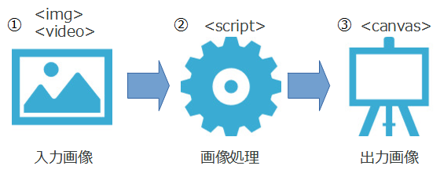
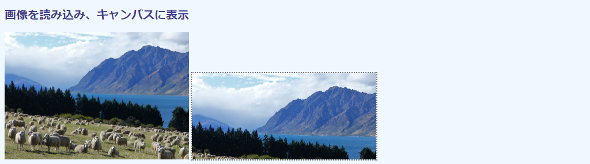

## 第1章 HTML5の画像・ビデオ操作

スタンドアローンで動作するC/C++やPython版と異なり、JavaScript版のOpenCV.jsにはユーザインタフェースが用意されていません。画像やビデオをファイルあるいはURLから読み込んだり、画面に表示したりするには、``、`<video>`、`<canvas>`といったHTML5要素（タグ）を用います。カメラからの読み込みも同様で、ブラウザ（ユーザエージェント）を管理する`Navigator`オブジェクトから操作します。キーボードやマウスのイベントハンドラーも提供されていないので、ユーザ操作は`<input>`などのHTMLや`Event`オブジェクトで管理します。

本章では、これらのHTML5ユーザインタフェース関連を、本書の主題であるOpenCVプログラミングに必要最小限な範囲で説明します。OpenCVの機能には触れません。HTML5のメディア機能に問題のない読者は、第2章に進んでください。

CSSも利用できますが、OpenCVとは直接的には関係しません。本書では、空白なキャンバスが見えるように枠線を加えるといった見栄えの調整に若干使いますが、無視してくれて結構です。CSSファイル（`style.css`）は[付録](TBA "INTERNAL")に掲載してあります。


### 1.1 画像をキャンバスに表示する

Webページでの画像処理は、``で読み込んだ画像をコピーし、それに対して`<script>`内のOpenCVスクリプトで処理を施し、その結果像を`<canvas>`に張り付ける操作が基本です。

<!-- 544 x 277 -->


本節では``と`<canvas>`の用法を説明します。コードは次の通りです。

<!-- 動作確認（✔️❌）： Local/Normal Firefox✔️ Chrome✔️ Edge✔️, Local/CORS Firefox Chrome Edge, HTTP Firefox Chrome Edge -->
```html
[File] html-image.html
  1  <!DOCTYPE html>
  2  <html lang="ja-JP">
  3  <head>
  4    <meta charset="UTF-8">
  5    <link rel=stylesheet type="text/css" href="style.css">
  6  </head>
  7  <body>
  8
  9  <h1>画像を読み込み、そのコピーをキャンバスに表示</h1>
 10
 11  <div>
 12    
 13    <canvas id="canvasTag" class="placeholder"></canvas>
 14  </div>
 15
 16  <script>
 17    let imgElem = document.getElementById('imageTag');
 18    let canvasElem = document.getElementById('canvasTag');
 19    let ctx = canvasElem.getContext('2d');
 20
 21    function showImage() {
 22      canvasElem.width = imgElem.width;
 23      canvasElem.height = imgElem.height;
 24      ctx.drawImage(imgElem, 0, 0, imgElem.width, imgElem.height);
 25    }
 26  </script>
 27
 28  </body>
 29  </html>
```

このHTMLファイルを実行する（ブラウザに読み込む）と、次のような画面が得られます。


左側が読み込んだ画像（12行目の`samples/sheep.jpg`）を表示する``で、右側がそのコピーを収容した`<canvas>`です。

5行目のCSSのロードや、13行目の`class`属性は気にしないでください。画面の見栄えを調節するためだけのもので、画像操作には本質的ではありません。

#### img要素

HTMLページに画像ファイルを取り込むには、`src`属性で画像へのパスを指定した``要素を使います（12行目）。

```html
12    
```

``は`<p></p>`などの閉じタグを持たない独立型のタグなので、``のように末尾の`>`手前に`/`が入ります（なくても怒られはしませんが）。

画像へのパスを指定する`src`以外の属性は仕様上オプションで、凝ったデザインを目指しているのでなければ、実際のところほとんど設定の必要はありません。ここでは`width`に320ピクセルを指定していますが、プログラミング時に邪魔にならない程度に表示を縮小したいからだけです。`height`は未指定ですが、高さは元画像のアスペクト比に準じて自動的に調整されます。この場合、元画像のサイズは1280×885なので、画像高さは1/4の221ピクセルに縮小されます。

プログラミング上必須なのは`id`属性で、ここでは`id="imageTag"`です。これは、スクリプトから画像を一意に識別するのに必要です。他の要素

画像が完全に読み込まれるまでは、処理を始めることはできません。そこで、画像処理を担当する箇所（21～25行目）はロード完了を通知する`load`イベントが発生したことを契機に起動させます。これには、`onload`イベントハンドラ属性から処理メソッド`showImage()`を指定します。

#### canvas要素

``で取り込んだ画像のコピーを張り付ける領域（キャンバス）は、`<canvas>`要素から用意します（13行目）。本書では、ここが画像処理の結果を示すスペースです。

```html
13    <canvas id="canvasTag" class="placeholder"></canvas>
```

プログラミング上必須なのは`id`属性だけで、ここは`id="canvasTag"`をセットしています。

`width`あるいは`height`属性を指定していないので、ページ上ではデフォルトの300×150のスペースが確保されます。もっとも、画像がなければなにも表示されないので、どれだけのスペースが確保されたかは見た目ではわかりません。そこで、ここではCSS（`class="placeholder"`）でキャンバス領域の外周を点線で囲っています（クラスの中身は、外周を設定する`outline: 2px gray dotted;`）。

次に示すのは画像がコピーされる前の初期状態です。キャンバスサイズがデフォルトのままなのが枠線からわかります。


#### DOMオブジェクト

続いて、`<script></script>`で囲まれたスクリプトを説明します（16～26行目）。

最初に、上記の``および`<canvas>`要素にスクリプト内でアクセスできるよう、それらのDOM（Document Object Model）オブジェクトを準備します。`id`属性で名付けられたHTML要素のDOMオブジェクトは、`document.getElementById()`メソッドから検索できます。

```JavaScript
 17    let imgElem = document.getElementById('imageTag');
 18    let canvasElem = document.getElementById('canvasTag');
```

メソッドが返すオブジェクトは、それぞれ`HTMLImageElement`と`HTMLCanvasElement`です。

#### 描画コンテクスト

スクリプトでは、``（17行目の変数`img`）から画像を読み取り、`<canvas>`（変数`canvas`）にコピーします。このようなキャンバスに対する操作は、キャンバスの描画コンテキストを介して行います。「コンテキスト」（文脈）とはまた不明瞭な言い方ですが、画を描く対象の仮想的なキャンバスと考えてください。で、`<canvas>`要素は、その仮想キャンバスを切り取り、ユーザに見えるように画面に表示したものです。

描画コンテキストは、`HTMLCanvasElement`の`getContect()`メソッドから取得します（19行目）。

```JavaScript
 19      let ctx = canvas.getContext('2d');
```

引数には5つほど選択肢がありますが、2次元での描画には2dを指定します（他は3D関連です）。戻り値の`ctx`は、`CanvasRenderingContext2D`というオブジェクトです。

#### 画像のコピー

21～25行目で定義した`showImage()`メソッドは、``要素（`img`）から描画コンテキスト（`ctx`）に画像をコピーします。コピーするメソッドは`CanvasRenderingContext2D`の`drawImage()`メソッドです（24行目）。

```JavaScript
 24      ctx.drawImage(imgElem, 0, 0, imgElem.width, imgElem.height);
```

第1引数には、コピー元の画像オブジェクト（`HTMLImageElementimg`、つまり`imgElem`）を指定します。

第2引数と第3引数には、その画像を張り付けるキャンバス内での(x, y)座標を指定します。ここでは(0, 0)を指定しているので、キャンバスと画像の左上の位置は一致します。

第4引数と第5引数には、張り付けるサイズを指定します。ここでは、ページ上での``と同じサイズ（`width`属性で指定した320×221）を用いたいので、`imgElem.width`と`imgElem.height`を指定しています。

#### いろいろなサイズ

元画像を同じサイズでキャンバスに張り付けるには、キャンバスのサイズを調整しなければなりません。これが22～23行目で、元画像のサイズプロパティでキャンバスの横幅と高さを一致させています。

```JavaScript
 22      canvasElem.width = imgElem.width;
 23      canvasElem.height = imgElem.height;
```

ささいなことに見えますが、重要なポイントです。キャンバスがデフォルトのままだと、張り付けられた画像が300×150で表示されてしまいます。もともとは320×221な画像を、左上を揃えたうえで300×200で切り取ることになるので、元画像の下71ピクセル分と右20ピクセル部分が、次のようにクリッピングされます。


22～23行目を除き、代わりに13行目で`width="320" height="221"`と直接記述することもできます。

```html
 13    <canvas id="canvasTag" width="320" height="221" class="placeholder"></canvas>
```

横縦両方指定しているところに注意してください。横幅だけ320ピクセルにしても、高さが未指定ならデフォルトの150ピクセルのままです。したがって320×150でクリッピングされ、下部分が次のように欠けます（前の画面とほとんど変わりませんが、横は全領域を示すので、右端の稜線や湖手前の樹が微妙に多く含まれます）。



`<canvas>`に属性値からじか書きするのは楽かもしれませんが、画像を変えるたびに、高さを横幅にあわせて手計算しなければなりません。それなら、スクリプトで処理したほうが面倒がなくてよいでしょう。


### 1.2 ユーザインタフェース

OpenCV.jsでは、オリジナルに備わっている`cv.createTrackbar()`などのユーザインタフェース関数が存在しません。画像・動画ファイルの選択、画像サイズなど画像処理のパラメータ指定、マウス操作といったユーザ入力は、`<input>`や`<select>`などおなじみのHTML5要素からから受け付けます。画像処理はそれらの要素の上げるイベントを契機に行います。

本節では、次のHTML要素と操作を実装します。

- `<input type="file">` ... ローカル画像ファイルを選択し、``および`<canvas>`に張り付けます。
- `<input type="range">` ... `<canvas>`上の画像のサイズをトラックバーから変更します。最小値は0、最大値は上記でロードした画像のオリジナルの横幅です。高さは横幅に合わせて自動的に調節します。
- `<input type="button">` ... `<canvas>`上の画像を左右に鏡像反転します。
- `<span>` ... トラックバーで指定したサイズを表示します。

コードは次の通りです。

```html
[File] html-ui.html
  1  <!DOCTYPE html>
  2  <html lang="ja-JP">
  3  <head>
  4    <meta charset="UTF-8"></head>
  5    <link rel=stylesheet type="text/css" href="style.css">
  6  <body>
  7
  8  <h1>HTML の UI</h1>
  9
 10  <div>
 11    
 13    <canvas id="canvasTag" class="placeholder"></canvas>
 14  </div>
 15  <div>
 16    <input id="fileInputTag" type="file" onchange="fileSelected(event);"/>
 17    横幅 <input id="sizeInputTag" type="range" onchange="sizeChanged(event);"/>
 18    <span id="sizeSpanTag" class="currentValue">横幅調節</span>
 19    <input id="reverseButtonTag" type="button" value="反転"
 20      onclick="reversed(event);"/>
 21  </div>
 22
 23  <script>
 24    let imgElem = document.getElementById('imageTag');
 25    let canvasElem = document.getElementById('canvasTag');
 26    let ctx = canvasElem.getContext('2d');
 27    let fileElem =  document.getElementById('fileInputTag');
 28    let rangeElem = document.getElementById('sizeInputTag');
 29    let spanElem = document.getElementById('sizeSpanTag');
 30
 31    function logging(evt) {
 32      let i = imgElem;                      // 1行が長くならないように...
 33      console.log(`Evt ${evt.type}@<${evt.target.tagName}>, "${evt.target.id}",
 34        Image: ${i.width}x${i.height}, ${i.naturalWidth}x${i.naturalHeight},
 35        Canvas: ${canvasElem.width}x${canvasElem.height},
 36        Range: ${rangeElem.min} - ${rangeElem.value} - ${rangeElem.max}`
 37      );
 38    }
 39
 40    function setSpan() {
 41      // <span>に現在の画像サイズを数値で示す
 42      rangeElem.min = 10;
 43      rangeElem.max = imgElem.naturalWidth;
 44      rangeElem.value = canvasElem.width;
 45      spanElem.innerHTML = `${rangeElem.min}≦${rangeElem.value}≦${rangeElem.max}`;
 46    }
 47
 48    function imageLoaded(evt) {
 49      // 画像が読み込まれた（ファイルが選択された）ので、画像をキャンバスにコピーする
 50      canvasElem.width = imgElem.width;
 51      canvasElem.height = imgElem.height;
 52      ctx.drawImage(imgElem, 0, 0, canvasElem.width, canvasElem.height);
 53      setSpan()
 54      logging(evt);
 55    }
 56
 57    function fileSelected(evt) {
 58      // ファイルが選択されたので、画像をに書き込む
 59      let fileFile = fileElem.files[0];
 60      imgElem.src = URL.createObjectURL(fileFile);
 61      logging(evt);
 62    }
 63
 64    function sizeChanged(evt) {
 65      // サイズが変更されたので、変更後のサイズで画像をキャンバスにコピーする
 66      let aspect = imgElem.naturalHeight / imgElem.naturalWidth;
 67      canvasElem.width = Number(rangeElem.value);
 68      canvasElem.height = aspect * canvasElem.width;
 69      ctx.drawImage(imgElem, 0, 0, canvasElem.width, canvasElem.height);
 70      setSpan();
 71      logging(evt);
 72    }
 73
 74    function reversed(evt) {
 75      // 画像が反転されたので、反転画像をキャンバスにコピーする
 76      ctx.translate(canvasElem.width, 0);
 77      ctx.scale(-1, 1);
 78      ctx.drawImage(imgElem, 0, 0, canvasElem.width, canvasElem.height);
 79      logging(evt);
 80    }
 81  </script>
 82
 83  </body>
 84  </html>
```

16行目の`<input>`からファイルを指定したあとの画面を次に示します。


コードの詳細に入る前に、画面構成、各HTML要素が発するイベント、イベント処理関数の流れを、次の図からおおまかに説明します。

<!-- なぜか 1005x496! Libre Office ばかぁ? -->


初期状態では``と`<canvas>`の要素はどちらも空です。

`<input type="file">`（図中「ファイルを選択」の箇所）からのファイル選択により`change`イベントが発生し（図中①）、そのリスナーである`fileSelected()`メソッドが起動します。このメソッドは``に画像をロードします（②）。ロードが完了すると、続いて`load`イベントが上がります。これに伴い`imagLoaded()`が起動し、`<canvas>`に画像をコピーします（④）。これで、どちらのスペースにも同じサイズで画像が表示されます。

`<input type="range">`（「横幅」の箇所）からトラックバーを操作すると`change`イベントが発生し（⑤）、`sizeChanged()`が起動します。このメソッドがキャンバスサイズを変更することで`<canvas>`上の画像を拡大縮小します（⑥）。

`<input type="button">`（「反転」）をクリックすると`click`イベントが上がり（⑦）、`reversed()`起動し、反転画像を`<canvas>`に表示します（⑥）。

`<span>`（「横幅調節」）は画像サイズをピクセル単位で示すもので、`<canvas>`に画像を表示する`imgLoaded()`、`sizeChanged()`、`reversed()`の中から呼び出されます（イベント駆動ではない）。

#### HTML要素

画像、キャンバス、3つのユーザ入力、入力結果の表示をそれぞれ司るHTML要素は、10～21行目で用意しています。

```html
 10  <div>
 11    
 13    <canvas id="canvasTag" class="placeholder"></canvas>
 14  </div>
 15  <div>
 16    <input id="fileInputTag" type="file" onchange="fileSelected(event);"/>
 17    横幅 <input id="sizeInputTag" type="range" onchange="sizeChanged(event);"/>
 18    <span id="sizeSpanTag" class="currentValue">横幅調節</span>
 19    <input id="reverseButtonTag" type="button" value="反転"
 20      onclick="reversed(event);"/>
 21  </div>
```

10～14行目の画像とキャンバスは前節と同じです。``で`width`/`height`を指定しているのは、画像未選択の状態でも表示領域をCSSから示すためで、見栄えだけの話です。

15～21行目が、冒頭で述べたユーザインタフェースです。これらはスクリプトからアクセスできるよう、`<script>`の冒頭でそれらのオブジェクトを用意しておきます（24～29行目）。`<input>`はDOMではいずれも`HTMLInputElement`オブジェクトです。

```Javascript
 24    let imgElem = document.getElementById('imageTag');
 25    let canvasElem = document.getElementById('canvasTag');
 26    let ctx = canvasElem.getContext('2d');
 27    let fileElem =  document.getElementById('fileInputTag');
 28    let rangeElem = document.getElementById('sizeInputTag');
 29    let spanElem = document.getElementById('sizeSpanTag');
```

以下、これらの処理をメソッド単位に順に説明していきます。

#### ファイル選択イベント

`<input type="file">`（16行目）でファイルが選択されると`change`イベントが発生します。そして、`onchange`属性で登録されたイベントリスナーの`fileSelected()`が呼び出されます。57～62行目に定義してあります。

```Javascript
 16    <input id="fileInputTag" type="file" onchange="fileSelected(event);"/>
 ︙
 27    let fileElem =  document.getElementById('fileInputTag'); 
 ︙  
 57    function fileSelected(evt) {
 58      // ファイルが選択されたので、画像をに書き込む
 59      let fileFile = fileElem.files[0];
 60      imgElem.src = URL.createObjectURL(fileFile);
 61      logging(evt);
 62    }
```

メソッドの引数（16行目では`event`、57行目では`evt`）はイベントリスナーに必ず付随するイベントオブジェクト（`Event`）オブジェクトです。その中には、どんなイベントが上がってきたのか（`type`属性）などのイベントに関する情報が収容されています。詳細は次の`<span>`の箇所で説明します。

`HTMLInputElement`オブジェクト`file`の`files`プロパティには、先ほど選択したファイルのリストが収容されています（59行目）。リストなのは、設定次第で複数のファイルを同時に指定できるからです。ここでは1つだけしか選択できないので、リストの最初のものを用います。`files`プロパティは`FileList`オブジェクトですが、配列と同じように要素番号`[]`からアクセスできます。個々の要素は`File`オブジェクトです。

ファイルオブジェクト（`fileFile`）が得られたら、そこからURL（のようなもの）を`URL.createObjectURL()`メソッドから生成します。中身は気にしなくてよいです。得られた値を`imgElem`の`src`プロパティにそのまま代入すれば（60行目）することで、画像として``に表示されます。

``での画像表示が完了すると、それに伴って``のイベントリスナー`imageLoaded()`（48～55行目）が起動します。これが作動すると、キャンバスに画像がコピーされます。`setSpan()`という、次に説明するメソッドを呼び出しているところを除けば基本部分は前節と同じなので、解説は省きます。

#### 現在のサイズ情報

`<span>`（18行目）に用意されたサイズ情報表示エリアは`setSpan()`メソッド（40～46行目）からコントロールされます。

```Javascript
 18    <span id="sizeSpanTag" class="currentValue">横幅調節</span>
 ︙
 29    let spanElem = document.getElementById('sizeSpanTag');
 ︙
 40    function setSpan() {
 41      // <span>に現在の画像サイズを数値で示す
 42      rangeElem.min = 10;
 43      rangeElem.max = imgElem.naturalWidth;
 44      rangeElem.value = canvasElem.width;
 45      spanElem.innerHTML = `${rangeElem.min}≦${rangeElem.value}≦${rangeElem.max}`;
 46    }
```

ここでは、後述のトラックバーの最小値、最大値、現在値を設定します（42～43行目）。トラックバーの値の設定は、次のように`<input>`要素の属性からセットするのが一般的です。

```html
                    最小値    現在値      最大値
<span id="sizeSpanTag" min="10" value="320" max="1280" class="currentValue">
  横幅調節</span>
```

しかし、最大値を画像の最大サイズにしたい場合（つまり元画像に対して縮小表示しかしない）、そのサイズは画像がロードされるまでは不明です。したがって、このようにスクリプトに頼らざるを得ません。現在値も同様で、``および`<canvas>`のサイズと一致させたいので、スクリプトを用いたほうが楽です。

あとは用意した値の文字列で、`HTMLSpanElement`オブジェクト（変数は29行目の`spanElem`）の`innerHTML`プロパティで上書きするだけです。

#### 関連情報の表示

ファイル選択時に起動する`fileSelected()`末尾にある`logging()`メソッド（31～38行目）は受け取ったイベントの概要と、その時々の``、`<canvas>`、`<input type="range">`の状態をコンソールに表示します。

```Javascript
 31    function logging(evt) {
 32      let i = imgElem;                      // 1行が長くならないように...
 33      console.log(`Evt ${evt.type}@<${evt.target.tagName}>, "${evt.target.id}",
 34        Image: ${i.width}x${i.height}, ${i.naturalWidth}x${i.naturalHeight},
 35        Canvas: ${canvasElem.width}x${canvasElem.height},
 36        Range: ${rangeElem.min} - ${rangeElem.value} - ${rangeElem.max}`
 37      );
 38    }
```

メソッド引数にある`evt`（31行目）は呼び出しもとが受けた`Event`オブジェクトです。その種類は`type`プロパティに示されています。そのイベントを受けたDOMオブジェクトは`evt.target`に収容されています。その中にはタグ名を示す`tagName`やHTMLの`id=`で指定したID文字列など、いろいろなプロパティが収容されています（33行目）。

34～36行目は画像とキャンバスのサイズを示しています。サイズにはいくつか種類があり、ここで表示しているのはHTML要素上のサイズである`width/height`、画像のもともとのサイズの`narutralWidth/naturalHeight`です。他にも、画面上にレンダリングされた結果のサイズを示す`offsetWidth/offsetHeight`もあります。次表にこれらサイズプロパティをまとめて示します。

属性 | 意味
---|---
`width`、`height` | HTML属性上のサイズ（``から生成されるトラックバーのプロパティは次に説明します。

初期状態からファイルを読み込むと、`logging()`は次のようにメッセージを出力します。

```
Evt change@<INPUT>, "fileInputTag",
      Image: 320x240, 0x0,
      Canvas: 300x150,
      Range:  - 50 - 
Evt load@, "imageTag",
      Image: 320x240, 1280x853,
      Canvas: 320x240,
      Range: 10 - 320 - 1280
```

先頭の`change`イベントは`<input id="fileInput" type="file">`からのものです。画像はまだ読み込まれていないので、その情報は未確定です。そのため、`naturalWidth`や`narutalHeight`が0になっています。320x240は``から指定した値で、画像のものではありません。キャンバスサイズもデフォルトの150x150のままです。トラックバーの`<input type="range">`の最小値と最大値（左右の-）も、`setSpan()`がまだ呼び出されていないので未確定です。真ん中の現在値だけは50とありますが、これはプロパティのデフォルト値です。

次の`load`イベントは``からです。画像選択と同時に開始された画像読み込みの完了後に発生し、それに伴い起動した`imageLoaded();"`から出力されたものです。

#### サイズ変更イベント

`<input type="range">`（17行目）のトラックバーが操作されると、`change`イベントが発生します。そして、`onchange`属性で登録されたイベントリスナーの`sizeChanged()`が呼び出されます。メソッドは64～72行目に定義してあります。

> `input`と`change`はどちらもUI操作に伴って上がるイベントですが、微妙に異なります。前者はトラックバーのスライダを動かしている間ずっと発生しますが、後者は動かし終えたときのみ発生します。前者はスライダ操作で連続的に画像を変更したいときに、後者は最終値だけを採用したいときにそれぞれ使います。`input`については[x.x節](TBA "INTERNAL")で扱います。

```Javascript
 17    横幅 <input id="sizeInput" type="range" onchange="sizeChanged(event);"/>
 ︙
 28    let rangeElem = document.getElementById('sizeInput'); 
 ︙ 
 64    function sizeChanged(evt) {
 65      // サイズが変更されたので、変更後のサイズで画像をキャンバスにコピーする
 66      let aspect = imgElem.naturalHeight / imgElem.naturalWidth;
 67      canvasElem.width = Number(rangeElem.value);
 68      canvasElem.height = aspect * canvasElem.width;
 69      ctx.drawImage(imgElem, 0, 0, canvasElem.width, canvasElem.height);
 70      setSpan();
 71      logging(evt);
 72    }
```

スライダの指し示す値は`HTMLInputElement`（変数`rangeElem`）の`value`プロパティから得られます（66行目）。ただし、そのデータ型は文字列なので、数値演算をするには`Number()`から数値型に変換しなければなりません。

スライダの値はここでは横幅を示すものとしているので、高さは画像のもともとのサイズから得られるアスペクト比（`naturalHeight/naturalWidth`）から計算します（68行目）。画像中のピクセルの位置座標は整数なので、`Math.floor()`から小数点以下は切り捨てます。OpenCVはデータ型にうるさいので、浮動小数点数と混ぜないように気を配ってください。

これで、キャンバスサイズが変更されました。あとは、69行目はそのサイズでキャンバスのコンテクストに画像を張り付けるだけです。加えて`setSpan()`から現在のサイズを表示します。初期状態の横320ピクセルから483ピクセルに拡大した様子を次に示します。`<span>`に示された現在値が483になっているところがポイントです。


サイズ変更の`change`イベントが発生したときの`logging()`のメッセージを次に示します。

```
Evt change@<INPUT>, "sizeInputTag",
      Image: 320x240, 1280x853,
      Canvas: 483x321,
      Range: 10 - 483 - 1280
```

#### 反転イベント

`<input type="button">`（19～20行目）の「反転」ボタンをクリックすると`click`イベントが発生し、`onclick`属性で指定した`reserved()`メソッド（74～80行目）が起動します。

```JavaScript
 19    <input id="reverseButtonTag" type="button" value="反転"
 20      onclick="reversed(event);"/>
 ︙
 74    function reversed(evt) {
 75      // 画像が反転されたので、反転画像をキャンバスにコピーする
 76      ctx.translate(canvasElem.width, 0);
 77      ctx.scale(-1, 1);
 78      ctx.drawImage(imgElem, 0, 0, canvasElem.width, canvasElem.height);
 79      logging(evt);
 80    }
```

ここまでは`document.getElementById()`からDOMオブジェクトへの参照を用意してきましたが、ボタンではそれをしていません。ページの状態にかかわらずキャンバスを反転させているだけなので、参照すべきものがとくにないからです。

画像の反転は、座標系の平行移動と負の定数倍から行います。

描画コンテキストの座標系を移動するには、`CanvasRenderingContext2D.translate()`メソッドを用います。引数には移動する(x, y）の距離を指定します。74行目のようにキャンバスの幅のぶんだけ、x座標を右横（正の方向）にずらせば、もともとは(canvas.width, 0)だった位置（画像の右端）が、新たに原点(0, 0)となります。y座標は変更しないので0を指定します。この操作により、下図に示すように、張り付けられていた画像がx軸で負の領域方向に位置することになります。

<!-- 480x320 -->


負の領域に入っているので、このままではキャンバスには表示されません。そこで、画像中のx位置（現在負）をすべて-1倍します。これで、たとえば、x=-10の位置にあったピクセルが、x=10の位置に移動します。座標系を定数倍するには、`CanvasRenderingContext2D.scale()`メソッドを用います。引数は座標位置(x, y)です。75行目のように(-1, 1)を指定すれば、x位置は正負が入れ替わり、y位置はそのままとなり、効果として反転と同じになります。

<!-- 408x235 -->


このように、HTMLだけでもある程度の画像処理はできます。`CanvasRenderingContext2D`に備わっている画像処理関係のメソッドを参考までに次に示します。

メソッド | 機能
---|---
`crip()` | 指定の領域をクリッピングする。
`rotate()` | 座標系を回転する。
`scale()` | 座標系を定数倍する（拡大縮小あるいは反転に利用できる）
`translate()` | 座標系を平行移動する。
`transform()` | 座標系をアフィン変換する（拡大縮小、反転、せん断を3×3の行列から指定）。

`CanvasRenderingContext2D`のその他のメソッドは、四角形や円弧などの図形を描くものです。グラフィックス機能はOpenCVにも備わっています。どちらというとHTMLのほうが機能が豊富（たとえば、OpenCVにはない点線描画や日本語フォントが使える）ですが、OpenCVでは描画コンテキストは操作しないので、グラフィックスもOpenCVのものを用いたほうが簡単だと思われます。
