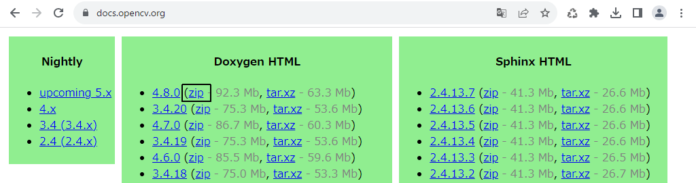
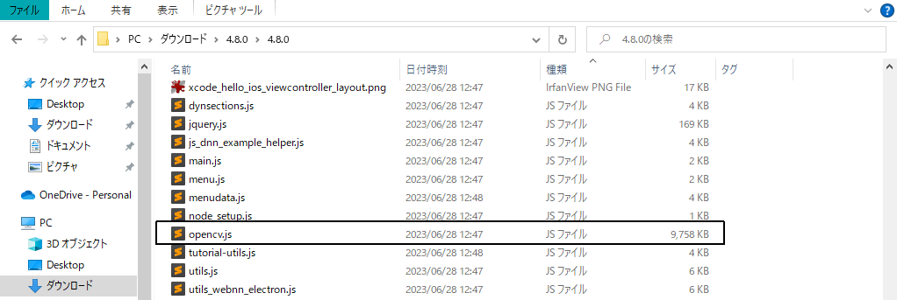
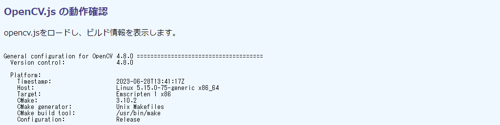
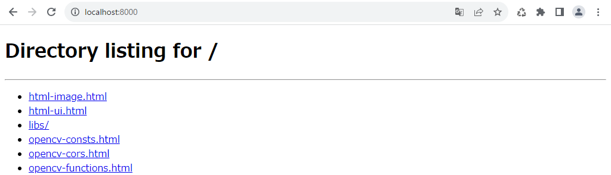
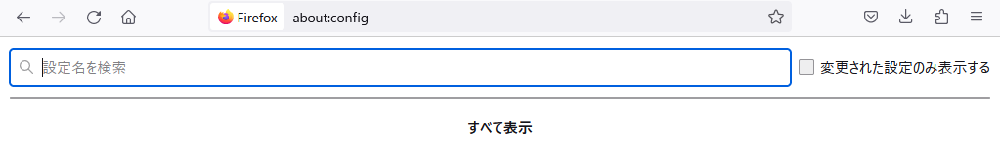
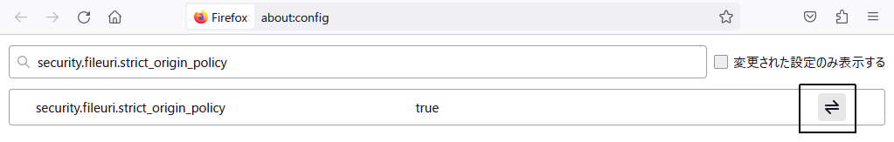
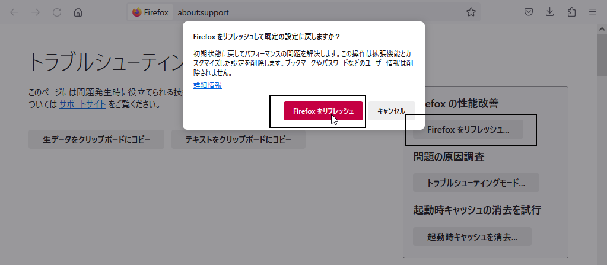
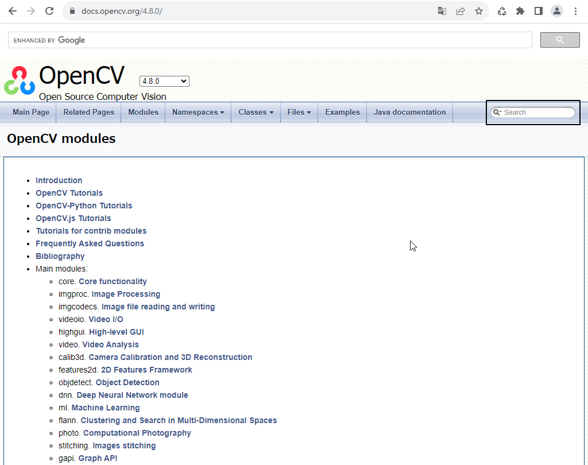
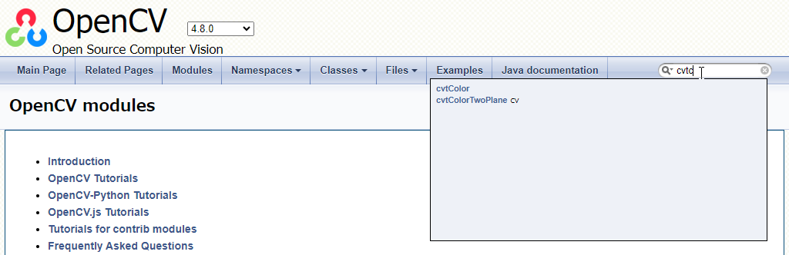
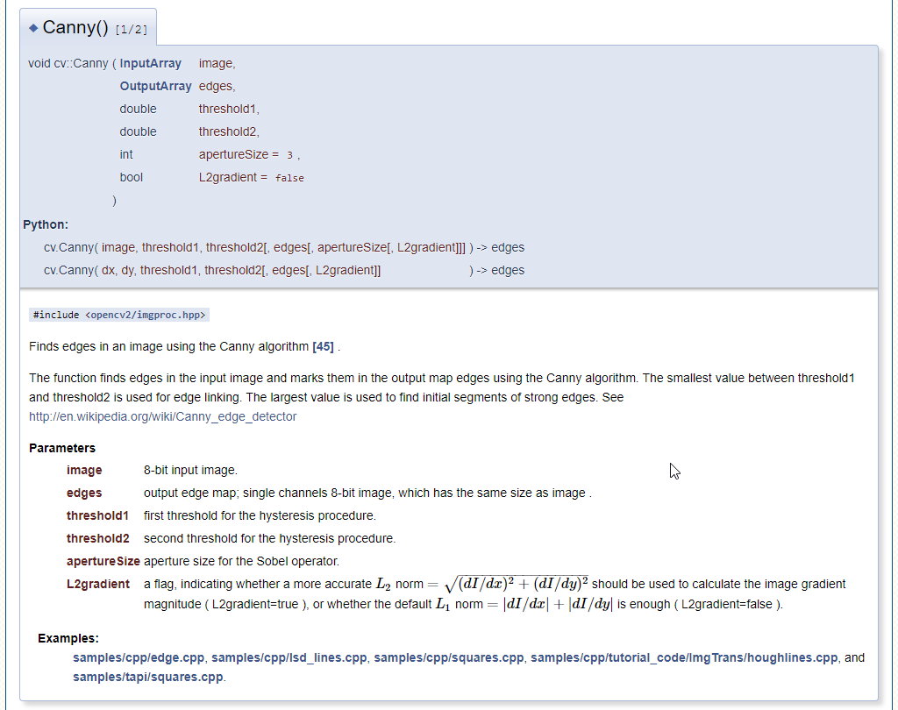

## 第2章 OpenCV.jsの導入

本章ではJavaScript版OpenCV（以下、OpenCV.js）の導入方法を示します。

### 2.1 OpenCV.jsの準備

#### opencv.jsファイル

OpenCV.jsで必要なファイルは`opencv.js`だけです。

通常のJavaScriptファイルと同じように、`<script>`から読み込んで利用します。HTMLファイルと同じディレクトリに置いてあれば、`src="opencv.js`のように`src`属性を設定します。本書のサンプルコードでは`libs`サブディレクトリに置くという前提として、次のように書いています。

```html
<script async src="libs/opencv.js" type="text/javascript"></script>
```

JavaScriptだから読めるだろう、とエディタでは開かないように。ファイルサイズが約10 MBと巨大なだけでなく、ほとんどがBase64表現されたバイナリで埋め尽くされているからです（C/C++から起こされたWebAssemblyのバイナリコード）。ヒトに読めるものではありません。

ファイルのロードが完了すれば、`cv`という変数にオブジェクトが準備されます（ファイル内では`var cv`で定義されている）。以降、OpenCVの関数や定数は、すべてこのオブジェクトのプロパティとしてアクセスできます。

純然たるJavaScriptファイルなので、`src`属性には次節で示す直接ダウンロード先のURLを指定することもできます。

```html
<script async src="https://docs.opencv.org/master/opencv.js"
	type="text/javascript"></script>
```

これなら、自機やサーバに`opencv.js`のコピーを用意する必要もありません。

#### ダウンロード

自機の開発環境、あるいは運用しているWebサーバに`opencv.js`のコピーが必要なら、ダウンロードします（本書ではローカルコピーを使用しています）。

`opencv.js`は、ドキュメントのトップページ（`https://docs.opencv.org/`）に置かれたドキュメントZipファイルに同梱されています。ページはバージョン毎に整理されているので、とくに要求がなければ、最上端の最新版からzipをダウンロードします。次の画面では、バージョン4.8.0の「zip」へのリンクです。

<!-- 枠線なし版あり -->


ファイルサイズが約100 GBとかなり大きいものなので、ダウンロードには時間がかかります。Zipは展開し、`opencv.js`だけを抽出します。参考までに、次にZipファイルを展開したWindows エクスプローラの画面を示します。

<!-- 枠線なし版あり -->


これ以外のファイルは、必要に応じて適宜利用してください。画像ファイルは、オンラインドキュメントと同じ画像でテストをしたいときに使えます。`opencv.js`以外のJavaScriptファイルも重宝します。たとえば、`utils.js`はOpenCV.jsチュートリアルの内部で用いているもので、チュートリアルのコードを自分の環境で動作させるときに必要になります。

必須なのは`opencv.js`だけなので、次のURLから直接アクセスもできます。

```https://docs.opencv.org/4.8.0/opencv.js```

URLの間にあるディレクトリ名はバージョンで、上記では4.8.0です。より新しいバージョンが出ているようなら、そちらに変更してください。常に最新ビルドのものを使いたいのなら、次のURLです。

```https://docs.opencv.org/master/opencv.js```

これは、OpenCVのGet Startedページ（トップページからロケットアイコンの［Get Starated］からアクセス）に掲載されているテスト用HTMLページで用いられています。先ほどチェックしたとことろ、開発者版（dev）のものでしたが、実行的には変わりません。

これらURLにブラウザからアクセスすると、中身がそのまま表示されます。問題があるわけではありませんが、謎のBase64文字ばかりです。URLのターゲットを直接ファイルに落とせる`curl`などのツールからダウンロードするとよいでしょう。

#### 動作試験

`opencv.js`を適切な場所に置いたら、動作試験をします。

ここでは、OpenCVメソッドの`getBuildInformation()`からOpenCVバージョンなどのビルド情報を表示します。次に示すHTMLコードは、このコードのあるディレクトリの直下の`libs`サブディレクトリに`opencv.js`が置かれたものとして書いてあります。

```html
[File] opencv-test.html
  1  <!DOCTYPE html>
  2  <html lang="ja-JP">
  3  <head>
  4    <meta charset="UTF-8">
  5    <link rel=stylesheet type="text/css" href="style.css">
  6    <script async src="libs/opencv.js" type="text/javascript"></script>
  7  </head>
  8  <body>
  9
 10  <h1>OpenCV.js の動作確認</h1>
 11
 12  <p>opencv.jsをロードし、ビルド情報を表示します。</p>
 13
 14  <div>
 15    <pre id="statusTag">OpenCV Loading ...</pre>
 16  </div>
 17
 18  <script>
 19    let statusElem = document.getElementById('statusTag');
 20    var Module = {
 21      onRuntimeInitialized: function() {
 22        statusElem.innerHTML = cv.getBuildInformation();
 23      }
 24    };
 25  </script>
 26
 27  </body>
 28  </html>
```

当然なことですが、OpenCVのファイルが読み込まれ、利用可能になるまで、OpenCVの機能は一切利用できません。

そこで、すべての準備が完了したあとで、各種の処理を始めます。

OpenCV.jsには、トップレベルに`Module`というオブジェクトが用意してあります。そして、その`onRuntimeInitialized`プロパティには、準備が完了したときに実行するコールバック関数を指定できます。`document.addEventListener()`のようなものだと思ってください。ここでは、それは21～23行目で定義されている無名関数で、15行目の`<pre>`のテキスト部分（`innerHTML`）を、`cv.getBuildInformation()`の返すビルド情報（文字列）と入れ替えます。

実行します。HTMLを読み込んだ時点では「OpenCV Loading ...」と表示されていますが、1秒後くらいにその部分にビルド情報が表示されます。結果を次に示します。



#### 読み込みタイミング

画像など非同期的に読み込まれるリソースを読み込み完了後に処理するには、`onclick="..."`などのイベントリスナーをHTML要素の中に書き込む、あるいは`addEventListener()`から発生イベントに処理メソッドを対応付けるのが通例です。

しかし、この手はOpenCV.jsでは使えません。`load`イベントは`opencv.js`のバイトコードがダウンロードされたことしか意味しておらず、これが内部で利用可能な状態になったことまでは保証していないからです。

試してみます。次のコードは、通常の`load`イベントが完了したら、OpenCV（`cv`オブジェクト）に定義されている`cv.CV_8UC1`という定数（値は数値の1）を表示します。

```html
[File] opencv-load1.html
  1  <!DOCTYPE html>
  2  <html lang="ja-JP">
  3  <head>
  4    <meta charset="UTF-8">
  5    <link rel=stylesheet type="text/css" href="style.css">
  6    <script async id="scriptTag" src="libs/opencv.js" type="text/javascript">
  7      </script>
  8  </head>
  9  <body>
 10
 11  <h1>OpenCV.js ローディングのタイミング・その1</h1>
 12
 13  <script>
 14    let scriptElem = document.getElementById('scriptTag');
 15    scriptElem.addEventListener('load', function(evt) {
 16      console.log(`OpenCV ready? cv.CV_8UC1 = ${cv.CV_8UC1}`);
 17    });
 18  </script>
 19
 20  </body>
 21  </html>
```

しかし、`load`完了後ではまだ`cv`の中身が用意できていないので、値は`undefined`となります。次にコンソールに表示されたメッセージを示します。

```
OpenCV ready? cv.CV_8UC1 = undefined
```

蛇足ですが、OpenCV.jsはemscriptenというコンパイラでコンパイルされたWeb Assembly（wasm）コードで、`Module`はそのAPIが定義するグローバルなオブジェクトです。詳細はemscriptenのAPIリファレンスを参照してください。

ついでなので、`opencv.js`のダウンロードから実行準備までにかかる時間を測定します。次のコードは、上記に`var Module`を加え、それぞれの完了時間を示すものです。

```html
[File] opencv-load2.html
  1  <!DOCTYPE html>
  2  <html lang="ja-JP">
  3  <head>
  4    <meta charset="UTF-8">
  5    <link rel=stylesheet type="text/css" href="style.css">
  6    <script async id="scriptTag" src="libs/opencv.js" type="text/javascript">
  7      </script>
  8  </head>
  9  <body>
 10
 11  <h1>OpenCV.js ローディングのタイミング・その2</h1>
 12
 13  <script>
 14    let startTime = new Date().getTime();
 15
 16    function showTime() {
 17      let t = new Date().getTime();
 18      return `${t} Δ${t-startTime}`
 19    }
 20
 21    let scriptElem = document.getElementById('scriptTag');
 22    scriptElem.addEventListener('load', function(evt) {
 23      console.log(`onload: ${showTime()}`);
 24    });
 25
 26    var Module = {
 27      onRuntimeInitialized: function() {
 28        console.log(`onRuntimeInitialized: ${showTime()}`);
 29      }
 30    };
 31  </script>
 32
 33  </body>
 34  </html>
```

`showTime()`メソッド（16～19行目）は現在の時刻とスクリプト開始からの時間（Δ）を示すものです。ローカル（`http://localhost/`）での実行結果を示します。

```
onload: 1696552801989 Δ401
onRuntimeInitialized: 1696552802746 Δ1158
```

`opencv.js`がロード完了するのは開始から401ミリ秒後、利用可能になるのは1158ミリ秒後、つまりロードからずいぶんと遅れてからなことがこれでわかります。また、ブラウザ環境の性能にもよりますが、実際に画像処理に取りかかれるのに1秒ほど待たなければならないこともわかります。

### 2.2 OpenCV.jsの定数と関数

#### OpenCVの定数

OpenCVプログラミングでは、あらかじめ定義されたいろいろな定数を利用します。たとえば、8ビット符号なし整数・1チャネルの画像データ型を指定するときは、普通は定義された直値では書かず、その値を収容した定数名`cv.CV_8UC1`を指定します。

どの定数もトップレベルオブジェクトの`cv`のプロパティとして用意されているので、`cv.XXXX`の形でアクセスできます。

本書でもっともよく用いるのは、先ほど例示した`CV`で始まる画像のデータ型を示す定数です。他にも、色変換に用いる`COLOR`で始まるもの、2値化処理で閾値のタイプを示す`THRESH`で始まるものも使います。

次のコードは、これら定数名とその値を一覧するものです。デバッグ等で定数値を表示したとき、それに対応する定数名を得るときに便利です。

```html
[File] opencv-consts.html
  1  <!DOCTYPE html>
  2  <html lang="ja-JP">
  3  <head>
  4    <meta charset="UTF-8">
  5    <link rel=stylesheet type="text/css" href="style.css">
  6    <script async src="libs/opencv.js" type="text/javascript"></script>
  7  </head>
  8  <body>
  9
 10  <h1>OpenCVの定数</h1>
 11
 12  <div>
 13    <select id="selectTag">
 14      <option value="noop" selected>定数を選択してください</option>
 15      <option value="^CV_\d{1,2}[SUF]">データ型定数</option>
 16      <option value="^COLOR_">色空間変換定数</option>
 17      <option value="^THRESH_">閾値定数</option>
 18    </select>
 19  </div>
 20  <div>
 21    <pre id="preTag">定数表</pre>
 22  </div>
 23
 24  <script>
 25    let selectElem = document.getElementById('selectTag');
 26    let preElem = document.getElementById('preTag');
 27
 28    var Module = {
 29      onRuntimeInitialized: opencvReady
 30    }
 31
 32    function showConst(evt) {
 33      let re = new RegExp(evt.currentTarget.value);
 34      let keys = Object.keys(cv);
 35
 36      let selected = keys.filter(function(elem) {
 37        return re.test(elem);
 38      }).sort();
 39
 40      preElem.innerHTML = selected.map(function(elem) {
 41        return `${elem} ${cv[elem]}`;
 42      }).join('\n');
 43
 44      console.log(`RegExp ${re} extracted ${selected.length} keys.`);
 45    }
 46
 47    function opencvReady() {
 48      console.log('OpenCV ready.');
 49      selectElem.addEventListener('change', showConst);
 50    }
 51  </script>
 52
 53  </body>
 54  </html>
```

スクリプティング上、気を付けなければならないのはタイミングです。OpenCVが利用可能になると（28～30行目）、`opencvReady`メソッド（47～50行目）が起動します。このタイミングで、`<select>`（13～18行目）で値が選択された（`change`イベント）ときに起動するメソッド`showConst()`（32～45行目）を登録します。つまり、OpenCVが用意できていない間は（開始から1秒ほど）、プルダウンメニューは利用できません。これで、内部で`cv`モジュールを参照するメソッドを準備前に呼び出して参照エラーを起こさないようにできます。

`showConst()`メソッドは、`cv`オブジェクトのキーを`Object.keys()`から取ってきて（34行目）、`<options>`の`value`に仕込んだ定数のパターンを記述する正規表現でフィルタリング（36行目）している単純なものです。他に知りたい定数があれば、適宜`<option>`にその正規表現を加えてください。

定数名とその値くらいオンラインドキュメントで検索すればよいように思えますが、同じカテゴリーのものをまとめて調べるのは意外と難しいです。

#### OpenCVのコンストラクタとメソッド

続いては、先と同じ要領でOpenCVのコンストラクタおよびメソッド（つまり`Function`型）をリストします。

これこそオンラインドキュメントで調べるべきものですが、C/C++版にあってOpenCV.jsにはない関数がかなりあります。そのため、マニュアルやチュートリアルを不用意にそのまま移植すると、そんなメソッドはないというエラーが頻出することになります。

OpenCV.jsにないものの代表はユーザインタフェース関連です（オンラインマニュアルの分類ではHigh-level GUI）。ボタンクリックやマウス操作といったユーザイベント処理、ウィンドウ操作は、HTMLの機能を使う前提なため、提供されていません。また、contribと呼ばれる最新アルゴリズムのライブラリも、まだ正式版には編入されていないということで、含まれていません。他にも、できそうでもできないメソッドにはしばしばお目にかかります。

メソッド不明のエラーが出たときは、OpenCV.jsに実装されているかを確認する必要があります。

コードは簡単で、先の定数検索のフィルタリングを`typeof object === 'function`に変更するくらいです。コードを次に示します。

```html
[File] opencv-functions.html
  1  <!DOCTYPE html>
  2  <html lang="ja-JP">
  3  <head>
  4    <meta charset="UTF-8">
  5    <link rel=stylesheet type="text/css" href="style.css">
  6    <script async src="libs/opencv.js" type="text/javascript"></script>
  7  </head>
  8  <body>
  9
 10  <h1>OpenCV.jsで利用可能なコンストラクタ、メソッド</h1>
 11
 12  <div>
 13    <pre id="preTag"></pre>
 14  </div>
 15
 16  <script>
 17    let preElem = document.getElementById('preTag');
 18
 19    function listFunctions(obj) {
 20      let keys = Object.keys(obj);
 21      console.log(`${keys.length} entries in CV.`);
 22
 23      let functions = keys.filter(function(key) {
 24        return typeof cv[key] === 'function';
 25      });
 26      console.log(`${functions.length} functions in CV.`);
 27
 28      functions.sort(function(a, b) {
 29        return a.toUpperCase() > b.toUpperCase();
 30      });
 31
 32      preElem.innerHTML = functions.join('\n');
 33    }
 34
 35    var Module = {
 36      onRuntimeInitialized: function() {
 37        console.log(`OpenCV ready`);
 38        listFunctions(cv)
 39      }
 40    };
 41  </script>
 42
 43  </body>
 44  </html>
```

実行例を次に示します。


### 2.3 Cross-Orgignの問題

#### 画像のOpenCVへのコピーが失敗する

OpenCVプログラミングでは、``あるいは`<canvas>`に読み込んだ画像をコピーし、処理し、結果を張り付けて示します（[1.1節](./01-html5.md#11-画像をキャンバスに表示する "INTERNAL")）。しかし、この作業は、ローカルファイルシステムから読み込んだHTMLファイル（たとえば、`file:///C:/opencv-cors.html`）で実行するとエラーを上げます。

次のコードを考えます。

```html
[File] opencv-cors.html
  1  <!DOCTYPE html>
  2  <html lang="ja-JP">
  3  <head>
  4    <meta charset="UTF-8">
  5    <link rel=stylesheet type="text/css" href="style.css">
  6    <script async src="libs/opencv.js" type="text/javascript"></script>
  7  </head>
  8  <body>
  9
 10  <h1>img の画像をコピーしようとすると CORS エラーになる</h1>
 11
 12  <div>
 13    
 14    <canvas id="canvasTag" class="placeholder"></canvas>
 15  </div>
 16
 17  <script>
 18    let imgElem = document.getElementById('imageTag');
 19
 20    var Module = {
 21      onRuntimeInitialized: imgProc
 22    }
 23
 24    function imgProc() {
 25      let src = cv.imread(imgElem);                  // DOMException
 26      cv.imshow('canvasTag', src);
 27      src.delete();
 28    }
 29  </script>
 30
 31  </body>
 32  </html>
```

25行目の`cv.imread()`は``要素から画像データを読み込む、26行目の`cv.imshow()`はその画像データを`<canvas>`要素に張り付けるOpenCV.jsのメソッドです。意図していることは、[1.1節](./01-html5.md#11-画像をキャンバスに表示する "INTERNAL")の`html-image.html`と変わりありません。しかし、ローカルファイルシステムから実行すると、キャンバス（CSSで枠線の描かれた領域）に画像が張り付けられません。


コンソールに示されるエラーメッセージを次に示します（紙面で読みやすくなるよう、行番号を加えるなど一部を編集しています）。

```
 1 opencv.js:30 Uncaught (in promise) DOMException:
 2  Failed to execute 'getImageData' on 'CanvasRenderingContext2D':
 3  The canvas has been tainted by cross-origin data.
 4   at Module.imread (file:///C:/libs/opencv.js:30:9984735)
 5   at Object.imgProc[as onRuntimeInitialized] (file:///C:/opencv-cors.html:25:18)
 6   at doRun (file:///C:/libs/opencv.js:30:9983689)
 7   at run (file:///C:/libs/opencv.js:30:9983849)
 8   at runCaller (file:///C:/libs/opencv.js:30:9983348)
 9   at removeRunDependency (file:///C:/libs/opencv.js:30:14897)
10   at receiveInstance (file:///C:/libs/opencv.js:30:9786136)
11   at receiveInstantiatedSource (file:///C:/libs/opencv.js:30:9786256)
```

1～3行目がポイントで、「キャンバスがcross-originなデータ」で汚染されているために`DOMException`が上がってきたと述べています。

#### CORS制約の問題

cross-originは、データ（ここでは画像）とHTMLとでオリジン（端的にはドメインとポート番号の組）が異なることを指します。たとえば、HTMLは`https://www.example.com/`から、画像は`https://www.example.net`から読み込まれているような状態です。それは、ページに他所の怪しいサイトから怪しいデータが入り込んでいる可能性を示すもので、セキュリティ上の問題があります。そのため、ブラウザが他所の画像を、ページに張り付けるのを拒絶したのです。

異なるオリジン間でのデータ共有のメカニズムをCORS（Cross-Origin Resource Sharing）と言います。ブラウザにはどのようなCORS操作なら認められているかをデフォルトで定めており、昨今のセキュリティ問題を反映して、かなり厳しいものになっています。たとえば、`file:///`へのアクセスは、同じディレクトリにあっても拒否されます。

この問題を解消するには3つの方法があります。

1. ローカルでWebサーバを運用する。これなら、画像もHTMLファイルも同じ`http://localhost/`というオリジンを共有することになるので、CORSエラーは発生しません。本書ではこの方法を使っています。
2. インターネット上のWebホスティングサービスにアップロードする。対処療法は上記と同じです。問題はタダではないことと、フリーなものだと不安なところです。試験用あるいは勉強用に使うぶんにはフリーなものもよいでしょう。
3. CORS設定を一時的に無視するようにブラウザを設定する。この方法は比較的簡単ですが、ブラウザが脆弱になるという問題があります。設定を変更したら、必ずもとに戻さなければなりません。

本節では1と3の方法を説明します。3についてはFirefox、Chrome、Edgeのものを紹介します。

なお、CORS設定の方法はブラウザのバージョンとともに変わります。本書の記述は執筆時点の最新バージョンで試していますが、同じ方法が古い、あるいは将来のバージョンでも通用する保証はありません。

#### ローカルWebサーバを用意する

apacheあたりを自機にインストールするのが王道ですが、設定が面倒なのが問題です。簡単に済ませるなら、Pythonのワンライナーでしょう。コマンドプロンプト（やコンソール）から自分のHTMLや画像のあるディレクトリに移動し、次のコマンドを実行するだけです。

```
python -m http.server --bind 127.0.0.1
```

`127.0.0.1`はローカルループバックアドレスで、自機内でしか有効ではない（他のホストからはアクセスできない）IPアドレスです。`localhost`という名前（ドメイン名）が付いています。

> 注意：Python http.serverはデフォルトではアドレス`0.0.0.0`を使います。`0.0.0.0`はワイルドカードなアドレスなので、ローカルネットワーク内のすべてのホストからアクセスできます。同僚や家族の目が気になるなら、`--bind`オプションの指定を忘れないでください。

ブラウザに`http://localhost:8000/`（`http.server`のデフォルトポートは8000番です）と入力すれば、そのディレクトリにあるファイルが一覧できます。次に、筆者の執筆環境のディレクトリから起動したサーバにアクセスしたときの画面を示します。



あとは、好みのファイルをクリックするだけです。

Pythonをインストールしなければならないのが難点ですが、それ自体は難しくはありません（JavaScript本で言うのもなんですが、あると人生が豊かになります）。インストーラは次に示すURLからダウンロードできます。

```https://www.python.org/downloads/```

他にも、1行だけでサーバを実行できるユーティリティや言語もあります。検索してください。

JavaScriptユーザならNode.jsのほうがよいかもしれません。コードがやや長くなるのがたまに傷ですが、npm（node package manager）に超簡便なWebサーバもあります（検索しましょう）。

> httpsはself-signed証明書が必要なので、かなりややこしいです。

#### ブラウザのCORS緩和設定（Firefox）

> 注意：本節の設定により、ブラウザのセキュリティレベルは著しく低下します。利用はOpenCVファイルのテスト中だけにかぎり、アクセス先は`localhost`のみにします。

ここではFirefoxでのCORS制限の緩和方法を紹介します。

URLフィールドに`about:config`と入力することで、「高度な設定」画面に進みます。最初に「注意して進んでください！」と警告されるので、注意しながら［危険性を承知のうえで使用する］をクリックします。［設定名を検索］するフィールドを上端に示したページが次の画面のように表示されます。



<!-- content.cors.disable を true に変更するという話も出ているが、これは利かない模様 -->
`security.fileuri.strict_origin_policy`を入力し、デフォルト値のfasleを、右にある「切り替え」アイコン（⇄）をクリックすることでtrueに変更します。

<!-- 枠なし版あり -->


これでローカルファイルにCORSエラーなしでアクセスできるようになります。

利用が終わったらもとのfalseに戻します。

気になるなら、Firefoxのすべての設定を工場出荷時に戻すリフレッシュを行います。ウィンドウ右上にある設定（≡）ボタンから［ヘルプ］>［他のトラブルシューティング情報］で、右にある［Firefoxをリフレッシュ］です。ボタンをクリックすると次の画面のように警告画面が現れるので、リフレッシュします。

<!-- 枠なし版あり -->


#### ブラウザのCORS緩和設定（ChromeおよびEdge）

> 注意：本節の設定により、ブラウザのセキュリティレベルは著しく低下します。利用はOpenCVファイルのテスト中だけにかぎり、アクセス先は`localhost`のみにします。

ChromeおよびEdgeでは、プログラム実行時のオプションからCORS制限を緩和します。コマンドプロンプト（やコンソール）から次のように実行します。

```
"C:\Program Files\Google\Chrome\Application\chrome" --disable-web-security --user-data-dir="C:\temp\temp"
```

オプションはどちらも指定しなければなりません。後者の`--user-data-dir`にはユーザデータを保存するディレクトリを指定します。ここでは`C:\temp\temp`を指定しています。これで、このディレクトリに各種のデータが保存されます。大量なので、空きディレクトリを指定します。利用が終わったら、ディレクトリごと削除してまかまいません。

オプション指定なので、普段使いしているChrome/Edgeには影響しません。


### 2.4 OpenCVドキュメンテーション

#### OpenCV公式リファレンス

OpenCVの関数や定数は次に示すOpenCV公式リファレンスから参照します。

```https://docs.opencv.org/``

トップページには[2.1節](#21-OpenCV.jsの準備 "INTERNAL")で示したように各バージョンへのリンクが列挙されているので、利用しているバージョンあるいは最新のものクリックします（本書では4.8.0）。ドキュメントページを次の画面に示します。

<!-- 枠なし版あり -->


coreやimgprocなどモジュール別に分けられているので、目的の関数や定数をピンポイントに見つけるのはむずかしくなっています。その代わり、右上のサーチフィールドの予測入力が賢いので、入力するにつれ候補を示してくれます。次の画面では`cv.cvtColor()`メソッドの書式を調べるために、「cvtc」まで打ったところを示しています（先頭の`cv`は不要です）。



このキーワードを含む関数および定数がドロップダウンリストとして表示されるので、目的のものをクリックします。項目によってはさらに細分化されますが、目的の名称と最も近い細目を選びます（たとえば、`cv::cuda::cvtColor()`とあるのはGPUのCUDA用なので目的のものではありません）。

#### 関数定義

公式リファレンスの関数定義には、次に示すようにC/C++とPythonのものしか記載されていません。OpenCV.jsは基本的にC/C++のシグニチャを踏襲しているので、そちらを見ます。次に、`cv.Canny()`メソッドの関数定義を示します。



表題に「Canny() [1/2]」とあるのは、同名であっても引数の恰好の異なるパターン（シグニチャ）があることを示しています。C++ではこれをオーバーロードと呼びますが、JavaScriptでは使われない技法です（TypeScriptなら見かけ上できますが）。残念ながら、OpenCV.jsでどちらの形式を使っているかは見ただけではわかりません。

関数名が`cv::Canny`のように`cv`とメソッド名の間が`::`となっているのはC++の記法なので、これは`.`と読み替えます。この場合は`cv.Canny()`です。

データ型は、適宜JavaScriptのものに読み替えます。たとえば、`dobule`や`int`は`number`です。よく使われるものの対応関係を、細かいニュアンス（`&`や`*`や`<type>`のバリエーションとか）は無視して次に示します。

C/C++のデータ型 | OpenCV.jsのデータ型 | 注意
---|---|---
`bool` | `boolean` | 
`double`、`float`、`int` | `number` | 
`String` | `string`
`InputArray`、`OutputArray` | `cv.Mat` | `Input`は入力画像の、`Output`は結果画像を収容するコンテナをそれぞれ指す。
`Mat` | `cv.Mat` | 画像のコンテナ。
`std::vector<Mat>` | `cv.MatVector` | 画像を複数収容した配列（C++の`Vector`）。
`Point` | `cv.Point` | 画像ピクセルの(x, y)座標を収容する構造体。`Point2f`のように付加情報が加わっているときは中のデータ数とその型を示す（`2f`は2個の端精度浮動小数点数型）。
`Rect` | `cv.Rect` | 四角形の形状（x, y, width, height)を指定する構造体。
`Scalar` | `cv.Scalar` | 複数（1～4）の数値を収容する構造体。
`Size` | `cv.Size` | 画像の縦横サイズを収容する構造体。

`cv.`で始まるデータ型については次章で説明します。

C++の`Vector`は配列（`Array`）のようなもので、同じデータ型を複数個収容します。C++では`vector<InputArray>`のように`<>`の中にデータ型を記述しますが、OpenCV.jsではそれ専用のオブジェクトが用意されます。たとえば、`cv.Point`の配列（ベクター）なら`cv.PointVector`です。これらについては、サンプルコードで使用するときに説明します。


定義がコンストラクタであるときは、JavaScriptの作法にのっとって`new`を加えます。たとえば、C/C++の`Mat()`は、`new cv.Mat()`と読み替えます。

`=`の付いているもの（上画面では`int apertureSize = 3`など）はデフォルト引数です。
