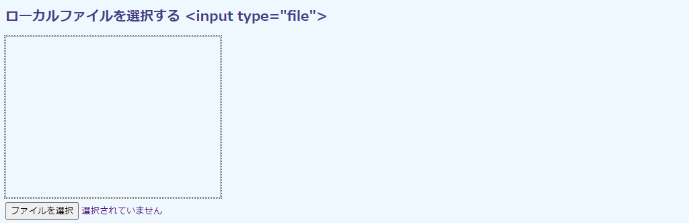
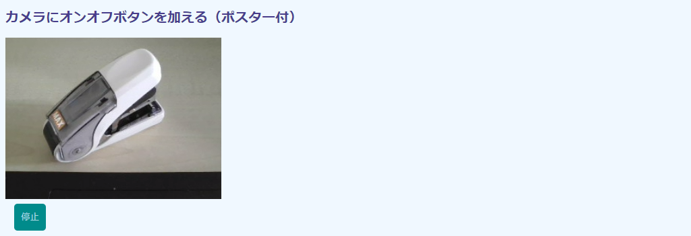
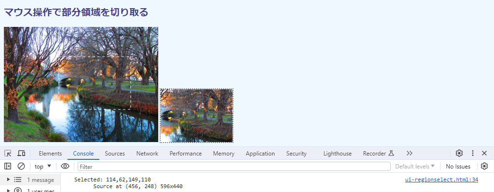

## 第2章 HTML5のユーザインタフェース

入出力と同じ理由で、OpenCV.jsにはユーザインタフェース機能は用意されていません。ボタンやプルダウンメニューなどには`<input>`や`<select>`等のHTML要素を用います。マウスやキーボードの操作ではイベントリスナーです。

本章では、これらHTMLユーザインタフェース機能のなかでも画像処理で利用する機会の多いものを取り上げます。

CSSは画像上に日本語を重畳表示するときに用います。OpenCV.jsにもテキストを描き込む機能はありますが、フォントの都合で日本語には対応できないのでHTMLに頼ります。


### 2.1 ローカルファイルを選択する

#### 目的

本節では、選択したローカル画像ファイルを無処理のままキャンバスに貼り付けます。

技術的には、[1.2節](./01-html5.md#12-画像をキャンバスに表示する "INTERNAL")の画像表示コードにローカルファイル選択の`<input type="file">`を加えるだけです。ただ、画像のローディングの`load`イベントとファイル決定の`change`イベントの上がってくるタイミングが微妙に異なるので、それを考慮したコーディングも説明します。あわせて、`HTMLInputElement`から得られるファイルオブジェクト（`File`）の構造とその利用方法も示します。

実行例を次の画面に示します。



［ファイルを選択］からローカルファイルを指定すれば、``にその画像が表示されます。画像の横幅は初期状態の枠線が示す360×240に合わせられますが、高さは入力画像のアスペクト比に合わせて調節されます。

ファイル選択後の画面を次に示します。横幅は同じですが、高さがアスペクト比に合わせて小さくなっていることがわかります（元画像が1280×592なので360×166です）。


#### コード

コード`ui-file.html`を次に示します。

```html
[File] ui-file.html
  1  <!DOCTYPE html>
  2  <html lang="ja-JP">
  3  <head>
  4    <meta charset="UTF-8"></head>
  5    <link rel=stylesheet type="text/css" href="style.css">
  6  <body>
  7
  8  <h1>ローカルファイルを選択する &lt;input type="file"&gt;</h1>
  9
 10  <div>
 11    
 12  </div>
 13  <div>
 14    <input type="file" id="fileTag"/>
 15  </div>
 16
 17  <script>
 18    let imgElem = document.getElementById('imageTag');
 19    let fileElem = document.getElementById('fileTag');
 20
 21    function loadImage() {
 22      console.log(Date.now());
 23      let file = fileElem.files[0];
 24      console.log(`${file.name} Size: ${file.size}, Type: ${file.type}`);
 25      imgElem.src = URL.createObjectURL(file);
 26      console.log(Date.now());
 27    }
 28
 29    function changeSize() {
 30      console.log(Date.now());
 31      let aspect = imgElem.naturalHeight / imgElem.naturalWidth;
 32      imgElem.height = Math.floor(imgElem.width * aspect);
 33    }
 34
 35    fileElem.addEventListener('change', loadImage);
 36    imgElem.addEventListener('load', changeSize);
 37  </script>
 38
 39  </body>
 40  </html>
```

#### HTML要素とイベント

ローカルファイル選択のHTML要素は`<input type="file">`です（14行目）。

```html
 14    <input type="file" id="fileTag"/>
```

ファイルが選択されるとこの要素から`change`イベントが上がってくるので、それを契機に``に画像を読み込みます。イベントリスナーを登録しているのが34行目で、その処理関数が21～27行目の`loadImage()`です。

```javascript
 19    let fileElem = document.getElementById('fileTag');
 ︙
 35    fileElem.addEventListener('change', loadImage);
```

画像が読み込まれると、今度は``に`load`イベントが発生します。これを契機に`width`、`height`プロパティを変更することで、枠線に画像が収まるようにします。表示上のサイズ値を変更するだけで見かけの大きさを変えられることは、[1.2節](./01-html5.md#12-画像をキャンバスに表示する "INTERNAL")で説明した通りです。プロパティ変更処理は29～33行目の`changeSize()`関数です。


```javascript
 18    let imgElem = document.getElementById('imageTag');
 ︙
 35    imgElem.addEventListener('load', changeSize);
```

#### イベントの時間差

処理関数を読み込みとサイズ変更の2つに分けているのは、それぞれのタイミングが微妙に異なるからです。

選択した画像の読み込みには（後述の25行目）、どんなに早くてもタイムラグがあります。しかし、JavaScriptは画像をすべて読み込むのを待たずに（非同期的に）次の処理に進みます。そのため、読み込み指示の25行目の直下にサイズ変更を入れると、その処理は失敗することもあります。その時点でまだ画像が読み込めていなければ、画像のサイズがわからず、アスペクト比（31行目）が計算できないからです。

その結果、高さが0になり、画像は存在はしますが不可視になります（本コードでは枠線だけは見えます）。高さ0は不正ではない設定なので、これはエラーではありません。しかし、タイミング次第で画像が出たり消えたりするエラーでもない現象には、やはり戸惑うことでしょう。

このタイミングがわかるように、現在時刻を表示するコードが22、26、30行目に挟んであります。出力を次に示します。

```
1697836663406   // changeイベント発生
1697836663408   // 読み込み「指示」完了。上から2 ms後
1697836663415   // loadイベント発生。上から7 ms後
```

ミリ秒単位の本当に微妙な差ですが、差は差です。25行目の読み込みの「指示」が終わって（出力2段目から画像の読み込みの完了（3段目）までの間に7ミリ秒あります。その間、画像サイズ情報はわからないので、そのタイミングでのサイズ変更は失敗します。

この時間差は場合によって異なります。コンピュータがディスクI/Oで忙しければ、もっと間隔は開くでしょう。

#### ファイルから読み込み

`<input>`で`change`イベントが発生したら、21～26行目の`loadImage()`関数で画像を読み取ります。

```javascript
 21    function loadImage() {
 22      console.log(Date.now());
 23      let file = fileElem.files[0];
 24      console.log(`${file.name} Size: ${file.size}, Type: ${file.type}`);
 25      imgElem.src = URL.createObjectURL(file);
 26      console.log(Date.now());
 27    }
```

<!-- Chrome なら「Not allowed to load local resource: file:///C:/fakepath/bodega-bay.jpg」というが、Firefoxはなにも言わない。-->
`HTMLInputElement`の`value`プロパティ値は、そのまま`imgElem.src = fileElem.value`のように直接代入はできません。この値には、セキュリティ上の理由で偽のパスが埋め込まれているからです。代入しても、エラーが発生するか、画像のところに画像なしアイコンが表示されるだけです。

そこで、得られたファイルを`src`プロパティに適切な形では変換しなければなりません。それをやっているのが23、25行目ですが、いくつかのオブジェクトを経由しているのでやや煩雑です。オブジェクトの関連を次の図に模式的に示します。

<!-- 853x275 -->


ファイルが選択されると、`HTMLInputElement`の`files`プロパティにファイルデータが収容されます。これはリストです。<kbd>Ctrl</kbd>キーなどを押下しながら、複数のファイルを選択できるように設定できるからです。複数選択は`<input>`に`mulitple`属性を加えることで指定しますが、デフォルトでは1つしか選択できません。ここでもデフォルトで使っています。

ファイルのリストは`FileList`オブジェクトで表現されています。配列同様に利用できるので、最初のファイルを取得するのなら`[0]`でアクセスできます（23行目）。

#### Fileオブジェクト

`FileList`の要素は`File`オブジェクトで、そのファイル名、MIMEタイプ、そしてその中身を収容しています。24行目では、これら情報をコンソールに出力しています。次に実行例を示します。

```
cable-car.jpg Size: 188681, Type: image/jpeg
```

ファイルのデータサイズが188681バイトで、中身が画像であることがわかります。このデータは`Blob`と呼ばれるデータ収納庫で、バッファのようなものです。この段階では単なる「データ」であり、画像のピクセルとして解釈されているわけではないので、サイズ等画像のメタデータを知ることはできません。

`File`オブジェクのままでは`src`は受け付けてくれません。そこで、`URL.createObjectURL()`関数を介してURLとして（内部的に）参照できるものに変換します（25行目）。これなら`HTMLImageElemenet.src`に代入でき、画像が表示されます。読み込まれれば`load`イベントが発生するので、`changeSize()`関数（29～33行目）から表示領域のサイズを変更します。

#### Fileオブジェクトのデータ

蛇足ですが、`File`には`ArrayBuffer`（の`Promise`）を返す`File.arrayBuffer()`関数があります。使えば、`<input type="file">`でファイル選択した段階で画像の生データを確認できます。

生データです。画像の場合は圧縮されたままのバイナリデータなので、ピクセル値は読み取れません。

一部だけチェックするなら`ArrayBuffer.slice()`を使います。その結果を`Uint8Array`を経由して符号なし8ビット整数として配列に変換すれば、コンソールに読める形で出力できます。10進数より16進数がよければ、`map()`で`number.toString(16)`を呼び出して16進数文字列に変換します。

23行目の下に以下を加えれば試せます（先頭13バイトを表示）。

```javascript
    let promise = file.arrayBuffer();
    promise.then(function(ab) {
      console.log(ab.byteLength, [...new Uint8Array(ab.slice(0, 13))]
        .map(b => b.toString(16)));
    });
```

出力結果を次に示します。

```
['ff', 'd8', 'ff', 'e0', '0', '10', '4a', '46', '49', '46', '0', '1', '1']
```

先頭の`FFD8`はJPEG先頭のスタートマーカ、その次の`FFE0`はJFIFブロックの先頭を示します。最後の`0101`はJFIFのバージョン（1.01）を示します。

画像の圧縮形式を直接操作したいときに便利です（たとえばJPEGの量子化テーブルを確認したいなど）。


### 2.2 ビデオをキャプチャする

#### 目的

本節では、ビデオフレームを好みのタイミングでキャプチャし、キャンバスに貼り付けます。フレームにはその時点のフレーム番号と時間を描き込みます。

技術的には[1.4節](./01-html5.md#14-ビデオを表示する "INTERNAL")のビデオ表示と変わりません。加わったのはキャプチャ指示の`<input type="button">`ボタン要素とそれをクリックしたときに上がる`click`イベントの処理です。ビデオ時間は[1.5節](./01-html5.md#15-ビデオをランダムにシャッフルする "INTERNAL")で使った`cuurentTime`から取得できます。フレーム番号は、ビデオから得られる`VideoPlaybackQuality`に埋め込まれているので、そのオブジェクトについても説明を加えます。

実行例を次の画面に示します。 


#### コード

コード`ui-button.html`を次に示します。

```html
[File] ui-button.html
  1  <!DOCTYPE html>
  2  <html lang="ja-JP">
  3  <head>
  4    <meta charset="UTF-8">
  5    <link rel=stylesheet type="text/css" href="style.css">
  6  </head>
  7  <body>
  8
  9  <h1>ビデオをキャプチャする &lt;input type="button"&gt;</h1>
 10
 11  <div>
 12    <video id="videoTag" width="480" autoplay muted src="samples/ny.mp4"></video>
 13    <canvas id="canvasTag" class="placeholder"></canvas>
 14  </div>
 15  <div>
 16    <input type="button" id="buttonTag" value="WAIT" class="click"/>
 17  </div>
 18
 19  <script>
 20    let videoElem = document.getElementById('videoTag');
 21    let canvasElem = document.getElementById('canvasTag');
 22    let buttonElem = document.getElementById('buttonTag');
 23    let ctx = canvasElem.getContext('2d');
 24
 25    function imageLoaded() {
 26      canvasElem.width = videoElem.offsetWidth;
 27      canvasElem.height = videoElem.offsetHeight;
 28      buttonElem.addEventListener('click', showImage);
 29      buttonElem.value = 'Snap!';
 30      showImage();
 31    }
 32
 33    function showImage() {
 34      ctx.drawImage(videoElem, 0, 0, videoElem.offsetWidth, videoElem.offsetHeight);
 35
 36      let quality = videoElem.getVideoPlaybackQuality();
 37      let frameNumber = quality.totalVideoFrames;
 38      let currentTime = videoElem.currentTime;
 39      ctx.font = '16px sans-serif';
 40      ctx.fillStyle = 'red';
 41      ctx.fillText(`Snapped at ${frameNumber} ${currentTime}`, 10, 30);
 42    }
 43
 44    videoElem.addEventListener('loadeddata', imageLoaded);
 45  </script>
 46
 47  </body>
 48  </html>
```

文字の描画は、キャンバスの描画コンテクスト（22行目）から行っています。フォントは`font`、文字色は`fillStyle`のプロパティからそれぞれ指定します（32～33行目）。あとは、`fillText()`関数から文字列を描き込むだけです。第2、第3引数で指定する(x, y)座標は文字の左下（正確には下端はベースライン位置）なので、高さ方向は文字が入るぶん、やや下に位置させます。

#### HTML要素とイベント

ボタン生成のHTML要素は`<input type="button">`です（16行目）。ボタンが押下されれば`click`イベントが発生するので、そのタイミングでフレームをコピーするリスナー関数`showImage()`（33～42行目）を登録します（28行目）。


```html
 16    <input type="button" id="buttonTag" value="WAIT" class="click"/>
 ︙
 22    let buttonElem = document.getElementById('buttonTag'); 
 ︙
 28      buttonElem.addEventListener('click', showImage); 
```

ボタンクリックがビデオ読み込み完了のタイミング、つまり`HTMLVideoElement`に上がってくる`loadeddata`に結び付けられた`imageLoaded()`関数内で登録されているのは、[2.1節](#21-ローカルファイルを選択する "INTERNAL")で説明したタイミング上の都合です。もっとも、そこまで厳密に考える必要はこの場合なく、16行目に`onclick=`で指示をしてもかまいません。最初のフレーム読み込みはミリ秒単位で完了します。その間隙をついてボタンをクリックできるのは暗殺拳の伝承者くらいです。

#### キャンバスのサイズ

`imageLoaded()`関数（25～30行目）はイベントリスナーの登録とともに、キャンバスサイズを設定し（26～27行目）、ボタンの文字列を変更します（29行目）。末尾で`showImage()`を呼び出しているのは、ユーザがボタンクリックする前でも、最初のフレームをキャンバスに表示するためです。

```javascript
 21    let canvasElem = document.getElementById('canvasTag');
 ︙
  25    function imageLoaded() {
 26      canvasElem.width = videoElem.offsetWidth;
 27      canvasElem.height = videoElem.offsetHeight;
 28      buttonElem.addEventListener('click', showImage);
 29      buttonElem.value = 'Snap!';
 30      showImage();
 31    }
 ︙
 44    videoElem.addEventListener('loadeddata', showImage);
```

キャンバスサイズの設定では、`HTMLVideoElement.offsetWidth`と`offsetHeight`を用いているところがポイントです。`width`は`<video>`の属性からセットしているので値が存在しますが、`height`は未指定なので`undefined`だからです（[1.4節](./01-html5.md#14-ビデオを表示する "INTERNAL")参照）。これらを使ったときの画面を次に示します。


ここではCSSを使って枠線を描いているのでキャンバスがあることが確認できますが、なければ高さ0のキャンバスなので、なにを貼り付けても見ることができません。

#### 品質メトリックス

`HTMLVideoElement`には現在時刻を示す`currentTime`プロパティはありますが（38行目）、現在のフレーム番号を収容したプロパティはありません。もっといえば、総フレーム数などフレームに関わるプロパティはひとつもありません。

現在フレーム数が必要なら、品質メトリックスを管理する`VideoPlaybackQuality`オブジェクトから取得します。このオブジェクトは`HTMLVideoElement.getVideoPlaybackQuality()`から得られます（36行目）。そして、フレーム番号はその`totalVideoFrames`プロパティから取得できます（37行目）。

```javascript
 36      let quality = videoElem.getVideoPlaybackQuality();
 37      let frameNumber = quality.totalVideoFrames;
 38      let currentTime = videoElem.currentTime;
 ︙
 41      ctx.fillText(`Snapped at ${frameNumber} ${currentTime}`, 10, 30);
```

このプロパティは「これまでに得られたフレームの数」を収容しています。再生性能の都合などでフレーム落ちがあればそのぶんは含まれないので、厳密には「フレーム番号」ではありません。また、リピート再生をしていれば全フレーム数の何倍ものフレーム数が報告されますし、スライダで途中を飛ばせばそのぶんはなかったことになります。

つまり、参考程度です。特定のフレーム番号に飛ばしたいなど、フレームに依拠したスクリプティングには精度不足です。この機能をサポートしてないブラウザもあります。31行目で得ている現在時間のほうがより正確なので、フレーム位置を特定したいときはそちらを用います。


### 2.3 カメラにオンオフボタンを加える

#### 目的

本節では、カメラにトグル式のオンオフボタンを加えます。映像の停止中には、あらかじめ用意した画像を表示します。

技術的には、[1.8節](./01-html5.md#18-カメラ映像を流す "INTERNAL")のコードで使った`<input type="button">`でボタンに、停止時は「起動」、撮像中は「停止」と表示文字をトグルするためにの状態管理を導入します。

停止中の画像はポスターフレームと呼ばれ、通常の用法では`<video>`の`poster`属性から指定します。ここでは、URLから画像ファイルを読み込むのではなく、描画コンテクスト機能でその場で作成します。スクリプトから生成した画像データをURLを要求するプロパティに挿入するには、URL風に変換する必要があります。本節では、この操作を担当する`toDataURL()`関数を説明します。ポスター画像生成機能はライブラリ化することで、他所からも利用できるようにします。

実行例を次の画面に示します。先に、ポスター画像が示される停止状態です。ボタンが「起動」を示しています。


ボタンをクリックすれば再生状態です。ボタンが「停止」に変わります。



#### コード

ポスター画像を生成する部分は、関数化して別ファイル`libs/seele.js`に収容しました。次に示します。

```javascript
[File] libs/seele.js
  7  function soundOnly(w=480, h=360, fontSize=64) {
  8    let canvasElem = document.createElement('canvas');
  9    canvasElem.width = w;
 10    canvasElem.height = h;
 11    let ctx = canvasElem.getContext('2d');
 12
 13    let text = 'SOUND ONLY';
 14    let color = 'rgb(252, 0, 0)';
 15
 16    ctx.fillStyle = 'black';
 17    ctx.fillRect(0, 0, w, h);
 18
 19    ctx.font = `bold ${fontSize}px "Helvetica"`;
 20    ctx.letterSpacing = `-${fontSize/16}px`;
 21    ctx.textBaseline = 'middle';
 22    ctx.textAlign = 'center';
 23    ctx.lineWidth = 3.0;
 24    ctx.strokeStyle = color;
 25    ctx.shadowColor = color;
 26    ctx.shadowBlur = 11;
 27    ctx.strokeText('SOUND ONLY', w/2, h/2);
 28
 29    return canvasElem.toDataURL();
 30  }
```

描き込むフォントの設定が多いので長いですが、根幹は`strokeText()`（27行目）で文字を描くだけの単純な作りです。

メイン部分のコード`ui-soundonly.html`を次に示します。

```html
[File] ui-soundonly.html
  1  <!DOCTYPE html>
  2  <html lang="ja-JP">
  3  <head>
  4    <meta charset="UTF-8">
  5    <link rel=stylesheet type="text/css" href="style.css">
  6    <script async id="scriptTag" src="libs/seele.js" type="text/javascript">
  7      </script>
  8  </head>
  9  <body>
 10
 11  <h1>カメラにオンオフボタンを加える（ポスター付）</h1>
 12
 13  <div>
 14    <video id="videoTag" muted></video>
 15  </div>
 16  <div>
 17    <input type="button" id="buttonTag" value="起動" class="click"/>
 18  </div>
 19
 20  <script>
 21    let cameraSettings = {
 22      audio: false,
 23      video: {
 24        width: 480,
 25        height: 360,
 26      }
 27    };
 28    let cameraState = 0;                             // 0=停止中 1=起動中
 29    let opString = ['起動', '停止'];
 30
 31    let videoElem = document.getElementById('videoTag');
 32    let buttonElem = document.getElementById('buttonTag');
 33
 34    function cameraStart() {
 35      navigator.mediaDevices.getUserMedia(cameraSettings)
 36      .then(function(mediaStream) {
 37        videoElem.srcObject = mediaStream;
 38        videoElem.play();
 39      });
 40    }
 41
 42    function cameraStop() {
 43      videoElem.pause();
 44      let tracks = videoElem.srcObject.getVideoTracks();
 45      tracks.map(function(track) {
 46        track.stop();
 47      });
 48      videoElem.srcObject = undefined;
 49    }
 50
 51    function startStop() {
 52      [cameraStart, cameraStop][cameraState]();
 53      cameraState = 1 - cameraState;
 54      buttonElem.value = opString[cameraState];
 55    }
 56
 57    buttonElem.addEventListener('click', startStop);
 58    window.addEventListener('load', function() {
 59      videoElem.poster = soundOnly(
 60        cameraSettings.video.width,cameraSettings.video.height);
 61    });
 62  </script>
 63
 64  </body>
 65  </html>
```

こちらも長いですが、ほとんど以前のものを使いまわしています。`<input type="button">`を用いたボタン操作（17、32、57行目）は前節を踏襲しています。カメラ設定（21～27行目）、カメラ開始（34～40行目）、カメラ停止（42～49行目）は[1.8節](./01-html5.md#18-カメラ映像を流す "INTERNAL")とまったく同じです。新しく加わったのは、開始停止をコントロールする`startStop()`関数（51～55行目）くらいです。

#### ポスター画像の生成

ポスター画像生関数の`soundOnly()`は引数に画像の横幅（`w`）、高さ（`h`）、フォントの大きさ（`fontSize`）を指定できます。デフォルトパラメータが設定してあるので、引数なしでも動作します。表示する文字や色はここではあらかじめ定められています。

戻り値はデータURLです。これは、画像のバイナリデータのかたまりで、URL文字列を受け付ける`HTMLVideoElement.poster`に直接代入することができます（後述）。

スクリプトでHTML要素を自動生成するには`document.createElement()`関数を使います（8行目）。

```javascript
  8    let canvasElem = document.createElement('canvas');
```

作成したDOMオブジェクトは`appendChild()`関数で親要素の下に配置するのが通例ですが、ここではそれをしていません。データURLを生成することだけが目標で、要素としてドキュメントページに張り付ける必要がないからです。

描画でのポイントは文字色を少しだけ暗めな赤にするところ（14行目）、フォントはヘルベチカの太字にするところ（19行目）、文字の間隔を詰め気味にするところ（20行目）、そして、全体がぼーっと光るようにぼかしを入れているところです（26行目）。スクリプティングのテクニックとしては、文字列を画像中央に配置できるよう、文字列のベースラインと横位置をどちらも真ん中にしているところがポイントです（21～22行目）。

本物は2語が2段に分けられているとか、フォントは実はマティスだとか、背景のぼかし赤がもっと広いとか、及ばぬところは多々あります。本物は次のURLから得られる公式の「エヴァンゲリオン壁紙」から取得できます。

```https://www.evangelion.co.jp/news/web_screen/```

#### データURL

キャンバス上に描いた画像は、`HTMLCanvasElement.toDataURL()`関数からデータURLに変換します（29行目）。

```javascript
 29    return canvasElem.toDataURL();
```

その名が示すように、データURLはデータそのものを含んだURLです。アイコンなど小さなデータを別ファイルからダウンロードするのではなく、HTMLに直接埋め込むときに用いられます。URLですから文字列です。文字列なので、そのままコンソールに表示できます。次に、先頭の64バイトを示します。

```
data:image/png;base64,iVBORw0KGgoAAAANSUhEUgAAAeAAAAFoCAYAAACPNy
```

URLらしく、先頭が「data:」となっています。これにMIMEタイプが続きます（ここでは`image/png`）。セミコロン以降がデータで、先付けされているbase64,はデータがBase64でエンコーディングされていることを示しています。

Base64はバイナリデータをASCII文字だけで表現する方法です。JavaScriptではバイナリデータをBase64に変換する`btoa()`、その反対のBase64をバイナリに戻す`atob()`関数が用意されています。

次の例は、コンソールで0から9の値を持つ符号なし8ビット整数の配列（`Uint8Array`）をBase64に変換しています（`>`が入力、`<`が出力。一部省略）。

```
> bin = new Uint8Array([0, 1, 2, 3, 4, 5, 6, 7, 8, 9]);
< Uint8Array(10) [0, 1, 2, 3, 4, 5, 6, 7, 8, 9, buffer: ArrayBuffer(10), ....
> btoa(bin)
< 'MCwxLDIsMyw0LDUsNiw3LDgsOQ=='
```

Base64はインターネット標準のRGC 4648で定義されています。ネットワーク関連でよく見かける技術なので、興味のある方は次のURLを参照してください。

```https://www.rfc-editor.org/info/rfc4648```

得られたデータURLはメイン側でそのまま`HTMLVideoElement.poster`に代入します（58～61行目）。スクリプトが完全に読み込まれてからでなければ当然実行はできないので、代入は`window`全体が読み込まれてからにしています（58行目）。

```javascript
 58    window.addEventListener('load', function() {
 59      videoElem.poster = soundOnly(
 60        cameraSettings.video.width,cameraSettings.video.height);
 61    });
```

#### ボタンのトグル操作

カメラのオンオフ状態は28行目の`cameraState`で管理します。

```javascript
 28    let cameraState = 0;                             // 0=停止中 1=起動中
 29    let opString = ['起動', '停止'];
```

0は停止中（初期状態）、1は再生中を意味します。オンオフなら真偽値を使った方がわかりがよいのですが、数値のほうが29行目の文字列配列にアクセスしやすくなります。

オンオフ操作は`startStop()`関数で定義してあります（51～54行目）。

```javascript
 51    function startStop() {
 52      [cameraStart, cameraStop][cameraState]();
 53      cameraState = 1 - cameraState;
 54      buttonElem.value = opString[cameraState];
 55    }
```

開始と停止の関数は52行目で呼びだしています。0なら`cameraStart()`、1なら`cameraStop()`と`if`で切り分けてもよいのですが、状態値を整数にしているので、配列要素から実行できて都合がよいです。また、1から現在値を引くだけで状態遷移もできます（53行目）。


### 2.4 日本語文字を画像に重畳する

#### 目的

本節では、日本語文字列を別レイヤーとして画像上に重畳します。文字列はキーボードから隠す、再表示する、テキスト（ただし固定）を変えてランダムな位置に配置するという操作ができるようにします。


技術的には、背景が透明な`<span>`を用意し、それをCSSの`display`プロパティを用いて画像の上に載せるだけです。とりたてて珍しい技法ではありませんが、フォントの都合で日本語文字列を描画できないOpenCVには必須の小技です。この機能はクラス化することで、OpenCVで画像上に日本語表示が必要になったときに使いまわせるようにします。  画像はデフォルトではキーボード入力を受け付けないので、`contenteditable`属性を介して操作可能にする方法もあわせて示します。

実行例を次の画面に示します。 


画像の周囲に黒枠が描かれているのは、フォーカス（要素をマウスで選択）したときの``の挙動で、スクリプトからのものではありません。

#### CSSによる文字要素の重畳

まず、HTML/CSSだけで文字要素をレイヤーとして重畳する方法を示します。例示用のコード`ui-overlay1.html`を次に示します。

```html
[File] ui-overlay1.html
  1  <!DOCTYPE html>
  2  <html lang="ja-JP">
  3  <head>
  4    <meta charset="UTF-8">
  5    <link rel=stylesheet type="text/css" href="style.css">
  6  </head>
  7  <body>
  8
  9  <h1>画像上に文字入りの要素をオーバレイする</h1>
 10
 11  <div style="position: relative;">
 12    
 13    <span style="color: white; position: absolute; top: 0px; left: 0px;">
 14      San Gimignano</span>
 15  </div>
 16
 17  </body>
 18  </html>
```

画像``（12行目）の上に文字列を収容した`<span>`（13～14行目）を重畳します。

ポイントは``と`<span>`が`<div>`（11、15行目）で囲まれていて、その`<div>`には`position: relative`が指定されているところです。同様に`<span>`で`position: absolute`を指定することで、`<div>`内の任意の場所に絶対位置指定で配置できるようになります。位置は`top`や`left`などのプロパティから指定します。これらは、`<div>`内の座標系で、(0, 0）は`<div>`の左上の角に`<span>`の左上の角を合わせて配置するという意味です。

#### コード（クラス）

文字列を重畳する部分は、クラス化して別ファイル`libs/overley.js`に収容しました。次に示します。

```javascript
[File] libs/overlay.js
  3  class Overlay {
 ︙    
 14    constructor(divOuterTag, text='Hello World', x=0, y=0,
 15      fontSize=48, color='white', bgcolor='transparent') {
 16        this.divOuterElem = document.getElementById(divOuterTag);
 17        this.spanElem = document.createElement('span');
 18
 19        this.divOuterElem.style.position = 'relative';
 20
 21        this.spanElem.style.position = 'absolute';
 22        this.spanElem.style.top = `${y}px`;
 23        this.spanElem.style.left = `${x}px`;
 24        this.spanElem.style.fontFamily = '"メイリオ", "Meiryo"';
 25        this.spanElem.style.fontSize = `${fontSize}px`;
 26        this.spanElem.style.color = color;
 27        this.spanElem.style.backgroundColor = bgcolor;
 28        this.spanElem.innerHTML = text;
 29
 30        this.divOuterElem.appendChild(this.spanElem);
 31      }
 32
 33      show() {
 34        this.spanElem.style.display = 'inline';
 35      }
 36
 37      hide() {
 38        this.spanElem.style.display = 'none';
 39      }
 40
 41      changeText(text, fontSize=-1, x=-1, y=-1) {
 42        this.spanElem.innerHTML = text;
 43        if (fontSize >= 0)
 44          this.spanElem.style.fontSize = `${fontSize}px`;
 45        if (x >= 0)
 46          this.spanElem.style.left = `${x}px`;
 47        if (y >= 0)
 48          this.spanElem.style.top = `${y}px`;
 49      }
 50    }
```

クラスのコンストラクタ―には文字列を設定するいくつかの引数が用意されています。

- `divOuterTag` ... ここで生成する`<span>`要素を取り囲む要素の`id`識別子です。先に示した`ui-overlay1.html`でいえば11行目の`<div>`です。この要素の`position: relative;`は19行目で設定しているので、要素記述時点で属性からセットする必要はありません。この引数は必須です。
- `text` ... 表示する文字列です。デフォルトでHello Worldが用意してありますが、いつもこれのわけはないので、必須同様の引数です。コードでは28行目で用います。
- `x` ... 外側要素から相対的に見た水平方向位置です。重畳する`<span>`の左端がこの位置に揃えられます。単位はピクセルです。22行目で用います。
- `y` ... 外側要素から相対的に見た垂直方向位置です。重畳する`<span>`の上端がこの位置に揃えられます。単位はピクセルです。23行目で用います。
- `fontSize` ... フォントサイズで、単位はこれもピクセルです。25行目で用います。25行目で用います。
- `color` ... フォントの色指定です。CSSで用いられる色文字列ならどのような形式でもかまいません。26行目で用います。
- `bgcolor` ... `<span>`の背景色でデフォルトは透明です。27行目で用います。

他にもパラメータ化したいプロパティはいろいろあるでしょうが、あまり多すぎると使いにくいのこれくらいにしました。好みに応じて加えてくれてかまいません。

コンストラクタでは`<span>`要素を`createElement()`関数（17行目）で用意し、`appendChild()`（30行目）で外側要素を親にして貼り付けています。なので、コンストラクタを呼び出した時点で文字列が可視になります。

3つの関数には次の機能を実装してあります。

- `show()`（33～35行目）... 文字の表示。
- `hide()`（37～39行目）... 文字の非表示。
- `changeText()`（41～49行目）... 描画文字列、位置、フォントサイズの変更。

いずれもCSS（`style`プロパティ）に対応するプロパティを操作しているだけなので、とくに説明は要しないでしょう。

#### コード（テスト用）

クラスをテストするためのコード`ui-overlay2.html`を次に示します。

```html
[File] ui-overlay2.html
  1  <!DOCTYPE html>
  2  <html lang="ja-JP">
  3  <head>
  4    <meta charset="UTF-8">
  5    <link rel=stylesheet type="text/css" href="style.css">
  6    <script src="libs/overlay.js" type="text/javascript"></script>
  7  </head>
  8  <body>
  9
 10  <h1>日本語文字の重畳とキーボード処理（スクリプト版）</h1>
 11
 12  <p>画像をフォーカスしてからキー操作。s=show(), h=hide(), c=changeText()</p>
 13
 14  <div id="divTag">
 15    
 17  </div>
 18
 19  <script>
 20    let imgElem = document.getElementById('imageTag');
 21    let o = new Overlay('divTag', 'San Gimignano');
 22
 23    function test(evt) {
 24      switch(evt.code) {
 25      case 'KeyS':
 26        o.show();
 27        break;
 28      case 'KeyH':
 29        o.hide();
 30        break;
 31      case 'KeyC':
 32        let fontSize = Math.floor(Math.random()*10) + 12;
 33        let x = Math.floor(Math.random() * imgElem.width);
 34        let y = Math.floor(Math.random() * imgElem.height);
 35        console.log(fontSize, x, y);
 36        o.changeText('The City of Fine Towers', fontSize, x, y);
 37        break;
 38      }
 39    }
 40
 41    imgElem.addEventListener('keydown', test);
 42  </script>
 43
 44  </body>
 45  </html>
```

#### キーボード操作

3つの関数をインタラクティブに試せるよう、キー操作から3つの関数を呼び出せるようにしています。

しかし、HTML要素の大半はデフォルトではキー操作が可能ではありません。そこで、15行目で明示的に`contenteditable`属性をセットすることで、``要素でもキー押下を受け付けるようにしています（15行目）。長くて覚えにくいですが、content-edit-ableで切って読みます。

```html
 15    
```

キーが押下されときのイベント`keydown`を受け付けるのが``オブジェクトなのが注意点です（41行目）。`<span>`要素がフォーカスされていると、``にはキーイベントが発生しません。

```javascript
 41    imgElem.addEventListener('keydown', test);
```

`test()`関数はs、h、cが押下されたときに、それぞれ`show()`、`hide()`、`changeText()`関数を呼び出しているだけです。ポイントは受け取ったキーボードイベント（23行目の引数`evt`）から、`code`プロパティを参照しているところです（24行目）。このプロパティはキーコード（キーそのもの）を返すので、大文字小文字に関係なくキーを一意に識別できます。

```javascript
 23    function test(evt) {
 24      switch(evt.code) {
 25      case 'KeyS':
 ︙
 28      case 'KeyH':
 ︙
 31      case 'KeyC':
```

キーコードは文字列表記で、アルファベットキーはKey（Kは大文字）に大文字で構成されています。たとえばKey + Sです。これ以外のキーコードは、次のURLから参照できるMDNの「Code values for keyboard events」を参照してください。

```https://developer.mozilla.org/en-US/docs/Web/API/UI_Events/Keyboard_event_code_values```

`changeText()`では配置位置とフォントサイズをランダムに変化させています。位置やサイズによっては``からはみ出しますが、それでエラーになることはありません。

#### クラスの呼び出し

文字重畳クラスを使うには`<script>`で`overlay.js`を読み込み（6行目）、`new Overlay()`からインスタンス化します（21行目）。HTML側では、重畳先の``が`id`付きの`<div>`に囲まれているとことがポイントです。

```html
  6    <script src="libs/overlay.js" type="text/javascript"></script>
  ︙
 14  <div id="divTag">
 15    
 17  </div>
 ︙
 21      let o = new Overlay('divTag', 'San Gimignano');
```

初期状態ではSan Gimignano（サン・ジミニャーノと発音）が表示されますが、C押下で3行目からThe City of Fine Towersに変わります。


### 2.5 プルダウンメニューからフィルタを選択する

#### 目的

本節では、プルダウンメニューから画像フィルタを選択し、これをかけた画像をキャンバスに表示します。

技術的には、CSSの`filter`プロパティ値を`<select>`要素から変更するだけのシンプルなものなので、説明をするのは`HTMLSelectElement`のプロパティとイベントくらいです。CSSフィルタは現在10種類が定義されていますが、ここではそのうちの7つを選択できるようにしています。OpenCVにも同機能の画像フィルタがありますが、凝ったことをやるのでなければ、1文で片付くCSSのほうが楽でしょう。

実行例を次の画面に示します。平滑化フィルタを選択したときのものです。


#### コード

コード`ui-options.html`を次に示します。

```html
[File] ui-options.html
  1  <!DOCTYPE html>
  2  <html lang="ja-JP">
  3  <head>
  4    <meta charset="UTF-8"></head>
  5    <link rel=stylesheet type="text/css" href="style.css">
  6    <script src="libs/overlay.js" id="scriptTag" type="text/javascript"></script>
  7  <body>
  8
  9  <h1>プルダウンメニューからフィルタを選択する &lt;select&gt;</h1>
 10
 11  <div>
 12    
 13    <div id="divTag" class="inline">
 14      <canvas id="canvasTag" class="placeholder"></canvas>
 15    </div>
 16  </div>
 17  <div>
 18    <select id="selectTag">
 19      <option value="none">オリジナル</option>
 20      <option value="blur(5px)">平滑化（ぼけ）</option>
 21      <option value="brightness(150%)">明るさ増強</option>
 22      <option value="contrast(150%)">コントラスト増強</option>
 23      <option value="grayscale(90%)">モノクロ化（90%）</option>
 24      <option value="invert(100%)">ネガポジ変換</option>
 25      <option value="saturate(150%)">彩度増強</option>
 26      <option value="sepia(90%)">セピア調</option>
 27    </select>
 28  </div>
 29
 30  <script>
 31    let imgElem = document.getElementById('imageTag');
 32    let canvasElem = document.getElementById('canvasTag');
 33    let ctx = canvasElem.getContext('2d');
 34    let selectElem =  document.getElementById('selectTag');
 35    let overlay = undefined;
 36
 37    function imageLoaded(evt) {
 38      canvasElem.width = imgElem.width;
 39      canvasElem.height = imgElem.height;
 40      ctx.drawImage(imgElem, 0, 0, imgElem.width, imgElem.height);
 41      selectElem.addEventListener('change', filterSelected);
 42      overlay = new Overlay('divTag', 'オリジナル', 0, 0, 24, 'black', 'white');
 43    }
 44
 45    function filterSelected(evt) {
 46      let t = evt.target;
 47      canvasElem.style.filter = t.value;
 48      overlay.changeText(t.options[t.selectedIndex].innerHTML);
 49    }
 50
 51    window.addEventListener('load', imageLoaded);
 52  </script>
 53
 54  </body>
 55  </html>
```

#### HTML要素とイベント

<!-- HTMLOptionElement にはイベントは発生しない模様 -->
プルダウンメニューは、選択肢を示す`<option>`を括った`<select></select>`要素で構成します（18～27行目）。選択がなされると`<select>`に`change`イベントが上がってくるので、それを契機にフィルタリング処理をします（41行目）。

```html
 18    <select id="selectTag">
 19      <option value="none">オリジナル</option>
 20      <option value="blur(5px)">平滑化（ぼけ）</option>
 21      <option value="brightness(150%)">明るさ増強</option>
 22      <option value="contrast(150%)">コントラスト増強</option>
 23      <option value="grayscale(90%)">モノクロ化（90%）</option>
 24      <option value="invert(100%)">ネガポジ変換</option>
 25      <option value="saturate(150%)">彩度増強</option>
 26      <option value="sepia(90%)">セピア調</option>
 27    </select>
 ︙
 34    let selectElem =  document.getElementById('selectTag');
 ︙
 41      selectElem.addEventListener('change', filterSelected);
```

イベントリスナーに上がってきたイベント`evt`（45行目）には`target`プロパティがあり（46行目）、`<select>`のオブジェクトが格納されています。その`value`プロパティに選択した`<option>`の`value`値が入っています（47行目）。たとえば"blur(5px)"（文字列）です。

```javascript
 45    function filterSelected(evt) {
 46      let t = evt.target;
 47      canvasElem.style.filter = t.value;
```

ポイントは、`<option>`要素の`value`属性に実行する`filter`関数をそのまま記述しているところです。`filter`の値にこれらを直接代入すれば、なにもせずともCSSの効果で即座にフィルタがかかります。

プルダウンメニュー操作イベントの登録（41行目）は、ページの全要素を読み込んだときに実行される`imageLoaded()`関数（37～43行目）から行います。これで、画像がロードされていない段階ではメニュー操作ができないようになります。

#### CSS画像フィルタ

CSS画像フィルタは`filter: filtername();`の形で指定できます。`filtername()`は関数で、引数にはフィルタの強度を指定するパラメータを指定します。``に直接埋め込むなら次のように書きます。これは平滑化（`blur()`）の例です。

```html

```

ここで利用する`filter`関数、用いる値、機能を表にまとめて次に示します。長さのピクセル数（px）やフォントサイズベースの値（em）などいろいろな単位から指定できますが、表ではよく使うものだけに絞って説明しています。

関数名 | 使用する値 | 機能
---|---|---
`none` | -- | フィルタを適用しない（元画像のまま）。
`blur()` | 5px | 画像を平滑化、つまりぼけさせる（[6.2節](./06-img.md#62-画像をぼかす "INTERNAL")）。引数には、ガウシアンフィルタの大きさをピクセル値などから指定する。大きいほどぼけが強くなる。
`brightness()` | 150% | 画像を暗くしたり、明るくしたりする。100%未満だと暗くなり、100%では今のまま、100%より大きければ明るくなる。
`contrast()` | 150% | コントラスト（濃淡の差異の大きさ）調整（[6.7節](/06-img.md#67-顔を検出する "INTERNAL")）。100%未満だとコントラストが低下し、100%では今のまま、100%より大きければコントラストが強くなる。
`grayscale()` | 90% | モノクロ化する（[5.7節](./05-colors.md#57-カラーをモノクロ化する "INTERNAL")）。100%は完全なモノクロで、0%だと変化なしです。0～100%の間だと微妙にカラーが残る。
`invert()` | 100% | 銀塩写真のネガのように画像をネガに変換する（[5.2節](./05-colors.md#52-ネガにする "INTERNAL")）。100%だと完全に反転してネガ状態になり、0～100%の間だと微妙な塩梅で反転する。
`saturate()` | 150% | 彩度調整。0%だと無彩色（モノクロ）になり、100%だと変化なし。それより上げれば彩度が増して極彩色になる。
`sepia()` | 90% | セピア調にする（[5.3節](./05-colors.md#53-セピア調にする（およびその他の線形フィルタ） "INTERNAL")）。0%は変化なし、100%なら完全なセピア化。

いくつかについては、本書でその原理を説明します。次に示すMDNのページには、`filter`で利用できる関数がリストされています。また、それぞれの関数の詳細説明ページへのリンクがあり、値と結果をサンプルから参照できるようになっています。

```https://developer.mozilla.org/ja/docs/Web/CSS/filter```

本コードでのそれぞれの実行結果を示します。

<table>
  <tr>
    <td></td>
    <td></td>
    <td></td>
    <td></td>
  </tr>
  <tr>
    <td></td>
    <td></td>
    <td></td>
    <td></td>
  </tr>
</table>

#### 文字列重畳

画像左上に表示されるキャプションは、前節で作成した`Overlay`クラスで重畳しています（6、35、42、48行目）。

```html
  6    <script src="libs/overlay.js" id="scriptTag" type="text/javascript"></script>
 ︙  
 35    let overlay = undefined;
 ︙ 
 42      overlay = new Overlay('divTag', 'オリジナル', 0, 0, 24, 'black', 'white');
 ︙
 48      overlay.changeText(t.options[t.selectedIndex].innerHTML);
```

ここでは、重畳する`<span>`の文字は黒、背景は白にしています（42行目）。

`<option></option>`に挟まれた文字列の取得は、48行目に示したようにやや迂路を辿っています。というのも、`evt.target`は`<select>`への参照で、そこに収容されている選択された`<option>`を取ってこなければならないからです。

`HTMLSelectElement`には、内側の`<option>`すべてをリストした`options`プロパティがあります。これは配列です。そして、選択された`<option>`の配列位置は、`selectedIndex`に収容されています。選択した`HTMLOptionElement`オブジェクトを抽出するには、したがって`HTMLSelectElement.options[HTMLSelectElement.selectedIndex]`とやります。オブジェクトが得られたら、`innerHTML`プロパティから文字列が取得できます。


### 2.6 トラックバーからサイズを調整する

#### 目的

本節では、トラックバーからキャンバスにコピーした画像のサイズを変更します。トラックバーは、つまみを左右にスライドすることで音量や再生位置を設定するユーザインタフェースです。最小と最大の値が決まっていて、その間ならどの値でも、正確ではなくても直感的に決定できるようにするときに利用するものです。

技術的には、`<input type="range">`、そのプロパティとイベントを説明するだけです。画像のリサイズは[1.3節](./01-html5.md#13-部分領域をキャンバスに表示する "INTERNAL")で説明したように、`drawImage()`の引数を調節するだけです。

実行例を次の画面に示します。


スライダーの操作につれて、キャンバス上の画像が縮小拡大します。ユーザインタフェースは普段は画像の下に置いていますが、今回は上です。右のキャンバス画像が大きくなるとトラックバーが下へ下へと追いやられて使いにくいからです。

トラックバー横の値は横幅のピクセルサイズで、順に最小値、現在値、最大値です。現在値はスライダーの動きとともに変化します（この時点では403を示しています）。最小値の10は決め打ちですが、最大値は元画像の`naturalWidth`から取ってきています。高さは元画像のアスペクト比から計算しています。要素は`<span>`です。

#### コード

コード`ui-range.html`を次に示します。

```html
[File] ui-range.html
  1  <!DOCTYPE html>
  2  <html lang="ja-JP">
  3  <head>
  4    <meta charset="UTF-8"></head>
  5    <link rel=stylesheet type="text/css" href="style.css">
  6  <body>
  7
  8  <h1>トラックバーからサイズを調整する &lt;input type="range"&gt;</h1>
  9
 10  <div>
 11    <input type="range" id="rangeTag"/>
 12    <span id="spanTag" class="currentValue">横幅調節</span>
 13  </div>
 14  <div>
 15    
 16    <canvas id="canvasTag" class="placeholder"></canvas>
 17  </div>
 18
 19  <script>
 20    let imgElem = document.getElementById('imageTag');
 21    let canvasElem = document.getElementById('canvasTag');
 22    let ctx = canvasElem.getContext('2d');
 23    let rangeElem = document.getElementById('rangeTag');
 24    let spanElem = document.getElementById('spanTag');
 25
 26    function imageLoaded() {
 27      canvasElem.width = imgElem.width;
 28      canvasElem.height = imgElem.height;
 29      ctx.drawImage(imgElem, 0, 0, imgElem.width, imgElem.height);
 30      rangeElem.min = 10;
 31      rangeElem.max = imgElem.naturalWidth;
 32      rangeElem.value = imgElem.width;
 33      spanElem.innerHTML = `${rangeElem.min}≦${rangeElem.value}≦${rangeElem.max}`;
 34      rangeElem.addEventListener('input', sizeChanged);
 35    }
 36
 37    function sizeChanged(evt) {
 38      let aspect = imgElem.naturalHeight / imgElem.naturalWidth;
 39      canvasElem.width = Number(rangeElem.value);
 40      canvasElem.height = Math.floor(aspect * canvasElem.width);
 41      ctx.drawImage(imgElem, 0, 0, canvasElem.width, canvasElem.height);
 42      spanElem.innerHTML = `${rangeElem.min}≦${rangeElem.value}≦${rangeElem.max}`;
 43    }
 44
 45    imgElem.addEventListener('load', imageLoaded);
 46  </script>
 47
 48  </body>
 49  </html>
```

#### HTML要素とイベント

トラックバーは`<input type="range">`から生成します（11行目）。この要素にはトラックバーの最小値（`min`）、最大値（`max`）、現在値（`value`）を指定する属性が用意されていますが、ここではスクリプトから設定するので未指定です。

```html
11    <input type="range" id="rangeTag"/>
```

これら値の設定は、画像の読み込み完了後（45行目）に呼び出される`imageLoaded()`関数（26～35行目）から行います。最小値は10を規定値とし、最大値には`HTMLImageElement.naturalWidth`を使います。現在値は``属性で指定された360（15行目）を踏襲します。

```javascript
 23    let rangeElem = document.getElementById('rangeTag');
 ︙
 30      rangeElem.min = 10;
 31      rangeElem.max = imgElem.naturalWidth;
 32      rangeElem.value = imgElem.width;
```

`<input type="range">`にはスライダーを動かしたときの値を指定する増加量（`step`）属性もありますが、ここでは用いていないのでデフォルトと1です。0.1のような小数点数や2のようなとびとびの値も指定できます。

`imageLoaded()`関数は、キャンバスに``と同じサイズで画像を貼り付ける（27～29行目）、横幅の現在値を示す`<span>`のプロパティに最小、最大、現在値をセットする（30～33行目）、そして`<input>`から`change`イベントを受け取れるように関数を登録する（34行目）といった初期設定の処理が含まれていますが、とくに目新しいことはありません。

#### トラックバーの値

トラックバーイベント処理の関数は`sizeChanged()`（37～43行目）です。ここで重要なのは39行目です。

<!-- canvas.height 代入時に自動的に int に変換されるので、Math.floor() は実は不要である。-->
```javascript
 39      canvasElem.width = Number(rangeElem.value);
```

`HTMLInputElement.value`プロパティのデータ型は文字列（`string`）です。数値（`number`）として用いるには、そこで`Number()`から変換しなければなりません。`parseInt()`でもよいですが、小数点数（の文字列表記）も生成できるので、整数・浮動小数点数のどちらにでも対応する`Number()`関数のほうが便利でしょう。


### 2.7 マウス操作で部分領域を切り取る

#### 目的

本節では、マウス操作で画像内の部分矩形領域を選択し、その部分をキャンバスにコピーして貼り付けます。マウスボタンを押下したら、そこが矩形の頂点です。押下しながらそのままドラッグし、マウスボタンを離したところが対角の頂点で、その時点で矩形が確定します。マウスドラッグ中はどこが選択されているかわかるよう、枠線をアニメーションで示します。

技術的には`mousedown`、`mousemove`、`mouseup`の3つのイベントを組み合わせ、その時点がどの操作状態なのかを判定する方法を説明します。また、選択した領域と切り出す領域の座標系が異なるので、その対処方法も示します。

画像処理では、部分領域だけを対象とすることがよくあります。たとえば、道路の写真から標識だけを抜き取りたいとか、顔だけぼかしたいとかです。そこで、領域選択の機能はクラスとして別ファイルにすることで、他所から再利用できるようにします。

実行例を次の画面に示します。



左が画像を表示する``で、選択中の矩形は白い破線で示されます。右の`<canvas>`にはコピーした部分領域が貼り付けられます。左と右とでものの寸法は一致しています。``はオリジナルから縮小表示されているので、`<canvas>`も同じように縮小されているということです。

コンソールには領域が数値で示されます。Selectedとある4つの数値の最初の2つ（71, 28）が左上の頂点で、残り2つ（176, 119）が矩形のサイズです。どちらも``上のが座標系です。

Source atの値は、Selectedの値を縮小表示されるまえの、もともとの画像の座標系で表現したものです。オリジナルの画像は表示されたものより大きいので（ここでは1290×960）、頂点座標もサイズもそれに比例して大きくなっています。

#### コード

領域選択機能は、クラス化別ファイル`libs/regionselect.js`に収容しました。次に示します。

```javascript
[File] libs/regionselect.js
  4  class RegionSelect {
 ︙
  9    constructor(imageTag) {
 10      this.imgElem = document.getElementById(imageTag);
 11      this.divElem = this.imgElem.parentElement;
 12
 13      let imgWidth = this.imgElem.offsetWidth;
 14      let imgHeight = this.imgElem.offsetHeight;
 15
 16      this.divElem.style.position = 'relative';
 17
 18      this.canvasElem = document.createElement('canvas');
 19      this.ctx = this.canvasElem.getContext('2d');
 20      this.divElem.appendChild(this.canvasElem);
 21
 22      this.canvasElem.width = imgWidth;
 23      this.canvasElem.height = imgHeight;
 24      this.canvasElem.style.position = 'absolute';
 25      this.canvasElem.style.top = '0px';
 26      this.canvasElem.style.left = '0px';
 27      this.canvasElem.style.backgroundColor = 'transparent';
 28      this.canvasElem.style.zIndex = 2;
 29
 30      this.x = 0;
 31      this.y = 0;
 32      this.width = 0;
 33      this.height = 0;
 34      this.mouseState = undefined;
 35
 36      this.canvasElem.addEventListener('mousedown', () => this.mouseDown(event));
 37      this.canvasElem.addEventListener('mousemove', () => this.mouseMove(event));
 38      this.canvasElem.addEventListener('mouseup', () => this.mouseUp(event));
 39    }
 40
 41    drawRectangle() {
 42      this.ctx.reset();
 43      this.ctx.setLineDash([5]);
 44      this.ctx.strokeStyle = 'white';
 45      this.ctx.strokeRect(this.x, this.y, this.width, this.height);
 46    }
 47
 48    mouseDown(evt) {
 49      if (this.mouseState === undefined) {
 50        this.mouseState = 'down';
 51         this.x = evt.offsetX;
 52         this.y = evt.offsetY;
 53         this.width = this.height = 0;
 54       }
 55    }
 56
 57    mouseMove(evt) {
 58     if (this.mouseState === 'down') {
 59        this.width = evt.offsetX - this.x;
 60        this.height = evt.offsetY - this.y;
 61        this.drawRectangle();
 62     }
 63    }
 64
 65    mouseUp(evt) {
 66     if (this.mouseState === 'down') {
 67        this.mouseState = undefined;
 68        let rect = [this.x, this.y, this.width, this.height];
 69        let regionSelect = new CustomEvent('regionselect', {detail: rect});
 70        this.imgElem.dispatchEvent(regionSelect);
 71     }
 72    }
 73
 74  } // end of class
```

メイン部分のコード`ui-regionselect.html`を次に示します。

```html
[File] ui-regionselect.html
  1  <!DOCTYPE html>
  2  <html lang="ja-JP">
  3  <head>
  4    <meta charset="UTF-8"></head>
  5    <link rel=stylesheet type="text/css" href="style.css">
  6    <script src="libs/regionselect.js" type="text/javascript"></script>
  7  <body>
  8
  9  <h1>マウス操作で部分領域を切り取る</h1>
 10
 11  <div id="divTag">
 12    
 13    <canvas id="canvasTag" class="placeholder"></canvas>
 14  </div>
 15
 16  <script>
 17    let imgElem = document.getElementById('imageTag');
 18    let canvasElem = document.getElementById('canvasTag');
 19    let ctx = canvasElem.getContext('2d');
 20
 21    function imageLoaded() {
 22      let rs = new RegionSelect('imageTag');
 23      imgElem.addEventListener('regionselect', copyRegion);
 24    }
 25
 26    function copyRegion(evt) {
 27      let [x, y, width, height] = evt.detail;
 28      let scale = imgElem.naturalWidth / imgElem.width;
 29      let [x_img, y_img, w_img, h_img] = evt.detail.map(
 30        elem => Math.floor(elem*scale));
 31      canvasElem.width = width;
 32      canvasElem.height = height;
 33      ctx.drawImage(imgElem, x_img, y_img, w_img, h_img, 0, 0, width, height);
 34      console.log(`Selected: ${evt.detail}
 35        Source at (${x_img}, ${y_img}) ${w_img}x${h_img}`);
 36    }
 37
 38    window.addEventListener('load', imageLoaded);
 39  </script>
 40
 41  </body>
 42  </html>
```

#### HTML要素とイベント

操作対象となるHTML要素は``で、処理対象のイベントは次の表に示す3点です。

イベント | 状態 | 操作
---|---|---
`mousedown` | 選択開始 | 頂点座標(x, y)を得る。過去の選択があれば、その結果を廃棄する。
`mousemove` | 選択中 | 一時的な対角座標(x', y')を得て、枠線を描く。
`mouseup` | 選択終了 | 対角座標を決定し、矩形情報(x, y, width, height)を報告する。その後、ふたたび選択開始状態に戻る。

`libs/regionselect.js`で定義した領域選択クラス`RegionSelect`は、コンストラクタでターゲットの``の`id`属性を取り、そこから3つのイベントを登録します。

```javascript
 9    constructor(imageTag) {
 10      this.imgElem = document.getElementById('imageTag');
 ︙
 36      this.canvasElem.addEventListener('mousedown', () => this.mouseDown(event));
 37      this.canvasElem.addEventListener('mousemove', () => this.mouseMove(event));
 38      this.canvasElem.addEventListener('mouseup', () => this.mouseUp(event));
 39    }
```

イベントリスナー関数をアロー関数で書いているのにはわけがあります。これを`this.mouseDown`のように書くと、その関数の`this`がコンストラクタの`this`をオーバーライトしてしまうからです。

`mousedown`イベントを処理する`mouseDown()`関数を考えます（48～56行目）。

```javascript
 48    mouseDown(evt) {
 49      if (this.mouseState === undefined) {
 50        this.mouseState = 'down';
 51         this.x = evt.offsetX;
 52         this.y = evt.offsetY;
 53         this.width = this.height = 0;
 54       }
 55    } 
```

50行目の`this.x`はこの`RegionSelect`オブジェクトのメンバー変数`x`（30行目）を参照しているつもりです。しかし、リスナーイベントとして呼び出されたときは、この`RegionSelect`のはずだった`this`が、イベント発生元のDOMオブジェクト（18行目のキャンバス）に置き変わってしまいます。これでは、矩形領域を正しくセットできません。その点、アロー関数は`this`を使わないので、その内部の`this`は意図通りに`RegionSelect`オブジェクトを指す`this`になります。

#### RegionSelectコンストラクタ

`RegionSelect`コンストラクタはページ起動時に1回だけ呼び出され、領域選択中の破線の矩形を、CSSを使って画像上に重畳するキャンバスに描きます（9～39行目）。このキャンバスのサイズは画像と同じ、背景は透明にします。

引数にはターゲットの画像要素の`id`を指定します。生成するキャンバスにはに`position: absolute`（24行目）を、その外側の要素には`position: relative;`（16行目）を指定するのは、[2.4節](#24-日本語文字を画像に重畳する "INTERNAL")と同じです。引数からは``の要素しかわかりませんが、`parentElement`プロパティから親要素のオブジェクトが取得できます（ここではメイン11行目の`<div>`）。

```javascript
 10      this.imgElem = document.getElementById(imageTag);
 11      this.divElem = this.imgElem.parentElement;
```

続いて、キャンバス要素を生成し、この親要素の下に付けます。

```javascript
 18      this.canvasElem = document.createElement('canvas');
 ︙
 20      this.divElem.appendChild(this.canvasElem);
```

あとはサイズやCSSスタイルの設定です（22～28行目）。[2.4節](#24-日本語文字を画像に重畳する "INTERNAL")では指定しませんでしたが、ここではレイヤの位置を指定する`zIndex`も加えています（28行目）。値はレイヤ上の絶対的な順番ではなく、相対的なものです。値が小さいほうが下、大きいほうが上です。

```javascript
 28      this.canvasElem.style.zIndex = 2;
```

#### RegionSelect関数

`RegionSelect`クラスにはコンストラクタを除いて、4つの関数が用意してあります。次にまとめて示します。

関数 | 対応イベント | 行番号 | 処理
---|---|---|---
`drawRectangle()` | なし | 41～46 | キャンバスに矩形を描く。`mouseDown()`からのみ呼び出す。
`mouseDown()` | `mousedown` | 48～55 | 矩形選択開始。(x, y)の位置を定め、キャンバスをリセットする。
`mouseMove()` | `mousemove` | 57～63 | 矩形選択中。操作中、(x, y)は固定のまま、一時的な対角位置(x', y')から(width, height)をその都度セットしていく。マウス操作にあわせて`drawRectangle()`で矩形を描く。
`mouseUp()` | `mouseup` | 65～72 | 矩形選択終了。(x, y, width, height)のデータをカスタムイベント`regionselect`からリスナーに届ける。

マウス操作関係の3つの関数は、後述の状態管理にしたがって矩形領域の位置とサイズを変更するくらいしかしていません。実際の描画は`drawRectangle()`がやっていますが、`strokeRect()`で塗りつぶしなし矩形を描いているくらいです。

このコードで問題なのは、選択領域の枠線が常に白なところです（44行目）。

```javascript
 44      this.ctx.strokeStyle = 'white';
```

暗い背景ならよいのですが、明るいと枠線が目立ちません。黒にすればよいかというとそうでもありません。明るいところと暗いところをまたいで選択しているときは、どちらか一方が見にくくなります。線の色を背景の補色にするなど凝ったことはいくらでも考え付きますが、手間のわりにはむくわれないと思います。

#### 状態管理

`RegionSelect`オブジェクトの現在の状態が、選択中なのか選択終了なのかを管理するためにフラグが用意してあります（34、53、68行目）。

```javascript
 34      this.mouseState = undefined;          // コンストラクタ（初期状態）
 ︙
 49      if (this.mouseState === undefined) {  // mouseDown（選択開始） 
 50        this.mouseState = 'down';
 ︙
 58      if (this.mouseState === 'down') {     // mouseMove（選択中）
 ︙
 66      if (this.mouseState === 'down') {     // mouseUp（選択終了）
 67        this.mouseState = undefined;
```

インスタンス化直後の初期状態は`undefined`です（34行目）。これが、`mousedown`されると`down`状態に遷移します（50行目）。ただし、初期状態からでなければ`down`状態には遷移できないようになっています（49行目）。

`mousemove`中も、状態が`down`でなければ`mouseDown()`関数を呼び出しません（59行目）。こうしないと、マウス押下もしていないのに、画像をマウスが横切っただけで領域の輪郭線が引かれてしまいます。`down`状態中は`drawRectangle()`で破線矩形をキャンバスに描画します。この描画関数は毎回描画コンテクストの`reset()`を呼び出すので、多重線になることはありません（42行目）。

`mouseup`が発生すると選択領域が確定します。情報を呼び出しもとに送ったのち（後述）、状態は再び`undefined`、つまり初期状態に戻ります（67行目）。

この状態遷移を次の図に示します。

<!-- 884x260 ODG ファイルに原画あり -->


#### イベント発火

`RegionSelect`クラスは`mouseup`を契機に領域が確定すると、その情報を呼び出しもとにカスタムイベントで送信します。カスタムイベントといってもそんな難しいものではなく、`CustomEvent`コンストラクタで任意の名称（文字列）のイベントを用意し（69行目）、これをターゲットのDOMオブジェクトの`disatchEvent()`関数で送り出すだけです（70行目）。

```javascript
 68        let rect = [this.x, this.y, this.width, this.height];
 69        let regionSelect = new CustomEvent('regionselect', {detail: rect});
 70        this.imgElem.dispatchEvent(regionSelect);
```

`CustomEvent`コンストラクタの第1引数にはイベント名を指定します。既存のものと重複しなければなんでもかまいません。ここでは適当にregionselectというイベントとしました。

第2引数はオプションで、そのイベントオブジェクトの`detail`プロパティに収容するデータを指定します。69行目では68行目で定義した選択領域の(x, y, width, height)を並べた配列を引き渡しています。これで、イベントの受け手に領域情報が伝わります。

#### 部分領域のコピー

では、クラスの呼び出し側（`ui-regionselect.html）に話を移して、この領域データからどのように部分領域をコピーするかを説明します。

まず、すべての要素が読み込まれたら、クラスをインスタンス化して、イベントリスナーを登録します。

```javascript
 21    function imageLoaded() {
 22      let rs = new RegionSelect('imageTag');
 23      imgElem.addEventListener('regionselect', copyRegion);
 24    }
```

クラスは、インスタンス化すればあとは自律的に動作します。したがって、インスタンスに触れる必要すらありません。必要なのは、上がってくるregionselectイベントだけでです（23行目）。

部分領域を``から読み取り、`<canvas>`に貼り付けるのは、思ったよりもやっかいです。複数の座標系が交錯しているので、間違いやすいからです。次の図に座標系の関係を模式的に示します。

<!-- 1051x438 ODG ファイルに原画あり -->


第1の座標系は``に表示されている画像のものです（図左上）。これはオリジナルの画像サイズではなく、リサイズされたものです。重畳されている`RegionSelect`クラスのキャンバスもこれと同じです（図左下）。したがって、`regionselect`イベントが返してくる座標値とサイズはこの座標系のものです。最大値は横`imgElem.width`、高さ`imgElem.height`です。この座標系を示しているのが、領域コピー関数`copyRegion()`（26～36行目）の27行目です。

```javascript
 26    function copyRegion(evt) {
 27      let [x, y, width, height] = evt.detail;
```

上がってきたイベントオブジェクト`evt`（26行目）のプロパティ`detail`をそのまま受けています（配列を個別の変数に一気に代入する分解代入という技です）。

第2の座標系は`drawImage()`の第2～第5引数が指し示すものです（図右上）。これは[1.3節](./01-html5.md#13-部分領域をキャンバスに表示する "INTERNAL")で説明したように、ここで用いられるのは「おおもと」の画像の座標系です。つまり、最大値は横`imgElem.naturalWidth`、高さ`imgElem.naturalHeight`です。第1座標系をこれに変換しているのが28～29行目です。

```javascript
 28      let scale = imgElem.naturalWidth / imgElem.width;
 29      let [x_img, y_img, w_img, h_img] = evt.detail.map(
 30        elem => Math.floor(elem*scale));
```

座標変換といっても、単に表示サイズ`width`ともともとサイズ`naturalWidth`の比を掛けているだけです。

あとは、これらをもとにコピーするだけです（33行目）。

```javascript
 32      ctx.drawImage(imgElem, x_img, y_img, w_img, h_img, 0, 0, width, height);
```

第2～第5引数が第2座標系です。コピー先のキャンバスの座標系は``の見かけ上のサイズと同じにするので、第1座標系のものです。つまり、リサイズしてペーストしています。
