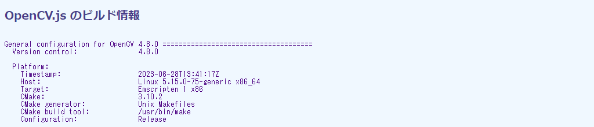
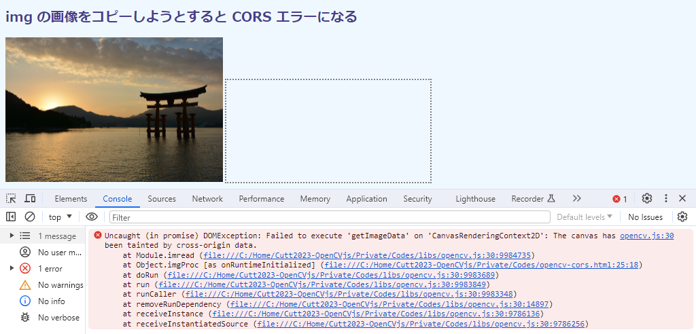
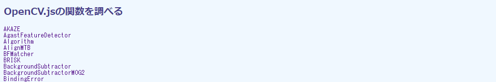
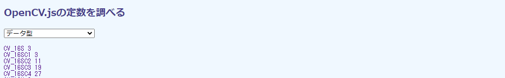

## 第3章 OpenCV.jsの導入

本章ではJavaScript版のOpenCVであるOpenCV.jsの導入方法を示します。また、非同期的に読み込まれるOpenCV.jsが利用可能になったことを知る方法、クロスサイトスクリプティングの制約についても説明します。

OpenCV.jsはイベント処理やユーザインタフェースにHTML5の機能を利用するよう設計されているため、C++/Pythonのクラス、関数、定数が一部利用できません。そこで、利用可能な関数と定数を調べる方法もあわせて示します。


### 3.1 OpenCV.jsを準備する

#### opencv.jsファイル

OpenCV.jsで必要なファイルは`opencv.js`だけです。サイズは約10 MBです。

通常のJavaScriptファイルと同じように、`<script>`から読み込みます。HTMLファイルと同じディレクトリに置いてあれば、`src="opencv.js"`のように相対パスで`src`属性を設定します。本書のサンプルコードでは`libs`サブディレクトリに置いてあるので、次のように書いています。

```html
<script async src="libs/opencv.js"></script>
```

> HTML5以降は`type="text/javascript"`は不要です。

並行ダウンロードを指示する`async`属性は加えるべきです。ファイルが4k画像6、7枚分くらいのサイズなので、ローディングにはかなり時間がかかります。`async`属性の挙動については次に示すWHATWGの図解がわかりやすいので、そちらを参照してください（ドキュメントの4.12.1節に記載されています）。

```https://html.spec.whatwg.org/multipage/scripting.html#attr-script-async```

JavaScriptだから読めるだろう、と、エディタでは開かないように。中身はC/C++から起こされたWebAssemblyのバイナリコードをBase64表現したもので、ヒトに読めるものではないからです（Base64については[2.3節](./02-ui.md#23-カメラにオンオフボタンを加える "INTERNAL")参照）。

`opencv.js`が準備できれば、`cv`というOpenCV.jsのトップレベルのオブジェクトの変数が利用可能になります（`var cv`で定義されている）。以降、OpenCVの関数や定数は、すべてこのオブジェクトのプロパティとしてアクセスできます。

純然たるJavaScriptファイルなので、`src`属性には次節で示す直接ダウンロード先のURLを指定することもできます。

```html
<script async src="https://docs.opencv.org/master/opencv.js"></script>
```

この方法は、自分の環境に`opencv.js`のコピーを用意したくない（あるいはできない）ときに便利です。

#### ダウンロード

`opencv.js`は、次に示すURLのドキュメントページに置かれたZipファイルに同梱されています。

```https://docs.opencv.org/```

ページはバージョン毎に整理されているので、とくに要求がなければ、最上端の最新版からzipをダウンロードします。次の画面では、バージョン4.8.0の「zip」へのリンクです。

<!-- 枠線なし版あり -->


OpenCVのリファレンスマニュアルがすべて含まれているので、ファイルサイズは約100 MBとかなり大きいです。Zipは展開し、`opencv.js`だけを抽出します。参考までに、次にZipファイルを展開したWindows エクスプローラの画面を示します。

<!-- 枠線なし版あり -->


これ以外のファイルは、必要に応じて適宜利用してください。画像ファイルは、オンラインドキュメントと同じ画像でテストをしたいときに使えます。`opencv.js`以外のJavaScriptファイルも重宝します。たとえば、`utils.js`はOpenCV.jsチュートリアルの内部で用いられており、チュートリアルのコードを自分の環境で動作させるときに必要になります。

必須なのは`opencv.js`だけなので、次のURLからそれだけをダウンロードすることもできます。

```https://docs.opencv.org/4.8.0/opencv.js```

URLの間にあるディレクトリ名はバージョンで、上記では4.8.0です。より新しいバージョンが出ているようなら、そちらに変更してください。常に最新ビルドのものを使いたいのなら、次のURLです。

```https://docs.opencv.org/master/opencv.js```

<!-- Rocket U+1F680 -->
これは、OpenCVの「Get Started」ページ（トップページのロケットアイコン🚀の［Get Starated］からアクセス）に掲載されているテスト用HTMLページで用いられています。開発者版（dev）のもののようですが、実効的には変わりません。

これらURLにブラウザからアクセスすると中身が表示されます。テキスト形式なので問題は生じませんが、謎のBase64文字ばかりなので読めません。ターゲットURLからファイルにそのまま落としたほうがよいでしょう。

#### 動作試験用コード

`opencv.js`を適切な場所に置いたら動作試験をします。

次に示すコード`opencv-buildinfo.html`は、OpenCVのビルド情報を表示します。

```html
[File] opencv-buildinfo.html
  1  <!DOCTYPE html>
  2  <html lang="ja-JP">
  3  <head>
  4    <meta charset="UTF-8">
  5    <link rel=stylesheet type="text/css" href="style.css">
  6    <script async src="libs/opencv.js"></script>
  7  </head>
  8  <body>
  9
 10  <h1>OpenCV.js のビルド情報</h1>
 11
 12  <div>
 13    <pre id="preTag">OpenCV Loading ...</pre>
 14  </div>
 15
 16  <script>
 17    let preElem = document.getElementById('preTag');
 18    var Module = {
 19      onRuntimeInitialized: function() {
 20        preElem.innerHTML = cv.getBuildInformation();
 21      }
 22    };
 23  </script>
 24
 25  </body>
 26  </html>
```

HTMLを読み込んだ時点では13行目に従って「OpenCV Loading ...」と表示されますが、1秒くらいのラグのあとで、その部分にビルド情報が表示されます。実行例を次の画面に示します。



バージョンが4.8.0、そのリリース（ビルド）の日がは2023年6月28日なことがわかります。

#### Module

`opencv.js`の中身の大半は、もともとC++で書かれたOpenCVを、emscriptenというコンパイラでコンパイルしたWeb Assembly（wasm）というバイナリコードです。18行目で用いている変数`Module`は、そのemscriptenが定義するグローバルなオブジェクトです。

```javascript
 18    var Module = {
 19      onRuntimeInitialized: function() {
 20        preElem.innerHTML = cv.getBuildInformation();
 21      }
 22    };
```

`Module`オブジェクトには、OpenCV.jsが利用可能になった時点で呼び出す関数を指定する`onRuntimeInitialized`プロパティが用意されています（19行目）。`window.addEventListener()`のようなものです。利用できないタイミングでOpenCV.jsの機能を呼び出してもエラーになるだけなので、すべてのOpenCV.jsコードはこのプロパティにセットしたコールバック関数からスタートするように記述しなければなりません。

ここでは無名関数をセットしています。中身は、ビルド情報のテキストを返す`cv.getBuildInformation()`関数を呼び出し、そのテキストを13行目の`<pre>`要素の`innerHTML`プロパティに代入しているだけです。

関数に引数はありません。定義を次に示します。

<!-- FunctionDefinition cv.getBuildInformation() OpenCVのビルド情報を返す。 -->
```Javascript
string cv.getBuildInformation();             // 文字列を返す
```

本書ではWASMそのものを操作することはありません。興味のある方は、次にURLを示すMDNの記事を参照してください。

```https://developer.mozilla.org/ja/docs/WebAssembly```

コンパイラーのemscriptenについてはこちらを参照してください。「API Reference」に`Module`やそのプロパティ、[6.7節](./06-img.md#67-顔を検出する "INTERNAL")で用いる仮想ファイルシステムの説明があります。

```https://emscripten.org/```

#### 読み込みタイミング

スクリプトや画像といったリソースは非同期的に読み込まれます。読み込みが完了してから処理を開始するには、`onload="..."`のようにイベントリスナーをHTML要素に書き込む、あるいは`addEventListener('load')`から発生イベントに処理関数を対応付けるのが通例です。

しかし、この手はOpenCV.jsでは使えません。`load`イベントは`opencv.js`がダウンロードされたことしか意味しておらず、その機能が利用可能な状態になったことまでは保証していないからです。OpenCV.jsが利用可能になるのは、wasmバイナリがロードされ、その内部でのセットアップが完了してからです。

次のコード`opencv-load.html`は、OpenCVの準備状況を示すものです。

```html
[File] opencv-load.html
  1  <!DOCTYPE html>
  2  <html lang="ja-JP">
  3  <head>
  4    <meta charset="UTF-8">
  5    <link rel=stylesheet type="text/css" href="style.css">
  6    <script async id="scriptTag" src="libs/opencv.js"></script>
  7  </head>
  8  <body>
  9
 10  <h1>OpenCV.js ローディングのタイミング</h1>
 11
 12  <script>
 13    function showTime(message) {
 14      let datatype = undefined;
 15      try {
 16        datatype = cv.CV_8UC1;
 17      }
 18      catch {};
 19      console.log(`${message}: ${datatype} @ ${performance.now()}`);
 20    }
 21    showTime('Script started');
 22
 23    let scriptElem = document.getElementById('scriptTag');
 24    scriptElem.addEventListener('load', function() {
 25      showTime('OpenCV loaded');
 26    });
 27
 28    var Module = {
 29      onRuntimeInitialized: function() {
 30        showTime('OpenCV ready');
 31      }
 32    };
 33  </script>
 34
 35  </body>
 36  </html>
```

コードはスクリプト実行開始時（21行目）、`opencv.js`の読み込み完了時（`load`イベント。23～26行目）、そしてOpenCV.jsが準備完了したときの3つのタイミングでその時刻をコンソールに表示します。このとき、OpenCV.jsの定数の１つである`cv.CV_8UC1`（定数値は0）がアクセス可能かをチェックします（14~18行目）。準備ができていればアクセス可能なので、0が印字されます。それ以外では`undefined`です。

コードと`opencv.js`は筆者のローカルサーバ（`http://localhost/`）に置かれています。

コンソール出力を次に示します。

```
Script started: undefined @ 21.899999976158142
OpenCV loaded: undefined @ 484.89999997615814
OpenCV ready: 0 @ 931.3000000119209
```

OpenCVの定数はスクリプト開始直後ではとうぜんアクセスできませんが、`opencv.js`のロード直後でも利用できないことがこれでわかります。OpenCVが利用可能になるのは、ロードからさらに0.5秒ほどあと、開始時点からだと約1秒後です。


### 3.2 Cross-Originの問題を回避する

#### 画像のOpenCVへのコピーが失敗する

OpenCVプログラミングでは、``あるいは`<canvas>`に読み込んだ画像をコピーし、処理し、結果を貼り付けて示します（[1.1節](./01-html5.md#11-画像処理の流れ "INTERNAL")の図）。しかし、この作業は、ローカルファイルシステムから読み込んだHTMLファイル（たとえば、`file:///C:/opencv-cors.html`）で実行するとエラーを上げます。

次のコード`opencv-cors.html`を考えます。

```html
[File] opencv-cors.html
  1  <!DOCTYPE html>
  2  <html lang="ja-JP">
  3  <head>
  4    <meta charset="UTF-8">
  5    <link rel=stylesheet type="text/css" href="style.css">
  6    <script async src="libs/opencv.js"></script>
  7  </head>
  8  <body>
  9
 10  <h1>img の画像をコピーしようとすると CORS エラーになる</h1>
 11
 12  <div>
 13    
 14    <canvas id="canvasTag" class="placeholder"></canvas>
 15  </div>
 16
 17  <script>
 18    let imgElem = document.getElementById('imageTag');
 19
 20    var Module = {
 21      onRuntimeInitialized: imgProc
 22    }
 23
 24    function imgProc() {
 25      let src = cv.imread(imgElem);                  // DOMException
 26      cv.imshow('canvasTag', src);
 27      src.delete();
 28    }
 29  </script>
 30
 31  </body>
 32  </html>
```

25行目の`cv.imread()`は`HTMLImageElement`から画像データを読み込む、26行目の`cv.imshow()`はその画像データを`<canvas>`要素に貼り付けるOpenCV.jsの関数です。意図していることは、[1.2節](./01-html5.md#12-画像をキャンバスに表示する "INTERNAL")の`html-image1.html`と変わりありません。しかし、ローカルファイルシステムから実行すると、キャンバスに画像が貼り付けられません。



コンソールのエラーメッセージは次のように述べています。

<!-- もとは1行だが、紙面幅を考えて折り返している -->
```
Uncaught (in promise) DOMException: Failed to execute 'getImageData' on
'CanvasRenderingContext2D': The canvas has been tainted by cross-origin data.
```

「キャンバスがcross-originなデータ」で汚染されているために`DOMException`が上がってきたと述べています。

#### CORS制約の問題

cross-originは、データ（ここでは画像）とHTMLとでオリジン（端的にはドメインとポート番号の組）が異なることを指します。たとえば、HTMLは`https://www.example.com/`から、画像は`https://www.example.net/`から読み込まれているような状態です。それは、ページに他所の怪しいサイトから怪しいデータが入り込んでいる可能性を示すもので、セキュリティ上の問題があります。そのため、ブラウザが他所の画像を、ページに貼り付けるのを拒絶したのです。

異なるオリジン間でのデータ共有のメカニズムを「CORS（Cross-Origin Resource Sharing）」といいます。ブラウザはどのようなCORS操作なら認めるかをデフォルトで定めており、昨今のセキュリティ問題を反映して、かなり厳しい制約が課せられています。たとえば、`file:///`へのアクセスは、同じディレクトリにあっても拒否されます。

この問題を解消するには3つの方法があります。

1. ローカルでWebサーバを運用する。これなら、画像もHTMLファイルも同じ`http://localhost:80/`というオリジンを共有することになるので、CORSエラーは発生しません。本書ではこの方法を使っています。
2. インターネット上のWebホスティングサービスにアップロードする。療法は上記と同じです。問題はタダではないことと、フリーなものだと不安なところです。試験用あるいは勉強用に使うぶんにはフリーなものもよいでしょう。
3. CORS設定を一時的に無視するようにブラウザを設定する。この方法は比較的簡単ですが、ブラウザが脆弱になるという問題があります。設定を変更したら、**必ず**もとに戻さなければなりません。

本節では1と3の方法を説明します。

3についてはChrome、Edge、Firefoxのものを紹介します。ここで示す方法は執筆時点の最新バージョンで試していますが、同じ方法が古い、あるいは将来のバージョンでも通用する保証はない点、注意してください。

#### ローカルWebサーバを用意する

apacheあたりを自機にインストールするのが王道ですが、個人用にはやりすぎかもしれません。簡単に済ませるなら、Pythonのワンライナーでしょう。コマンドプロンプト（やコンソール）から自分のHTMLや画像のあるディレクトリに移動し、次のコマンドを実行するだけです。

```
python -m http.server --bind 127.0.0.1
```

`127.0.0.1`はローカルループバックアドレスで、自機内でしか有効ではない（他のホストからはアクセスできない）IPアドレスです。`localhost`という名前（ドメイン名）から参照できます。ポート番号が指定されていないときは、デフォルトで8000番が使われます。

ブラウザに`http://localhost:8000/`と入力すれば、そのディレクトリにあるファイルが一覧できます。次に、筆者の執筆環境のディレクトリから起動したサーバにアクセスしたときの画面を示します。


あとは、好みのファイルをクリックするだけです。

Pythonをインストールしなければならないのが難点ですが、それ自体は難しくはありません（JavaScript本で宣伝するのもなんですが、あると人生が豊かになります）。インストーラは次に示すURLからダウンロードできます。

```https://www.python.org/downloads/```

他にも、1行だけでサーバを実行できるユーティリティや言語はたくさんあります。検索してください。

JavaScriptユーザならNode.jsのほうがよいかもしれません。コードがやや長くなるのがたまに傷ですが、npm（node package manager）に超簡便なWebサーバもあります（検索しましょう）。

> どんなWebサーバであれ、httpsにはself-signed証明書が必要なので、設定はややこしいです。ローカルオンリー運用なら、httpsにする必要はありません。

#### ブラウザのCORS緩和設定（ChromeおよびEdge）
<!-- See https://chromium.googlesource.com/chromium/src/+/master/docs/user_data_dir.md -->

> 注意：本節の設定により、ブラウザのセキュリティレベルは著しく低下します。利用はテスト中のみ、アクセス先は`localhost`にかぎります。

ChromeおよびEdgeでは、プログラム実行時のオプションからCORS制限を緩和します。コマンドプロンプト（やコンソール）から次のように実行します。

```
"C:\Program Files\Google\Chrome\Application\chrome" --disable-web-security --user-data-dir="C:\temp\temp"
```

オプションはどちらも指定しなければなりません。後者の`--user-data-dir`にはユーザデータを保存するディレクトリを指定します。ここでは`C:\temp\temp`を指定しています。これで、このディレクトリに各種のデータが保存されます。大量なので、空きディレクトリを指定します。利用が終わったら、ディレクトリごと削除してまかまいません。

オプション指定なので、普段使いしているChrome/Edgeには影響しません。

#### ブラウザのCORS緩和設定（Firefox）
<!-- See https://stackoverflow.com/questions/72811082/security-error-loading-subtitles-on-html-video -->

> 注意：本節の設定により、ブラウザのセキュリティレベルは著しく低下します。利用はテスト中のみ、アクセス先は`localhost`にかぎります。

FirefoxでのCORS制限の緩和方法を紹介します。

URLフィールドに`about:config`と入力することで、「高度な設定」画面に進みます。最初に「注意して進んでください！」と警告されるので、注意しながら［危険性を承知のうえで使用する］をクリックします。


<!-- content.cors.disable を true に変更するという話も出ているが、これは利かない模様 -->
［設定名を検索］するフィールドを上端に示したページが次の画面のように表示されます。`security.fileuri.strict_origin_policy`を入力し、デフォルト値のfalseを、右にある「切り替え」アイコン（⇄）をクリックすることでtrueに変更します。

<!-- 枠なし版あり -->


これでローカルファイルにCORSエラーなしでアクセスできるようになります。

利用が終わったらもとのfalseに戻します。

セキュリティの穴が気になるなら、Firefoxのすべての設定を工場出荷時に戻すリフレッシュを行います。ウィンドウ右上にある設定（≡）ボタンから［ヘルプ］>［他のトラブルシューティング情報］で、右にある［Firefoxをリフレッシュ］です。ボタンをクリックすると次の画面のように警告画面が現れるので、リフレッシュします。

<!-- 枠なし版あり -->


### 3.3 OpenCVリファレンスを読む

#### OpenCV公式リファレンス

OpenCVの関数や定数は次に示すOpenCV公式リファレンスから参照します。

```https://docs.opencv.org/```

トップページには[3.1節](#31-OpenCVjsを準備する "INTERNAL")で示したように各バージョンへのリンクが列挙されているので、利用しているバージョンあるいは最新のものクリックします（本書では4.8.0）。ドキュメントページを次の画面に示します。

<!-- 枠なし版あり -->


coreやimgprocなどモジュール別に分けられているので、目的の関数や定数をピンポイントに見つけるのはむずかしくなっています。その代わり、右上のサーチフィールドの予測入力が賢いので、入力するにつれ候補を示してくれます。次の画面では`cv.cvtColor()`関数の書式を調べるために、「cvtc」まで打ったところを示しています（先頭の`cv`は不要です）。


このキーワードを含む関数および定数がドロップダウンリストとして表示されるので、目的のものをクリックします。項目によってはさらに細分化されますが、目的の名称と最も近い細目を選びます（たとえば、`cv::cuda::cvtColor()`とあるのはGPUのCUDA用なので目的のものではありません）。

#### 関数定義

公式リファレンスの関数定義には、次に示すようにC/C++とPythonのものしか記載されていません。OpenCV.jsは基本的にC/C++のシグニチャを踏襲しているので、そちらを見ます。次に、`cv.Canny()`関数の関数定義を示します。


表題に「Canny() [1/2]」とあるのは、同名であっても引数の恰好の異なるパターン（シグニチャ）があることを示しています。C++ではこれをオーバーロードと呼びますが、JavaScriptでは使われない技法です（TypeScriptなら見かけ上できますが）。残念ながら、OpenCV.jsでどちらの形式を使っているかは見ただけでは判別できません。

関数名が`cv::Canny`のように`cv`と関数名の間が`::`となっているのはC++の記法なので、これは`.`と読み替えます。この場合は`cv.Canny()`です。

データ型は、適宜JavaScriptのものに読み替えます。たとえば、`dobule`や`int`は`number`です。よく使われるものの対応関係を、細かいニュアンス（`&`や`*`や`<type>`のバリエーションとか）は無視して次に示します。

C/C++のデータ型 | OpenCV.jsのデータ型 | 注意
---|---|---
`bool` | `boolean` | 
`double`、`float`、`int` | `number` | 
`String` | `string`
`InputArray`、`OutputArray` | `cv.Mat` | `Input`は入力画像の、`Output`は結果画像を収容するコンテナをそれぞれ指す。
`Mat` | `cv.Mat` | 画像のコンテナ。[4.1節](./04-mat.md#41-画像の構造を調べる "INTERNAL")参照。
`std::vector<Mat>` | `cv.MatVector` | 画像を複数収容した配列（C++の`Vector`）。[5.4節](./05-colors.md#54-RGB画像を色成分に分解する "INTERNAL")参照。
`Point` | `cv.Point` | 画像ピクセルの(x, y)座標を収容する構造体。`Point2f`のように付加情報が加わっているときは中のデータ数とその型を示す（`2f`は2個の浮動小数点数型）。[4.4節](./04-mat.md#44-モノクロで円を描く "INTERNAL")参照。
`Rect` | `cv.Rect` | 四角形の形状（x, y, width, height)を指定する構造体。[4.7節](./04-mat.md#47-部分領域だけ処理する "INTERNAL")参照。
`Scalar` | `cv.Scalar` | 複数（1～4）の数値を収容する構造体。[4.4節](./04-mat.md#44-モノクロで円を描く "INTERNAL")参照。
`Size` | `cv.Size` | 画像の横縦サイズを収容する構造体。[4.4節](./04-mat.md#44-モノクロで円を描く "INTERNAL")参照。

C++の`vector`は型付きの配列（`TypedArray`）のようなもので、同じデータ型を複数個収容します。C++では`vector<InputArray>`のように`<>`の中にデータ型を記述しますが、OpenCV.jsではそれ専用のオブジェクトが用意されます。たとえば、`cv.Mat`なら`cv.MatVector`、`cv.Point`なら`cv.PointVector`です。これらについては、サンプルコードで使用するときに説明します。

定義がコンストラクタであるときは、JavaScriptの作法にのっとって`new`を加えます。たとえば、C/C++の`Mat()`は、`new cv.Mat()`と読み替えます。

`=`の付いているもの（上画面では`int apertureSize = 3`など）はデフォルト引数です。


### 3.4 OpenCVの関数を調べる

#### 目的

OpenCV.jsで利用可能な関数とコンストラクタを調べます。

本章冒頭で述べたように、C/C++にはあってOpenCV.jsには実装されていない関数はいくつかあります。HTML5にあって不要なものもありますが、contribと呼ばれる最新アルゴリズムのライブラリは正式には編入されていないということで、含まれていません。そのため、ドキュメントやチュートリアルに記載があるからと事前にチェックをせずに利用すると、そんな関数はない（`undefined`）というエラーが頻出することになります。

技術的には、OpenCVのトップレベルのオブジェクトである`cv`のプロパティの検索です。プロパティは無数にありますが、その中から型が`function`であるものだけを抽出します。また、中には直接利用はしないものもあるので（WASM関連の`dynCall`で始まる関数など）、それらを除外したうえで表示します。

実行例を次に示します。



コンソールには、`cv`に定義されているプロパティがぜんぶで1564個あり、そのうちコンストラクタを含む関数が303個あることがわかります。

```
OpenCV ready
1564 entries in CV.
303 functions in CV.
```

本家のC/C++版に実装されている関数の数はわかりませんが、画像処理アルゴリズムなら2000ほど実装されているそうです。

#### コード

コード`opencv-functions.html`を次に示します。

```html
[File] opencv-functions.html
  1  <!DOCTYPE html>
  2  <html lang="ja-JP">
  3  <head>
  4    <meta charset="UTF-8">
  5    <link rel=stylesheet type="text/css" href="style.css">
  6    <script async src="libs/opencv.js"></script>
  7  </head>
  8  <body>
  9
 10  <h1>OpenCV.jsの関数を調べる</h1>
 11
 12  <div>
 13    <pre id="preTag"></pre>
 14  </div>
 15
 16  <script>
 17    let preElem = document.getElementById('preTag');
 18
 19    function listFunctions(obj) {
 20      let keys = Object.keys(obj);
 21      console.log(`${keys.length} entries in CV.`);
 22
 23      let functions = keys.filter(function(key) {
 24        let isFunction = typeof cv[key] === 'function';
 25        let isDyncall = key.startsWith('dynCall_');
 26        let isDunder = key.startsWith('__');
 27        return isFunction && ! isDyncall && ! isDunder;
 28      }).sort();
 29      console.log(`${functions.length} functions in CV.`);
 30      preElem.innerHTML = functions.join('\n');
 31    }
 32
 33    var Module = {
 34      onRuntimeInitialized: listFunctions
 35    }
 36  </script>
 37
 38  </body>
 39  </html>
```

[3.1節](#31-OpenCVjsを準備する "INTERNAL")で述べたように、OpenCVの機能はOpenCV.jsが完全に準備できていないと利用できません。そこで、34行目で、準備完了と同時に目的の処理をまとめた関数`listFunctions()`（19～31行目行目）を呼び出しています。

関数ではまず、`cv`から`Object.keys()`ですべてのオブジェクトキーを取り出します（20行目）。そのうえで、`Array.filter()`から関数であり（24行目）、名称がWASM関連の`dynCall`で始まっておらず（25行目）、内部用とおぼしき`__`（2重アンダースコア）でも始まっていないもののみ（26行目）抽出します。


### 3.5 OpenCV.jsの定数を調べる

#### 目的

OpenCV.jsに収容されている定数を調べます。トータルで膨大な数があるので（1000個くらい）、プルダウンメニューから目的別に選択的に表示します。メニューに用意するのは、本書で説明したもののみです。

OpenCVプログラミングでは、あらかじめ定義されたいろいろな定数を利用します。たとえば、1チャネル8ビット符号なし整数の画像データ型を指定するときは、定義された整数値では書かず、その値を収容した定数名`cv.CV_8UC1`を指定します。使うぶんにはよいですが、出力などで値がそのまま参照されていると、中身がわかりません。リファレンスで調べられないわけではありませんが、比較的面倒なので、このようなツールがあると便利です。

技術的には、前節と同じ手法です。OpenCVの定数のおおむね規則にのっとって命名されているので、正規表現パターンで目的のカテゴリーのもののみを抽出できます。

実行例を次の画面に示します。ここではデータ型を選択しています。



コンソールには選択された正規表現とヒットした定数の数が示されます。

```
RegExp /^CV_\d{1,2}[SUF]/ extracted 35 keys.
RegExp /^COLOR_/ extracted 242 keys.
RegExp /^THRESH_/ extracted 8 keys.
︙
```

#### コード

コード`opencv-consts.html`を次に示します。

```html
[File] opencv-consts.html
  1  <!DOCTYPE html>
  2  <html lang="ja-JP">
  3  <head>
  4    <meta charset="UTF-8">
  5    <link rel=stylesheet type="text/css" href="style.css">
  6    <script async src="libs/opencv.js"></script>
  7  </head>
  8  <body>
  9
 10  <h1>OpenCV.jsの定数を調べる</h1>
 11
 12  <div>
 13    <select id="selectTag">
 14      <option value="noop" selected>定数を選択してください</option>
 15      <option value="^CV_\d{1,2}[SUF]">データ型</option>
 16      <option value="^COLOR_">色空間変換</option>
 17      <option value="^THRESH_">閾値</option>
 18      <option value="^INTER_">ピクセル値補間方法</option>
 19      <option value="^BORDER_">画像端外挿方法</option>
 20      <option value="^LINE_">描画線種</option>
 21      <option value="^MORPH_">モルフォロジー演算タイプ</option>
 22      <option value="^OPTFLOW_">オプティカルフロー操作タイプフラグ</option>
 23    </select>
 24  </div>
 25  <div>
 26    <pre id="preTag">定数表</pre>
 27  </div>
 28
 29  <script>
 30    let selectElem = document.getElementById('selectTag');
 31    let preElem = document.getElementById('preTag');
 32
 33    function showConst(evt) {
 34      let re = new RegExp(evt.currentTarget.value);
 35      let keys = Object.keys(cv);
 36
 37      let selected = keys.filter(function(elem) {
 38        return re.test(elem);
 39      }).sort();
 40
 41      preElem.innerHTML = selected.map(function(elem) {
 42        return `${elem} ${cv[elem]}`;
 43      }).join('\n');
 44
 45      console.log(`RegExp ${re} extracted ${selected.length} keys.`);
 46    }
 47
 48    function opencvReady() {
 49      selectElem.addEventListener('change', showConst);
 50    }
 51
 52    var Module = {
 53      onRuntimeInitialized: opencvReady
 54    }
 55  </script>
 56
 57  </body>
 58  </html>
```

前節同様、OpenCV.jsの利用可能タイミングに注意します。OpenCV.jsが使えない間にプルダウンメニューのイベントが発生するとエラーになるので、イベント登録は準備完了後です（49行目）。

`showConst()`関数の構造は前節と同じです。`<option>`の`value`属性に定数値のパターンを記述した正規表現文字列を用意したので（14～22行目）、あとは選択された文字列（34行目の`evt.currentTarget.value`）を正規表現オブジェクトにし、`re.test()`でそのパターンが含まれているもののみ抽出するだけです（38行目）。

他に知りたい定数があれば、適宜`<select>`にその正規表現を加えてください。
