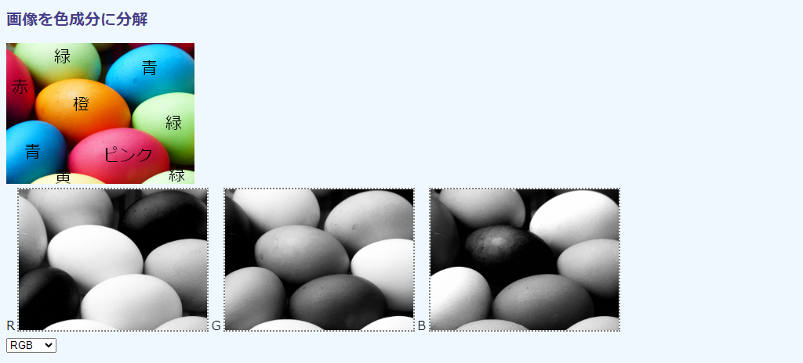
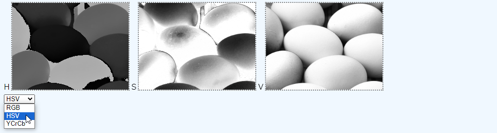
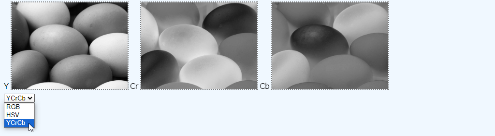
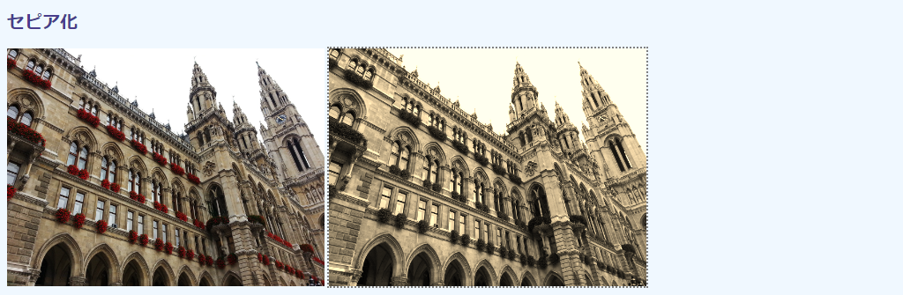
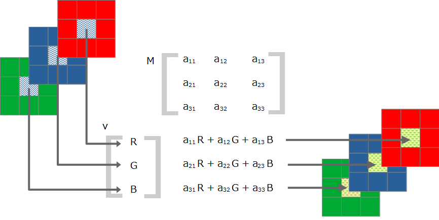
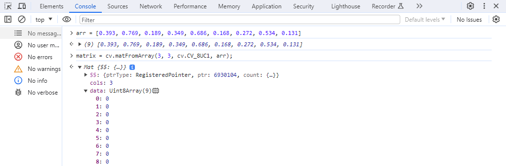
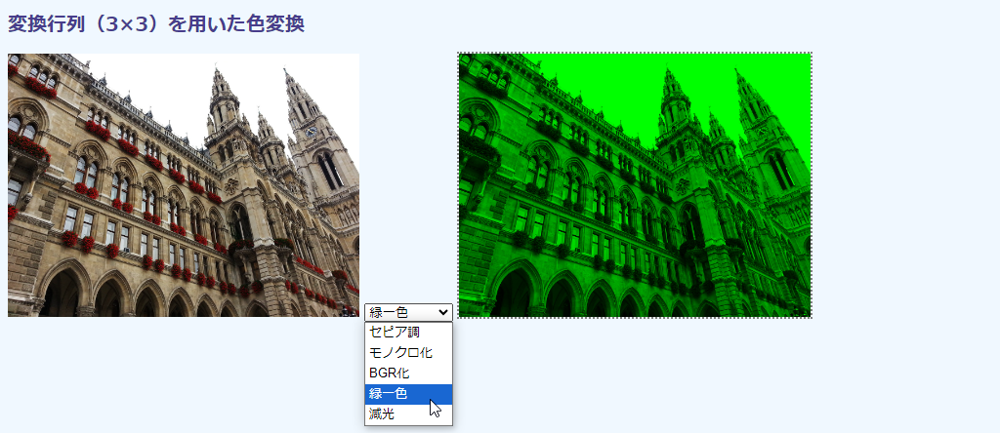
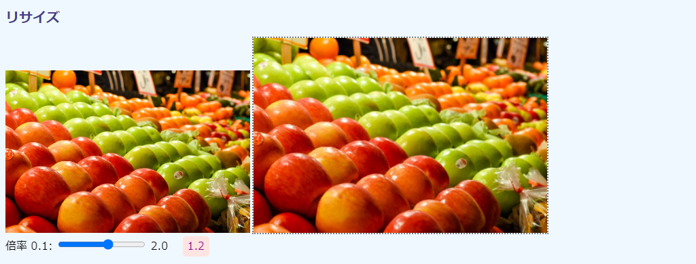

## 第4章 画像処理

本章では、いろいろな画像（1枚の静止画）の処理方法とその理論を説明します。取り上げる処理は、モノクロ化、色分解、セピア化、...線画化です。

### 4.1 モノクロ化
<!-- CSS でもできる  -->

#### モノクロ化

画像をモノクロ（白黒）化します。

できばえを先に次の画面から示します。左が元画像、右がモノクロ化後のものです。もっとも、紙面では区別がつきませんが。


コードは次の通りです。

```html
[File] img-gray.html
  1  <!DOCTYPE html>
  2  <html lang="ja-JP">
  3  <head>
  4    <meta charset="UTF-8">
  5    <link rel=stylesheet type="text/css" href="style.css">
  6    <script async src="libs/opencv.js" type="text/javascript"></script>
  7  </head>
  8  <body>
  9
 10  <h1>モノクロ化</h1>
 11
 12  <div>
 13    
 14    <canvas id="canvasTag" class="placeholder"></canvas>
 15  </div>
 16
 17  <script>
 18    let imgElem = document.getElementById('imageTag');
 19
 20    var Module = {
 21      onRuntimeInitialized: imgProc
 22    }
 23
 24    function imgProc() {
 25      let src = cv.imread(imgElem);
 26      let dst = new cv.Mat();
 27      cv.cvtColor(src, dst, cv.COLOR_RGBA2GRAY);
 28      cv.imshow('canvasTag', dst);
 29      src.delete();
 30      dst.delete();
 31    }
 32  </script>
 33
 34  </body>
 35  </html>
```

スクリプトの構造は[第3章](TBA "INTERNAL")で説明した通りです。`HTMLImageElement`（`imgElem`）から画像を読み込み（18行目）、それを色変換し（27行目）、キャンバスに張り付けます（28行目）。貼り付けメソッドの`cv.imshow()`の第1引数がDOMオブジェクトではなく、`<canvas>`HTML要素のID（14行目）になっているところが注意点です。

処理後の画像を収容する`cv.Mat`はあらかじめ用意しておかなければなりませんが（26行目）、サイズやデータ型は指定する必要はありません。続く色変換メソッドが引数の指示に沿って適切なサイズとデータ型でメモリを確保します。

#### cv.cvtColorメソッド

各種の色空間同士の変換には、`cv.cvtColor()`メソッドを使います（27行目）。メソッドの定義を次の通りです。

<!-- FunctionDefinition cv.cvtColor() -->
```Javascript
cv.cvtColor(                 // 出力なし
    Mat src,                 // 入力画像
    Mat dst,                 // 出力画像
    number code,             // 色変換コード
    number dstCn = 0         // 出力画像のチャネル数
);
```

第1引数`src`には入力画像の、第2引数`dst`には出力画像を収容する`cv.Mat`をそれぞれ指定します。`dst`はあらかじめ`new cv.Mat()`で定義しておかなければありません（26行目）。

第3引数`code`には、どの色空間からどの色空間に変換するかのコード（整数値）を定数名から指定します。本書で使用する色変換定数名を次の表に示します。

定数名 | 値（整数値） | 意味
---|---|---
`cv.COLOR_RGB2RGBA` | 0 | RGB > RGBA（すべて非透過なアルファチャネルを加える）
`cv.COLOR_RGBA2RGB` | 1 | RGBA > RGB（アルファチャネルを抜く）
`cv.COLOR_RGBA2GRAY` | 11 | RGBA > モノクロ（単色）
`cv.COLOR_RGB2HSV` | 41 | RGB > HSV
`cv.COLOR_HSV2RGB` | 55 | HSV > RGB

色空間変換コード定数名は`cv.COLOR_[変換元]2[変換先]`の形式になっています。

定数名には整数値が設定されているので、`cv.COLOR_RGBA2RGB`を指定する代わりに数値の1を使うこともできますが、コードが読みにくくなるだけなので、普通は定数名しか使いません。ただし、`console.log()`などで印字するときは数値しか出てきません。そうしたときは、（[2.2節](./02-opencv.mf#22-OpenCVjsの定数と関数 "INTERNAL")の`opencv_consts.html`を使ったり、公式リファレンスを検索するなどしなければなりません。

たいていの色空間のあいだの変換は用意されていますが、ないものもあります。たとえば、RGBAを直接HSVに変換する定数はありません。その場合は、RGBA > RGB > HSVのように、別の色空間を経由する必要があります。こうしたときはBGRを経由するとよいでしょう。というのも、BGRはOpenCV内部の色表現なので、色変換定数も豊富だからです。このテクニックは[x.x節](TBA "INTERNAL")のポスタライゼーションで取り上げます。

変換先のチャネル数が変換元より少ないときは、余ったチャネルは廃棄されます。たとえば、`cv.COLOR_RGBA2RGB`はアルファチャネルのデータを廃棄します。反対に、変換元のほうが少ないときは、適当な値で埋められます。たとえば、`cv.COLOR_RGB2RGBA`はアルファチャネルが255（完全非透過）で埋められます。`cv.COLOR_GRAY2RGB`は1チャネルを3チャネルに変換しますが、モノクロのピクセル値がR、G、Bに同じようにコピーされます。これにより、チャネル的にはカラーであっても、モノクロな画像が生成されます。

最後の`dstCn`引数には、変換先の画像のチャネル数を指定します。デフォルトの0は、チャネル数が変換元と色変換コードから自動的に決定されるという意味です。よほど凝ったことをしていないかぎり、使うことはないでしょう。


### 4.2 色分解

#### 色分解による色強度の確認

3チャネルカラー画像を要素に分解し、それぞれをモノクロ画像として表示します。

その色が強い（濃い）部分では、ピクセル値が大きいので、モノクロ上では白っぽくなります。反対に、色が弱い部分では黒っぽくなります。Webでは`#EE7800`（あるいは233、120、0）のようにRGB値で色を特定しますが、このように分解することで、RGB値がどの程度なのかを視覚的に判断することができます。

色分解はまた、特定の色要素だけを処理したいときにも使います。具体的な用法は[x.x節](TBA "INTERNAL")のポスタリゼーションのところで紹介します。

本節のコードの結果画像を次に示します。



上が元画像、下が分解後の色要素です。元画像はカラーなので、それぞれのタマゴにわかるように色名を付けてあります（原画には文字はありません）。分解後のモノクロ画像は左から赤（R）、緑（G）、青（B）の順です。

R画像からわかるように、赤みの強い赤、ピンク、橙の画像はピクセル値が大きいので白っぽくなっています。おもしろいのは橙のタマゴがもっとも白くみえるところです。橙は赤と緑の混色（たとえば`#EE7800`）で、赤の強度は強いからです。半面、赤みのない青いタマゴは黒っぽくなります。同様に、G画像では緑のタマゴが、B画像では青のタマゴがそれぞれ白くなります。これで、それぞれの卵の色構成がわかります。

ここでは、HSVとYCrCbにもとづく色強度確認もできるよう、プリダウンメニューから色空間を選択できるようにしてあります。次に、HSVのものを示します。



左のH画像はややわかりにくいです。H（色相）は0°を赤、90°を緑、180°をシアン、270°を紫、そして360°はまた赤に戻るという、角度にもとづいた数値の使い方をします。ここでは最大値が255の8ビット符号なし整数を用いているので、ピクセル値は角度の半分になります。たとえば180°のシアンは90です。

この数値の並びを念頭にあらためてH画像を見ると、0に近い橙が黒です。赤とピンクが白っぽいのは、紫（300°くらい）に近い色だからです。S（彩度）は鮮やかさなので、橙のタマゴを中心にライトが当たっているものが鮮やかなことがわかります。V（明度）は明るさで、どれも同じようにな白さということから、明るさはどれも同程度です。

最後にYCrCbです。



YCrCbは端的には、輝度、赤っぽさ、青ぽっぽさです。輝度はモノクロ化したときと同じなので、（モノクロ印刷の本書では）元画像と同じ濃淡です。赤みのCr画像では赤、橙、ピンクのタマゴが、青みのCb画像では青タマゴが、それぞれ強度の強い色ということが読み取れます。

コードは次の通りです。

```html
[File] img-colorspace.html
  1  <!DOCTYPE html>
  2  <html lang="ja-JP">
  3  <head>
  4    <meta charset="UTF-8">
  5    <link rel=stylesheet type="text/css" href="style.css">
  6    <script async src="libs/opencv.js" type="text/javascript"></script>
  7  </head>
  8  <body>
  9
 10  <h1>画像を色成分に分解</h1>
 11
 12  <div>
 13    
 14  </div>
 15  <div>
 16    <div class="inline">
 17      <span id="spanTag0">要素0</span>
 18      <canvas id="canvasTag0" class="placeholder"></canvas>
 19    </div>
 20    <div class="inline">
 21      <span id="spanTag1">要素1</span>
 22      <canvas id="canvasTag1" class="placeholder"></canvas>
 23    </div>
 24    <div class="inline">
 25      <span id="spanTag2">要素2</span>
 26      <canvas id="canvasTag2" class="placeholder"></canvas>
 27    </div>
 28  </div>
 29  <div>
 30    <select id="selectTag">
 31      <option value="RGB COLOR_BGR2RGB R G B">RGB</option>
 32      <option value="HSV COLOR_BGR2HSV H S V">HSV</option>
 33      <option value="YCrCb COLOR_BGR2YCrCb Y Cr Cb">YCrCb</option>
 34    </select>
 35  </div>
 36
 37  <script>
 38    let imgElem = document.getElementById('imageTag');
 39    let selectElem = document.getElementById('selectTag');
 40
 41    var Module = {
 42      onRuntimeInitialized: function() {
 43        selectElem.addEventListener('change', imgProc);
 44        imgProc();
 45      }
 46    }
 47
 48    function imgProc(evt) {
 49      let valueString = 'RGB COLOR_BGR2RGB R G B';
 50      if (evt)
 51        valueString = evt.target.value;
 52
 53      // <option> の value 文字列を分解する
 54      let values = valueString.split(' ');
 55      let colorSpaceName = values[0];
 56      let colorSpaceCode = values[1];
 57      let colorComponents = values.slice(2);
 58      console.log(`"${colorSpaceName}" "${colorSpaceCode}" "${colorComponents}"`);
 59
 60      // <span> に色要素名を書き込む
 61      for(let i=0; i<3; i++) {
 62        let element = document.getElementById(`spanTag${i}`);
 63        element.innerHTML = colorComponents[i];
 64      }
 65
 66      // 色変換
 67      let src = cv.imread(imgElem);
 68      cv.cvtColor(src, src, cv.COLOR_RGBA2BGR);
 69      cv.cvtColor(src, src, cv[colorSpaceCode]);
 70
 71      // 分解
 72      let dstMats = new cv.MatVector();
 73      cv.split(src, dstMats);
 74      for(let i=0; i<dstMats.size(); i++)
 75        cv.imshow(`canvasTag${i}`, dstMats.get(i));
 76
 77      // release me
 78      src.delete();
 79      dstMats.delete();
 80    }
 81  </script>
 82
 83  </body>
 84  </html>
```

色要素の画像を収容したそれぞれの`<div>`（16～27行目）の`class`で指定している`inline`は気にしないでください。`<div>`要素を横に並べるために、`display: inline-block`をCSS指定しているだけです。

スクリプトの基本スタイルはこれまでと変わらず、`<select>`の用法も[2.2節](./02-opencv.md#22-OpenCVjsの定数と関数 "INTERNAL")の`opencv-consts.html`と同じコーディングパターンです。

`<option>`の`value`属性には、スペース区切りで色空間名（RGBなど）、OpenCVの色変換定数名（COLOR_BGR2RGB）、そして色空間のそれぞれの要素の名称（R、G、B）を列挙しています（31～33行目）。この文字列は`split()`で分解し、色変換定数は`cv[色変換定数文字列']`から定数値を得るようしています。要素名はそれぞれの要素画像の`<div>`に主要されている`<span>`（17、21、25行目）のテキスト部分を置き換えるのに使います。

画像処理の`imgProc()`メソッドはOpenCVが準備できたときと（44行目）、`<select>`が操作されたとき（43行目）に呼び出されます。前者はイベントにもとづく呼び出しではないので、引数の`evt`（48行目）は`undefined`です。そのケースに対応できるよう、49行目にはデフォルトのオプション値を用意してあります。それ以外では、イベントオブジェクトの`evt`の、それを呼び出したDOM要素の`target`の、`value`プロパティから文字列を読み込みます（49～51行目）。

`value`の文字列はスペース区切りで分解し（54行目）、配列要素から色空間名、色変換定数名、要素名（これは3要素の配列）を抽出します（55～58行目）。

続いて、色変換です（67～69行目）。ポイントは、読み込んだRGBA画像（67行目）をまずBGRに変換しているところです（68行目）。3チャネルにしているのはアルファを削除するためですが、RGBでないのは、BGRからのほうが変換方法が多く用意されているからです。あらためて見ると、`<option value>`の文字列が`COLOR_BGR2`で始まっています。

#### cv.splitメソッド

あとは、`cv.split()`メソッドで3チャネル画像を、1チャネル（モノクロ）の画像3つに分解するだけです。

マルチチャネル（カラー）画像を1チャネル（単色）に分解する`cv.split()`メソッド（73行目）の定義は次の通りです。

<!-- FunctionDefinition cv.split() -->
```Javascript
cv.split(                    // 出力なし
    Mat src,                 // 入力画像
    MatVector dstMat,        // 出力画像（の配列）
);
```

第1引数の入力はカラー画像です。RGBのように3チャネルでも、RGBAのようにアルファ付き4チャネルでもかまいません第2引数の要素数が前者ならが3個に、後者なら4個になります。

第2引数には分解後のモノクロ画像を収容する`cv.Mat`の「配列」のようなものが返ってきます。正確には配列ではなく、C++のようにVector（ベクター）と言いますが、使い勝手はおおむね同じです。引数に指定するまえに、その変数を`new cv.MatVector()`から必ず用意しておかなければなりません（72行目）。また、使用後は、79行目で実行しているように、`delete()`メソッドで明示的に削除します。`cv.MatVector`もOpenCV内部のリソースなので、JavaScriptのガベージコレクタが働きません。

`cv.MatVector`の要素にアクセスするには、ゲッターメソッド`get()`を使います（75行目）。配列風に`[i]`とやることはできません。まが、要素数は`length`プロパティでなく、`size()`メソッドから取得します（74行目）。

あとは、それぞれの要素をキャンバスに張り付けます。`<canvas>`のIDはcanvasTag1のように0から2の数値付きにしてあるので、ループ内で簡単に指定できます。


### 4.3 セピア調と変換行列

#### 変換行列を用いた色変換の原理

カラー画像をセピア調、つまり茶褐色っぽい色合いに変換するには、それぞれのピクセルの値を所定の計算式に従って変換した値で置き換えます。これは、行列を用いた線形変換で達成できます。

理論に入る前に、本節のコードで生成される画像を次に示します。左が元画像、右がセピア調に変換したあとの画像です（これも、モノクロ紙面では違いがほとんどわかりませんが、あえていえば、やや白っぽくなっています）。



カラー画像のピクセルのRGBの値は、3要素のべクトル $\vec{P}(r, g, b)$ とみなすことができます。このベクトルに、次の図に示すように3×3の行列 $M$ を掛ければ、新しい3要素のベクトル $\vec{P'}(r',g', b')$ が得られます。そして、この $\vec{P'}$ による前のものの置き換えを、すべてのピクセル（たとえば、1024×768の画像ならば約79万個分）について行えば、もととは色合いの異なった画像が生成されます。

<!-- 975 x 435 -->


<!-- 値は https://medium.com/dataseries/designing-image-filters-using-opencv-like-abode-photoshop-express-part-2-4479f99fb35 から -->
<!-- こちらほうがわかりやすいかな。 https://dyclassroom.com/image-processing-project/how-to-convert-a-color-image-into-sepia-image -->
セピア調にするには、次の行列を使います。

$$\begin{pmatrix}
  0.393 & 0.769 & 0.189 \\
  0.349 & 0.686 & 0.168 \\
  0.272 & 0.534 & 0.131
\end{pmatrix}$$

行列を使ったピクセルの置き換えは、`cv.transform()`メソッドから行います。

#### セピア調変換

次にセピア調変換のコードを示します。

```html
[File] img-sepia1.html
  1  <!DOCTYPE html>
  2  <html lang="ja-JP">
  3  <head>
  4    <meta charset="UTF-8">
  5    <link rel=stylesheet type="text/css" href="style.css">
  6    <script async src="libs/opencv.js" type="text/javascript"></script>
  7  </head>
  8  <body>
  9
 10  <h1>セピア化</h1>
 11
 12  <div>
 13    
 14    <canvas id="canvasTag" class="placeholder"></canvas>
 15  </div>
 16
 17  <script>
 18    let imgElem = document.getElementById('imageTag');
 19
 20    var Module = {
 21      onRuntimeInitialized: imgProc
 22    }
 23
 24    function imgProc() {
 25      let src = cv.imread(imgElem);
 26      let dst = new cv.Mat();
 27      let arr = [
 28        0.393, 0.769, 0.189,
 29        0.349, 0.686, 0.168,
 30        0.272, 0.534, 0.131
 31      ];
 32      let matrix = cv.matFromArray(3, 3, cv.CV_32FC1, arr);
 33      cv.cvtColor(src, src, cv.COLOR_RGBA2RGB);
 34      cv.transform(src, dst, matrix);
 35      cv.imshow('canvasTag', dst);
 36
 37      [src, dst, matrix].forEach(function(mat) {
 38        mat.delete();
 39      })
 40    }
 41  </script>
 42
 43  </body>
 44  </html>
```

コードパターンは前節と同じで、`cv.imread()`で`HTMLImageElement`の中身を読み（25行目）、出力画像を収容する`cv.Mat`を用意します（26行目）。

セピア調変換の行列は、27～31行目で定義してあります。本来的には2次元の行列ですが、1次元の配列として表現しています。

配列は、[3章どっか](TBA "INTERNAL")で説明した`cv.matFromArray()`メソッドで3×3の行列の`cv.Mat`に変換します（32行目）。データ型変換（第3引数）に、1チャネル32ビット浮動小数点数を意味する`cv.CV_32FC1`を指定してるところに注意してください。行列の値は小数点数以下なので、いつもの`cv.CV_8UC1`ではすべて0になってしまいます。

<!-- ⋗ U+22D6 -->
コンソールから試した結果を次の画面に示します。左手のプロンプトが`>`のところが手入力、`⋖`がその出力です。



#### cv.transformメソッド

RGBA構成の4チャネルな元画像は、RGBの3チャンネルに変換します（33行目）。行列が3×3（3チャネル）用だからです。色変換コードは`cv.COLOR_RGBA2RGB`です。

線形変換メソッドの`cv.transform()`（34行目）の定義を次に示します。

```
cv.transform(                  // 出力なし
    Mat src,                   // 入力画像
    Mat dst,                   // 出力画像
    Mat m                      // 変換行列（浮動小数点数使用）
);
```

入力が符号なし8ビット整数なので、変換行列が浮動小数点数であっても、出力は入力と同じ`cv.CV_8UC3`になります。

37～39行目は確保した`cv.Mat`を開放しています。これまでのように`src.delete()`と逐一書いてもよいのですが、数が多くなってくると長くなるので、配列ループにしています。

#### いろいろな色変換

行列を変えれば、いろいろな色変換操作ができます。

たとえば、カラーをモノクロに変換するには次の行列を用います

$$\begin{pmatrix}
  0.299 & 0.587 & 0.114 \\
  0.299 & 0.587 & 0.114 \\
  0.299 & 0.587 & 0.114
\end{pmatrix}$$

カラーのモノクロ変換式は $0.299 r + 0.587 g + 0.114 b$ です。すべての色のピクセル値の平均ではなく、係数が微妙に異なっているのは、ヒトの色覚細胞の感度が赤緑青で異なるからです。この式は単色ですが、同じ値をR、G、Bのどれにも収容すれば、構造上はカラーであってもモノクロな画像が得られます。

色の順序の入れ替えもできます。たとえば、RGB画像をBGR画像に変換するには次の行列です。

$$\begin{pmatrix}
  0.0 & 0.0 & 1.0 \\
  0.0 & 1.0 & 0.0 \\
  1.0 & 0.0 & 0.0
\end{pmatrix}$$

最初の行は変換後のRの値ですが、式が $0 r + 0 g + 1 b$ なので、Bの値になります。同様に2行目はGの値、3行目はRの値になります。これでRとBの値が入れ替わります。

緑成分だけで画像を構成するにはこの行列です。

$$\begin{pmatrix}
  0.0 & 0.0 & 0.0 \\
  0.299 & 0.587 & 0.114 \\
  0.0 & 0.0 & 0.0
\end{pmatrix}$$

2行目はモノクロ化と同じパターンです。つまり、モノクロ画像と同じ情報を緑と読み替えています。残りはすべて0なので、結果として全面が緑の画像になります。

輝度調節もできます。次の行列は光量を半分（0.5倍）にします。

$$\begin{pmatrix}
  0.5 & 0.0 & 0.0 \\
  0.0 & 0.5 & 0.0 \\
  0.0 & 0.0 & 0.5 \\
\end{pmatrix}$$

パターンはRGB→BGRに似ています。1行目は $r' = 0.5 r$ と読むことができ、もとの値を半分にしています。残りも同様です。

これら行列を`<select>`の`value`属性に収容し、ユーザから選択できるようにしたのが次のコードです。

```html
[File] img-sepia2.html
  1  <!DOCTYPE html>
  2  <html lang="ja-JP">
  3  <head>
  4    <meta charset="UTF-8">
  5    <link rel=stylesheet type="text/css" href="style.css">
  6    <script async src="libs/opencv.js" type="text/javascript"></script>
  7  </head>
  8  <body>
  9
 10  <h1>変換行列（3×3）を用いた色変換</h1>
 11
 12  <div>
 13    
 14    <select id="selectTag">
 15      <option value="0.393,0.769,0.189,0.349,0.686,0.168,0.272,0.534,0.131">
 16        セピア調</option>
 17      <option value="0.299,0.587,0.114,0.299,0.587,0.114,0.299,0.587,0.114">
 18        モノクロ化</option>
 19      <option value="0,0,1,0,1,0,1,0,0" selected>
 20        BGR化</option>
 21      <option value="0,0,0,0.299,0.587,0.114,0,0,0">
 22        緑一色</option>
 23      <option value="0.5,0,0,0,0.5,0,0,0,0.5">
 24        減光</option>
 25    </select>
 26    <canvas id="canvasTag" class="placeholder"></canvas>
 27  </div>
 28
 29  <script>
 30    let imgElem = document.getElementById('imageTag');
 31    let selectElem = document.getElementById('selectTag');
 32
 33    var Module = {
 34      onRuntimeInitialized: function() {
 35        selectElem.addEventListener('change', imgProc);
 36        imgProc();
 37      }
 38    }
 39
 40    function imgProc() {
 41      let src = cv.imread(imgElem);
 42      let dst = new cv.Mat();
 43      let arr = selectElem.value.split(',').map(val => parseFloat(val));
 44      console.log(`Matrix: ${arr}`);
 45      let matrix = cv.matFromArray(3, 3, cv.CV_32FC1, arr);
 46      cv.cvtColor(src, src, cv.COLOR_RGBA2RGB);
 47      cv.transform(src, dst, matrix);
 48      cv.imshow('canvasTag', dst);
 49
 50      [src, dst, matrix].forEach(function(mat) {
 51        mat.delete();
 52      })
 53    }
 54  </script>
 55
 56  </body>
 57  </html>
```

`<select>`の用法は[2.2節](./02-opencv.md#22-OpenCVjsの定数と関数 "INTERNAL")の`opencv-consts.html`や[4.2節](##42-色分解 "INTERNAL")の`img-colorspace.html`と同じです。`value`属性値がカンマ区切りなところと、`split()`で得られた配列を`map()`で浮動小数点数に変換しているところがポイントです（43行目）。

実行画面を次に示します。選択してあるのは緑一色です。赤と青を省いているので、モノクロ紙面にすると輝度が低下して暗くなります（モノクロ化式の $0.299 r + 0.587 g + 0.114 b$ の $r$ と$b$ の項が必ず0になるから）。




### 4.4 2値化と背景抜き

### 4.4 リサイズとモザイク化

#### リサイズ

まずは、本節の画像リサイズの画面を確認します。



左が元画像、右がリサイズ後です。画像下のトラックバーから倍率は変更でき、その範囲は0.1～2.0で0.1刻みです。その右に現在値が示されており、この画面では1.2です。倍率は縦横どちらにも適用されるので、もとの360×240が、ここでは432×288になります。

コードは次の通りです。

```html
[File] img-resize1.html
  1  <!DOCTYPE html>
  2  <html lang="ja-JP">
  3  <head>
  4    <meta charset="UTF-8">
  5    <link rel=stylesheet type="text/css" href="style.css">
  6    <script async src="libs/opencv.js" type="text/javascript"></script>
  7  </head>
  8  <body>
  9
 10  <h1>リサイズ</h1>
 11
 12  <div>
 13    
 14    <canvas id="canvasTag" class="placeholder"></canvas>
 15  </div>
 16  <div>
 17    倍率 0.1:
 18    <input id="rangeTag" type="range" value="1.0" min="0.1" max="2.0" step="0.1"/>
 19    2.0
 20    <span id="spanTag" class="currentValue">1.0</span>
 21  </div>
 22
 23  <script>
 24    let imgElem = document.getElementById('imageTag');
 25    let rangeElem = document.getElementById('rangeTag');
 26    let spanElem = document.getElementById('spanTag');
 27
 28    var Module = {
 29      onRuntimeInitialized: function() {
 30        rangeTag.addEventListener('input', imgProc);
 31        imgProc();
 32      }
 33    }
 34
 35    function imgProc() {
 36      let src = cv.imread(imgElem);
 37      let dst = new cv.Mat();
 38      let scale = parseFloat(rangeElem.value);
 39      spanElem.innerHTML = scale.toFixed(1);
 40      cv.resize(src, dst, new cv.Size(), scale, scale);
 41      cv.imshow('canvasTag', dst);
 42      src.delete();
 43      dst.delete();
 44    }
 45  </script>
 46
 47  </body>
 48  </html>
```

リサイズの倍率は`<input type="range">`で生成したトラックバーから指定します（18行目）。倍率の最大値、最小値、ステップ幅はそれぞれ`min`、`max`、`step`で設定しています。`<input>`のイベントリスナーが待ち受けるイベントは`input`です（30行目）。変更が確定するまでイベントの上がってこない`change`と異なり、これならスライダーを動かしている間も画像が縮小拡大します。

イベントが上がってきたら、画像処理です（35～44行目）。コードパターンはこれまでと同じで、異なるのは40行目がサイズ変更の`cv.resize()`メソッドになっているところです。メソッドの定義はあとで説明します。

画像処理のときに、`<span>`（20行目）の倍率の現在値（`rangeElem.value`）も書き換えます（39行目）。`<span>`にある`class`は気にしないでください。単にパディングを広げて背景色を設定しているだけです。

トラックバーから読み取る値は文字列なので、`parseFloat()`で数値に変更するのは忘れないように（38行目）。`<span>`に書き込むときに`toFixed(1)`を使って小数点数1桁の文字列にしているのは、そのままだと数値1が1.0と表示されずにカッコが悪いからだけで、必須の行程なわけではありません。

#### cv.resizeメソッド

`cv.resize()`の定義を次に示します。

```
cv.resize(                                  // 出力なし
    Mat src,                                // 入力画像
    Mat dst,                                // 出力画像
    Size dsize,                             // リサイズ後のサイズ
    number fx = 0,                          // 横幅の倍率（浮動小数点数）
    number fy = 0,                          // 高さの倍率（浮動小数点数）
    number interpolation = cv.INTER_LINEAR  // 補完方法
);
```

第1引数には入力画像の、第2引数には出力画像のcv.Matをそれぞれ指定します。第2引数はあらかじめ`new cv.Mat()`で定義しておくのを忘れないように（37行目）。

第3引数にはサイズを`cv.Size`から指定します。縦横のアスペクト比が元画像と異なるときは、縦あるいは横方向が引き延ばされます。ここでダミーの`new cv.Size()`を使っているのは、続く引数で倍率を指定しているからです。

第4引数と第5引数には横と縦の倍率を浮動小数点数から指定します。デフォルトの0なときは、第3引数の`dsize`が用いられます。指定されたときは第3引数は無視されます。

第6引数は補間方法をOpenCVの定数から指定します。定数名はいずれも`cv.INTER_`で始まり、主として次のものがあります。

定数名 | 意味
---|---
`cv.INTER_NEAREST` | 最近傍補間。モザイク状になる。
`cv.INTER_LINEAR` | バイリニア補間（デフォルト）。処理は早い。
`cv.INTER_AREA` | ピクセル領域関係を利用したリサンプリング。縮小時にお勧め。
`cv.INTER_CUBIC` | バイキュービック補間。拡大時にお勧め。
`cv.INTER_LANCZOS4` | Lanczos補間

#### 補間方法

補間とは、存在しないピクセルを周囲のピクセル値から推定する作業です。

画像の拡大から考えます。拡大とは、それまで隙間なく並べられていたピクセルの間を空け、そこに適当な値をあてはめる作業です。たとえば、①③⑤の順に横に並んでいたピクセルを①〇③〇⑤〇のように隙間を空ければ、画像サイズは倍になります（〇の中の数字はピクセル値）。

隙間に埋める値の決め方はいろいろ考えられます。

最も単純なアイデアは、左隣の値をそのまま繰り返すというものです。これで、①①③③⑤⑤という並びになります。この方法を最近傍補間、OpenCVの定数名では`cv.INTER_NEAREST`です。簡単で計算も早いのですが、極端に大きくすると滑らかだった線やグラデーションがモザイク状になるという問題が生じます。

もう少し凝った手なら、前後のピクセルの平均値を取ります。これだと①②➂④⑤⑤となり、もともとの滑らな変化が維持されます。右端がその前隣の⑤と同じなのは、右端の外にはピクセルは存在しないので、繰り返すしかないからです。これが`cv.INTER_LINEAR`です。名称が「バイリニア」なのは、前後の2点（bi）を使うからです。この方法はスムーズな絵がえられますが、本来はくっきりとした輪郭線がぼやけます。たとえば、②②⑩⑩のように背景の②と前景の⑩が明確に分かれていたのが、②②②⑥⑩⑩⑩⑩と、②と⑩の間に中間点ができ、これがぼけになります。

縮小ではピクセルを間引くわけですが、こちらでも同様な工夫が必要です。

では、OpenCVに実装されているされているすべての補間方法を試してみましょう。コードは次の通りです。


### 4.4 線画の生成
<!-- 残念ながら、OpenCV.js には cv.stylization()、cv.pencilSketch()、cv.edgePreservingFilter()、cv.detailEnhanve() といった Non-photorealistic 系は実装されていない。-->

#### エッジ検出の原理

写真からスケッチ（線画）を起こすような描くような効果を得るには、元画像から前景の輪郭を抽出します。

先に、本節のコードで生成される画像を次に示します。左が元画像、右が検出後の画像です。


輪郭は、背景と前景の境界線でピクセル輝度が大きく変化するという仮定をもとに抽出されます。前景の端なので、画像処理では輪郭のことを「エッジ」と呼びます。

エッジ検出の原理を、白い前景がグレーの背景に写っている次の模式的な画像から考えます。データ型には1チャンネル符号なし8ビット整数（`cv.CV_8UC1`）を使うので、ピクセル値の範囲は0～255です。

<!-- 969x303 -->


左図が元画像です。水平方向で切り取った5行目の黒枠に着目します。ピクセル値の並びは31、16、21、29、249、215、244、239、254、208で、グレー地と白い物体の境目で値が29から249へと急激に変化することがわかります。その前後ではブレはあるものの、だいたいおなじ値が連続しています。

中央図では、それぞれのピクセルについて、その左側のピクセルとの差分を計算しています。左端のピクセルには左側のピクセルがないので0とします。これにより、変化量がわかります。差がとくに大きい箇所だけ太字で強調してあります。

右図は、変化差の大きいピクセルの値を255（白）、それ以外を0（黒）に変えています。これがエッジです。

もっとも、これは理論的な話なので、期待しているほどにはエッジが浮かび上がるわけではありません。

OpenCVには、いろいろな場面に対応できる高度なエッジ検出メカニズムがいくつか用意されています。本節では、その中でも性能が高いといわれるCanny（キャニー）アルゴリズムを実装した`cv.Canny()`メソッドを用います。

#### エッジ検出

次にエッジ検出のコードを示します。

```html
[File] img-canny1.html
  1  <!DOCTYPE html>
  2  <html lang="ja-JP">
  3  <head>
  4    <meta charset="UTF-8">
  5    <link rel=stylesheet type="text/css" href="style.css">
  6    <script async src="libs/opencv.js" type="text/javascript"></script>
  7  </head>
  8  <body>
  9
 10  <h1>エッジ検出（輪郭抽出）</h1>
 11
 12  <div>
 13    
 14    <canvas id="canvasTag" class="placeholder"></canvas>
 15  </div>
 16
 17  <script>
 18    let imgElem = document.getElementById('imageTag');
 19
 20    var Module = {
 21      onRuntimeInitialized: imgProc
 22    }
 23
 24    function imgProc() {
 25      let src = cv.imread(imgElem);
 26      let dst = new cv.Mat();
 27      cv.cvtColor(src, src, cv.COLOR_RGBA2GRAY);
 28      cv.Canny(src, dst, 50, 150);
 29      cv.imshow('canvasTag', dst);
 30      src.delete();
 31      dst.delete();
 32    }
 33  </script>
 34
 35  </body>
 36  </html>
```

コードパターンはこれまでのものと変わりません。実行結果は本節冒頭に示した通りです。

#### cv.Cannyメソッド

エッジ検出の`cv.Canny()`メソッド（28行目）の定義を次に示します。

<!-- FunctionDefinition cv.Canny() -->
```Javascript
cv.Canny(                      // 出力なし
 	Mat image,                 // CV_8UC1 入力画像
 	Mat edges,                 // CV_8UC1 出力画像
	number threshold1,         // 第1閾値（0～255）
	number threshold2,         // 第2閾値（0～255）
	number apertureSize = 3,   // カーネルサイズ（3、5、7）
	boolean	L2gradient = false // L2ノルムフラグ
);
```

第1引数には入力画像の`cv.Mat`を指定します。1チャンネル符号なし8ビット整数（`cv.CV_8UC1`）でなければならないので、``から読み込んだ画像（25行目）は`cv.cvtColor()`でモノクロに変更しなければなりません。

第2引数には出力画像を収容する`cv.Mat`を指定します。例によって、あらかじめ`new cv.Mat()`から定義したもの（26行目）でなければなりません。

第3引数と第4引数は、Cannyアルゴリズムに関係する最大と最小の閾値です。Cannyエッジ検出では、最初に輝度の差分（先の図の右図）が指定の最大閾値より大きければ間違いなくエッジであると判断します。これが`threshold2`です。また、最小閾値未満なら閾値ではないと棄却します。最少と最大の間のピクセルについては、連結性をもとに判断します。そのピクセルが最大閾値以上の間違いなくエッジの隣にあれば、それもエッジとしてカウントされます。そうでなければ棄却します。最小閾値をあまり低い値にするとノイズをエッジと誤検出しやすくなり、最大閾値を高い値にするとエッジを見逃しやすくなります。`threshold1`と`threshold2`は交換可能で、小さいほうが最小閾値に用いられます。

第5引数の`apertureSize`はカーネルサイズです。Cannyアルゴリズムでは、微分のSobelフィルタで最初のエッジ抽出を行いますが、これはそのサイズです。デフォルトでは3×3ですが、5または7も指定可能です。たいていはデフォルトでかまいません。

参考までにSobelフィルタだけを適用したときの結果を次に示します。


Sobelフィルタは横方向と縦方向の線を検出するバリエーションがありますが、これは横方向のものです。Cannyの結果と比べると、エッジの判定ステップを踏まえていないため、線が太く荒っぽくなることがわかります。

この結果を得るには、`img-canny1.html`の28行目を次のものと置き換えます。詳細はOpenCVのリファレンスを参照してください。

```Javascript
 28      cv.Sobel(edge, edge, cv.CV_8UC1, 0, 1);
```

第6引数の`L2gradient`は、差分の強さ（縦横の差分をベクトルと考えたときのその大きさ）を計算するときにL2ノルム（普通の距離）を使うか、L1ノルム（マンハッタン距離）を使うかの指定です。デフォルトの`false`ならL1ノルムで、こちらのほうが計算が簡単です。`true`ならばL2ノルム（二乗和の平方根）を計算します。

Cannyアルゴリズムは、OpenCVのチュートリアル「Canny Edge Detection」に詳しく説明されています。興味のあるかたは、次のURLから参照してください。

```https://docs.opencv.org/3.4/da/d22/tutorial_py_canny.html```

#### 色付き輪郭

白い線だけのエッジ検出では素っ気ないので、元画像の上にエッジを描画します。つまり、このような画像を得ます。


モノクロの紙面ではわかりませんが、線はピンク色（CSS名でPaleVioletRed）で描かれています。

次の要領で作成します。

1. `img-canny-1.html`と同じ要領で`cv.Canny()`でエッジ検出をします。このエッジ画像（コードでは`edge`）は、背景が黒、エッジが白です。
2. エッジ画像を反転します（`edgeReverse`）。これで、背景が白、エッジが黒の画像が得られます。これは、エッジ部分だけを温存するマスク画像として用います。
3. 単一色で染められた、元画像と同じサイズの画像を用意します（`dstColor`）。この色を適当に選択することで、エッジ部分をその色にすることができます（ここではPaleVioletRed）。
4. 元画像を、2の反転エッジ画像をマスクに用いて3の画像にコピーします。エッジ部分は黒なのでそこだけ背景色が残り、あとは元画像で埋められます。

コードを次に示します。

```html
[File] img-canny2.html
  1  <!DOCTYPE html>
  2  <html lang="ja-JP">
  3  <head>
  4    <meta charset="UTF-8">
  5    <link rel=stylesheet type="text/css" href="style.css">
  6    <script async src="libs/opencv.js" type="text/javascript"></script>
  7  </head>
  8  <body>
  9
 10  <h1>エッジ検出（元画像付き）</h1>
 11
 12  <div>
 13    
 14    <canvas id="canvasTag" class="placeholder"></canvas>
 15  </div>
 16
 17  <script>
 18    let imgElem = document.getElementById('imageTag');
 19
 20    var Module = {
 21      onRuntimeInitialized: imgProc
 22    }
 23
 24    function imgProc() {
 25      let srcColor = cv.imread(imgElem);
 26      let edge = new cv.Mat();
 27      let edgeReverse = new cv.Mat();
 28      let dstColor = new cv.Mat(imgElem.height, imgElem.width,
 29        cv.CV_8UC4, new cv.Scalar(219, 112, 147, 128));
 30      cv.cvtColor(srcColor, edge, cv.COLOR_RGBA2GRAY);
 31      cv.Canny(edge, edge, 50, 150);
 32      cv.bitwise_not(edge, edgeReverse);
 33      srcColor.copyTo(dstColor, edgeReverse);
 34      cv.imshow('canvasTag', dstColor);
 35
 36      [srcColor, edge, edgeReverse, dstColor].forEach(function(mat){
 37        mat.delete();
 38      });
 39    }
 40  </script>
 41
 42  </body>
 43  </html>
```

ポイントは28行目です。`cv.Mat`を生成するときに縦横のサイズと元画像（`imgElem`）に合わせ、同じデータ型（`cv.8UC4`）とし、背景色を`cv.Scalar`で埋めています。RGBの値はPaleVioletRedのもので、アルファチャネルは半分透過（128）にしていますが、好みの値に変更してください。あとは、33行目でこの単一色画像に、エッジの反転画像（32行目）をマスクにして元画像をコピーする（33行目）だけです。

