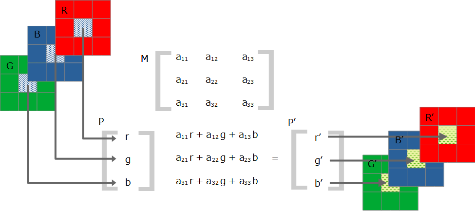

## 第4章 画像処理

本章では、いろいろな画像（1枚の静止画）の処理方法とその理論を説明します。取り上げる処理は、モノクロ化、セピア化、...線画化です。

### 4.1 モノクロ化

#### モノクロ化

``に張り付けた画像をモノクロ（白黒）化します。

CSSフィルタ機能の`grayscale`という関数を使えば同じことができるのですが、まず簡単なところからOpenCVを使っていきます。ちなみに、CSS方式では次のように書きます。

```html

```

先に、コードの実行結果を次の画面から示します。左が元画像、右がモノクロ化後のものです（モノクロ紙面では違いがわかりませんが…）。


コードは次の通りです。

```html
[File] img-gray.html
  1  <!DOCTYPE html>
  2  <html lang="ja-JP">
  3  <head>
  4    <meta charset="UTF-8">
  5    <link rel=stylesheet type="text/css" href="style.css">
  6    <script async src="libs/opencv.js" type="text/javascript"></script>
  7  </head>
  8  <body>
  9
 10  <h1>モノクロ化</h1>
 11
 12  <div>
 13    
 14    <canvas id="canvasTag" class="placeholder"></canvas>
 15  </div>
 16
 17  <script>
 18    let imgElem = document.getElementById('imageTag');
 19
 20    var Module = {
 21      onRuntimeInitialized: imgProc
 22    }
 23
 24    function imgProc() {
 25      let src = cv.imread(imgElem);
 26      let dst = new cv.Mat();
 27      cv.cvtColor(src, dst, cv.COLOR_RGBA2GRAY);
 28      cv.imshow('canvasTag', dst);
 29      src.delete();
 30      dst.delete();
 31    }
 32  </script>
 33
 34  </body>
 35  </html>
```

[第3章](TBA "INTERNAL")の説明の通りの構造です。`HTMLImageElement`（`imgElem`）から画像を読み込み（25行目）、それを色変換し（27行目）、キャンバスに張り付けます（28行目）。

おさらいになりますが、処理後の画像を収容する`cv.Mat`はあらかじめ用意しておかなければなりません（26行目）。また、その画像をキャンバスに張り付けるときは`HTMLCanvasElement`のオブジェクトではなく、`<canvas>`要素のタグIDを指定するのも間違えやすいポイントです。

#### cv.cvtColorメソッド

色変換の`cv.cvtColor()`メソッド（27行目）の定義を次に示します。

<!-- FunctionDefinition cv.cvtColor() -->
```Javascript
cv.cvtColor(                   // 出力なし
 	Mat	src,                   // 入力画像           
	Mat dst,                   // 出力画像
	number code,               // 色変換コード
	number dstCn = 0 	       // 出力画像のチャネル数
);
```

第1引数には入力画像の、第2引数には出力画像の`cv.Mat`をそれぞれ指定します。第2引数はあらかじめ`new cv.Mat()`で定義しておかなければありません（26行目）。

第3引数には、色変換のコード（整数値）から指定します。たとえば、RGBAをモノクロ（GRAY）に変換するには値11を指定します。もっとも、数値をじかに使うことはまずなく、たいていはそれら値と対応付けられている定数（[2.2節](./02-opencv.mf#22-OpenCVjsの定数と関数 "INTERNAL")）から指定します。たとえば、27行目のように`cv.COLOR_RGBA2GRAY`です。

色変換コード定数名は`cv.COLOR_[変換元]2[変換先]`の形式になっています。HTMLの画像フォーマットはRGBAなので、``から読み込んだ画像なら、定数名は常に`cv.COLOR_RGBA2`で始まります。普段使いで使用する変換元・変換先の文字列はRGBA、RGB、GRAY（モノクロ）、HSVくらいです。OpenCV本来のデフォルトカラーモデルのBGRは、まず使うことはないでしょう。色変換コードについてはリファレンスを参照してください。

変換元のチャネル数が変換先より多いときは、余ったチャネルは廃棄されます。たとえば、`cv.COLOR_RGBA2RGB`はアルファチャネルのデータを廃棄します。反対に、変換元のほうが少ないときは、適当な値で埋められます。たとえば、`cv.COLOR_RGB2RGBA`はアルファチャネルが255（完全非透過）で埋められます。`cv.COLOR_BRAY2RGB`なら、モノクロのピクセル値がR、G、Bに同じようにコピーされるので、チャネル的にはカラーであっても、モノクロな画像が生成されます。

モノクロ＋アルファチャネルというカラーモデルは用意されていません。透過情報付きのモノクロ画像が必要なときは、RGBA（ただしRとBとGのデータは同じ）を使います。

変換コードがないものもあります。たとえば、RGBAをHSVに直接変換するコードはありません。そのため、そうした変換をするには、なにか別の色空間を経由する必要があります。RGBA > HSVなら次のように、RGBを経由します。

```Javascript
cv.cvtColor(rgba, rgb, cv.COLOR_RGBA2RGB);              // RGBA > RGB
cv.cvtColor(rgb, hsv, cv.COLOR_RGB2HSV);                // RGB > HSV
```

このテクニックは[x.x節](TBA "INTERNAL")のポスタライゼーションで取り上げます。

最後の`dstCn`引数には、変換先の画像のチャネル数を指定します。デフォルトの0は、チャネル数が変換元と色変換コードから自動的に決定されるという意味です。よほど凝ったことをしていないかぎり、使うことはないでしょう。


### 4.2 セピア調と変換行列

#### 変換行列を用いた色変換の原理

カラー画像をセピア調、つまり茶褐色っぽい色合いに変換するには、それぞれのピクセルの値を所定の計算式に従って変換した値で置き換えます。これは、行列を用いた線形変換で達成できます。

理論に入る前に、本節のコードで生成される画像を次に示します。左が元画像、右がセピア調に変換したあとの画像です（これも、モノクロ紙面では違いがほとんどわかりませんが、あえていえば、やや白っぽくなっています）。


カラー画像のピクセルのRGBの値は、3要素のべクトル $\vec{P}(r, g, b)$ とみなすことができます。このベクトルに、次の図に示すように3×3の行列 $M$ を掛ければ、新しい3要素のベクトル $\vec{P'}(r',g', b')$ が得られます。そして、この $\vec{P'}$ による前のものの置き換えを、すべてのピクセル（たとえば、1024×768の画像ならば約79万個分）について行えば、もととは色合いの異なった画像が生成されます。

<!-- 975 x 435 -->


<!-- 値は https://medium.com/dataseries/designing-image-filters-using-opencv-like-abode-photoshop-express-part-2-4479f99fb35 から -->
<!-- こちらほうがわかりやすいかな。 https://dyclassroom.com/image-processing-project/how-to-convert-a-color-image-into-sepia-image -->
セピア調にするには、次の行列を使います。

$$\begin{pmatrix}
  0.393 & 0.769 & 0.189 \\
  0.349 & 0.686 & 0.168 \\
  0.272 & 0.534 & 0.131
\end{pmatrix}$$

行列を使ったピクセルの置き換えは、`cv.transform()`メソッドから行います。

#### セピア調変換

次にセピア調変換のコードを示します。

```html
[File] img-sepia1.html
  1  <!DOCTYPE html>
  2  <html lang="ja-JP">
  3  <head>
  4    <meta charset="UTF-8">
  5    <link rel=stylesheet type="text/css" href="style.css">
  6    <script async src="libs/opencv.js" type="text/javascript"></script>
  7  </head>
  8  <body>
  9
 10  <h1>セピア化</h1>
 11
 12  <div>
 13    
 14    <canvas id="canvasTag" class="placeholder"></canvas>
 15  </div>
 16
 17  <script>
 18    let imgElem = document.getElementById('imageTag');
 19
 20    var Module = {
 21      onRuntimeInitialized: imgProc
 22    }
 23
 24    function imgProc() {
 25      let src = cv.imread(imgElem);
 26      let dst = new cv.Mat();
 27      let arr = [
 28        0.393, 0.769, 0.189,
 29        0.349, 0.686, 0.168,
 30        0.272, 0.534, 0.131
 31      ];
 32      let matrix = cv.matFromArray(3, 3, cv.CV_32FC1, arr);
 33      cv.cvtColor(src, src, cv.COLOR_RGBA2RGB);
 34      cv.transform(src, dst, matrix);
 35      cv.imshow('canvasTag', dst);
 36
 37      [src, dst, matrix].forEach(function(mat) {
 38        mat.delete();
 39      })
 40    }
 41  </script>
 42
 43  </body>
 44  </html>
```

コードパターンは前節と同じで、`cv.imread()`で`HTMLImageElement`の中身を読み（25行目）、出力画像を収容する`cv.Mat`を用意します（26行目）。

セピア調変換の行列は、27～31行目で定義してあります。本来的には2次元の行列ですが、1次元の配列として表現しています。

配列は、[3章どっか](TBA "INTERNAL")で説明した`cv.matFromArray()`メソッドで3×3の行列の`cv.Mat`に変換します（32行目）。データ型変換（第3引数）に、1チャネル32ビット浮動小数点数を意味する`cv.CV_32FC1`を指定してるところに注意してください。行列の値は小数点数以下なので、いつもの`cv.CV_8UC1`ではすべて0になってしまいます。

<!-- ⋗ U+22D6 -->
コンソールから試した結果を次の画面に示します。左手のプロンプトが`>`のところが手入力、`⋖`がその出力です。


#### cv.transformメソッド

RGBA構成の4チャネルな元画像は、RGBの3チャンネルに変換します（33行目）。行列が3×3（3チャネル）用だからです。色変換コードは`cv.COLOR_RGBA2RGB`です。

線形変換メソッドの`cv.transform`（34行目）の定義を次に示します。

```
cv.transform(                  // 出力なし
    Mat src,                   // 入力画像
    Mat dst,                   // 出力画像
    Mat m                      // 変換行列（浮動小数点数使用）
);
```

入力が符号なし8ビット整数なので、変換行列が浮動小数点数であっても、出力は入力と同じ`cv.CV_8UC3`になります。

37～39行目は確保した`cv.Mat`を開放しています。これまでのように`src.delete()`と逐一書いてもよいのですが、数が多くなってくると長くなるので、配列ループにしています。

#### いろいろな色変換

行列を変えれば、いろいろな色変換操作ができます。

たとえば、カラーをモノクロに変換するには次の行列を用います

$$\begin{pmatrix}
  0.299 & 0.587 & 0.114 \\
  0.299 & 0.587 & 0.114 \\
  0.299 & 0.587 & 0.114
\end{pmatrix}$$

カラーのモノクロ変換式は $0.299 r + 0.587 g + 0.114 b$ です。すべての色のピクセル値の平均ではなく、係数が微妙に異なっているのは、ヒトの色覚細胞の感度が赤緑青で異なるからです。この式は単色ですが、同じ値をR、G、Bのどれにも収容すれば、構造上はカラーであってもモノクロな画像が得られます。

色の順序の入れ替えもできます。たとえば、RGB画像をBGR画像に変換するには次の行列です。

$$\begin{pmatrix}
  0.0, 0.0, 1.0 \\
  0.0, 1.0, 0.0 \\
  1.0, 0.0, 0.0
\end{pmatrix}$$

最初の行は変換後のRの値ですが、式が $0 r + 0 g + 1 b$ なので、Bの値になります。同様に2行目はGの値、3行目はRの値になります。これでRとBの値が入れ替わります。

緑成分だけで画像を構成するにはこの行列です。

$$\begin{pmatrix}
  0.0 & 0.0 & 0.0 \\
  0.299 & 0.587 & 0.114 \\
  0.0 & 0.0 & 0.0
\end{pmatrix}$$

2行目はモノクロ化と同じパターンです。つまり、モノクロ画像と同じ情報を緑と読み替えています。残りはすべて0なので、結果として全面が緑の画像になります。

輝度調節もできます。次の行列は光量を半分（0.5倍）にします。

$$\begin{pmatrix}
  0.5 & 0.0 & 0.0 \\
  0.0 & 0.5 & 0.0 \\
  0.0 & 0.0 & 0.5 \\
\end{pmatrix}$$

パターンはRGB→BGRに似ています。1行目は $r' = 0.5 r$ と読むことができ、もとの値を半分にしています。残りも同様です。

これら行列を`<select>`の`value`属性に収容し、ユーザから選択できるようにしたのが次のコードです。

```html
[File] img-sepia2.html
  1  <!DOCTYPE html>
  2  <html lang="ja-JP">
  3  <head>
  4    <meta charset="UTF-8">
  5    <link rel=stylesheet type="text/css" href="style.css">
  6    <script async src="libs/opencv.js" type="text/javascript"></script>
  7  </head>
  8  <body>
  9
 10  <h1>変換行列（3×3）を用いた色変換</h1>
 11
 12  <div>
 13    
 14    <select id="selectTag">
 15      <option value="0.393,0.769,0.189,0.349,0.686,0.168,0.272,0.534,0.131">
 16        セピア調</option>
 17      <option value="0.299,0.587,0.114,0.299,0.587,0.114,0.299,0.587,0.114">
 18        モノクロ化</option>
 19      <option value="0,0,1,0,1,0,1,0,0" selected>
 20        BGR化</option>
 21      <option value="0,0,0,0.299,0.587,0.114,0,0,0">
 22        緑一色</option>
 23      <option value="0.5,0,0,0,0.5,0,0,0,0.5">
 24        減光</option>
 25    </select>
 26    <canvas id="canvasTag" class="placeholder"></canvas>
 27  </div>
 28
 29  <script>
 30    let imgElem = document.getElementById('imageTag');
 31    let selectElem = document.getElementById('selectTag');
 32
 33    var Module = {
 34      onRuntimeInitialized: function() {
 35        selectElem.addEventListener('change', imgProc);
 36        imgProc();
 37      }
 38    }
 39
 40    function imgProc() {
 41      let src = cv.imread(imgElem);
 42      let dst = new cv.Mat();
 43      let arr = selectElem.value.split(',').map(val => parseFloat(val));
 44      console.log(`Matrix: ${arr}`);
 45      let matrix = cv.matFromArray(3, 3, cv.CV_32FC1, arr);
 46      cv.cvtColor(src, src, cv.COLOR_RGBA2RGB);
 47      cv.transform(src, dst, matrix);
 48      cv.imshow('canvasTag', dst);
 49
 50      [src, dst, matrix].forEach(function(mat) {
 51        mat.delete();
 52      })
 53    }
 54  </script>
 55
 56  </body>
 57  </html>
```

`<select>`の用法は[2.2節](./02-opencv.md#22-OpenCVjsの定数と関数 "INTERNAL")の`opencv-consts.html`と同じです。`value`属性の値は文字列なので、最初にカンマ区切りを`split()`で分解し、その配列を`map()`で浮動小数点数に変換しているところがポイントです（43行目）。


### 4.4 線画の生成
<!-- 残念ながら、OpenCV.js には cv.stylization()、cv.pencilSketch()、cv.edgePreservingFilter()、cv.detailEnhanve() といった Non-photorealistic 系は実装されていない。-->

#### エッジ検出の原理

写真からスケッチ（線画）を起こすような描くような効果を得るには、元画像から前景の輪郭を抽出します。

先に、本節のコードで生成される画像を次に示します。左が元画像、右が検出後の画像です。


輪郭は、背景と前景の境界線でピクセル輝度が大きく変化するという仮定をもとに抽出されます。前景の端なので、画像処理では輪郭のことを「エッジ」と呼びます。

エッジ検出の原理を、白い前景がグレーの背景に写っている次の模式的な画像から考えます。データ型には1チャンネル符号なし8ビット整数（`cv.CV_8UC1`）を使うので、ピクセル値の範囲は0～255です。

<!-- 969x303 -->


左図が元画像です。水平方向で切り取った5行目の黒枠に着目します。ピクセル値の並びは31、16、21、29、249、215、244、239、254、208で、グレー地と白い物体の境目で値が29から249へと急激に変化することがわかります。その前後ではブレはあるものの、だいたいおなじ値が連続しています。

中央図では、それぞれのピクセルについて、その左側のピクセルとの差分を計算しています。左端のピクセルには左側のピクセルがないので0とします。これにより、変化量がわかります。差がとくに大きい箇所だけ太字で強調してあります。

右図は、変化差の大きいピクセルの値を255（白）、それ以外を0（黒）に変えています。これがエッジです。

もっとも、これは理論的な話なので、期待しているほどにはエッジが浮かび上がるわけではありません。

OpenCVには、いろいろな場面に対応できる高度なエッジ検出メカニズムがいくつか用意されています。本節では、その中でも性能が高いといわれるCanny（キャニー）アルゴリズムを実装した`cv.Canny()`メソッドを用います。

#### エッジ検出

次にエッジ検出のコードを示します。

```html
[File] img-canny1.html
  1  <!DOCTYPE html>
  2  <html lang="ja-JP">
  3  <head>
  4    <meta charset="UTF-8">
  5    <link rel=stylesheet type="text/css" href="style.css">
  6    <script async src="libs/opencv.js" type="text/javascript"></script>
  7  </head>
  8  <body>
  9
 10  <h1>エッジ検出（輪郭抽出）</h1>
 11
 12  <div>
 13    
 14    <canvas id="canvasTag" class="placeholder"></canvas>
 15  </div>
 16
 17  <script>
 18    let imgElem = document.getElementById('imageTag');
 19
 20    var Module = {
 21      onRuntimeInitialized: imgProc
 22    }
 23
 24    function imgProc() {
 25      let src = cv.imread(imgElem);
 26      let dst = new cv.Mat();
 27      cv.cvtColor(src, src, cv.COLOR_RGBA2GRAY);
 28      cv.Canny(src, dst, 50, 150);
 29      cv.imshow('canvasTag', dst);
 30      src.delete();
 31      dst.delete();
 32    }
 33  </script>
 34
 35  </body>
 36  </html>
```

コードパターンはこれまでのものと変わりません。実行結果は本節冒頭に示したとおりです。

#### cv.Cannyメソッド

エッジ検出の`cv.Canny()`メソッド（28行目）の定義を次に示します。

<!-- FunctionDefinition cv.Canny() -->
```Javascript
cv.Canny(                      // 出力なし
 	Mat image,                 // CV_8UC1 入力画像
 	Mat edges,                 // CV_8UC1 出力画像
	number threshold1,         // 第1閾値（0～255）
	number threshold2,         // 第2閾値（0～255）
	number apertureSize = 3,   // カーネルサイズ（3、5、7）
	boolean	L2gradient = false // L2ノルムフラグ
);
```

第1引数には入力画像の`cv.Mat`を指定します。1チャンネル符号なし8ビット整数（`cv.CV_8UC1`）でなければならないので、``から読み込んだ画像（25行目）は`cv.cvtColor()`でモノクロに変更しなければなりません。

第2引数には出力画像を収容する`cv.Mat`を指定します。例によって、あらかじめ`new cv.Mat()`から定義したもの（26行目）でなければなりません。

第3引数と第4引数は、Cannyアルゴリズムに関係する最大と最小の閾値です。Cannyエッジ検出では、最初に輝度の差分（先の図の右図）が指定の最大閾値より大きければ間違いなくエッジであると判断します。これが`threshold2`です。また、最小閾値未満なら閾値ではないと棄却します。最少と最大の間のピクセルについては、連結性をもとに判断します。そのピクセルが最大閾値以上の間違いなくエッジの隣にあれば、それもエッジとしてカウントされます。そうでなければ棄却します。最小閾値をあまり低い値にするとノイズをエッジと誤検出しやすくなり、最大閾値を高い値にするとエッジを見逃しやすくなります。`threshold1`と`threshold2`は交換可能で、小さいほうが最小閾値に用いられます。

第5引数の`apertureSize`はカーネルサイズです。Cannyアルゴリズムでは、微分のSobelフィルタで最初のエッジ抽出を行いますが、これはそのサイズです。デフォルトでは3×3ですが、5または7も指定可能です。たいていはデフォルトでかまいません。

参考までにSobelフィルタだけを適用したときの結果を次に示します。


Sobelフィルタは横方向と縦方向の線を検出するバリエーションがありますが、これは横方向のものです。Cannyの結果と比べると、エッジの判定ステップを踏まえていないため、線が太く荒っぽくなることがわかります。

この結果を得るには、`img-canny1.html`の28行目を次のものと置き換えます。詳細はOpenCVのリファレンスを参照してください。

```Javascript
 28      cv.Sobel(edge, edge, cv.CV_8UC1, 0, 1);
```

第6引数の`L2gradient`は、差分の強さ（縦横の差分をベクトルと考えたときのその大きさ）を計算するときにL2ノルム（普通の距離）を使うか、L1ノルム（マンハッタン距離）を使うかの指定です。デフォルトの`false`ならL1ノルムで、こちらのほうが計算が簡単です。`true`ならばL2ノルム（二乗和の平方根）を計算します。

Cannyアルゴリズムは、OpenCVのチュートリアル「Canny Edge Detection」に詳しく説明されています。興味のあるかたは、次のURLから参照してください。

```https://docs.opencv.org/3.4/da/d22/tutorial_py_canny.html```

#### 色付き輪郭

白い線だけのエッジ検出では素っ気ないので、元画像の上にエッジを描画します。つまり、このような画像を得ます。


モノクロの紙面ではわかりませんが、線はピンク色（CSS名でPaleVioletRed）で描かれています。

次の要領で作成します。

1. `img-canny-1.html`と同じ要領で`cv.Canny()`でエッジ検出をします。このエッジ画像（コードでは`edge`）は、背景が黒、エッジが白です。
2. エッジ画像を反転します（`edgeReverse`）。これで、背景が白、エッジが黒の画像が得られます。これは、エッジ部分だけを温存するマスク画像として用います。
3. 単一色で染められた、元画像と同じサイズの画像を用意します（`dstColor`）。この色を適当に選択することで、エッジ部分をその色にすることができます（ここではPaleVioletRed）。
4. 元画像を、2の反転エッジ画像をマスクに用いて3の画像にコピーします。エッジ部分は黒なのでそこだけ背景色が残り、あとは元画像で埋められます。

コードを次に示します。

```html
[File] img-canny2.html
  1  <!DOCTYPE html>
  2  <html lang="ja-JP">
  3  <head>
  4    <meta charset="UTF-8">
  5    <link rel=stylesheet type="text/css" href="style.css">
  6    <script async src="libs/opencv.js" type="text/javascript"></script>
  7  </head>
  8  <body>
  9
 10  <h1>エッジ検出（元画像付き）</h1>
 11
 12  <div>
 13    
 14    <canvas id="canvasTag" class="placeholder"></canvas>
 15  </div>
 16
 17  <script>
 18    let imgElem = document.getElementById('imageTag');
 19
 20    var Module = {
 21      onRuntimeInitialized: imgProc
 22    }
 23
 24    function imgProc() {
 25      let srcColor = cv.imread(imgElem);
 26      let edge = new cv.Mat();
 27      let edgeReverse = new cv.Mat();
 28      let dstColor = new cv.Mat(imgElem.height, imgElem.width,
 29        cv.CV_8UC4, new cv.Scalar(219, 112, 147, 128));
 30      cv.cvtColor(srcColor, edge, cv.COLOR_RGBA2GRAY);
 31      cv.Canny(edge, edge, 50, 150);
 32      cv.bitwise_not(edge, edgeReverse);
 33      srcColor.copyTo(dstColor, edgeReverse);
 34      cv.imshow('canvasTag', dstColor);
 35
 36      [srcColor, edge, edgeReverse, dstColor].forEach(function(mat){
 37        mat.delete();
 38      });
 39    }
 40  </script>
 41
 42  </body>
 43  </html>
```

ポイントは28行目です。`cv.Mat`を生成するときに縦横のサイズと元画像（`imgElem`）に合わせ、同じデータ型（`cv.8UC4`）とし、背景色を`cv.Scalar`で埋めています。RGBの値はPaleVioletRedのもので、アルファチャネルは半分透過（128）にしていますが、好みの値に変更してください。あとは、33行目でこの単一色画像に、エッジの反転画像（32行目）をマスクにして元画像をコピーする（33行目）だけです。

