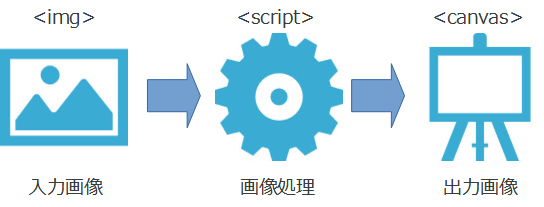
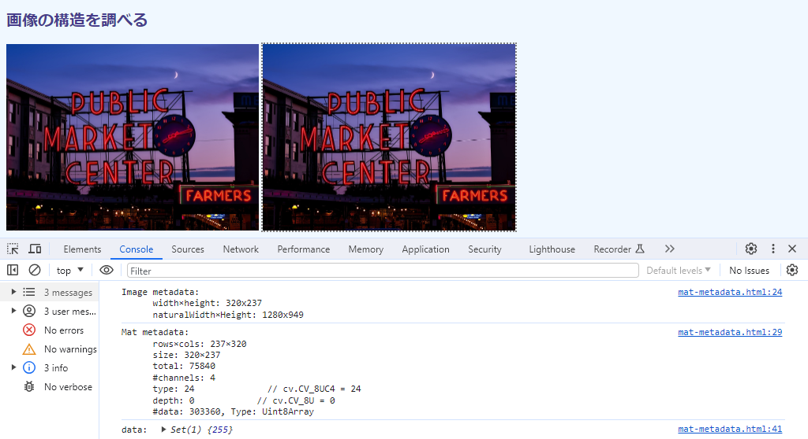
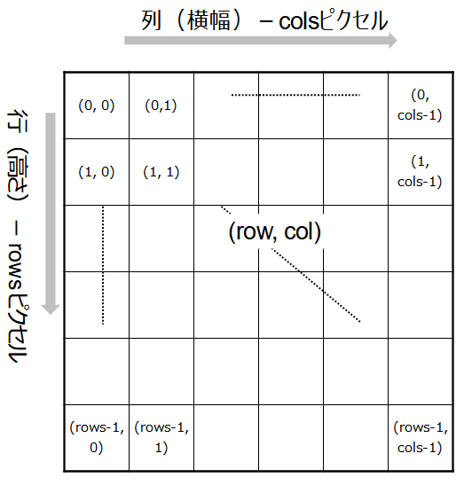
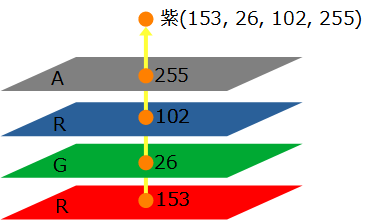
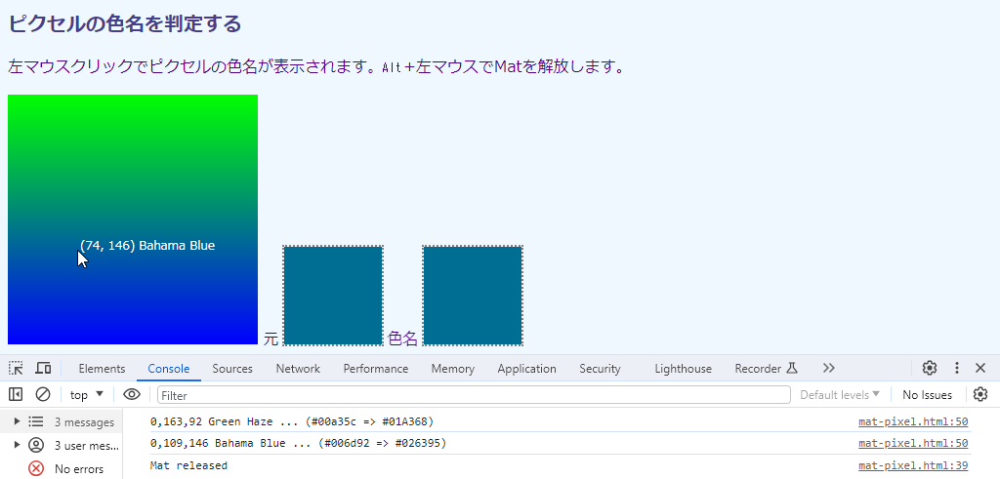
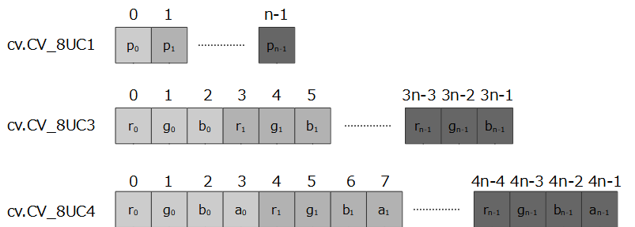
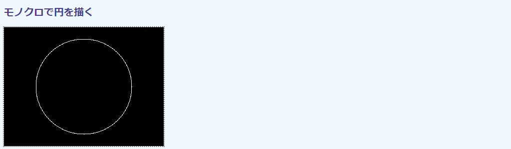
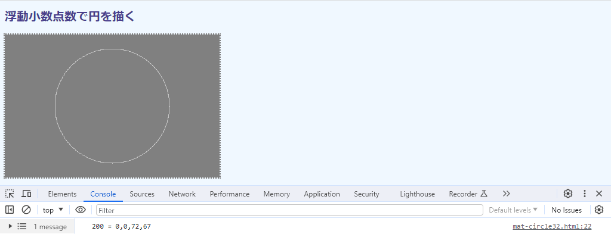
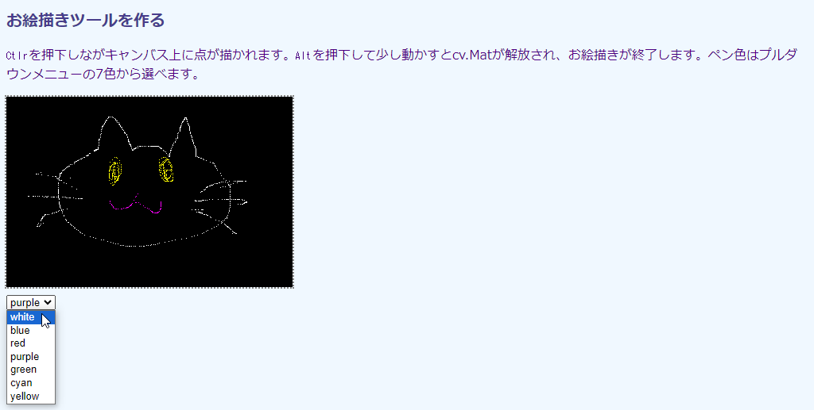
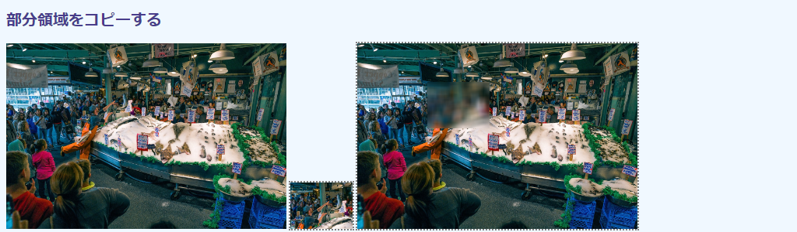

## 第4章 画像の構造

本章では、OpenCV.jsのピクセルの構成とそれらのデータ型といった、画像の構造に関連したトピックと利用例を取り上げます。

OpenCV.jsでピクセルを収容するデータオブジェクトは`cv.Mat`です。描画コンテクストの`ImageData`オブジェクトと同じようなもので、サイズやデータ配列がプロパティとして収容されています。おおきな違いは行列（matrix）として表現されているため、横幅×高さではなく、行（高さ）×列（横幅）と、順序が入れ変わっているところです。ピクセル値を0～255の8ビット符号なし整数値以外でも表現できるので、精度を必要とする画像処理にも対処できます。HSVやYCrCbなどRGBA以外の色空間も利用できます（これは次章で取り上げます）。

<!-- cv の図形描画関数は本章では使わない。必要があれば、のちの章でそれぞれ個別に説明する。ここでは、cv.circle() を閑話に使った -->
<!-- トピックは OpenCV.js Tutorials の Core Operations にある3節のものを、できるだけカバーした。説明していないのは、`mat.clone()`, `cv.MatVector`, `cv.UcharAt()`, `cv.Mat.zeros()`, `cv.Mat.ones()`, `cv.Mat.eyes()`, `mat.add()`, `mat.subtract()`, `cv.bitwise_and`。最初の2つは、それぞれの章で取り上げる。残りは、取り上げない。-->

### 4.1 画像の構造を調べる

#### 目的

本節では、``に取り込んだ画像をOpenCV.jsの画像収容オブジェクトの`cv.Mat`に読み込み、そのまま`<canvas>`に貼り付けます。

技術的には、`HTMLImageElement`から`cv.Mat`へコピーする`cv.imread()`関数と`cv.Mat`から`<canvas>`へコピーする`cv.inshow()`関数を示します。また、`cv.Mat`の画像構造を示すプロパティ、関数、そして`cv.Mat`で用いられる用語を説明します。単に画像メタデータをコンソールに表示するだけですが、この処理が次に再掲する[1.1節](./01-html5.md#11-画像処理の流れ "INTERNAL")の画像処理手順の②に相当します。



実行例を次の画面に示します。



左側がHTML5で``に読み込んだもの、右側がOpenCV.jsの機能でコピーした`<canvas>`です。無処理でコピーしているので、左右は同じです。

コンソール出力の最初のものは``のサイズを示しています。`HTMLVidelElement.width`と`height`が画面上の実寸を、`HTMLVideoElement.naturalWidth`と`naturalHeight`がもともとの寸法をそれぞれ示しているのは、[第1章](./01-html5.md "INTERNAL")で説明した通りです。ここでまた取り上げているのは、この違いが重要だからです。

コンソール出力の2番目のものは、OpenCV.jsに取り込んだあとの`cv.Mat`メタデータです。3番目は、画像のアルファチャネルの値です。これらの値は本節であとから説明します。

#### コード

コード`mat-metadata.html`を次に示します。

```html
[File] mat-metadata.html
  1  <!DOCTYPE html>
  2  <html lang="ja-JP">
  3  <head>
  4    <meta charset="UTF-8">
  5    <link rel=stylesheet type="text/css" href="style.css">
  6    <script async src="libs/opencv.js" type="text/javascript"></script>
  7  </head>
  8  <body>
  9
 10  <h1>画像の構造を調べる</h1>
 11
 12  <div>
 13    
 14    <canvas id="canvasTag" class="placeholder"></canvas>
 15  </div>
 16
 17  <script>
 18    let imgElem = document.getElementById('imageTag');
 19
 20    function imgProc() {
 21      let mat = cv.imread(imgElem);
 22      cv.imshow('canvasTag', mat);
 23
 24      console.log(`Image metadata:
 25        width×height: ${imgElem.width}x${imgElem.height}
 26        naturalWidth×Height: ${imgElem.naturalWidth}x${imgElem.naturalHeight}`
 27      );
 28
 29      console.log(`Mat metadata:
 30        rows×cols: ${mat.rows}×${mat.cols}
 31        size: ${mat.size().width}×${mat.size().height}
 32        total: ${mat.total()}
 33        #channels: ${mat.channels()}
 34        type: ${mat.type()}              // cv.CV_8UC4 = 24
 35        depth: ${mat.depth()}            // cv.CV_8U = 0
 36        #data: ${mat.data.length}, Type: ${mat.data.constructor.name}`
 37      );
 38
 39      let matVector = new cv.MatVector();
 40      cv.split(mat, matVector);
 41      console.log('data: ', new Set(matVector.get(3).data));
 42
 43      mat.delete();
 44      matVector.delete();
 45    }
 46
 47    var Module = {
 48      onRuntimeInitialized: imgProc
 49    }
 50  </script>
 51
 52  </body>
 53  </html>
```

#### cv.imread関数

OpenCV.jsで画像処理を行うには、``で読み込んだ画像を`cv.imread()`関数で`cv.Mat`オブジェクトに読み込まなければなりません（21行目）。

```javascript
 13    
 ︙
 18    let imgElem = document.getElementById('imageTag');
 ︙
 21      let mat = cv.imread(imgElem);
```

`cv.imread()`の引数には`HTMLImageElement`オブジェクト（18行目）を指定します。関数のオリジナル版では色変換指定の第2引数をオプションで指定できますが、OpenCV.jsでは指定しても無視されます。

関数定義を次に示します。

<!-- FunctionDefinition cv.imread() `HTMLImageElement`上の画像を`cv.Mat`に取り込む。 -->
```Javascript
cv.Mat = cv.imread(                         // cv.Matを返す
    HTMLImageElement img                    // 入力元のオブジェクト
);
```

`cv.imread()`は``に描かれている画像の寸法そのままをコピーします。実行例の最初のコンソール出力に示したように、読み込んだ画像の表示上のサイズは360×267で、もともとの寸法は1280×949です（`narutralWidth`×`naturalHeight`）。21行目の`cv.Mat`のサイズは描かれている側のものです。

この点、もともとの画像を扱える描画コンテクスト`CanvasRenderingContext2D`の`drawImage()`と異なります。したがって、縮小表示した画像を`cv.Mat`に読み込んだら、それを原寸大に戻すと画質が劣化します。もともとのサイズが必要なら、そのように``に貼り付けなければなりません。表示は縮小したいが、データとしてはオリジナルが必要という場合は、後者はCSSで不可視にしておくとよいでしょう（この手は[6.6節](./06-img.md#66-書類の傾きを補正する "INTERNAL")で使います）。

`cv.Mat()`を事前に確保しておかないとエラーになる関数もありますが（後述）、`cv.imread()`は内部でメモリ領域を確保してくれるので、その必要はありません。21行目のように、変数に代入するだけです。

#### cv.imshow関数

`cv.Mat`オブジェクトは、`cv.imshow()`関数で`<canvas>`には貼り付けられます（22行目）。第1引数には、ターゲットのキャンバスの`id`値を指定します。`HTMLCanvasElement`オブジェクトではありません。間違えやすいので注意してください。第2引数には張り付ける`cv.Mat`を指定します。

関数定義を次に示します。

<!-- FunctionDefinition cv.imshow() 第2引数の`cv.Mat`を第1引数の`<canvas>`に貼り付ける。 -->
```Javascript
cv.imshow(                                  // 戻り値なし
    string id,                              // <canvas>のid
    cv.Mat mat                              // 画像を収容したcv.Matオブジェクト
);
```

先に示した実行画面例は、画像部分だけにかぎれば、この2行だけで達成できています。

#### cv.Matのプロパティと関数

`cv.Mat`には画像の情報を収容したプロパティと関数がいくつかあり、29～37行目ではその中でも代表的なものをコンソールに出力しています。次に実行例で示したものを表にまとめて示します。関数から取得するものは、名称末尾に`()`が付いています。どれも、引数はありません。

<!-- mat.dims は実装されていない模様 -->
プロパティ／関数 | 戻り値の型 | 実行画面での値 | 内容
---|---|---|---
`rows` | `number` | 267 | 行数（水北方向のピクセル数）
`cols` | `number` | 360 | 列数（水平方向のピクセル数）
`size()` | `cv.Size` | {width: 360, height: 267} | 画像サイズを収容したオブジェクト
`total()` | `number` | 96120 | 全ピクセル数（360×267）
`channels()` | `number` | 4 | チャネル数
`type()` | `number` | 24 | ピクセルのデータ型を示す定数
`depth()` | `number` | 0 | `cv.Mat`1要素あたりのビット数を示す定数
`data` | `TypedArray` | -- | 全ピクセルデータを収容した型付き配列で、その総数（`length`）は`cols * rows * channels()`

#### cv.Matの縦横の順番

画像サイズを示すのに`rows`（行）と`cols`（列）という用語を用いています（30行目）。`cv.Mat`が、2次元に広がるデータの集まりを（数学の）行列として表現しているからです。そして、行列のその名の通り、行と列の値を列挙するときは行、列の順です。実行例で267×360と表示しているのは、それに準じているからです。

これには注意が必要です。画像のサイズおよびその中のピクセル位置は、一般的には(横, 縦)で指定しますが、行列である`cv.Mat`では逆に(縦, 横)の順になるからです。次の図に`cv.Mat`の構造を示します。

<!-- 532x547 Excel に元画像あり -->


図の升目がピクセルを表しています。中の括弧の数値はその座標値で、図中で網掛けされたピクセル位置の(1, 0)は上から「2行目の左端」です。

この縦横の転置は、`cv.Mat`に固有のものです。OpenCV.jsの関数でピクセル位置を指定するときは、たいてい普通の画像のように(x, y)の順で記述します。紛らわしいので、気を付けてください。

`size()`関数は、画像サイズを表の3列目に示したようにオブジェクトの形で返します（31行目）。キーは`width`と`height`なので、`size().width`や`size().height`から横縦の寸法が得られます。`cols`と`rows`と同じ情報なのに別の方法が提供されているのは、このオブジェクトを表現する`cv.Size`というオブジェクトが、矩形のサイズを指定するときによく使われるからです。このオブジェクトについては、のちほど[4.4節](#44-モノクロで円を描く "INTERNAL")で説明します。

`total()`関数は画像の総ピクセル数を返します（32行目）。つまり、`cols * rows`あるいは`size().width * size().height`です。これもよく計算する値なので、利便性を考慮して用意されています。

#### チャネル数

`channels()`関数は、ピクセル1つを構成する値の数であるチャンネル数を返します（33行目）。

一般的なカラー画像のピクセルの色は、次の図に示すように赤（R)、緑（G）、青（B）の3色とその透明度を示すアルファチャネル（A）を重ねる（混色する）ことで構成されます。これらはいずれも`rows`×`cols`の同じサイズの2次元の行列で、それぞれをチャネルと呼びます。各チャネルの要素はその点の輝度（強度）を示します。図では赤153、緑43、青102を混色することで紫を生成しています。アルファチャネルは値が小さいほど透明で、大きいほど不透明なので、正確には不透明度（opacity）を示します。

<!-- 372x222 ODG に原画あり -->


モノクロ画像は色味がない強度だけの2次元データなのでチャネル数は1です。通常のカラーはRGBの3色構成なので3です。`cv.Mat`はこうした多様なチャネル数をそれひとつで表現できます。

コンソール出力でチャネル数が4を示すことからわかるように、HTML5の画像形式は4チャネルのRGBAです。モノクロにしか見えない画像でも、チャネル数は4です。透過情報のない3チャネルRGB画像を読み込んだときでも、最大値255（完全不透明）のアルファ値が自動的に補完されます。

ピクセル値は、チャネル数分の配列で表現されます（HTML5では`Uint8ClampedArray`）。図では`[153, 43, 102, 255]`です。OpenCVでは、これを`cv.Scalar()`というオブジェクトで表現します（[4.4節](#44-モノクロで円を描く "INTERNAL")で説明）。

#### データ型

`type()`関数は、`cv.Mat`のピクセルのデータ型をあらかじめ定められた整数値で返します。実行例の24は、これが「4チャンネル8ビット符号なし整数」であることを示しています。これは、OpenCVの定数値では`cv.CV_8UC4`に対応します。

データ型を示す定数名は、`cv.CV_[ビット数][符号あるなし]C[チャネル数]`で構成されています。

- ビット数 ... 先頭の数字は数値のビット数を示していて、`cv.CV_8UC4`なら8ビットです。他に16ビット、32ビット、64ビットを用いることができます。
- 符号のあるなし ... 数字のうしろの文字はUが符号なし整数（unsigned）、Sが符号あり整数（signed）、Fが浮動小数点数（float）という意味です。
- チャネル数 ... 上述の通りで、1～4のいずれかです。

実行例で示したように、`type()`関数は整数値でしか返しません。数値から型名を知るには、オンラインマニュアルを参照するか、[3.5節](./03-opencv.md#35-OpenCVjsの定数を調べる "INTERNAL")で作成した定数チェッカーを用います。コードからというのなら、こういう手もあります（コンソールから実行。末尾の24が検索したい定数名）。

```javascript
> Object.entries(cv).filter(c => c[0].startsWith('CV_') && c[1] == 24)[0][0]
< 'CV_8UC4'
```

次の表によく用いるデータ型定数名とその値を示します。

定数名 | 値 | 意味
---|---|---
`cv.CV_8UC1` | 0 | 1チャネル8ビット符号なし整数（モノクロ画像）
`cv.CV_8UC3` | 16 | 3チャネル8ビット符号なし整数（カラー画像）
`cv.CV_8UC4` | 24 | 4チャネル8ビット符号なし整数（アルファチャネル付きカラー画像）
`cv.CV_32SC4` | 28 | 4チャネル32ビット符号あり整数
`cv.CV_32FC1` | 13 | 1チャネル32ビット浮動小数点数（モノクロ画像）
`cv.CV_32FC2` | 13 | 2チャネル32ビット浮動小数点数（特殊な計算用）
`cv.CV_32FC3` | 21 | 3チャネル32ビット浮動小数点数（カラー画像）

浮動小数点数は計算誤差を抑えるときに用いられます。画像処理、すなわちピクセル値をもとになんらかの演算をするとき、8ビット符号なし整数だと小数点数以下の切り捨てや256以上の値のオーバーフローが計算のたびに発生するからです。画像はもともと8ビット符号なし整数なので、浮動小数点数に変えることで途中計算時の誤差をなくし、表示するときにまたもとの8ビット符号なし整数に戻します。

`cv.Mat`は行列なので2次元に広がる、あるいはそれらが積み重なったデータならば画像以外のものも収容できます。たとえば、`cv.CV_32SC4`は4つで1組のデータのそれぞれの要素をチャネル単位に収容するのに用いられます（[6.6節](./06-img.md#66―書類の傾きを補正する "INTERNAL")。2チャネルの`cv.CV_32FC2`は[6.4節](./06-img.md#64-QRコードを読む "INTERNAL")で、浮動小数点数2つで構成される点の座標を複数個収容するときに用いています（チャネル0がx座標、チャネル1がy座標）。他にも、画像圧縮では複素数が出てきますが、実部と虚部をそれぞれ収容するのにも使われます。

#### ビット深度

`depth()`関数は、`cv.Mat`で用いている数値のビット数をあらかじめ定められた整数値で返します。実行例の0は、これが「8ビット符号なし整数」であることを示しています。OpenCVの定数値なら`cv.CV_8U`です。

要するに、データ型からチャネル数を除いたものです。情報が重複している気がしないでもありませんが、チャネル数を問わず8ビット符号なしかどうか確認したいときなどに使います。

次の表に、よく見るデータ型定数名、その値、データを収容する配列のデータ型を示します。

定数名 | 値 | 配列データ型 | 意味 
---|---|---|---
`cv.CV_8U` | 0 | `Uint8Array` | 8ビット符号なし整数
`cv.CV_32S` | 0 | `Int32Array` | 32ビット符号あり整数
`cv.CV_32F` | 5 | `Flaot32Array` | 32ビット浮動小数点数

型の決まった配列データ型は、JavaScriptでは`TypedArray`と総称されます。具体的な配列は`Uint8Array`など特定の型を対象にしたオブジェクトですが、どれも`Array`には違いないので、`[1]`のような添え字から要素にアクセスできますし、配列が使えるプロパティや関数はたいてい使えます。36行目では`length`プロパティから全要素数と`constructor.name`からその名称を示しています。

#### データ

`data`プロパティは`Uint8Array`の配列で、ピクセルデータをフラットなバイト列として収容しています。8ビット符号なし整数なら1つの値がそのまま1つの要素に収容されますが、浮動小数点数のようにマルチバイトのデータ型では、そのぶんだけ要素を占有します。32ビットなら4要素分です。

ここから、8ビット整数以外の値を読み取るのはかなり難易度が高いです。そこで、それぞれのデータ型にあわせた`TypedArray`のプロパティが次の表に示すように用意されています。

プロパティ | OpenCVビット深度 | `TypedArray`型 | 意味
---|---|---|---
`data` | `cv.CV_8U` | `Uint8Array` | `data`を8ビット符号なし整数として読む
`data32S` | `cv.CV_32S` | `Int32Array` | `data`を32ビット符号あり整数として読む
`data32F` | `cv.CV_32F` | `Float32Array` | `data`を32ビット浮動小数点数として読む

`data`プロパティの具体的な用法は、8ビット符号なし整数は[4.3節](#43-ピクセルの色名を判定する "INTERNAL")で、32ビット浮動小数点数は[7.4節](./07-video.html#74-ショットをトランジションでつなぐ "INTERNAL")でそれぞれ説明します。

チャネル数のところで、読み込んだ画像が3チャネルであっても、HTML5は4チャネルになるように補完すると述べました。39～41行目はどんなデータが補完されたかを確認するものです。

```javascript
 39      let matVector = new cv.MatVector();
 40      cv.split(mat, matVector);
 41      console.log('data: ', new Set(matVector.get(3).data));
```

複数チャネルの画像はモノクロチャネル画像の重ね合わせなので、それぞれを分離できます。それを行っているのが39～40行目です。[5.4節](./05-colors.md#54-RGB画像を色成分に分解する "INTERNAL")で説明するので、ここはチャネルを分離して、（0からカウントして）3枚目のアルファチャネルだけを抜き出している（41行目の`get(3)`）とだけ思ってください。

41行目は、取り出したアルファチャネルのデータ（中身は`Uint8Array`）を集合型の`Set`に変換しています。これで、重複するデータが省かれます。出力結果をみると255とだけあります。これは、このアルファチャネルには320×267個の要素があっても、すべてが255にセットされているということを示しています。ここから、HTML5はRGB画像に完全不透明なアルファチャネルを加えて``に表示することがわかります。

#### OpenCV.jsリソースの解放

`cv.Mat`および`cv.MatVector`は、利用後`delete()`で明示的に解放しなければなりません（43～44行目）。

```javascript
 43      mat.delete();
 44      matVector.delete();
```

これらOpenCV.jsリソースは内部に収容されているので、JavaScriptのガベージコレクタでは廃棄されません。解放しなければ、タブあるいはブラウザそのものを閉じるまでメモリを占有します。

ビデオ処理のようにループを形成しているときはとくに、気付かないうちに`cv.Mat`をどんどん生成してしまうことがあります。それらは累積されていき、次第にシステムメモリを圧迫していきます。ブラウザあるいはコンピュータそのものの動作が鈍くなったら、こうしたメモリーリークを疑ってください。

`cv.imshow()`で表示、つまり画像データがキャンバスに引き渡されたあとなら、`cv.Mat`は不要です。


### 4.2 キャンバスをコピーする

#### 目的

本節では、`<canvas>`を`cv.Mat`にコピーします。つまり、前節の逆です。この方法は、描画コンテクストの側で画像に操作を施したのちに、その画像データを`cv.Mat`に渡したいときに必要になります（たとえば日本語をキャンバス上で描いてから`cv.Mat`に渡すなど）。ここでは、描画コンテクスを介して文字列を書き込みます。

技術的には、キャンバスからデータを取得する描画コンテクストの関数`getImageData()`と、そこから`cv.Mat`を生成する`cv.matFromImageData()`を説明します。

実行画面を次に示します。


画像を読み込む``は、CSSスタイルの`display: none;`で非表示にしています。左が1枚目のキャンバスで、上に文字列を描いた``の画像が表示されます。右が2枚目のキャンバスで、左のキャンバスからコピーした文字列入り画像をそのまま`cv.Mat`に読み込んで、`cv.imshow()`で表示しています。

#### コード

コード`mat-canvas.html`を次に示します。

```html
[File] mat-canvas.html
  1  <!DOCTYPE html>
  2  <html lang="ja-JP">
  3  <head>
  4    <meta charset="UTF-8">
  5    <link rel=stylesheet type="text/css" href="style.css">
  6    <script async src="libs/opencv.js" type="text/javascript"></script>
  7  </head>
  8  <body>
  9
 10  <h1>キャンバスをコピーする</h1>
 11
 12  <div>
 13    
 14    <canvas id="canvasTag1"></canvas>
 15    <canvas id="canvasTag2" class="placeholder"></canvas>
 16  </div>
 17
 18  <script>
 19    let imgElem = document.getElementById('imageTag');
 20    let canvasElem1 = document.getElementById('canvasTag1');
 21    let ctx1 = canvasElem1.getContext('2d');
 22
 23    function makeCanvas() {
 24      imgElem.style.display = 'none';
 25      let aspect = imgElem.naturalHeight / imgElem.naturalWidth;
 26      imgElem.height = Math.floor(imgElem.width * aspect);
 27      canvasElem1.width = imgElem.width;
 28      canvasElem1.height = imgElem.height;
 29
 30      ctx1.drawImage(imgElem, 0, 0, imgElem.width, imgElem.height);
 31      ctx1.font = '24px sans-serif';
 32      ctx1.strokeStyle = 'white';
 33      ctx1.textBaseline = 'middle';
 34      ctx1.textAlign = 'center';
 35      ctx1.strokeText('Pike Street Market, Seattle',
 36        canvasElem1.width/2, canvasElem1.height/2);
 37    }
 38
 39    function imgProc() {
 40      let imgData = ctx1.getImageData(
 41        0, 0, canvasElem1.width, canvasElem1.height);
 42      let mat = cv.matFromImageData(imgData);
 43      cv.imshow('canvasTag2', mat);
 44      mat.delete();
 45    }
 46
 47    window.addEventListener('load', makeCanvas);
 48    var Module = {
 49      onRuntimeInitialized: imgProc
 50    }
 51  </script>
 52
 53  </body>
 54  </html>
```

``はスクリプトから非表示にしています（24行目）。

```javascript
 13    
 ︙
 19    let imgElem = document.getElementById('imageTag');
 ︙
 24      imgElem.style.display = 'none';
 25      let aspect = imgElem.naturalHeight / imgElem.naturalWidth;
 26      imgElem.height = Math.floor(imgElem.width * aspect);
```

``で`width`属性は指定していても、`height`は未指定なところが注意点です（13行目）。これまで、高さは元画像のアスペクト比に応じて自動的に調節してくれましたが、非表示なので、ここでは0のままです。これでは、不用意に`HTMLImageElement.height`をキャンバスに代入すると、不可視になってします。そこで、もともとの画像のサイズからアスペクト比を計算し（25行目）、画像の高さを設定しています（26行目）。

左のキャンバスでは、描画コンテクストを用いて文字列を描画しているだけです（31～37行目）。キャンバス中央に置きたいので、文字列のベースライン（33行目）と左右位置のアラインメント（34行目）をどちらも中央にし、配置位置をキャンバス中央にしているのが、スクリプティング上のポイントです。

```javascript
 33      ctx1.textBaseline = 'middle';
 34      ctx1.textAlign = 'center';
 35      ctx1.strokeText('Pike Street Market, Seattle',
 36        canvasElem1.width/2, canvasElem1.height/2);
```

#### matFromImageData関数

OpenCV.jsが準備できたら（48～50行目）、キャンバスから画像を読み込み、`cv.Mat`を経由して別のキャンバスに書き込みます（40～43行目）。

```javascript
 40      let imgData = ctx1.getImageData(
 41        0, 0, canvasElem1.width, canvasElem1.height);
 42      let mat = cv.matFromImageData(imgData);
 43      cv.imshow('canvasTag2', mat);
```

キャンバスからの読み込みには、描画コンテクストの関数`CanvasRenderingContext2D.getImageData()`を用います（40～41行目）。引数は`drawImage()`と同じように、コピー元の座標値(x, y)とそのサイズ（width, height)の4点です。この処理で`ImageData`オブジェクトが得られます（40行目の`imgData`)。

`ImageData`は画像データを収容したオブジェクトで、中身はさほど変わらないので、OpenCV関数の`cv.matFromImageData()`で簡単に`cv.Mat`に変換できます（42行目）。関数定義を次に示します。

<!-- FunctionDefinition cv.matFromImageData() `ImageData`オブジェクトを`cv.Mat`に取り込む。 -->
```Javascript
cv.Mat = cv.matFromImageData(               // cv.Matを返す
    ImageData imgData                       // 入力元のオブジェクト
);
```

以降、OpenCVの関数で好みの画像処理が行えます。ここではなにもせず、そのまま第2キャンバスに`cv.imshow()`から表示しています（43行目）。

使用済みの`cv.Mat`を明示的に解放するのを忘れないでください（44行目）。

```javascript
 44      mat.delete();
```


### 4.3 ピクセルの色名を判定する
<!-- 同じことは ImageData.data からでもできる -->

#### 目的

本節では、画像上の点をクリックすることで、そのピクセル値と最も近い色名を画像上に示します。

技術的には、`cv.Mat`のプロパティで、画像のバイナリデータを収容している`data`プロパティからピクセル値を読み取る方法を示します。具体的には`cv.Mat.ucharPtr()`関数です。この関数を操るには、`cv.Mat`がどのようにしてバイナリデータを管理しているかを知らなければならないので、それもここで説明します。R、G、Bの3つの数値からなるピクセル色には名前はありません。そこで、色名を解決するために外部ライブラリの`ntc.js`を利用します。画像上に色名を表示するのには、[2.4節](./02-ui.md#24-日本語文字を画像に重畳する "INTERNAL")で作成した`Overlay.js`ライブラリを使います。

実行画面を次に示します。



クリックした点とその色がわかりやすいよう、画像には緑から青へと垂直に変化していくグラデーションを用意しました。サイズは256×256です。上端の横1ラインは(0, 255, 0)の緑で、下端は(0, 0, 255)の青です。下がるにつれ、(0, 254, 1)のように緑の値が1つずつ減り、反対に青の値が1つずつ増えます。行（縦）位置がcなら（0, 255-c, c)です。

画面には、選択した点に座標値(x, y)とそのピクセル値に最も近い色名を重畳します。この画面では位置は(74, 146)で、色は(0, 109, 146)です。これに最も近い色名はバハマブルーです（ニュージーランドのペイント製造会社のReseneの色名です）。

画像からの選択色で全面を塗りつぶした四角と、近い色名をもとに塗りつぶした四角を参照のために用意しました。どちらも100×100の`<canvas>`で、塗りつぶしには描画コンテクストの`fillRect()`関数を用いています。左右のキャンバスの色は異なりますが、一般人の目には区別がつきませんが、デザインの玄人さんにはわかるらしいです（すごいですね）。

コンソールにはピクセルの値、その色名を示します。括弧に示すのはそれらの16進表記で、数値から違いがわかるようになっています。

#### コード

コード`mat-pixel.html`を次に示します。

```html
[File] mat-pixel.html
  1  <!DOCTYPE html>
  2  <html lang="ja-JP">
  3  <head>
  4    <meta charset="UTF-8">
  5    <link rel=stylesheet type="text/css" href="style.css">
  6    <script async src="libs/overlay.js"></script>
  7    <script async src="libs/opencv.js"></script>
  8    <script async src="https://chir.ag/projects/ntc/ntc.js"></script>
  9  </head>
 10  <body>
 11
 12  <h1>ピクセルの色名を判定する</h1>
 13
 14  <p>左マウスクリックでピクセルの色名が表示されます。<kbd>Alt</kbd>+左マウスでMatを解放します。</p>
 15
 16  <div id="divTag">
 17    
 18    元 <canvas id="canvasTag1" width="100" height="100" class="placeholder"></canvas>
 19    色名 <canvas id="canvasTag2" width="100" height="100" class="placeholder"></canvas>
 20  </div>
 21
 22  <script>
 23    let imgElem = document.getElementById('imageTag');
 24    let canvasElem1 = document.getElementById('canvasTag1');
 25    let ctx1 = canvasElem1.getContext('2d');
 26    let canvasElem2 = document.getElementById('canvasTag2');
 27    let ctx2 = canvasElem2.getContext('2d');
 28
 29    let mat = undefined;
 30    let layer = undefined;
 31
 32    function getPixel(evt) {
 33      if (! mat || ! layer)
 34        return;
 35
 36      if (evt.altKey === true) {
 37        mat.delete();
 38        mat = undefined;
 39        console.log('Mat released');
 40        return;
 41      }
 42
 43      let col = evt.offsetX;
 44      let row = evt.offsetY;
 45      let pixel = [... mat.ucharPtr(row, col)].slice(0, 3);
 46      let hexValue = '#' + pixel.map(p => p.toString(16).padStart(2, 0)).join('');
 47      let match = ntc.name(hexValue);
 48      let matchName = match[1];
 49      let matchHex = match[0];
 50      console.log(`${pixel} ${matchName} ... (${hexValue} => ${matchHex})`);
 51      layer.changeText(`(${col}, ${row}) ${matchName}`, fontSize=-1, x=col, y=row);
 52
 53      ctx1.fillStyle = `rgb(${pixel.join(',')})`;
 54      ctx1.fillRect(0, 0, canvasElem1.width, canvasElem1.height);
 55      ctx2.fillStyle = hexValue;
 56      ctx2.fillRect(0, 0, canvasElem2.width, canvasElem2.height);
 57    }
 58
 59    function resourceReady() {
 60      layer = new Overlay('divTag', text='Select pixel', x=0, y=0, fontSize=12);
 61      imgElem.addEventListener('mousedown', getPixel);
 62    }
 63
 64    function opencvReady() {
 65      mat = cv.imread(imgElem);
 66    }
 67
 68    window.addEventListener('load', resourceReady);
 69    var Module = {
 70      onRuntimeInitialized: opencvReady
 71    }
 72  </script>
 73
 74  </body>
 75  </html>
```

#### 色名の決定

与えられたRGB値からの色名決定には、Chirag Mehtaという方が作られた`ntc.js`を用いています。URLを次に示します。

```https://chir.ag/projects/ntc/```

色名は、いろいろなソースからのものを取り混ぜ、現時点では1566色が定義されています（HTML5/CSSで定義されている色名は148色）。アルゴリズムは、与えられた値と名前の値の3次元空間上の距離が最小のものを全探索しているようです（RGBとHSLを併用している）。色の類似度（距離）の計算方法は次に示す記事で説明されています。

```https://ja.wikipedia.org/wiki/色差```

利用するには、まず8行目のように`<script>`からJavaScriptファイルを読み込みます（8行目）。ダウンロードしてローカルから読み込んでもかまいません。サイズは45 kB程度です。

```html
 8    <script async src="https://chir.ag/projects/ntc/ntc.js"></script>
```

色の値から名前を得ているのが、46～49行目です。

```javascript
 46      let hexValue = '#' + pixel.map(p => p.toString(16).padStart(2, 0)).join('');
 47      let match = ntc.name(hexValue);
 48      let matchName = match[1];
 49      let matchHex = match[0];
```

`ntc.name()`という関数に色の値を`#rrggbb`の16進数文字列表記で指定すれば、色情報の入った配列が返ってきます（47行目）。色の値を収容した変数`pixel`（後述する45行目で取得）は`[r, g, b]`形式の配列なので、まずこれを16進数文字列に起こします（46行目）。たとえば、`[0, 163, 92]`は#00A35Cにします。

戻り値の配列には次の3つの要素が含まれています。

- 0番目 ... もっとも近い色の値（16進数文字列表記）。
- 1番目 ... その色名（文字列）。
- 2番目 ... 入力と結果の値が完全一致しているときは`true`。

ここでは0番目（48行目）と1番目（49行目）を利用しています。

#### 文字列を画像に重畳する

選択した点の位置とその色名は、画像の上に重畳します。これには、[2.4節](./02-ui.md#24-日本語文字を画像に重畳する "INTERNAL")で作成した`Overlay`クラスを使っています（6行目）。

```html
  6    <script async src="libs/overlay.js" type="text/javascript"></script>
```

`Overlay`は、OpenCV.jsを除くすべてのリソースが読み込まれたあとで実行される`resourceReady()`関数（59～62行目）でのインスタンス化します。あとはマウス操作があったときに呼び出される`getPixel()`（32～57行目）でテキストを変更します。

```javascript
 //  getPicel()
 51      layer.changeText(`(${col}, ${row}) ${matchName}`, fontSize=-1, x=col, y=row);
 ︙ 
 // resourceReady() {
 60      layer = new Overlay('divTag', text='Select pixel', x=0, y=0, fontSize=12);
```

#### 準備完了の検出

複数のスクリプトとOpenCV.jsの準備が整わなければ、ピクセル操作をする`getPixel()`は利用できません。

複数のスクリプトの読み込み完了は、`window`に`load`イベントが発生することで検知します。処理関数は`resourceReady()`（59～62行目）です。

```javascript
 30    let layer = undefined;
 ︙ 
 59    function resourceReady() {
 60      layer = new Overlay('divTag', text='Select pixel', x=0, y=0, fontSize=12);
 61      imgElem.addEventListener('mousedown', getPixel);
 62    }
 ︙ 
 68    window.addEventListener('load', resourceReady);
```

呼び出されれば、30行目では`undefined`だった変数`layer`にオブジェクトが収容されます（60行目）。また、これを契機にマウス操作イベントも登録します（61行目）。

OpenCV.jsの準備完了の検出にはいつもの`Module.onRuntimeInitialized`を使います。処理関数は`opencvReady()`（64～66行目）です。

```javascript
 29    let mat = undefined;
 ︙ 
 64    function opencvReady() {
 65      mat = cv.imread(imgElem);
 66    }
 ︙ 
 69    var Module = {
 70      onRuntimeInitialized: opencvReady
 71    }
```

`cv.Mat`に画像を読み込んでいるだけですが、これで29行目の`mat`が`undefined`でなくなります。

これら2つの変数はフラグにもなっていています。ピクセル処理関数の先頭で、どちらか一方でも`undefind`なら処理を進めずにそのまま戻るようにしています（33～34行目）。

```javascript
 32    function getPixel(evt) {
 33      if (! mat || ! layer)
 34        return;
```

フラグ方式ではなく、2つの準備がともに完了したときになんらかのアクションを起こしたいのなら、`Promise`を使います。方法は[付録](TBA "INTERNAL")に示しました。

#### ピクセル値の読み込み

65行目で読み込んだ画像のデータ型は`cv.CV_8UC4`です。8ビット符号なし整数なので、`cv.Mat.data`からそれぞれのチャネルの値（0～255）を読み取れます。

画像のピクセルは[4.1節](#41-画像の構造を調べる "INTERNAL")の図で示したように、縦横の格子状（2次元）に並んでいます。配列は1次元なので、ピクセル値は横方向1列を順次連結して収容されます。チャネル数が1のモノクロ画像（`cv.CV_8UC1`）のときは単純にその値が並ぶだけですが、`cv.CV_8UC3`（RGB）や`cv.CV_8UC4`（RGBA）のようにチャネル数が3つや4つのときは、値はRGBあるいはRGBAの順に並べられます。この様子を次の模式図に示します（図中nは画像のピクセル数）。

<!-- 803x287 ODG ファイルに原画あり -->


サイズが(cols, rows)、チャネル数がcのとき、位置(col, row)にあるピクセルの最初のチャネル（RGBやRGBAではR）の配列上の要素番号は次のように計算できます。

```r = row * cols * c + col * c```

これにGは1を、Bは2を、Aは3をそれぞれ加えれば、それらの位置が得られます。

これで、`cv.Mat.data`に要素指定の`[]`を加えれば値が得られるようになりました。

計算は面倒なので、コンビニエンス関数が用意されています。`cv.Mat.ptr()`関数がそれです。`ptr()`はデータ型に応じたバリエーションがあり、8ビット符号なし整数なら`ucharPtr()`です（45行目）。この関数はチャネル数ぶんの要素を含んだ`Uint8Array`を返します。関数の書式を次に示します。

<!-- FunctionDefinition cv.Mat.ucharPtr() `cv.Mat.data`の指定の位置からのピクセル値を`Uint8Array`で返す。 -->
```Javascript
Uint8Array = cv.Mat.ucharPtr(               // cv.Matを返す
    number row,                             // ピクセルの行位置（y）
    number col                              // ピクセルの列位置（x）
);
```

`cv.Mat.ptr()`のバリエーションを次の表に示します。

ビット深度 | `TypedArray` | 関数 | 用例
---|---|---|---
`CV_8U` | `Uint8Array` | `cv.Mat.ucharPtr()` | 本節
`CV_8S` | `Int8Array` | `cv.Mat.charPtr()` | 
`CV_16U` | `Uint16Array` | `cv.Mat.ushortPtr()` |
`CV_16S` | `Int16Array` | `cv.Mat.shortPtr()` |
`CV_32S` | `Int32Array` | `cv.Mat.intPtr()` | [6.6節](./06-img.md#66-書類の傾きを補正する "INTERNAL")
`CV_32F` | `Float32Array` | `cv.Mat.floatPtr()` | [6.4節](./06-img.md#64-QRコードを読む "INTERNAL")
`CV_64F` | `Float64Array` | `cv.Mat.doublePtr()` | 

返ってくる`Uint8Array`のサイズは取り込むデータ型と連携していないので、手づから切り出さなければなりません。

この処理を行っているのが、コード43～45行目です。

```javascript
 43      let col = evt.offsetX;
 44      let row = evt.offsetY;
 45      let pixel = [... mat.ucharPtr(row, col)].slice(0, 3);
```

43～44行目で、イベントリスナー関数`getPixel()`が受けたイベント`evt`からクリックした点の座標を得ています。そのうえで`cv.Mat.ucharPtr()`から、その位置を先頭にしたデータ列を収めた`Uint8Array`を取得します。このままだと使い勝手が悪いので、スプレッド構文（`[...]`）で配列に直します。最後に`slice(0, 3)`で最初の3つの要素を取り出します。

HTML5画像がRGBAなので、`cv.Mat`のデータ型は`cv.CV_8UC4`です。したがって、ピクセル深度は4なのですが、ここではアルファチャネルは不要なので3要素だけしか取り出していません。

あとは、この値を整形して`ntc.name()`に投入すれば色名が得られることは、先ほど説明した通りです。

#### cv.Matの解放

継続的に実行される本節のアプリケーションでは、どこで`cv.Mat`を解放するかが悩ましいです。ここでは、ユーザに<kbd>Alt</kbd>を押下しながらマウスをクリックしてもらうことで、アプリケーションの利用終了を明示してもらいます。この処理を行っているのが、36～41行目です。

```javascript
 36      if (evt.altKey === true) {
 37        mat.delete();
 38        mat = undefined;
 39        console.log('Mat released');
 40        return;
 41      }
```

前述のように、変数`mat`はピクセル処理をするか否かのフラグにもなっているので、38行目で`undefined`を代入します。これで、解放後は、処理関数`getPixel()`が先頭で処理を勧めないようにします（33～34行目）。

とはいえ、ユーザのことですから、おそらく忘れるでしょう。その場合、タブあるいはブラウザ本体が閉じられるまでは、OpenCV.jsのリソースがメモリを占有します。

#### もっと色を

3チャネルのピクセル値から色名に得る`ntc.js`には、16進表記のピクセル値とその色名の配列の配列が収容されています。変数名は`names`で、115行目以降に書かれています。

```javascript
115    names: [
116  ["000000", "Black"],
117  ["000080", "Navy Blue"],
118  ["0000C8", "Dark Blue"],
︙
```

この配列に同じ形式でピクセル値と色名を登録すれば、もともとの1556色以外の色名もあわせて使えます。あるいは、別の色名データベースと交換します。たとえば、次にURLを示す「原色大辞典」の和色大辞典を使えば、日本の伝統色456色（執筆現在）が使えるようになります。

```https://www.colordic.org/```

`ntc.js`をダウンロードし、編集します（JavaScriptコードなのでテキストエディタで編集できます）。たとえば、次のようにします（末尾の閉じ`]`を忘れずに）。

```javascript
1681  ["FFFFFF", "White"],         // ここまでがオリジナル
1682  ['FEF4F4', '桜色'], ['96514D', '小豆色'], ['E6B422', '黄金'], ...,
1683  ]
```

編集後のライブラリを読み込むようにすれば、以降、これらの色が使えます。試してみてください。


### 4.4 モノクロで円を描く

#### 目的

本節では、背景黒のモノクロ画像に白い円を描きます。コンソールにはキャンバスのサイズ(width, height)、円の中心位置(x, y)、円の中心と半径(point, radius)を示します。

<!-- `cv.RotatedRect`は無視。C/C++にもあるけど、使ったことないなぁ。-->
技術的には、1チャネル8ビット符号なし整数（`cv.8UC1`）の`cv.Mat.data`に値を直接書き込めるよう、座標位置(x, y)からバイトデータ配列の要素位置を計算する方法を示します。これにあわせて、OpenCVでよく用いられるデータオブジェクトを説明します。これらは、矩形のサイズを示す`cv.Size`、点の位置を収容した`cv.Point`、円の半径と中心座標を記述する`cv.Circle`、ピクセル値の`cv.Scalar`です。このタイプのオブジェクトには他に`cv.Rect`がありますが、これは[4.7節](#47-部分領域だけ処理する "INTERNAL")で説明します。

実行画面を次に示します。



#### コード

コード`mat-circle8.html`を次に示します。

```html
[File] mat-circle8.html
  1  <!DOCTYPE html>
  2  <html lang="ja-JP">
  3  <head>
  4    <meta charset="UTF-8">
  5    <link rel=stylesheet type="text/css" href="style.css">
  6    <script async src="libs/opencv.js" type="text/javascript"></script>
  7  </head>
  8  <body>
  9
 10  <h1>モノクロで円を描く</h1>
 11
 12  <div>
 13    <canvas id="canvasTag" class="placeholder"></canvas>
 14  </div>
 15
 16  <script>
 17    let canvasElem = document.getElementById('canvasTag');
 18
 19    function drawCircle(mat, circle) {
 20      for (let deg=0; deg<360; deg+=0.5) {
 21        let radian = deg * Math.PI / 180;
 22        let x = Math.floor(circle.center.x + circle.radius * Math.cos(radian));
 23        let y = Math.floor(circle.center.y + circle.radius * Math.sin(radian));
 24        let pos = x + y * mat.cols;
 25        mat.data[pos] = 255;
 26      }
 27    }
 28
 29    function imgProc() {
 30      let size = new cv.Size(360, 240);
 31      let mat = new cv.Mat(size, cv.CV_8UC1);
 32      console.log('Size: ', size);
 33
 34      let center = new cv.Point(
 35        Math.floor(size.width / 2),
 36        Math.floor(size.height / 2),
 37      );
 38      console.log('Center: ', center);
 39
 40      let radius = Math.floor(Math.min(center.x, center.y) * 0.8);
 41      let circle = new cv.Circle(center, radius);
 42      console.log('Circle: ', circle);
 43
 44      drawCircle(mat, circle);
 45      cv.imshow('canvasTag', mat);
 46      mat.delete();
 47    }
 48
 49    var Module = {
 50      onRuntimeInitialized: imgProc
 51    }
 52  </script>
 53
 54  </body>
 55  </html>
```

#### cv.Matコンストラクタ

`cv.Mat`はそのコンストラクタから生成できます（31行目）。コンストラクタの書式は次に示す3通りがあります。

<!-- FunctionDefinition cv.Mat() `cv.Mat`を生成するコンストラクタ。 -->
```Javascript
cv.Mat = cv.Mat(                            // cv.Matを返す
    cv.Size size,                           // サイズ
    number rtype                            // データ型
);
cv.Mat = cv.Mat(                            // cv.Matを返す
    number rows,                            // 行数（高さ）
    number cols,                            // 列数（横幅）
    number rtype                            // データ型
);
cv.Mat = cv.Mat(                            // cv.Matを返す
    number rows,                            // 行数（高さ）
    number cols,                            // 列数（横幅）
    number rtype,                           // データ型
    cv.Scalar color                         // 埋める値
);
```

インスタンス化には`new`を付けます。データ型を指定する`rtype`は整数値ですが、普通は`cv.CV_8UC1`などの定数名を指定します。31行目で用いているのは2引数のタイプです。

```javascript
 31      let mat = new cv.Mat(size, cv.CV_8UC1);
```

いずれについても、必須の情報は`cv.Mat`の行と列の数、それとデータ型です。行と列の数を別々に指定する3引数と4引数のタイプでは、順序が行（高さ）、列（横幅）なところに注意します（よく間違えます）。

2引数版と3引数版の違いは、サイズを`cv.Size`で指定するか、行と列で別々に指定するかだけです。4引数版はこれらに初期状態で埋めるピクセル値を指定します。指定のない前2つのタイプでは`cv.Mat`は0で埋められます（RGBではまっくろ）。4引数版は次節で取り上げます。

これで`cv.Mat`は利用可能です。たとえば、そのまま`cv.imshow()`に引き渡せば、まっくろな画像が表示されます。

#### cv.Sizeオブジェクト

`cv.Mat`コンストラクタの2引数タイプの第1引数で指定している`cv.Size`は、`width`と`height`をキーに持つオブジェクトです。そのコンストラクタの書式を次に示します。

<!-- FunctionDefinition cv.Size() 横と縦の大きさを収容したオブジェクトのコンストラクタ。 -->
```Javascript
cv.Size = cv.Size(                          // cv.Sizeを返す
    number width,                           // 横幅
    number height                           // 高さ
);
```

これもコンストラクタなので`new`を付けてインスタンス化すると、`cv.Size`オブジェクトが戻ってきます（29行目）。

```javascript
 30      let size = new cv.Size(360, 240);
```

`cv.Size`はJavaScriptのオブジェクトです。実際、中身をコンソールから調べると、至極普通の`{}`でくくられたオブジェクトです。したがって、`size.width`あるいは`size.height`からプロパティ値にアクセスできます。

```javascript
> size = new cv.Size(360, 240)
< Size {width: 360, height: 240}
    height: 240
    width: 360
    [[Prototype]]: Object
> size.width
< 360
```

#### cv.Pointオブジェクト

`cv.Point`は点の座標位置を示すオブジェクトで、`x`と`y`をキーに持ちます。ここでは円の中心座標を示すのに用いています（34～37行目）。

```javascript
 34      let center = new cv.Point(
 35        Math.floor(size.width / 2),
 36        Math.floor(size.height / 2),
 37      );
```

JavaScript上は`number`なので浮動小数点数であっても問題はありませんが、C/C++がベースにあるOpenCV.jsは型に敏感です。座標位置やピクセル値は（`cv.CV_32FC4`など浮動小数点数型を使っていないかぎり）整数値に直すように気を配ってください。思わぬところでエラーが発生します。

コンストラクタの書式を次に示します。

<!-- FunctionDefinition cv.Point() 座標位置(x, y)を収容したオブジェクトのコンストラクタ。 -->
```Javascript
cv.Point = cv.Point(                        // cv.Pointを返す
    number x,                               // x位置（列位置）
    number y                                // y位置（行位置）
);
```

行、列の順ではなく、x、yの順です。

`cv.Size`同様、中身はただのJavaScriptオブジェクトです。

#### cv.Circleオブジェクト

`cv.Circle`は円の形状を記述する、中心座標`point`と半径`radius`をキーに持つオブジェクトです。`point`には`cv.Point`を用います。41行目で使っています。

```javascript
 40      let radius = Math.floor(Math.min(center.x, center.y) * 0.8);
 41      let circle = new cv.Circle(center, radius);
```

コンストラクタには`cv.Point`、`number`の順で指定します。書式を次に示します。

<!-- FunctionDefinition cv.Circle() 中心座標と半径を収容したオブジェクトのコンストラクタ。 -->
```Javascript
cv.Circle = cv.Circle(                      // cv.Cicleを返す
    cv.Point center                         // 中心座標
    number radius                           // 半径
);
```

<!-- たぶん、本家の OpenCV にこの型はない -->
OpenCVには円を描く`cv.circle()`という関数があり、そちらはcが小文字です。間違えやすいので気をつけてください。用法は[7.4節](./07-video.md#74-ショットをトランジションでつなぐ "INTERNAL")で説明します。

#### ピクセル値の書き込み

画像を描くとは、すなわち`cv.Mat`の`data`プロパティに値を代入することです。本節のコードでそれを行っているのは、19～27行目の`drawCircle()`関数です。

```javascript
 19    function drawCircle(mat, circle) {
 20      for (let deg=0; deg<360; deg+=0.5) {
 21        let radian = deg * Math.PI / 180;
 22        let x = Math.floor(circle.center.x + circle.radius * Math.cos(radian));
 23        let y = Math.floor(circle.center.y + circle.radius * Math.sin(radian));
 24        let pos = x + y * mat.cols;
 25        mat.data[pos] = 255;
 26      }
 27    }
```

角度を0°～360°まで0.5°きざみでループし（20行目）、三角関数で(x, y)座標を計算し（22～23行目）、座標値をもとに`data`配列の要素位置を算出し（24行目）、そこに値（255）を代入しています（25行目）。モノクロ画像なので位置計算は簡単で、水平位置に画像幅と垂直位置を掛けたものを足すだけです。これで、黒いバックグラウンドに白い点が描画されます。

あとは`cv.inshow()`でキャンバスに`cv.Mat`を貼り付けるだけです（46行目）。

利用の終わった`cv.Mat`を解放するのを忘れないでください（47行目）。

```javascript
 47      mat.delete();
```

#### cv.Scalarオブジェクト

円描画の`cv.circle()`の第4引数で用いている`cv.Scalar`オブジェクトは、ピクセル値を収容する配列です。

コンストラクタの引数には、配列要素を指定する要領で数値を列挙します。書式を次に示します。

<!-- FunctionDefinition cv.Scalar() 1～4個の数値を収容するコンテナのコンストラクタ（色指定に使う）。 -->
```Javascript
cv.Scalar = cv.Scalar(                      // cv.Scalarを返す
    number, ...                             // 1～4個の数値
);
```

`cv.Circle`自体の要素数は必ず4ですが、引数の個数は問いません。1個しか指定しなければ、残りは0で埋められます。5個以上指定すると、5番目以降は無視されます。実行例をコンソールから示します。

```javascript
> new cv.Scalar(1, 2, 3)                    // 3個だけ指定
< Scalar(4) [1, 2, 3, 0]                    // 4番目は0
> new cv.Scalar(1, 2, 3, 4, 5, 6)           // 6個指定
< Scalar(4) [1, 2, 3, 4]                    // 5番目以降は切り捨て
```

このオブジェクトは単なる数値配列なので、値をどのように解釈するかは受け手次第です。4要素ありますが、モノクロ画像のピクセルのときは最初の要素だけが参照されます。


### 4.5 浮動小数点数で円を描く

#### 目的

本節では、前節と同じく円を描きます。やはりモノクロですが、背景は灰色、線色はやや暗くした白です。

技術的には、データ型に1チャネル32ビット浮動小数点数（`cv.CV_32FC1`）を用いるところがポイントです。計算精度が必要な画像処理には浮動小数点数が必要なので、扱い方はしっておかなければなりません。32ビット浮動小数点数は1ピクセルにつき4バイトを占有するので、`cv.Mat.data`の配列要素位置の計算が変わります。また、データの中身はストレートな数値ではなく、浮動小数点数の内部表現（IEE 754単精度浮動小数点数）なため、0.8を`3F 4C CC CD`のように、もとの数値から見当のつかないバイト列にする方法も示します。

実行画面を次に示します。



コンソールに示したのは円の線色0.8を32ビット（4バイト）の浮動小数点数で表現したときのバイト列です。詳細はあとから説明します。

#### コード

コード`mat-circle32.html`を次に示します。

```html
[File] mat-circle32.html
  1  <!DOCTYPE html>
  2  <html lang="ja-JP">
  3  <head>
  4    <meta charset="UTF-8">
  5    <link rel=stylesheet type="text/css" href="style.css">
  6    <script async src="libs/opencv.js" type="text/javascript"></script>
  7  </head>
  8  <body>
  9
 10  <h1>浮動小数点数で円を描く</h1>
 11
 12  <div>
 13    <canvas id="canvasTag" class="placeholder"></canvas>
 14  </div>
 15
 16  <script>
 17    let canvasElem = document.getElementById('canvasTag');
 18
 19    function drawCircle(pix, mat, cx, cy, r) {
 20      let f = new Float32Array([pix]);
 21      let fBuffer = new Uint8Array(f.buffer);
 22      console.log(`${f} = ${fBuffer}`);
 23
 24      for (let deg=0; deg<360; deg+=0.5) {
 25        let radian = deg * Math.PI / 180;
 26        let x = Math.floor(cx + r * Math.cos(radian));
 27        let y = Math.floor(cy + r * Math.sin(radian));
 28        let pos = (x + y * mat.cols) * 4;
 29        for(let i=0; i<4; i++)
 30          mat.data[pos+i] = fBuffer[i];
 31      }
 32    }
 33
 34    function imgProc() {
 35      let width = 360;
 36      let height = 240;
 37      let mat = new cv.Mat(height, width, cv.CV_32FC1, new cv.Scalar(0.5));
 38      // mat.setTo(new cv.Scalar(0.7));
 39      drawCircle(0.8, mat, width/2, height/2, height*0.4);
 40      cv.imshow('canvasTag', mat);
 41      mat.delete();
 42    }
 43
 44    var Module = {
 45      onRuntimeInitialized: imgProc
 46    }
 47  </script>
 48
 49  </body>
 50  </html>
```

基本構造は`cv.Point`などのオブジェクトを使っていないだけで前節と変わりませんが、`cv.Mat`に1チャネル32ビット浮動小数点数を用いることによる変更点がいくつかあります。

まず、ピクセル値の範囲が0～255から0.0～1.0になります。もっとも、`cv.Mat`自体がその範囲外を受け付けないというわけではありません。32ビット浮動小数点数の精度内の値（±10<sup>38</sup>くらい）は表現可能であっても、画像として見ることのできるのは0以上1以下の範囲になるという意味です。

浮動小数点数のピクセル値は`cv.imshow()`で表示されるとき、つまり`HTMLCanvasElement`に貼り付けられる段階で、自動的に8ビット符号な整数のRGBAに変換されます。0.0はもちろん0、1.0は255、間は均等割りです。37行目の背景色の0.5はちょうど中間なので、8ビット符号なし整数の128として描画されます。39行目の描画線色の0.8は、255×0.8＝204です。

32ビット浮動小数点数のバイナリ（4バイトデータ）は、IEEE 754の32ビット版（binary32）で表現されます。興味のある方は次にURLを示すWikipediaの記事「IEEE 754」を参照してください。

```https://ja.wikipedia.org/wiki/IEEE_754```

`cv.Mat.data`の配列には`Float32Array`が用いられます（20行目）。

#### cv.Matの生成

`cv.Mat`の生成には4引数タイプのコンストラクタを用いています（37行目）。

```line
 37      let mat = new cv.Mat(height, width, cv.CV_32FC1, new cv.Scalar(0.5));
```

これまで使ってこなかった第4引数には、`cv.Mat`を埋める初期値を指定します。0.5などの直値は受け入れてくれないので、値が1個だけであっても`cv.Scalar()`を介します。

補足ですが、既存の`cv.Mat`を特定の色で塗りつぶすには、`cv.Mat.setTo()`関数を使います。引数には上記同様、`cv.Scalar()`を指定します。上記の`mat`を0.7で塗りつぶし直すには、コメントアウトされている38行目を使います。

```javascsript
 38      // mat.setTo(new cv.Scalar(0.7));
```

#### ピクセル値の書き込み

`cv.Mat.data`への代入にはやや注意が必要です。

まず、32ビットなので1ピクセルあたり4バイトを占有します。0ピクセル目は`data`の先頭から、1ピクセル目は4バイト目から、2ピクセル目は8バイト目からのように4バイト飛びになります。配列要素位置を計算する28行目が、前節の計算の4倍になっているのはそのためです。

```javascript
 28        let pos = (x + y * mat.cols) * 4;
```

代入する値も`Float32Array`でなければなりません。そこで、まず単純に0.8を代入して作成します（20行目）。`Float32Array`コンストラクタ引数に初期値を用いるときは配列（イテラブル）を指定しなければならないので、数値がひとつであっても`[0.8]`のように`[]`でくくります。

```javascript
 20      let f = new Float32Array([pix]);
```

`TypedArray`には`buffer`プロパティがあり、この数値のバイト列（IEEE 754 binary 32表現）がそのまま収容されています。ここから`Uint8Array`を生成すれば、4個の生バイトの配列が得られます（21行目）。

```javascript
 21      let fBuffer = new Uint8Array(f.buffer);
 22      console.log(`${f} = ${fBuffer}`);
```

コンソール出力によれば、0.8は`[205, 204, 76, 63]`になります（16進表記ならcdcc4c3f)。あとは、これらバイト値を`cv.Mat.data`の所定の位置に順番に入れていくだけです（29～30行目）。

```javascript
 29        for(let i=0; i<4; i++)
 30          mat.data[pos+i] = fBuffer[i];
```

数値を浮動小数点数の内部表現に変換するツールはネットにいろいろあるので、固定値ならあらかじめ計算をし、直値を入れるのも手です。「IEEE 754 変換」で検索してください。なお、大半のPCが搭載しているIntelのCPUはリトルエンディアンなので16進数が逆順になります。

浮動小数点数は扱いがなかなかにめんどうです。ただ、最初から浮動小数点数の画像データ（たとえばレイトレーシングなどのCG）を扱うようなケースもないわけではないので、やりかたは知っておいても悪くはないでしょう。

最後に、使用済みのcv.Matを明示的に解放するのを忘れないように（41行目）。

```javascript
 41      mat.delete();
```


### 4.6 お絵描きツールを作る

#### 目的

マウス操作でキャンバスに絵を描く、お絵描きツールを作成します。<kbd>Ctrl</kbd>キーを押しながらキャンバス上でマウスを動かすと、その軌跡が点となって現れます。キャンバスの背景は黒です。お絵描きペンの色は7色（赤、青、緑、シアン、紫、黄色、白）から選べますが、ペン先の太さは固定で1ピクセル幅です。

技術的には、カラーRGB（`cv.CV_8UC3`）を使っているということ以外、とくに注目すべきものはありません。ただ、`cv.Mat`の解放タイミングがこれまでと異なり、ユーザ操作で明示的に解放するようになっています。解放後は描画はできなくなるので、それを機にマウスイベントを受け付けなくなるようにします。

実行画面を次に示します。



本節の目的は、`cv.Mat.data`にカラーピクセルを直接代入する方法を示すところにあります。使い勝手はいまひとつですが、お絵描きそのものが目的ではないのでその点はご容赦のほどを。

#### コード

コード`mat-paint.html`を次に示します。

<!-- 編集さんへ：12行目の<p></p>が紙面をオーバーランしますが、そのまま右端で折り返してください。-->
```html
[File] mat-paint.html
  1  <!DOCTYPE html>
  2  <html lang="ja-JP">
  3  <head>
  4    <meta charset="UTF-8">
  5    <link rel=stylesheet type="text/css" href="style.css">
  6    <script async src="libs/opencv.js" type="text/javascript"></script>
  7  </head>
  8  <body>
  9
 10  <h1>お絵描きツールを作る</h1>
 11
 12  <p><kbd>Ctlr</kbd>を押下しながキャンバス上に点が描かれます。<kbd>Alt</kbd>を押下して少し動かすとcv.Matが解放され、お絵描きが終了します。ペン色はプルダウンメニューの7色から選べます。</p>
 13
 14  <div>
 15    <canvas id="canvasTag" width="360" height="240" class="placeholder"></canvas>
 16  </div>
 17  <div>
 18    <select id="selectTag"></select>
 19  </div>
 20
 21  <script>
 22    let canvasElem = document.getElementById('canvasTag');
 23    let selectElem = document.getElementById('selectTag');
 24
 25    let ctx = canvasElem.getContext('2d');
 26    ctx.fillStyle = 'black';
 27    ctx.fillRect(0, 0, canvasElem.width, canvasElem.height);
 28
 29    let mat = undefined;
 30    let colors = {
 31      white: [255, 255, 255],
 32      blue: [0, 0, 255],
 33      red: [255, 0, 0],
 34      purple: [255, 0, 255],
 35      green: [0, 255, 0],
 36      cyan: [0, 255, 255],
 37      yellow: [255, 255, 0]
 38    };
 39    let selectedColor = 'white';
 40
 41    function colorOptions(parnent) {
 42      Object.keys(colors).forEach(function(c) {
 43        let elem = document.createElement('option');
 44        elem.value = c;
 45        elem.innerHTML = c;
 46        selectElem.appendChild(elem);
 47      });
 48    }
 49
 50    function selectColor(evt) {
 51      selectedColor = evt.target.value;
 52      console.log(`Color: ${selectedColor}`);
 53    }
 54
 55    function paint(evt) {
 56      if (evt.altKey) {
 57        mat.delete();
 58        console.log('Mat released. Refresh to restart.');
 59        canvasElem.removeEventListener('mousemove', paint);
 60        return;
 61      }
 62      else if (! evt.ctrlKey)
 63        return;
 64
 65      let [r, g, b] = colors[selectedColor];
 66      let pos = (evt.offsetX + evt.offsetY * canvasElem.width) * mat.channels();
 67      mat.data[pos] = r;
 68      mat.data[pos+1] = g;
 69      mat.data[pos+2] = b;
 70      cv.imshow('canvasTag', mat);
 71    }
 72
 73    function imgProc() {
 74      selectElem.addEventListener('change', selectColor);
 75      canvasElem.addEventListener('mousemove', paint);
 76      colorOptions();
 77      mat = new cv.Mat(canvasElem.height, canvasElem.width, cv.CV_8UC3);
 78    }
 79
 80    var Module = {
 81      onRuntimeInitialized: imgProc
 82    }
 83  </script>
 84
 85  </body>
 86  </html>
```

ペン色を選択する`<option>`は7つもあるので、HTMLで直書きはせず、スクリプトから生成しています。30～38行目が線色のリスト、41～47行目が`HTMLOptionElement`の生成、50～53行目が選択イベントの処理です。線色のリストはオブジェクト形式にすることで、`<select>`の選択結果（`value`）からRGB値を取ってこれるようにしてあります。

#### Matの解法

[4.3節](#43-ピクセルの色名を判定する "INTERNAL")同様、お絵描きプログラムも稼働中はずっと`cv.Mat`を使います。そのためここでも、ユーザフレンドリーではないのは承知で、ユーザから明示的に解放指示をさせるようにしています。

カラーの点を描画する関数`paint()`（55～71行目）は、マウス移動イベントを受けると呼び出されます（76行目で登録）。この最初の関数で移動時に<kbd>Alt</kbd>が押下されているかを確認し（56行目）、そうなら`cv.Mat`を解放します（57行目）。

```javascript
 55    function paint(evt) {
 56      if (evt.altKey) {
 57        mat.delete();
```

以降、`cv.Mat()`にアクセスはできません。しかし、マウス移動イベントが発生するたびにこの`cv.Mat`操作関数は呼ばれてしまうので、ここでは明示的にイベントを解除しています（59行目）。これで、マウス操作がされてもアクセスエラーは発生しなくなります。

```javascript
 58        console.log('Mat released. Refresh to restart.');
 59        canvasElem.removeEventListener('mousemove', paint);
 60        return;
 61      }
```

#### カラーcv.Matの生成

カラーを扱える`cv.Mat`はOpenCV.jsが用意できたときに呼び出される`imgProc()`関数（73～78行目）で作成します。

```javascript
 78      mat = new cv.Mat(canvasElem.height, canvasElem.width, cv.CV_8UC3);
```

用いてるのは3引数タイプのコンストラクタで、要領はこれまでと同じです。行列なので高さ、横幅の順に指定しなければならないことと、指定するデータ型は`cv.CV_8UC3`（3チャネル8ビット符号なし整数）を用いるところがポイントです。最終的には`cv.imshow()`関数でキャンバスに貼り付けるので`cv.8UC4`のほうがよいようにも思えますが、張り付けたときにHTML5がRGBAに変換してくれるので、ユーザが透明度を操作できるインタフェースを作成するのでなければ、3チャネルで十分です。

#### ピクセル値の書き込み

カラーピクセルを`cv.Mat.data`に書き込んでいるのは、65～70行目です。

```javascript
 65      let [r, g, b] = colors[selectedColor];
 66      let pos = (evt.offsetX + evt.offsetY * canvasElem.width) * mat.channels();
 67      mat.data[pos] = r;
 68      mat.data[pos+1] = g;
 69      mat.data[pos+2] = b;
 70      cv.imshow('canvasTag', mat);
```

前節の浮動小数点数同様、`data`プロパティの配列に直接書き込むときは、1ピクセルのバイト数を勘案します（66行目）。この場合はRGBなので3倍ですが、同じ値は`cv.Mat.channels()`から得られるので、ここではそちらを使っています。

あとは、`pos`にrの値、`pos+1`にgの値、`pos+2`にbの値を書き込むだけです（67～69行目）。


### 4.7 部分領域だけ処理する

#### 目的

画像の指定の矩形領域だけをボケさせます。

技術的には、画像処理の対象となるエリアを画像全体ではなく部分矩形領域だけにとどめる注目領域と呼ばれるコンセプトと、その設定方法を説明するのが目的です。注目領域は英語にするとRegion of Interestなので、たいていはROIと略称されます。加えて、座標空間上の矩形の形状を収容する`cv.Rect`というオブジェクトも説明します。

実行画面を次に示します。



実行例の左側が``上の原画で、オリジナルより縮小されて表示されるので320×240です。領域指定に[2.7節](./02-ui.md#27-マウス操作で部分領域を切り取る "INTERNAL")で作成した`RegionSelect`クラスを使っているので、そこで見た白い点線枠が画像上に出ています。選択が完了すれば、コンソールに矩形の情報が表示されます。ここでは左上頂点が(79, 58)でサイズが143×99です。

中央では選択領域（ROI）をそのまま画像として表示しています。右側が元画像中のROIの部分だけをボケさせたものです。

稼働中は`cv.Mat`を利用し続けるアプリケーションでは、リソース解放のタイミングに悩みます。[4.3節](#43-ピクセルの色名を判定する "INTERNAL")ではユーザの明示的な操作で解放しました。ここではタイマー式を採用し、60秒経過したら自動的に解放します。

#### コード

コード`mat-roi.html`を次に示します。

```html
[File] mat-roi.html
  1  <!DOCTYPE html>
  2  <html lang="ja-JP">
  3  <head>
  4    <meta charset="UTF-8">
  5    <link rel=stylesheet type="text/css" href="style.css">
  6    <script async src="libs/regionselect.js" type="text/javascript"></script>
  7    <script async src="libs/opencv.js" type="text/javascript"></script>
  8  </head>
  9  <body>
 10
 11  <h1>部分領域だけ処理する</h2>
 12
 13  <div>
 14    
 15    <canvas id="canvasTag1" class="placeholder"></canvas>
 16    <canvas id="canvasTag2" class="placeholder"></canvas>
 17  </div>
 18
 19  <script>
 20    let imgElem = document.getElementById('imageTag');
 21    let canvasElem1 = document.getElementById('canvasTag1');
 22    let canvasElem2 = document.getElementById('canvasTag2');
 23
 24    let rs = undefined;
 25    let src = undefined;
 26
 27    setTimeout(function() {
 28      if (src != undefined) {
 29        src.delete();
 30        src = undefined;
 31        console.log(' cv.Mat deleted.');
 32      }
 33    }, 60000);
 34
 35    function resourceReady() {
 36      rs = new RegionSelect('imageTag');
 37      imgElem.addEventListener('regionselect', imgProc);
 38    }
 39
 40    function opencvReady() {
 41      src = cv.imread(imgElem);
 42    }
 43
 44    function imgProc(evt) {
 45      if (! src || ! rs)
 46        return;
 47
 48      let mat = src.clone();
 49
 50      let [x, y, width, height] = evt.detail;
 51      console.log(`ROI: ${evt.detail}`);
 52      let rect = new cv.Rect(x, y, width, height);
 53      let roi = mat.roi(rect);
 54      cv.imshow('canvasTag1', roi);
 55
 56      cv.blur(roi, roi, new cv.Size(11, 11));
 57      cv.imshow('canvasTag2', mat);
 58
 59      mat.delete();
 60      roi.delete();
 61    }
 62
 63    window.addEventListener('load', resourceReady);
 64    var Module = {
 65      onRuntimeInitialized: opencvReady
 66    }
 67  </script>
 68
 69  </body>
 70  </html>
```

#### cv.clone関数

ぼかし効果を施す対象用に、読み込んだ画像（41行目の`src`）の作業用のコピーを作成します。2回以上矩形選択を繰り返すと、すでに他所をぼかした画像にさらにぼかし効果を加えることになってしまうからです。これをやっているのが、48行目です。

```javascript
 48      let mat = src.clone();
```

`cv.Mat()`のメンバ関数である`clone`は、作用元とまったく同じ`cv.Mat`を生成します。関数定義を次に示します。もっとも、引数はないので、用法はストレートです。

<!-- FunctionDefinition cv.Mat.clone() `cv.Mat`のコピーを生成する。 -->
```Javascript
cv.Mat = cv.Mat.clone();                    // cv.Matを返す
```

#### cv.Rectオブジェクト

ROIは、左上頂点座標を起点とした横縦のサイズを持つ矩形領域です。OpenCVでは、こうした矩形領域を記述するのに`cv.Rect`オブジェクトを用います。[4.4節](#44-モノクロで円を描く "INTERNAL")で取り上げた`cv.Point`や`cv.Size`と同じ、値を収容するオブジェクトです。`RegionSelect`の`regionselect`イベントから上がってくるイベントを契機にこれを設定しているのが、52行目です。

```javascript
 44    function imgProc(evt) {
 ︙
 50      let [x, y, width, height] = evt.detail;
 51      console.log(`ROI: ${evt.detail}`);
 52      let rect = new cv.Rect(x, y, width, height);
```

イベントオブジェクト`evt`の`detail`プロパティに矩形情報が収容されていることは、[2.7節](./02-ui.md#27-マウス操作で部分領域を切り取る "INTERNAL")で説明した通りです。

コンストラクタの書式を次に示します。

<!-- FunctionDefinition cv.Rect() 左上頂点座行、横幅、高さを収容したオブジェクトのコンストラクタ。 -->
```Javascript
cv.Rect = cv.Rect(                          // cv.Rectを返す
    number x,                               // 左上頂点x座標
    number y,                               // 左上頂点y座標
    number width,                           // 横幅
    number height                           // 高さ
);
```

行列ではないので、画像の座標系通りの順番です。

オブジェクトなので、そのプロパティである`x`や`width`は`cv.Rect.x`や`cv.Rect.width`からアクセスできます。

#### cv.Mat.roi関数

52行目は、先ほど作成した画像コピーにROIを設定しています。

```javascript
 53      let roi = mat.roi(rect);
```

`cv.Mat`の関数`roi()`の引数には、前述の`cv.Rect`を指定します。書式を次に示します。

<!-- FunctionDefinition cv.Mat.roi() `cv.Mat`にROIを設定する。 -->
```Javascript
cv.Mat.roi(                                 // 戻り値なし
    cv.Rect rect                            // 矩形領域
);
```

ROIの設定は融通が利かないので、画像範囲外を指定しようとすると「ROI Overrun」というエラーが発生します。

得られたROIはあたかも別の`cv.Mat`であるかのように扱うことができます。そうした用法が54行目で、ROIを中央のキャンバスに直接に貼り付けています。本節冒頭の実行例でROIのサイズが143×99だったので、キャンバスサイズもそれと同じです。

```javascript
 54      cv.imshow('canvasTag1', roi);
```

56行目では、その領域だけにぼかし関数の`cv.blur()`を適用しています。用法は[6.2節](./06-img.md#62-画像をぼかす "INTERNAL")で説明するので、ここではCSSスタイルのfilterの`blur()`と同じと考えてください（[2.5節](./02-ui.md#25-プルダウンメニューからフィルタを選択する "INTERNAL")）。関数で、ぼかしの対象をROIとしているところがポイントです。しかし、それでもターゲットの画像（`mat`）のその部分だけがぼけます。

```javascript
 30      cv.blur(roi, roi, new cv.Size(11, 11));
 31      cv.imshow('canvasTag2', mat);
```

<!-- cv.Mat.locateROI()`、`cv.Mat.adjustROI()`は実装されていない。-->

#### リソース解放のタイミング

冒頭で述べたように、`cv.Mat`などのOpenCV固有のリソースを解放するタイミングを決めるのはなかなか難しいです。

ここでは、コピー画像の`mat`とROIの`roi`は、その都度解放しています。

```javascript
 44    function imgProc(evt) {
 ︙
 59      mat.delete();
 60      roi.delete();
 61    }
```

 ``から得た`src`については、今回はタイマー式です（27～33行目）。

```javascript
 27    setTimeout(function() {
 28      if (src != undefined) {
 29        src.delete();
 30        src = undefined;
 31        console.log(' cv.Mat deleted.');
 32      }
 33    }, 60000);
```

要領は[4.3節](#43-ピクセルの色名を判定する "INTERNAL")と同じで、解放したら、そのリソースが使えないことを明示するために`undefined`を代入します（30行目）。これで、次の矩形選択があっても`cv.Mat`にアクセスしないので、エラーになりません。

60秒（6万ミリ秒）は適当に決めています。実用的なアプリケーションなら、スクリプトが開始してからではなく、最後に領域選択されたときからカウントダウンするとよいでしょう。
