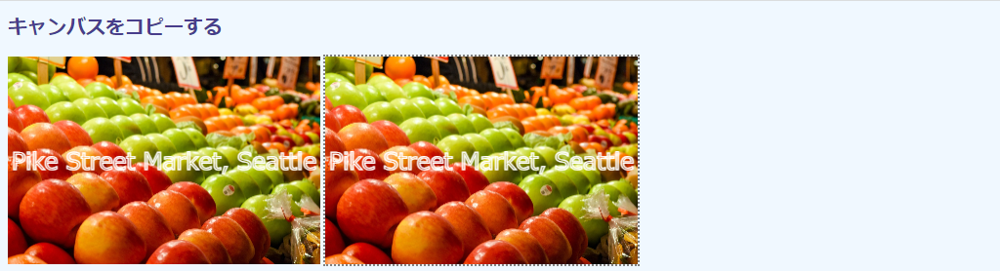
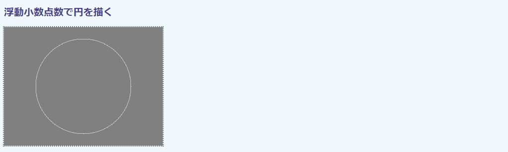
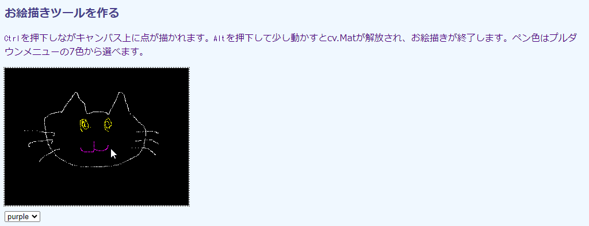
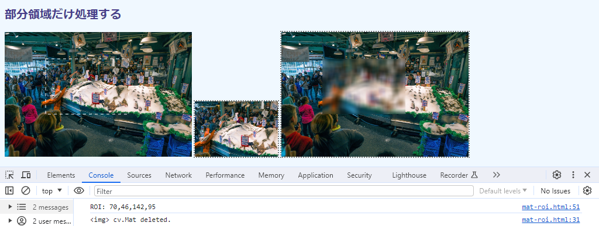

## 第4章 画像の構造

本章では、OpenCV.jsのピクセルの構成とそれらのデータ型など、画像の構造に関連したトピックと利用例を取り上げます。

OpenCV.jsでピクセルを収容するデータオブジェクトは`cv.Mat`です。描画コンテクストの`ImageData`オブジェクトと同じようなもので、サイズやデータ配列がプロパティとして収容されています。おおきな違いは行列（matrix）として表現されているため、横幅×高さではなく、行（高さ）×列（横幅）と、順序が入れ変わっているところです。ピクセル値を0～255の8ビット符号なし整数値以外でも表現できるので、精度を必要とする画像処理にも対処できます。HSVやYCrCbなどRGBA以外の色空間も利用できます（これは次章で取り上げます）。

<!-- cv の図形描画関数は本章では使わない。必要があれば、のちの章でそれぞれ個別に説明する。ここでは、cv.circle() を閑話に使った -->
<!-- トピックは OpenCV.js Tutorials の Core Operations にある3節のものを、できるだけカバーした。説明していないのは、`mat.clone()`, `cv.MatVector`, `cv.UcharAt()`, `cv.Mat.zeros()`, `cv.Mat.ones()`, `cv.Mat.eyes()`, `mat.add()`, `mat.subtract()`, `cv.bitwise_and`。最初の2つは、それぞれの章で取り上げる。残りは、取り上げない。-->

### 4.1 画像の構造を調べる

#### 目的

``に取り込んだ画像をOpenCV.jsに取り込み、そのまま`<canvas>`に貼り付けます。

技術的には、OpenCV.jsの画像格納オブジェクトである`cv.Mat`とそのプロパティの説明です。`HTMLImageElement`から`cv.Mat`へのコピーには`cv.imread()`関数を、`cv.Mat`から`<canvas>`へコピーするには`cv.inshow()`関数を用います。本節のコードはコピー以外では画像メタデータをコンソールに表示するだけですが、この処理が次に再掲する[1.1節](./01-html5.md#11-画像処理の流れ "INTERNAL")の画像処理手順の②に相当します。


実行例を次の画面に示します。


左側がHTML5で``に読み込んだもの、右側がOpenCV.jsの機能でコピーした`<canvas>`です。無処理でコピーしているので、左右は同じです。

コンソール出力の最初のものは``のサイズを示しています。`HTMLVidelElement.width`と`height`が画面上の実寸を、`HTMLVideoElement.naturalWidth`と`naturalHeight`がもともとの寸法をそれぞれ示しているのは、[第1章](./01-html5.md "INTERNAL")で説明した通りです。ここでまた取り上げているのは、この違いが重要だからです。

コンソール出力の2番目のものは、OpenCV.jsに取り込んだあとの`cv.Mat`メタデータです。3番目は、画像のアルファチャネルの値です。これらの値はあとから説明します。

#### コード

コード`mat-metadata.html`を次に示します。

```html
[File] mat-metadata.html
  1  <!DOCTYPE html>
  2  <html lang="ja-JP">
  3  <head>
  4    <meta charset="UTF-8">
  5    <link rel=stylesheet type="text/css" href="style.css">
  6    <script async src="libs/opencv.js"></script>
  7  </head>
  8  <body>
  9
 10  <h1>画像の構造を調べる</h1>
 11
 12  <div>
 13    
 14    <canvas id="canvasTag" class="placeholder"></canvas>
 15  </div>
 16
 17  <script>
 18    let imgElem = document.getElementById('imageTag');
 19
 20    function imgProc() {
 21      let mat = cv.imread(imgElem);
 22      cv.imshow('canvasTag', mat);
 23
 24      console.log(`Image metadata:
 25        width×height: ${imgElem.width}x${imgElem.height}
 26        naturalWidth×Height: ${imgElem.naturalWidth}x${imgElem.naturalHeight}`
 27      );
 28
 29      console.log(`Mat metadata:
 30        rows×cols: ${mat.rows}×${mat.cols}
 31        size: ${mat.size().width}×${mat.size().height}
 32        total: ${mat.total()}
 33        #channels: ${mat.channels()}
 34        depth: ${mat.depth()}            // cv.CV_8U = 0
 35        type: ${mat.type()}              // cv.CV_8UC4 = 24
 36        #data: ${mat.data.length}`
 37      );
 38
 39      let matVector = new cv.MatVector();
 40      cv.split(mat, matVector);
 41      console.log('data: ', new Set(matVector.get(3).data));
 42
 43      mat.delete();
 44      matVector.delete();
 45    }
 46
 47    var Module = {
 48      onRuntimeInitialized: imgProc
 49    }
 50  </script>
 51
 52  </body>
 53  </html>
```

#### 画像を読み込む－cv.imread

``上の画像をOpenCVで扱うには、`cv.imread()`関数から`cv.Mat`オブジェクトに読み込みます（21行目）。

```javascript
 21      let mat = cv.imread(imgElem);
```

関数定義を次に示します。

<!-- FunctionDefinition cv.imread() `HTMLImageElement`上の画像を`cv.Mat`に取り込む。 -->
```Javascript
cv.Mat = cv.imread(                         // cv.Matを返す
    HTMLImageElement img                    // 入力元のオブジェクト
);
```

関数は`cv.Mat`オブジェクトを返します。第1引数`img`には対象の`HTMLImageElement`オブジェクト（18行目）を指定します。

> リファレンスに掲載されているC++/Python版にはオプションの第2引数がありますが、OpenCV.js版では指定しても無視されます。また、`cv.IMREAD_GRAYSCALE`などの読み込みモード定数は定義されていません。

`cv.imread()`は``に描かれている画像の寸法そのままをコピーします。実行例の最初のコンソール出力に示したように、読み込んだ画像の表示上のサイズは320×2377で、もともとの寸法は1280×949です（`narutralWidth`×`naturalHeight`）。21行目の`cv.Mat`のサイズは描かれている側のものです。

この点、もともとの画像を扱える描画コンテクスト`CanvasRenderingContext2D`の`drawImage()`と異なります。したがって、縮小表示された画像をもとの原寸大に戻すと、画質が劣化します。もともとのサイズが必要なら、そのように``に貼り付けなければなりません。表示は縮小したいが、データとしてはオリジナルが必要という場合は、後者はCSSで不可視にしておくとよいでしょう（この手は[6.6節](./06-img.md#66-書類の傾きを補正する "INTERNAL")で使います）。

#### 画像を表示する－cv.imshow

`cv.Mat`オブジェクトは、`cv.imshow()`関数で`<canvas>`には貼り付けられます（22行目）。

```javascript
 22      cv.imshow('canvasTag', mat);
```

関数定義を次に示します。

<!-- FunctionDefinition cv.imshow() 第2引数の`cv.Mat`を第1引数の`<canvas>`に貼り付ける。 -->
```Javascript
cv.imshow(                                  // 戻り値なし
    string id,                              // <canvas>のid
    cv.Mat mat                              // 画像を収容したcv.Matオブジェクト
);
```

関数に戻り値はありません。第1引数`id`には、ターゲットのキャンバスの`id`属性値を指定します。`HTMLCanvasElement`オブジェクトではないので注意してください。第2引数`mat`には張り付ける`cv.Mat`を指定します。

#### cv.Matのプロパティと関数

`cv.Mat`には画像の情報を収容したプロパティ、あるいはそれらを取り出す関数がいくつかあり、29～37行目ではその中でも代表的なものをコンソールに出力しています。次に実行例で示したものを表にまとめて示します。関数から取得するものは、名称末尾に`()`が付いています。どれも、引数はありません。

<!-- mat.dims は実装されていない模様 -->
プロパティ／関数 | 戻り値の型 | 実行画面での値 | 内容
---|---|---|---
`rows` | `number` | 237 | 行数（水北方向のピクセル数）
`cols` | `number` | 320 | 列数（水平方向のピクセル数）
`size()` | `cv.Size` | {width: 320, height: 237} | 画像サイズを収容したオブジェクト
`total()` | `number` | 75840 | 全ピクセル数（320×237）
`channels()` | `number` | 4 | チャネル数
`depth()` | `number` | 0 | `cv.Mat`1要素あたりのビット数を示す定数
`type()` | `number` | 24 | ピクセルのデータ型を示す定数
`data` | `TypedArray` | -- | 全ピクセルデータを収容した型付き配列で、その総数（`length`）は`cols * rows * channels()`

#### cv.Matの縦横の順番

`cv.Mat`は、画像サイズを示すのに`rows`（行）と`cols`（列）という用語を用います（30行目）。2次元に広がるデータの集まりを（数学の）行列として表現しているからです。そして、その名が示す通り、行と列の値を列挙するときは行、列の順です。実行例で237×320と表示しているのは、それに準じているからです。

これには注意が必要です。画像のサイズおよびその中のピクセル位置は、一般的には(横, 縦)で指定しますが、行列である`cv.Mat`では逆に(縦, 横)の順になるからです。次の図に`cv.Mat`の構造を示します。

<!-- 532x547 Excel に元画像あり -->


図の升目がピクセルを表しています。中の括弧の数値はその座標値で、図中で網掛けされたピクセル位置の(1, 0)は上から「2行目の左端」です。

この縦横の転置は、`cv.Mat`に固有のものです。OpenCV.jsの関数でピクセル位置を指定するときは、たいてい普通の画像のように(x, y)の順で記述します。紛らわしいので、気を付けてください。

`cv.Mat.size()`関数は、画像サイズを表の3列目に示したようにオブジェクトの形で返します（31行目）。キーは`width`と`height`なので、`size().width`や`size().height`から横縦の寸法が得られます。`cols`と`rows`と同じ情報なのに別の方法が提供されているのは、このオブジェクトを表現する`cv.Size`というオブジェクトが、矩形のサイズを指定するときによく使われるからです。このオブジェクトについては、のちほど[4.4節](#44-モノクロで円を描く "INTERNAL")で説明します。

`cv.Mat.total()`関数は画像の総ピクセル数を返します（32行目）。つまり、`cols * rows`あるいは`size().width * size().height`です。これもよく計算する値なので、利便性を考慮して用意されています。

#### チャネル数

`cv.Mat.channels()`関数はチャネル数を返します（33行目）。

カラー画像は、次の図に示すように赤や緑などの単色で染められた半透明シートを複数枚重ねる（混色する）ことで構成されます。これら1枚1枚のシートのことを「チャネル」と呼びます。そして、シートの枚数をチャネル数といいます。透明度を示すアルファも1枚のシートを構成するので、RGBAは4枚構成、つまり4チャネルです。

<!-- 379x222 ODG に原画あり -->


<!--  HTML5では 0～255 なら Uint8ClampedArray が使われる -->
画像中の1点を表現するピクセルは、チャネルの数ぶんの値で構成されます。上図では赤153、緑43、青102、アルファ255を混色することで、完全不透明な紫を生成しています。ピクセル値は[153, 43, 102, 255]のように配列として表現されます。OpenCVでは、これを`cv.Scalar()`というオブジェクトで表現します（[4.4節](#44-モノクロで円を描く "INTERNAL")で説明）。

値の解釈は色空間によって異なります。一般的に使用される8ビット符号なし整数のRGBでは色の強度（明るさ）を示しており、0が最も暗く、255が最も明るくなります。アルファチャネルでは、0が完全透明、255が完全不透明と解釈されます。アルファチャネルはしばしば透明度と呼ばれますが、値が大きくなるにつれて不透明になっていくので、正確には不透明度（opacity）と呼ばれます。HSVなどその他の色空間は[第5章](./05-colors.md "INTERNAL")で扱います。

モノクロ画像は色味がないのでチャネル数は1です。通常のカラーはRGBの3色構成なので3です。`cv.Mat`はこうした多様なチャネル数をすべて表現できます。

コンソール出力でチャネル数が4を示すことからわかるように、HTML5の画像形式は4チャネルのRGBAです。モノクロにしか見えない画像でも、チャネル数は4です。透過情報のない3チャネルRGB画像を読み込んだときでも、最大値255（完全不透明）のアルファ値が自動的に補完されます。

#### ビット深度

`cv.Mat.depth()`関数は、ピクセル値の基本型を示す定数値を返します。たとえば、ピクセル値が8ビット符号なし整数（unsigned char）で表現されていれば、そのタイプを示す定数値は0で、その値には`cv.CV_8U`という定数名が割り当てられています。これをビット深度といいます。

ビット深度はJavaScriptの`TypedArray`の型に対応しています。たとえば、`cv.CV_8U`で構成された`cv.Mat`のデータは`Uint8Array`で読み書することができます。

次の表に本書で用いるビット深度定数を示します。

ビット深度定数名 | 値 | 配列データ型 | 値の範囲 | 意味 
---|---|---|---|---
`cv.CV_8U` | 0 | `Uint8Array` | 0～255 | 8ビット符号なし整数
`cv.CV_16U` | 2 | `Uint16Array` | 0～65535 | 16ビット符号なし整数
`cv.CV_32S` | 4 | `Int32Array` | -2147483648～2147483647 | 32ビット符号あり整数
`cv.CV_32F` | 5 | `Flaot32Array` | 10<sup>-38</sup>～10<sup>38</sup> | 32ビット浮動小数点数

`cv._CV`に続く数値がその基本型のビット数（8、16、32、64）を、続く1文字が形式を示します。Uが符号なし（unsigned）、Sが符号あり（signed）、Fが浮動小数点数（floating）です。

この他のビット深度についてはリファレンス、あるいは[3.5節](./03-opencv.md#35-OpenCVjsの定数を調べる "INERNAL")で作成した定数チェッカーを参照してください。

#### データ型

チャネル数とビット深度を組み合わせたものをデータ型と呼び、`cv.Mat`の構成を示します。たとえば、ピクセルが4チャネル（RGBAなど）8ビット符号なし整数で表現されていれば、そのタイプを示す定数値は24で、その値には`cv.CV_8UC4`という定数名が割り当てられています。

`cv.Mat.type()`関数はこのデータ型を定数値で返します。

定数名は前述のビット深度に文字C（チャネルのC）とチャネル数を加えた格好になっています。`cv.CV_8UC4`はしたがって「4チャネル8ビット符号なし整数」と読めます。

実行例で示したように、`cv.Mat.type()`関数は整数値を返します。

次の表に本書で用いるデータ型定数名とその値を示します。

定数名 | 値 | 意味
---|---|---
`cv.CV_8UC1` | 0 | 1チャネル8ビット符号なし整数
`cv.CV_8UC3` | 16 | 3チャネル8ビット符号なし整数
`cv.CV_8UC4` | 24 | 4チャネル8ビット符号なし整数
`cv.CV_32SC2` | 12 | 2チャネル32ビット符号あり整数
`cv.CV_32SC4` | 28 | 4チャネル32ビット符号あり整数
`cv.CV_32FC1` | 5 | 1チャネル32ビット浮動小数点数
`cv.CV_32FC2` | 13 | 2チャネル32ビット浮動小数点数
`cv.CV_32FC3` | 21 | 3チャネル32ビット浮動小数点数
`cv.CV_32FC4` | 29 | 3チャネル32ビット浮動小数点数
`cv.CV_64FC1` | 6 | 1チャネル64ビット浮動小数点数

`C1`で終わる1チャネル画像は、主としてモノクロ画像を収容するときに用いられます。`C3`は3チャネル、つまりカラー用です。`C4`はアルファチャネル付きカラーです。

画像には、一般的に8ビット符号なし（`cv.CV_8U`）が用いられます。しかし、ピクセル値に対する演算によっては、最大数の255を超える、あるいは最小値の0を下回る値が出てくることもあります。そうしたときの対処に8ビットより大きなデータ型が用いられます。たとえば、`cv.CV_32SC4`がそうした目的に用いられます。演算によって浮動小数点数が出てくることもあり、そうしたときには整数演算の丸め誤差を防ぐために`cv.CV_32FC4`などが用いられます。

`cv.Mat`は行列なので2次元に広がる、あるいはそれらが積み重なった3次元のデータならば、画像以外のものを収容するのに用いられます。たとえば、2チャネル32ビット浮動小数点数型の`cv.CV_32FC2`は、画像座標系の点(x, y)に位置するベクトル（dx, dy)
の値を収容するのに使われます（[7.6節](./07-video.md#76-動きの方向を検出する "INTERNAL")で使います）。画像圧縮（フーリエ変換）では複素数が出てきますが、実部と虚部をそれぞれ収容するのにも使われます。

数値から定数名を知るには、リファレンスを参照するか、[3.5節](./03-opencv.md#35-OpenCVjsの定数を調べる "INTERNAL")で作成した定数チェッカーを用います。コードからというのなら、こういう手もあります（コンソールから実行。末尾の24が検索したい定数）。

```javascript
> Object.entries(cv).filter(c => c[0].startsWith('CV_') && c[1] == 24)[0][0]
< 'CV_8UC4'
```

#### データ

`cv.Mat.data`プロパティは`Uint8Array`の配列で、ピクセルデータをフラットなバイト列として収容しています。

1チャネル8ビット符号なし整数（`cv.CV_8UC1`）ならピクセル1つが1つの要素として、上端の1ラインのピクセル値が順に各要素に収容されます。行が改まれば、左端に戻ってそのまま続けます。`cv.Mat.data`の大きさ（`cv.Mat.data.length`）は行数×列数です（`cv.Mat.cols * cv.Mat.rows`）。

3チャネル8ビット符号なし整数（`cv.CV_8UC3`）なら、（RGBでは）左上のピクセル値がR、G、Bの順に収容され、その隣がまたR、G、Bのように順に収容されていきます。`cv.Mat.data`の大きさは行数×列数×チャネル数です（`cv.Mat.cols * cv.Mat.rows * cv.Mat.channels()`）。

浮動小数点数のように1つの値に複数のバイトが必要な基本型なら、そのぶんだけ要素を占有します。たとえば、1チャネル32ビット浮動小数点数の`cv.CV_32FC1`での左上のピクセル値は、`cv.Mat.data[0]`から`cv.Mat.data[3]`までの要素を占有します。

このように、データ型に応じて読み方を変えなければならないのはなかなか面倒です。そこで、それぞれのビット深度にあわせた`TypedArray`のプロパティが次の表に示すように用意されています。

プロパティ | OpenCVビット深度 | `TypedArray`型 | 意味
---|---|---|---
`data` | `cv.CV_8U` | `Uint8Array` | `data`を8ビット符号なし整数として読む
`data16U` | `cv.CV_16U` | `Uint16Array` | `data`を16ビット符号なし整数として読む
`data32S` | `cv.CV_32S` | `Int32Array` | `data`を32ビット符号あり整数として読む
`data32F` | `cv.CV_32F` | `Float32Array` | `data`を32ビット浮動小数点数として読む

#### HTML5によるアルファチャネルの補完

チャネル数のところで、読み込んだ画像が3チャネルであっても、HTML5は4チャネルになるように補完すると述べました。39～41行目はどんなデータが補完されたかを確認するものです。

```javascript
 39      let matVector = new cv.MatVector();
 40      cv.split(mat, matVector);
 41      console.log('data: ', new Set(matVector.get(3).data));
```

複数チャネルの画像はモノクロチャネル画像の重ね合わせなので、それぞれを分離できます。それを行っているのが39～40行目です。[5.4節](./05-colors.md#54-RGB画像を色成分に分解する "INTERNAL")で説明するので、ここはチャネルを分離して、（0からカウントして）3枚目のアルファチャネルだけを抜き出している（41行目の`get(3)`）とだけ思ってください。

もともとのデータ型は`cv.8UC4`なので、取り出したアルファチャネルは`cv.CV_8UC1`です。1ピクセル1バイトなので、`data`を`Uint8Array`としてそのまま読み取れます。41行目ではデータを集合型の`Set`に変換しています。これで、重複するデータが省かれます。

出力結果をみると255とだけあります。これは、このアルファチャネルには320×267個の要素があっても、すべてが255にセットされているということを示しています。ここから、HTML5はRGB画像に完全不透明なアルファチャネルを加えて``に表示することがわかります。

#### OpenCV.jsリソースの解放

`cv.Mat`および`cv.MatVector`は、利用後`delete()`で明示的に解放しなければなりません（43～44行目）。

```javascript
 43      mat.delete();
 44      matVector.delete();
```

これらOpenCV.jsリソースは内部に収容されているので、JavaScriptのガベージコレクタでは廃棄されません。解放しなければ、タブあるいはブラウザそのものを閉じるまでメモリを占有します。

ビデオ処理のようにループを形成しているときは、気付かないうちに`cv.Mat`をどんどん生成してしまうことがあります。それらは累積されていき、次第にシステムメモリを圧迫していきます。ブラウザあるいはコンピュータそのものの動作が鈍くなったら、こうしたメモリーリークを疑ってください。

`cv.imshow()`で表示、つまり画像データがキャンバスに引き渡されたあとなら、`cv.Mat`は必要ありません。


### 4.2 キャンバスをコピーする

#### 目的

`<canvas>`を`cv.Mat`にコピーします。つまり、前節の逆です。

この操作は、描画コンテクストで画像を操作したのちに、その画像データを`cv.Mat`に渡したいときに必要になります。ここでは、描画コンテクスを介して文字列を書き込みます。

技術的には、キャンバスからデータを取得する描画コンテクストの`CanvasRenderingContext2D.getImageData()`関数と、そこから`cv.Mat`を生成する`cv.matFromImageData()`を説明します。

実行画面を次に示します。



画像を読み込む``は、CSSスタイルの`display: none;`で非表示にしています。左が1枚目のキャンバスで、上に文字列を描いた``の画像が表示されます。右が2枚目のキャンバスで、左のキャンバスからコピーした文字列入り画像をそのまま`cv.Mat`に読み込んで、`cv.imshow()`で表示しています。

#### コード

コード`mat-canvas.html`を次に示します。

```html
[File] mat-canvas.html
  1  <!DOCTYPE html>
  2  <html lang="ja-JP">
  3  <head>
  4    <meta charset="UTF-8">
  5    <link rel=stylesheet type="text/css" href="style.css">
  6    <script async src="libs/opencv.js"></script>
  7  </head>
  8  <body>
  9
 10  <h1>キャンバスをコピーする</h1>
 11
 12  <div>
 13    
 14    <canvas id="canvasTag1"></canvas>
 15    <canvas id="canvasTag2" class="placeholder"></canvas>
 16  </div>
 17
 18  <script>
 19    let imgElem = document.getElementById('imageTag');
 20    let canvasElem1 = document.getElementById('canvasTag1');
 21    let ctx1 = canvasElem1.getContext('2d');
 22
 23    function makeCanvas() {
 24      imgElem.style.display = 'none';
 25      let aspect = imgElem.naturalHeight / imgElem.naturalWidth;
 26      imgElem.height = Math.floor(imgElem.width * aspect);
 27      canvasElem1.width = imgElem.width;
 28      canvasElem1.height = imgElem.height;
 29
 30      ctx1.drawImage(imgElem, 0, 0, imgElem.width, imgElem.height);
 31      ctx1.font = '24px sans-serif';
 32      ctx1.strokeStyle = 'white';
 33      ctx1.textBaseline = 'middle';
 34      ctx1.textAlign = 'center';
 35      ctx1.strokeText('Pike Street Market, Seattle',
 36        canvasElem1.width/2, canvasElem1.height/2);
 37    }
 38
 39    function imgProc() {
 40      let imgData = ctx1.getImageData(
 41        0, 0, canvasElem1.width, canvasElem1.height);
 42      let mat = cv.matFromImageData(imgData);
 43      cv.imshow('canvasTag2', mat);
 44      mat.delete();
 45    }
 46
 47    window.addEventListener('load', makeCanvas);
 48    var Module = {
 49      onRuntimeInitialized: imgProc
 50    }
 51  </script>
 52
 53  </body>
 54  </html>
```

``はスクリプトから非表示にしています（24行目）。

```javascript
 13    
 ︙
 19    let imgElem = document.getElementById('imageTag');
 ︙
 24      imgElem.style.display = 'none';
 25      let aspect = imgElem.naturalHeight / imgElem.naturalWidth;
 26      imgElem.height = Math.floor(imgElem.width * aspect);
```

``で`width`属性は指定していても、`height`は未指定なところが注意点です（13行目）。これまで、高さは元画像のアスペクト比に応じて自動的に調節してくれましたが、非表示なので、ここでは0のままです。これでは、不用意に`HTMLImageElement.height`をキャンバスに代入すると、不可視になってします。そこで、もともとの画像のサイズからアスペクト比を計算し（25行目）、画像の高さを設定しています（26行目）。

左のキャンバスでは、描画コンテクストを用いて文字列を描画しているだけです（31～37行目）。キャンバス中央に置きたいので、文字列のベースライン（33行目）と左右位置のアラインメント（34行目）をどちらも中央にし、配置位置をキャンバス中央にしているのが、スクリプティング上のポイントです。

```javascript
 33      ctx1.textBaseline = 'middle';
 34      ctx1.textAlign = 'center';
 35      ctx1.strokeText('Pike Street Market, Seattle',
 36        canvasElem1.width/2, canvasElem1.height/2);
```

#### キャンバスの画像を読む－cv.matFromImageData

OpenCV.jsが準備できたら（48～50行目）、描画コンテクストの関数`CanvasRenderingContext2D.getImageData()`を用いてキャンバスから画像を読み込みます（40～41行目）。

```javascript
 40      let imgData = ctx1.getImageData(
 41        0, 0, canvasElem1.width, canvasElem1.height);
```

引数は`CanvasRenderingContext2D.drawImage()`と同じように、コピー元の座標値(x, y)とそのサイズ（width, height)の4点です。この処理で`ImageData`オブジェクトが得られます（40行目の`imgData`)。

#### ImageDataをcv.Matに変換する－cv.matFromImageData

得られた`ImageData`はOpenCVで利用できるよう、`cv.matFromImageData()`で`cv.Mat`に変換します（42行目）。

```javascript
 42      let mat = cv.matFromImageData(imgData);
 43      cv.imshow('canvasTag2', mat);
```

関数定義を次に示します。

<!-- FunctionDefinition cv.matFromImageData() `ImageData`オブジェクトを`cv.Mat`に取り込む。 -->
```Javascript
cv.Mat = cv.matFromImageData(               // cv.Matを返す
    ImageData imgData                       // 入力元のオブジェクト
);
```

関数は`cv.Mat`を返します。第1引数`imgData`には`ImageData`オブジェクトを指定します。ここでは、得られた`cv.Mat`を無加工なまま`cv.imshow()`から２つめのキャンバスに表示しています（43行目）。

使用済みの`cv.Mat`を明示的に解放するのを忘れないでください（44行目）。

```javascript
 44      mat.delete();
```


### 4.3 ピクセルの色名を判定する
<!-- 同じことは ImageData.data からでもできる -->

#### 目的

画像上の点をクリックすることで、そのピクセル値と最も近い色名を画像上に示します。

技術的には、`cv.Mat`のプロパティで、画像のバイナリデータを収容している`data`プロパティからピクセル値を読み取る方法を示します。`TypedArray`なので`[]`を介して値を取ってこれますが、ここではRGBAの値をまとめて取得する`cv.Mat.ucharPtr()`関数を使います。この関数を操るには、`cv.Mat`がどのようにしてバイナリデータを管理しているかを知らなければならないので、それもここで説明します。

R、G、Bの3つの数値からなるピクセル色には名前はありません。そこで、色名を解決するために外部ライブラリの`ntc.js`を利用します。画像上に色名を表示するのには、[2.4節](./02-ui.md#24-日本語文字を画像に重畳する "INTERNAL")で作成した`Overlay.js`ライブラリを使います。

実行画面を次に示します。


クリックした点とその色がわかりやすいよう、画像には緑から青へと垂直に変化していくグラデーションを用意しました。サイズは256×256です。上端の横1ラインは(0, 255, 0)の緑で、下端は(0, 0, 255)の青です。下がるにつれ、(0, 254, 1)のように緑の値が1つずつ減り、反対に青の値が1つずつ増えます。行（縦）位置がcなら（0, 255-c, c)です。

画面には、選択した点に座標値(x, y)とそのピクセル値に最も近い色名を重畳します。この画面では位置は(74, 146)で、色は(0, 109, 146)です。これに最も近い色名はバハマブルーです（ニュージーランドのペイント製造会社のReseneの色名です）。

画像からの選択色で全面を塗りつぶした四角と、近い色名をもとに塗りつぶした四角を参照のために用意しました。どちらも100×100の`<canvas>`で、塗りつぶしには描画コンテクストの`fillRect()`関数を用いています。右のキャンバスの色は「近い色名」のものなので、中央のものとは異なります。一般人の目には区別がつきませんが、デザインの玄人さんならわかるかもしれません。

コンソールにはピクセルの値、その色名を示します。括弧に示すのはそれらの16進表記で、数値から違いがわかるようになっています。

#### コード

コード`mat-pixel.html`を次に示します。

```html
[File] mat-pixel.html
  1  <!DOCTYPE html>
  2  <html lang="ja-JP">
  3  <head>
  4    <meta charset="UTF-8">
  5    <link rel=stylesheet type="text/css" href="style.css">
  6    <script async src="libs/overlay.js"></script>
  7    <script async src="libs/opencv.js"></script>
  8    <script async src="https://chir.ag/projects/ntc/ntc.js"></script>
  9  </head>
 10  <body>
 11
 12  <h1>ピクセルの色名を判定する</h1>
 13
 14  <p>左マウスクリックでピクセルの色名が表示されます。<kbd>Alt</kbd>+左マウスでMatを解放します。</p>
 15
 16  <div id="divTag">
 17    
 18    元 <canvas id="canvasTag1" class="placeholder"></canvas>
 19    色名 <canvas id="canvasTag2" class="placeholder"></canvas>
 20  </div>
 21
 22  <script>
 23    let imgElem = document.getElementById('imageTag');
 24    let canvasElem1 = document.getElementById('canvasTag1');
 25    canvasElem1.width = canvasElem1.height = 100;
 26    let ctx1 = canvasElem1.getContext('2d');
 27    let canvasElem2 = document.getElementById('canvasTag2');
 28    canvasElem2.width = canvasElem2.height = 100;
 29    let ctx2 = canvasElem2.getContext('2d');
 30
 31    let mat = undefined;
 32    let layer = undefined;
 33
 34    function getPixel(evt) {
 35      if (! mat || ! layer)
 36        return;
 37
 38      if (evt.altKey === true) {
 39        mat.delete();
 40        mat = undefined;
 41        console.log('Mat released');
 42        return;
 43      }
 44
 45      let c = evt.offsetX;
 46      let r = evt.offsetY;
 47      let pixel = [... mat.ucharPtr(r, c)].slice(0, -1);
 48      let hexValue = '#' + pixel.map(
 49        p => p.toString(16).padStart(2, 0)).join('');
 50      let match = ntc.name(hexValue);
 51      let matchName = match[1];
 52      let matchHex = match[0];
 53      console.log(`${pixel} ${matchName} ... (${hexValue} => ${matchHex})`);
 54      layer.changeText(`(${c}, ${r}) ${matchName}`, fontSize=-1, x=c, y=r);
 55
 56      ctx1.fillStyle = `rgb(${pixel.join(',')})`;
 57      ctx1.fillRect(0, 0, canvasElem1.width, canvasElem1.height);
 58      ctx2.fillStyle = hexValue;
 59      ctx2.fillRect(0, 0, canvasElem2.width, canvasElem2.height);
 60    }
 61
 62    function resourceReady() {
 63      layer = new Overlay('divTag', text='Select', x=40, y=40, fontSize=12);
 64      imgElem.addEventListener('mousedown', getPixel);
 65    }
 66
 67    function opencvReady() {
 68      mat = cv.imread(imgElem);
 69    }
 70
 71    window.addEventListener('load', resourceReady);
 72    var Module = {
 73      onRuntimeInitialized: opencvReady
 74    }
 75  </script>
 76
 77  </body>
 78  </html>
```

画面は、``1つと`<canvas>`2つの構成です。`<canvas>`サイズはプロパティへの代入で設定していますが（25、28行目）、長い1行を紙面端で折り返すのを避けるためで、コーディング的に意味があるわけではありません。

#### 色名の決定

与えられたRGB値からの色名決定には、Chirag Mehtaという方が作られた`ntc.js`を用いています。URLを次に示します。

```https://chir.ag/projects/ntc/```

色名は、いろいろなソースからのものを取り混ぜ、現時点では1566色が定義されています（HTML5/CSSで定義されている色名は148色）。アルゴリズムは、与えられた値と名前の値の3次元空間上の距離が最小のものを全探索しているようです（RGBとHSLを併用している）。色の類似度（距離）の計算方法は次に示す記事で説明されています。

```https://ja.wikipedia.org/wiki/色差```

利用するには、`<script>`からJavaScriptファイルを読み込みます（8行目）。事前にダウンロードしてローカルから読み込んでもかまいません。サイズは45 kB程度です。

```html
  8    <script async src="https://chir.ag/projects/ntc/ntc.js"></script>
```

色の値から名前を得ているのが、48～52行目です。

```javascript
 48      let hexValue = '#' + pixel.map(
 49        p => p.toString(16).padStart(2, 0)).join('');
 50      let match = ntc.name(hexValue);
 51      let matchName = match[1];
 52      let matchHex = match[0];
```

`ntc.name()`という関数に色の値を`#rrggbb`の16進数文字列表記で指定すれば、色情報の入った配列が返ってきます（50行目）。色の値を収容した変数`pixel`（後述）は`[r, g, b]`形式の配列なので、48～49行目でこれを16進数文字列に起こています。たとえば、`[0, 163, 92]`は#00A35Cになります。

戻り値の配列には次の3つの要素が含まれています。

- 0番目 ... もっとも近い色の値（16進数文字列表記）。
- 1番目 ... その色名（文字列）。
- 2番目 ... 入力と結果の値が完全一致しているときは`true`。

ここでは0番目（52行目）と1番目（51行目）を利用しています。

#### 準備完了の検出

複数のリソース（スクリプトと画像）とOpenCV.jsのすべての準備が整わなければ、ピクセル操作はできません。

まず、複数リソースの読み込み完了を検出します。完了すれば`window`に`load`イベントが発生します。このときの処理を担当しているのが、`resourceReady()`関数です（62～65行目）。

```javascript
 32    let layer = undefined;
 ︙
 62    function resourceReady() {
 63      layer = new Overlay('divTag', text='Select', x=40, y=40, fontSize=12);
 64      imgElem.addEventListener('mousedown', getPixel);
 65    }
 ︙ 
 71    window.addEventListener('load', resourceReady);
```

[2.4節](./02-ui.md#24-日本語文字を画像に重畳する "INTERNAL")で作成した`Overlay`クラスをインスタンス化します（63行目）。これで、32行目で`undefined`だった変数`layer`にオブジェクト収容されます。また、マウス操作イベントもここで登録します（64行目）。

OpenCV.jsの準備完了の検出にはいつもの`Module.onRuntimeInitialized`を使います。処理関数は`opencvReady()`（67～69行目）です。

```javascript
 31    let mat = undefined;
 ︙
 67    function opencvReady() {
 68      mat = cv.imread(imgElem);
 69    }
 ︙
 72    var Module = {
 73      onRuntimeInitialized: opencvReady
 74    }
```

68行目で`cv.Mat`に画像を読み込んでいるだけですが、これで31行目の`mat`が`undefined`でなくなります。

これら2つの変数はフラグにもなっていています。ピクセル処理関数は、どちらにも値がセットされていなければ処理を勧めないようになっています（35～36行目）。

```javascript
 34    function getPixel(evt) {
 35      if (! mat || ! layer)
 36        return;
```

非同期的に発生するイベントをあえて順番に行う、あるいはすべてのイベントが揃ってから処理を始めるといったスケジューリングには`Promise`を使うことが多いのですが、本書ではこのフラグ方式で対処します。`Promise`を用いた方法は[付録B](./B-promise.md "INTERNAL")で説明したので、参考にしてください。

#### ピクセル値の読み込み

68行目で読み込んだ画像のデータ型は`cv.CV_8UC4`です。8ビット符号なし整数なので、`Uint8Array`型の`cv.Mat.data`からそれぞれのチャネルの値（0～255）を読み取れます。

画像のピクセルは[4.1節](#41-画像の構造を調べる "INTERNAL")の図で示したように、縦横の格子状（2次元）に並んでいます。配列は1次元なので、ピクセル値は横方向1列を順次連結して収容されます。チャネル数が1のモノクロ画像（`cv.CV_8UC1`）のときは単純にその値が並ぶだけですが、`cv.CV_8UC3`（RGB）や`cv.CV_8UC4`（RGBA）のようにチャネル数が3つや4つのときは、値はRGBあるいはRGBAの順に並べられます。この様子を次の模式図に示します（図中nは画像のピクセル数）。

<!-- 803x287 ODG ファイルに原画あり -->


サイズが(cols, rows)、チャネル数がcのとき、位置(col, row)にあるピクセルのR、G、B、Aのそれぞれの値の次の要領で取得できます。

```
r = cv.Mat.data[ (row * cols * c) + (col * c) + 0 ]
g = cv.Mat.data[ (row * cols * c) + (col * c) + 1 ]
b = cv.Mat.data[ (row * cols * c) + (col * c) + 2 ]
a = cv.Mat.data[ (row * cols * c) + (col * c) + 3 ]
```

ただ、この計算は面倒です。そういうときは、`cv.Mat.ucharPtr()`関数を使います。関数の書式を次に示します。

<!-- FunctionDefinition cv.Mat.ucharPtr() `cv.Mat.data`の指定の位置からのピクセル値を`Uint8Array`で返す。 -->
```Javascript
Uint8Array = cv.Mat.ucharPtr(               // cv.Matを返す
    number row,                             // ピクセルの行位置（y）
    number col                              // ピクセルの列位置（x）
);
```

関数は（4チャネルRGBAデータなら）[r, g, b, a]のように並んだ`Uint8Array`を返します。第1引数`row`には行位置（垂直方向）、第2引数`col`には列位置（水平方向）を指定します。行、列の順番なところに注意してください。

この関数には、ビット深度に応じていろいろなバリエーションがあります。たとえば、`cv.Mat`が`cv.CV_32F`（32ビット浮動小数点数）なら、`cv.Mat.floatPtr()`を使います。戻り値はこのとき`Float32Array`で、収容された要素の数はチャネル数と一致します。次の表にこれらを示します。

ビット深度 | `TypedArray` | 関数 | 用例
---|---|---|---
`CV_8U` | `Uint8Array` | `cv.Mat.ucharPtr()` | 本節
`CV_8S` | `Int8Array` | `cv.Mat.charPtr()` | 
`CV_16U` | `Uint16Array` | `cv.Mat.ushortPtr()` |
`CV_16S` | `Int16Array` | `cv.Mat.shortPtr()` |
`CV_32S` | `Int32Array` | `cv.Mat.intPtr()` | [6.6節](./06-img.md#66-書類の傾きを補正する "INTERNAL")
`CV_32F` | `Float32Array` | `cv.Mat.floatPtr()` | [6.4節](./06-img.md#64-QRコードを読む "INTERNAL")
`CV_64F` | `Float64Array` | `cv.Mat.doublePtr()` | 

表の3列目で示したように、いくつかは本書でも用いているので、参照してください。

この関数を使ってピクセル値を取り出しているのがこの処理を行っているのが、47行目です。

```javascript
 34    function getPixel(evt) {
 ︙
 45      let c = evt.offsetX;
 46      let r = evt.offsetY;
 47      let pixel = [... mat.ucharPtr(r, c)].slice(0, -1);
```

イベントリスナー関数`getPixel()`には、イベントオブジェクトの`evt`が引き渡されます（34行目）。クリックした点の座標は`offsetX`と`offsetY`の2つのプロパティから得られます（45～46行目）。

47行目は、まず`cv.Mat.ucharPtr()`でその位置のピクセル値列を取り出します。そのうえで、スプレッド構文で配列に直します。`Uint8Array`のままでは、次のステップで得る16進数文字列を収容できないからです。配列要素数はRGBAなので4つです。アルファの方法は不要なので、`slice(0, -1)`で末尾の要素を削除します。

48～49行目では、得られたRGB値の配列から`#`を先付けした16進数文字列に変換します。

```javascript
 48      let hexValue = '#' + pixel.map(
 49        p => p.toString(16).padStart(2, 0)).join(''); 
```

この16進数文字列を`ntc.name()`に投入すれば色名が得られることは、先ほど説明した通りです。

#### cv.Matの解放

継続的に実行される本節のアプリケーションでは、どこで`cv.Mat`を解放するかが悩ましいです。ここでは、ユーザに<kbd>Alt</kbd>を押下しながらマウスをクリックしてもらうことで、アプリケーションの利用終了を明示してもらいます。この処理を行っているのが、38～43行目です。

```javascript
 38      if (evt.altKey === true) {
 39        mat.delete();
 40        mat = undefined;
 41        console.log('Mat released');
 42        return;
 43      }
```

前述のように、変数`mat`はピクセル処理をするか否かのフラグにもなっているので、30行目で`undefined`を代入します。これで、解放後は、処理関数`getPixel()`は処理を進めないで、そのまま帰ってくるようになります。

とはいえ、ユーザが解放し忘れることもあるでしょう。その場合、タブあるいはブラウザ本体が閉じられるまでは、OpenCV.jsのリソースがメモリを占有します。

#### もっと色を

3チャネルのピクセル値から色名に得る`ntc.js`には、16進表記のピクセル値とその色名の配列の配列が収容されています。変数名は`names`で、115行目以降に書かれています。

```javascript
// ntc.js
115    names: [
116  ["000000", "Black"],
117  ["000080", "Navy Blue"],
118  ["0000C8", "Dark Blue"],
︙
```

この配列に同じ形式でピクセル値と色名を登録すれば、もともとの1556色以外の色名もあわせて使えます。あるいは、別の色名データベースと交換します。たとえば、次にURLを示す「原色大辞典」の和色大辞典を使えば、日本の伝統色456色（執筆現在）が使えるようになります。

```https://www.colordic.org/```

`ntc.js`をダウンロードし、編集します（JavaScriptコードなのでテキストエディタで編集できます）。たとえば、次のようにします（末尾の閉じ`]`を忘れずに）。

```javascript
// ntc.js
1681  ["FFFFFF", "White"],         // ここまでがオリジナル
1682  ['FEF4F4', '桜色'], ['96514D', '小豆色'], ['E6B422', '黄金'], ...,
1683  ]
```

編集後のライブラリを読み込むようにすれば、以降、これらの色が使えます。試してみてください。


### 4.4 モノクロで円を描く

#### 目的

背景黒の画像に白い円を描きます。

<!-- `cv.RotatedRect`は無視。C/C++にもあるけど、使ったことないなぁ。-->
技術的な目標は、まっさらな`cv.Mat`を生成し、そこに直接データを書き込むことで描画する方法を示すところにあります。`cv.Mat`の生成には行列のサイズが必要ですが、このときに用いる縦横サイズを表現するオブジェクトである`cv.Size`もあわせて説明します。データ型には、もっともシンプルでわかりやすい`cv.CV_8UC1`（1チャネル8ビット符号なし整数）を使います。このときの色の値は、まっくろが0、まっしろが255です。

実行画面を次に示します。


#### コード

コード`mat-circle8.html`を次に示します。

```html
[File] mat-circle8.html
  1  <!DOCTYPE html>
  2  <html lang="ja-JP">
  3  <head>
  4    <meta charset="UTF-8">
  5    <link rel=stylesheet type="text/css" href="style.css">
  6    <script async src="libs/opencv.js"></script>
  7  </head>
  8  <body>
  9
 10  <h1>モノクロで円を描く</h1>
 11
 12  <div>
 13    <canvas id="canvasTag" class="placeholder"></canvas>
 14  </div>
 15
 16  <script>
 17    let canvasElem = document.getElementById('canvasTag');
 18
 19    function drawCircle(mat, center_x, center_y, radius) {
 20      for (let deg=0; deg<360; deg+=0.5) {
 21        let radian = deg * Math.PI / 180;
 22        let x = Math.floor(center_x + radius * Math.cos(radian));
 23        let y = Math.floor(center_y + radius * Math.sin(radian));
 24        let pos = x + y * mat.cols;
 25        mat.data[pos] = 255;
 26      }
 27    }
 28
 29    function imgProc() {
 30      let size = new cv.Size(320, 240);
 31      let mat = new cv.Mat(size, cv.CV_8UC1);
 32      console.log('Size: ', size);
 33
 34      let center_x = Math.floor(size.width / 2);
 35      let center_y = Math.floor(size.height / 2);
 36      let radius = Math.floor(Math.min(center_x, center_y) * 0.8);
 37      drawCircle(mat, center_x, center_y, radius);
 38      cv.imshow('canvasTag', mat);
 39      mat.delete();
 40    }
 41
 42    var Module = {
 43      onRuntimeInitialized: imgProc
 44    }
 45  </script>
 46
 47  </body>
 48  </html>
```

#### cv.Sizeオブジェクト

`cv.Mat`を生成するには、行と列の大きさを指定しなければなりません。このとき用いられるのが、これらの値を収容した`cv.Size`オブジェクトです。30行目ではこのオブジェクトのコンストラクタを使って320×240（240行320列の行列）を生成しています。

```javascript
 30      let size = new cv.Size(320, 240);
```

コンストラクタの書式を次に示します。

<!-- FunctionDefinition cv.Size() 横と縦の大きさを収容したオブジェクトのコンストラクタ。 -->
```Javascript
cv.Size = cv.Size(                          // cv.Sizeを返す
    number width,                           // 横幅
    number height                           // 高さ
);
```

戻り値は`cv.Size`です。コンストラクタなので、JavaScriptの規則にのっとって、`new`を付けてインスタンス化します。第1引数`width`には列数を、第2引数`height`には行数をそれぞれ指定します。画像用に設計されているので、行列の順が逆な点に注意してください。

このオブジェクトの中身は、`width`と`height`のキーを持つJavaSCriptのオブジェクトです。このことを確認するため、32行でコンソールから出力しています。次に示します。

```javascript
Size {width: 320, height: 240}
    height: 240
    width: 320
    [[Prototype]]: Object
```

`cv.Size`を必要とする場面で即値を使うときは、`new cv.Size(cols, rows)`と書いてもよいですが、オブジェクトなので`{width: cols, height: rows}`と書いてもかまいません。

#### cv.Matの生成（8ビット整数モノクロ）

まっさらな`cv.Mat`はそのコンストラクタ`cv.Mat()`から生成します（30行目）。

```javascript
 31      let mat = new cv.Mat(size, cv.CV_8UC1);
```

コンストラクタの書式は次に示す3通りがあります。

<!-- FunctionDefinition cv.Mat() `cv.Mat`を生成するコンストラクタ。 -->
```Javascript
cv.Mat = cv.Mat(                            // cv.Matを返す
    cv.Size size,                           // サイズ
    number rtype                            // データ型
);
cv.Mat = cv.Mat(                            // cv.Matを返す
    number rows,                            // 行数（高さ）
    number cols,                            // 列数（横幅）
    number rtype                            // データ型
);
cv.Mat = cv.Mat(                            // cv.Matを返す
    number rows,                            // 行数（高さ）
    number cols,                            // 列数（横幅）
    number rtype,                           // データ型
    cv.Scalar color                         // 埋める値
);
```

31行目で用いているのは2引数タイプで、第1引数`size`に`cv.Size`オブジェクトから行列サイズを指定します。第2引数`rtype`にはデータ型を定数名から指定します。ここでは1チャネル8ビット符号なし整数のモノクロ画像用を生成したいので、`cv.CV_8UC1`を指定しています。

2引数版と3引数版の違いは、サイズを`cv.Size`で指定するか、行と列で別々に指定するかだけです。4引数版はこれらに初期状態で埋めるピクセル値を指定します。指定のない2つのタイプでは`cv.Mat`は0で埋められます（RGBではまっくろ）。4引数版は次節で取り上げます。

3引数タイプがあるのなら`cv.Size`オブジェクトなど必要はないと思われるかもしれませんが、OpenCVの関数では行列あるいは画像サイズを指定するときによく用いられます。

#### ピクセル値の書き込み

画像を描くとは、すなわち`cv.Mat`の`data`プロパティに値を代入することです。本節のコードでそれを行っているのは、19～27行目の`drawCircle()`関数です。

```javascript
 19    function drawCircle(mat, center_x, center_y, radius) {
 20      for (let deg=0; deg<360; deg+=0.5) {
 21        let radian = deg * Math.PI / 180;
 22        let x = Math.floor(center_x + radius * Math.cos(radian));
 23        let y = Math.floor(center_y + radius * Math.sin(radian));
 24        let pos = x + y * mat.cols;
 25        mat.data[pos] = 255;
 26      }
 27    }
```

角度を0°～360°まで0.5°きざみでループし（20行目）、三角関数で(x, y)座標を計算し（22～23行目）、座標値をもとに`data`配列の要素位置を算出し（24行目）、そこに値を代入しています（25行目）。

データ型が`cv.CV_8UC1`なモノクロ画像なので、`data`配列中の要素位置の計算は簡単で、水平位置`x`に画像幅`mat.cols`と垂直位置`y`を掛けたものを足すだけです。`cv.Mat`は生成時にすべて0で埋められているので、255を代入することで、黒いバックグラウンドに白い円が描かれます。

利用の終わった`cv.Mat`を解放するのを忘れないでください（39行目）。

```javascript
 39      mat.delete();
```


### 4.5 浮動小数点数で円を描く

#### 目的

前節と同じく円を描きます。やはりモノクロですが、背景は灰色、線色はやや暗くした白です。

円を描くというところは同じですが、技術的には1チャネル32ビット浮動小数点数（`cv.CV_32FC1`）を用いるところがポイントです。計算精度が必要な画像処理には、浮動小数点数が不可欠です。32ビット浮動小数点数は1ピクセルにつき4バイトを占有するので、`cv.Mat.data`の配列要素位置の計算が変わります。また、データの中身はストレートな数値ではなく、浮動小数点数の内部表現（IEE 754単精度浮動小数点数）なため、0.8を`3F 4C CC CD`のように、もとの数値から見当のつかないバイト列にする方法も示します。

実行画面を次に示します。



コンソールに示したのは円の線色0.8を32ビット（4バイト）の浮動小数点数で表現したときのバイト列です。詳細はあとから説明します。

#### コード

コード`mat-circle32.html`を次に示します。

```html
[File] mat-circle32.html
  1  <!DOCTYPE html>
  2  <html lang="ja-JP">
  3  <head>
  4    <meta charset="UTF-8">
  5    <link rel=stylesheet type="text/css" href="style.css">
  6    <script async src="libs/opencv.js"></script>
  7  </head>
  8  <body>
  9
 10  <h1>浮動小数点数で円を描く</h1>
 11
 12  <div>
 13    <canvas id="canvasTag" class="placeholder"></canvas>
 14  </div>
 15
 16  <script>
 17    let canvasElem = document.getElementById('canvasTag');
 18
 19    function drawCircle(mat, pix, cx, cy, r) {
 20      let f = new Float32Array([pix]);
 21      let fBuffer = new Uint8Array(f.buffer);
 22      console.log(`${f} = ${fBuffer}`);
 23
 24      for (let deg=0; deg<360; deg+=0.5) {
 25        let radian = deg * Math.PI / 180;
 26        let x = Math.floor(cx + r * Math.cos(radian));
 27        let y = Math.floor(cy + r * Math.sin(radian));
 28        let pos = (x + y * mat.cols) * 4;
 29        for(let i=0; i<4; i++)
 30          mat.data[pos+i] = fBuffer[i];
 31      }
 32    }
 33
 34    function imgProc() {
 35      let width = 320;
 36      let height = 240;
 37      let mat = new cv.Mat(height, width, cv.CV_32FC1, new cv.Scalar(0.5));
 38      // mat.setTo(new cv.Scalar(0.7));
 39      drawCircle(mat, 0.8, width/2, height/2, height*0.4);
 40      cv.imshow('canvasTag', mat);
 41      mat.delete();
 42    }
 43
 44    var Module = {
 45      onRuntimeInitialized: imgProc
 46    }
 47  </script>
 48
 49  </body>
 50  </html>
```

基本構造は前節とまったく変わりませんが、`cv.Mat`に1チャネル32ビット浮動小数点数を用いることによる変更点がいくつかあります。

まず、ピクセル値の範囲が0～255から0.0～1.0になります。`cv.Mat`自体がその範囲外を受け付けないというわけではありません。32ビット浮動小数点数の精度内の値（±10<sup>38</sup>くらい）は表現可能であっても、画像として見ることのできるのは0以上1以下の範囲になるという意味です。

浮動小数点数のピクセル値は`cv.imshow()`で表示されるとき、つまり`HTMLCanvasElement`に貼り付けられる段階で、自動的に8ビット符号なし整数のRGBAに変換されます。0.0はもちろん0、1.0は255、間は均等割りです。37行目の背景色の0.5はちょうど中間なので、8ビット符号なし整数の128として描画されます。39行目の描画線色の0.8は、255×0.8＝204です。

32ビット浮動小数点数のバイナリ（4バイトデータ）は、IEEE 754の32ビット版（binary32）で表現されます。興味のある方は次にURLを示すWikipediaの記事「IEEE 754」を参照してください。

```https://ja.wikipedia.org/wiki/IEEE_754```

`cv.Mat.data`の配列には`Float32Array`が用いられます（20行目）。

#### cv.Matの生成（32ビット浮動小数点数モノクロ）

ここでは、`cv.Mat`の生成に4引数タイプのコンストラクタを用いています（37行目）。

```line
 37      let mat = new cv.Mat(height, width, cv.CV_32FC1, new cv.Scalar(0.5));
```

第4引数には、`cv.Mat`を埋める初期値を指定します。0.5などの直値は受け入れてくれないので、値が1個だけであっても後述の`cv.Scalar()`を介します。

補足ですが、既存の`cv.Mat`を特定の色で塗りつぶすには、`cv.Mat.setTo()`関数を使います。引数には上記同様、`cv.Scalar()`を指定します。上記の`mat`を0.7で塗りつぶし直すには、コメントアウトされている38行目を使います。

```javascsript
 38      // mat.setTo(new cv.Scalar(0.7));
```

関数定義を次に示します。

<!-- FunctionDefinition cv.Mat.setTo() `cv.Mat`を所定の値で埋める。 -->
```Javascript
cv.Mat.setTo(                               // 戻り値なし
    cv.Scalar value,                        // ピクセル値
    cv.Mat mask                             // マスク画像
);
```

第1引数`value`には`cv.Scalar`オブジェクトを指定します。第2引数`mask`には塗りつぶしをする領域としない領域を指定するマスク画像を指定します。これについては[5.8節](./05-colros.md#58-背景を入れ替える輝度調整付き "INTERNAL")で説明します。

#### cv.Scalarオブジェクト

4引数タイプの`cv.Mat()`コンストラクタの第4引数で用いる`cv.Scalar`クラスの中身は、4つの数値要素を持つ配列です。`cv.Size`が一般のオブジェクトで代替できるように、`cv.Scalar`も`[10, 20, 30, 255]`のような配列リテラルで代替できます。

このオブジェクトは主としてピクセル値を表現するときに用いられます。1チャネルでは、最初の要素だけが用いられます。3チャネルカラーなら、末尾の要素は無視されます。

コンストラクタの書式を次に示します。

<!-- FunctionDefinition cv.Scalar() 1～4個の数値を収容するコンテナのコンストラクタ（色指定に使う）。 -->
```Javascript
cv.Scalar = cv.Scalar(                      // cv.Scalarを返す
    number p1, ...                          // 1～4個の数値
);
```

引数`p1`...は1個から4個まで指定できます。4要素に満たなければ、不足分は0で埋められます。37行目では0.5のみ指定していますが、その結果は`[0.5, 0, 0, 0]`となります。反対に5要素以上指定されても、余剰分は無視されます。

引数がカンマ区切りになっているところに注意してください。4要素の配列を指定すると、配列そのものが第0要素として収容され、残りが0で埋められます。インスタンス時にはエラーは上がりませんが、これを4チャネル画像のピクセル値として使おうとしたときにエラーになります。

#### ピクセル値の書き込み

`cv.Mat.data`への代入にはやや注意が必要です。

まず、32ビット浮動小数点数なので、1つの値が4バイトを占有します。1チャネルでは、0ピクセル目は`data`の0バイト目から、1ピクセル目は4バイト目から、2ピクセル目は8バイト目からのように4バイト飛びに収容されます。配列要素位置を計算する28行目が、前節の計算の4倍になっているのはそのためです。

```javascript
 28        let pos = (x + y * mat.cols) * 4;
```

代入する値も`Float32Array`でなければなりません。そこで、まず単純に0.8を代入して作成します（20行目）。`Float32Array`コンストラクタの引数は配列（イテラブル）でなければなければならないので、数値が1つだけでも`[0.8]`のように`[]`でくくります。

```javascript
 20      let f = new Float32Array([pix]);
```

`TypedArray`には`buffer`プロパティがあり、この数値のバイト列（IEEE 754 binary 32表現）がそのまま収容されています。ここから`Uint8Array`を生成すれば、4個の生バイトの配列が得られます（21行目）。

```javascript
 21      let fBuffer = new Uint8Array(f.buffer);
 22      console.log(`${f} = ${fBuffer}`);
```

コンソール出力によれば、0.8は`[205, 204, 76, 63]`になります（16進表記ならcdcc4c3f）。あとは、これらバイト値を`cv.Mat.data`の所定の位置に順番に入れていくだけです（29～30行目）。

```javascript
 29        for(let i=0; i<4; i++)
 30          mat.data[pos+i] = fBuffer[i];
```

数値を浮動小数点数の内部表現に変換するツールはネットにいろいろあるので、固定値ならあらかじめ計算をし、直値を入れるのも手です。「IEEE 754 変換」で検索してください。なお、大半のPCが搭載しているIntelやAMDのCPUはリトルエンディアンなので16進数が逆順になります。

浮動小数点数は扱いがなかなかにめんどうです。ただ、最初から浮動小数点数の画像データ（たとえばレイトレーシングなどのCG）を扱うようなケースもないわけではないので、やりかたは知っておいても悪くはないでしょう。

最後に、使用済みのcv.Matを明示的に解放するのを忘れないように（41行目）。

```javascript
 41      mat.delete();
```


### 4.6 お絵描きツールを作る

#### 目的

お絵描きツールを作成します。<kbd>Ctrl</kbd>キーを押しながらキャンバス上でマウスを動かすと、その軌跡が点となって現れます。キャンバスの背景は黒です。お絵描きペンの色は7色（赤、青、緑、シアン、紫、黄色、白）から選べますが、ペン先の太さは固定で1ピクセル幅とします。

技術的には、カラーRGB（`cv.CV_8UC3`）を使っているということ以外、とくに注目すべきものはありません。ただ、`cv.Mat`の解放タイミングがこれまでと異なり、ユーザ操作で明示的に解放するようになっています。解放後は描画はできなくなるので、それを機にマウスイベントを受け付けなくなるようにします。

実行画面を次に示します。



本節の目的は、`cv.Mat.data`にカラーピクセルを直接代入する方法を示すところにあります。使い勝手はいまひとつですが、お絵描きそのものが目的ではないのでその点はご容赦のほどを。

#### コード

コード`mat-paint.html`を次に示します。

<!-- 編集さんへ：12行目の<p></p>が紙面をオーバーランしますが、そのまま右端で折り返してください。-->
```html
[File] mat-paint.html
  1  <!DOCTYPE html>
  2  <html lang="ja-JP">
  3  <head>
  4    <meta charset="UTF-8">
  5    <link rel=stylesheet type="text/css" href="style.css">
  6    <script async src="libs/opencv.js"></script>
  7  </head>
  8  <body>
  9
 10  <h1>お絵描きツールを作る</h1>
 11
 12  <p><kbd>Ctrl</kbd>を押下しながキャンバス上に点が描かれます。<kbd>Alt</kbd>を押下して少し動かすとcv.Matが解放され、お絵描きが終了します。ペン色はプルダウンメニューの7色から選べます。</p>
 13
 14  <div>
 15    <canvas id="canvasTag" class="placeholder"></canvas>
 16  </div>
 17  <div>
 18    <select id="selectTag"></select>
 19  </div>
 20
 21  <script>
 22    let canvasElem = document.getElementById('canvasTag');
 23    canvasElem.width = 320;
 24    canvasElem.height = 240;
 25    let selectElem = document.getElementById('selectTag');
 26
 27    let ctx = canvasElem.getContext('2d');
 28    ctx.fillStyle = 'black';
 29    ctx.fillRect(0, 0, canvasElem.width, canvasElem.height);
 30
 31    let mat = undefined;
 32    let colors = {
 33      white: [255, 255, 255],
 34      blue: [0, 0, 255],
 35      red: [255, 0, 0],
 36      purple: [255, 0, 255],
 37      green: [0, 255, 0],
 38      cyan: [0, 255, 255],
 39      yellow: [255, 255, 0]
 40    };
 41    let selectedColor = 'white';
 42
 43    function colorOptions(parnent) {
 44      Object.keys(colors).forEach(function(c) {
 45        let elem = document.createElement('option');
 46        elem.value = c;
 47        elem.innerHTML = c;
 48        selectElem.appendChild(elem);
 49      });
 50    }
 51
 52    function selectColor(evt) {
 53      selectedColor = evt.target.value;
 54      console.log(`Color: ${selectedColor}`);
 55    }
 56
 57    function paint(evt) {
 58      if (evt.altKey) {
 59        mat.delete();
 60        console.log('Mat released. Refresh to restart.');
 61        canvasElem.removeEventListener('mousemove', paint);
 62        return;
 63      }
 64      else if (! evt.ctrlKey)
 65        return;
 66
 67      let [r, g, b] = colors[selectedColor];
 68      let pos = (evt.offsetX + evt.offsetY * canvasElem.width) * mat.channels();
 69      mat.data[pos] = r;
 70      mat.data[pos+1] = g;
 71      mat.data[pos+2] = b;
 72      cv.imshow('canvasTag', mat);
 73    }
 74
 75    function imgProc() {
 76      selectElem.addEventListener('change', selectColor);
 77      canvasElem.addEventListener('mousemove', paint);
 78      colorOptions();
 79      mat = new cv.Mat(canvasElem.height, canvasElem.width, cv.CV_8UC3);
 80    }
 81
 82    var Module = {
 83      onRuntimeInitialized: imgProc
 84    }
 85  </script>
 86
 87  </body>
 88  </html>
```

ペン色を選択する`<option>`は7つもあるので、HTMLで直書きはせず、スクリプトから生成しています。32～40行目が線色のリスト、43～50行目が`HTMLOptionElement`の生成、52～55行目が選択イベントの処理です。線色のリストはオブジェクト形式なので、`<select>`の選択結果（`value`）からRGB値を参照できます。

#### Matの解放

[4.3節](#43-ピクセルの色名を判定する "INTERNAL")同様、お絵描きプログラムも稼働中はずっと`cv.Mat`を使います。そのためここでも、ユーザフレンドリーではないのは承知で、ユーザから明示的に解放指示をさせるようにしています。

カラーの点を描画する関数`paint()`（57～73行目）は、マウス移動イベントを受けると呼び出されます。先頭で移動時に<kbd>Alt</kbd>が押下されているかを確認し（58行目）、そうなら`cv.Mat`を解放します（59行目）。

```javascript
 57    function paint(evt) {
 58      if (evt.altKey) {
 59        mat.delete();
```

以降、`cv.Mat()`にアクセスはできません。そこで、マウス移動イベントが発生しても`paint()`が呼び出されないように、明示的にイベントを解除します（61行目）。

```javascript
 61        canvasElem.removeEventListener('mousemove', paint);
```

#### cv.Matの生成（8ビット整数カラー）

カラーを扱える`cv.Mat`はOpenCV.jsが用意できたときに呼び出される`imgProc()`関数（75～80行目）で作成します。

```javascript
 79      mat = new cv.Mat(canvasElem.height, canvasElem.width, cv.CV_8UC3);
```

3引数タイプのコンストラクタで、要領はこれまでと同じです。行列なので高さ、横幅の順に指定しなければならないことと、指定するデータ型に`cv.CV_8UC3`（3チャネル8ビット符号なし整数）を用いるところがポイントです

#### ピクセル値の書き込み

カラーピクセルを`cv.Mat.data`に書き込んでいるのは、67～72行目です。

```javascript
 67      let [r, g, b] = colors[selectedColor];
 68      let pos = (evt.offsetX + evt.offsetY * canvasElem.width) * mat.channels();
 69      mat.data[pos] = r;
 70      mat.data[pos+1] = g;
 71      mat.data[pos+2] = b;
```

前節の浮動小数点数同様、`data`プロパティの配列に直接書き込むときは、1ピクセルのバイト数を勘案します（68行目）。この場合はRGBなので3倍ですが、同じ値は`cv.Mat.channels()`から得られるので、ここではそちらを使っています。

あとは`pos`にrの値、`pos+1`にgの値、`pos+2`にbの値を書き込むだけです（69～71行目）。


### 4.7 部分領域だけ処理する

#### 目的

画像の指定の矩形領域だけをボケさせます。

技術的には、画像処理の対象となるエリアを画像全体ではなく部分矩形領域だけにとどめる注目領域と呼ばれるコンセプトと、その設定方法を説明するのが目的です。注目領域は英語にするとRegion of Interestなので、たいていはROIと略称されます。加えて、座標空間上の矩形の形状を収容する`cv.Rect`というオブジェクトも説明します。

実行画面を次に示します。



左側が``上の原画で、表示サイズはオリジナルより縮小された320×240です。画面上の白い点線枠は[2.7節](./02-ui.md#27-マウス操作で部分領域を切り取る "INTERNAL")で作成した`RegionSelect`クラスによる領域指定です。選択が完了すれば、コンソールに矩形の情報が表示されます。ここでは左上頂点が(70, 46)でサイズが142×95です。

中央では選択領域（ROI）をそのまま表示しています。右側が元画像中のROIの部分だけをボケさせたものです。

`cv.Mat`を利用し続けるアプリケーションでは、リソース解放のタイミングに悩みます。[4.3節](#43-ピクセルの色名を判定する "INTERNAL")ではユーザの明示的な操作で解放しました。ここではタイマー式を採用し、60秒経過したら自動的に解放します。

#### コード

コード`mat-roi.html`を次に示します。

```html
[File] mat-roi.html
  1  <!DOCTYPE html>
  2  <html lang="ja-JP">
  3  <head>
  4    <meta charset="UTF-8">
  5    <link rel=stylesheet type="text/css" href="style.css">
  6    <script async src="libs/regionselect.js"></script>
  7    <script async src="libs/opencv.js"></script>
  8  </head>
  9  <body>
 10
 11  <h1>部分領域だけ処理する</h1>
 12
 13  <div>
 14    
 15    <canvas id="canvasTag1" class="placeholder"></canvas>
 16    <canvas id="canvasTag2" class="placeholder"></canvas>
 17  </div>
 18
 19  <script>
 20    let imgElem = document.getElementById('imageTag');
 21    let canvasElem1 = document.getElementById('canvasTag1');
 22    let canvasElem2 = document.getElementById('canvasTag2');
 23
 24    let rs = undefined;
 25    let src = undefined;
 26
 27    setTimeout(function() {
 28      if (src != undefined) {
 29        src.delete();
 30        src = undefined;
 31        console.log(' cv.Mat deleted.');
 32      }
 33    }, 60000);
 34
 35    function resourceReady() {
 36      rs = new RegionSelect('imageTag');
 37      imgElem.addEventListener('regionselect', imgProc);
 38    }
 39
 40    function opencvReady() {
 41      src = cv.imread(imgElem);
 42    }
 43
 44    function imgProc(evt) {
 45      if (! src || ! rs)
 46        return;
 47
 48      let mat = src.clone();
 49
 50      let [x, y, width, height] = evt.detail;
 51      console.log(`ROI: ${evt.detail}`);
 52      let rect = new cv.Rect(x, y, width, height);
 53      let roi = mat.roi(rect);
 54      cv.imshow('canvasTag1', roi);
 55
 56      cv.blur(roi, roi, new cv.Size(11, 11));
 57      cv.imshow('canvasTag2', mat);
 58
 59      mat.delete();
 60      roi.delete();
 61    }
 62
 63    window.addEventListener('load', resourceReady);
 64    var Module = {
 65      onRuntimeInitialized: opencvReady
 66    }
 67  </script>
 68
 69  </body>
 70  </html>
```

#### 画像の複製－cv.Mat.clone

ぼかし効果を施す対象用に、読み込んだ画像（41行目の`src`）の作業用コピーを作成します（48行目）。

```javascript
 48      let mat = src.clone();
```

`cv.Mat()`のメンバ関数である`clone()`は、作用元とまったく同じ`cv.Mat`を生成します。関数定義を次に示します。引数がないので、用法はストレートです。

<!-- FunctionDefinition cv.Mat.clone() `cv.Mat`のコピーを生成する。 -->
```Javascript
cv.Mat = cv.Mat.clone();                    // cv.Matを返す
```

#### cv.Rectオブジェクト

ROIは、左上頂点座標を起点とした横縦のサイズを持つ矩形領域です。OpenCV.jpでは、こうした矩形領域を記述するのに`cv.Rect`オブジェクトを用います。[4.4節](#44-モノクロで円を描く "INTERNAL")の`cv.Size`や[4.5節](#45-浮動小数点数で円を描く "INTERNAL")の`cv.Scalar`と同じ、値を収容するオブジェクトです。

RegionSelect`の`regionselect`イベントから上がってくるイベントを契機にこのオブジェクトを生成しているのが、52行目です。

```javascript
 44    function imgProc(evt) {
 ︙
 50      let [x, y, width, height] = evt.detail;
 51      console.log(`ROI: ${evt.detail}`);
 52      let rect = new cv.Rect(x, y, width, height);
```

イベントオブジェクト`evt`の`detail`プロパティに矩形情報が収容されていることは、[2.7節](./02-ui.md#27-マウス操作で部分領域を切り取る "INTERNAL")で説明した通りです。

コンストラクタの書式を次に示します。

<!-- FunctionDefinition cv.Rect() 左上頂点座行、横幅、高さを収容したオブジェクトのコンストラクタ。 -->
```Javascript
cv.Rect = cv.Rect(                          // cv.Rectを返す
    number x,                               // 左上頂点x座標
    number y,                               // 左上頂点y座標
    number width,                           // 横幅
    number height                           // 高さ
);
```

行列ではないので、画像の座標系通りの順番です。

オブジェクトなので、そのプロパティである`x`、`y`、`width`、`height`から`cv.Rect.x`や`cv.Rect.width`のように値にアクセスできます。

#### ROIの設定－cv.Mat.roi
<!-- cv.Mat.locateROI()`、`cv.Mat.adjustROI()`は実装されていない。-->

52行目は、先ほど作成した画像コピーにROIを設定しています。

```javascript
 53      let roi = mat.roi(rect);
```

`cv.Mat`の関数`roi()`の引数には、前述の`cv.Rect`を指定します。書式を次に示します。

<!-- FunctionDefinition cv.Mat.roi() `cv.Mat`にROIを設定する。 -->
```Javascript
cv.Mat.roi(                                 // 戻り値なし
    cv.Rect rect                            // 矩形領域
);
```

ROIの設定は融通が効きません。画像範囲外を指定しようとすると「ROI Overrun」というエラーが上がります。また、負の幅や高さを指定すると(意味の取れない）内部エラーが発生します。

得られたROIはあたかも別の`cv.Mat`であるかのように扱うことができます。そうした用法が54行目で、ROIを中央のキャンバスに直接に貼り付けています。

```javascript
 54      cv.imshow('canvasTag1', roi);
```

56行目では、その領域だけにぼかし関数の`cv.blur()`を適用しています。用法は[6.2節](./06-img.md#62-画像をぼかす "INTERNAL")で説明するので、ここではCSSスタイルのfilterの`blur()`と同じと考えてください（[2.5節](./02-ui.md#25-プルダウンメニューからフィルタを選択する "INTERNAL")）。関数で、ぼかしの対象をROIとしているところがポイントです。しかし、それでもターゲットの画像（`mat`）のその部分だけがぼけます。ROI以外には影響を与えません。

```javascript
 56      cv.blur(roi, roi, new cv.Size(11, 11));
```

#### リソース解放のタイミング

冒頭で述べたように、`cv.Mat`などのOpenCV固有のリソースを解放するタイミングを決めるのはなかなか難しいです。

ここでは、コピー画像の`mat`とROIの`roi`は、その都度解放しています。

```javascript
 44    function imgProc(evt) {
 ︙
 59      mat.delete();
 60      roi.delete();
 61    }
```

 ``から得た`src`については、今回はタイマー式です（27～33行目）。

```javascript
 27    setTimeout(function() {
 28      if (src != undefined) {
 29        src.delete();
 30        src = undefined;
 31        console.log(' cv.Mat deleted.');
 32      }
 33    }, 60000);
```

要領は[4.3節](#43-ピクセルの色名を判定する "INTERNAL")と同じで、解放したら、そのリソースが使えないことを明示するために`undefined`を代入します（30行目）。

60秒（6万ミリ秒）は適当に決めています。実用的なアプリケーションなら、スクリプトが開始してからではなく、最後に領域選択されたときからカウントダウンするとよいでしょう。
