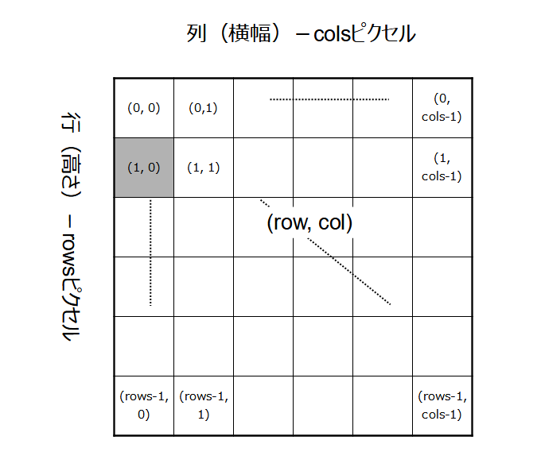

## 第4章 画像の構造

本章では、OpenCV.jsで画像を収容するオブジェクトである`cv.Mat`を中心に、画像のピクセル配置、カラーの構成（色空間）、データ型といった画像の構造を説明します。

<!-- cv の図形描画関数は本章では使わない。必要があれば、のちの章でそれぞれ個別に説明する。 -->
<!-- トピックは OpenCV.js Tutorials の Core Operations にある3節のものを、できるだけカバーした。説明していないのは、`mat.clone()`, `cv.MatVector`, `cv.UcharAt()`, `cv.Mat.zeros()`, `cv.Mat.ones()`, `cv.Mat.eyes()`, `mat.add()`, `mat.subtract()`, `cv.bitwise_and`。最初の2つは、それぞれの章で取り上げる。残りは、取り上げない。-->

### 4.1 画像の構造を調べる

#### 目的

``に取り込んだ画像をOpenCV.jsの画像収容オブジェクトの`cv.Mat`に読み込み、そのまま`<canvas>`に貼り付けます。つまり、[1.1節](./01-html5#11-画像処理の流れ "INTERNAL")で示した画像処理の手順を実装するわけです。図を次に再掲します。


中央②の`<script>`が`cv.Mat`への読み込みと、そこからの書き出しになります。

加えて、`cv.Mat`に収容されている画像の構造にかかわる情報（メタデータ）を出力することで 、画像がどのように収容されているかを確認します。

実行例を先に次の画面に示します。


左側がHTML5で``に読み込んだもの、右側がOpenCV.jsの機能でコピーした`<canvas>`です。無処理でコピーしているので、左右は同じです。

コンソール出力の最初のものは``のサイズを示しています。`HTMLVidelElement.width`と`height`が画面上の実寸を、`HTMLVideoElement.naturalWidth`と`naturalHeight`がもともとの寸法をそれぞれ示しているのは、[第1章](./01-html5.md "INTERNAL")で説明した通りです。ここでまた取り上げているのは、この違いが重要だからです。

コンソール出力の2番目のものは、OpenCV.jsに取り込んだあとの`cv.Mat`メタデータです。3番目は、画像のアルファチャネルの値です。これらの値は本節であとから説明します。

#### コード

コード`mat-metadata.html`を次に示します。

```html
[File] mat-metadata.html
  1  <!DOCTYPE html>
  2  <html lang="ja-JP">
  3  <head>
  4    <meta charset="UTF-8">
  5    <link rel=stylesheet type="text/css" href="style.css">
  6    <script async src="libs/opencv.js" type="text/javascript"></script>
  7  </head>
  8  <body>
  9
 10  <h1>画像の構造を調べる</h1>
 11
 12  <div>
 13    
 14    <canvas id="canvasTag" class="placeholder"></canvas>
 15  </div>
 16
 17  <script>
 18    let imgElem = document.getElementById('imageTag');
 19
 20    function imgProc() {
 21      let mat = cv.imread(imgElem);
 22      cv.imshow('canvasTag', mat);
 23
 24      console.log(`Image metadata:
 25        width×height: ${imgElem.width}x${imgElem.height}
 26        naturalWidth×Height: ${imgElem.naturalWidth}x${imgElem.naturalHeight}`
 27      );
 28
 29      console.log(`Mat metadata:
 30        rows×cols: ${mat.rows}×${mat.cols}
 31        size: ${mat.size().width}×${mat.size().height}
 32        total: ${mat.total()}
 33        #channels: ${mat.channels()}
 34        type: ${mat.type()}              // cv.CV_8UC4 = 24
 35        depth: ${mat.depth()}            // cv.CV_8U = 0
 36        #data: ${mat.data.length}, Type: ${mat.data.constructor.name}`
 37      );
 38
 39      let matVector = new cv.MatVector();
 40      cv.split(mat, matVector);
 41      console.log('data: ', new Set(matVector.get(3).data));
 42
 43      mat.delete();
 44      matVector.delete();
 45    }
 46
 47    var Module = {
 48      onRuntimeInitialized: imgProc
 49    }
 50  </script>
 51
 52  </body>
 53  </html>
```

#### cv.imread関数

OpenCV.jsで画像処理を行うには、``で読み込んだ画像を`cv.imread()`関数で`cv.Mat`オブジェクトに読み込まなければなりません（21行目）。

```javascript
 13    
 ︙
 18    let imgElem = document.getElementById('imageTag');
 ︙
 21      let mat = cv.imread(imgElem);
```

`cv.imread()`の引数には`HTMLImageElement`オブジェクト（18行目）を指定します。関数のオリジナル版では色変換指定の第2引数をオプションで指定できますが、OpenCV.jsでは指定しても無視されます。

関数定義を次に示します。

<!-- FunctionDefinition cv.imread() `HTMLImageElement`上の画像を`cv.Mat`に取り込む。 -->
```Javascript
cv.Mat = cv.imread(          // cv.Mat を出力
    HTMLImageElement         // 入力元のオブジェクト
);
```

`cv.imread()`は``に描かれている画像の寸法そのままをコピーします。実行例の最初のコンソール出力に示したように、読み込んだ画像の表示上のサイズは360×267で、もともとの寸法は1280×949です。21行目の`cv.Mat`は360×267です。

この点、描画コンテクスト`CanvasRenderingContext2D`の`drawImage()`と異なります。したがって、いったん`cv.Mat`に縮小表示した画像を読み込んだら、それを原寸大に拡大すると画質が劣化します。もともとのサイズが必要なら、そのように``に貼り付けなければなりません（画面上で邪魔ならCSSで`display: hide`を設定して不可視にしておく）。

`cv.Mat()`を事前に確保しておかないとエラーになる関数もありますが（後述）、`cv.imread()`は内部でメモリ領域を確保してくれるので、その必要はありません。21行目のように、変数に代入するだけです。

#### cv.imshow()関数

`cv.Mat`オブジェクトは、`cv.imshow()`関数で`<canvas>`には貼り付けられます（22行目）。第1引数には、ターゲットのキャンバスの`id`値を指定します。`HTMLCanvasElement`オブジェクトではありません。間違えやすいので注意してください。第2引数には張り付ける`cv.Mat`を指定します。

関数定義を次に示します。

<!-- FunctionDefinition cv.imshow() 第2引数の`cv.Mat`を第1引数の`<canvas>`に貼り付ける。 -->
```Javascript
cv.imshow(                   // 出力なし
    string id,               // <canvas>のid
    cv.Mat mat               // 画像を収容したcv.Matオブジェクト
);
```

先に示した実行画面例は、画像部分だけにかぎれば、この2行だけで達成できています。

#### cv.Matのプロパティと関数

`cv.Mat`には、画像の構造を示すいくつかのプロパティと関数があり、29～37行目は代表的なものをコンソールに出力しています。次に実行例で示したものを表にまとめて示します。関数から取得するものは、名称末尾に`()`が付いています。どれも、引数はありません。

<!-- mat.dims は実装されていない模様 -->
プロパティ／関数 | 戻り値の型 | 実行画面での値 | 内容
---|---|---
`rows` | `number` | 267 | 行数（水北方向のピクセル数）
`cols` | `number` | 360 | 列数（水平方向のピクセル数）
`size()` | `cv.Size` | {width: 360, height: 267} | 画像サイズを収容したオブジェクト
`total()` | `number` | 96120 | 全ピクセル数（360×267）
`channels()` | `number` | 4 | チャネル数
`type()` | `number` | 24 | ピクセルのデータ型を示す定数
`depth()` | `number` | 0 | `cv.Mat`1要素あたりのビット数を示す定数
`data` | `TypedArray` | -- | 全ピクセルデータを収容した型付き配列で、その総数（`length`）は`cols * rows * channels()`

#### cv.Matの縦横の順番

画像サイズを示すのに`rows`（行）と`cols`（列）という用語を用いています（30行目）。`cv.Mat`が2次元に広がるデータの集まりを（数学の）行列として表現しているからです。そして、行列のその名の通り、行と列の値を列挙するときは行、列の順です。実行例で、267×360と表示しているのはそれに準じているからです。

これには注意が必要です。画像のサイズおよびその中のピクセル位置は、一般的には横、縦の順に指定しますが、行列である`cv.Mat`では逆に縦、横の順になるからです。次の図に`cv.Mat`の構造を示します。

<!-- 532x547 Excel に元画像あり -->


図の升目がピクセルを表しています。中の括弧の数値はその座標値で、たとえば(1, 0)は上から「2行目の左端」のピクセル位置です。

この縦横の転置は、`cv.Mat`に固有のものです。OpenCV.jsの関数でピクセル位置を指定するときは、たいてい普通の画像のように(x, y)の順で記述します。紛らわしいですが、気を付けてください。

`size()`関数は、画像サイズを表の3列目に示したようにオブジェクトの形で返します（31行目）。キーは`width`と`height`なので、`size().width`や`size().height`から横縦の寸法が得られます。`cols`と`rows`と同じ情報なのに別の方法が提供されているのは、このオブジェクトを表現する`cv.Rect`というオブジェクトが、矩形のサイズを指定するときによく使われるからです。このオブジェクトについては、のちほど[4.x節](TBA "INTERNAL")で説明します。

`total()`関数は画像の総ピクセル数を返します（32行目）。つまり、`cols * rows`あるいは`size().width * size().height`です。これもよく計算する値なので、利便性を考慮して用意されています。

#### チャネル数

`channels()`関数は、ピクセル1つを構成する値の数であるチャンネル数を返します（33行目）。

一般的なカラー画像は赤（R)、緑（G）、青（B）の3色で構成されています。これらはそれぞれ`rows`×`cols`の2次元の行列で、それぞれの要素はその点の輝度（強度）を示します。そして、次の図に示すように、それぞれの同じ位置の点の値を重ね合わせることで、混色します。ここでは赤153、緑43、青102を混色することで紫を生成しています。4段目のAは透過度を示すアルファチャネルです。値が小さいほど透明で、大きいほど不透明なので、正確には不透明度（opacity）を示します。

<!-- 372x222 ODG に元画像あり -->


モノクロ画像は色味がない強度だけの2次元データなのでチャネル数は1です。通常のカラーはRGBの3色構成なので3です。

ただし、HTML5の画像形式は、RGBにアルファチャネルAを加えたRGBAです。ここでのチャネル数が4なのはそのためです。モノクロにしか見えない画像でも、チャネル数は4です。RGBだけの画像を読み込んだときでも、HTML5が自動的にアルファを保管して4チャネルに再構成します。補間には完全不透明を意味する最大値が用いられます。

つまり、チャネル数が気になるのは、HTML5の画像を読み込んでOpenCVで処理をする段になってからです。

ピクセル値は、このように1個から4個の値の集まりで構成されます。OpenCVでは、この集まりを単なる配列ではなく、`cv.Scalar()`というオブジェクトで表現します（中身は単なる配列）。用法は使うときに説明します（[x.x節](TBA "INTERNAL")。

#### データ型

`type()`関数は、`cv.Mat`のピクセルのデータ型をあらかじめ定められた整数値で返します。実行例の24は、これが「4チャンネル8ビット符号なし整数」であることを示しています。これを、OpenCVの定数値でいうと、`cv.CV_8UC4`です。

データ型を示す定数名は、`cv.CV_[ビット数][符号あるなし]C[チャネル数]`で構成されています。

- ビット数 ... 先頭の数字は数値のビット数を示していて、`cv.CV_*UC4`なら8ビットです。他に16ビット、32ビット、64ビットを用いることができます。
- 符号のあるなし ... 数字のうしろの文字はUが符号なし整数（unsigned）、Sが符号あり整数（signed）、Fが浮動小数点数（float）という意味です。
- チャネル数 ... 上述の通りで、1～4のいずれかです。

実行例で示したように、データ型は整数値でしか報告されません。数値ではなんだかわかりませんが、どんな型かを知るには、オンラインマニュアルを参照するか、[3.2節](./03-opencv.md#32-OpenCVjsの定数と関数 "INTERNAL"]で作成した定数チェッカーを用いるかしかありません。

本書の範囲では、ほとんどの場合、`cv.CV_8UC*`（チャネル数はケースに応じていろいろ）しか利用しません（オプティカルフローの計算では`cv.CV_32FC2`を使います）。次の表にデータ型定数名とその値を示します。

定数名 | 値 | 意味
---|---|---
`cv.CV_8UC1` | 0 | 1チャネル8ビット符号なし整数（モノクロ画像）
`cv.CV_8UC3` | 16 | 3チャネル8ビット符号なし整数（通常のカラー画像）
`cv.CV_8UC4` | 24 | 4チャネル8ビット符号なし整数（アルファチャネル付きカラー画像）
`cv.CV_32FC2` | 13 | 2チャネル32ビット浮動小数点数（特殊な計算用）

#### ビット深度

`depth()`関数は、`cv.Mat`で用いている数値のビット数をあらかじめ定められた整数値で返します。実行例の0は、これが「8ビット符号なし整数」であることを示しています。OpenCVの定数値なら`cv.CV_8U`です。要するに、データ型からチャネル数を除いたものです。情報が重複している気がしないでもありませんが、チャネル数を問わず8ビット符号なしかどうか確認したいときなどに使います（データを読むときに`ucharPtr()`を使うか`floatPtr()`を使うかで切り分けるときなど）。

次の表に、よく見るデータ型定数名、その値、データを収容する配列のデータ型を示します。

定数名 | 値 | 配列データ型 | 意味 
---|---|---
`cv.CV_8U` | 0 | `Uint8Array` | 8ビット符号なし整数
`cv.CV_32F` | 5 | `Flaot32Array` | 32ビット浮動小数点数

#### データ

`data`プロパティには、ピクセルデータがフラットな配列に収容されています。その要素数は`rows * cols * channles()`です。ここでは267×360×4なので、実行例にあるように384480個です。

データ配列には、JavaScriptの`TypedArray`（型付き配列）が用いられます。ピクセル値は画像ですべて同じ型なので、同じ型を収容できるオブジェクトのほうが効率がよいからです。

`TypedArray`は総称で、実際に用いられるのは`Uint8Array`など特定の型を対象にしたオブジェクトです。よく用いられるのは`Uint8Array`です。`Array`なので、配列が使えるプロパティや関数はたいてい使えます。36行目では`length`プロパティから全要素数と`constructor.name`からその名称を示しています。

チャネル数のところで、読み込んだ画像が3チャネルであっても、HTML5は4チャネルになるように補完をすると述べました。39～41行目はどんなデータが補完されたかを確認するものです。

```javascript
 39      let matVector = new cv.MatVector();
 40      cv.split(mat, matVector);
 41      console.log('data: ', new Set(matVector.get(3).data));
```

複数チャネルの画像はモノクロチャネル画像の重ね合わせなので、それぞれを分離することができます。それを行っているのが39～40行目です。[4.x節](TBA "INTERNAL")で説明するので、ここは分離して、（0からカウントして）3枚目のアルファチャネルだけを抜き出している（41行目の`get(3)`）とだけ思ってください。

41行目は、取り出したアルファチャネルのデータ（中身は`Uint8Array`）を集合型の`Set`に変換しています。これで、重複するデータが省かれます。出力結果をみると255とだけあります。これは、このアルファチャネルには320×267個の要素があっても、すべてが255にセットされているということです。ここから、HTML5はRGB画像に完全不透明なアルファチャネルを加えて``に表示することことがわかります。


### 4.2 キャンバスをコピーする

// `mat-canvas.html`

// `ctx.getImageData()` でキャンバスをコピーし、そこから `cv.matFromImageData()`で mat を生成する。

### 4.3 ピクセルの色を判定する // `mat-data.html`

// `Mat.data`を`Mat.ucharPtr()`で読む
// `Mat.data`は`Uint8Array`型であり、画素データが並んでいることを示す。用例として、選択したピクセル値（4要素）から最も近い色を画像に示す。
// `https://chir.ag/projects/ntc/ntc.js` と自作 Overlay.js を使用。

### 4.4 モノクロ画像で円を描く// `mat-draw-mono.html`

// `Mat.data[]`に直接書き込むことでグラフィックスを描く。
// `cv.Size`、`cv.Point`、`cv.Circle`を紹介。`cv.Rect` は のところで。`cv.Scalar`は色指指定がほとんどなので、実際に使うところで説明。`cv.RotatedRect`は無視。

### 4.5 お絵描きツールを作る）// `mat-paint.html`

// 同上。今度はカラー版.マウス操作付き。
// ずっと実行しているものは、どこかで強制的に mat を解放する

### 4.6 カラーをモノクロ化する

// cv.cvtColorの導入。imgProc 章の 5.1 を使う。

### 4.7 色相図を描く // `mat-draw-hue.html`

// カラーモデル HSV の説明。HSV->RGB 変換 (`cv.cvtColor()`)。絵の作成には`cv.matFromArray()`を使う。
// `Mat.data`を HSV として解釈する。

### 4.8 カラー画像を色要素に分解する

// cv.split。imgProc の 5.2 を使う。

### 4.9 画像をネガにする

// `cv.bitwise_not` を使う。RGBA は A を抜かないとだめ。

### 4.10 部分領域だけ処理する

// データ型の説明は `cv.Rect`。
// 処理は `cv.blur()` を使用。説明はまたあとで。


#### 目的
#### コード


OpenCV.jsでは、画像は`cv.Mat`というデータコンテナに収容されます。


画像は、写真、映像の1フレーム、あるいはグラフィックスが描画されたキャンバスのような静止画像全般を指します。Python版OpenCVでは、画像を数値計算用モジュールNumPyのndarray多次元配列（n-dimensional array）のオブジェクトに収容して管理します。
本書では、このnp.ndarrayで表現された画像をNumPy配列と呼びます。
オブジェクト（変数）がNumPy配列かはtype関数から確認できます。次の例では、NumPyオブジェクトmonoを確認しています。
>>> type(mono)
<class 'numpy.ndarray'>
画像を収容するオブジェクトは、OpenCV公式リファレンスのC++インタフェースではMatと記述されています。C++のリファレンスを参照するときは、Matの部分をNumPy配列で読み替えてください。
本節では、画像を構成するピクセル、ピクセルの値を表現するデータの型、チャンネル、カラーモデルをNumPyでの扱い方を含めて簡単に説明します。実用的な使いかたは、第2章以降で順次取り上げます（とくに2.3節）。
1.3.1　画像サイズ
1枚の画像を構成している1つ1つの点をピクセルといいます。画像の素なので、画素ともいいます。ピクセルは、次のように直交座標領域に縦横に整然と並んでいます。

図1.13●画像の構成

座標系の横と縦のピクセルの数を組を画像のサイズといい、640×400あるいは（640, 400）のように表記します。直交座標の範囲は、左上を起点とし、横（x）は左から右方向に0から幅-1まで、縦は上から下方向におなじく0から高さ-1までです。上図ではそれぞれW-1、H-1で示しています。
NumPy配列では、幅と高さの値をnp.ndarray.shape（タプル）から取得できます。ただし、行列計算用に開発されているNumPy配列では、高さ（行）、幅（列）の順に値が並んでいるので注意が必要です。
640×400のモノクロ画像では、shapeは（400, 640）を返します。同様にnp.ndarray.shape[0]からは400が、np.ndarray.shape[1]からは640が取得できます。Pythonインタラクティブモードで、さきほどのオブジェクトmonoを確認します。
>>> mono.shape               # 高さ（行）、横（列）の順
(400, 640)

>>> mono.shape[0]            # 高さ（行）
400

>>> mono.shape[1]            # 横（列）
640
1.3.2　ピクセル
画像を構成するそれぞれのピクセルには、色や明るさなどの情報を示す値が書きこまれています。ピクセル値といい、直交座標系を用いてP(x, y）と表現されます。値は、一般に低いほど暗く、高いほど明るい光の強さを表現しています。
モノクロ画像なら値が0のときは黒、値が次第に大きくなるにつれて明るく、つまり白っぽくなっていき、最大値に達したところで真っ白になります。ピクセルが0から255の整数値で規定されているときの明るさを次に示します。

図1.14●モノクロピクセルの値と明るさの対応

このように1ピクセル1数値で構成された、色のない、白黒の濃淡のピクセルからなる画像をモノクロ、あるいはグレースケール画像といいます。
カラー画像は、ピクセル1つに3組の数値を割り当てることで表現されます。つまり三原色である赤、緑、青の濃淡（あるいは強さ）を指定し、画面に表示する際にそれらを混ぜ合わせることで多様な色を生成するわけです。
次に、上述とおなじように1つの値の範囲を0～255の整数として、（赤, 緑, 青）の組の値が（153, 26, 102）のときのピクセルを模式的に示します。赤みと青みの値が大きいことからわかるように、結果のピクセルは紫っぽい色になります。

図1.15●カラーピクセル

値3組のカラーピクセルであっても、すべてにおなじ値が格納されていれば色の間に差は生じません。そのため、この画像はグレースケールとおなじようにモノクロに見えます。それでも、ピクセルの構成上はカラーとして扱われます。
NumPy配列では、ピクセルの（x, y）座標を指定することで特定のピクセル値（あるいは値の組）を取得あるいは変更できます。ただし、行列表記なので、指定する順番は（y, x）です。グレースケール（mono）とカラー（color）の画像からそれぞれ（17, 19）の位置のピクセル値を取得する例を次に示します。
>>> mono[19][17]
45

>>> color[19][17]
array([0, 0, 0], dtype=uint8)
グレースケールは1ピクセル1数値なので数値がひとつ表示されます。カラーは3要素なのでリスト形式で表示されます。
具体的な用法は、ピクセルの座標を意識したプログラミングは3.1節および6.4節で、ピクセル単位での操作は5.1節で説明します。
1.3.3　次元
画像には次元という属性もあります。画像を表現するのに必要な配列のネスト数を示す値で、グレースケースは（x, y）で表現されるので2次元、カラーなら（x, y, c）で表現される（cは後述のチャンネル番号）ので3次元です。
NumPy配列では、次元数はndimに収容されています。
>>> color.ndim                     # カラー
3

>>> mono.ndim                      # グレースケール
2
この属性から、画像がカラーかグレーか判定できます。具体的な用法は2.3節で説明します。
1.3.4　データ型
ピクセル値は、それぞれ目的に適したデータ型で表現されます。0～255の整数値は符号なし8ビット整数で、大半のケースでこの型が用いられます。カラーでは1色に256パターンしかないと微妙な色が描けないようにも思えますが、3つの値を組み合わせることで256×256×256=16,777,216（約1,600万）もの種類の色を表現できます。
計算上、あるいはより高い表現力を求めて異なるデータ型をあえて使うこともあります。ピクセル自体はつねに正の値ですが、計算の過程で負の値が生じるときには符号ありのデータ型が用いられます。整数では丸め誤差が生じやすいので、複雑な計算には浮動小数点数型を用います。約1,600万色では不足なら、16ビット整数（範囲は符号なしなら0～65,555）のようにより多いビット数が選択されます。
データ型はこのように符号のあるなし、整数か浮動小数点数か、そしてビット数の組み合わせからいくつかの種類に分かれます。そして、データ型の名称はそれぞれの区分を組わせて構成されています。

    • 符号ありなし。なし（0以上）の整数には型名の先頭にu（unsigned）がつきます。符号あり（正負あり）の整数では省略されます。浮動小数点数型はつねに符号ありなので、付加記号はつきません。
    • 整数または小数点数。整数型ならint、浮動小数点数型ならfloatです。
    • ビット数。ビット数はintまたはfloatのうしろに加えられます。整数のビット数は8、16、32のいずれかで、浮動小数点数では32か64です。ビット数が多ければ高精細になる反面、占有するメモリ量が増大します。ビット数により、表現できる下限と上限の値が決まります。浮動小数点数では加えて、表現できる精度（仮数部の小数点数の桁数）が決まります（仕様はIEEE 756で規定されています）。

NumPyで定義されているデータ型を、OpenCVで利用する範囲にしぼって次の表に示します。

表1.1● NumPy配列のデータ型
データ型名
説明
値の範囲
np.uint8
符号なし8ビット整数
0～255
np.int8
符号あり8ビット整数
-128～127
np.uint16
符号なし16ビット整数
0～65,535
np.int16
符号あり16ビット整数
-32,768～32,767
np.int32
符号あり32ビット整数
-2,147,483,648 to 2,147,483,647
np.float32
32ビット浮動小数点数
10-38～1038
np.float64
64ビット浮動小数点数
10-308～10308

NumPy配列が使用しているデータ型はdtype属性から知ることができます。
>>> color.dtype                    # np.uint8
dtype('uint8')
用法は2.3節で説明します。
データ型は計算上の都合で変換しなければならないこともあります。たとえばnp.uint8からnp.float32です。これにはnp.ndarray.astype関数（メソッド）を用います。ただし、変換元の表現範囲が変換先よりも広いと切り捨てや丸め誤差が発生し、思ってもいない値が得られるので注意が必要です。この関数は4.3節で取り上げます。
1.3.5　カラーモデル
本節ではここまで、カラーを（赤, 緑, 青）の三原色で説明してきました。これをRGBカラーモデルといい、コンピュータや色彩工学で一般的に用いられる色の表現方法です。それぞれ、R（red）、G（green）、B（blue）を意味します。これ以外にも、いくつか異なるカラーモデルがあります。
OpenCVで利用可能な主要なカラーモデルを次の表に示します。

表1.2●カラーモデル
カラーモデル
色の要素
BGR
青－緑－赤（Blue－Gree－Red）
RGB
赤－緑－青（Red－Green－Blue）
GRAY
グレースケール
HSV
色相－彩度－明度（Hue－Saturation－Value）
YCrCb
輝度－赤み－青み（Y－Cr－Cb）

● BGRカラーモデル
OpenCVのデフォルトカラーモデルです。色の種類はRGBの3組とおなじですが、登場順序が違うため、おなじ値の組み合わせであっても最終的な色は異なります。
次に例を示します。中央に示したのがピクセルの値［32, 129, 230］です。これをRGBカラーモデルで解釈すると赤32、緑129、青230なので、結果の色はほぼ青です。これに対し、BGRは青32、緑129、赤230と解釈するのでオレンジ色です。

図1.16●3つのおなじ値の組み合わせをRGBとBGRで解釈したときの色

● HSVカラーモデル
色相（Hue）、彩度（Saturation）、明度（Value）の3つの値でカラーを構成するモデルをHSVといいます。色相は赤や青などの色合いを示し、色味ともいいます。彩度は色の鮮やかさを、明度は色の明るさをそれぞれ示します。
色相は色相環という円環で描かれるため、0度から360度までの値をとります。0度の赤からスタートし、黄、緑、水色（このあたりで180度）、青、紫と角度が進むにつれ色が変わり、最後の360度でもとの赤に戻ります。虹の色順とおなじです。
ただし、np.uint8が0～255の範囲しか表現できないため、半分にして0～179の値を用います。180～255の範囲は循環するので、180のモジュロ（剰余）で色相が得られます。たとえば、180は0と等しいので赤、200は200%180=20なので黄色です。np.int16が用いられると、0～360が使われます。こちらも、360以上の値は360のモジュロを取ります。
この半分角度の値と色の関係を次の表に示します。

表1.3●色相の値と色の対応
色相の値
0
30
60
90
120
150
179
色
赤
黄
緑
水色
青
紫
赤

彩度と明度の値は、一般的には0～100（あるいは0.0から1.0）のパーセント表記ですが、OpenCVでは0～255を用います。0が0%、255が100%を意味します。
例として、RGBでは青、BGRではオレンジだった［32, 129, 230］のピクセルを考えます。HSVで解釈すると、色相は黄土色（度数では64度）、鮮やかさは半分の50%、明度はかなり明るい90％になります。これとおなじ色はRGBでは［223, 230, 115］です。
HSVはHの値から直感的に色を把握できるため、イラストレータなどに好まれます。画像処理においても、4.3節のクロマキー合成のように背景の色に着目するときに用いられます。HSVは4.2節で扱います。
ウェブ（HTML/CSS）で用いられるカラーモデルはHSLで、このHSVとは微妙に異なるので気をつけてください。
● YCrCbカラーモデル
Y（輝度）、Cr（赤味）、Cb（青味）の3つの値でカラーを構成するモデルをYCrCbといいます。YCbCrというモデルもありますが、赤と青の順番が変わっただけです。正確にはCrは赤の強度から、Cbは青みの強度からそれぞれ輝度を引いた値ですが、自力で計算をしなければならないかぎり、気にする必要はありません。
画像処理では、JPEGなどの画像圧縮で用いられます。6.3節で取り上げます。
● カラーモデルの変換
各カラーモデルは、たとえばBGRからHSV、HSVからRGBのように相互に変換が可能です。変換式は公式リファレンスのColor conversionsページで説明されています。ある色を特定のカラーモデルで表現したときにどのような値を取るのか、あるいは同じ値がそれぞれのカラーモデルでどのような色になるのかは、インターネットのカラーチェックサイトで調べられるので、検索してください。
OpenCVにはcv2.cvtColorという画像全体のカラーモデルを相互変換する関数が備わっています。具体的には、BGRとGRAYは2.5節、BGRとHSVは4.2節と4.3節、BGRとYCrCbは6.3節でそれぞれ扱います。
● カラーの表示
NumPy配列では、どのカラーモデルであっても1ピクセルは［1, 2, 3］のように単なる数値の羅列です。カラーモデル名を示す属性はありません。そのため、BGRとして格納された画像をRGBとして読む、あるいはHSVのデータをBGRとして読むなど、誤った解釈も可能です。
OpenCVでは、画像はcv2.imshow関数（2.1節に関数定義）で表示します。関数は3つの数値の並びをBGRと解釈します。そのため、HSVなど他のカラーモデルをそのまま表示すると、プログラムでは不都合はないのに、色合いがおかしな画像が提示されるので注意が必要です。色変換は4.1節で扱います。
1.3.7　画像データの構成
以上、画像の基本構成要素を理解したところで、ここで例をひきながら全体をまとめます。
次の図は、白い背景に置かれたリンゴのカラー画像です。ここから3×3のサイズで切り出した右図がここでのサンプル画像です。切り出し領域の座標系（x, y）では、左上の葉の緑が（0, 0）、リンゴの赤が（0, 2）、背景の白が（2, 1）の位置にあります。

図1.17●画像のピクセル構成

OpenCVのデフォルトのカラータイプはBGR、型はuint8なので、それぞれのピクセルは3つの0～255の範囲の値の組で構成されます。次の図は、切り出し領域のピクセル値を示しています。上から順に(B, G, R) です。

図1.18●BGRピクセル値

座標（0, 0）のピクセル値は［1, 158, 76］です。P(0, 0)=[1, 158, 76]と書けます。青1と赤76に比べて緑の値が大きいことから、緑系統の色だとわかります。座標（0, 2）は［90, 38, 162］で、赤の値が162と他よりも大きいことから、赤いリンゴの部分と判断できます。座標（2, 1）は［206, 255, 250］で、BGRの値がいずれもおなじくらいなことから色味のないモノクロで、値が最大値の255に近いことから白っぽいことがわかります。
NumPy配列はこれらピクセルを順に格納しています。順番は左上を開始点として水平に右側に進み、右端に到達したら1ピクセル下の左端に戻って、ふたたび水平に右側に進んだ順序です。右下の点が最後です。
NumPy配列をインタラクティブモードでそのまま評価すると、値が表示されます。ただし、サイズが大きければ途中が省かれます。先の図の3×3画像がappleに格納されているときの出力を次に示します。
>>> apple
array([[[  1 158  76]          # 0行目
         [  5 161  80]
         [ 11 172 100]]

        [[ 37 182 156]         # 1行目
         [115 218 201]
         [206 255 250]]

        [[ 90  38 162]         # 2行目
         [110  82 170]
         [169 158 189]], dtype=uint8])
角カッコが3重であることから、次元数（apple.ndim）が3なことがわかります。
属性も表示しましょう。
>>> apple.shape                # 行、列、チャネル数
(3, 3, 3)

>>> apple.ndim                 # 次元数
3
ほとんどのOpenCV関数は画像1枚、つまりNumPy配列1つを単位に処理をするため、ピクセル値の構成を意識する必要はあまりありません。ただ、ピクセル単位で処理をするケースがないわけではないので、内部構造は頭に入れておくとよいでしょう。


