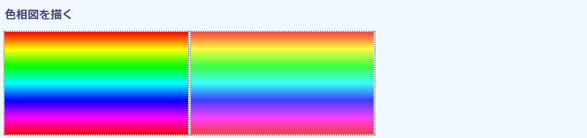
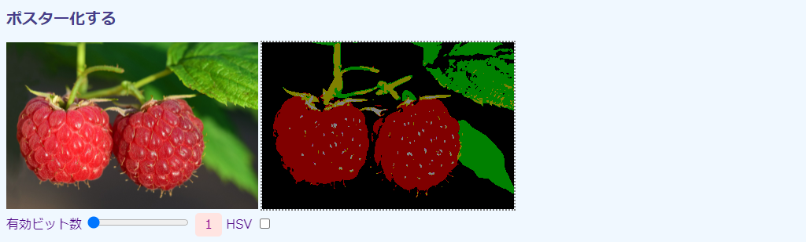
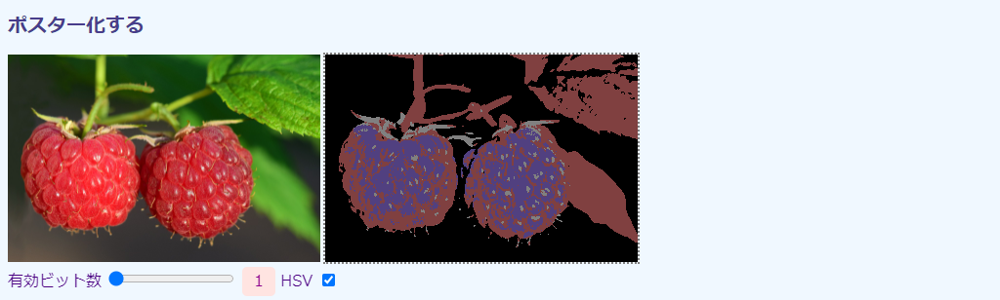

## 第5章 色を扱う

本章では、画像の色の操作方法を取り上げます。おなじみのモノクロ化やセピア化だけでなく、RGBからHSVなど色空間の変換方法も紹介します。

### 5.1 カラーをモノクロ化する

#### 目的

RGBAカラー画像をモノクロ（白黒）化します。

技術的には、色変換の`cv.cvtColor()`関数の用法とその引数に指定する色空間定数を説明することが目的です。CSSにも`filter: grayscale()`という機能があり、どちらも同じような見栄えの画像を出力しますが、中身はかなり違います。CSSのものは色合いだけはモノクロで、中身は依然としてRGBAカラー画像です。対する`cv.cvtColor()`は色の要素のない、`cv.CV_8UC1`に変換します。多くの画像処理はモノクロ画像を対象としているので、この1チャネル化は必須の技術です。

実行例を次の画面に示します。


左が``に読み込まれた元画像、中央がOpenCVでモノクロ化した画像です。右は参考までに`filter: grayscale(1.0);`で作成したモノクロ（ただしRGBA）画像です。おそらく区別はつかないはずです。

#### コード

コード`color-gray.html`を次に示します。

```html
[File] color-gray.html
  1  <!DOCTYPE html>
  2  <html lang="ja-JP">
  3  <head>
  4    <meta charset="UTF-8">
  5    <link rel=stylesheet type="text/css" href="style.css">
  6    <script async src="libs/opencv.js"></script>
  7  </head>
  8  <body>
  9
 10  <h1>カラーをモノクロ化する</h1>
 11
 12  <div>
 13    
 14    <canvas id="canvasTag1" class="placeholder"></canvas>
 15    <canvas id="canvasTag2" class="placeholder"></canvas>
 16  </div>
 17
 18  <script>
 19    let imgElem = document.getElementById('imageTag');
 20
 21    function imageLoaded(evt) {
 22      let canvasElem2 = document.getElementById('canvasTag2');
 23      canvasElem2.width = imgElem.width;
 24      canvasElem2.height = imgElem.height;
 25      canvasElem2.style.filter = 'grayscale(1.0)';
 26      let ctx = canvasElem2.getContext('2d');
 27      ctx.drawImage(imgElem, 0, 0, imgElem.width, imgElem.height);
 28    }
 29
 30    function imgProc() {
 31      let src = cv.imread(imgElem);
 32      let dst = new cv.Mat();
 33      cv.cvtColor(src, dst, cv.COLOR_RGBA2GRAY);
 34      cv.imshow('canvasTag1', dst);
 35      src.delete();
 36      dst.delete();
 37    }
 38
 39    var Module = {
 40      onRuntimeInitialized: imgProc
 41    }
 42    window.addEventListener('load', imageLoaded);
 43  </script>
 44
 45  </body>
 46  </html>
```

21～28行目は、HTML5の機能で2枚目のキャンバスにモノクロ画像を貼り付けています。OpenCV部分は30～37行目ですが、これまでのコードと違うのは33行目の色変換部分くらいです。

#### cv.cvtColor関数

色空間を変換するには、`cv.cvtColor()`関数を使います（33行目）。ここでは、HTML5のデフォルト色空間のRGBAからモノクロのGRAYに変換します。

```javascript
 33      cv.cvtColor(src, dst, cv.COLOR_RGBA2GRAY);
```

関数定義を次に示します。

<!-- FunctionDefinition cv.cvtColor() 色空間を変換する（RGBからHSVなど）。 -->
```Javascript
cv.cvtColor(                                // 戻り値なし
    cv.Mat src,                             // 入力画像
    cv.Mat dst,                             // 出力画像
    number code,                            // 色変換コード
    number dstCn = 0                        // 出力画像のチャネル数
);
```

第1引数`src`には入力画像の、第2引数`dst`には出力画像を収容する`cv.Mat`をそれぞれ指定します。`dst`はあらかじめ`new cv.Mat()`で定義しておかなければなりません（22行目）。

第3引数`code`には、どの色空間からどの色空間に変換するかのコード（整数値）を指定します。他のOpenCV定数同様、数値でじかに指定してもかまいませんが、普通は読みやすい定数名を使います。

主要な色変換定数名を次の表に示します。

定数名 | 値（整数値） | 意味
---|---|---
`cv.COLOR_RGB2RGBA` | 0 | RGB > RGBA（すべて非透過なアルファチャネルを加える）
`cv.COLOR_RGBA2RGB` | 1 | RGBA > RGB（アルファチャネルを抜く）
`cv.COLOR_RGBA2GRAY` | 11 | RGBA > モノクロ（1チャネル単色）
`cv.COLOR_RGB2HSV` | 41 | RGB > HSV
`cv.COLOR_HSV2RGB` | 55 | HSV > RGB

色空間変換コード定数名は`cv.COLOR_[変換元]2[変換先]`の形式になっています。利用可能な定数はOpenCVリファレンスを参照するか、[3.5節](./03-opencv.md#35-OpenCV.jsの定数を調べる "INTERNAL")の定数表から確認できます。

たいていの色空間のあいだの変換は用意されていますが、ないものもあります。たとえば、RGBAを直接HSVに変換する定数はありません。その場合は、RGBA > RGB > HSVのように、別の色空間を経由します。中継に使う色空間はBGRがよいでしょう。RGBの順序が入れ替わった色空間です。というのも、BGRはOpenCVがデフォルトで用いる色空間なので、そこから、あるいはそこへの色変換定数が豊富だからです。

変換先のチャネル数が変換元より少ないときは、余ったチャネルは廃棄されます。たとえば、`cv.COLOR_RGBA2RGB`はアルファチャネルのデータを廃棄します。反対に、変換元のほうが少ないときは、適当な値で埋められます。`cv.COLOR_RGB2RGBA`では、アルファチャネルが255（完全非透過）で埋められます。`cv.COLOR_GRAY2RGB`は1チャネルを3チャネルに変換しますが、モノクロのピクセル値がR、G、Bに同じようにコピーされます。これにより、チャネル的にはカラーであっても、モノクロな画像が生成されます。

最後の`dstCn`引数には、変換先の画像のチャネル数を指定します。デフォルトの0は、チャネル数が変換元と色変換コードから自動的に決定されるという意味です。よほど凝ったことをしていないかぎり、使うことはないでしょう。

毎度になりますが、使用済みの`cv.Mat`は解放します。

```javascript
 25      src.delete();
 26      dst.delete();
```


### 5.2 ネガにする

#### 目的

画像をカラーとモノクロのネガに、つまり反転します。本当の意味でのネガフィルムは見なくなりましたが、登場人物のショックを表現する演出などで用いられています。

技術的には、`cv.bitwise_not()`関数の用法を示すところが目的です。画像処理では、1チャネル画像を反転する必要なときがしばしばあるので、これも必須の基礎技術です。CSSにも同じ機能の`filter: invert()`がありますが、RGBAを対象としているのでOpenCVスクリプティングではやや使い勝手が悪いです。

実行例を先に次の画面に示します。


左が``に読み込まれた元画像、中央がカラーのままネガにした画像、右はいったんモノクロ化してからネガにした画像です。

#### コード

コード`color-invert.html`を次に示します。

```html
[File] color-invert.html
  1  <!DOCTYPE html>
  2  <html lang="ja-JP">
  3  <head>
  4    <meta charset="UTF-8">
  5    <link rel=stylesheet type="text/css" href="style.css">
  6    <script async src="libs/opencv.js"></script>
  7  </head>
  8  <body>
  9
 10  <h1>ネガにする</h1>
 11
 12  <div>
 13    
 14    <canvas id="canvasTag1" class="placeholder"></canvas>
 15    <canvas id="canvasTag2" class="placeholder"></canvas>
 16  </div>
 17
 18  <script>
 19    let imgElem = document.getElementById('imageTag');
 20
 21    function imgProc() {
 22      let src = cv.imread(imgElem);
 23
 24      let dst1 = new cv.Mat();
 25      cv.cvtColor(src, dst1, cv.COLOR_RGBA2RGB);
 26      cv.bitwise_not(dst1, dst1);
 27      cv.imshow('canvasTag1', dst1);
 28
 29      let dst2 = new cv.Mat();
 30      cv.cvtColor(src, dst2, cv.COLOR_RGBA2GRAY);
 31      cv.bitwise_not(dst2, dst2);
 32      cv.imshow('canvasTag2', dst2);
 33
 34      [src, dst1, dst2].forEach(mat => mat.delete());
 35    }
 36
 37    var Module = {
 38      onRuntimeInitialized: imgProc
 39    }
 40  </script>
 41
 42  </body>
 43  </html>
```

#### cv.bitwise_not関数

ネガ化とは、すべてのピクセルデータをビット反転する操作です。0（2進数で`0000 0000`）は255（`1111 1111`）に、94（`0101 1110`）は161（`1010 0001`）のように、ビット単位で0が1、1が0になります。

この操作を行っているのが、26、31行目の`cv.bitwise_not()`関数です。関数定義を次に示します。

<!-- FunctionDefinition cv.bitwise_not() 画像のピクセル値をビット単位で反転する（ネガになる）。 -->
```Javascript
cv.bitwise_not(                             // 戻り値なし
    cv.Mat src,                             // 入力画像
    cv.Mat dst                              // 出力画像
);
cv.bitwise_not(                             // 戻り値なし
    cv.Mat src,                             // 入力画像
    cv.Mat dst,                             // 出力画像
    cv.Mat mask                             // マスク画像
);
```

第1引数に変換元の`cv.Mat`を、第2引数に変換後の画像を収容する`cv.Mat`をそれぞれ指定します。第2引数で指定するまえに、あらかじめ`new cv.Mat()`で空の画像を用意しておかなければならないのは、前節と同じです。

第3引数はオプションです。これを指定する3引数版では、この画像のピクセル値が0以外の位置のピクセルだけがビット反転されます。このように、画像中の特定のピクセルのみ演算対象とする方法をマスキング、演算対象を`cv.8UC1`の`cv.Mat`のピクセルで示した画像をマスクといいます。用法は[5.8節](./05-colors.md#58-背景を入れ替える（輝度調整付き） "INTERNAL")で取り上げます。

まず、カラーの反転を見てみます（24～26行目）。

```javascript
 24      let dst1 = new cv.Mat();
 25      cv.cvtColor(src, dst1, cv.COLOR_RGBA2RGB);
 26      cv.bitwise_not(dst1, dst1);
```

ビット反転のまえに、4チャネルRGBAを3チャネルRGBAに変換しています（25行目）。`cv.bitwise_not()`は「すべてのピクセル」を反転するので、当然、アルファチャネルも反転します。HTML5では、もともとRGBであった画像は、読み込み時にAをすべて255としたRGBAに変換されます。このA=255が反転されてA=0になると完全透明、つまり見えない画像になります。画像的にはキャンバスに貼り付けられているのでそれはそれで正しいのですが、困惑のもとなので、アルファチャネルは抜いておきます。

モノクロのほうは、前節と同じ要領でモノクロ化してから反転しています（29～31行目）。

```javascript
 29      let dst2 = new cv.Mat();
 30      cv.cvtColor(src, dst2, cv.COLOR_RGBA2GRAY);
 31      cv.bitwise_not(dst2, dst2);
```

例によって、使用後には`cv.Mat`を解放します。ここでは`delete()`を3回も書くのはめんどうということで、`cv.Mat`の配列を用意して、ループで開放しています。3行に分けて書いてもかまいません（好みの問題です）。

```javascript
 34      [src, dst1, dst2].forEach(mat => mat.delete());
```

#### 論理演算関数

この他にも、OpenCVには`cv.Mat`の全ピクセルデータを対象とした論理演算関数がいくつか用意されています。次の表にこれらを示します。

論理演算関数 | 機能
---|---
`cv.bitwise_and(src1, src2, dst)` | `src1`と`src2`の同じ位置同士のピクセルの値の間で論理積（AND）を取り、`dst`に収容する。
`cv.bitwise_or(src1, src2, dst)` | `src1`と`src2`の同じ位置同士のピクセルの値の間で論理和（OR）を取り、`dst`に収容する。
`cv.bitwise_xor(src1, src2, dst)` | `src1`と`src2`の同じ位置同士のピクセルの値の間で排他的論理和（XOR）を取り、`dst`に収容する。
`cv.bitwise_and(src1, src2, dst)` | `src1`と`src2`の同じ位置同士のピクセルの値の間で論理積（AND）を取り、`dst`に収容する。

用法は自明だと思いますが、詳細はOpenCVリファレンスマニュアルを参照してください。


### 5.3 セピア調にする（およびその他の線形フィルタ）

#### 目的

画像をセピア調にします。

セピア調は画像を茶褐色に変色させる操作です。印画紙に焼かれた写真が経年変化で白っぽいとことは黄色く、赤が褐色に褪せていった様子を、デジタル（数値演算）で再現するわけです。レトロ調にしたいときによく用いられます。

技術的には、セピア調、あるいはその他のピクセル変換で用いる線形変換の理論とそれを実行する`cv.transform()`関数を紹介するのが主題です。`filter: sepia()`のようなお仕着せの関数も便利ですが、線形変換の美しいのは、スクリプトの骨格に一切手を加えることなく、演算パラメータの調整だけで多様なピクセル変換を達成できるところです。もちろん、手慣れてくれば変わった効果の得られるフィルタも自作できるようになります。

実行例を次の画面に示します。


左が元画像、右がセピア化した画像です。

セピア調以外の実行例はその都度取り上げます。

#### コード

コード`color-sepia.html`を次に示します。

```html
[File] color-sepia.html
  1  <!DOCTYPE html>
  2  <html lang="ja-JP">
  3  <head>
  4    <meta charset="UTF-8">
  5    <link rel=stylesheet type="text/css" href="style.css">
  6    <script async src="libs/opencv.js"></script>
  7  </head>
  8  <body>
  9
 10  <h1>セピア調にする（およびその他の線形フィルタ）</h1>
 11
 12  <div>
 13    
 14    <canvas id="canvasTag" class="placeholder"></canvas>
 15  </div>
 16
 17  <script>
 18    let imgElem = document.getElementById('imageTag');
 19
 20    let filters = {
 21      sepia: [0.393,0.769,0.189,0.349,0.686,0.168,0.272,0.534,0.131],
 22      monochrome: [0.299,0.587,0.114,0.299,0.587,0.114,0.299,0.587,0.114],
 23      bgr: [0,0,1,0,1,0,1,0,0],
 24      allGreen: [0,0,0,0.299,0.587,0.114,0,0,0],
 25      reduction: [0.5,0,0,0,0.5,0,0,0,0.5]
 26    }
 27
 28    function imgProc() {
 29      let filter = filters.sepia;
 30      let matrix = cv.matFromArray(3, 3, cv.CV_32FC1, filter);
 31
 32      let src = cv.imread(imgElem);
 33      let dst = new cv.Mat();
 34      cv.cvtColor(src, src, cv.COLOR_RGBA2RGB);
 35      cv.transform(src, dst, matrix);
 36      cv.imshow('canvasTag', dst);
 37
 38      [src, dst, matrix].forEach(mat => mat.delete());
 39    }
 40
 41    var Module = {
 42      onRuntimeInitialized: imgProc
 43    }
 44  </script>
 45
 46  </body>
 47  </html>
```

20～26行目に9個の数値を収容した配列が5つあります。これら数値が、画像をセピア調やモノクロに変換するパラメータです。まずは題目のセピア調（21行目）を説明し、残りは順次説明していきます。コードを読むぶんにあたっては、この部分は無視し、29行目に21行目の配列が直接代入されていると考えてください。

#### 線形変換

画像処理の基本は、あるピクセル $P(r, g, b)$ を別の $P'(r', g' b')$ に置き換える操作です（アルファチャネルはここでは除外して考えます）。

$$P(r, g, b) \Rightarrow P'(r', g', b')$$

いろいろな変換操作が考えられますが、もっとも簡単なのは線形変換です。カラー画像のピクセルのRGBの値は、3要素のべクトル $\vec{P}(r, g, b)$ とみなすことができます。線形変換とは、次の図に示すようにこのベクトルに3×3の行列 $M$ を掛けることで、新しい3要素のベクトル $\vec{P'}(r',g', b')$を得る操作です。高校数学で出てくるあれです。

<!-- ODG に原画あり。975 x 435 -->


<!-- 値は https://medium.com/dataseries/designing-image-filters-using-opencv-like-abode-photoshop-express-part-2-4479f99fb35 から -->
<!-- こちらほうがわかりやすいかな。 https://dyclassroom.com/image-processing-project/how-to-convert-a-color-image-into-sepia-image -->
この3×3の行列 $M$ の値をあれこれいじることで、いろいろな変換操作が達成できます。セピア調の場合は21行目に定義したものです。

```javascript
 21      sepia: [0.393,0.769,0.189,0.349,0.686,0.168,0.272,0.534,0.131],
```

横一列に並んでいますが、これを3×3に整形すると次のようになります。

$$\begin{pmatrix}
  0.393 & 0.769 & 0.189 \\
  0.349 & 0.686 & 0.168 \\
  0.272 & 0.534 & 0.131
\end{pmatrix}$$

1行目（ $r'$ の計算）だけに着目すれば、上記は次のように書けます。

$$r' = 0.393 r + 0.769 g  + 0.189 b$$

もともとの赤（$r$）はだいたい1/3に減らし、代わりに緑と青の成分を少しずつ持ってきていることがわかります。

行列の値は「こうすればセピア調になる」という経験則にもとづくもので、理論式や標準があるわけではありません。ここで用いている行列はあくまで一例で、他の値を取るものもあります。

#### cv.matFromArray関数

行列なので、9要素の数値配列は`cv.Mat`に変換します。これをやっているのが30行目の`cv.matFromArray()`関数です。

```javascript
 29      let filter = filters.sepia;
 30      let matrix = cv.matFromArray(3, 3, cv.CV_32FC1, filter);
```

その名の通り、`Array`から`Mat`を生成する関数です。定義を次に示します。

<!-- FunctionDefinition cv.matFromArray() 配列から`cv.Mat`を生成する。 -->
```Javascript
cv.Mat = cv.matFromArray(                   // 出力はcv.Mat
    number rows,                            // 出力行列の行数
    number cols,                            // 出力行列の列数
    number rtype,                           // データ型
    Array array                             // 配列
);
```

関数は`cv.Mat`を返します。

第1引数は生成する行列の行数、第2引数は列数です（順番注意！）。第3引数はデータ型で、ここでは小数点数を使うので`cv.CV_32FC1`を指定しています。チャネルは1つしかないので末尾が1になっているところが注意点です。また、いつもの`cv.CV_8UC1`だと1未満の小数点数は0に丸められてしまうので、できあがりの画像が必ずまっくろになります。

第4引数には行列に描き込む値の配列を指定します。行列だからと2次元配列を指定すると、エラーは出ませんが、奇妙な値になります。データが2次元配列なら、`Array.flat()`から1次元に平たく直してください。また、行数×列数と配列要素数は合わせなければなりません（挙動は`TypedArray.set()`と似ています）。

#### cv.transform関数

用意した行列をすべてのピクセル値に適用すれば（合計`rows`×`cols`回のループ）、セピア調画像が得られます。この操作をするのが35行目の`cv.transform()`関数です。定義を次に示します。

<!-- FunctionDefinition cv.transform() 行列式からピクセル値を変換する。 -->
```javascript
cv.transform(                               // 戻り値なし
    cv.Mat src,                             // 入力画像
    cv.Mat dst,                             // 出力画像
    cv.Mat m                                // 変換行列（浮動小数点数使用）
);
```

第1引数に入力の、第2引数に出力先の`cv.Mat`をそれぞれ指定します。第3引数が先ほど作成した3×3行列です。

コードを確認します。

```javascript
 32      let src = cv.imread(imgElem);
 33      let dst = new cv.Mat();
 34      cv.cvtColor(src, src, cv.COLOR_RGBA2RGB);
 35      cv.transform(src, dst, matrix);
```

重要なのは34行目でRGBAをRGBに変換しているところです。変換行列は3要素のベクトルを想定した3×3なので、アルファがあると計算ができません。例によって、33行目で出力行列用の入れ物を用意しておくのもポイントです。

#### いろいろな色変換

行列を変えることで、いろいろな色変換操作ができます。先に、結果の画像を示します。

<table>
  <tr>
    <td></td>
    <td></td>
    <td></td>
    <td></td>
  </tr>
  <tr>
    <td>モノクロ化（monochrome）</td>
    <td>色の交換（bgr）</td>
    <td>色を抜き出す（allGrren）</td>
    <td>輝度調節（reduction）</td>
  </tr>
</table>

##### モノクロ化

22行目の`monochrome`はカラーをモノクロに変換します。

$$\begin{pmatrix}
  0.299 & 0.587 & 0.114 \\
  0.299 & 0.587 & 0.114 \\
  0.299 & 0.587 & 0.114
\end{pmatrix}$$

カラーのモノクロ変換式は $0.299 r + 0.587 g + 0.114 b$ です。すべての色のピクセル値の平均ではなく、係数が微妙に異なっているのは、ヒトの色覚細胞の感度が赤緑青で異なるからです。この式は単色ですが、同じ値をR、G、Bのどれにも収容すれば、構造上はカラーであってもモノクロな画像が得られます。

##### 色の交換（RGB > BGR）

23行目の`bgr`はRGB画像をBGR画像に変換します。色の入れ替えで、赤の強度を青に、青の強度を赤に置き換えています。BGRがOpenCVのネイティブな色空間です。筆者の用いている画像ビューワーでは「色の交換」と呼ばれています。

$$\begin{pmatrix}
  0.0 & 0.0 & 1.0 \\
  0.0 & 1.0 & 0.0 \\
  1.0 & 0.0 & 0.0
\end{pmatrix}$$

最初の行は変換後のRの値ですが、式が $0 r + 0 g + 1 b$ なので、Bの値になります。同様に2行目はGの値、3行目はRの値になります。

##### 1色だけ抜き出す

24行目の`allGreen`は画像を緑だけにします。

$$\begin{pmatrix}
  0.0 & 0.0 & 0.0 \\
  0.299 & 0.587 & 0.114 \\
  0.0 & 0.0 & 0.0
\end{pmatrix}$$

2行目はモノクロ化と同じパターンです。つまり、モノクロ画像と同じ情報を緑と読み替えています。残りはすべて0なので、結果として全面が緑の画像になります。赤と青の輝度が0になるので、やや暗めの画像になります。

##### 輝度調節

25行目の`reduction`は輝度調節です。一般の輝度調節はすべてのチャネルを等しく定数倍しますが、行列を用いた方法なら、それぞれ異なる倍率を適用できます。ここでは、赤は変えず（1.0倍）、緑は光量を半分に（0.5倍）、青は0.8倍にしています。

$$\begin{pmatrix}
  1.0 & 0.0 & 0.0 \\
  0.0 & 0.5 & 0.0 \\
  0.0 & 0.0 & 0.8 \\
\end{pmatrix}$$

パターンはRGB→BGRと同じで、チャネル入れ替え（行列の1の位置を変える）はしない代わりに、値に1以下の値を指定しています。


### 5.4 RGB画像を色成分に分解する

#### 目的

3チャネルカラー画像をチャネル単位に分解し、それぞれをモノクロ画像として表示します。また、それぞれの平均値をコンソールに出力することで、どの色の強度が平均的に強いかを判定します。

その色が強い（輝度が高い）部分はピクセル値が大きいので、モノクロ表現では白っぽくなります。反対に、色が弱い部分では黒っぽくなります。Webでは`#EE7800`（あるいは233、120、0）のようにRGB値で色を特定しますが、このように分解することで、RGB値がどの程度なのかを視覚的に把握できるようになります。

技術的なトピックは、マルチチャネル画像を分解する`cv.split()`関数です。関数は複数の1チャネル`cv.Mat`を配列にして返しますが、この`cv.Mat`のコンテナにはとくに用意された`cv.MatVector`を用います。平均値を計算する関数は`cv.mean()`です。

実行例を次の画面に示します。


上が元画像、下が分解後の色要素です。元画像はカラーなので、それぞれのタマゴにわかるように色名を付けてあります（原画には文字はありません）。分解後のモノクロ画像は左から赤（R）、緑（G）、青（B）の順です。

R画像からわかるように、赤みの強い赤、ピンク、橙の画像は赤のピクセル値が大きいので白っぽくなっています。おもしろいのは橙のタマゴがもっとも白くみえるところです。橙は赤と緑の混色（たとえば`#EE7800`）で、ストレートに
赤に見えなくても、明るければ赤が強くなるからです。半面、赤みのない青いタマゴは黒っぽくなります。同様に、G画像では緑のタマゴが、B画像では青のタマゴがそれぞれ白くなります。これで、それぞれの卵のRGB構成がわかります。

コンソール出力は左から赤、緑、青、アルファの平均ピクセル値です。平均値にさほどの違いはないので、3つの原色がほぼ均等に出ていることがわかります。赤がやや大きいのは、（橙も含めて）タマゴ2.5個分あるからでしょう。

画像は3チャネルなのでもともとアルファは含まれていません。0が出ているのは、この値は`cv.Scalar`で、4要素なければ残りは0で埋めるからです（[4.4節](./04-mat.md#44-モノクロで円を描く "INTERNAL")参照）。

#### コード

コード`color-rgb.html`を次に示します。

```html
[File] color-rgb.html
  1  <!DOCTYPE html>
  2  <html lang="ja-JP">
  3  <head>
  4    <meta charset="UTF-8">
  5    <link rel=stylesheet type="text/css" href="style.css">
  6    <script async src="libs/opencv.js"></script>
  7  </head>
  8  <body>
  9
 10  <h1>RGB画像を色成分に分解する</h1>
 11
 12  <div>
 13    
 14  </div>
 15  <div>
 16    <div class="inline">
 17      <canvas id="canvasTag0" class="placeholder"></canvas>
 18      <span id="spanTag0">R</span>
 19    </div>
 20    <div class="inline">
 21      <canvas id="canvasTag1" class="placeholder"></canvas>
 22      <span id="spanTag1">G</span>
 23    </div>
 24    <div class="inline">
 25      <canvas id="canvasTag2" class="placeholder"></canvas>
 26      <span id="spanTag2">B</span>
 27    </div>
 28  </div>
 29
 30  <script>
 31    let imgElem = document.getElementById('imageTag');
 32
 33    function imgProc() {
 34      let src = cv.imread(imgElem);
 35      cv.cvtColor(src, src, cv.COLOR_RGBA2RGB);
 36
 37      let dstMats = new cv.MatVector();
 38      cv.split(src, dstMats);
 39      for(let i=0; i<dstMats.size(); i++) {
 40        cv.imshow(`canvasTag${i}`, dstMats.get(i));
 41      }
 42
 43      console.log(cv.mean(src));
 44
 45      src.delete();
 46      dstMats.delete();
 47    }
 48
 49    var Module = {
 50      onRuntimeInitialized: imgProc
 51    }
 52  </script>
 53
 54  </body>
 55  </html>
```

#### cv.MatVectorオブジェクト

3色を対象とするので、まずは読み込んだRGBA画像をRGBに変換します（34～35行目）。

```javascript
 34      let src = cv.imread(imgElem);
 35      cv.cvtColor(src, src, cv.COLOR_RGBA2RGB);
```

続いては、`cv.split()`メソッドで3チャネル画像を1チャネル（モノクロ）の画像3つに分解しますが、その前に、3つの`cv.Mat()`を収容する`cv.MatVector`オブジェクトを用意します（37行目）。

```javascript
 37      let dstMats = new cv.MatVector();
```

`cv.MatVector`オブジェクトはC/C++の`std::Vector`をOpenCV.js用に移植したデータコンテナです。要は、要素の型の決まった配列です。C/C++版では多様なデータ型を収容できますが、この`cv.MatVector`は名前が示すように、`cv.Mat`専用のコンテナになっています。

C/C++版にはいろいろなコンストラクタが用意されていますが、`cv.MatVector`では引数は指定できません。関数定義を示します。

<!-- FunctionDefinition cv.MatVector() `cv.Mat`専用のVector（配列）を生成するコンストラクタ。 -->
```Javascript
cv.MatVector = cv.MatVector();              // cv.MatVectorを返す
```

インスタンスには、次の表に示す操作関数が用意されています。

関数 | 操作
---|---
`get(i)` | `i`番目の要素（単体の`cv.Mat`）を取り出す。
`push_back(mat)` | 引数の`mat`をオブジェクトの末尾に加える。
`resize(n, mat)` | コンテナサイズを`n`に変更する。`n`が現在のサイズよりも小さいときは、残りは廃棄される。現在のサイズより大きいときは、第2引数の`mat`で埋める。なお、小さい時でも第2引数は必須。
`set(i, mat)` | `i`番目の要素を引数の`mat`と置き換える。
`size()` | 要素数を整数で返す。

本書で利用するのは`get(i)`くらいです。

`cv.MatVector`もOpenCV.jsの内部リソースです。不要になったら明示的に解放します(46行目）。

```javascript
 46      dstMats.delete();
```

#### cv.split関数

マルチチャネル（カラー）画像を1チャネル（単色）に分解するには`cv.split()`関数を使います（38行目）。

```javascript
 38      cv.split(src, dstMats);
```

関数定義は次の通りです。

<!-- FunctionDefinition cv.split() マルチチャネル（カラー）画像を1チャンネルの配列（`cv.MatVector`）に分解する。 -->
```Javascript
cv.split(                                   // 戻り値なし
    cv.Mat src,                             // 入力画像
    cv.MatVector dstMat,                    // 出力画像（の配列）
);
```

第1引数の入力はカラー画像です。RGBのように3チャネルでも、RGBAのようにアルファ付き4チャネルでもかまいません。

第2引数には分解後のモノクロ画像を収容する`cv.MatVector`が返されます。要素数は、第1引数がRGBならが3個に、RGBAなら4個になります。

`cv.MatVector`の要素にアクセスするには、先の表で示した`get()`関数を使います（40行目）。ここでは、3つの`cv.Mat`を順にしょりするためにループを組んでいます（39行目）。要素数を取得するには、`cv.Mat.size()`です。

```javascript
 39      for(let i=0; i<dstMats.size(); i++) {
 40        cv.imshow(`canvasTag${i}`, dstMats.get(i));
```

`<canvas>`の`id`属性はcanvasTag1のように0から2の数値付きで名付けてあるので、ループ内で簡単に指定できます。

#### cv.mean関数

各チャネルの平均値を計算しているのは、43行目の`cv.mean()`関数です。

<!-- FunctionDefinition cv.mean() `cv.Mat`のチャネル単位の平均値計算する。 -->
```javascript
 43      console.log(cv.mean(src));
```

関数は`cv.Scalar`オブジェクトを返しますが、中身はただの配列なので、そのまま`console.log()`から出力できます。関数定義を次に示します。

```Javascript
cv.Scalar = cv.mean(                        // 出力はcv.Scalar
    cv.Mat mat                              // 入力画像
);
```

`cv.Scalar`の各要素は、それぞれ対応するチャネルのピクセルの平均値です。R、G、Bすべての平均を求めたいのなら、次の要領で要素を足して3で割ります（アルファは0のはずなので、加えても影響はありません。気になるなら`slice(0, 3)`で最初の3要素だけにします）。

```javascript
cv.mean(src).reduce((a, b) => a + b, 0) / 3)
```


### 5.5 色相図を描く

#### 目的

本節では、色相図を描きます。

技術的には、3チャネル`cv.Mat`それ自体に変わりはありません。収容した値をHSVとして解釈するだけで、画像がHSVになることを示すのが目的です。関数にはすでに説明した`cv.cvtColor()`（[5.1節](#51-カラーをモノクロ化する "INTERNAL")）と`cv.matFromArray()`（[5.3節](#53-セピア調にする（およびその他の線形フィルタ "INTERNAL")）を用います。

実行例を次の画面に示します。



左がOpenCVで、右が描画コンテクストで描いたものです。OpenCVはHSV、描画コンテクストはHSLをそれぞれ使っているので、実際にディスプレイで見ると微妙に色合いが異なります。

#### コード

コード`color-hue.html`を次に示します。

```html
[File] color-hue.html
  1  <!DOCTYPE html>
  2  <html lang="ja-JP">
  3  <head>
  4    <meta charset="UTF-8">
  5    <link rel=stylesheet type="text/css" href="style.css">
  6    <script async src="libs/opencv.js"></script>
  7  </head>
  8  <body>
  9
 10  <h1>色相図を描く</h1>
 11
 12  <div>
 13    <canvas id="canvasTag1" class="placeholder"></canvas>
 14    <canvas id="canvasTag2" class="placeholder"></canvas>
 15  </div>
 16
 17  <script>
 18    let width = 320;
 19    let height = 180;
 20
 21    function cssDraw() {
 22      let canvasElem2 = document.getElementById('canvasTag2');
 23      canvasElem2.width = width;
 24      canvasElem2.height = height;
 25      let ctx = canvasElem2.getContext('2d');
 26      for(let deg=0; deg<height; deg++) {
 27        ctx.strokeStyle = `hsl(${deg*2} 100% 50%)`;
 28        ctx.lineWidth = 1;
 29        ctx.beginPath();
 30        ctx.moveTo(0, deg);
 31        ctx.lineTo(width-1, deg);
 32        ctx.stroke();
 33      }
 34    }
 35    cssDraw();
 36
 37    function imgProc() {
 38      let arr = [];
 39
 40      for(let deg=0; deg<height; deg++) {
 41        let color = [deg, 255, 255];
 42        let line = new Array(width).fill(color);
 43        arr.push(line);
 44      }
 45
 46      let flat_arr = arr.flat(Infinity);
 47      let mat = cv.matFromArray(height, width, cv.CV_8UC3, flat_arr);
 48
 49      cv.cvtColor(mat, mat, cv.COLOR_HSV2RGB);
 50      cv.imshow('canvasTag1', mat);
 51      mat.delete();
 52    }
 53
 54    var Module = {
 55      onRuntimeInitialized: imgProc
 56    }
 57  </script>
 58
 59  </body>
 60  </html>
```

#### HSV色空間

色相（Hue）、彩度（Saturation）、明度（Value）の3つの値で色を構成する色空間をHSVといいます。

色相は赤や青などの色合いを示し、図式するときは色相環という円環で描かれるため、0°から360°までの値をとります。0°の赤からスタートし、黄、緑、水色（このあたりで180度）、青、紫と角度が進むにつれ色が変わり、最後の360°でもとの赤に戻ります。色順は虹とおなじです。

8ビット符号なし整数の`cv.CV_8U`で表現するときは、256以上の値が使えないため、角度の半分の値が用いられます。次の表に角度と色の対応関係を30度刻みで示します。

角度 | 0 | 30 | 60 | 90 | 120 | 150 | 180
---|---|---|---|---|---|---|---
色 | 赤 | 黄 | 緑 | 水色 | 青 | 紫 | 赤

色相が180種類しかないのでは思った色が表現できないというのなら、360°まで使える`cv.CV_16U`など大きなビット深度のデータ型を使います。`cv.CV_32F`もよいでしょう。浮動小数点数では、0～360の角度は0.0~1.0の範囲にスケーリングされます。

彩度は色の鮮やかさを、明度は色の明るさをそれぞれ示します。こちらは、色空間上、その度合いは0%から100%で示されます。`cv.CV_8U`では、これが0～255にスケーリングされます。0%は0、50%は128、100%は255です。浮動小数点数を用いたときは、パーセントが小数値になるだけです。

色だけに着目するときは、たいてい彩度と明度を最大にして描画します。つまり(角度, 255, 255)です。

OpenCVを用いて色相図を描いているのは、36～52行目の`imgProc()`関数です。ここでは、180行320列の`cv.Mat`（画像にして320×180）を用意し、そこに行の位置と角度を一致させて色相図を描いています。

```javascript
 18    let width = 320;
 19    let height = 180;
 ︙
 38      let arr = [];
 39
 40      for(let deg=0; deg<height; deg++) {
 41        let color = [deg, 255, 255];
 42        let line = new Array(width).fill(color);
 43        arr.push(line);
 44      }
```

42行目は3要素のピクセルを示す配列を、横幅ぶん並べた配列の配列を生成しています。これで線が1本、単一の色で引けます。これを40行目のループで高さぶん、その行位置に応じて角度値を変えながら作成すれば、画像1枚分の配列の配列の配列が得られます。

ほしいのは入れ子になっていない1次元配列なので、`Array.flat()`関数かでフラット化します。こうなれば、あとは`cv.matFromArray()`関数（[5.3節](#53-セピア調にする（およびその他の線形フィルタ） "INTERNAL")）で`cv.Mat`が得られます。

この`cv.Mat`の`data`プロパティは次の図のような構造になっています。

<!-- ODG に原画あり。4.3節の絵のほぼコピペ。671×117。 -->


絵は[4.3節](./04-mat.md#43-ピクセルの色名を判定する "INTERNAL")のものと実は変わりません。枠内のr、g、bの文字をh、s、vに置き換えただけです。つまり、`cv.Mat.data`の形式はRGBと変わらず`Uint8Array`で、並び具合も要素の数も同じです。単に、収容されたものをなにとみなすかが違うだけです。

#### HSV－RGB変換

HSVのつもりで生成した行列をそのままキャンバスに貼り付けると、たいていはサイケデリックな色合いになります。HTML5が、値の並びをRGBと解釈するからです。このコードの場合、ピクセル値は(deg, 255, 255)なので、シアン系の色がだんだんと白んでいくグラデーションになります。

そこで、これをRGBに変換します（49行目）。

```javascript
 49      cv.cvtColor(mat, mat, cv.COLOR_HSV2RGB);
```

色変換定数にHSVからRGBへの`cv.COLOR_HSV2RGB`を使うところがポイントです。

#### HLS色空間

CSSで同じように色に着目した色指定をするときは、HLS色空間を用います。

Hは色相で、これはHSVと同じ0～360°の値です。角度と色の対応も同じです。Sは彩度で、HSVとだいたい同じですがやや解釈が異なります。Lは輝度（Luminance）で、0%はまっくらで色すらも見えないので黒、100%は強烈な光でホワイトアウトしているので白、50%だとちょうどその色と解釈されます。

色だけに着目するときは、たいてい彩度を最大に、輝度を丁度その色にして描画します。つまり(角度, 100%, 50%)です。

描画コンテクストを用いて色相図を描いているのは、21～34行目の`cssDraw()`関数です。ループ（26行目）のスタイルは同じですが、角度が0～360なので、2°刻みで色相を変化させています。

```javascript
 26      for(let deg=0; deg<height; deg++) {
 27        ctx.strokeStyle = `hsl(${deg*2} 100% 50%)`;
```

描画コンテクストで線色を設定するのは、`strokeStyle`プロパティです。値にはHSLを直値で指定できる`hsl()`関数が使えます。なお、HとSとLの間にカンマはないので、間違えないように。

CSSではRGBとHSL以外の色空間をサポートしています。詳細は次のMDNの「<color\>」の項を参照してください。

```https://developer.mozilla.org/ja/docs/Web/CSS/color_value```

OpenCVでもHLSが扱えますが、HSLというSとLの順番が入れ替わった色空間を用いています。たとえば、`cv.COLOR_HLS2RGB`や`cv.COLOR_RGB2HLS`です。


### 5.6 ポスター化する

#### 目的

画像をボスター化します。ポスター化とは使用する色の数を減らすこと、つまり減色操作です。英語の用語をそのままカタカナにしてポスタリゼーションともいいます。少ない色で描いたポスターやイラストのような画像が得られます。色数の設定はトラックバーから行います。

技術的には、これまで用いてきた関数の範囲で実装できるので、たいしたことはありません。`cv.Mat.data`から直接ピクセル値を読み取り、減色してもとに戻します。減色操作にはいろいろな方法がありますが、ここでは有効ビット数を制限します。選択範囲はしたがって0～8です。これにはビット演算を使いますが、JavaScriptの基本機能で達成できます。色空間にはRGBとHSVを選択できるようにするので、これには`cv.cvtColor()`関数を使います。

実行例を2点示します。次の画面はRGBを対象とし、有効ビット数を1にしたときのものです。



有効ビット数を1にすると、後述の計算方法で、ピクセル値は128か0のどちらかになります。3チャネルいずれについても2パターンなので、合計の色数は2<sup>3</sup>＝8種類です。画面では、緑の葉っぱが(0, 128, 0)、赤いラスベリーが(128, 0, 0)、茎の黄緑が(128, 128, 0)で塗りつぶされます。背景は(0, 0, 0)です。

次の画面はHSVを対象としたときのものです。有効ビット数はこれも1です。



色相Hが128か0、つまりか青か赤になります。

#### コード

コード`color-posterize.html`を次に示します。

```html
[File] color-posterize.html
  1  <!DOCTYPE html>
  2  <html>
  3  <head>
  4    <meta charset="UTF-8">
  5    <link rel=stylesheet type="text/css" href="style.css">
  6    <script async src="libs/opencv.js"></script>
  7  </head>
  8  <body>
  9
 10  <h1>ポスター化する</h1>
 11
 12  <div>
 13    
 14    <canvas id="canvasTag" class="placeholder"></canvas>
 15  </div>
 16  <div>
 17    有効ビット数 <input type="range" id="rangeTag" value="8" min="1" max="8"/>
 18    <span id="spanTag" class="currentValue">8</span>
 19    HSV <input type="checkbox" id="checkboxTag"/>
 20  </div>
 21
 22  <script>
 23    let imgElem = document.getElementById('imageTag');
 24    let rangeElem = document.getElementById('rangeTag');
 25    let spanElem = document.getElementById('spanTag');
 26    let checkboxElem = document.getElementById('checkboxTag');
 27
 28    function imgProc() {
 29      let src = cv.imread(imgElem);
 30      cv.cvtColor(src, src, cv.COLOR_RGBA2RGB);
 31      if (checkboxElem.checked)
 32        cv.cvtColor(src, src, cv.COLOR_RGB2HSV);
 33
 34      let nBits = Number(rangeElem.value);
 35      let mask = 0xFF << (8 - nBits) & 0xFF;
 36      console.log(`# of significant bits: ${nBits}, mask: ${mask.toString(2)}`);
 37
 38      let dst = new cv.Mat(src.rows, src.cols, src.type());
 39
 40      for(let pos=0; pos<dst.data.length; pos++) {
 41        let value = src.data[pos];
 42        dst.data[pos] = value & mask;
 43      }
 44
 45      if (checkboxElem.checked)
 46        cv.cvtColor(dst, dst, cv.COLOR_HSV2RGB);
 47      cv.imshow('canvasTag', dst);
 48
 49      [src, dst].forEach(m => m.delete());
 50    }
 51
 52    function rangeHandle() {
 53      spanElem.innerHTML = rangeElem.value;
 54      imgProc();
 55    }
 56
 57    function checkboxHandle() {
 58      imgProc();
 59    }
 60
 61    var Module = {
 62      onRuntimeInitialized: function() {
 63        rangeElem.addEventListener('change', rangeHandle);
 64        checkboxElem.addEventListener('change', checkboxHandle);
 65        imgProc();
 66      }
 67    }
 68  </script>
 69
 70  </body>
 71  </html>
```

#### 減色操作

有効ビット数を制限するとは、本来なら8ビットあるなか、数ビットを使用せずに0か1に固定するということです。たとえば、7ビットに制限するときは、末尾のビットを常に0に保ちます。こうすると、本来なら0～255までの整数を連続して表現できていたはずの8ビット符号なし整数が、0～254までの偶数値（0を含む）しか表現できなくなります。数にして128個、つまり半分の減色です。

どのビットを使えなくするかにはいろいろな考え方がありますが、ここでは下位のビットから0にしていきます。たとえば、6ビット制限なら、下位2ビットを強制的に00にします。次の図はこの様子を模式的に示したものです。

<!-- ODG に原画あり。454x174 -->


10進数で173は2進数にすると`1010 1101`です。下位2ビットを0にすると、`1010 1100`となり、10進数では172になります。

この操作は、もとの値と2進数の`1111 1100`の間で論理和（AND）を取ることで達成できます。この論理和の値は、`1111 1111`（16進数で`FF`）を2回左にシフトすることで得られます。これをやっているのが、34～35行目です。

```javascript
 34      let nBits = Number(rangeElem.value);
 35      let mask = 0xFF << (8 - nBits) & 0xFF;
```

有効ビット数は17行目のトラックバーの値から得ています（34行目）。この値を8から引けば、シフトする回数が得られます。有効ビット数が6なら、8ー6＝2です。左シフト演算の記号は`<<`です（35行目）。シフトの結果が8ビットに収まっていればそのままなのですが、JavaScriptの数値は64ビット表現（整数部はそのうち53ビット）なので、8ビットの数値をシフトすると9ビット目以降が出てきてしまいます。`& 0xFF`はそれをカットするための処置です。

有効ビット数とマスクのパターンはコンソールに出力しているので、そこから確認できます（36行目）。

```javascript
# of significant bits: 1, mask: 10000000
# of significant bits: 2, mask: 11000000
# of significant bits: 3, mask: 11100000
# of significant bits: 4, mask: 11110000
# of significant bits: 5, mask: 11111000
# of significant bits: 6, mask: 11111100
# of significant bits: 7, mask: 11111110
# of significant bits: 8, mask: 11111111
```

あとは、このマスク値を`cv.Mat`のデータにまんべんなくかけるだけです（38～43行目）。

```javascript
 38      let dst = new cv.Mat(src.rows, src.cols, src.type());
 39
 40      for(let pos=0; pos<dst.data.length; pos++) {
 41        let value = src.data[pos];
 42        dst.data[pos] = value & mask;
 43      }
```

38行目では、入力画像（変数`src`）と同じサイズ、同じデータ型の出力用`cv.Mat`を用意しています。40～43行目では、`src.data`のバイト値を呼んでは、マスクをかけて出力用の`data`に代入しています。

HSVチェックボックス（19行目）がチェックされていたら（`checkboxElem.checked`が`true`）、計算前にHSVに変換し（31～32行目）、キャンバスへのコピー前にもとのRGBに戻します（45～46行目）。

#### 処理時間

本コードのポスター化処理はあまり効率的ではありません。1度ロードしたら変更はないはずの元画像を、イベントが発生するたびに``から読み込んでは色空間変換しています（29～32行目）。出力用の`cv.Mat`も1つ用意して使いまわせばよいのに、毎回生成しては解放しています（38、49行目）。

これらをOpenCVが準備できたところ（62～66行目）でやっておけば、そのぶん、早くなります。しかし、そのようにすると、今度はいつ`cv.Mat`を解放すべきかが問題になります。ユーザーに明示的に解放させる（[4.3節](./04-mat.md#43-ピクセルの色名を判定する "INTERNAL")）かタイマーで自動解放する（[4.7節](./04-mat.md#47-部分領域だけ処理する "INTERNAL")）という手は紹介しましたが、今度は使い勝手がよくありません。たかだか画像2枚分のメモリなので、(ブラウザやタブが閉じられるまで）放置しておくというのも手です。

難しいところです。


### 5.7 白と黒だけにする

#### 目的

画像をまっしろ（255）とまっくろ（0）だけに変換します。モノクロ画像の一種ですが、中間のグレーがまったくないところが特徴です。0と255しかないので2値化画像と呼ばれます。

技術的には、`cv.trehshold()`関数とそれに備わっている閾値の自動判定アルゴリズムを説明します。2値化画像は前景と背景を分離するのによく用いられます（次節で扱います）。

実行例を2点示します。次の画面はトラックバーから閾値を指定して2値化画像を生成したときのものです。


閾値は46にセットされています。つまり、左の画像をモノクロ化し、それぞれのピクセルが46より大きければ255（まっしろ）にし、以下なら0（まっくろ）にしています。逆光の写真なので、前景にある暗めなやしの木や陸地が黒くなり、背景の明るい空が白くなっています。

次の画面は閾値の自動判定によるものです。


閾値は96が得られました。先ほどよりも大きい値なので、そのぶん黒いところが増え、海面もほぼまっくろになりました。

#### コード

コード`color-binary.html`を次に示します。

```html
[File] color-binary.html
  1  <!DOCTYPE html>
  2  <html lang="ja-JP">
  3  <head>
  4    <meta charset="UTF-8">
  5    <link rel=stylesheet type="text/css" href="style.css">
  6    <script async src="libs/opencv.js"></script>
  7  </head>
  8  <body>
  9
 10  <h1>白と黒だけにする</h1>
 11
 12  <div>
 13    
 14    <canvas id="canvasTag" class="placeholder"></canvas>
 15  </div>
 16  <div>
 17    閾値 <input type="range" id="rangeTag" value="128" min="0" max="255"/>
 18    <span id="spanTag" class="currentValue">128</span>
 19    大津 <input type="checkbox" id="checkboxTag"/>
 20  </p>
 21
 22  <script>
 23    let imgElem = document.getElementById('imageTag');
 24    let rangeElem = document.getElementById('rangeTag');
 25    let spanElem = document.getElementById('spanTag');
 26    let checkboxElem = document.getElementById('checkboxTag');
 27
 28    function rangeHandle() {
 29      checkboxElem.checked = false;
 30      imgProc();
 31    }
 32
 33    function checkboxHandle() {
 34      let thresh = imgProc();
 35      rangeElem.value = thresh;
 36    }
 37
 38    function imgProc(evt) {
 39      let src = cv.imread(imgElem);
 40      cv.cvtColor(src, src, cv.COLOR_RGBA2GRAY);
 41      let dst = new cv.Mat();
 42
 43      let value = Number(rangeElem.value);
 44      let max = Number(rangeElem.max);
 45
 46      let flag = cv.THRESH_BINARY;
 47      if (checkboxElem.checked)
 48        flag = cv.THRESH_BINARY | cv.THRESH_OTSU;
 49
 50      let thresh = cv.threshold(src, dst, value, max, flag);
 51      cv.imshow('canvasTag', dst);
 52      src.delete();
 53      dst.delete();
 54
 55      spanElem.innerHTML = thresh;
 56      return thresh;
 57    }
 58
 59
 60    var Module = {
 61      onRuntimeInitialized: function() {
 62        rangeElem.addEventListener('input', rangeHandle);
 63        checkboxElem.addEventListener('change', checkboxHandle);
 64        imgProc();
 65      }
 66    }
 67  </script>
 68
 69  </body>
 70  </html>
```

#### 2値化の原理

コードの説明に入る前に、2値化の原理を説明します。

2値化は閾値を用いたピクセル値の変換操作です。ピクセル値が閾値よりも大きければ、その値を255（まっしろ）に変換します。以下ならば0（まっくろ）にします。次の図にこの様子を模式的に示しました。

<!-- ODG に原画あり。688 x 241 -->


左がモノクロの元画像で、ピクセル値が155、79、…のように並んでいます。閾値を128としたとき、これ以上のピクセルの値は255に、未満は0にし、同じ位置を上書きします。これをすべてのピクセルについて行えば、結果は右に示すように255か0の、真っ白か真っ黒な画像になります。

2値化処理はカラーにも適用できますが、たいていはモノクロ画像（`cv_8UC1`）を対象とします。カラーの場合は、各チャネル単位で同じ処理を繰り返します。各チャネルの色のパターンが2つになるので、3チャネルのRGBなら8色構成（2<sup>3</sup>）になります。そういう意味では、前節の減色と似たような効果が得られます。

ここでは、RGBAの入力画像は`cv.cvtColor()`を使ってモノクロに変換しています（49行目）。

```javascript
 39      let src = cv.imread(imgElem);
 40      cv.cvtColor(src, src, cv.COLOR_RGBA2GRAY);
```

#### cv.threshold関数

`cv.threshold()`関数は端的には上記の変換操作を実装したものですが、これ以外にもいろいろなオプションがあるので、引数が豊富です。関数をも使っている50行目まわりのコードを次に示します。

```javascript
 46      let flag = cv.THRESH_BINARY;
 ︙
 50      let thresh = cv.threshold(src, dst, value, max, flag);
```

関数定義を次に示します。

<!-- FunctionDefinition cv.threshold() 画像を2値化する。 -->
```Javascript
number = cv.threshold(                      // 選択閾値
    cv.Mat src,                             // 入力画像
    cv.Mat dst,                             // 出力画像
    number thresh,                          // 閾値
    number maxval,                          // 最大値
    int type                                // 変換方法
);
```

関数の戻り値は用いた閾値です。通常の用法では第3引数で指定した値そのままなです。

第1引数`src`には入力画像の、第2引数`dst`にはあらかじめ用意した出力画像を収容する`cv.Mat`（41行目）をそれぞれ指定します。データ型は8ビットカラーでも32ビット浮動小数点数カラーでもかまいません。出力のデータ型は入力と同じです。

第3引数`thresh`には閾値を指定します。

第5引数`type`は2値化の変換方法を指定するもので、次の表に示すものがあります。2列目の「閾値以下」はピクセル値が閾値以下のときに得られる、3列目の「閾値より大」はそれより大きいときに得られる値です。4列目は閾値を128、最大値を255としたときに得られる2値化画像です。表の1行目が入力画像で、左がまっくろで、徐々に白んでいき、右でまっしろになるグラデーションです。

定数名 | 閾値以下 | 閾値より大 | 画像例
---|---|---|---
入力画像例 | そのまま | そのまま | 
`cv.THRESH_BINARY` | 0 | 最大値 | 
`cv.THRESH_BINARY_INV` | 最大値 | 0 | 
`cv.THRESH_TRUNC` | そのまま | 閾値 | 
`cv.THRESH_TOZERO` | 0 | そのまま | 
`cv.THRESH_TOZERO_INV` | そのまま | 0 | 

46行目で指定している`cv.THRESH_BINARY`は、閾値以下なら0に、それより大きければ最大値にするオーソドックスなパターンです。最大値は第4引数から指定します。

`cv.THRESH_BINARY_INV`は`cv.THRESH_BINARY`の選択ピクセル値を反転したもので、閾値以下なら第4引数の最大値に、それより大きければ0にするパターンです。つまり、仕上がりが白黒反転します。

`cv.THRESH_TRUNC`はピクセル値が閾値以下ならばそのまま保持し、閾値より大きければ閾値にします。第4引数は無視されます。TRUNCは切り捨てを意味するtruncateの略で、閾値より大きい値が切り取られてしまう様子を表しています。図では閾値の128が中央にあたるので、ここより左は入力画像のまま、右は128になっています。

`cv.THRESH_TOZERO`は閾値以下なら0、閾値より大きければもとのピクセル値を保持します。`cv2.THRESH_TOZERO_INV`はその逆です。

#### 閾値の自動選択

トラックバーを使うなりして、毎回最適な閾値を手動で求めるのは手間です。2値化を自動化するのなら、閾値も自動選択したいところです。それを達成しているのが大津の方法です。

大津の閾値自動選択方法は、モノクロ画像のヒストグラムを作成したとき、背景と前景の部分がそれぞれ山となる（つまり、背景および前景と同程度の輝度をもつピクセルの数が最も多い）であろうと仮定し、背景と前景の集まりを最もよく分離できる閾値を計算するものです。

`cv.threshold()`で大津の方法を指定するときは、第5引数で指定する通常の変換方法に論理和（OR）で定数`cv.THRESH_OTSU`を加えます（47～48行目）。

```javascript
 47      if (checkboxElem.checked)
 48        flag = cv.THRESH_BINARY | cv.THRESH_OTSU;
```

このとき、`cv.threshold()`関数は自動選択された閾値を返します。コードでは、大津の方法がチェックボックスから指定されたら（19行目）、`cv.threshold()`の戻り値で強制的にトラックバーの値を変更しています（33～36、63行目）。

```javascsript
 33    function checkboxHandle() {
 34      let thresh = imgProc();
 35      rangeElem.value = thresh;
 36    }
 ︙
 63        checkboxElem.addEventListener('change', checkboxHandle);
```

反対に、トラックバーが操作されたら、大津のチェックボックスを強制的にオフにします（28～31、62行目）。

```javascript
 28    function rangeHandle() {
 29      checkboxElem.checked = false;
 30      imgProc();
 31    }
 62        rangeElem.addEventListener('input', rangeHandle);
```


### 5.8 背景を入れ替える（輝度調整付き）

#### 目的

背景を別の画像と入れ替えます。このとき、よく混ざり合うように前景の輝度をトラックバーから調節します。

背景入れ替えは、技術的には前節の応用です。まず、前景を含んだ画像を`cv.threshold()`で2値化します。OpenCVの関数は本来なら画像全体を対象に処理をしますが、オプションで2値化画像を指定すると黒いところだけを処理から省きます。この白黒オンリーの画像を処理に用いるとき、これを「マスク画像」といいます。背景入れ替えはつまり、前景画像をマスク画像をしていたうえで`cv.Mat.copyTo()`関数で背景にコピーするという操作です。

マスク画像を生成するには閾値を指定しなければなりませんが、ここでは大津の方法で自動的に決定させます。

ピクセル値に値を加えたり、減らしたりすれば明るくなったり暗くなったりします。値を定数倍することでも、同様に明暗を変更できます。`cv.Mat()`に対してこのような操作をするのが、`cv.convertScaleAbs()`関数です。

実行例を次の画面に示します。


左がやしを含んだ前景画像、中央が背景画像、右が合成後の画像です。前景画像のやしは暗いので、そのまま暗い背景に貼り付けると埋もれてしまいます。そこで、前景画像のピクセル値を1.8倍したうえで42加えています。これにより、たとえば(71. 47, 29)が(151, 108, 76)になります。

#### コード

コード`color-background.html`を次に示します。

```html
[File] color-background.html
  1  <!DOCTYPE html>
  2  <html lang="ja-JP">
  3  <head>
  4    <meta charset="UTF-8">
  5    <link rel=stylesheet type="text/css" href="style.css">
  6    <script async src="libs/opencv.js"></script>
  7  </head>
  8  <body>
  9
 10  <h1>背景を入れ替える（輝度調整付き）</h1>
 11
 12  <div>
 13    
 14    
 15    <canvas id="canvasTag" class="placeholder"></canvas>
 16  </div>
 17  <div>
 18    <input type="range" id="rangeTag1" min="0" max="2" value="1" step="0.1"/>
 19    <span id="spanTag1" class="currentValue">定数倍 1</span>
 20    <input type="range" id="rangeTag2" min="-127" max="127" value="0"/>
 21    <span id="spanTag2" class="currentValue">定数加算 0</span>
 22  </div>
 23
 24  <script>
 25    let imgElem1 = document.getElementById('imageTag1');
 26    let imgElem2 = document.getElementById('imageTag2');
 27    let rangeElem1 = document.getElementById('rangeTag1');
 28    let rangeElem2 = document.getElementById('rangeTag2');
 29    let spanElem1 = document.getElementById('spanTag1');
 30    let spanElem2 = document.getElementById('spanTag2');
 31
 32    function imgProc(evt) {
 33      let fg = cv.imread(imgElem1);
 34      let bg = cv.imread(imgElem2);
 35      let fgBinary = new cv.Mat();
 36
 37      cv.cvtColor(fg, fgBinary, cv.COLOR_RGBA2GRAY);
 38      cv.threshold(fgBinary, fgBinary, 128,  255, cv.THRESH_BINARY_INV | cv.THRESH_OTSU);
 39
 40      let alpha = Number(rangeElem1.value);
 41      let beta = Number(rangeElem2.value);
 42      cv.convertScaleAbs(fg, fg, alpha, beta);
 43      spanElem1.innerHTML = `定数倍 ${alpha}`;
 44      spanElem2.innerHTML = `定数加算 ${beta}`;
 45
 46      fg.copyTo(bg, fgBinary);
 47      cv.imshow('canvasTag', bg);
 48
 49      [fg, bg, fgBinary].forEach(function(mat) {
 50        mat.delete();
 51      });
 52    }
 53
 54    var Module = {
 55      onRuntimeInitialized: function() {
 56        rangeElem1.addEventListener('input', imgProc);
 57        rangeElem2.addEventListener('input', imgProc);
 58        imgProc();
 59      }
 60    }
 61  </script>
 62
 63  </body>
 64  </html>
```

#### マスク画像の生成

マスク画像を生成しているのは37～38行目です。

```javascript
 37      cv.cvtColor(fg, fgBinary, cv.COLOR_RGBA2GRAY);
 38      cv.threshold(fgBinary, fgBinary, 128,  255, cv.THRESH_BINARY_INV | cv.THRESH_OTSU);
```

前節と同じで、RGBAをいったんモノクロ（GRAY）に変換したうえで`cv.threshold()`をかけます。第5引数で`cv.THRESH_BINARY_INV`を使っているところがポイントです。

前節でみたように、ここで用いている素材は逆光で、背景が明るく、前景が暗い画像です。これをストレートに2値化すると背景が255、前景が0となります。マスク画像を用いた関数では、0のところが処理から除外され、それ以外（通常はここのマスク画像のように255をセットする）では処理をするようになっているので、このままでは背景の空の側がコピーされてしまいます。そこで、白黒を反転する変換方法定数を指定します。

#### cv.convertScaleAbs関数

画像のピクセル値を`cv.convertScaleAbs()`関数で加減乗除で変化させているのが40～42行目です。

```javascript
 40      let alpha = Number(rangeElem1.value);
 41      let beta = Number(rangeElem2.value);
 42      cv.convertScaleAbs(fg, fg, alpha, beta);
```

関数定義を次に示します。

<!-- FunctionDefinition cv.convertScaleAbs() 画像ピクセル値を加減乗除する。 -->
```Javascript
cv.convertScaleAbs(                         // 戻り値なし
    cv.Mat src,                             // 入力画像
    cv.Mat dst,                             // 出力画像
    number alpha = 1,                       // 倍数
    number beta = 0                         // 加算
);
```

第1引数に入力画像を、第2引数に出力画像をそれぞれ指定します。ここではどちらにも`fg`を指定しているので、入力の`cv.Mat`は計算後オーバーライトされます。

第3引数が倍数を指定します。小数点数も指定できいるので、1より小さければ輝度が減少します（除算に相当）。第4引数は加算する値で、負ならピクセル値を減少させます。つまり、単純に一次関数 $αx + β$ をやっているだけです。

計算結果がデータ型の範囲を超えたときは、その場合は強制的に最大値、または最小値に計算結果が抑えられます。`cv.CV_8U`ならば0未満は0、256以上は255です。このように、データ型の範囲内に値を押さえることを「飽和処理」といいます。

カラー画像のときは、すべてのチャネルに同じように加減乗除を施します。アルファチャネルも同様です。アルファの値を加減乗除で変更することはあまりないので、この関数を使う前には、たいてい`cv.cvtColor()`でアルファを除外します。

スクリプト上のポイントは、マスク画像を先に生成しているところです。（37～38行目）。42行目では輝度変換後の前景画像をそのまま`fg`に上書きしているので、そのあとに2値化処理をすると、結果が変わってきてしまうからです。

#### cv.Mat.copyTo関数

前景画像を背景画像の上にコピーするには、46行目の`cv.Mat.copyTo()`関数を使います。

```Javascript
 46      fg.copyTo(bg, fgBinary);
```

関数定義を次に示します。

<!-- FunctionDefinition cv.Mat.copyTo() 画像をコピーする。 -->
```Javascript
cv.Mat.copyTo(                              // 戻り値なし
    cv.Mat dst,                             // 背景画像
    cv.Mat mask,                            // マスク画像
);
```

`cv.Mat`のメンバー関数なので、コピー元（前景）に関数を作用させます。第1引数にはコピー先（背景）を指定します。サイズやデータ型がコピー元と異なるときは、自動的にそれにあわせられます。

第2引数のマスク画像はオプションで、指定がなければ単純コピーです。深度は必ず`cv.CV_8U`（8ビット符号なし整数）でなければなりません。`cv.CV_8UC3`のようにカラーの場合は、入力と対応するチャネルがそれぞれ用いられます。
