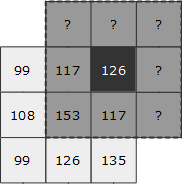
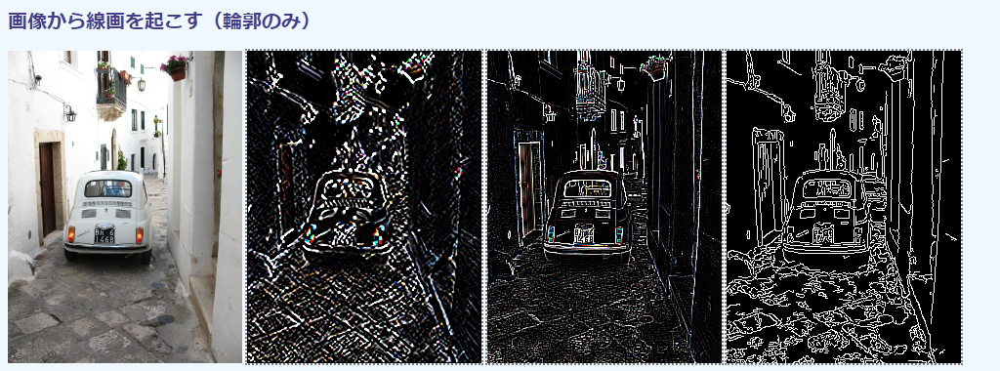
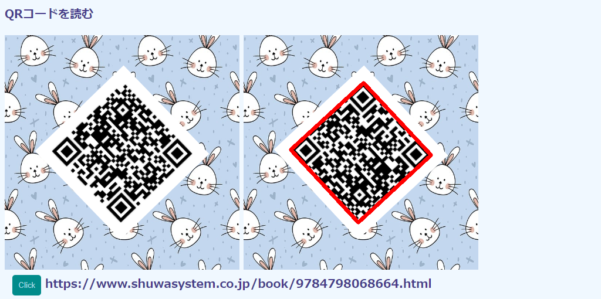
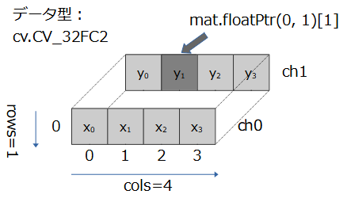
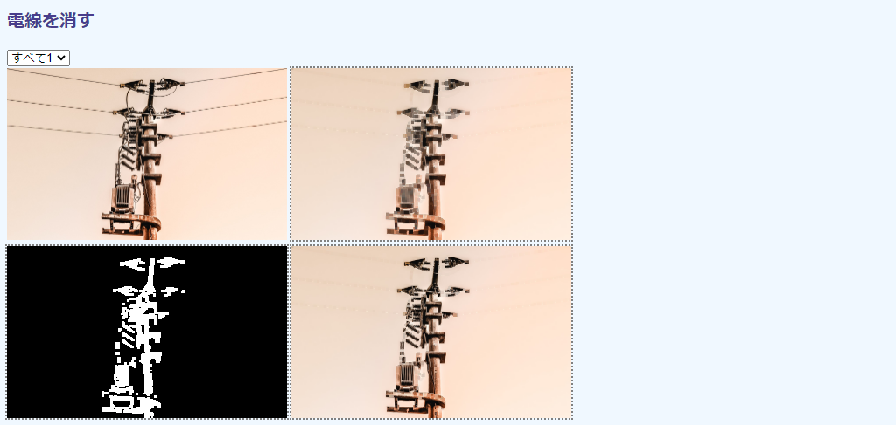
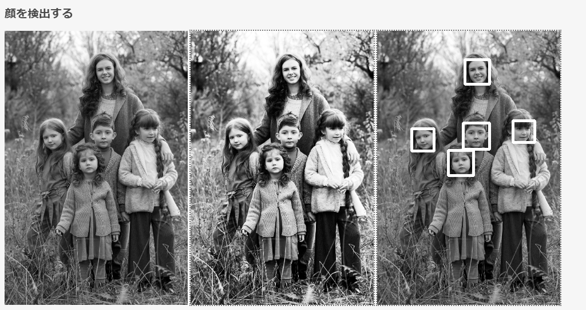

## 第6章 画像処理


### 6.1 一部領域をモザイク化する

#### 目的

画像の部分領域にモザイクをかけます。領域は、[2.7節](./02-ui.md#27-マウス操作で部分領域を切り取る "INTERNAL")で作成した`RegionSelect`を使ってマウス操作で選択します。モザイクの度合いはトラックバーから選択します。

技術的には、`cv.resize()`関数を使ったリサイズ操作です。画像を拡大しようと引っ張り伸ばすと、間に隙間ができます。この隙間を埋めるのにもっともシンプルな方法を使うと、結果がモザイク状になるという特徴を利用するわけです。画像の一部だけをリサイズするには[4.7節](./04-mat.md#47-部分領域だけ処理する "INTERNAL")のROIを使います。マウス操作で部分領域を選択するのには、

本節ではコードを2つに分けて説明します。第1のコードでは、`cv.resize()`の用法と各種の補間方法を確認します。第2のコードでは主題の部分モザイクがけを実装します。

実行例を次の画面に示します。まずは用法説明のコード①のものです。


左が元画像で、あえて横幅36ピクセルに縮小しています。右がこれを10倍に拡大したときのものです。

リサイズの補間方法はプルダウンメニューから選択でき、この画面では12個が用意されています。[3.2節](./03-opencv.md#32-OpenCVjsの定数と関数を調べる "INTERNAL")と同じ方法で`cv`オブジェクトから無批判に抽出しただけなので、`cv.resize()`では利用できないものもあります。その場合はコンソールにその旨表示され、選択は無視されます。ここで選択したのは`cv.INTER_LINEAR`という方法で、ぼけた画像になります。

部分モザイクのコード②の画面を次に示します。


左が元画像で、顔の部分を選択したところです。その隣に選択部分とそこにモザイクをかけた画像を表示しています。最も右が部分がモザイク化された様子を示しています。モザイクの度合いは下のトラックバーから選択します。

縮小率はモザイクの大きさを示しています。ややわかりにくいですが、コードは画像幅と高さをこの値でいったん割って（縮小）、それからもとに戻すことでモザイク化しているからです。縮小率が大きいほどモザイクが大きくなります。

#### コード①

用法説明のコード①`img-resize-1.html`は次の通りです。

```html
[File] img-resize1.html
  1  <!DOCTYPE html>
  2  <html lang="ja-JP">
  3  <head>
  4    <meta charset="UTF-8">
  5    <link rel=stylesheet type="text/css" href="style.css">
  6    <script async src="libs/opencv.js" type="text/javascript"></script>
  7  </head>
  8  <body>
  9
 10  <h1>一部領域をモザイク化する（補間方法）</h1>
 11
 12  <div>
 13    
 14    <canvas id="canvasTag" class="placeholder"></canvas>
 15  </div>
 16  <div>
 17    <select id="selectTag"></select>
 18  </div>
 19
 20  <script>
 21    let imgElem = document.getElementById('imageTag');
 22    let selectElem = document.getElementById('selectTag');
 23
 24    function addOptions() {
 25      let inter = Object.keys(cv).filter(prop => prop.startsWith('INTER_'));
 26      inter.forEach(function(e){
 27        let elem = new Option(e, cv[e]);
 28        selectElem.appendChild(elem);
 29      });
 30    }
 31
 32    function imgProc(evt) {
 33      let inter = cv.INTER_LINEAR;
 34      if (evt)
 35        inter = Number(evt.target.value);
 36      let src = cv.imread(imgElem);
 37      let dst = new cv.Mat();
 38      try {
 39        cv.resize(src, dst, new cv.Size(), 10, 10, inter);
 40      }
 41      catch(err) {
 42        console.log(`${inter} not supported`);
 43      }
 44      cv.imshow('canvasTag', dst);
 45      src.delete();
 46      dst.delete();
 47    }
 48
 49    var Module = {
 50      onRuntimeInitialized: function() {
 51        addOptions();
 52        selectElem.addEventListener('change', imgProc);
 53        imgProc();
 54      }
 55    }
 56  </script>
 57
 58  </body>
 59  </html>
```

#### 補間方法

補間（間を補う）とは、存在しないピクセルを周囲のピクセル値から推定する作業です。

画像の拡大から考えます。拡大とは、それまで隙間なく並べられていたピクセルの間を空け、そこに適当な値をあてはめる作業です。たとえば、①③⑤の順に横に並んでいたピクセルを①〇③〇⑤〇のように隙間を空ければ、画像サイズは倍になります（〇の中の数字はピクセル値）。

隙間を埋める値の決め方はいろいろ考えられます。

最も単純なアイデアは、左隣の値をそのまま繰り返すというものです。これで、①①③③⑤⑤という並びになります。この方法を最近傍補間、OpenCVの定数名では`cv.INTER_NEAREST`といいます。簡単で計算も早いのですが、極端に大きくすると滑らかだった線やグラデーションが階段状、つまりモザイクになるという問題が生じます。本節では、この問題を逆手にとってモザイク化を実現しています。

もう少し凝った手なら、前後のピクセルの平均値を取ります。これだと①②➂④⑤⑤となり、もともとの滑らな変化が維持されます。右端がその前隣の⑤と同じなのは、右端の外にはピクセルは存在しないので、繰り返すしかないからです。これが実行例で用いた`cv.INTER_LINEAR`です。この方法はスムーズな絵が得られますが、本来はくっきりとした輪郭線がぼやけます。たとえば、②②⑩⑩のように背景の②と前景の⑩が明確に分かれていたのが、②②②⑥⑩⑩⑩⑩と、②と⑩の間に中間点ができます。これがぼけです。

#### 補間方法定数

`cv.resize()`関数で使える補間方法は現在10個が定義されています。いずれも`cv`オブジェクト直下のプロパティです。コード①では、（お手軽という理由で）`<option>`をプログラム的に生成するために、これらプロパティを`Object.keys()`で機械的に取り出しています（24～30行目）。

```javascript
 22    let selectElem = document.getElementById('selectTag');
 23
 24    function addOptions() {
 25      let inter = Object.keys(cv).filter(prop => prop.startsWith('INTER_'));
 26      inter.forEach(function(e){
 27        let elem = new Option(e, cv[e]);
 28        selectElem.appendChild(elem);
 29      });
 30    }
```

25行目は[3.2節](./03-opencv.md#32-OpenCVjsの定数と関数を調べる "INTERNAL")で使った手で、補間方法定数名がINTER_で始まることを利用しています。すべてが必ずしも`cv.resize()`で使えるとはかぎらないのに加え、他にも`WARP_`で始まる定数が2点利用可能だったりするので、詳細はOpenCVのリファレンスマニュアルを参照してください。検索フィールドから「InterpolationFlags」を入力すれば見つかります。

よく用いられる補間方法定数を次の表に示します。

定数名 | 値 | 意味
---|---|---
`cv.INTER_NEAREST` | 0 | 最近傍補間。近所のピクセル値をそのまま使う。モザイク状になる。
`cv.INTER_LINEAR` | 1 | バイリニア補間（デフォルト）。両端の2点の間を一次関数（リニア）で補間する（画像は2次元なので縦横両方）。処理は早い。
`cv.INTER_AREA` | 3 | ピクセル領域関係を利用したリサンプリング。縮小時に使うとモアレが防げる。
`cv.INTER_CUBIC` | 2 | バイキュービック補間。`INTER_LINEAR`のさらに横の2点を加えて、4点を使って三次関数で補間する。拡大時にお勧め。
`cv.INTER_LANCZOS4` | 4 | ランチョスと読む（ハンガリー人物理学者の名前）。たいていのケースでよりよい結果が得られるので、チョイスに悩むときはこれを使う。ただし遅い。

#### cv.resize関数

画像の拡大縮小を行っているのが36～43行目です。

```javascsript
 36      let src = cv.imread(imgElem);
 37      let dst = new cv.Mat();
 38      try {
 39        cv.resize(src, dst, new cv.Size(), 10, 10, inter);
 40      }
 41      catch(err) {
 42        console.log(`${inter} not supported`);
 43      }
```

拡大縮小の`cv.resize()`関数を`try-catch`でくるんでいるのは、指定の補間方法（39行目末尾の`inter`）が利用できないものだったときの対処です。関数定義を次に示します。

<!-- FunctionDefinition cv.resize() 画像をリサイズする。 -->
```Javascript
cv.resize(                                  // 戻り値なし
    cv.Mat src,                             // 入力画像
    cv.Mat dst,                             // 出力画像
    cv.Size dsize,                          // リサイズ後のサイズ
    number fx = 0,                          // 横幅の倍率（浮動小数点数）
    number fy = 0,                          // 高さの倍率（浮動小数点数）
    number interpolation = cv.INTER_LINEAR  // 補間方法
);
```

第1引数`src`には入力画像の、第2引数`dst`には出力画像の`cv.Mat`をそれぞれ指定します。第2引数はあらかじめ`new cv.Mat()`で定義しておきます（37行目）。

第3引数`dsize`にはサイズを`cv.Size`から指定します。縦横のアスペクト比が元画像と異なるときは、縦あるいは横方向が引き延ばされます。ここでダミーの`new cv.Size()`を使っているのは、続く引数で倍率を指定しているからです。

第4引数`fx`と第5引数`fy`には横と縦の倍率を浮動小数点数から指定します。デフォルトの0なときは、第3引数の`dsize`が用いられます。指定されたときは第3引数は無視されます。

第6引数`interpolation`には、先述の補間方法を定数値から指定します。

#### コード②

部分領域モザイク化のコード②`img-resize-2.html`は次の通りです。

```html
[File] img-resize2.html
  1  <!DOCTYPE html>
  2  <html lang="ja-JP">
  3  <head>
  4    <meta charset="UTF-8">
  5    <link rel=stylesheet type="text/css" href="style.css">
  6    <script async src="libs/opencv.js" type="text/javascript"></script>
  7    <script async src="libs/regionselect.js" type="text/javascript"></script>
  8  </head>
  9  <body>
 10
 11  <h1>一部領域をモザイク化する</h1>
 12
 13  <div>
 14    
 15    <canvas id="canvasTagRoi" width="100" class="placeholder"></canvas>
 16    <canvas id="canvasTagMosaic" width="100" class="placeholder"></canvas>
 17    <canvas id="canvasTag" width="360" class="placeholder"></canvas>
 18  </div>
 19  <div>
 20    縮小率（2～30） <input type="range" id="rangeTag" min="2" value="10" max="30"/>
 21  </div>
 22
 23  <script>
 24    let imgElem = document.getElementById('imageTag');
 25    let rangeElem = document.getElementById('rangeTag');
 26    let region = [167, 56, 117, 102];
 27    let readyFlag = 0;
 28
 29    function imgProc(evt) {
 30      if (readyFlag != 3)
 31        return;
 32
 33      if (evt.type === 'regionselect')
 34        region = evt.detail;
 35
 36      let src = cv.imread(imgElem);
 37      let rect = new cv.Rect(...region);
 38      let roi = src.roi(rect);
 39      cv.imshow('canvasTagRoi', roi);
 40
 41      let scale = Number(rangeElem.value);
 42      let mat = new cv.Mat();
 43      cv.resize(roi, mat, new cv.Size(), 1/scale, 1/scale);
 44      cv.resize(mat, mat, new cv.Size(region[2], region[3]), 0, 0, cv.INTER_NEAREST);
 45      mat.copyTo(roi);
 46      cv.imshow('canvasTagMosaic', mat);
 47      cv.imshow('canvasTag', src);
 48
 49      [src, roi].forEach(m => m.delete());
 50    }
 51
 52    function resourceReady() {
 53      readyFlag |= 1;
 54      let rs = new RegionSelect('imageTag');
 55      imgElem.addEventListener('regionselect', imgProc);
 56      rangeElem.addEventListener('input', imgProc);
 57    }
 58
 59    function opencvReady() {
 60      readyFlag |= 2;
 61      rangeElem.dispatchEvent(new InputEvent('input'));
 62    }
 63
 64    window.addEventListener('load', resourceReady);
 65    var Module = {
 66      onRuntimeInitialized: opencvReady
 67    }
 68  </script>
 69
 70  </body>
 71  </html>
```

領域選択の`regionselect.js`（7、64行目）と`opencv.js`（6、65～67行目）の両方が準備できていないと処理はできないので、準備状況を示すビットフラグを用意しています（27行目）。前者が読み込まれれば1ビット目に、後者が用意できれば2ビット目にそれぞれ1を立てています（53、60行目）。処理関数ではどちらかのビットが立っていなければ、なにもせずに呼び出しもとに戻ります（30～31行目）。


#### cv.resizeの第2引数

まず、読み込んだ画像にROIを設定します（38行目）。[4.7節](./04-mat.md#47-部分領域だけ処理する "INTERNAL")で説明したように、画像処理をROIだけに適用すれば、それ以外の領域には影響を与えません。

```javascript
 36      let src = cv.imread(imgElem);
 37      let rect = new cv.Rect(...region);
 38      let roi = src.roi(rect);
```

続いて、このROIをいったん指定の縮小率で縮小し（43行目）、またもとの大きさに拡大します（44行目）。拡大時には`cv.INTER_NEAREST`を使うことで、あえてモザイク状にします。

```javascript
 42      let mat = new cv.Mat();
 43      cv.resize(roi, mat, new cv.Size(), 1/scale, 1/scale);
 44      cv.resize(mat, mat, new cv.Size(region[2], region[3]), 0, 0, cv.INTER_NEAREST);
```

`cv.resize()`を利用するまえに、第2引数で出力を受ける`cv.Mat()`を用意します（42行目）。

本書のコードでは、`cv.blur(src, src, ...)`のように入力画像に出力をそのまま上書きする書き方をしばしば使っています。同じオブジェクトを使えば、無用に`cv.Mat`を増やさなくてよいからです（消し忘れも減ります）。しかし、`cv.resize()`ではこれはできません。出力のサイズが異なるので、同じところに上書きできないからです。したがって、この第2引数の`mat`は、ROIとは別のオブジェクトとなります。そこで、縮小拡大後のこのブジェクトの中身は、明示的にROIに戻さなければなりません。これをやっているのが45行目です。

```javascript
 45      mat.copyTo(roi);
```

このように、関数を使ったときはだれがどのタイミングで`cv.Mat`を再利用するのか新規生成をするのがわかりにくくなっています。ROIに処理結果が反映していないときは、上書き処理をしていないか確認してください。


### 6.2 画像をぼかす

#### 目的

画像をぼけさせます。

これまで、ぼけといってきましたが、正確には平滑化（スムージング）処理と呼ばれます。しみやそばかすなどの皮膚のでこぼこを周囲に自然に溶け込ませることで目立たなくする、美肌効果があります。昔の映画でソフトフォーカスと呼ばれていた効果に似ています。

技術的には、4種類の平滑化関数`cv.blur()`、`cv.GaussianBlur()`、`cv.medianBlur()`、`cv.bilateralFilter()`を取り上げます。名称は順に平均化フィルタ、ガウス平滑フィルタ、中間値フィルタ、バイラテラルフィルタです。どれにも「フィルタ」と付いているのは、これらがターゲットのピクセルを色眼鏡で見るかのように「フィルタをかけ」ることによって変更するからです。

関数にいくつもあるパラメータと効果の関連性を理解するため背景の理論も簡単に説明します。平滑化処理は、画像上のノイズなど細かく不要な要素を取り除くことで、続く別の処理の効果を高めるのによく用いられます。

実行例を次の画面に示します。


左側が元画像、右側が平滑化処理後の画像です。ここでは平均化処理（`cv.blur()`）を用いています。効果がわかりやすくなるよう、あえてぼけの多くなるパラメータを用いています。

プルダウンメニューからは他の3つの方法を選択できます。次にそれらの結果を示します。

<!-- いずれも 360x202 -->

ガウス平滑化フィルタ | 中間値フィルタ | バイラテラルフィルタ
---|---|---
 |  | 

左から順にガウス平滑化フィルタ、中間値フィルタ、バイラテラルフィルタのものです。ガウス平滑化フィルタは平均化のものとあまり変わりありませんが、後者2点はアニメ絵のように領域内で色合いがまとまった感じになります。これら2点の間で比較すると、中間値では輪郭がぼけているのに対し、バイラテラルではしっかりしています。

#### コード

コード`img-blur.html`は次の通りです。

```html
[File] img-blur.html
  1  <!DOCTYPE html>
  2  <html lang="ja-JP">
  3  <head>
  4    <meta charset="UTF-8">
  5    <link rel=stylesheet type="text/css" href="style.css">
  6    <script async src="libs/opencv.js" type="text/javascript"></script>
  7  </head>
  8  <body>
  9
 10  <h1>画像をぼかす</h1>
 11
 12  <div>
 13    
 14    <canvas id="canvasTag" class="placeholder"></canvas>
 15  </div>
 16  <div>
 17    <select id="selectTag">
 18      <option value="blur">平均化</option>
 19      <option value="gaussian">ガウス平滑化</option>
 20      <option value="median">中間値フィルタ</option>
 21      <option value="bilateral">バイラテラルフィルタ</option>
 22    </select>
 23  </div>
 24
 25
 26  <script>
 27    let imgElem = document.getElementById('imageTag');
 28    let selectElem = document.getElementById('selectTag');
 29
 30    function imgProc(evt) {
 31      let filter = 'blur';
 32      if (evt)
 33        filter = evt.target.value;
 34      console.log(`Filter: ${filter}`);
 35
 36      let src = cv.imread(imgElem);
 37      cv.cvtColor(src, src, cv.COLOR_RGBA2RGB);
 38      let dst = new cv.Mat();
 39      let ksize = 7;
 40      let ksizeBox = new cv.Size(ksize, ksize);
 41
 42      switch(filter) {
 43      case 'blur':
 44        cv.blur(src, dst, ksizeBox);
 45        break;
 46      case 'gaussian':
 47        cv.GaussianBlur(src, dst, ksizeBox, 5.0);
 48        break;
 49      case 'median':
 50        cv.medianBlur(src, dst, ksize);
 51        break;
 52      case 'bilateral':
 53        cv.bilateralFilter(src, dst, ksize, 75, 75, cv.BORDER_DEFAULT);
 54      default:
 55        break;
 56      }
 57
 58      cv.imshow('canvasTag', dst);
 59      src.delete();
 60      dst.delete();
 61    }
 62
 63    function opencvReady() {
 64      selectTag.addEventListener('change', imgProc);
 65      imgProc();
 66    }
 67
 68    var Module = {
 69      onRuntimeInitialized: opencvReady
 70    }
 71  </script>
 72
 73  </body>
 74  </html>
```

#### フィルタ

フィルタをかける、というのは、数学的には画像を表現する行列とフィルタを表現する行列の間で乗算を行うことです。ただ、普通の定数倍や高校数学で学ぶ行列乗算とやや異なり、畳み込み演算というちょっと変わった乗算を使います。

畳み込み演算の手順を次の図から説明します。

<!-- 原画は ODG にあり。759 x 208 -->


左が画像を表す行列で、今、中心にあるピクセルを変換しようとしています。この中心を注目ピクセル、周辺の8つのピクセルを含めたエリアを注目領域といいます。その右にあるのは左と同じサイズの行列で、要素はすべて1/9です。

まず、これら2つの行列の間で互いに同じ位置にあるピクセル同士で掛け算をし、その和を注目ピクセルと同じ位置に書き込みます。左上では99×1/9＝11です。この掛け算の結果が3番目の行列です。最後に、この行列要素の和を取り、別の行列の注目ピクセルに書き込みます。これが右端のものです。この処理を、対象の画像の左上から右下まですべてのピクセルについて行うのが、畳み込み演算です。

2番目の行列をフィルタ、あるいはカーネルと呼びます。図のカーネルの要素はすべて1/9です。この畳み込み演算はつまり、注目領域のすべてのピクセル値の和を取り、要素数で割っていることに他なりません。これは平均の計算です。

このフィルタのサイズを変更したり、要素の値を変化させることで、いろいろな変換が可能になります。

カラーやアルファチャネル付き画像では、各チャネルをそれぞれ独立したものとして操作します。ピクセルの入れ替えなので、入力と出力の画像のサイズもデータ型も同じです。

#### 平均化フィルタ

44行目の`cv.blur()`関数は、要素を要素数の逆数で埋めたフィルタを用いることで周辺ピクセルの平均値で注目ピクセルを置き換えます。

```javascript
 39      let ksize = 7;
 40      let ksizeBox = new cv.Size(ksize, ksize);
 ︙
 44        cv.blur(src, dst, ksizeBox);
```

一定の枠内の平均で値を置き換える操作は、一次元なら、株価や為替でみる移動平均と同じ効果です。移動平均で区間を長くとるとカーブがよりスムーズにになるのと同じく、フィルタのサイズを大きくすれば、画像がより平滑化されます。

`cv.blur()`関数の定義を次に示します。

<!-- FunctionDefinition cv.blur() 画像を平滑化する。 -->
```Javascript
cv.blur(                                    // 戻り値なし
    cv.Mat src,                             // 入力画像
    cv.Mat dst,                             // 出力画像
    cv.Size ksize,                          // フィルタのサイズ
    cv.Point anchor = cv.Point(-1, -1),     // アンカーポイント
    number borderType = cv.BORDER_DEFAULT   // 画像端でのピクセルの外挿方法
);
```

第1引数`src`は入力の、第2引数`dst`は出力の、それぞれ`cv.Mat`です。第2引数の`cv.Mat`はあらかじめ定義しておかなければなりませんが、メモリ領域は関数が自動的に確保してくれます。

第3引数`ksize`はフィルタのサイズで、`cv.Size`から縦横のサイズを指定します。ここでは7×7を使っているので、`new cv.Size(7, 7)`です（40行目）。`ksize`のkはカーネルのkです。フィルタの形にとくに制約はなありませんが、意図的に変わったことをしようと思っているのでなければ、たいていは正方形です。また、たいていは奇数です。奇数だと、中心の注目ピクセルがしっかりと定まるからです。

第4引数`anchor`は注目ピクセルの位置です。デフォルトの(-1, -1)のときはフィルタの中央で、これも、凝ったことをしているのでなければデフォルトのまま使います。

第5引数`borderType`には画像端でのピクセルの推定方法を指定します。

#### 画像端外挿方法

畳み込み演算を行うには、注目ピクセルの周りに他のピクセルが必要です。しかし、次の図に示すように、画像端になると外部にはピクセルがありません。

<!-- 原画は ODG にあり。192 x 190 -->


そこで、不明なところは外挿します。外挿方法には次の表に示すものがあります。

<!-- BORDER_WARP は blur() と GaussianBlur() でサポートされていないので削除 -->
<!-- `cv.BORDER_WARP` | ピクセルが同じパターンで繰り返されるとしてコピー | 5678｜12345678｜1234 -->

外挿定数 | 意味 | 例
---|---|---
`cv.BORDER_CONSTANT` | 外側のピクセル値を0などの一定の値とする | 0000｜12345678｜ 0000
`cv.BORDER_REPLICATE` | 境界にあるピクセルの値を外側に繰り返しコピーする | 1111｜12345678｜8888
`cv.BORDER_REFLECT` | 境界を境にピクセル値を鏡像のように値をコピーする | 4321｜12345678｜8765
`cv.BORDER_REFLECT_101` | 上と同じだが、境界の値が繰り返されない | 5432｜12345678｜7654
`cv.BORDER_DEFAULT` | `cv.BORDER_REFLECT_101`と同じ | 5432｜12345678｜7654

例の列では、パイプ2本の間にある8つの数字がピクセル値で、その左右外側が外挿値です。`cv.resize()`のデフォルトは`cv.BORDER_DEFAULT`で、これは`cv.BORDER_REFLECT_101`と同じパターンです。

#### ガウス平滑化フィルタ

47行目の`cv.GaussianBlur()`関数は、注目ピクセルにはよりウェイトを置き、そこから離れたピクセルには平均値への寄与を少なくするようにした、重み付け平均を取ります。

```javascript
 47        cv.GaussianBlur(src, dst, ksizeBox, 5.0);
```

重み付けの値は、中心からの距離にしたがって減るように次の式のガウス関数を使います。

$$ g(r) = a\ exp( - \frac{(r - \mu)^2}{2 \sigma^2 }) $$

$a$ は定数、 $r$ は注目ピクセルからの距離、 $\mu$ は注目領域の平均値、 $\sigma$ は標準偏差です。 $\sigma$ は試験の成績で見る偏差値のことで、1.0が偏差値10個ぶん（40または60）に相当します。

ガウス関数は次の図が示すように吊り鐘上になっています（偏差値でよく見る正規分布です）。 $\sigma$ の値が小さくなればなるほど吊り鐘はとがり、したがって注目ピクセルから外れたところの寄与が減ります。反対に、 $\sigma$ の値が大きくなればなるほど吊り鐘はフラットになり、遠方のピクセルが結果に寄与する度合いが大きくなります。

<!-- 原画は xlsx にあり。 1059 x 502 -->


`cv.GaussianBlur()`関数の書式を次に示します。

<!-- FunctionDefinition cv.GassianBlur() ガウス関数を使って画像を平滑化する。 -->
```Javascript
cv.GaussianBlur(                            // 戻り値なし
    cv.Mat src,                             // 入力画像
    cv.Mat dst,                             // 出力画像
    cv.Size ksize,                          // フィルタのサイズ
    number sigmaX,                          // x方向のσ
    number sigmaY = 0,                      // y方向のσ
    number borderType = cv.BORDER_DEFAULT   // 画像端でのピクセルの外挿方法
);
```

第1引数`src`、第2引数`dst`、第3引数`ksize`、第6引数`borderType`は`cv.blur()`と同じです。

第4引数`sigmaX`はx方向の標準偏差で、大きければボケが大きく、小さければボケが小さくなります。第5引数はy方向のもので、デフォルトの0を指定すると、`sigmaX`と同じ値が取られます。どちらも0にすると、`ksize`から適当に決められます。

#### 中間値フィルタ

50行目の`cv.medianBlur()`関数は、注目領域内のピクセルの中間値で注目ピクセルを置き換えます。

```javascript
 50        cv.medianBlur(src, dst, ksize);
```

中間値（メディアン）は値を順番に並べ、ちょうど中間になる値を採用する統計的な測度です。しばしば、給与や資産など偏りがいびつで、平均があまり意味をなさないデータの統計で用いられます。

平均値、ガウス平滑化フィルタは正方行列で表現できますが、中間値フィルタは並べ替えを伴うので畳み込みでは計算できません。線形代数では解けないので、非線形フィルターと呼ばれます。

関数の書式を次に示します。

<!-- FunctionDefinition cv.medianBlur() 中間値フィルタを用いて画像を平滑化する。 -->
```Javascript
cv.medianBlur(                              // 戻り値なし
    cv.Mat src,                             // 入力画像
    cv.Mat dst,                             // 出力画像
    cv.Size ksize                           // フィルタのサイズ
);
```

引数はいずれもこれまでと同じです。フィルタ内部の値だけで計算が完結するので、ピクセル外挿が必要ありません。

ただ、フィルタサイズにはやや妙な制限が加わっています。まず3以上の奇数しか使えません。3×3あるいは5×5ならビット深度が`cv.CV_8U`、`cv.CV_16U`、`cv.CV_32F`の画像が使えますが、それ以上なら`cv.CV_8U`以外はエラーになります。

#### バイラテラルフィルタ

53行目の`cv.bilateralFilter()`関数はバイラテラルフィルタという、ガウス関数をもう一段複雑にした関数を用います。バイラテラル（bilateral）という英語には、両面や両側や互恵的といった訳語が与えられています。

```javascript
 53        cv.bilateralFilter(src, dst, ksize, 75, 75, cv.BORDER_DEFAULT);
```

ガウス関数は、注目ピクセルからの距離が近いか遠いかによって重み付けを変えて平均を取りました。バイラテラルはこれに加えて、注目ピクセルの値に近いか遠いかにも着目します。距離を相手にしている前者を空間方向、ピクセル値を考慮する後者を色方向といいます。

関数の形はガウス関数の指数関数を2つ乗じた格好になっています。目的のところで述べたように輪郭が出やすくなるのは、この色方向の距離を考慮しているからです。輪郭は、前景と背景、あるいは2つの物体や色の間の仮想的な線です（アニメや漫画ではないので、実世界の人の輪郭には線は描かれていません）。したがって、輪郭をはさんだピクセル値はそれぞれの物体の中よりも大きく離れています。バイラテラルフィルタは、その差が大きければ値を温存する方向に動きます。

輪郭については次節でもっと取り扱います。

関数の書式を次に示します。

<!-- FunctionDefinition cv.bilateralFilter() バイラテラルフィルタを用いて画像を平滑化する。 -->
```Javascript
cv.bilateralFilter(                         // 戻り値なし
    cv.Mat src,                             // 入力画像
    cv.Mat dst,                             // 出力画像
    cv.Size ksize,                          // フィルタのサイズ
    number sigmaColor,                      // 空間方向のσ
    number sigmaSpace,                      // 空間方向のσ
    number borderType = cv.BORDER_DEFAULT   // 画像端でのピクセルの外挿方法

);
```

第4引数が色方向用の`sigmaColor`、第5引数が空間方向用の`sigmaSpace`に置き換わっている以外は、引数は`cv.GaussianBlur()`と同じです。

ただし、入力画像は1チャネルか3チャネルでなければなりません。37行目であらかじめRGBAからRGBにしているのはこれが理由です。

```javascript
 36      let src = cv.imread(imgElem);
 37      cv.cvtColor(src, src, cv.COLOR_RGBA2RGB);
```

OpenCVリファレンスは $\sigma$ の値に10未満の値を指定しても大して効果はなく、150より大きいと効果が絶大すぎてアニメ絵に近くなると述べています。なお、コードで用いている75という値は、OpenCVのチュートリアルからそのまま取ってきたものです。

参考までに、 $\sigma$ を50、75（再掲）、150にしたときの結果を次に左から順に示します。

<!-- いずれも 360x202。img-blur-4.png は再掲。HTML table や md | 内では LaTeX モードは受け付けない -->

σ＝50 | σ＝75 | σ＝150
---|---|---
 |  | 


### 6.3 線画を生成する
<!-- 残念ながら、OpenCV.js には cv.stylization()、cv.pencilSketch()、cv.edgePreservingFilter()、cv.detailEnhanve() といった Non-photorealistic 系は実装されていない。-->

#### 目的

画像から黒地に白い線の線画を生成します。また、前節のバイラテラルフィルタで元画像をアニメ絵っぽくしたうえで、その上に線を重畳することで、輪郭線付きのアニメ絵風にします。

技術的には、線画は画像の「エッジ」を検出することで得られます。この処理は、ピクセル列に対して微分を施すフィルタを用いて畳み込み演算を施すことで行われます。どのようなフィルタかはおいおい説明します。

本節ではコードを2つに分けて説明します。第1のコードでは、OpenCVの画像微分フィルタ関数`cv.Sobel()`、`cv.Laplacian()`、`cv.Canny()`を適用し、それぞれのできばえを比較します。第2のコードでは輪郭付きアニメ絵風を生成します。

実行例を次の画面に示します。まずは微分フィルタ関数比較のコード①のものです。



左から元画像、Sobel、Laplacian、Cannyです。カタカナ読みすると順にソベル、ラプラシアン、キャニーで、いずれも開発者の人名から来ています。ソベルはかなり粗いですが、ラプラシアンとキャニーはなかなかです。

輪郭付きアニメ絵風のコード②の画面を次に示します。


左が元画像、中央がキャニーの結果の白黒を反転させることで輪郭線を黒にしたものです。右が輪郭付きアニメ絵風で、元画像を`cv.bilateralFilter()`で処理し、それを中央の画像をマスクとして背景灰色の画像に貼り付けています（マスクについては[5.8節](./05-colors.md#58-背景を入れ替える（輝度調整付き） "INTERNAL")参照）。

#### エッジ検出の原理

画像のエッジ（輪郭線）は、背景と前景の境界線でピクセル値が大きく変化するという仮定をもとに抽出されます。

エッジ検出の原理を、白い前景がグレーの背景に写っている次の模式的な画像から考えます。データ型は1チャンネル8ビット符号なし整数（`cv.CV_8UC1`）としているので、ピクセル値の範囲は0～255です。

<!-- xlsx に原画あり。969x303 -->


左図が元画像です。水平方向で切り取った5行目の黒枠に着目します。ピクセル値の並びは31、16、21、29、249、215、244、239、254、208で、グレー地と白い物体の境目で値が29から249へと急激に変化することがわかります。その前後ではブレはあるものの、だいたいおなじ値が連続しています。

中央図では、それぞれのピクセルについて、その左側のピクセルとの差分を計算しています。デジタルなのでただの引き算ですが、連続したアナログ値と考えると、これは微分操作です。左端のピクセルには左側のピクセルがないので0とします。これにより、変化量がわかります。差がとくに大きい箇所だけ太字で強調してあります。

右図は、変化差の大きいピクセルの値を255（白）、それ以外を0（黒）に変えています。これがエッジです。

OpenCVには、いろいろな場面に対応できる高度なエッジ検出メカニズムがいくつか用意されています。`cv.Sobel()`は上述の通り微分を1回かける操作を施します。`cv.Laplacian()`は微分を2回、つまり2階微分をかけます。ソベルを距離÷時間の速度と考えれば、ラプラシアンは距離を時間で2回割った加速度に相当します。

#### コード①

3つのエッジ検出関数を使ったエッジ検出のコード①`img-edge1.html`は次の通りです。

```html
[File] img-edge1.html
  1  <!DOCTYPE html>
  2  <html lang="ja-JP">
  3  <head>
  4    <meta charset="UTF-8">
  5    <link rel=stylesheet type="text/css" href="style.css">
  6    <script async src="libs/opencv.js" type="text/javascript"></script>
  7  </head>
  8  <body>
  9
 10  <h1>線画の生成（輪郭のみ）</h1>
 11
 12  <div>
 13    
 14    <canvas id="canvasTag1" class="placeholder"></canvas>
 15    <canvas id="canvasTag2" class="placeholder"></canvas>
 16    <canvas id="canvasTag3" class="placeholder"></canvas>
 17  </div>
 18
 19  <script>
 20    let imgElem = document.getElementById('imageTag');
 21
 22    function imgProc() {
 23      let src = cv.imread(imgElem);
 24      cv.cvtColor(src, src, cv.COLOR_RGBA2GRAY);
 25
 26      let edge = new cv.Mat();
 27      cv.Sobel(src, edge, cv.CV_8U, 1, 1, 5);
 28      cv.imshow('canvasTag1', edge);
 29
 30      cv.Laplacian(src, edge, cv.CV_8U, 3);
 31      cv.imshow('canvasTag2', edge);
 32
 33      cv.Canny(src, edge, 50, 150);
 34      cv.imshow('canvasTag3', edge);
 35
 36      [src, edge].forEach(m => m.delete());
 37    }
 38
 39    var Module = {
 40      onRuntimeInitialized: imgProc
 41    }
 42  </script>
 43
 44  </body>
 45  </html>
```

#### cv.Sobel関数

27行目では、`cv.Sobel`関数を使ってエッジを検出しています。1次微分関数です。

```javascript
 24      cv.cvtColor(src, src, cv.COLOR_RGBA2GRAY);
 25
 26      let edge = new cv.Mat();
 27      cv.Sobel(src, edge, cv.CV_8U, 1, 1, 5);
 28      cv.imshow('canvasTag1', edge);
```

24行目で入力画像をモノクロに変換しています。本節のエッジ検出関数はいずれも8ビット符号なし整数（`cv.CV_8U`）ならなんでも受け付けます。操作をどのチャネルにも等しく適用するだけだからです。アルファチャネルもです。

しかし、RGBAのまま処理をすると結果が見えなくなります。RGB画像に加わったすべて255のアルファチャネルでは、（定数なので）1次でも2次でも微分を取ると0です。そして、すべて0のアルファチャネルは完全透明という意味なので、キャンバスに表示してもなにも見えません。ここでは事前にモノクロに変換していますが、せめて`cv.COLOR_RGBA2RGB`で3チャネルにへ変換しておきます。

関数の定義を次に示します。

<!-- FunctionDefinition cv.Sobel() 1次微分をかけることで画像のエッジを抽出する。-->
```Javascript
cv.Sobel(                                   // 戻り値なし
    cv.Mat src,                             // 入力画像
    cv.Mat dst,                             // 出力画像
    number ddepth,                          // 出力画像のビット深度
    number dx,                              // x方向にかける微分の回数
    number dy,                              // y方向にかける微分の回数
    number ksize = 3,                       // フィルタサイズ
    number scale = 1,                       // 倍数
    number delta = 0,                       // 加算数
    number borderType = cv.BORDER_DEFAULT   // 画像端でのピクセルの推定方法
);
```

第1引数`src`には入力画像の、第2引数`dst`には出力画像をそれぞれ指定します。画像のチャネル数にはとくに制限はありません。複数チャネルなら、それぞれ個別に処理されます。

第3引数`ddepth`には出力画像のビット深度を定数から指定します。8ビット符号なし整数なら`cv.CV_8U`です。

第4引数`dx`と第5引数`dy`は、それぞれX方向（水平）とy方向（垂直）に何回微分をかけるか指定します。`dx`に1を指定すると、水平方向に1回微分をかけるので、縦線が抽出されます。`dy`に1なら横線が抽出されます。ここではともに1を指定しているので、縦横の線を検出します。

第5引数`ksize`にはフィルタサイズを指定します。`cv.Sobel()`も中身は畳み込みフィルタなので、フィルタサイズは[6.2節](#62-画像をぼかす "INTERNAL")の線形フィルタで説明したものと同じですが、1、3、5、7だけしか使えません。オプションなので、27行目のように未指定ならば3が選択されるので、3×3行列が用いられます。

行列の中身は、3×3なら次のように構成されています（ $M_x$ がx方向の、 $M_y$ がy方向のもの）。

$$M_x = \begin{pmatrix}
  −1 & 0 & 1 \\
  -2 & 0 & 2 \\
  -1 & 0 & 1
\end{pmatrix},\  M_y = \begin{pmatrix}
  −1 & −2 & −1 \\
  0 & 0 & 0 \\
  1 & 2 & 1
\end{pmatrix}$$

第6引数`scale`と第7引数`delta`は得られた結果のピクセルの輝度を補正するため、定数倍と定数加算を行います。デフォルトはそれぞれ1と0なので、補正なしという意味です。

第7引数`borderType`にが画像外郭のピクセル値を外挿する方法を定数から指定します。外挿方法は[6.2節](#62-画像をぼかす "INTERNAL")で説明しました。

ソベルフィルタの原理は前述の通りですが、より詳しいことは、次にURLを示すOpenCVチュートリアルで説明されています。

```https://docs.opencv.org/4.8.0/d2/d2c/tutorial_sobel_derivatives.html```

#### cv.Laplacain関数

30行目では、`cv.Laplacian`関数を使ってエッジを検出しています。2次微分関数です。

```javascript
 30      cv.Laplacian(src, edge, cv.CV_8U, 3);
```

関数の定義を次に示します。

<!-- FunctionDefinition cv.Laplacian() 2次微分をかけることで画像のエッジを抽出する。-->
```Javascript
cv.Laplacian(                               // 戻り値なし
    cv.Mat src,                             // 入力画像
    cv.Mat dst,                             // 出力画像
    number ddepth,                          // 出力画像のビット深度
    number ksize = 1,                       // フィルタサイズ
    number scale = 1,                       // 倍数
    number delta = 0,                       // 加算数
    number borderType = cv.BORDER_DEFAULT   // 画像端でのピクセルの推定方法
);
```

引数は前出の`cv.Sobel()`から`dx`、`dy`を抜いただけです。第4引数の`ksize`がデフォルトの1のときは、次の3×3行列が用いられます。

$$M = \begin{pmatrix}
  0 & 1 & 0 \\
  1 & -4 & 1 \\
  0 & 1 & 0
\end{pmatrix}$$

#### cv.Canny関数

34行目では、`cv.Canny`関数を使ってエッジを検出しています。

```javascript
 24      cv.cvtColor(src, src, cv.COLOR_RGBA2GRAY);
 ︙
 30      cv.Laplacian(src, edge, cv.CV_8U, 3);
```

関数の定義を次に示します。

<!-- FunctionDefinition cv.Canny() キャニー法を用いたエッジ検出。-->
```Javascript
cv.Canny(                                   // 戻り値なし
    cv.Mat image,                           // 入力画像（cv.CV_8U）
    cv.Mat edges,                           // 出力画像（cv.CV_8UC1）
    number threshold1,                      // 第1閾値（0～255）
    number threshold2,                      // 第2閾値（0～255）
    number apertureSize = 3,                // カーネルサイズ（3、5、7）
    boolean	L2gradient = false              // L2ノルムフラグ
);
```

キャニーエッジ検出の基本はソベルと同じ1次微分フィルタですが、精度向上のための仕掛けがいくつか組み込まれています。関数引数に関係してくるので、やや細かいですが処理手順を順に説明します。

1. ガウス平滑化フィルタ（[6.2節](#62-画像をぼかす "INTERNAL")）をかけることでノイズを除去します。内部で自動的に行っているので、引数には関係しません。
2. ソベルフィルタをxとy方向にかけます。第5引数の`apartureSize`がこのときのフィルタサイズです。`cv.Sobel()`のフィルタサイズには1～7の奇数のみしか指定できないので、ここでもこの制約が適用されます。
3. 結果からエッジの強度（大きさ）と方向を計算します。
4. 線と線が重なると太くなってしまいます。そこで、重なりのあるところは1本の細線にします。
5. 3で計算した強度と2つの閾値を比較し、それがエッジあるかを判断します。このときに用いるのが第3引数`threshold1`と第4引数`threshoold2`です。一方が他方より大きければよいので、順番は入れ替えてもかまいません。判断基準を次に示します。エッジ強度を $G$、閾値大は $\theta_l$、閾値小は $\theta_s$ と書いています。

エッジ強度と閾値の関係 | 判定
---|---
$G \ge \theta_l$ | エッジと判定
$G \le \theta_s$ | エッジではないと棄却
$\theta_s \leq G \leq \theta_l$ | 他のエッジピクセルと隣り合わせになっていればエッジと判定。でなければ棄却。

閾値小をあまり低い値にするとノイズをエッジと誤検出しやすくなり、閾値大を高い値にするとエッジを見逃しやすくなります。

第6引数`L2gradient`はステップ3のエッジの大きさの計算方法を指定するもので、L1ノルムとL2ノルムから選びます。L1なら`false`を指定します。こちらがデフォルトです。`true`ならL2です。

ノルムというのは距離のことで、次に示す図では左下の点から右上の点に移動するとき距離です。

<!-- ODG に原画あり。564x212 -->


左はL2ノルムで、対角線を突っ切って始点から終点に行ったときの直線距離です。横と縦の二乗和の平方根から計算できます。右がL1ノルムで、あみだくじのように格子線を通って終点に向かいます。道路が正確な碁盤の目状なら、どの経路でも横と縦の移動距離の和から計算できます。わたしたちは碁盤の目の街というと京都をイメージしますが、ニューヨークのマンハッタンが代表的ということで、これをマンハッタン距離ともいいます。L1は引き算と絶対値演算だけで計算できるので、L2に比べて高速です。

Cannyアルゴリズムは、OpenCVチュートリアルの「Canny Edge Detection」に詳しく説明されています。興味のあるかたは、次のURLから参照してください。

```https://docs.opencv.org/4.8.0/da/d5c/tutorial_canny_detector.html```

#### コード②

輪郭付きアニメ絵風のコード②`img-edge2.html`は次の通りです。

```html
[File] img-edge2.html
  1  <!DOCTYPE html>
  2  <html lang="ja-JP">
  3  <head>
  4    <meta charset="UTF-8">
  5    <link rel=stylesheet type="text/css" href="style.css">
  6    <script async src="libs/opencv.js" type="text/javascript"></script>
  7  </head>
  8  <body>
  9
 10  <h1>線画の生成（元画像付き）</h1>
 11
 12  <div>
 13    
 14    <canvas id="canvasTag1" class="placeholder"></canvas>
 15    <canvas id="canvasTag2" class="placeholder"></canvas>
 16  </div>
 17
 18  <script>
 19    let imgElem = document.getElementById('imageTag');
 20
 21    function imgProc() {
 22      let src = cv.imread(imgElem);
 23      cv.cvtColor(src, src, cv.COLOR_RGBA2RGB);
 24
 25      let edge = new cv.Mat();
 26      cv.cvtColor(src, edge, cv.COLOR_RGB2GRAY);
 27      cv.Canny(edge, edge, 50, 150);
 28      cv.bitwise_not(edge, edge);
 29      cv.imshow('canvasTag1', edge);
 30
 31      let color = new cv.Scalar(50, 50, 50);
 32      let bg = new cv.Mat(imgElem.height, imgElem.width, cv.CV_8UC3, color);
 33
 34      let fg = new cv.Mat();
 35      cv.bilateralFilter(src, fg, 7, 75, 75, cv.BORDER_DEFAULT);
 36
 37      fg.copyTo(bg, edge);
 38      cv.imshow('canvasTag2', bg);
 39
 40      [src, edge, bg, fg].forEach(m => m.delete());
 41    }
 42
 43    var Module = {
 44      onRuntimeInitialized: imgProc
 45    }
 46  </script>
 47
 48  </body>
 49  </html>
```

#### 要領

輪郭付きアニメ絵風画像は`cv.Canny()`と`cv.bilateralFilter()`の組み合わせで生成します。

①`img-edge1.html`同様、`cv.Canny()`でエッジ検出をします（27行目）。このエッジ画像は、背景が黒、エッジが白です。

```javascript
 25      let edge = new cv.Mat();
 26      cv.cvtColor(src, edge, cv.COLOR_RGB2GRAY);
 27      cv.Canny(edge, edge, 50, 150);
```

②エッジ画像はマスクに使います。エッジ部分以外を前景として元画像をコピーしたいので、背景を白、エッジを黒に反転します（28行目)。

```javascript
 28      cv.bitwise_not(edge, edge);
```

③単一色で染めた、元画像と同じサイズの画像を用意します（29行目）。この色が線色になります。ここでは(50, 50, 50）のやや濃い目のグレーを用いています。

```javascript
 31      let color = new cv.Scalar(50, 50, 50);
 32      let bg = new cv.Mat(imgElem.height, imgElem.width, cv.CV_8UC3, color);
```

④元画像に`cv.bilateralFilter()`をかけることで、アニメ絵風にします（35行目）。

```javascript
 34      let fg = new cv.Mat();
 35      cv.bilateralFilter(src, fg, 7, 75, 75, cv.BORDER_DEFAULT);
``` 

④元画像を、②の反転エッジ画像をマスクに用いて③の画像にコピーします。エッジ部分は黒なのでそこだけ背景色が残り、あとは元画像で埋められます。

```javascript
 37      fg.copyTo(bg, edge);
``` 

### 6.4 QRコードを読む
<!-- OpenCV には QRCodeEncoder クラスがあるが、OpenCV.js には実装されていない。Python で試したが、使い方がわからなくて core dump する。生成には Python の pip qrcode を使うとよい -->
<!-- BE/LE の bytes を読む Node.js の Buffer.readFloat32BE/LE は普通の js には実装されていない。-->

#### 目的

画像に埋め込まれたQRコードを読み取ります。また、回転した状態でもコードが読み取れることも確認します。

技術的には、`cv.QRCodeDetector()`クラスを紹介します。クラスには複数のコードを一気に読み取る、図形の検出と解読をまとめて行うなどのコンビニエンス機能が用意されていますが、ここでは対象は1つにかぎり、処理も検出とデコードを個別に行います。また、検出位置を確認できるように画像上に矩形を描きますが、これにはOpenCVのグラフィックス機能の`cv.polylines()`関数を使います。

実行例を次の画面に示します。



左の画像では壁紙画像の上で18秒に1回の速さで回転しています。左下のボタンをクリックすると画像がキャプチャされ、QRコードが読み込まれます。結果はボタン脇に表示されます。ここではURLです。右はキャプチャ時点を示すキャンバスで、検出したコードの周囲に枠線を引いています。

コンソールにもいろいろ出力されますが、その部分を説明するときに順に示します。

#### コード

コード`img-qrcode.html`は次の通りです。

```html

[File] img-qrcode.html
  1  <!DOCTYPE html>
  2  <html lang="ja-JP">
  3  <head>
  4    <meta charset="UTF-8">
  5    <link rel=stylesheet type="text/css" href="style.css">
  6    <script async src="libs/opencv.js" type="text/javascript"></script>
  7  </head>
  8  <body>
  9
 10  <h1>QRコードを読む</p>
 11
 12  <div>
 13    
 14    
 15    <canvas id="canvasTag1"></canvas>
 16    <canvas id="canvasTag2"></canvas>
 17  </div>
 18  <div>
 19    <input type="button" id="buttonTag" value="Click" class="click"/>
 20    <span id="spanTag" width="100">解読結果</span>
 21  </div>
 22
 23
 24  <script>
 25    let imgElemBg = document.getElementById('imgTagBg');
 26    let imgElemQr = document.getElementById('imgTagQr');
 27    let canvasElem1 = document.getElementById('canvasTag1');
 28    let ctx = canvasElem1.getContext('2d');
 29    let buttonElem = document.getElementById('buttonTag');
 30    let spanElem = document.getElementById('spanTag');
 31    let deg = 0;
 32
 33    function rotate(deg=0) {
 34      let side = 400;
 35      canvasElem1.width = canvasElem1.height = side;
 36      ctx.drawImage(imgElemBg, 0, 0, canvasElem1.width, canvasElem1.height);
 37      ctx.translate(side/2, side/2);
 38      ctx.rotate(deg * Math.PI / 180);
 39      ctx.drawImage(imgElemQr,
 40        0, 0, imgElemQr.width, imgElemQr.height,
 41        -imgElemQr.width/2, -imgElemQr.height/2, imgElemQr.width, imgElemQr.height);
 42    }
 43
 44    function decodePoints(points) {
 45      let floatArr = [];
 46      for(let c=0; c<points.cols; c++)
 47        floatArr.push([...points.floatPtr(0, c)]);
 48      return floatArr;
 49    }
 50
 51    function drawPoly(img, points) {
 52      cv.cvtColor(img, img, cv.COLOR_RGBA2RGB);
 53      let mv = new cv.MatVector();
 54      let mat = new cv.Mat();
 55      points.convertTo(mat, cv.CV_32SC2);
 56      mv.push_back(mat);
 57      cv.polylines(img, mv, true, new cv.Scalar(255, 255, 0), 5);
 58      cv.imshow('canvasTag2', img);
 59      [mv, mat].forEach(m => m.delete());
 60    }
 61
 62    function imgProc() {
 63      console.log(`Click at ${deg}°`);
 64      let imgData = ctx.getImageData(0, 0, canvasElem1.width, canvasElem1.height);
 65      let src = cv.matFromImageData(imgData);
 66
 67      let detector = new cv.QRCodeDetector();
 68      let gray = new cv.Mat();
 69      cv.cvtColor(src, gray, cv.COLOR_RGBA2GRAY);
 70      let points = new cv.Mat();
 71      let ret = detector.detect(gray, points);
 72      console.log(`Detected: ${ret}.
 73        rows=${points.rows}, cols=${points.cols}, type=${points.type()}`);
 74
 75      let text = detector.decode(src, points);
 76      spanElem.innerHTML = text;
 77
 78      let floatArr = decodePoints(points);
 79      console.log('Point data: ', floatArr);
 80      drawPoly(src, points);
 81
 82      [src, points, detector].forEach(m => m.delete());
 83    }
 84
 85    function setup() {
 86      setInterval(function() {
 87        rotate(deg);
 88        deg = (deg + 1 % 360);
 89      }, 50);
 90    }
 91
 92    window.addEventListener('load', setup);
 93    var Module = {
 94      onRuntimeInitialized: function() {
 95        buttonElem.addEventListener('click', imgProc);
 96      }
 97    }
 98  </script>
 99
100  </body>
101  </html>
```

<!-- See https://misc.laboradian.com/html5/rotate-image-canvas-sample/001/ -->
壁紙とサンプルQRコードは``で読み込みますが（13～14行目）、どちらもCSSの`display: none;`から非表示にしています。これらは`<canvas>`に重ねて貼り付けることで可視にします（15行目）。壁紙を背景にQRコードを回転させているのが`rotate()`関数（33～42行目）です。壁紙とQRコードの画像中心を合わせ、後者を回転するのは描画コンテクストの機能だけで達成しているので、とくに説明は必要ないでしょう。

ボタンクリックで呼び出される`imgProc()`関数でQRコードの処理をします。回転QRコードのキャンバスをそのままコピーするには`CanvasRenderingContext2D.getImageData()`、得られた`ImageData`から`cv.Mat`を生成するには`cv.matFromImageData()`を用います（64～65行目）。要領は[4.2節](./04-mat.md#42-キャンバスをコピーする "INTERNAL")で説明しました。

```javascript
 63      let imgData = ctx.getImageData(0, 0, canvasElem1.width, canvasElem1.height);
 65      let src = cv.matFromImageData(imgData);
```

#### cv.QRCodeDetectorクラス

QRコードの検出と解読には、まず`cv.QRCodeDetector`クラスをインスタンス化します（67行目）。

```javascript
 67      let detector = new cv.QRCodeDetector();
```

コンストラクタには引数はありません。戻り値はクラスオブジェクトです。コンストラクタの定義を次に示します。

<!-- FunctionDefinition cv.QRCodeDetector() QRコードの検出と解読を行うクラスのコンストラクタ。 -->
```Javascript
cv.QRCodeDetector = cv.QRCodeDetector();    // インスタンスを返す
```

#### cv.QRCodeDetector.detect関数

画像中のQRコードの位置（4隅の座標）を`cv.QRCodeDetector`のメンバ関数`detect()`から取得します（71行目）。

```javascript
 68      let gray = new cv.Mat();
 69      cv.cvtColor(src, gray, cv.COLOR_RGBA2GRAY);
 70      let points = new cv.Mat();
 71      let ret = detector.detect(gray, points);
 72      console.log(`Detected: ${ret}.
 73        rows=${points.rows}, cols=${points.cols}, type=${points.type()}`);
```

入力画像画像はモノクロ（1チャネル）でなければならないので、ここで色変換します（68～69行目）。カラーでも検出はできますが、色空間はOpenCVネイティブのBGRでなければなりません。結果の座標は`cv.Mat`に収容されて返ってくるので、空のものをあらかじめ用意します（70行目）。

関数定義を次に示します。
<!-- FunctionDefinition cv.QRCodeDetector.detect() QRコードの4隅を検出する。 -->
```Javascript
boolean cv.QRCodeDetector.detect(           // 真偽値
    cv.Mat img,                             // 入力画像
    cv.Mat ponts,                           // 出力（座標値）
);
```

関数はコードが検出されたら`true`を、、でなかったら`false`を返します。

第2引数`points`は1行4列の2チャネル`cv.Mat`を返します。データ型は`cv.CV_32FC2`（整数値で13）です。このことを確認しているのが72～73行目です。コンソールの値を次に示します。

```
Detected: true.
      rows=1, cols=4, type=13
```

ここから4点の座標を取り出す方法はあとで説明します。

#### cv.QRCodeDetector.decode関数

QRコードを含んだ画像とコードの4隅の座標値から中身のデータを取り出すには、`cv.QRCodeDetector`のメンバ関数`decode()`を用います（75行目）。

```javascript
 75      let text = detector.decode(src, points);
 76      spanElem.innerHTML = text; 
```

関数定義を次に示します。

<!-- FunctionDefinition cv.QRCodeDetector.decode() QRコードを解読する。 -->
```Javascript
string cv.QRCodeDetector.decde(             // 文字列を返す
    cv.Mat img,                             // 入力画像
    cv.Mat points,                          // 出力（座標値）
    cv.Mat straight_code = noArray()        // バイナリコード
);
```

戻り値はUTF-8文字列です。第1引数`img`にはQRコードを含んだ画像を、第2引数`points`には`detect()`で取得した`cv.Mat`を指定します。第3引数はバイナリコードを返しますが、オプションなので使いません。

ここでは戻り値の文字列をそのまま`<span>`（20行目）に書き込んでいます。

#### 点の情報

`cv.QRCodeDetector.detect()`の返す`cv.Mat`は4×1の2チャネル32ビット浮動小数点数で、次の図のようにチャネル0にx座標4つが、チャネル1にy座標4つが、それぞれ別個に縦に並んでいます。

<!-- ODG に原画あり。424 x 295 -->


このままでは読みにくいので、[[x0, y0], [x1, y1], [x2, y2], [x3, y3]]の格好の配列の配列に直します。これをやっているのが44～49行目の`decodePoints()`関数です。

```javascript
 44    function decodePoints(points) {
 45      let floatArr = [];
 46      for(let c=0; c<points.cols; c++)
 47        floatArr.push([...points.floatPtr(0, c)]);
 48      return floatArr;
 49    }
```

`cv.Mat`には`data`プロパティがあり、数値のバイナリデータを収容しています。ここではIEEE 754の単精度小数点数です（[4.5節](./04-mat.md#45-浮動小数点数で円を描く "INTERNAL")参照）。`cv.Mat.data`から行列位置を指定して値を得るには、[4.3節](./04-mat.md#43-ピクセルの色名を判定する "INTERNAL")で使った`cv.Mat.ucharPtr()`の32ビット浮動小数点数版の`cv.Mat.floatPtr()`を用います（47行目）。この関数は、チャネル数ぶんの値を収容した同じ型の`TypedArray`を返します。ここでは、それをいったん2要素の配列に直してから外側の配列に収容しています。

これで、4点ぶんの浮動小数点数が得られました。78行目で確認のためにコンソールに出力しています。例を次に示します（読みやすいように手で整形しています）。

```javascript
Point data: [
  [162, 87],
  [313.3069152832031, 162.72605895996094],
  [236.28421020507812, 313.1889953613281],
  [85.53795623779297, 236.69090270996094]
]
```
#### 多角形を描く
<!-- See https://stackoverflow.com/questions/68289572/how-to-use-cv-polylines-in-opencv-js -->

最後に、座標値から画像`src`（64行目）に矩形を描きます（51～60行目）。これには、頂点のリストを与えることで、それら頂点を線でつないで描画する`cv.polylines()`関数を使います。

```javascript
 51    function drawPoly(img, points) {
 52      cv.cvtColor(img, img, cv.COLOR_RGBA2RGB);
 53      let mv = new cv.MatVector();
 54      let mat = new cv.Mat();
 55      points.convertTo(mat, cv.CV_32SC2);
 56      mv.push_back(mat);
 57      cv.polylines(img, mv, true, new cv.Scalar(255, 255, 0), 5);
 58      cv.imshow('canvasTag2', img);
 59      [mv, mat].forEach(m => m.delete());
 60    }
```

関数定義を次に示します。

<!-- FunctionDefinition cv.polylines() 頂点を線で連結したグラフィックスを描く。 -->
```Javascript
cv.polylines(                               // 戻り値なし
    cv.Mat img,                             // 描画対象の画像
    cv.MatVector points,                    // 頂点のリスト
    cv.Scalar color,                        // 線色
    number thickness = 1,                   // 線の太さ
    number lineType = cv.LINE_8,            // 線の種類
    number shift = 0                        // 小数部分のビット数
);
```

第2引数`points`は[5.4節](./05-colors.md#54-RGB画像を色成分に分解する "INTERNAL")で説明した、複数の`cv.Mat`を収容するコンテナの`cv.MatVector`です（53行目）。複数といいつつ、ここでは要素は1つだけです。要素のデータ型は2チャネル32ビット符号あり整数（`cv.CV_32SC2`）でなければならないので、`cv.QRCodeDetector.detect()`の戻り値をそのままでは使えません。そこで、型変換関数の`cv.Mat.convertTo()`で型変換をします。関数説明はあとにまわします。

第3引数`color`は色で、`cv.Scalar`から指定します。OpenCVのグラフィック関数はアルファチャネルに対応していないので、キャンバスから読んだRGBAはRGBに変換しておきます（52行目）。

以降の引数はオプションです。

第4引数`thickness`は線の太さをピクセル単位で示します。ここでは5を指定しています。太い線は多角形の外側に描かれます。

第5引数`lineType`の線種はあとから説明します。

第6引数`shift`は座標値に小数点数を用いるときに使うものです。画像処理ではピクセルとピクセルの間にサブピクセルと呼ばれる仮想的なピクセルを考えることで計算精度を高めることがありますが、そのときに使います。デフォルトは0です（小数点数扱いしない）。

#### 型変換－cv.Mat.converTo

符号なし整数値行列を32ビット符号あり整数に変換するのに、先ほど`cv.Mat.convertTo()`関数を使いました（55行目）。

```javascript
 55      points.convertTo(mat, cv.CV_32SC2);
```

関数定義を次に示します。 

<!-- FunctionDefinition cv.Mat.convertTo() 作用元の`cv.Mat`の型変換をする  -->
```Javascript
cv.Mat.convertTo(                           // 戻り値なし
    cv.Mat mat,                             // 出力先のcv.Mat
    number rtype,                           // データ型
    number alpha=1,                         // 倍率
    number beta=0                           // 加算値
);
```

第1引数には変換後の`cv.Mat`を指定します。中身のサイズやデータ型は関数が自動的に調整するので、引数は指定する必要はありません。

第2引数には変換先のデータ型を指定しますが、このとき、入力とチャネル数が同じでなければなりません。たとえば、`cv.CV_8UC4`が入力なら、出力も4チャンネルでなければならないので、`cv.CV_32FC4`などです。チャネル抜き（`C`以降なし）でビット深度指定（`cv.CV_32F`など）でもかまいません。-1を指定すると、型変換はしません。

第3引数と第4引数はピクセル値の定数倍と増減も用います。第3引数が指定されるとピクセル値にその値が掛けられるので、1より上の値なら輝度が増します。1未満なら暗くなります。第4引数も同様で、その値がピクセル値に加えられるので、正の値なら明るくなり、負なら暗くなります。オプション引数なので、指定がなければ輝度調整はありません。指定値にもよりますが、ピクセル値がデータ型の規定する最大値よりも大きく、または小さくなることもあります。その場合は強制的に最大値、または最小値に計算結果が抑えられます（飽和処理）。

OpenCV.jsの`cv.Mat`には定数倍あるいは定数加算を計算する方法がありません。そのような演算が必要なときは、`rtype`に-1を指定し、第3第4引数を使えば、四則演算の代用にできます。

#### 線種

OpenCVの多角形や直線の描画関数では、次の表に示す3つの線種から1つを指定できます。デフォルトは8連結です。

`lineType`定数 | 線種名 | 斜線（原寸） | 斜線（拡大）
---|---|---|---
`cv.LINE_4` | 4連結（Bresenhamアルゴリズム） |  | 
`cv.LINE_8` | 8連結（デフォルト） |  | 
`cv.LINE_AA` | アンチエイリアス |  | 

`cv.LINE_4`は4連結と呼ばれる線種で、格子状の整数平面に1点ずつ点をプロットしながら線を描画するときに、上下左右の4方向に移動しながら描画する方法です。チェスの駒がその軌跡で線を引いていくとしたら、ルークのようにしか動けない描きかたです。高速ですがギザギザな線になります。

`cv.LINE_8`は8連結で、上下左右斜めの8方向に動くものです（チェスのクィーン）。斜めに移動することができるぶん、4連結よりも若干細く描画されます。

`cv.LINE_AA`は線を背景の色になじむようににじませす。ギザギザな4連結や8連結と異なり、線がスムースに見えます。この手法をアンチエイリアスといい、定数名のAAはそこからきています。


### 6.5 電線を消す

#### 目的

画像から電線や金網などの細線を消去します。

技術的には、モルフォロジー演算と呼ばれるテクニックを用います。OpenCVの関数は`cv.morphologyEx()`です。モルフォロジー演算は細線以外にも影響を与えるため、細線のなくなった画像からマスク画像を生成し、これらと元画像を合成します。この後処理は、[5.8節](./05-colors.md#58-背景を入れ替える（輝度調整付き） "INTERNAL")の`cv.threshold()`と`cv.Mat.copyTo()`の組み合わせ技と同じです。

実行例を次の画面に示します。



左上が元画像です。右上はモルフォロジー演算のなかでもクロージングと呼ばれるタイプの処理を適用したものです。水平に走る電線が消えましたが、メインの電柱と変圧器が水でにじんだ水彩画のような感じになっています。

このにじみを解消しているのが下段の画像です。左下は、モルフォロジー処理後の画像から`cv.threhold()`で生成したマスク画像です。右下はモルフォロジー画像に、このマスクをかけた元画像をコピーしたものです。にじんだところが（すべての点ではないにしても）もとに戻っています。

画面上部のプルダウンメニューでは、モルフォロジー演算時のカーネルの構造を指定できます（後述）。

#### コード

コード`img-morph.html`を次に示します。

```html
[File] img-morph.html
  1  <!DOCTYPE html>
  2  <html lang="ja-JP">
  3  <head>
  4    <meta charset="UTF-8">
  5    <link rel=stylesheet type="text/css" href="style.css">
  6    <script async src="libs/opencv.js" type="text/javascript"></script>
  7  </head>
  8  <body>
  9
 10  <h1>電線を消す</h1>
 11
 12  <div>
 13    <select id="selectTag">
 14      <option value="111111111" selected>すべて1</option>
 15      <option value="010010010">縦線</option>
 16      <option value="000111000">横線</option>
 17    </select>
 18  </div>
 19  <div>
 20    
 21    <canvas id="canvasTag1" class="placeholder"></canvas>
 22    <canvas id="canvasTag2" class="placeholder"></canvas>
 23    <canvas id="canvasTag3" class="placeholder"></canvas>
 24  </div>
 25
 26
 27  <script>
 28    let imgElem = document.getElementById('imageTag');
 29    let selectElem = document.getElementById('selectTag');
 30
 31    function imgProc() {
 32      let src = cv.imread(imgElem);
 33
 34      let kernelArray = selectElem.value.split('').map(i => Number(i));
 35      let kernel = cv.matFromArray(3, 3, cv.CV_8UC1, kernelArray);
 36
 37      let morph = new cv.Mat();
 38      let anchor = new cv.Point(-1, -1);
 39      cv.morphologyEx(src, morph, cv.MORPH_CLOSE, kernel, anchor, 1);
 40      cv.imshow('canvasTag1', morph);
 41
 42      let mask = new cv.Mat();
 43      cv.cvtColor(morph, mask, cv.COLOR_RGBA2GRAY);
 44      cv.threshold(mask, mask, 128, 255, cv.THRESH_BINARY_INV | cv.THRESH_OTSU);
 45      cv.imshow('canvasTag2', mask);
 46
 47      src.copyTo(morph, mask);
 48      cv.imshow('canvasTag3', morph);
 49
 50      [src, kernel, morph, mask].forEach(m => m.delete());
 51    }
 52
 53    function opencvReady() {
 54      selectElem.addEventListener('change', imgProc);
 55      imgProc();
 56    }
 57
 58    var Module = {
 59      onRuntimeInitialized: opencvReady
 60    }
 61  </script>
 62
 63  </body>
 64  </html>
```

`<select>`オプションの値は、モルフォロジー演算で用いるカーネルを9つの0または1で表現しています（14～16行目）。これらは1文字ずつに分解して数値の配列に直し、`cv.matFromArray()`から3×3で`cv.CV_8UC1`の`cv.Mat`に変換します（35行目）。

```javascript
 34      let kernelArray = selectElem.value.split('').map(i => Number(i));
 35      let kernel = cv.matFromArray(3, 3, cv.CV_8UC1, kernelArray);
```

#### モルフォロジー演算

モルフォロジー演算は、画像にゴミのように散らばるノイズを消去したり、キャニー法で得た輪郭線を太くしたり、途絶えた部分を連結したりすることで、あとで行う画像認識をやりやすくするときに用いられます。

演算には膨張（dilate）、収縮（erode）、オープニング（opening）、クロージング（closing）の4つのタイプがあります。いずれも畳み込み演算と同じで、3×3などのカーネル（フィルタ）をすべてのピクセルについて適用します。

白黒画像から説明します。白が前景、黒が背景と考えてください。

膨張は次の図に示すように、注目領域内に1つでも白があったら、すべて白にする操作です。

<!-- ODG に原画あり。1060×308 -->


左手が処理前の状態です。灰色の丸が注目ピクセル、そのカーネルは点線の枠線です。このとき、テトリスブロックもどきの前景がカーネルの左下に含まれているので、カーネル範囲をすべて白にします（中央）。この操作を画像全体に対して施すと、右手のように前景の輪郭が膨れ上がります。また、輪郭のでこぼこが減ります。

図にはありませんが、背景の黒がカーネルサイズ以上に広いところでは、カーネルに1点も白が含まれていないため、膨張操作をしてもまっくろが保たれます。

収縮は次の図に示すように、カーネル内に1つでも黒があったら、その域内をすべて黒にする操作です。

<!-- ODG に原画あり。1068×308 -->


操作要領は、白黒が反転しているだけで膨張と変わりませんが、白い前景が黒で塗りつぶされます。カーネルサイズに比べて十分に大きい前景は残りますが、輪郭部分がやや削り取られます。用語が英語でerosionなのは、このように背景が前景に「浸食」するからです。

膨張では膨らみ、収縮では縮こまるので、前景のサイズが変わってしまいます。そこで、膨張したら収縮する、あるいは収縮したら膨張するのように、反対の操作を組み合わせることでサイズを戻します。膨張＞収縮をクロージング、収縮＞膨張をオープニングといいます。明るいほうを消すにはオープニング、逆に本節のように黒い電線を消すにはクロージング、と白黒どちらをターゲットにするかで、どちらのタイプを用いるかは変わってきます。

1回のオープニングあるいはクロージングでは思った効果が得られないこともあります。その場合は、同じことを何回も繰り返します。

#### 構造要素の形状

先ほどの説明で、「1つでも」白か黒があれば域内を塗り潰すと述べました。この条件はカーネルを構成する行列から変更できます。カーネルの要素を0と1だけとし、収縮なら1の箇所に白が1つでもあればそこを黒で塗りつぶします。0のところに白があっても無視します。このカーネルは構造要素と呼ばれています。

「1つでも」のケースでは、構造要素はすべて1の行列です。本節のコードでは、14行目のオプションの111111111がこれです。

$$K_{全部} \begin{pmatrix}
  1 & 1 & 1 \\
  1 & 1 & 1 \\
  1 & 1 & 1
\end{pmatrix}$$

中央行だけ、横一列に1の並んだ横線カーネルというのも考えられます。

$$ K_{横線} \begin{pmatrix}
  0 & 0 & 0 \\
  1 & 1 & 1 \\
  0 & 0 & 0
\end{pmatrix}$$

これを前述の縮小処理の模式図に当てはめると、白ピクセルはカーネルの左下に1つありますが、そこはカーネルでは1ではありません。そこで、ここでは塗りつぶしはしません。

同様に、中央列だけ縦一列に並んだ縦線カーネルも可能です。

$$ K_{縦線} \begin{pmatrix}
  0 & 1 & 0 \\
  0 & 1 & 0 \\
  0 & 1 & 0
\end{pmatrix}$$

次に、横線カーネルと縦線カーネルを本節のサンプルに適用したところを示します。

<!-- いずれも 360x222。枠なしバージョンあり -->
横線 | 縦線
---|---
 | 

画像からわかるように、横線カーネルは水平に走る送電線は温存しますが、設備を縦に走るケーブルは削除しています。縦線のものは反対に送電線がなくなりますが、垂直に落ちるケーブルは残しています。

モルフォロジー変換については、次にURLを示すOpenCVチュートリアルの翻訳がていねいなのでそちらを参照してください。2016年から更新された気配がありませんが（おそらく鳥取大にあるアーカイブ）、技術に変わりはありません。

```http://labs.eecs.tottori-u.ac.jp/sd/Member/oyamada/OpenCV/html/py_tutorials/py_imgproc/py_morphological_ops/py_morphological_ops.html```

#### cv.morphologyEx関数

コードでモルフォロジー演算のクロージング操作をしているのは39行目の`cv.morphologyEx()`関数です。

```javascript
 37      let morph = new cv.Mat();
 38      let anchor = new cv.Point(-1, -1);
 39      cv.morphologyEx(src, morph, cv.MORPH_CLOSE, kernel, anchor, 1);
 40      cv.imshow('canvasTag1', morph);
```

関数定義を次に示します。

<!-- FunctionDefinition cv.morphologyEx() モルフォロジー演算をする。 -->
```Javascript
cv.morphologyEx(                            // 戻り値なし
    cv.Mat src,                             // 入力画像
    cv.Mat dst,                             // 出力画像
    number op,                              // 演算タイプ
    cv.Mat kernel,                          // カーネル
    cv.Point anchor,                        // アンカーポイント
    number iteration = 1,                   // 繰り返し回数
    number borderType = cv.BORDER_CONSTANT  // 画像端でのピクセルの推定方法
    Array borderValue = cv.morphologyDefaultBorderValue()  // 境界値
);
```

第1引数`src`には入力の、第2引数`dst`には出力の`cv.Mat`を指定します。入力画像にチャネル数の制約はありません。複数チャネルならば、それぞれのチャネルにモルフォロジー演算が施されます。出力のサイズとデータ型は入力にあわせられます。

第3引数`op`には、操作タイプを次の表に示すOpenCVの定数から指定します。39行目では`cv.MORPH_CLOSE`を用いています。

タイプ | 演算内容
---|---
`cv.MORPH_ERODE` | 収縮処理
`cv.MORPH_DILATE` | 膨張処理
`cv.MORPH_OPEN` | オープニング処理（収縮してから膨張）
`cv.MORPH_CLOSE` | クロージング処理（膨張してから収縮）

第4引数`kernel`には、`cv.Mat`形式でカーネルを指定します。カーネルの大きさは任意です。畳み込み演算と同じく奇数の正方形を用いるのが通例ですが、対象によっては、偶数長や長方形を使うこともあります。すべて1で埋めたものが一般的ですが、前述のように中央の行または列だけ1、十字型、星形、丸型など、求める効果に応じていろいろに設計できます。本節のように3×3程度なら手作業で作成してもかまいませんが、大きくて面倒そうなものには`cv.getStructuringElement()`というコンビニエンス関数が利用できます。

第5引数`anchor`は[6.2節](#62-画像をぼかす "INTERNAL")の`cv.blur()`と同じく注目ピクセルのカーネル内での位置で、(-1, -1)は中央です。デフォルトのまま使うことが多いのですが、39行目では続く第6引数を指定したいので、デフォルト値であっても明示的に引数に指定します。

第6引数`iteration`は処理の繰り返し回数です。`cv.MORPH_OPEN`でたとえば2を指定すると、収縮＞収縮＞膨張＞膨張と処理を繰り返します。1回だけでは効果が薄いときに指定します。39行目ではデフォルト1を指定していますが、他の値も試してください。

第7引数`borderType`も[6.2節](#62-画像をぼかす "INTERNAL")の`cv.blur()`と同じもので、画像端でのピクセルの外挿方法を定数から指定します。デフォルトは`cv.BORDER_CONSTANT`です。

第8引数`borderValue`は第6引数が`cv.BORDER_CONSTNAT`のときの固定値を指定します。リファレンスは、関数定義に示されている関数から得られるデフォルト値には特別な意味があると書いています。その値は、コンソールから確認すると次の値です。

```javascript
> cv.morphologyDefaultBorderValue() 
< [1.7976931348623157e+308, 1.7976931348623157e+308,
   1.7976931348623157e+308, 1.7976931348623157e+308]
```

モルフォロジー演算を施した画像が得られれば、あとはこれに元画像を貼り付けるだけです（42～48行目）。元画像**に**貼り付ける（`morph.copyTo(src)`）ではなく、元画像**を**貼り付ける（`src.copyTo(morph)`）なところに注意してください。`cv.threshold()`と`cv.Mat.copyTo()`はすでに取り上げたので、説明は割愛します。


### 6.6 書類の傾きを補正する

#### 目的

斜めにスキャンした書類をまっすぐにします。

技術的には、画像から直線を検出するハフ（Hough）変換とその関数である`cv.HoughTransformP()`がメインです。ただ、これ以外にも細かい技術が関連してきます。

実行例を次の画面に示します。


左から元画像、そこから起こした白黒画像（直線検出用）、得られた直線を元画像に描画した画像、元画像を回転補正した画像です。

手順を説明します。

㋐元画像は2つ用意します。1つは画面左のものです。縮小表示しているのは、A4サイズなど大きな画像をページに表示すると見にくいからです。もう1つは非表示（`display: none;`）です。これはオリジナルのサイズのまま`cv.Mat`に読み込むためのものです。縮小版だと回転角度の計算で精度が出ないからです。計算はすべてこの非表示画像から行いますが、残りの3つの画像からわかるように、表示時には縮小します。これには[6.1節](#61-一部領域をモザイク化する "INTERNAL")の`cv.resize()`を使います。

㋑直線検出の前に、元画像を白黒に変換して処理がしやすいようにします。これが、左から2番目の画像です。[5.7節](./05-colors.md#57-白と黒だけにする "INTERNAL")の`cv.Canny()`と[6.5節](#電線を消す "INTERNAL")の`cv.morphologyEx()`を使います。

㋒直線を検出します。先ほど述べたように、ハフ変換の`cv.HoughTransformP()`を使います。

㋓検出した線はふるいにかけます。誤検出、あるいはあまりに短くて傾き角度の計算に誤差を生じさせるような線を取り除くのが目的です。ここでは、絶対値にして20度以上の傾きのある線、または長さが100ピクセル未満の線は除外します。角度については、それ以上に斜めにスキャンをするような不精な人はいないだろうという楽観的な仮定にもとづいています。直線の最小長は本節のサンプルが記入式のフォームになっており、書込み用の横線が引かれていることから適当に決めました。

㋔直線を元画像に描画します。これには、OpenCVの線描画関数`cv.line()`を用います。これが左から3番目の画像です。直線は中間のグレー、太さ3ピクセルで描いています。

㋕それぞれの直線から傾き角度を計算し、その平均値を求めます。結果は、参考までにコンソールに表示します。左の値がラジアン表記、右の括弧内の値が角度表示です。画像のy軸は下向きなので、右上を向く線の角度が負です。

```javascript
Rotaion: -0.07627090751120597 (-4.370001100024751)
```

㋖平均角度で元画像を回転します。回転にはアフィン変換関数の`cv.WarpAffine()`を使います。アファイン変換には変換行列が必要ですが、回転用は`cv.getRotationMatrix2D()`で簡単に取得できます。

コードのあと、これらを順に説明していきます。

#### コード

コード`img-hough.html`は次の通りです。

```html
[File] img-hough.html
  1  <!DOCTYPE html>
  2  <html lang="ja-JP">
  3  <head>
  4    <meta charset="UTF-8">
  5    <link rel=stylesheet type="text/css" href="style.css">
  6    <script async src="libs/opencv.js" type="text/javascript"></script>
  7  </head>
  8  <body>
  9
 10  <h1>書類の傾きを補正する</h1>
 11
 12  <div>
 13    
 14    
 15    <canvas id="canvasTag1" class="placeholder"></canvas>
 16    <canvas id="canvasTag2" class="placeholder"></canvas>
 17    <canvas id="canvasTag3" class="placeholder"></canvas>
 18  </div>
 19
 20
 21  <script>
 22    let imgElemHidden = document.getElementById('imageTagHidden');
 23    let imgElem = document.getElementById('imageTag');
 24
 25    function showResized(canvasId, src) {
 26      let scale = imgElem.width / imgElem.naturalWidth;
 27      let dst = new cv.Mat();
 28      cv.resize(src, dst, new cv.Size(), scale, scale);
 29      cv.imshow(canvasId, dst);
 30      dst.delete();
 31    }
 32
 33    function prepare(img, contour) {
 34      cv.cvtColor(img, contour, cv.COLOR_RGB2GRAY);
 35      cv.Canny(contour, contour, 50, 150);
 36      let kernel = cv.Mat.ones(7, 7, cv.CV_8UC1);
 37      cv.morphologyEx(contour, contour, cv.MORPH_CLOSE, kernel);
 38
 39      kernel.delete();
 40    }
 41
 42    function getLines(img) {
 43      let mat = new cv.Mat();
 44      cv.HoughLinesP(img, mat, 1, Math.PI/180, 50, 100, 0);
 45
 46      let lines = [];
 47      for(let r=0; r<mat.rows; r++) {
 48        let ptr = mat.intPtr(r, 1);
 49        let arr = [];
 50        for(let i=0; i<ptr.length; i++)
 51          arr.push(ptr[i]);
 52        lines.push(arr);
 53      }
 54
 55      console.log(`Hough mat format:
 56        Type=${mat.type()}, Cols=${mat.cols}, Rows=${mat.rows}`);
 57      mat.delete();
 58      return lines;
 59    }
 60
 61     function screenLines(lines) {
 62      let maxRadian = 20 * Math.PI / 180;
 63      let screened = lines.filter(function(arr) {  
 64          let theta = Math.atan((arr[3] - arr[1]) / (arr[2] - arr[0]));
 65          return Math.abs(theta) < maxRadian;
 66      });
 67
 68      console.log(`After screening: ${screened.length}`);
 69      return screened;
 70    }
 71
 72    function drawLines(img, lines) {
 73      let color = new cv.Scalar(128, 128, 128);
 74      lines.forEach(function(line) {
 75        let p0 = new cv.Point(line[0], line[1]);
 76        let p1 = new cv.Point(line[2], line[3]);
 77        cv.line(img, p0, p1, color, 3);
 78      });
 79    }
 80
 81    function averageAngle(lines) {
 82      let radianArr = lines.map(function(arr) {
 83        return Math.atan((arr[3] - arr[1]) / (arr[2] - arr[0]));
 84      });
 85      let radian = radianArr.reduce((a, b) => a + b) / radianArr.length;
 86      let degree = radian * 180 / Math.PI;
 87      console.log(`Rotaion: ${radian} (${degree})`);
 88      return [radian, degree];
 89    }
 90
 91    function imgProc() {
 92      let src = cv.imread(imgElemHidden);
 93      cv.cvtColor(src, src, cv.COLOR_RGBA2RGB);
 94
 95      let contour = new cv.Mat();
 96      prepare(src, contour);
 97      showResized('canvasTag1', contour);
 98
 99      let lines = getLines(contour);
100      let screened = screenLines(lines);
101      let linedSrc = src.clone();
102      drawLines(linedSrc, screened);
103      showResized('canvasTag2', linedSrc);
104      let [radian, degree] = averageAngle(screened);
105
106      let point = new cv.Point(src.rows/2, src.cols/2);
107      let rotMat = cv.getRotationMatrix2D(point, degree, 1);
108      cv.warpAffine(src, src, rotMat, new cv.Size(src.cols, src.rows));
109      showResized('canvasTag3', src);
110
111      [src, contour, linedSrc].forEach(m => m.delete());
112    }
113
114    var Module = {
115      onRuntimeInitialized: imgProc
116    }
117  </script>
118
119  </body>
120  </html>
```

#### ㋐2つの元画像

``に表示された画像を`cv.imread()`で読み込むと、`cv.Mat`のサイズは表示されたものになります（[4.1節](./04-mat.md#41-画像の構造を調べる "INTERNAL")）。ここではオリジナルのサイズのまま読み込みたいので、非表示で読み込み専用の``を別途用意しています（13行目）。

```html
 13    
 14    
```

``を2つ用意せず、いったんキャンバスに読み込んで、`HTMLCanvasElement.getImageData()`と`cv.matFromImageData()`で取り込むという手もあります（[4.2節](./04-mat.md#42-キャンバスをコピーする "INTERNAL")）。

処理は13行目の画像を対象に行うので、結果のサイズもそれと同じです。そのまま`cv.imshow()`でキャンバスに貼り付けると大きいまま表示されるので、表示前に`cv.resize()`（[6.1節](#61-一部領域をモザイク化する "INTERNAL")）でリサイズしてから表示します。この操作をやっているのが`showResized()`関数（25～31行目）です。

```javascript
 25    function showResized(canvasId, src) {
 26      let scale = imgElem.width / imgElem.naturalWidth;
 27      let dst = new cv.Mat();
 28      cv.resize(src, dst, new cv.Size(), scale, scale);
 29      cv.imshow(canvasId, dst);
 30      dst.delete();
 31    }
```

#### ㋑前処理

輪郭を抽出し、その輪郭を強調することで、直線検出の精度を上げます（33～40行目）。

```javascript
 33    function prepare(img, contour) {
 34      cv.cvtColor(img, contour, cv.COLOR_RGB2GRAY);
 35      cv.Canny(contour, contour, 50, 150);
 36      let kernel = cv.Mat.ones(7, 7, cv.CV_8UC1);
 37      cv.morphologyEx(contour, contour, cv.MORPH_CLOSE, kernel);
 38
 39      kernel.delete();
 40    }
```

`cv.Canny()`は[6.3節](63-#線画を生成する "INTERNAL")で、`cv.morphologyEx()`は[6.5節](#65-電線を消す "INTERNAL")で説明した通りです。

36行目の`cv.Mat.ones()`は指定のサイズとデータ型の行列を生成し、すべての要素を1で埋めます。関数定義を次に示します。

<!-- FunctionDefinition cv.Mat.ones() 要素をすべて1で埋めた`cv.Mat`を生成する。 -->
```Javascript
cv.Mat = cv.Mat.ones(                       // cv.Matを返す
    number rows,                            // 行数
    number cols,                            // 列数
    number type,                            // データ型
);
```

第1引数`rows`と第2引数`cols`の2点は`cv.Size`に置き換えることもできます（2引数になる）。データ型には制約はありませんが、1で埋められるのは最初のチャネルだけで、残りは0がセットされます。つまり、3チャネルのRGBにこの関数を適用すると、赤い画像が生成されます。

1あるいはその他のパターンで埋めた行列はよく使われるので、こうしたコンビニエンス関数は他にも2つあります。次の表に`ones`も含めて示します。

関数 | 行列のパターン | 例
---|---|---
`cv.Mat.eye()` | 単位行列を生成する。 | 100 010 001
`cv.Mat.ones()` | すべて1で埋める。 | 111 111 111
`cv.Mat.zeros()` | すべて0で埋める。 | 000 000 000

3列目は3×3の`cv.8UC1`で生成した行列を横に並べたものです。

リファレンスは`Mat`を定数倍することで定数値で埋めた行列が生成できると述べていますが、OpenCV.jsではその方法はサポートされていません。0あるいは1以外の定数値で埋めるときは、4引数版の`cv.Mat`コンストラクタを使います（[4.4節](./04-mat.md#44-モノクロで円を描く "INTERNAL")）。

使い終わった`cv.Mat`を解放するのは忘れないように（39行目）。

#### ㋒直線検出－cv.HoughTransformP関数

直線検出を行っているのが、42～59行目の`getLines()`関数です（呼び出しは99行目）。

```javascript
 42    function getLines(img) {
 43      let mat = new cv.Mat();
 44      cv.HoughLinesP(img, mat, 1, Math.PI/180, 50, 100, 0);
 ︙ 
 59    }
 ︙
 99      let lines = getLines(contour);
```

44行目が主題のハフ変換です。

ハフ変換は、数式で表現できる任意の形状（線、円など）を検出する方法です。オリジナルのアイデアを考案したのが物理学者のPaul Houghだったので、彼の名前が冠されています。

画像は白黒のみとします。㋑で`cv.Canny()`を用いているのはこの前提を満足させるためです。白が線を構成する要素、黒が線ではない背景です。

白いピクセル1点を考えます。このピクセルを通る直線は、時計の針のようにどの方向でも向く可能性があります。しかし、他のもう1点の白も通る直線は1本だけです。この直線を多くの白点が通るとしたら、直線が実際に存在する確度が高くなります。そこで、多くの点から直線であることを支持された（これを「投票」といいます）直線が実際に存在するものだと考えます。

`cv.HoughTransform()`関数はこの操作を行っており、結果として原点座標からの位置とそこからの方向（r, θ）を返します。同じ操作に確率モデル（ベイズ推定）を適用したタイプもあり、そちらは`cv.HoughTransformP()`（末尾に確率のPが付いている）で、直線（線分の端点）の2点(x1, y1)、(x2, y2)を返します。計算方法の細かい違いはあまり気にする必要はないので（P付きのほうが効率がよい）、結果の使いやすいほうを利用すればよいでしょう。

ここでは`cv.HoughTransformP()`を用いています。関数定義を次に示します。

<!-- FunctionDefinition cv.HoughTransformP() 白黒画像から直線を検出する。 -->
```Javascript
cv.HoughTransformP(                         // 戻り値なし
    cv.Mat image,                           // 入力画像
    cv.Mat lines,                           // 出力。線分の端点の座標（4点）のリスト
    number rho,                             // 長さ方向の精度
    number theta,                           // 角度方向の精度
    number threshold,                       // 投票数の閾値
    number minLineLength = 0,               // 線分の長さの閾値
    number maxLineGap = 0                   // 線分間のギャップの閾値
);
```

第1引数`images`には`cv.8UC1`の白黒画像を指定します。

第2引数`lines`は結果の2点の座標値を`cv.Mat`として受け付けます。値のビット深度は`cv.32U`（32ビット符号あり整数）です。

第3引数`rho`と第4引数`theta`は解像度を指定するものです。ハフ変換は直線を $\rho = x \cos \theta + y \sin \theta$ で表現するので、ギリシア文字の $\rho$ と $\theta$ が使われています。ここでは、距離を示す $\rho$ には1（ピクセル）を、角度を示す $\theta$ では1度のラジアン表記の `Math.PI / 180` を用いています。

第5引数`threshold`、第6引数`minLineLength`、第7引数`maxLineGap`はいずれも閾値です。`threshold`は先ほど述べた投票数の閾値で、これ以下の直線は棄却されます。ここでは50を指定しています。`minLineLength`は線分の最小長を指定するもので、これ以下のものは棄却されます。ここでは100を指定しています。`maxLineGap`は線が途切れているとき、そのギャップがどれだけ広がっててもよいかを指示するものです。引数指定よりも広いギャップは2線に分けられます。

#### 座標データの読み取り

第2引数から得られる`cv.Mat`のデータ型は4チャネル32ビット符号あり整数（`cv.CV_32SC4`）です。行数は検出した線分の数ぶんだけで、列数は常に1です。2つの端点座標(x1, y1, x2, y2)はそれぞれチャネルに収容されます。たとえば、y1ならチャネル1です。行列の構成を次に示します。

<!-- ODG に原画あり。565 x 358 -->


[6.4節](#64-QRコードを読む "INTERNAL")と似たような感じです。アクセス方法も同じで、`cv.CV_32S`を使っているので`cv.Mat.intPtr()`からデータを取得します。得られるのは4要素分の`Int32Array`なので、`[]`からそれぞれの値を抽出できます。これをやっているのが46～53行目で、あとで使いやすいように4要素をフラットな配列の配列に直しています。

```javascript
 46      let lines = [];
 47      for(let r=0; r<mat.rows; r++) {
 48        let ptr = mat.intPtr(r, 1);
 49        let arr = [];
 50        for(let i=0; i<ptr.length; i++)
 51          arr.push(ptr[i]);
 52        lines.push(arr);
 53      }
```

確認のために、`cv.Mat`のデータ型、行数と列数をコンソールに出力させています。

```
Hough mat format:
      Type=28, Cols=1, Rows=54
```

データ型28番は`cv.CV_32SC4`です。行数が54個は少なめですが、第5～第7引数の閾値を低めに取るともっと出てきます（千個以上）。ここでは第5引数で100ピクセル長以下を棄却せよと指定しているので、かなり絞られています。

#### ㋓直線のふるいがけ

上記で得た線分データを`screenLines()`関数からさらにふるいにかけます（61～66、100行目）。

```javascript
 61     function screenLines(lines) {
 62      let maxRadian = 20 * Math.PI / 180;
 63      let screened = lines.filter(function(arr) {  
 64          let theta = Math.atan((arr[3] - arr[1]) / (arr[2] - arr[0]));
 65          return Math.abs(theta) < maxRadian;
 66      });
 ︙
100      let screened = screenLines(lines);
```

`Array.filter()`を使って角度が20度（62行目）未満のものだけを抽出しています。

ふるいにかけたあとの線分の数はコンソール出力から確認できます。

```
After screening: 54
```

本実行例では棄却された線分はありませんでしたが、元画像やハフ変換関数の引数設定によっては、ここでざっくりと削減されることもあります。

#### ㋔直線の描画－cv.line関数

得られた線分を入力画像のコピー（101行目）に描きます（72～79、101～102行目）。

```javascript
 72    function drawLines(img, lines) {
 73      let color = new cv.Scalar(128, 128, 128);
 74      lines.forEach(function(line) {
 75        let p0 = new cv.Point(line[0], line[1]);
 76        let p1 = new cv.Point(line[2], line[3]);
 77        cv.line(img, p0, p1, color, 3);
 78      });
 79    }
 ︙
101      let linedSrc = src.clone();
102      drawLines(linedSrc, screened); 
```

OpenCVの直線描画関数は、次に定義を示す`cv.line()`です。

<!-- FunctionDefinition cv.line() 線分を描画する。 -->
```Javascript
cv.line(                                    // 戻り値なし
    cv.Mat img,                             // 描画対象の画像
    cv.Point pt1,                           // 端点の座標1
    cv.Point pt2,                           // 端点の座標2
    cv.Scalar color,                        // 線色
    number thickness = 1,                   // 線の太さ
    number lineType = LINE_8,               // 線の種類
    number shift = 0                        // 小数部分のビット数
);
```

形式は[6.4節](#64-QRコードを読む "INTERNAL")で取り上げた`cv.polyline()`とほぼ変わりません。違いは第2引数と第3引数で、端点2つの座標を`cv.Point`から指定します。ここではわかりやすいように、太さ3（第5引数の`thickness`）を指定しています。

#### ㋕平均角度の計算

線分からその回転角の平均を計算します（81～89行目）。単純に線分座標を角度に置き換えた配列を用意し（83行目）、その平均を取っているだけです（85行目）。

```javascript
 81    function averageAngle(lines) {
 82      let radianArr = lines.map(function(arr) {
 83        return Math.atan((arr[3] - arr[1]) / (arr[2] - arr[0]));
 84      });
 85      let radian = radianArr.reduce((a, b) => a + b) / radianArr.length;
 86      let degree = radian * 180 / Math.PI;
 87      console.log(`Rotaion: ${radian} (${degree})`);
 88      return [radian, degree];
 89    }
 ︙
104      let [radian, degree] = averageAngle(screened); 
```

実行例でのコンソール出力を次に示します。

```
Rotaion: -0.07910038578382154 (-4.532118263269591)
```

実行例の画像は反時計回り、つまり普通に数学で使う座標系ならプラスの方向に回っていますが、結果は-4°くらいと負の値です。これは、画像座標系のY軸が下を向いているからです。

OpenCVには`cv.Mat`のピクセル値の平均を計算する`cv.mean()`、平均と標準偏差を一気に計算する`cv.meanStdDev()`という関数もあるので、興味のある方は試してください。

#### ㋖画像回転－cv.WarpAffine変換

最後に、元画像を回転します。

OpenCVには`cv.rotate()`といういかにもな名称の関数がありますが、これは90度単位でしか回転してくれません。そこで、回転はおろか、拡大縮小、平行移動、せん断（左右端を持って上下反対方向に動かすこと菱形状にする）の処理をまとめて行える`cv.WarpAffine()`関数を使います。これをやっているのが108行目です。

```javascript
108      cv.warpAffine(src, src, rotMat, new cv.Size(src.rows, src.height));
```

4つの操作は、ある位置にあるピクセルを一定の方法で別の位置に移動するという意味では、どれも同じです。そして、これら「一定の方法」は次に示す同じ形式の行列式でまとめられるという点で数学的には等価です。これをアフィン変換（affine）といいます。

$$ \begin{pmatrix}
  x' \\ 
  y' \\
  1 \end{pmatrix} = \begin{pmatrix}
  a & b & c \\
  d & e & f \\
  0 & 0 & 1 \end{pmatrix} \begin{pmatrix}
  x \\
  y \\
  1 \end{pmatrix} $$

この式は、右辺にある元画像の $(x, y)$ にあるピクセルが回転等の操作によって別の位置 $(x', y')$ に移動することを示しています。 $(a, b, d, e)$ が拡大縮小、回転、せん断を、 $(c, f)$ が平行移動を担当しています。高校数学で座標の回転や縮小を線形の式で表したことがあると思いますが、それらを1つにまとめたものがこの行列です。

$\theta$ だけ回転させるときは次の行列を用います。

$$ \begin{pmatrix}
  cos \theta & -sin \theta & 0 \\
  sin \theta & cos \theta & 0 \\
  0 & 0 & 1
  \end{pmatrix} $$

`cv.warpAffine()`関数の定義を次に示します。

<!-- FunctionDefinition cv.warpAffine() 画像にアフィン変換を施す（回転、拡大縮小、平行移動、せん断）。 -->
```Javascript
cv.warpAffine(                              // 戻り値なし
    cv.Mat src,                             // 入力画像
    cv.Mat dst,                             // 出力画像
    cv.Mat M,                               // 変換行列（2×3）
    cv.Size dsize,                          // 変換後の画像サイズ
    number flags = INTER_LINEAR,            // 補間方法
    number borderMode = BORDER_CONSTANT,    // 画像端でのピクセルの外挿方法
    Array borderValue = [0, 0, 0, 0]        // 境界値
);
```

第1引数`src`は入力の、第2引数`dst`は入力と同じサイズとデータ型の`cv.Mat`です。

第3引数`M`が上記のアフィン変換行列です。式では3×3ですが、最下端の行が常に同じ値なのでこれらを省き、2行3列の6要素で指定します。

第4引数`dsize`から出力画像のサイズを指定します。わざわざ指定があるのは、回転などの変換後はその画像を取り囲む、辺が水平垂直な四角形のサイズが変わるからです。ここでは元画像と同じサイズにしているので、4隅の一部が欠けます。

第5引数以降はオプションです。第5引数`flags`の補間方法は[6.1節](#61-一部領域をモザイク化する "INTERNAL")の`cv.resize()`と、第6引数`borderMode`の外挿方法は[6.2節](#62-画像をぼかす "INTERNAL")の`cv.blur()`と、第7引数`borderValue`は[6.4節](#64-QRコードを読む "INTERNAL")の`cv.morphologyEx()`のものとそれぞれ同じ意味です。

#### cv.getRotationMatrix2D関数

アフィン変換の第3引数は手で計算してもよいのですが、回転させるだけなら行列を回転角と回転中心座標から計算してくれるコンビニエンス関数が用意されています。107行目で使っている`cv.getRotationMatrix2D()`関数です。

```javascript
106      let point = new cv.Point(src.rows/2, src.cols/2);
107      let rotMat = cv.getRotationMatrix2D(point, degree, 1);
```

関数定義を次に示します。

<!-- FunctionDefinition cv.getRotationMatrix2D() アフィン変換用の変換行列を生成する。 -->
```Javascript
cv.Mat cv.getRotationMatrix2D(              // cv.Matを返す。
    cv.Point center,                        // 回転中心の座標
    number angle,                           // 回転角（度）
    number scale                            // 倍率
);
```

関数はデータ型が`cv.CV_64FC1`（1チャネル64ビット浮動小数点数）で、2行3列の`cv.Mat`を返します。第1引数`center`には回転の中心座標を指定します。ここでは、画像の中心を指定しています（106行目）。

第2引数`angle`は回転角です。単位は角度です（ラジアンではありません）。そして、プラスの方向は数学で普通に使うデカルト座標系と同じ時計反対まわりです。y軸が下を向いている画像座標系ではプラスは時計回りなので、反対なところが注意点です（紛らわしいです）。

第3引数`scale`は倍率です。

わかりやすいところで関数を試してみます。回転中心は(0, 0)、角度は60度、倍率は1倍（リサイズなし）でコンソールから実行します（手で整形しています）。

```javascript
> cv.getRotationMatrix2D(new cv.Point(0, 0), 60, 1)
< Mat ... float64Array(6)
 [0.50000000000000011, 0.86602540378443862, 0
 -0.86602540378443864, 0.50000000000000015, 0]
```

式の通りです。


### 6.7 顔を検出する

#### 目的

画像から顔を検出します。検出箇所には矩形を描きます。

技術的な主題は「Haar特徴をもとにしたカスケード分類器」と呼ばれる機械学習技術の利用です（以下「カスケード分類器」）。顔検出にはいろいろな手法がありますが、この方法はかなり高速です。また、使うのも簡単で、コード2行ですべて片付きます。ただ、外部から訓練済みのデータファイルを読まなければならず、Web環境ではこれがやや複雑です。具体的には、`XMLHttpRequest()`というJavaScript内からHTTPアクセスをする関数を用います。また、Haar特徴器のパフォーマンス最大限に引き出すため、ヒストグラム均等化と呼ばれるコントラスト調整も行います。

実行例を次の画面に示します。



左の元画像はもともとはカラーですが、比較のために筆者の手でモノクロ化してあります（印刷過程の処理ではありません）。中央がヒストグラム均等化後の画像です。両者を比べると、ヒストグラム均等化後のほうが白いところはより白く（右の娘のセーターなど）、黒いところはより黒くなり（髪や右の娘のズボンなど）、コントラストが上がっていることがわかります。右が顔検出の結果です。

#### コード

コード`img-haarlike.html`は次の通りです。

```html
[File] img-haarLike.html
  1  <!DOCTYPE html>
  2  <html lang="ja-JP">
  3  <head>
  4    <meta charset="UTF-8">
  5    <link rel=stylesheet type="text/css" href="style.css">
  6    <script async src="libs/opencv.js" type="text/javascript"></script>
  7  </head>
  8  <body>
  9
 10  <h1>顔を検出する</h1>
 11
 12  
 13  <canvas id="canvasTag1" class="placeholder"></canvas>
 14  <canvas id="canvasTag2" class="placeholder"></canvas>
 15
 16  <script>
 17    let cascadeFile = 'haarcascades/haarcascade_frontalface_alt.xml';
 18    let imgElem = document.getElementById('imageTag');
 19
 20    function drawRectangles(mat, faces) {
 21      for(let i=0; i<faces.size(); i++) {
 22        let face = faces.get(i);
 23        let point1 = new cv.Point(face.x, face.y);
 24        let point2 = new cv.Point(face.x+face.width, face.y+face.height);
 25        cv.rectangle(mat, point1, point2, new cv.Scalar(255, 0, 0), 3);
 26      }
 27    }
 28
 29    function imgProc() {
 30      let src = cv.imread(imgElem);
 31      cv.cvtColor(src, src, cv.COLOR_RGBA2RGB);
 32
 33      let gray = new cv.Mat();
 34      cv.cvtColor(src, gray, cv.COLOR_RGB2GRAY);
 35      cv.equalizeHist(gray, gray);
 36      cv.imshow('canvasTag1', gray);
 37
 38      let req = new XMLHttpRequest();
 39      req.responseType = 'arraybuffer';
 40      req.open('GET', cascadeFile, true);
 41      req.onload = function(evt) {
 42        console.log(`XML request: Status:
 43          ${req.status}, Type ${req.responseType}, ReadyState ${req.readyState}`);
 44
 45        let path = 'boo';
 46        let data = new Uint8Array(req.response);
 47        console.log(`Cacade data size: ${data.length}`);
 48        cv.FS_createDataFile('/', path, data, true, false, false);
 49
 50        let classifier = new cv.CascadeClassifier();
 51        classifier.load(path);
 52
 53        let faces = new cv.RectVector();
 54        classifier.detectMultiScale(gray, faces);
 55        console.log(`${faces.size()} faces detected.`);
 56
 57        drawRectangles(src, faces);
 58        cv.imshow('canvasTag2', src);
 59
 60        [src, gray, faces, classifier].forEach(m => m.delete());
 61      }
 62      req.send();
 63    }
 64
 65    var Module = {
 66      onRuntimeInitialized: imgProc
 67    }
 68  </script>
 69
 70  </body>
 71  </html>
```

顔検出という複雑なことをしているわりに、コードは短めです。しかも、大半はデータファイルの読み込みと矩形描画のためのもので、エッセンスは35、49、53行目の3行だけです。

#### カスケード分類の原理

画像中に顔などの物体を見出すには、その対象の持つ特徴を明らかにしなければなりません。ここでは顔を対象としているので、部分領域の明暗差に注目します。というのも、正面を向いた顔の領域では、目のくぼんだあたりが暗く、頬のあたりが明るくなるといった明暗差が明らかだからです。

具体的には、畳み込み演算やモルフォロジー演算のように注目領域を設定します。そして、その領域を上下2つに分け、上と下のそれぞれのピクセル輝度の総和の差分を取ったものを特徴とします。この矩形領域の明暗差にもとづいた特徴を、Haar特徴と言います（ちなみに名称はハンガリー人のAlfréd Haarから来ています。ランチョスにしろノイマンにしろ、ハンガリーってどういうところなんでしょうね）。注目領域の分割方法は上下だけでなく左右もあり、2分割だけでなく3分割4分割などもあり、正面顔以外のいろいろなものも対象にすることができます（顔以外ではナンバープレートの検出によく用いられるようです）。参考までにこれらのパターンを次図に示します。

<!-- ODG に原画あり 637x78 -->


得られた特徴は、あらかじめ大量のデータと比較します。データにはその特徴があって実際に顔があるポジティブなもの、特徴はあってもそこは顔ではなかったネガティブなものを取り混ぜておきます。そして、そしてポジティブなときのみ顔だと出力するような特徴検出器を構成します。検出器1つだけで回答できればよいのですが、そう甘くはありません。そこで、1つの検出器の結果を次の検出器にかけ、と、ベルトコンベヤー式に複数の検出器を通します。これが顔検出方式のフルな名称に出てくる「カスケード」です（cascadeは多段式の滝を意味します）。この作業を「訓練」といいます。

訓練結果はファイルに収めておきます。このファイルを読み込んで特徴検出器に仕込めば、あとは画像を投入するだけで、顔がどこか教えてくれます。

なお、この説明はかなり端折っているので、正確なところを知りたいなら、次にURLを示すOpenCVチュートリアルを参照してください。

```https://docs.opencv.org/4.8.0/db/d28/tutorial_cascade_classifier.html```

といいつつ、上記もやや端折っています。本当に技術的に正確なことを知りたいなら、次にURLを示す開発者（Viola & Jones）の2001年の論文を参考にしてください。タイトルは"Rapid Object Detection using a Boosted Cascade of Simple Features"です。

```https://www.cs.cmu.edu/~efros/courses/LBMV07/Papers/viola-cvpr-01.pdf```

#### データファイル

すぐにでも使える訓練結果データファイルは、本書コードを収録したディレクトリの直下にある`haarcascades`サブディレクトリに3点収容してあります。ファイル名と用途を次の表に示します。

ファイル名 | 用途
---|---
`haarcascade_frontalcatface.xml` | 猫の顔の検出
`haarcascade_frontalface_alt.xml` | 正面からの顔の検出
`lbpcascade_animeface.xml` | アニメ顔の検出

猫やアニメ顔用がわざわざあるのは、ヒトとは顔の印影が異なるからです（アニメ顔は目がくぼんでいるわけではないので、そこは陰影にならないなど）。

猫顔検出の実行結果を次の画面に示します。


猫顔検出データファイルは、murtazahassanという方が作成されてもので、彼のGithubの「OpenCV-Python-Tutorials-and-Projects」リポジトリに収容されています。次のGithubページからダウンロードできます。

```https://github.com/murtazahassan/OpenCV-Python-Tutorials-and-Projects/blob/master/Intermediate/Custom%20Object%20Detection/haarcascades/haarcascade_frontalcatface.xml```

アニメ顔検出の実行結果を次の画面に示します。


<!-- Waifu2x の人みたいですね。何者なんだか ... -->
アニメ顔検出データファイルは、nagodomiという方が作成されたもので、彼の「lbpcascade_animeface」リポジトリに収容されています。次のGithubページからダウンロードできます。

```https://github.com/nagadomi/lbpcascade_animeface```

本書に収録したヒト用のデータファイルは正面顔用のものだけですが、OpenCVの配布パッケージには笑顔、両目、左目、右目、メガネ付き目、正面顔（複数あり）、全身、上半身、下半身、ナンバープレートに特化したもの、計17個が用意されています。OpenCV.jsのドキュメントファイルには同梱されていないので、別途、次のGithubからダウンロードしてください。

```https://github.com/opencv/opencv/tree/master/data/haarcascades```

ターゲットの画像を変えるにはコード12行目を、データファイルを入れ替えるには17行目をそれぞれ変更してください。

```html
 12  
 ︙ 
 17    let cascadeFile = 'haarcascades/haarcascade_frontalface_alt.xml';
```

ターゲットとデータファイルが合わないと妙なところを誤検出します。

#### ヒストグラム均等化－cv.equalizeHist関数

顔検出の前に、画像をモノクロ化してコントラストを高めます。カスケード分類器は明暗差を利用しているので、明るいところと暗いところがはっきりするようにしたほうが検出精度が上がるからです。これをやっているのが35行目の`cv.equalizeHist()`関数です。

```javascript
 33      let gray = new cv.Mat();
 34      cv.cvtColor(src, gray, cv.COLOR_RGB2GRAY);
 35      cv.equalizeHist(gray, gray);
```

関数は、その名の示す通り輝度分布を均等化することでコントラストを高めます。均等化すれば、最大輝度と最小輝度の差が大きくなる、つまりコントラストが高くなるからです。

次の画面に、ヒトの実行例のサンプル画像のヒストグラムを示します。左が元画像（をモノクロ化したときの輝度）の、右がヒストグラム均等化後のものです。

<!-- 604x338 -->


左のヒストグラムが輝度97くらいのところでピークを示していることからわかるように、どちらかといえば白いところの少ない暗めな画像です。ピークのところを上から押しつぶし、さらに左右端を引っ張ると右のヒストグラムになります。輝度ピークが中央あたりになり、少なかった明るいピクセルの数が増えています。

`cv.equalizeHist()`関数の定義を次に示します。

<!-- FunctionDefinition cv.equalizeHist() 画像のヒストグラムを均等化することでコントラストを上げる。 -->
```Javascript
cv.equalizeHist(                            // 戻り値なし
    cv.Mat src,                             // 入力画像
    cv.Mat dst                              // 出力画像
);
```

第1引数`src`は入力画像で、データ型は`cv.8UC1`（1チャネル8ビット符号なし整数）でなければなりません。そこで、34行目で事前に`cv.COLOR_RGB2GRAY`でモノクロ変換しています。第2引数`dst`は出力結果を受ける`cv.Mat`で、入力と同じサイズ、同じデータ型です。

#### 外部ファイルを読む－XMLHttpRequestクラス

外部リソースであるカスケード分類器のデータファイルを読むには、`XMLHttpRequest`クラスを用います。その名が示すように、HTTPリクエストを発することで外部からデータを取得するためのものです。ブラウザの中でブラウザがもう1つ動作するようなイメージです。対象となるデータはXMLにかぎらず、URLで取得できるものならなんでもかまいません。

使用に際しては、まずインスタンス化します（38行目）。

```javascript
 38      let req = new XMLHttpRequest();
```

得られたオブジェクトの関数`XMLHttpRequest.open()`からHTTP GETリクエストを準備し、発信します（39～62行目）。

```javascript
 17    let cascadeFile = 'haarcascades/haarcascade_frontalface_alt.xml';
 ︙ 
 39      req.responseType = 'arraybuffer';
 40      req.open('GET', cascadeFile, true);
 41      req.onload = function(evt) {
 ︙  
 61      } 
 62      req.send(); 
```

まず、`XMLHttpRequest`オブジェクトのプロパティ`responseType`から、HTTPレスポンスで受け取るデータの形式を指定します。いくつか選択肢がありますが、ここではあとで使いやすいことから`ArrayBuffer`を選びます（39行目）。

<!-- 少なくとも Chrome は "DOMException: Failed to execute 'open' on 'XMLHttpRequest': Synchronous requests from a document must not set a response type." と言って怒る。-->
用意ができたら`open()`でコネクションの準備をします。関数の第1引数にはHTTPのメソッド（GETやPUTなど）を、第2引数にはURLを指定します。URLは`http://...`で始まるフルのものでもよいですが、ここでは現在のページからの相対パスで指定しています（17行目）。オプションの第3引数では非同期モード（`async`）を使うかを指示します。`true`なら非同期モード、`false`なら同期モードです。同期モードではなぜか受信データ形式を変更できないので、ここでは非同期を選択しています。

非同期モードの通信では、関数は即座に返ってきます。その代わり、読み込みが完了すると`XMLHttpRequest`に`load`イベントが上がってきます。41～61行目はこのときのイベントリスナー関数をセットしています。

準備ができたら、HTTPリクエストを`send()`から発信します（62行目）。

データのロードが完了したら、41～61行目の無名関数がスタートします。ここでは、HTTP通信の結果を示すプロパティを最初に表示しています（42～43行目）。

```javascript
 42        console.log(`XML request: Status:
 43          ${req.status}, Type ${req.responseType}, ReadyState ${req.readyState}`);
```

`status`プロパティはHTTP応答ステータスコードで、成功裏に完了したら200を、指定のリソースが存在しなければ404を返します。これはHTTPの仕様に基づくものなので、ステータスコードの中身はHTTP関連の資料を参照してください。

<!-- 指定がなければ text が使われる -->
`responseType`は39行目でセットした受信データ形式で、ただの再確認です。

`readyState`はHTTP通信の状態を整数値から示すもので、3なら読み込み中、4なら読み込み完了のような意味が付与されています。`load`イベントが上がってきたのなら状態は4のはずですが、これも再確認用に印字しています。

`XMLHttpRequest`クラスの詳細は、次にURLを示すMDNの「XMLHttpRequest」を参照してください。

```https://developer.mozilla.org/ja/docs/Web/API/XMLHttpRequest```

#### データを仮想ファイルに落とす－cv.FS_createDataFile関数

<!-- これがわかりやすい。  https://medium.com/artificialis/easily-build-a-web-app-with-haar-cascades-and-opencv-js-aa46be637096 -->
<!-- これもよい。  https://wp-p.info/tpl_rep.php?cat=js-practice&fl=r16 -->

受信データは、OpenCV.js内の仮想ファイルに落とします。というのも、後段のカスケード分類器のデータファイルを読む関数は、URLや`blob`データではなく、ローカルファイルのみを対象としているからです。仮想的というのは、スクリプト内でファイルのようにアクセスはできるものの、疑似的なもの（メモリ上のもの）なので、OSのファイルシステム上には存在しないという意味です。

これには、`cv.FS_createDataFile()`関数を使います（48行目）。

```javascript
 45        let path = 'boo';
 46        let data = new Uint8Array(req.response);
 47        console.log(`Cacade data size: ${data.length}`);
 48        cv.FS_createDataFile('/', path, data, true, false, false);
```

<!-- Emscripten 参照。https://emscripten.org/docs/api_reference/advanced-apis.html -->
先頭に`cv`があるのでOpenCVの関数ですが、C++/Python版のOpenCVには存在しません（公式リファレンスにも記載はありません）。このファイル操作のメカニズムは下位で用いられているemscriptenが提供しているものだからです。関数の定義を次に示します。

<!-- FunctionDefinition cv.FS_createDataFile() データから仮想ファイルを作成します。 -->
```Javascript
cv.FS_createDataFile(                       // 戻り値なし
    string parenet,                         // 親ディレクトリ名
    string name,                            // ファイル名
    string data,                            // データ（Uint8Array）
    boolean canRead,                        // 読み込み可能フラグ
    boolean canWrite,                       // 書き出し可能フラグ
    boolean canOwn                          // オーナーシップフラグ
);
```

第1引数`parent`には仮想ファイルを置く（仮想ファイルシステムの）ディレクトリへのパスを文字列から指定します。パスはUnixスタイルのフォワードスラッシュ区切りで指定します。ここではルートディレクトリを指定しています（emscriptenは他にもサブディレクトリをデフォルトで生成します）。

第2引数`name`には仮想ファイル名を指定しています。なんでもかまいません。ここでは45行目で指定した名称を用いています。

第3引数`data`には仮想ファイルに描き込むデータを`Uint8Array`形式で指定します。46行目で受信した`ArrayBiffer`を`Uint8Array`コンストラクタで変換しているのはこれが理由です。

第4引数`canRead`と第5引数`canWrite`は読み書きの可能性を真偽値フラグで指定します。第6引数`canOwn`は所有権の変更可能性を指示します（emscriptenの仮想ファイルシステムはUnixのものとかなり似ています）。

emscriptenのファイルシステムAPIについての詳細は次のURLから確認してください。

```https://emscripten.org/docs/api_reference/Filesystem-API.html```

#### データファイルを読む－cv.CascadeClassifier関数

仮想的なローカルファイルが用意できたら、`cv.CascadeClassifier`クラスからこれを読み込むことでカスケード分類器を構成します（50～51行目）。

```javascript
 50        let classifier = new cv.CascadeClassifier();
 51        classifier.load(path);
```

コンストラクタからインスタンスを生成し、その関数の`load()`でファイルを読み込むだけです。ファイルパスは`cv.FS_createDataFile()`の第2引数で指定したものです。

コンストラクタの定義を示します。

<!-- FunctionDefinition cv.CascadeClassifier() Haarカスケード分類器オブジェクトを生成する。 -->
```javasctipt
cv.CascadeClassifier cv.CascadeClassifier(); // コンストラクタ
```

続いて、オブジェクトにデータファイルを読み込む`load()`メソッドの定義です。

<!-- FunctionDefinition cv.CascadeClassifier.load() Haarカスケード分類器にデータファイルを取り込む。 -->
```javasctipt
boolean cv.CascadeClassifier.load(          // 真偽値を返す
    string filename                         // ファイル名
);
```

#### 検出－cv.CascadeClassifier.detectMultiScale関数

データファイルが読み込めたら顔検出です（53～54行目）。`cv.CascadeClassifier`オブジェクトの関数`detectMultiScal()`を使います。

```javascript
 53        let faces = new cv.RectVector();
 54        classifier.detectMultiScale(gray, faces);
```

関数定義を次に示します。

<!-- FunctionDefinition cv.CascadeClassifier.detectMultiScale() カスケード分類器を実行する。 -->
```Javascript
cv.CascadeClassifier.detectMultiScale(      // 戻り値なし
    cv.Mat image,                           // 入力画像（cv.CV_8U）
    cv.RectVector objects,                  // 出力（矩形データのリスト）
    number scaleFactor = 1.1,               // マルチスケール化時の拡大縮小率の倍率
    number minNeighbors = 3,                // 近傍領域の規定
    number flags = 0,                       // 処理方法
    cv.Size minSize = Size(),               // 最小の検出対象サイズ
    cv.Size maxSize = Size()                // 最大の検出対象サイズ
);
```

第1引数`image`には検索対象の入力画像を指定します。

第2引数`objects`には矩形を表現する`cv.Rect`（四角形）を収容する`cv.RectVector`を指定します（53行目）。`cv.RectVector`は複数の`cv.Rect`を収容するコンテナ（配列）で、その用法は複数の`cv.Mat`を収容する`cv.MatVector`と同じです（C++ならどれも同じ`vector`で表現されます）。i番目の要素を取得するのに`.get(i)`関数を使うのも同じです。

第3引数以降はカスケード分類器が分類をするときのパラメータで、いずれもオプションです。

カスケード分類器が明暗領域を探索するとき、注目している矩形の相対サイズを拡大することで多様なサイズからチェックします。これをマルチスケールといい、第3引数`caleFacotr`がこの倍率を指定します。たとえば2.0や3.0のように大きな値にすると高速になりますが、間のサイズの対象を検出できなくなります。デフォルトの1.1は、低速な代わりに正確な検出に向く値です。

第4引数`minNaighbors`は、近傍にある検出した領域をまとめるときの重なりの度合いを指定するものです。デフォルトの3は、最低でも3つの近隣の領域がオーバーラップして検出されているところでなければ、顔の位置と判断しません。小さな値を指定すると多くの位置が顔と判断されますが、そうでないところも検出してしまう確率が高くなります。逆に大きな値だと、誤検出は減りますが、見落としも発生します。

第5引数`flags`は処理方法ですが、現在は使われていないので未指定の0（デフォルト値）を指定します。

第6引数`minSize`と第7引数`maxSize`には、検出対象の大きさの範囲を`cv.Size()`から指定します。この範囲外にある領域は検出候補から除外されます。`minSize`の値を大きくする、あるいは`maxSize`の値を小さくするとその範囲外の小さい、あるいは大きい顔の検出漏れが起こります。デフォルトの未指定のときは、すべてのサイズを検出対象とします。検出するサイズを限定すれば、無駄な検出が省けるので検出速度を向上できます。

#### 矩形を描く－cv.rectangle関数

以上で顔検出は完了です。あとは、結果が見た目でわかるように検出領域を四角でくくります（20～27、57行目)。

```javascript
 20    function drawRectangles(mat, faces) {
 21      for(let i=0; i<faces.size(); i++) {
 22        let face = faces.get(i);
 23        let point1 = new cv.Point(face.x, face.y);
 24        let point2 = new cv.Point(face.x+face.width, face.y+face.height);
 25        cv.rectangle(mat, point1, point2, new cv.Scalar(255, 0, 0), 3);
 26      }
 27    }
 ︙  
 57        drawRectangles(src, faces);
```

矩形描画の`cv.rectangle()`関数をくくった単純なループです。ただ、矩形描画関数は左上と右下の`cv.Point`から描画するので、`cv.Rect`を変形しなければなりません（23～24行目）。

`cv.rectangle()`関数の定義を次に示します。

<!-- FunctionDefinition cv.rectangle() 矩形（辺が水平垂直）を描画する。 -->
```Javascript
cv.rectangle(                               // 戻り値なし
    cv.Mat img,                             // 描画対象の画像
    cv.Point pt1,                           // 頂点座標
    cv.Point pt2,                           // pt1の対角の頂点の座標
    cv.Scalar color,                        // 線色
    number thickness = 1,                   // 線の太さ
    number lineType = cv.LINE_8,            // 線の種類
    number shift = 0                        // 小数部分のビット数
);
```

用法や引数は、第2、第3引数の頂点指定を除けば、`cv.polylines()`（[6.4節](#64-QRコードを読む "INTERNAL"）や`cv.line()`（[6.6節](#66-書類の傾きを補正する "INTERNAL")）と同じです。

#### OpenCV.jsリソースの解放

本スクリプトでは、いろいろなOpenCV.jsリソースを作成しました。元画像とそれをモノクロ化した`cv.Mat`（30、34行目）、カスケード分類器オブジェクト`cv.CascadeClassifier`（50行目）、そして矩形データを複数収容した`cv.RectVector`（53行目）です。これらは明示的に解放されるまでは、メモリをつかんで離しません。

```javascript
 60        [src, gray, faces, classifier].forEach(m => m.delete());
```


### 6.8 画像を合成する

#### 目的

2枚の画像を加減乗除で合成します。

画像合成は、Adobe Photoshopなどの画像編集アプリケーションでは、オーバーラップしたレイヤーを透かして見せる操作です。透けたように見えるのは透明度（アルファチャンネル）の機能ではなく、RGB値の四則演算の組み合わせによるものです。本節の目的は、こうした単純な演算で画像がどう変化するかを確かめるところにあります。

技術的には、`cv.Mat`に収容された(x, y)座標とチャネル位置が対応する値どうしの演算です。画像 $P_1$ と画像 $P_2$ の加算な次の式の通りです。

$$P_1(r_1, g_1, b_1, a_1) + P_2(r_2, g_2, b_2, a_2) = P'(r_1 + r_2, g_1 + g_2, , b_1 + b_2, a_1 +a_2)$$

加算あるいは乗算をすると、値は基本的に大きくなり、画面が明るくなります。結果がビット深度が表現できる最大値を超えたときは、最大値に飽和されます（`cv.CV_8U`なら255）。反対に、減算や除算では値は小さく、暗くなります。減算では、表現可能な最小値より小さくなったら、最小値に飽和されます（`cv.CV_8U`では0）。

`cv.Mat`に対する加減乗除の関数はそれぞれ`cv.add()`、`cv.subtract()`、`cv.multiply()`、`cv.divide()`です。加減算には係数を加えた重み付け加算の`cv.addWeighted()`もあります。

実行例を次の画面に示します。


上段の2枚が元画像です。左は背景の輝度が234くらいとかなり明るい反面、前景のダックスフンドが14くらいと暗くなっています。右の赤茶けた風紋は輝度144くらいで、おおよそ中間程度の明るさです。

2段目以降が合成結果です。画像左上に、用いた演算とその関数を示してあります（[2.4節](./02-ui.md#24-日本語文字を画像に重畳する "INTERNAL")の`Overlay`クラス使用）。

加算は、2枚の画像を透明なシートに印画し、重ねたうえですかして見たような絵を生成します。透明シートと異なるのは、もともと明るいところ同士を重ねると値が飽和し、白く飛んでしまうところです。ここでは、もともと明るい左の背景が飽和しています。その代わり、ダックスフンド部分はもとが黒いので、そのテクスチャが明るいほうの風紋に置き換わります。このサンプルのように背景と前景がはっきりした画像なら、これにプレーンな一色の画像を加えることで、着色することができます。

引くという操作は画像を負にして加えるということなので、引く側がネガ状になります。この例では右の風紋から左のダックスフンドを引いているので、ダックスフンドがネガになります。背景がまっくろなのは、ダックスフンドの明るい背景が負になり、0に飽和しているからです。一方のテクスチャが他方に映るのは、加算と同じです。なお、この用例ではやや輝度を調整しています。

乗算はピクセル値が最大で255×255＝65025にもなるため、画像の大半が飽和して白く飛んでしまいます。そこで、たいていは一定の数で割ることで輝度を適正に保ちます。この例では1/255倍しています。これで、背景と前景がうまく混ざりあう画像が得られます。

除算も効果としては乗算と同じようなものです。ただ、低いほうの値に集中しがちなので、一定の数を掛けるのが一般的です。ここでは100倍しています。ダックスフンド（背景白）を風紋（背景赤茶）で割っているので、白い背景から赤い成分がごそっと減ります。そのため、結果では背景が青っぽくなります。

重み付け加算は加算に係数をかけることのできる計算です。つまり、 $P' = \alpha P_1 + \beta P_2$ です。輝度を極端に上げたり下げたりしないよう、係数の和は1に保つのが一般的です（ $\alpha + \beta = 1$ ）。ここでは、どちらも0.5を取っています（つまり両者の平均を取っている）。

#### コード

コード`img-compose.html`は次の通りです。

```html
[File] img-compose.html
  1  <!DOCTYPE html>
  2  <html lang="ja-JP">
  3  <head>
  4    <meta charset="UTF-8">
  5    <link rel=stylesheet type="text/css" href="style.css">
  6    <script async src="libs/opencv.js" type="text/javascript"></script>
  7    <script async src="libs/overlay.js" type="text/javascript"></script>
  8  </head>
  9  <body>
 10
 11  <h1>2つの画像を合成する</h1>
 12
 13  <div>
 14    
 15    
 16  </div>
 17  <div>
 18    <div id="divTagAdd" class="inline"><canvas id="canvasTagAdd"></canvas></div>
 19    <div id="divTagSub" class="inline"><canvas id="canvasTagSub"></canvas></div>
 20    <div id="divTagMul" class="inline"><canvas id="canvasTagMul"></canvas></div>
 21    <div id="divTagDiv" class="inline"><canvas id="canvasTagDiv"></canvas></div>
 22    <div id="divTagWei" class="inline"><canvas id="canvasTagWei"></canvas></div>
 23  </div>
 24
 25  <script>
 26    let imgElem1 = document.getElementById('imageTag1');
 27    let imgElem2 = document.getElementById('imageTag2');
 28
 29    function imgProc() {
 30      let img1 = cv.imread(imgElem1);
 31      cv.cvtColor(img1, img1, cv.COLOR_RGBA2RGB);
 32      let img2 = cv.imread(imgElem2);
 33      cv.cvtColor(img2, img2, cv.COLOR_RGBA2RGB);
 34      cv.resize(img2, img2, img1.size());
 35
 36      let result = new cv.Mat();
 37      cv.add(img1, img2, result);
 38      cv.imshow('canvasTagAdd', result);
 39      new Overlay('divTagAdd',  '加算（cv.add）', 0, 0, 16, 'black');
 40
 41      cv.subtract(img2, img1, result);
 42      result.convertTo(result, -1, 1.5, 50);
 43      cv.imshow('canvasTagSub', result);
 44      new Overlay('divTagSub',  '減算（cv.subtract）', 0, 0, 16, 'white');
 45
 46      cv.multiply(img1, img2, result, 1/255);
 47      cv.imshow('canvasTagMul', result);
 48      new Overlay('divTagMul',  '乗算（cv.multiply）', 0, 0, 16, 'white');
 49
 50      cv.divide(img1, img2, result, 100);
 51      cv.imshow('canvasTagDiv', result);
 52      new Overlay('divTagDiv',  '除算（cv.divide）', 0, 0, 16, 'black');
 53
 54      cv.addWeighted(img1, 0.5, img2, 0.5, 0, result);
 55      cv.imshow('canvasTagWei', result);
 56      new Overlay('divTagWei',  '重付加算（cv.addWeighted）', 0, 0, 16, 'black');
 57
 58      [img1, img2, result].forEach(m => m.delete());
 59    }
 60
 61    var Module = {
 62      onRuntimeInitialized: imgProc
 63    }
 64  </script>
 65
 66  </body>
 67  </html>
```

四則演算では、両者の間でサイズが一致していなければなりません。ここでは、左側（`img1`）のものに右側（`img2`）を合わせます（34行目）。

```javascript
 30      let img1 = cv.imread(imgElem1);
 31      cv.cvtColor(img1, img1, cv.COLOR_RGBA2RGB);
 32      let img2 = cv.imread(imgElem2);
 33      cv.cvtColor(img2, img2, cv.COLOR_RGBA2RGB);
 34      cv.resize(img2, img2, img1.size());
```

データ型はRGBに揃えます（31、33行目）。元画像に最初からアルファチャネルが備わっていれば別ですが、普通のRGB画像のアルファ値はすべて255（完全不透過）です。加算では255に255を足し、乗算では255に255を掛けるので、飽和して255となり、これらは問題ありません。しかし、減算と除算では255から255を引くと0になり、255を255で割ると1になり、透明になるので見えません。

#### 加算－cv.add

加算には`cv.add()`関数を使います（37行目）。

```javascript
 37      cv.add(img1, img2, result);
```

関数定義を次に示します。

<!-- FunctionDefinition cv.add() 画像を加算する。 -->
```Javascript
cv.add(                                     // 戻り値なし
    cv.Mat src1,                            // 入力画像1
    cv.Mat src2,                            // 入力画像2
    cv.Mat dst,                             // 出力画像（1 + 2）
    cv.Mat mask = noArray(),                // マスク画像
    number dtype = -1                       // 出力画像のビット深度
);
```

入力画像の第1引数`src1`と第2引数`src2`のサイズとチャネル数は一致していなければなりません。

オプションの第4引数`mask`から、演算範囲をマスク画像から指定することができます。デフォルト値の`noArray()`は行列なしという意味で、そういう関数があるわけではありません。

第5引数は出力のビット深度を指定するためのものです。`cv.add()`では足す数と足される数のビット深度（ビット数）は同じでなくてもよいので、たとえば16ビット符号ありと8ビット符号なしを足して、32ビット浮動小数点数で保存することもできます。ただ、できるというだけで、そういう妙なことをしなければならないのは、特殊な事情でしょう。普通は入力の2枚の画像はデータ型を揃え、出力もそれと同じになるよう、デフォルトの-1を指定します。

#### 減算－cv.subtract

減算には`cv.subtract()`関数を使います（41行目）。

```javascript
 41      cv.subtract(img2, img1, result);
 42      result.convertTo(result, -1, 1.5, 50);
```

関数定義を次に示します。といっても、フォーマットは`cv.add()`とまったく同じです。

<!-- FunctionDefinition cv.subtract() 画像を減算する。 -->
```Javascript
cv.subtract(                                // 戻り値なし
    cv.Mat src1,                            // 入力画像1
    cv.Mat src2,                            // 入力画像2
    cv.Mat dst,                             // 出力画像（1 - 2）
    cv.Mat mask = noArray(),                // マスク画像
    number dtype = -1                       // 出力画像のビット深度
);
```

入力画像の第1引数`src1`から第2引数`src2`を引きます（`src1 - src2`）。

`cv.add()`と`cv.subtract()`には加減の結果をさらに定数倍、あるいは定数の加減をする引数がないので、補正は`cv.Mat.convertTo()`から自力で行ないます（[6.4節](#64-QRコードを読む "INTERNAL")参照）。ここでは1.2倍してから20を加えています。

#### 乗算－cv.multiply

乗算には`cv.multiply()`関数を使います（46行目）。

```javascript
 46      cv.multiply(img1, img2, result, 1/255);
```

関数定義を次に示します。フォーマットは`cv.add()`とほぼ同じでですが、定数倍の第4引数`scale`が加わり、代わりにマスク画像が削除されています。

<!-- FunctionDefinition cv.multiply() 画像を乗算する。 -->
```Javascript
cv.multiply(                                // 戻り値なし
    cv.Mat src1,                            // 入力画像1
    cv.Mat src2,                            // 入力画像2
    cv.Mat dst,                             // 出力画像（1 * 2）
    number scale = 1,                       // 定数倍（scale * 1 * 2）
    number dtype = -1                       // 出力画像のビット深度
);
```

乗算結果に加減算する機能はないので、必要なら`cv.Mat.convertTo()`を使います。

#### 除算－cv.divide

除算には`cv.divide()`関数を使います（50行目）。

```javascript
 50      cv.divide(img1, img2, result, 100);
```

関数定義を次に示します。

<!-- FunctionDefinition cv.divide() 画像を除算する。 -->
```Javascript
cv.divide(                                 // 戻り値なし
    cv.Mat src1,                            // 入力画像1
    cv.Mat src2,                            // 入力画像2
    cv.Mat dst,                             // 出力画像（1 / 2）
    number scale = 1,                       // 定数倍（scale * 1 / 2）
    number dtype = -1                       // 出力画像のビット深度
);
```

入力画像の第1引数`src1`を第2引数`src2`で割ります（`src1 / src2`）。`src2`側のピクセル値が0のときは、出力も0になります。

#### 重み付け加算－cv.addWeighted

重み付け加算には`cv.addWeighted()`関数を使います（54行目）。

```javascript
 54      cv.addWeighted(img1, 0.5, img2, 0.5, 0, result);
```

関数定義を次に示します。

<!-- FunctionDefinition cv.addWeighted() 画像を重み付け加算する。 -->
```Javascript
cv.addWeighted(                             // 戻り値なし
    cv.Mat src1,                            // 入力画像1
    number alpha,                           // 画像1の係数
    cv.Mat src2,                            // 入力画像1
    number beta,                            // 画像2の係数
    number gamma,                           // 補正用の加算値
    cv.Mat dst,                             // 出力画像（α * 1 + β * 2 + γ）
    number dtype = -1                       // 出力画像のビット深度
);
```

計算式は $P' = \alpha P_1 + \beta P_2 + \gamma$ です。それ以外は他と同じです。冒頭で述べたように、たいていは $\alpha + \beta = 1$ となるように係数を選びます。

`cv.Mat`同士の演算には四則演算以外にもビット演算（ANDやOR)、べき乗、最大最小値などいろいろな関数がで定義されているので、それらでどんな絵が得られるかを試すのも楽しいでしょう。次のURLに示すOpenCVリファレンスの「Operations on arrays」にまとめて掲載されていますので、詳細はそちらを参照してください。

```https://docs.opencv.org/4.8.0/d2/de8/group__core__array.html```
