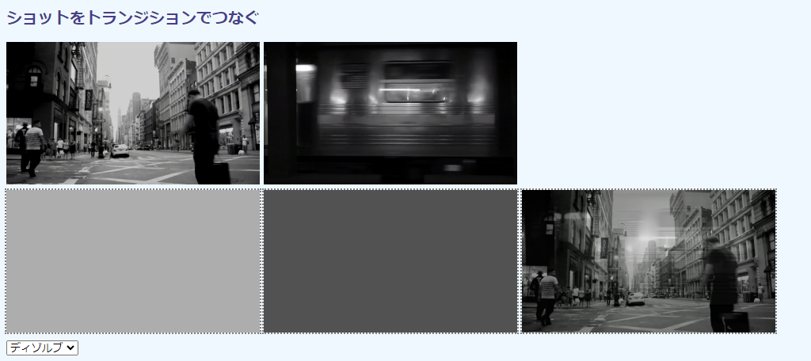

## 第7章 ビデオ処理

本章ではビデオを扱います。画像処理は静止した1枚の画像を対象とするのが基本ですが、連続したフレームでなければできないこともあります。たとえば、前後のフレームから映っている移動体を検出したり、その移動速度を計算するといったことは、ビデオでなければできません。本章では、ビデオおよびカメラ映像を対象としたOpenCV.jsスクリプティングを最初に説明してから、こうしたビデオ向けのアプリケーションを取り上げます。

ビデオからのフレーム取り込みは、[1.9節](./01-html5.md#19-ビデオをフレーム単位で取得する "INTERNAL")で3通りの方法を説明しました。本章のコードでは、ChromeやEdgeで利用できる`HTMLVideoElement.requestVideoFrameCallback()`を用います。新旧バージョンを問わず、どのブラウザでもフレーム操作をしたいのなら、`setInterval()`を用いた方法がよいでしょう。


### 7.1 ビデオフレームと画像を合成する

#### 目的

ビデオフレームに流れ星の画像を合成します。

技術的には、`cv.add()`による合成です（[6.8節](./06-img.md#68-画像を合成する "INTERNAL")）。大きな背景フレームの一部領域に小さい流星画像を貼り付けるには、ROIを用います（[4.7節](./04-mat.md#47-部分領域だけ処理する "INTERNAL")）。本節で重要な技術的なポイントは、`<video>`要素に結び付けた`cv.VideoCapture`オブジェクトを用意することで、以降、その`read()`関数でフレームを`cv.Mat`形式で読み込めるようにするところです。`HTMLImageElement`用の`cv.imread()`の`HTMLVideoElement`版といったところです。

加えて、ロードタイミングがそれぞれ異なるOpenCV、ビデオ、画像の3つのリソースすべてが揃ったところで処理を開始する方法を示します。また、適切なタイミングでOpenCVのリソースを解放する方法も示します。

実行例を次の画面に示します。


左が`<video>`そのまま、右がフレームと流れ星画像の加算画像です。単純な加算では背景が透けて見えますが、ここでは暗い夜空が背景なので十分です。明るい背景を使っているなら、マスクを取るなど追加の作業が必要です。

流星は水平方向は等速で、5秒（コード25行目）かけて画像右端からから左端に移動します。左に達したら、また右からやり直します。垂直方向は等加速度で、やはり5秒かけて画像上端から中央に移動します。軌跡は残らないのでわかりにくいですが、放物線運動です。

画像処理はビデオが終端に達した（`ended`イベント）または停止した（`pause`イベント）と同時に終了します。このタイミングで`cv.Mat`などのリソースを解放するので、以降は星は流れません。ビデオ再生はHTML5の機能なので、そのままでも継続して視聴できます。流星を再度見るには、ページをリロードします。

#### コード

コード`video-add.html`は次の通りです。

```html
[File] video-add.html
  1  <!DOCTYPE html>
  2  <html lang="ja-JP">
  3  <head>
  4    <meta charset="UTF-8">
  5    <link rel=stylesheet type="text/css" href="style.css">
  6    <script async src="libs/opencv.js"></script>
  7  </head>
  8  <body>
  9
 10  <h1>ビデオに画像を貼り付ける</h1>
 11
 12  <div>
 13    
 14    <video width="320" id="videoTag" controls autoplay muted
 15      src="samples/night-sky.mp4"></video>
 16    <canvas id="canvasTag" class="placeholder"></canvas>
 17  </div>
 18
 19  <script>
 20    let imgElem = document.getElementById('imageTag');
 21    let videoElem = document.getElementById('videoTag');
 22    let readyFlag = 0;
 23    let src, star;
 24    let frameCbHandle;
 25    let period = 5;
 26
 27    function perFrame() {
 28      let cap = new cv.VideoCapture(videoElem);
 29      cap.read(src);
 30      cv.imshow('canvasTag', src);
 31
 32      let time = videoElem.currentTime % period;
 33      let speed = (src.cols - star.cols) / period;
 34      let accel = (src.rows / 2)  / (period ** 2);
 35      let x = (src.cols - star.cols) - speed * time;
 36      let y = accel * (time ** 2);
 37      let rect = new cv.Rect(x, y, star.cols, star.rows);
 38      let roi = src.roi(rect);
 39      cv.add(roi, star, roi);
 40      cv.imshow('canvasTag', src);
 41      frameCbHandle = videoElem.requestVideoFrameCallback(perFrame);
 42    }
 43
 44    function stop() {
 45      console.log('Video stopped');
 46      [src, star].forEach(m => m.delete());
 47      videoElem.removeEventListener('pause', stop);
 48      videoElem.removeEventListener('ended', stop);
 49      videoElem.cancelVideoFrameCallback(frameCbHandle);
 50    }
 51
 52    function init() {
 53      if (readyFlag !== 7)
 54        return;
 55
 56      src = new cv.Mat(videoElem.height, videoElem.width, cv.CV_8UC4);
 57
 58      let img = cv.imread(imgElem);
 59      star = new cv.Mat();
 60      cv.resize(img, star, new cv.Size(), 1/10, 1/10);
 61      img.delete();
 62
 63      videoElem.addEventListener('pause', stop);
 64      videoElem.addEventListener('ended', stop);
 65      perFrame();
 66    }
 67
 68    function videoReady() {
 69      console.log('video ready');
 70      readyFlag |= 4;
 71      videoElem.width = videoElem.offsetWidth;
 72      videoElem.height = videoElem.offsetHeight;
 73      init();
 74    }
 75
 76    function imageReady() {
 77      console.log('image ready');
 78      readyFlag |= 2;
 79      init();
 80    }
 81
 82    function opencvReady() {
 83      console.log('OpenCV ready');
 84      readyFlag |= 1;
 85      init();
 86    }
 87
 88    if (imgElem.complete)
 89      readyFlag |= 2;
 90    imgElem.addEventListener('load', imageReady);
 91    videoElem.addEventListener('loadeddata', videoReady);
 92    var Module = {
 93      onRuntimeInitialized: opencvReady
 94    }
 95  </script>
 96
 97  </body>
 98  </html>
```

画像合成だけのわりに長いのは、3点のリソースのタイミングを取ったり解放したりする手間がかかっているからです。合成画像を表示するだけなら、38～40行目だけです。

#### 準備ができたかを確認

OpenCV、ビデオ、画像というローディングタイミングが異なる3つのリソースがすべて揃わなければ、画像処理はスタートできません。そこで、それぞれにビットフラグを割り当て、処理直前にすべて準備完了したかを確認します。同じ方法は[6.1節](./06-img.md#61-一部領域をモザイク化する "INTERNAL")でも用いました。

フラグの初期値は0、あるいは2進数で`000`<sub>2</sub>です（22行目）。

```javascript
 22    let readyFlag = 0;                   // 初期値 000
```

OpenCVの準備ができれば1ビット目にフラグを立てます（`001`<sub>2</sub>とORを取る）。

```javascript
 82    function opencvReady() {
 83      console.log('OpenCV ready');
 84      readyFlag |= 1;                    // OpenCVが用意できたら1ビット目を立てる
 ︙
 92    var Module = {
 93      onRuntimeInitialized: opencvReady
 94    }
```

画像の読み込みが完了したら2ビット目にフラグを立てます（`010`<sub>2</sub>とORを取る）。キャッシュから読み込まれたときは`load`イベントが発生しないので、`HTMLImageElement.complete`プロパティが`true`になっていれば読み込み完了と同じ扱いにします。

```javascript
 76    function imageReady() {
 77      console.log('image ready');
 78      readyFlag |= 2;                    // 画像が用意できたら2ビット目を立てる
 ︙
 88    if (imgElem.complete)
 89      readyFlag |= 2;                    // キャッシュにあるときも2ビット目を立てる
 90    imgElem.addEventListener('load', imageReady);
```

ビデオも同様です。再生可能になったら`loadeddata`イベントが発生するので、それを契機に3ビット目を立てます（`100`<sub>2</sub>とORを取る）。

```javascript
 68    function videoReady() {
 69      console.log('video ready');
 70      readyFlag |= 4;                    // ビデオが用意できたら3ビット目を立てる
 71      videoElem.width = videoElem.offsetWidth;
 72      videoElem.height = videoElem.offsetHeight;
 ︙
 91    videoElem.addEventListener('loadeddata', videoReady); 
```

ビデオが用意できたら、`HTMLVideoElement`の`width`および`height`プロパティを現在の表示サイズでセットします（71～72行目）。というのも、`<video>`要素で属性指定しないかぎり、`width`や`height`はセットされないからです（[1.4節](./01-html5.md#14-ビデオを表示する "INTERNAL")参照）。`offsetWidth/Height`でも`clientWidth/Height`でも、パディングなどの周辺がなければどちらを使ってもかまいません（[1.2節](./01-html5.md#12-画像をキャンバスに表示する "INTERNAL")参照）。

この作業は必須です。ビデオからフレームを読み込むときの`read()`関数は、コピー前に`width`および`height`からサイズ確認をします。空白のままではエラーが上がります。

いずれのリソースでも、フラグ立てなど必要なセットアップが完了したら、すべてが完了したときのセットアップを記述した`init()`関数（52～66行目）を呼び出します。この関数はしかし、フルビットが得られていなければなにもしないので、実際にセットアップが行われるのは最後に準備が完了したリソース（たいていは`opencv.js`）に呼び出されたときです。

```javascript
 52    function init() {
 53      if (readyFlag !== 7)               // フラグが3本とも立っていなければ戻る
 54        return;
 ︙
 65      perFrame();
 66    }
```

`init()`ではフレームを収容する`cv.Mat`（23、56行目）、1/10にリサイズした流れ星画像（23、58～61行目）を用意しています。あと、ビデオ（`HTMLVideoElement`）で`pause`または`ended`イベントが発生したら、すべてのリソース、登録したイベントやコールバック関数を削除する関数`stop()`関数を呼び出すよう登録します（44～50行目）。

セットアップが完了したら、フレーム処理の`perFrame()`を呼び出します（66行目）。関数の中では、フレームが読み込まれるたびに再帰的に呼びだすように`HTMLVideoElement.requestVideoFrameCallback()`で自身を登録します（41行目）。

#### ビデオからフレームを読む

ビデオからフレームを取得するには、`cv.VideoCapture`コンストラクタでビデオキャプチャオブジェクトを用意し（28行目）、そこから`read()`関数で読み込みます（29行目）。

```javascript
 28      let cap = new cv.VideoCapture(videoElem);
 29      cap.read(src);
```

`cv.VideoCapture`コンストラクタの書式を次に示します。

<!-- FunctionDefinition cv.VideoCapture ビデオキャプチャコンストラクタ。 -->
```Javascript
cv.VideoCapture cv.VideoCapture(            // cv.VideoCaptureオブジェクトを返す
    HTMLVideoElement element                // <video>オブジェクト
 );
```

引数には読み取り対象の`HTMLVideoElement`オブジェクトを指定します。

`cv.VideoCapture`コンストラクタは、ビデオが準備できていなければ呼び出してはいけません。準備できていないタイミングでもインスタンス化はでき、エラーにもなりませんが、フレームは読めません。

OpenCV.js版のこのクラスの仕様はC++/Pythonとは異なります。たとえば、オリジナルにはカメラやビデオの属性を取得する`get()`や、値をセットする`set()`が備わっていますが、OpenCV.js版にはありません。

`cv.VideoCapture`オブジェクが用意できたら、その`read()`関数からフレームを読み込みます。関数定義を次に示します。

<!-- FunctionDefinition cv.VideoCapture.read() ビデオキャプチャからフレームを1枚読む。 -->
```Javascript
cv.VideoCapture.read(                       // 戻り値なし
    cv.Mat image                            // 出力画像（cv.CV_8UC4）
 );
```

引数に指定する受け手の`cv.Mat`はあらかじめ**4チャネル**8ビット符号なし整数の`cv.CV_8UC4`で準備しておかなければなりません。それ以外ではエラーが上がります。

`cv.Mat`のデータ型とサイズは現在表示されているビデオと同じでなければなりません。それ以外だと関数内部のチェックがエラーを上げます（`HTMLVideoElement.width`と`height`が正しくセットされていなければならないのは、この内部チェッカーがこれら値に依存しているからです）。

#### リソース解放法処理

ビデオが末尾に到達した（`ended`イベント）あるいはユーザ操作で停止された（`pause`イベント）タイミングで、OpenCVのリソースを解放します（46行目）。

```javascrpt
 44    function stop() {
 45      console.log('Video stopped');
 46      [src, star].forEach(m => m.delete());
 47      videoElem.removeEventListener('pause', stop);
 48      videoElem.removeEventListener('ended', stop);
 49      videoElem.cancelVideoFrameCallback(frameCbHandle);
 50    }
```

他にも、放置しておくと解放したOpenCVリソースにアクセスしかねないリスナー関数やコールバック関数も登録解除します。

フレーム単位でコールバックを呼び出す`HTMLVideoElement.requestVideoFrameCallback()`は、[1.9節](./01-html5.md#19-ビデオをフレーム単位で取得する "INTERNAL")で説明したように、自身を識別する整数値のIDを返します（24、41行目）。

```javascript
 24    let frameCbHandle;
 ︙ 
 41      frameCbHandle = videoElem.requestVideoFrameCallback(perFrame);
```

フレームコールバックを登録解除するには、この値を引数から指定した`HTMLVideoElement.cancelVideoFrameCallback()`を呼び出します（49行目）。

[第4章](./04-mat.md "INTERNAL")でも述べましたが、終わりが明示的ではないアプリケーションやユーザ操作によってはいくらでも延々と見続けられるビデオでは、どこでリソースを解放するかは悩ましいところです。`ended`または`pause`がよいか、それとも他のタイミングがよいかは、アプリケーション次第です。


### 7.2 カメラ映像を鏡像反転する

#### 目的

カメラ映像を鏡のように左右に反転します。ミーティングアプリケーションでおなじみの機能です。停止は、`<video>`付属の操作パネル（`controls`）のボタンからです。

技術的には、反転操作の`cv.flip()`関数を説明しますが、それ自体はいたって簡単です。カメラ映像を使うには`HTMLVideoElement`にカメラのストリームを取り付けなければなりませんが、いったん`navigator.mediaDevices.getUserMedia()`でセットが済めば、あとの操作はビデオファイルと変わりません（[1.8節](./01-html5.md#18-カメラ映像を流す "INTERNAL")）。フレーム取得の方法も同じで、前節の`cv.VideoCapture`オブジェクト経由です。本節の目的はカメラを使ったサンプルを示すところだけにあるので、新奇な話はあえて組み込んでいません。

実行例を次の画面に示します。


左は`<video>`要素で、カメラ映像をそのまま表示しています。右は`<canvas>`で、カメラからコピーしたフレームを反転操作してから貼り付けてあります。

#### コード

コード`video-flip.html`は次の通りです。

```html
[File] video-flip.html
  1  <!DOCTYPE html>
  2  <html lang="ja-JP">
  3  <head>
  4    <meta charset="UTF-8">
  5    <link rel=stylesheet type="text/css" href="style.css">
  6    <script async src="libs/opencv.js"></script>
  7  </head>
  8  <body>
  9
 10  <h1>カメラ映像を鏡像反転する</h1>
 11
 12  <div>
 13    <video id="videoTag" controls></video>
 14    <canvas id="canvasTag" class="placeholder"></canvas>
 15  </div>
 16
 17  <script>
 18    let videoElem = document.getElementById('videoTag');
 19    let readyFlag = 0;
 20    let frameCallbackId;
 21
 22    let constraints = {
 23      audio: false,
 24      video: { width: 320, height: 240 }
 25    };
 26
 27    navigator.mediaDevices.getUserMedia(constraints)
 28    .then(mediaStream => {
 29      videoElem.srcObject = mediaStream;
 30      videoElem.play();
 31    });
 32
 33    function perFrame() {
 34      if (readyFlag !== 3)
 35        return;
 36
 37      let cap = new cv.VideoCapture(videoElem);
 38      let src = new cv.Mat(videoElem.height, videoElem.width, cv.CV_8UC4);
 39      cap.read(src);
 40      cv.flip(src, src, 1);
 41      cv.imshow('canvasTag', src);
 42
 43      src.delete();
 44      frameCallbackId = videoElem.requestVideoFrameCallback(perFrame);
 45    }
 46
 47    function videoStop() {
 48      console.log('video stopped');
 49      videoElem.pause();
 50      let tracks = videoElem.srcObject.getTracks();
 51      tracks[0].stop();
 52      videoElem.srcObject = undefined;
 53      videoElem.removeEventListener('pause', videoStop);
 54      videoElem.cancelVideoFrameCallback(frameCallbackId);
 55      readyFlag = 0;
 56    }
 57
 58    function videoReady() {
 59      console.log('video ready'); 
 60      readyFlag |= 2;
 61      videoElem.width = videoElem.videoWidth;
 62      videoElem.height = videoElem.videoHeight;
 63      videoElem.addEventListener('pause', videoStop);
 64      perFrame();
 65    }
 66
 67    function opencvReady() {
 68      console.log('openv ready');
 69      readyFlag |= 1;
 70      perFrame();
 71    }
 72
 73    videoElem.addEventListener('loadeddata', videoReady);
 74    var Module = {
 75      onRuntimeInitialized: opencvReady
 76    }
 77  </script>
 78
 79  </body>
 80  </html>
```

#### カメラのセットアップ

カメラの開始・停止方法は[1.8節](./01-html5.md#18-カメラ映像を流す "INTERNAL")で説明しましたが、再掲します。カメラからの映像ストリームを`<video>`にフィードするには、`navigator.mediaDevices.getUserMedia()`を用います。HTML5の機能なので、OpenCVは介在しません。

```javascript
 22    let constraints = {
 23      audio: false,
 24      video: { width: 320, height: 240 }
 25    };
 26
 27    navigator.mediaDevices.getUserMedia(constraints)
 28    .then(mediaStream => {
 29      videoElem.srcObject = mediaStream;
 30      videoElem.play();
 31    });
```

`Promise`を返す非同期関数ですが、ビデオと同じ`loadedmatadata`や`loadeddata`イベントがが`HTMLVideoElement`に発生するので、それらを契機に処理を始められます。その登録をしているのが73行目です。

```javascript
 73    videoElem.addEventListener('loadeddata', videoReady);
```

OpenCVとビデオがどちらも準備できたところで目的の画像処理を始めるフラグを用いた方法は、前節と同じです。

カメラは、ビデオトラックを停止することで停止します。1本のビデオは複数のトラックで構成されていることもあるので、`MediaStream.getTracks()`は配列を返します（50行目）。[1.8節](./01-html5.md#18-カメラ映像を流す "INTERNAL")ではこれらをループして逐一停止していましたが、たいていは1本のトラックしかないので、0番目だけ停止すればこと足ります（51行目）。

```javascript
 49      videoElem.pause();
 50      let tracks = videoElem.srcObject.getTracks();
 51      tracks[0].stop();
 52      videoElem.srcObject = undefined;
```

#### 反転操作－cv.flip

画像の反転操作には`cv.flip()`関数を使います（40行目）。

```javascript
 39      cap.read(src);
 40      cv.flip(src, src, 1);
```

関数定義を次に示します。

<!-- FunctionDefinition cv.flip() 画像を上下左右に反転する。 -->
```Javascript
cv.flip(                                    // 戻り値なし
    cv.Mat src,                             // 入力画像
    cv.Mat dst,                             // 出力画像
    number flipCode                         // 反転方法
 );
```

第1引数`src`は入力画像、第2引数`dst`は結果を受ける出力画像です。`dst`のデータ型とサイズは`src`と同じものになります。

第3引数`flipCode`には反転方法を数値から指定します。0のときはX軸を軸に反転します（上下が入れ替わる）。1のときはY軸を軸にするので、左右が入れ替わります。-1を指定すると上下左右どちらも反転します。


### 7.3 実写をミニチュア風にする

#### 目的

リアルなビデオ映像をミニチュア風にします。

特撮映画のセットやジオラマでは、ミニチュアの人物や車や建物でそれっぽい映像を作成します。ミニチュア風というのはその反対で、リアルな映像をミニチュアぽくする写真撮影および加工の技術です。昭和な特撮番組を思い出させるレトロな雰囲気があるため、スマートフォンアプリになるくらい人気な技術です。

リアルをミニチュア風にする要因はいくつかあります。

リアルなビルや町の全体は遠くから撮影します。遠くから撮影するので、フォーカスが全体に合います。反対に、セット撮影は近接撮影です。そのため、フォーカスが合うのは中心部だけで、周辺部はぼやけます。逆にいえば、周辺をぼかせば、どことなくミニチュア風に錯覚します。プロのミニチュア風写真作家はチルトレンズと呼ばれる特殊なレンズを使いますが、本節では画像処理でぼけさせます。

模型やおもちゃの色合いは鮮やかで明るく、しかも近接撮影なために間の空気による色褪せが少ないことから、明るく、色鮮やかにすればそれらしくなります。また、領域の色合いの濃淡が少なくて均質なので、アニメ絵風な処理をすると一層それらしくなります。

動画では、小さいものがてちょこまか動くと、ミニチュア感が増します。ゴジラに向かっていく自衛隊の車列の感じです。

技術的には次の技法とOpenCV関数を用います。いずれも既出なので、あとは組み合わせるだけです。

撮影技術 | 画像処理 | 関数 | 本書の章節
---|---|---|---
中心部のみフォーカス | 画像の周辺だけを平滑化する | `cv.blur()` | [6.2節](./06-img.md#62-画像をぼかす "INTERNAL")
鮮やかで明るい色 | HSV変換し、彩度、明るさを上げる | `cv.cvtColor()`、`cv.convertTo()` | [5.6節](./05-colors.md#56-ポスター化する "INTERNAL")、[6.4節](./06-img.md#64-QRコードを読む "INTERNAL")
領域の色合いが均質 | 領域の色数を減らす | `cv.bilateralFilter()` | [6.2節](./06-img.md#6.2-画像をぼかす "INTERNAL")
動きが早い | 間欠的に処理する | -- | --

実行例を次の画面に示します。


実行例の素材（左）には、高いところから道路を見下ろしたものを選びました。ジオラマ撮影では、たいてい、腰の高さくらいにある模型を斜めから下に見下ろすので、そのアングルだといかにもミニチュアに感じられるからです。あと、空はないほうがよいともされています。

右がミニチュア風動画で、色の鮮やかさ、明るさは下のトラックバーから操作できます。数値は倍率で、最大3倍まで0.1刻みで指定できます。ただ、彩度と明度の両方を操作するとサイケデリックな色合いになります。3番目の「スキップ」では、処理しないでスキップするフレームの枚数を指定します。1はすべてのフレームを処理し、2は1枚おき、3は2枚飛ばし、というように指定します。値が大きいほどちょこまかします。

本コードでは、フレーム処理単位でOpenCVのリソースを生成し、解放します。したがって、あらかじめ定めたタイミングで解放をする必要はありません。その代わり、メモリの取得と解放を頻繁に行うので、性能はあまりよくありません。

#### コード

コード`video-miniture.html`を次に示します。

```html
[File] video-miniture.html
  1  <!DOCTYPE html>
  2  <html lang="ja-JP">
  3  <head>
  4    <meta charset="UTF-8">
  5    <link rel=stylesheet type="text/css" href="style.css">
  6    <script async src="libs/opencv.js"></script>
  7  </head>
  8  <body>
  9
 10  <h1>実写をミニチュア風にする</h1>
 11
 12  <div>
 13    <video id="videoTag" width="320" controls muted autoplay loop
 14      src="samples/traffic.mp4"></video>
 15    <canvas id="canvasTag" class="placeholder"></canvas>
 16  </div>
 17  <div>
 18    鮮やかさ倍率（1～3）
 19    <input type="range" id="rangeTagS" min="1" max="3" step="0.1" value="1"/>
 20    <span id="spanTagS" class="currentValue">1</span><br/>
 21    　明るさ倍率（1～3）
 22    <input type="range" id="rangeTagV" min="1" max="3" step="0.1" value="1"/>
 23    <span id="spanTagV" class="currentValue">1</span><br/>
 24    　　スキップ（1～6）
 25    <input type="range" id="rangeTagG" min="1" max="6" value="1"/>
 26    <span id="spanTagG" class="currentValue">1</span>
 27  </div>
 28
 29  <script>
 30    let videoElem = document.getElementById('videoTag');
 31    let rangeElemS = document.getElementById('rangeTagS');
 32    let rangeElemV = document.getElementById('rangeTagV');
 33    let rangeElemG = document.getElementById('rangeTagG');
 34    let spanElemS = document.getElementById('spanTagS');
 35    let spanElemV = document.getElementById('spanTagV');
 36    let spanElemG = document.getElementById('spanTagG');
 37
 38    let readyFlag = 0;
 39    let size, rect;
 40
 41    function brighter(src, scales=[1, 1, 1]) {
 42      let temp1 = new cv.Mat();
 43      cv.cvtColor(src, temp1, cv.COLOR_RGB2HSV);
 44
 45      let mv = new cv.MatVector();
 46      cv.split(temp1, mv);
 47
 48      let temp2 = new cv.Mat();
 49      for(let i=0; i<mv.size(); i++) {
 50        if (scales[i] != 1) {
 51          mv.get(i).convertTo(temp2, -1, scales[i], 0);
 52          mv.set(i, temp2);
 53        }
 54      }
 55
 56      cv.merge(mv, temp2);
 57      cv.cvtColor(temp2, src, cv.COLOR_HSV2RGB);
 58
 59      [temp1, mv, temp2].forEach(m => m.delete());
 60    }
 61
 62    let counter = 0;
 63    function perFrame() {
 64      let cap = new cv.VideoCapture(videoElem);
 65
 66      let saturation = Number(rangeElemS.value);
 67      let value = Number(rangeElemV.value);
 68      let gap = Number(rangeElemG.value);
 69      spanElemS.innerHTML = saturation;
 70      spanElemV.innerHTML = value;
 71      spanElemG.innerHTML = gap;
 72
 73      if (counter % gap == 0)  {
 74        let src = new cv.Mat(size, cv.CV_8UC4);
 75        cap.read(src);
 76        cv.cvtColor(src, src, cv.COLOR_RGBA2RGB);
 77
 78        let dst = new cv.Mat();
 79        cv.bilateralFilter(src, dst, 5, 150, 150, cv.BORDER_DEFAULT);
 80        brighter(dst, [1, saturation, value]);
 81
 82        src = dst.clone();
 83        cv.blur(src, src, new cv.Size(7, 7));
 84        let roiSrc = src.roi(rect);
 85        let roiDst = dst.roi(rect);
 86        roiDst.copyTo(roiSrc);
 87
 88        cv.imshow('canvasTag', src);
 89        [src, dst, roiSrc, roiDst].forEach(m => m.delete());
 90      }
 91
 92      counter ++;
 93      videoElem.requestVideoFrameCallback(perFrame);
 94    }
 95
 96    function init() {
 97      if (readyFlag !== 3)
 98        return;
 99
100      size = new cv.Size(videoElem.width, videoElem.height);
101
102      let ratio = 0.7;
103      let w = Math.floor(videoElem.width * ratio);
104      let h = Math.floor(videoElem.height * ratio);
105      let x = Math.floor((videoElem.width - w) / 2);
106      let y = Math.floor((videoElem.height - h) / 2);
107      rect = new cv.Rect(x, y, w, h);
108
109      perFrame();
110    }
111
112    function videoReady() {
113      readyFlag |= 2;
114      videoElem.width = videoElem.offsetWidth;
115      videoElem.height = videoElem.offsetHeight;
116      init();
117    }
118
119    function opencvReady() {
120      readyFlag |= 1;
121      init();
122    }
123
124    videoElem.addEventListener('loadeddata', videoReady);
125    var Module = {
126      onRuntimeInitialized: opencvReady
127    }
128  </script>
129
130  </body>
131  </html>
```

OpenCVとビデオが準備できたところで初期化を行いますが（96～110行目の`init()`）、ここではのちに明示的な解放を必要とするリソースは生成しません。ここで定義している`cv.Size`（フレームサイズ）も`cv.Rect`（周辺ぼかし時のROIのサイズ）もJavaScriptオブジェクトで表現されているので、通常のガベージコレクタのコレクト対象です。

`cv.Rect`はフレーム中央に位置し、そのサイズはフレームの7割です（102～107行目）。この矩形領域の外側をぼかします。

#### 彩度と明度を上げる

彩度と明度を定数倍するのが、41～60行目の`brighter()`関数です。関数は受け取ったRGB画像をHSVに変換、処理が終わればもとのRGBに戻します。このRGB→HSV→RGBのサンドイッチ構成は[5.6節](./05-colors.md#56-ポスター化する "INTERNAL")と同じです。

```javascript
 41    function brighter(src, scales=[1, 1, 1]) {
 ︙ 
 43      cv.cvtColor(src, temp1, cv.COLOR_RGB2HSV);
 ︙
 57      cv.cvtColor(temp2, src, cv.COLOR_HSV2RGB);
```

チャネル単位で処理をするのなら、`cv.split()`です（46行目）。出力を受ける`cv.MatVector`を用意するのを忘れないように（45行目）。

```javascript
 45      let mv = new cv.MatVector();
 46      cv.split(temp1, mv);
```

`brighter()`関数の第2引数の配列は、チャネルそれぞれの倍率を示しています（値は66～67行目でトラックバーから直接取得します）。ここが1でなければ`cv.Mat.convertTo()`を使ってその値で定数倍します（50行目の`if`）。

```javascript
 48      let temp2 = new cv.Mat();
 49      for(let i=0; i<mv.size(); i++) {
 50        if (scales[i] != 1) {
 51          mv.get(i).convertTo(temp2, -1, scales[i], 0);
 52          mv.set(i, temp2);
 53        }
 54      }
```

i番目の要素を`get()`し、変換したら、`set()`でもとに戻します（51～52行目）。

この関数でのポイントは、確保したOpenCVリソースを関数を出る直前に解放しているところです。このように関数単位で確保と解放が閉じていると、解放し忘れが少なくなります。

#### フレームをスキップする

スクリプトは、読み込んだフレームの数を`counter`でカウントしています。このカウンターがスキップ数で割り切れたときのみ、フレーム処理を実行します。

```javascript
 62    let counter = 0;
 63    function perFrame() { 
 ︙
 73      if (counter % gap == 0)  {
 ︙                                         // フレーム処理が入る
 90      }
 91 
 92      counter ++;
 93      videoElem.requestVideoFrameCallback(perFrame);
 94    }
```

[2.2節](./02-ui.md#22-ビデオをキャプチャする "INTERNAL")で説明した`HTMLVideoElement.getVideoPlaybackQuality()`から現在までに読み込んだフレーム数を用いてもよいのですが、どのみち正確なフレーム番号を指し示しているわけでもないので、ただのカウンターを使ったほうが早道でしょう。

<!-- See also: Number.MAX_SAFE_INTEGER -->
ビデオ終端から先頭に折り返しても、そのままカウントを続けます。フレーム数を追いかけるのではなく、数枚おきに処理をするのが目的なのでこれで十分です（JavaScriptの整数は16桁くらいまでは精度保証されているので、オーバーフローも気にしなくて大丈夫です）。

#### 注目領域の外側をぼけさせる

ROI（注目領域）は、画像の一部領域だけを処理するときに用います。しかし、注目領域ではないところのみ処理する、という反対の操作はできません。また、ROIは矩形領域なので、今回のように中心部を除いたロの字のような形状は表現できません（ROiを4つに分ける手もあるでしょうが、それはそれで面倒です）。

そこで、先に全体をぼけさせ、その中央にぼけさせていないもとの領域をコピーします（82～86行目）。

```javascript
 82        src = dst.clone();                       // コピーを用意
 83        cv.blur(src, src, new cv.Size(7, 7));    // コピー側全体をボケさせる
 84        let roiSrc = src.roi(rect);              // ボケた側のROI
 85        let roiDst = dst.roi(rect);              // ボケていない側の画像のROI
 86        roiDst.copyTo(roiSrc);                   // ボケてない矩形をボケたほうにコピー
```

ROIも`cv.Mat`なので、明示的に解放するのを忘れないように（89行目）。

```javascript
 89        [src, dst, roiSrc, roiDst].forEach(m => m.delete());
```


### 7.4 ショットをトランジションでつなぐ

#### 目的

2本のビデオをトランジションを交えて切り替えます。Webページで複数のビデオを効果的に表示したいときに便利です。

2つのショットからひとつなぎの映像を作成するには、前のショットの末尾フレームと次のショットの先頭フレームをそのままつなぐのが基本です。しかし、前のショットの末尾数秒分と次のショットの先頭数秒分をオーバーラップさせることで、前後のショットを同一画面に同時に示す特殊なつなぎかたもあります。これがトランジションです。本節では、ディゾルブ、水平ワイプ、垂直ワイプ、円形ワイプの4種類のトランジションを実装します。

技術的には、先行するフレームからは徐々にその要素を取り除いていき、続くフレームは反対に徐々に要素を増やしていき、その結果を合成することでトランジションは構成されます（[6.8節](./06-img.md#68-画像を合成する "INTERNAL")）。要素の増減は、0～1の小数点数を値を持つフレームと同サイズの行列で表現できます。値が1.0の箇所では要素を保持し、0.0の箇所では完全に要素を削除し、その中間だと画像を薄くします。そして、この行列を時間に応じて変化させ、フレームに掛けます。つまり、トランジションとは時間によって変化する行列を重みとした重み付け加算ということができます。式にすれば次の通りです。

$$ S(t) = S_1(t) M_1(t) + S_2(t) M_2(t) $$

$S_1(t),\ S_2(t)$が時間 $t$ の元映像のフレーム、 $M_1(t),\ F_2(t)$ が要素増減の行列、 $S(t)$ が合成結果です。先行フレームの要素を減らしたらそのぶん後続フレームの要素を増やすので、通常、2つの行列は相補的です。なので、一方の行列を $M(t)$ としたら、他方の行列は $1 - $M(t)$ で計算できます。

$$ S(t) = S_1(t) M(t) + S_2(t) (1 - M(t)) $$

OpenCVでは行列の加算は`cv.add()`、乗算は`cv.multiply()`です。OpenCV.jsはスカラー値1から行列を引くのが得意ではないので、`cv.Mat.convertTo()`を流用します。「1から行列を引く」は、行列を-1倍して1を足すという操作に置き換えられます。

小数点数を用いるので、画像のデータ型には4チャネル32ビット浮動小数点数型（`cv.CV_32FC3`）を用います。この型を画像に使うときは0をまっくろ（最低輝度）、1をまっしろ（最大輝度）にするのが通例なので、型変換時にはピクセル値をすべて1/255倍します。

ディゾルブの実行例を次の画面に示します。



上段の左が先行ショット、右が後続ショットです。

下段の左と中央が、それぞれのショットにかける行列を画像として示したものです。スタート時点では、左はまっしろ（1.0）ですが次第に黒くなっていきます。反対に中央はまっくろ（0.0）ですが、次第に白くなっていきます。この濃度が、2つのショットをどれだけ混ぜ合わせるか度合いを示します。

下段右の画像が合成後のフレームです。後続フレームの地下鉄プラットフォームが微妙に映り込んでいるのがわかります。

サンプルには同サイズ（原寸は640×360）、同時間長（13秒）のものを選びました。`<video>`では`autoplay muted loop`の属性を指定しているので、ページがロードされれば即座にスタートしてまわり続けます。

トランジションのスタートは先行ショットの開始から4秒後で、5秒かけて後続ショットに移り変わります。先行ショットがループしてもとに戻れば、また最初から始まります。後続ショットとフレーム数に少し差がありますが、後続の終了タイミングとは連動していません。

下段の下にプルダウンメニューがあり、トランジションタイプを4つのなかから選べます。実行例はそれぞれ説明するときに示します。

#### コード

コード`video-transition.html`は次の通りです。

```html
[File] video-transition.html
  1  <!DOCTYPE html>
  2  <html lang="ja-JP">
  3  <head>
  4    <meta charset="UTF-8">
  5    <link rel=stylesheet type="text/css" href="style.css">
  6    <script async src="libs/opencv.js"></script>
  7  </head>
  8  <body>
  9
 10  <h1>ショットをトランジションでつなぐ</h1>
 11
 12  <div>
 13    <video id="videoTagA" width="320" autoplay muted loop
 14      src="samples/ny.mp4"></video>
 15    <video id="videoTagB" width="320" autoplay muted loop
 16      src="samples/ny-subway.mp4"></video>
 17  </div>
 18  <div>
 19    <canvas id="canvasTagA" class="placeholder"></canvas>
 20    <canvas id="canvasTagB" class="placeholder"></canvas>
 21    <canvas id="canvasTag" class="placeholder"></canvas>
 22    <select id="selectTag">
 23      <option value="d" selected>ディゾルブ</option>
 24      <option value="h">水平ワイプ</option>
 25      <option value="v">垂直ワイプ</option>
 26      <option value="c">円形ワイプ</option>
 27    </select>
 28  </div>
 29
 30  <script>
 31    let videoElemA = document.getElementById('videoTagA');
 32    let videoElemB = document.getElementById('videoTagB');
 33    let selectElem = document.getElementById('selectTag');
 34    let readyFlag = 0;
 35
 36    function makeMask(size, startTime=4, period=5) {
 37      let type = selectElem.value;
 38      let time = videoElemA.currentTime - startTime;
 39      let color = new cv.Scalar(1, 1, 1);
 40      let pos = Math.max(0, time);
 41      pos = Math.min(pos, period);
 42
 43      let mask1 = cv.Mat.zeros(size, cv.CV_32FC3);
 44      if (type === 'd') {
 45        mask1.data32F.fill((period - pos) / period);
 46      }
 47      else if (type === 'h') {
 48        let w =  Math.floor(videoElemA.width * pos / period);
 49        cv.rectangle(mask1, new cv.Point(w, 0),
 50          new cv.Point(size.width-1, size.height-1), color, cv.FILLED);
 51      }
 52      else if (type === 'v') {
 53        let h = Math.floor(videoElemA.height * pos / period);
 54        cv.rectangle(mask1, new cv.Point(0, h),
 55          new cv.Point(size.width-1, size.height-1), color, cv.FILLED);
 56      }
 57      else if (type === 'c') {
 58        let rMax = Math.hypot(size.width, size.height);
 59        let r = Math.floor(rMax * (period - pos) / period);
 60        cv.circle(mask1, new cv.Point(Math.floor(size.width/2),
 61          Math.floor(size.height/2)), r, color, cv.FILLED);
 62      }
 63      cv.blur(mask1, mask1, new cv.Size(17, 17));
 64
 65      let mask2 = new cv.Mat();
 66      mask1.convertTo(mask2, -1, -1, 1);
 67
 68      return [mask1, mask2];
 69    }
 70
 71    function showFloat32Image(canvasID, src) {
 72      let dst = new cv.Mat();
 73      src.convertTo(dst, cv.CV_8UC3, 255);
 74      cv.imshow(canvasID, dst);
 75      dst.delete();
 76    }
 77
 78    function readFrameAsFloat32(videoElem, size) {
 79      let cap = new cv.VideoCapture(videoElem);
 80      let src = new cv.Mat(size, cv.CV_8UC4);
 81      cap.read(src);
 82      cv.cvtColor(src, src, cv.COLOR_RGBA2RGB);
 83      src.convertTo(src, cv.CV_32FC3, 1/255);
 84      return src;
 85    }
 86
 87    function perFrame() {
 88      if (readyFlag != 7)
 89        return;
 90
 91      let size = new cv.Size(videoElemA.width, videoElemA.height);
 92      let srcA = readFrameAsFloat32(videoElemA, size);
 93      let srcB = readFrameAsFloat32(videoElemB, size);
 94
 95      let [maskA, maskB] = makeMask(size);
 96      showFloat32Image('canvasTagA', maskA);
 97      showFloat32Image('canvasTagB', maskB);
 98
 99      cv.multiply(srcA, maskA, srcA);
100      cv.multiply(srcB, maskB, srcB);
101      let dst = new cv.Mat();
102      cv.add(srcA, srcB, dst);
103      showFloat32Image('canvasTag', dst);
104
105      [srcA, srcB, maskA, maskB, dst].forEach(m => m.delete());
106      videoElemA.requestVideoFrameCallback(perFrame);
107    }
108
109     function videoBReady() {
110      readyFlag |= 4;
111      videoElemB.width = videoElemB.offsetWidth;
112      videoElemB.height = videoElemB.offsetHeight;
113      perFrame();
114    }
115
116    function videoAReady() {
117      readyFlag |= 2;
118      videoElemA.width = videoElemA.offsetWidth;
119      videoElemA.height = videoElemA.offsetHeight;
120      perFrame();
121    }
122
123    function opencvReady() {
124      readyFlag |= 1;
125      perFrame();
126    }
127
128    videoElemA.addEventListener('loadeddata', videoAReady);
129    videoElemB.addEventListener('loadeddata', videoBReady);
130    var Module = {
131      onRuntimeInitialized: opencvReady
132    }
133  </script>
134
135  </body>
136  </html>
```

構造はこれまでと変わりません。非同期に読み込まれるリソースが3つ（OpenCV、先行ビデオ、後続ビデオ）あるので、フラグ（34、110、117、124行目）が７（`0111`<sub>2</sub>）になったときにフレーム処理を始めます（88行目）。OpenCVリソースはフレーム単位に解放しているので（105行目）、終了処理はとくにはありません。実行中、Windowsのタスクマネージャが「非常に高い」電力消費をずっと報告するので、環境にやさしいコーディングではないようです。

#### 画像を32ビット浮動小数点数で扱う

ビデオフレームはRGBAからRGBに変換してから、32ビット浮動小数点数の`cv.CV_32FC3`に型変換します。このフレーム整形の一連の作業はどちらのビデオでも共通なので、ビデオキャプチャオブジェクトの準備も含めて次のように関数化しています（78～85行目）。

```javascript
 78    function readFrameAsFloat32(videoElem, size) {
 79      let cap = new cv.VideoCapture(videoElem);
 80      let src = new cv.Mat(size, cv.CV_8UC4);
 81      cap.read(src);
 82      cv.cvtColor(src, src, cv.COLOR_RGBA2RGB);
 83      src.convertTo(src, cv.CV_32FC3, 1/255);
 84      return src;
 85    }
```

浮動小数点数に変換するときに1/255倍することで、ピクセル値の範囲を0.0～1.0にスケーリングするところがポイントです。

キャンバスに表示をするときは、反対に255倍してから8ビット符号なし整数`cv.CV_8UC3`に直します。これを関数化しています（71～76行目）。

```javascript
 71    function showFloat32Image(canvasID, src) {
 72      let dst = new cv.Mat();
 73      src.convertTo(dst, cv.CV_8UC3, 255);
 74      cv.imshow(canvasID, dst);
 75      dst.delete();
 76    }
```

#### ディゾルブ

トランジション用の変換行列は36～76行目の`makeMask()`関数で用意しています。関数は行列のサイズ（第1引数`size`）、トランジション開始時間（第2引数`startTime`）、トランジション期間（第3引数`period`）を引数から受け付け、先行ショット用行列`mask1`と後続ショット用`mask2`を配列に収容して返します。

```javascript
 36    function makeMask(size, startTime=4, period=5) {
 ︙
 68      return [mask1, mask2]; 
 69    } 
```

第2引数と第3引数は、13秒のビデオの時間長にあわせたタイミングをデフォルトにしています。この配分だと、最初の4秒が先行ショットのみ、4～9秒がトランジション中（合成画像）、9～13秒が後続ショットのみという構成になります。

先行ビデオの`mask1`の初期状態は全面黒です（43行目）。これを時間経過にしたがって徐々に部分を白くしていきます。

```javascript
 39      let color = new cv.Scalar(1, 1, 1);              // 白で埋める
 ︙
 43      let mask1 = cv.Mat.zeros(size, cv.CV_32FC3);     // 初期状態は黒
```

どれだけ白くするかを決定するパラメータが40～41行目の`pos`です。この変数は、ビデオ時間が`startTime`以前なら0、トランジション中なら0～5、それ以降なら5のままの値を取ります。

```javascript
 40      let pos = Math.max(0, time);
 41      pos = Math.min(pos, period);
```

ディゾルブでは、`mask1`のデータを値`(period - pos) / period`で埋めます（45行目）。この式なら、トランジション開始時点まで（`pos = 0`）では1.0です。時間が進むにつれ`pos`の値が大きくなるので、埋める値は1.0からゆっくりと小さくなります。終了時点、そしてそれ以降（`pos = period`）は0.0で埋めます。行列は32ビット浮動小数点数の`cv.Mat`なので、そのデータを指し示すプロパティは`Float32Array`配列の`cv.Mat.data32F`です（[4.1節](./04-mat.md#41-画像の構造を調べる "INTERNAL")）。配列なので、`fill()`関数からすべてを同じ値で埋められます。

```javascript
 45        mask1.data32F.fill((period - pos) / period);
```

#### 水平ワイプ

水平ワイプの実行例を次に示します。


画像を左右に割る垂直の線が時間経過ともに左から右へと走ります。この線の左側を黒、右側を白で埋めるには、初期状態ではまっくろな画像に、右端から垂線までを`cv.rectangle()`（[6.7節](./06-img.md#67-顔を検出する "INTERNAL")）を用いて白い長方形で埋めます。48行目の`videoElemA.width / period`が垂線の移動速度です。

```javascript
 48        let w =  Math.floor(videoElemA.width * pos / period);
 49        cv.rectangle(mask1, new cv.Point(w, 0),
 50          new cv.Point(size.width-1, size.height-1), color, cv.FILLED);
```

長方形を塗りつぶすので、第5引数の`thickness`に負の値を示す`cv.FILLED`が指定してあるのがポイントです。

長方形を描くだけだと、両者の間がくっきりと分かれます。そういう編集もありでしょうが、ここでは間をややぼけさせることで、ゆるやかに混じるようにしています。これをやっているのが63行目の`cv.blur()`です。

```javascript
 63      cv.blur(mask1, mask1, new cv.Size(17, 17));
```

この処理はディゾルブのマスク画像にも適用されますが、画像全体が均質に埋まっているので、変化はありません。

#### 垂直ワイプ

垂直ワイプの実行例を次に示します。


画像を上下に分割する水平線が時間経過ともに上から下へと走ります。この線の下側を白で埋めるのも、水平ワイプ同様`cv.rectangle()`（[6.7節](./06-img.md#67-顔を検出する "INTERNAL")）です。53行目のの`videoElemA.height / period`が水平線の移動速度です。

```javascript
 53        let h = Math.floor(videoElemA.height * pos / period);
 54        cv.rectangle(mask1, new cv.Point(0, h),
 55          new cv.Point(size.width-1, size.height-1), color, cv.FILLED);
```

#### 円形ワイプ

円形ワイプの実行例を次に示します。


画像の中心を中心にした白い円の半径を次第に小さくしていきます。円の最大半径は画像長方形の対角線の半分です（58行目）。三角形の長辺と短辺から斜辺を求めるのには、JavaScript標準装備の`Math.hypot()`が使えます。

```javascript
 58        let rMax = Math.hypot(size.width, size.height);
 59        let r = Math.floor(rMax * (period - pos) / period);
 60        cv.circle(mask1, new cv.Point(Math.floor(size.width/2),
 61          Math.floor(size.height/2)), r, color, cv.FILLED);
```

白い円を描くには`cv.circle()`関数です。関数定義を次に示します。

<!-- FunctionDefinition cv.circle() 円を描く。 -->
```Javascript
cv.circle(                                  // 戻り値なし
    cv.Mat img,                             // 描画対象の画像
    cv.Point center,                        // 中心の座標
    number radius,                          // 半径
    cv.Scalar color,                        // 線色
    number thickness = 1,                   // 線の太さ
    number lineType = cv.LINE_8,            // 線の種類
    number shift = 0                        // 小数部分のビット数
);
```

円を規定するパラメータである中心座標と半径が第2引数`center`と第3引数`radius`に入っただけで、あとは他のグラフィックス描画関数と同じです。ここでも、第5引数`thickness`に塗りつぶしの`cv.FILLED`を指定しています。

関数名のcが小文字であるところが注意点です。大文字の`cv.Circle`は円のパラメータを記述するオブジェクトのコンストラクタですです（[4.4節](./04-mat.md#44-モノクロで円を描く "INTERNAL")）。

> オブジェクトの`cv.Circle`はOpenCV.jsの独自仕様なので、リファレンスには記述されていません。


### 7.5 動いているものだけを抜き出す

#### 目的

ビデオから背景を抜き、動いている前景の物体だけを抜き出します。物体を抜き出せば、通行する歩行者や車両の数をカウントする、立ち入り禁止区域に入り込もうとしている人影を検出するといったアプリケーションを作成することができるようになります。

技術的には、MOG（Mixture of Gaussians）と呼ばれる背景抜き（Background Subtraction）のアルゴリズムを実装した`cv.BackgroundSubtractorMOG2`クラスを使います。これは、ビデオフレーム中のピクセルが背景か前景のどちらに属するかを確率をベースに計算するアルゴリズムです。時間を経過しても変化のないピクセルが背景なはずですが、あるピクセルが背景である確率が80%、それ以外が20%のように確率的に分けているしているのは、車両や歩行者が通りかかれば、その位置のピクセルが変わってしまうからです。画像をぼかすときに登場したガウス（`cv.GaussianBlur()`）が出てくるのは、ピクセルデータの集まりがガウス分布に従う（正規分布）であると仮定されるからです。

固定カメラで撮影されたビデオであることが条件です。画面の物体が静止していても、カメラ自体が動いていれば、それは映像的には動いているのと同じことだからです。ライティングに変化が少ないのも条件です。静止した物体を固定カメラで撮影しても、光の加減で色合いや反射が変わったり、影ができたりすると、その部分が動いたとみなされるからです。ターゲットとしては、サーベイランスカメラから撮像した街や道路で、抽出するのはそこを移動する歩行者や車両です。

背景を抜き出すことができれば、前景のマスク画像が得られるので、もとのフレームから前景だけを抜き出した画像が生成できます。

実行例を次の画面に示します。


左が入力ビデオ、中央が`cv.BackgroundSubtractorMOG2`で得た前景背景フレームです。背景が黒、前景が白に色分けされています。右が背景前景フレームをマスク画像として、入力フレームを灰色の画像に貼り付けたものです。

`cv.BackgroundSubtractorMOG2`はGMM（Gaussian Moxture Model）というアルゴリズムをその基盤に用いています。基本的な話は次に示すURLのOpenCVチュートリアル「Background Subtraction」に書かれています。

```https://docs.opencv.org/4.8.0/d8/d38/tutorial_bgsegm_bg_subtraction.html```

もっとも、かなり概略的なので、細かい話はわかりません（詳しくは原著論文を読むように暗に勧めている）。次のYouTubeビデオが数学的な考え方を説明しているので、ご覧になることをお勧めします（コロンビア大学のもので時間長は15'55"）。

<!-- https://www.youtube.com/watch?v=wT2yLNUfyoM （4'48"） ... 数式が充実 -->
<!-- https://www.youtube.com/watch?v=kkAirywakmk （29'28"） ... わかりやすい -->

```https://www.youtube.com/watch?v=0nz8JMyFF14```

#### コード

コード`video-mog2.html`を次に示します。

```html
[File] video-mog2.html
  1  <!DOCTYPE html>
  2  <html lang="ja-JP">
  3  <head>
  4    <meta charset="UTF-8">
  5    <link rel=stylesheet type="text/css" href="style.css">
  6    <script async src="libs/opencv.js"></script>
  7  </head>
  8  <body>
  9
 10  <h1>動いているものだけを抜き出す</h1>
 11
 12  <div>
 13    <video id="videoTag" width="320" src="samples/motorway.mp4"></video>
 14    <canvas id="canvasTag1" class="placeholder"></canvas>
 15    <canvas id="canvasTag2" class="placeholder"></canvas>
 16  </div>
 17
 18  <script>
 19    let videoElem = document.getElementById('videoTag');
 20    let src, fg, dst;
 21    let mog2;
 22    let frameCallbackHandle;
 23    let readyFlag;
 24
 25    function perFrame() {
 26      let cap = new cv.VideoCapture(videoElem);
 27      cap.read(src4);
 28      cv.cvtColor(src4, src3, cv.COLOR_RGBA2RGB);
 29      mog2.apply(src3, fg);
 30      cv.imshow('canvasTag1', fg);
 31      dst.data.fill(128);
 32      src3.copyTo(dst, fg);
 33      cv.imshow('canvasTag2', dst);
 34
 35      frameCallbackHandle = videoElem.requestVideoFrameCallback(perFrame);
 36    }
 37
 38    function stop() {
 39      [src4, src3, fg, dst, mog2].forEach(m => m.delete());
 40      videoElem.cancelVideoFrameCallback(frameCallbackHandle);
 41      videoElem.removeEventListener('pause', stop);
 42      videoElem.removeEventListener('ended', stop);
 43      readyFlag = 0;
 44    }
 45
 46    function init() {
 47      if (readyFlag != 3)
 48        return;
 49      src4 = new cv.Mat(videoElem.height, videoElem.width, cv.CV_8UC4);
 50      src3 = new cv.Mat(videoElem.height, videoElem.width, cv.CV_8UC3);
 51      fg = new cv.Mat(videoElem.height, videoElem.width, cv.CV_8UC1);
 52      dst = new cv.Mat(videoElem.height, videoElem.width, cv.CV_8UC3);
 53      mog2 = new cv.BackgroundSubtractorMOG2();
 54      videoElem.muted = true;
 55      videoElem.play();
 56      perFrame();
 57    }
 58
 59    function videoReady() {
 60      readyFlag |= 2;
 61      videoElem.width = videoElem.offsetWidth;
 62      videoElem.height = videoElem.offsetHeight;
 63      init();
 64    }
 65
 66    function opencvReady() {
 67      readyFlag |= 1;
 68      init();
 69    }
 70
 71    videoElem.addEventListener('loadeddata', videoReady);
 72    videoElem.addEventListener('pause', stop);
 73    videoElem.addEventListener('ended', stop);
 74    var Module = {
 75      onRuntimeInitialized: opencvReady
 76    }
 77  </script>
 78
 79  </body>
 80  </html>
```

#### MOG2オブジェクトの生成－cv.BackgroundSubtractorMOG2

OpenCV.jsとビデオが準備できたら、リソースを用意します（46～57行目の`init()`関数）。

```javasctript
 49      src4 = new cv.Mat(videoElem.height, videoElem.width, cv.CV_8UC4);
 50      src3 = new cv.Mat(videoElem.height, videoElem.width, cv.CV_8UC3);
 51      fg = new cv.Mat(videoElem.height, videoElem.width, cv.CV_8UC1);
 52      dst = new cv.Mat(videoElem.height, videoElem.width, cv.CV_8UC3);
 53      mog2 = new cv.BackgroundSubtractorMOG2();
```

`<video>`から読み込まれるフレーム用の`src4`のデータ型は4チャネルカラー（`cv.CV_8UC4`）なので（49行目）、計算用の`src3`はいらないアルファチャネルデータは落として3チャネル（`cv.CV_8UC3`）にします（50行目）。前景背景フレーム`fg`には`cv.CV_8UC1`の1チャネルを用います（51行目）。これで、そのままマスク画像として使えます。前景だけマスク抜きして張り付ける先の画像`dst`は、アルファチャネルがあると邪魔なので3チャネルの`cv.CV_8UC3`を指定します（52行目）。

MOG2オブジェクト`mog2`は`cv.BackgroundSubtractorMOG2`コンストラクタから生成します（53行目）。定義を次に示します。

<!-- FunctionDefinition cv.BackgroundSubtractorMOG2() 背景抜きアルゴリズムを実装したMOG2のコンストラクタ。 -->
```Javascript
cv.BackgroundSubtractorMOG2 = cv.BackgroundSubtractorMOG2(
    number history = 500,
    number varThreshold = 16,
    boolean detectShadows = true
  );
```

引数はいずれもオプションです。

<!-- 引数は createBackgroundSubtractorMOG2() のほうを参照。-->
第1引数`history`は過去何枚のフレームを使って確率計算をするかを指定します。デフォルトは500は、直近500枚を用いるという意味です。第2引数`varThreshold`はモデル（予測）と現在のピクセル値の間の分散の差（距離）がどれだけならば背景とみなすか否かを指定します。第3引数`detectShdaows`は移動物体の影も検出するから否かを指定します。デフォルトの`true`は検出指示ですが、これを選択すると「やや」計算が遅くなります。

これらリソースはすべて、ビデオ停止時に解放します（38～44行目の`stop`関数）。

```javascript
 38    function stop() {
 39      [src4, src3, fg, dst, mog2].forEach(m => m.delete());
```

#### 背景抜きの実行－cv.BackgroundSubtractorMOG2.apply

リソースが準備できたら、ビデオからフレームを読み出し、3チャネルに直したうえで、順に`cv.BackgroundSubtractorMOG2`オブジェクトに投入します。これには`cv.BackgroundSubtractorMOG2.apply()`関数を使います（29行目）。

```javascript
 27      cap.read(src4);
 28      cv.cvtColor(src4, src3, cv.COLOR_RGBA2RGB);
 29      mog2.apply(src3, fg);
```

関数定義を次に示します。

<!-- FunctionDefinition cv.BackgroundSubtractorMOG2.apply() 背景抜きを実行する。 -->
```javascript
cv.BackgroundSubtractorMOG2.apply(          // 戻り値なし
    cv.Mat image,                           // 入力フレーム
    cv.Mat fgmask,                          // 前景背景画像
    number learningRate = -1                // 学習レート
);
```

第1引数`image`は入力フレームです。入力のデータ型がなんであれ、浮動小数点数が使われます。スケーリングはされないので、値の範囲は0.0～255.0です。

第2引数`fgmask`は前景背景画像で、8ビットの2値画像（`cv.CV_8UC1`）です。前景が白、背景が黒です。

第3引数`learningRate`はどのくらい早く背景モデル（確率モデル）を学習させるかを指定するオプションのパラメータものです。デフォルトの-1（任意の負の値）は自動判定です。0の場合は、新たなフレームが投入されてもモデルを更新しません。1の場合は最後に入力されたフレームで完全にモデルが初期化されます。どのようなタイミングでモデルが再計算されるかは、上述のビデオを参照してください。

あとは、得られた前景背景画像をマスクとして使い、`cv.Mat.copyTo()`関数で現在のフレームを灰色で埋めた画像にコピーします（32行目）。灰色で埋めるのは、`Uint8Array.fill()`を使ったデータバッファへの直接書き込みで行っています（31行目）。

```javascript
 31      dst.data.fill(128);
 32      src3.copyTo(dst, fg);
```


### 7.6 動きの方向を検出する

#### 目的

ビデオ内の物体がどちらに向かって動いているかを判定します。

得られた動き量を使って、手を左右に振ったらスワイプするといったジェスチャーインタフェースを構成できます。動いているカメラで撮影した静止している物体も移動する物体と認識されるので、手ブレの量を知ることもできます。そして、動き量がわかれば補正がかけられます。

技術的には、オプティカルフローと呼ばれる物体のフレーム間の分布を調べる方法を使います。画像中の物体はピクセルという光（オプティカル）の点で構成されていますが、それがどのように流れるか（フロー）を計算するので、この名が与えられています。OpenCVにはそのための関数が2つ用意されていますが、ここでは簡単に利用できる`cv.calcOpticalFlowFarneback()`を使います（C++/Python版にはもっとありますが、OpenCV.jsには2点のみです）。

実行例を次の画面に示します。


左が元ビデオ、右がその上にオプティカルフローを描いたフレームです。

オプティカルフローは点の移動なので、ベクトル $\vec{P}(x, y)$ として表現できます。絵にすれば矢印線ですが、ここでは線分で描いています（OpenCV.jsには矢印描画の`cv.arrowedLine()`関数がない）。自転車の周りに蚊柱のように走っている細かい線がそれらです。計算上は画像上のすべての点のベクトルが得られますが、あまり密に描くと移動体のがまっくろなかたまりになってしまうので、縦横どちらも8ピクセルおきに描いています。

画像中心から伸びる太めの線は、それぞれのベクトルの平均値です。これで移動物体のおおむねの移動方向と大きさ（早さ）がわかります。この画面では、自転車が中央から右に、ほぼ水平方向に移動していることがわかります。「ほぼ」なのは、乗り手が上半身を引き上げたり、前輪を持ち上げたりなど、上下方向の動きもあるからです。画面でも、平均の線はやや下を向いています。

#### コード

コート`video-opticalflow.html`は次の通りです。

```html
[File] video-opticalflow.html
  1  <!DOCTYPE html>
  2  <html lang="ja-JP">
  3  <head>
  4    <meta charset="UTF-8">
  5    <link rel=stylesheet type="text/css" href="style.css">
  6    <script async src="libs/opencv.js"></script>
  7  </head>
  8  <body>
  9
 10  <h1>動きの方向を検出する</h1>
 11
 12  <div>
 13    <video id="videoTag" width="320" src="samples/bicycle.mp4"></video>
 14    <canvas id="canvasTag" class="placeholder"></canvas>
 15  </div>
 16
 17  <script>
 18    let videoElem = document.getElementById('videoTag');
 19    let currC4, currC3, currU1, prevU1;
 20    let flow;
 21    let readyFlag = 0;
 22    let frameCallbackHandle;
 23    let sparse = 8;
 24
 25    function drawFlow(img, flows, thresh=4) {
 26      for(let y=0; y<flows.rows; y+=sparse) {
 27        for(let x=0; x<flows.cols; x+=sparse) {
 28          let [dx, dy] = flow.floatPtr(y, x);
 29          let l1 = Math.abs(dx) + Math.abs(dy);
 30          if (l1 > thresh) {
 31            cv.line(img,
 32              new cv.Point(x, y),
 33              new cv.Point(x+dx, y+dy),
 34              new cv.Scalar(10, 10, 10)
 35            );
 36          }
 37        }
 38      }
 39
 40      let means = cv.mean(flows);
 41      let centerX = img.cols / 2;
 42      let centerY = img.rows / 2;
 43      let arrowScale = 50;
 44      cv.line(img,
 45        new cv.Point(centerX, centerY),
 46        new cv.Point(centerX+means[0]*arrowScale, centerY+means[1]*arrowScale),
 47        new cv.Scalar(255, 0, 255), 3
 48      );
 49    }
 50
 51    function perFrame() {
 52      let cap = new cv.VideoCapture(videoElem);
 53      cap.read(currC4);
 54      cv.cvtColor(currC4, currC3, cv.COLOR_RGBA2RGB);
 55      cv.cvtColor(currC3, currU1, cv.COLOR_RGBA2GRAY);
 56      cv.calcOpticalFlowFarneback(prevU1, currU1,  flow, 0.5, 3, 15, 3, 5, 1.2, 0);
 57
 58      drawFlow(currC3, flow);
 59      cv.imshow('canvasTag', currC3);
 60      prevU1 = currU1.clone();
 61
 62      frameCallbackHandle = videoElem.requestVideoFrameCallback(perFrame);
 63    }
 64
 65    function stop() {
 66      console.log('video ended');
 67      [currC4, currC3, currU1, prevU1, flow].forEach(m => m.delete());
 68      videoElem.cancelVideoFrameCallback(frameCallbackHandle);
 69      videoElem.removeEventListener('pause', stop);
 70      videoElem.removeEventListener('ended', stop);
 71      readyFlag = 0;
 72    }
 73
 74    function init() {
 75      if (readyFlag != 3)
 76        return;
 77
 78      let w = videoElem.width;
 79      let h = videoElem.height;
 80      currC4 = new cv.Mat(h, w, cv.CV_8UC4);
 81      currC3 = new cv.Mat();
 82      currU1 = new cv.Mat()
 83      prevU1 = new cv.Mat(h, w, cv.CV_8UC1, new cv.Scalar(255));
 84      flow = new cv.Mat(h, w, cv.CV_32FC2);
 85
 86      perFrame();
 87    }
 88
 89    function videoReady() {
 90      videoElem.width = videoElem.offsetWidth;
 91      videoElem.height = videoElem.offsetHeight;
 92      videoElem.playbackRate = 0.4;
 93      videoElem.muted = true;
 94      videoElem.play();
 95      readyFlag |= 1;
 96      init();
 97    }
 98
 99    function opencvReady() {
100      readyFlag |= 2;
101      init();
102    }
103
104    videoElem.addEventListener('loadeddata', videoReady);
105    videoElem.addEventListener('pause', stop);
106    videoElem.addEventListener('ended', stop);
107    var Module = {
108      onRuntimeInitialized: opencvReady
109    }
110  </script>
111
112  </body>
113  </html>
```

#### オプティカルフローの原理

オプティカルフローは、前のフレームのピクセル $P$ が次のフレームのどこに位置するかを見出すことで計算されます。次の図は、主翼の取り付けに位置する $P(x, y)$ が次フレームでは $P'(x', y')$ 移動していることから、その移動量は $v(x' - x, y' -y) = v(dx, dy)$ と計算できる様子を示しています。

<!-- ODG に原画あり。523 x 160 -->


ある1点がどこに移動したのかを見つけるのはむずしい問題で、いろいろなアプローチが考えられます。本節で取り上げる方法は次の過程を導入することでこの問題を解いています。

- フレーム間のように短時間の移動では、その点の輝度は変わらないとします。そうならば、近くに同じような輝度のピクセルが移動後の場所です。
- ある点の近隣の点は同じ物体に属するので、その点と同じ方向に動いていると仮定します。

数式がほしい方は、次にURLを示すサイトのものがよいでしょう。もう一方の関数の`cv.calcOpticalFlowPyrLK()`との違いがよく書かれています。

```https://learnopencv.com/optical-flow-in-opencv/```

この方法は短距離の移動はよいのですが、大きな移動が検出できません。そこで、画像を縮小してみかけの移動距離を小さくします。そして、小さめから中くらい、中くらいから大きめ、大きめからもとのサイズのように段階的に画像サイズを変更することで、短中長距離のいずれの移動にも対応するようにします。この段階的なリサイズ画像を積み重ねると次の図のようにピラミッドのように見えるので、これを画像ピラミッドと呼びます。

<!-- ODG に原画あり。280 x 280 -->


#### オプティカルフローの計算

オプティカルフローの計算には、`cv.calcOpticalFlowFarneback()`関数を使います（56行目）。

```javascript
 53      cap.read(currC4);
 54      cv.cvtColor(currC4, currC3, cv.COLOR_RGBA2RGB);
 55      cv.cvtColor(currC3, currU1, cv.COLOR_RGBA2GRAY);
 56      cv.calcOpticalFlowFarneback(prevU1, currU1,  flow, 0.5, 3, 15, 3, 5, 1.2, 0);
 ︙
 60      prevU1 = currU1.clone();
 ︙
 83      prevU1 = new cv.Mat(h, w, cv.CV_8UC1, new cv.Scalar(255)); 
84      flow = new cv.Mat(h, w, cv.CV_32FC2);
```

関数の定義を次に示します。

<!-- FunctionDefinition cv.calcOpticalFlowFarneback() オプティカルフローを計算する。 -->
```javascript
cv.calcOpticalFlowFarneback(                // 戻り値なし
    cv.Mat prev,                            // 前のフレーム
    cv.Mat next,                            // 現在のフレーム
    cv.Mat flow,                            // オプティカルフローデータ（出力）
    number pyr_scale,                       // 画像ピラミッドの画像スケール
    number levels,                          // ピラミッドの層数
    number winsize,                         // ウィンドウサイズ
    number iterations,                      // 反復回数
    number poly_n,                          // 多項式展開をするときの近傍ピクセル数
    number poly_sigma,                      // 多項式展開をするときの標準偏差
    number flags                            // 操作フラグ
);
```

前後のフレームから計算するので、第1引数`prev`には前の、第2引数`next`には現在のフレームの`cv.Mat`をセットします。どちらも1チャネル8ビット符号なし整数（`cv.CV_8UC1`）を使うので、ビデオフレームは入力前にモノクロに変換します（55行目）。最初のフレームのときは前のフレーム（定数は`prev1`）が存在しないので、スクリプト初期化時に白で埋めた画像を用意しています（83行目）。以降は、現在のフレームを前のフレームとして使います（60行目）。第1引数と第2引数の`cv.Mat`は同サイズでなければなりません。

第3引数`flow`が結果を受け取る`cv.Mat`です。84行目で定義しているように、これは`cv.CV_32FC2`、つまり2チャネル32ビット浮動小数点数型です。2チャネルなのは、オプティカルフローのベクトル $v(dx, dy)$ のx側をチャネル0に、y側をチャネル1に収容するようになっているからです。サイズは入力フレームと同じです。

第4引数`pyr_scale`は前出の画像ピラミッドの構造を規定するパラメータで、段階を上げるにつれ、画像を何倍にリサイズするかを指定します。56行目で指定している0.5はその倍率で縮小、つまり半分のサイズにするという意味です。値は0.0より大きく、1未満でなければなりません。

第5引数`levels`も画像ピラミッドの段数で、ここで指定している3だと3段です。第4引数と合わせると、ピラミッドは全サイズ、半サイズ、四半分サイズの3つが重なって構成されます。1を指定すると、画像ピラミッドは用いられません。

第6引数`winsize`はノイズ削減のための平滑化フィルタのサイズです（[6.2節](./06-img.md#62-画像をぼかす "INTERNAL")）。大きな値を取れば、それだけ光の局所的な反射や陰影といったノイズに強くなりますが、うごきにキレがなくなります。

第7引数`iterations`は画像ピラミッド各層における計算の反復回数です。

第7引数`poly_n`は多項式展開（2つの条件をもとに計算をするときに出てくる）をするときの近傍ピクセルの数です。大きくするとより頑強になりますが、そのぶんブレます。普通は5か7を指定します。

第8引数`poly_sigma`は第7引数と同じく多項式展開のときに出てくるガウス平滑化の標準偏差です。`poly_n=5`のときは1.1を、`poly_n=7`のときは1.5を指定するのが妥当だとリファレンスは述べています。

第9引数`flags`はどのような方法を使うかの指定フラグです。第8引数に関係するオプションなのでとくに設定する必要はありません。

いろいろな調整パラメータがありますが、56行目はOpenCVチュートリアルの「Optical Flow」で使われている値をそのまま使っています。

#### ベクトルの情報

第3引数`flow`で得られるデータの型は`cv.CV_32FC2`です。入力フレームと同じサイズで、その画像上の点の移動ベクトル $v(dx, dy)$ が収容されています。これらすべてのベクトルを描くと詰まってしまうので、8ピクセル単位で描いています（23～38行目）。

```javasctipt
 23    let sparse = 8;
 24
 25    function drawFlow(img, flows, thresh=4) {
 26      for(let y=0; y<flows.rows; y+=sparse) {
 27        for(let x=0; x<flows.cols; x+=sparse) {
 28          let [dx, dy] = flow.floatPtr(y, x);
 29          let l1 = Math.abs(dx) + Math.abs(dy);
 30          if (l1 > thresh) {
 31            cv.line(img,
 32              new cv.Point(x, y),
 33              new cv.Point(x+dx, y+dy),
 34              new cv.Scalar(10, 10, 10)
 35            );
 36          }
 37        }
 38      }
```

画像上の座標(x, y)から(dx, dy)を得るには、`cv.Mat.floatPtr()`を使います（28行目）。行列スタイルの(y, x)の順に指定しなければならないのが、間違えやすいところです。

短いベクトルを大量に描いても見にくい黒点が大量に散らばるだけです。そこで、ここではL1ノルム（[6.3節](./06-img.md#63-画像から線画を起こす "INTERNAL")）がある程度の大きさでないと描かないようにしています。4ピクセルをここでは使っていますが、経験値であって、これにすればどんなパターンにも使えるというわけではありません。試行錯誤が必要です。L1を選択したのは、厳密さは必要でなく、計算が簡単だからという理由からです（L2が好みなら`Math.hypot()`で置き換えてください）。

画像中央から走る平均移動ベクトルの計算は簡単です。データはもともと`cv.Mat`なので、`cv.mean()`関数が使えます（40行目）。この用例では平均値がさほど大きくなかったので、50倍して太線で描画しています（43行目）。

```javascript
 40      let means = cv.mean(flows);
```
