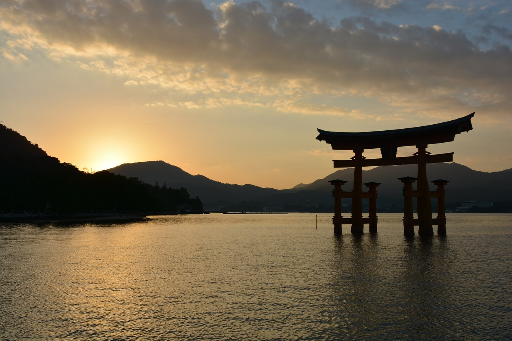

今回は風景写真を主体に使います。

本書で使用した画像はいずれも[Pixabay](https://pixabay.com/photos/mountains-sheep-lake-new-zealand-5487160/ "LINK")からダウンロードしたものです。投稿者の皆様、素敵な写真をありがとうございました。

画像 | 使用箇所 | サイズ | 投稿者 | URL
---|---|---|---|---
 | 1.1 | 1280x884 | VK1960 | `https://pixabay.com/photos/mountains-sheep-lake-new-zealand-5487160/`
 | 1.2 | 1280x853 |  glynn424 | `https://pixabay.com/photos/school-bodega-bay-california-169135/`
 | 2.3 |  1280x853 | IT-STUDIO | `https://pixabay.com/photos/shrine-torii-sunset-evening-sea-1030442/`
 | 4.1 | 1280x847 | USA-Reiseblogger | `https://pixabay.com/photos/usa-america-california-sequoias-1669714/`
 | 4.2 | 1280x960 | Prow | `https://pixabay.com/photos/austria-vienna-vienna-city-hall-764989/`
 | 4.4 | 1280x581 | dretzlaff | `https://pixabay.com/photos/san-francisco-market-street-2369581/`