### 使用したテスト画像

> このページはコード付属のテスト画像の出所を明らかにするためのもので、書籍の一部ではありません。

本書で使用した画像は、筆者が作成した数点を除いて、いずれも[Pixabay](https://pixabay.com/photos/mountains-sheep-lake-new-zealand-5487160/ "LINK")からダウンロードしたものです。投稿者の皆様、素敵な写真をありがとうございました。

画像 | 使用箇所 | サイズ | 投稿者 | URL
---|---|---|---|---
 | 1.2, 1.3 | 1280x884 | VK1960 | `https://pixabay.com/photos/mountains-sheep-lake-new-zealand-5487160/`
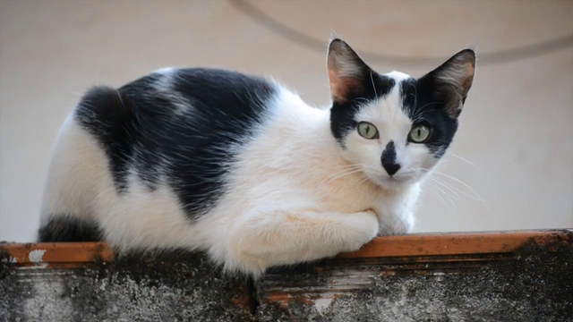 | 1.4, 1.5, 1.6, 1.7, 1.9 | 640x360 | Luiz-Jorge-Artista | `https://pixabay.com/videos/cat-gata-feline-wall-animal-3245/`
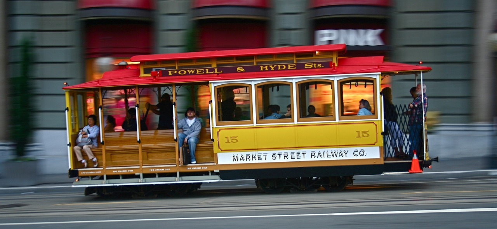 | 2.1 | 1280x581 | dretzlaff | `https://pixabay.com/photos/san-francisco-market-street-2369581/`
 | 2.2 | 640x360 | Coverr-Free-Footage | `https://pixabay.com/photos/san-francisco-market-street-2369581/`
 | 2.4 | 1280x960 | Ben_Kerckx | `https://pixabay.com/photos/san-gimignano-buildings-architecture-228455/`
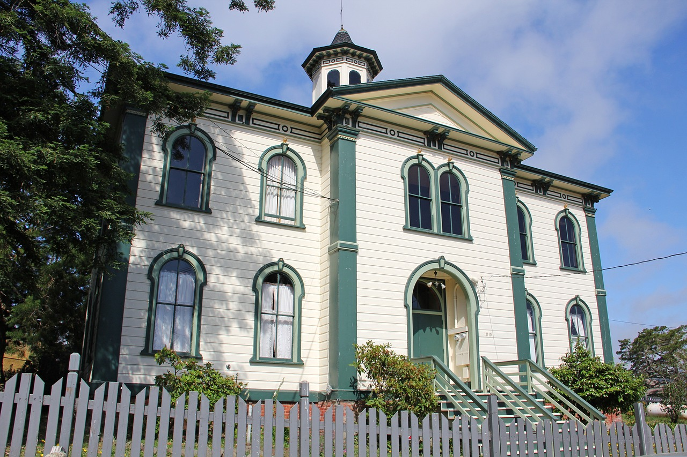 | 2.5, 2.6 | 1280x853 |  glynn424 | `https://pixabay.com/videos/new-york-city-manhattan-people-cars-1044/`
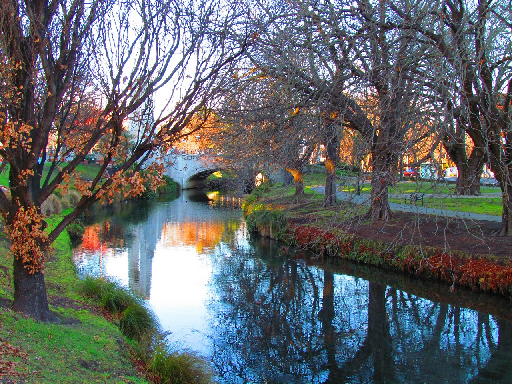 | 2.7 | 1280x960 |  csharker | `https://pixabay.com/photos/christchurch-new-zealand-bridge-fall-170557/`
 | 3.3 |  1280x853 | IT-STUDIO | `https://pixabay.com/photos/shrine-torii-sunset-evening-sea-1030442/`
 | 4.1 | 1280x948 | 12019 | `https://pixabay.com/photos/seattle-washington-sunset-dusk-1619505/`
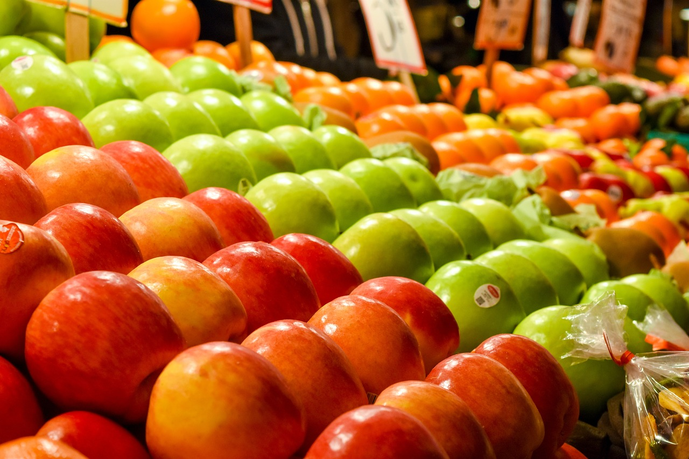 | 4.2 | 1280x853 | coryclayful | `https://pixabay.com/photos/apples-market-seattle-pike-place-3690021/`
 | 4.3 | 256x256 | 自作 | --
 | 4.8 | 1280x853  | InfiniteThought | `https://pixabay.com/users/infinitethought-5496829/`
 | 5.1 | 1280x847 | USA-Reiseblogger | `https://pixabay.com/photos/usa-america-california-sequoias-1669714/`
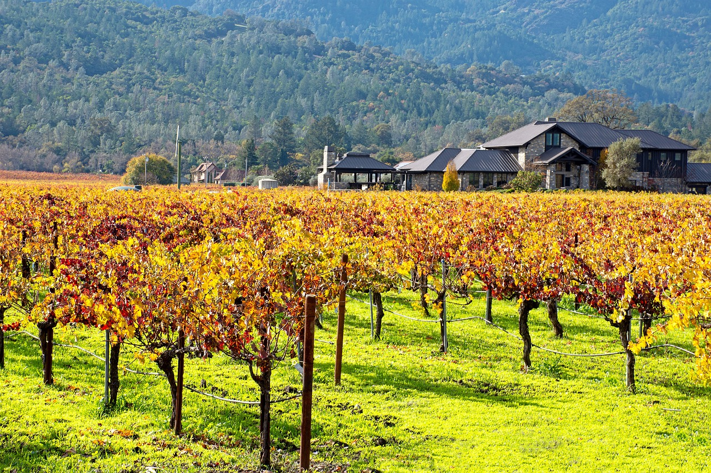 | 5.2 | 1280x853 | aga2rk | `https://pixabay.com/photos/autumn-vineyard-california-4606726/`
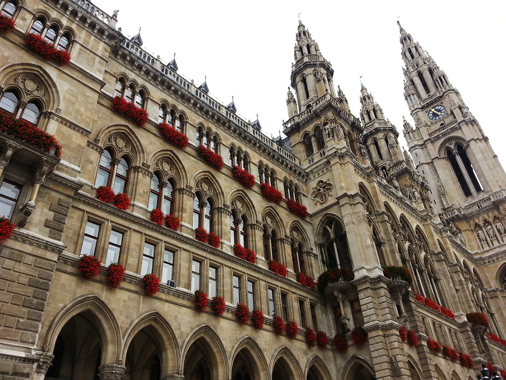 | 5.3 | 1280x960 | Prow | `https://pixabay.com/photos/austria-vienna-vienna-city-hall-764989/`
 | 5.4 | 1280x960 | Hans | `https://pixabay.com/photos/eggs-multicoloured-easter-eggs-100165/`
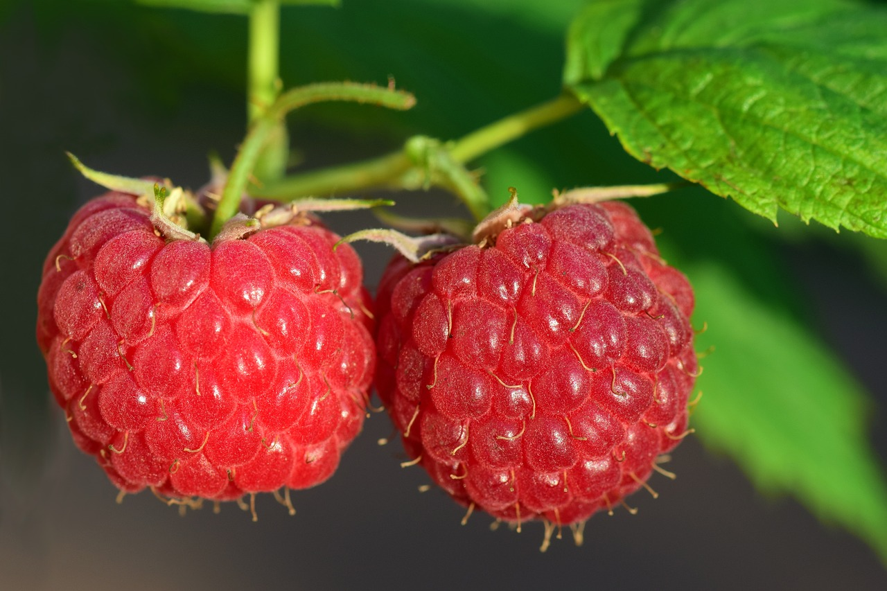 | 5.6 | 1280x853 | ulleo | `https://pixabay.com/photos/raspberries-red-fruit-berry-ripe-3454504/`
 | 5.7, 5.8 | 961x1080 | jahnkrieger | `https://pixabay.com/photos/palm-beach-sunset-palm-tree-coast-6177973/`
 | 5.8 | 961x1080 | FelixMittermeier | `https://pixabay.com/photos/milky-way-stars-night-sky-2695569/`
 | 6.1 | 1280x855 | Designer-Obst | `https://pixabay.com/photos/cat-tree-climb-kitten-domestic-cat-2902599/`
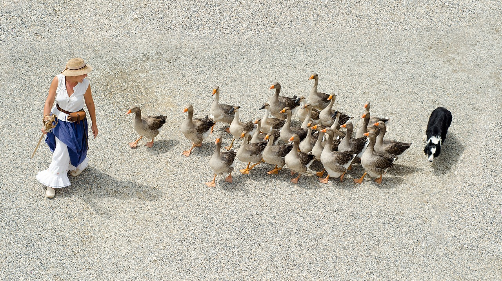 | 6.2 | 1280x716 | Skitterphoto | `https://pixabay.com/photos/geese-girl-dog-shepherd-herding-908291/`
 | 6.3 | 960x1280 | canem-ffb | `https://pixabay.com/photos/italy-puglia-ostuni-fiat-500-road-1858331/`
 | 6.4 | 640x640 | keenyam | `https://pixabay.com/illustrations/rabbits-animal-background-easter-4883006/`
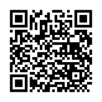 | 6.4 | 210x210 | 自作 | Python `qrcode`で生成。
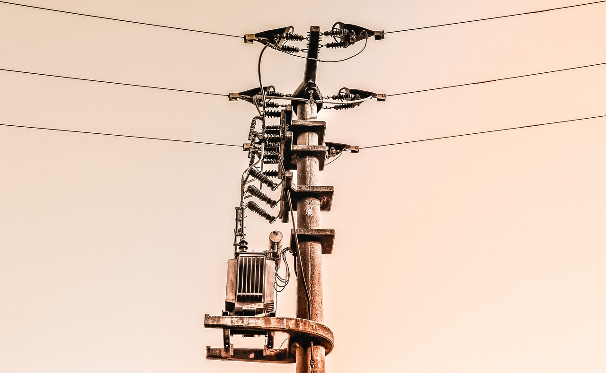 | 6.5 | 1280x788 | analogicus | `https://pixabay.com/photos/power-pole-structure-architecture-3906852/`

 | 6.5 | 482x711 | 自作 | スキャン画像
 |  | 640x360 | Coverr-Free-Footage | `https://pixabay.com/videos/subway-metro-train-urban-city-1003/`

 | 4.4 2値化 | 961x1113 | jawajeziorski | `https://pixabay.com/photos/tongariro-new-zealand-volcanoes-6286058/`
 | 4.8 | 1135-1280 | 12019 | `https://pixabay.com/photos/seattle-washington-city-urban-2534690/`

