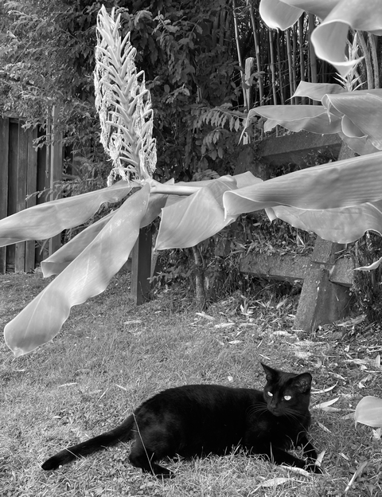

### 著者プロフィール

豊沢 聡（とよさわ さとし）

電話会社、教育機関、ネットワーク機器製造会社を経由して、ただいま絶賛無職中。著書、訳書、監修書はこれで38冊目。主な著書に『[試せばわかる! コマンドで理解するTCP/IP](https://www.kadokawa.co.jp/product/200802000528/ "LINK")』（アスキー、2008）、『[jqハンドブック](https://www.cutt.co.jp/book/978-4-87783-491-3.html "LINK")』（カットシステム、2021）、『[jqクックブック](https://www.cutt.co.jp/book/978-4-87783-508-8.html "LINK")』（カットシステム、2023）、『[TCP/IPのツボとコツがゼッタイにわかる本](https://www.shuwasystem.co.jp/book/9784798068664.html "LINK")』（秀和システム、2023）、訳書に『[詳細イーサネット第2版](https://www.oreilly.co.jp/books/9784873117171/ "LINK")』（オライリー・ジャパン、2015）、『[Fluent Python](https://www.oreilly.co.jp/books/9784873118178/ "LINK")』（オライリー・ジャパン、2017）、監修書に『[実践OpenCV 2.4 映像処理と解析](http://www.cutt.co.jp/book/978-4-87783-184-4.html "LINK")』（カットシステム、2013）がある。

  著者近影
